2022年买了不少游戏,大多成了`藏品`,没有太多想玩的欲望,~~什么电子杨伟~~,如果只是要单纯的列个表格出来,倒显得无趣了,我就简单聊一聊我玩过的印象比较深的游戏吧.

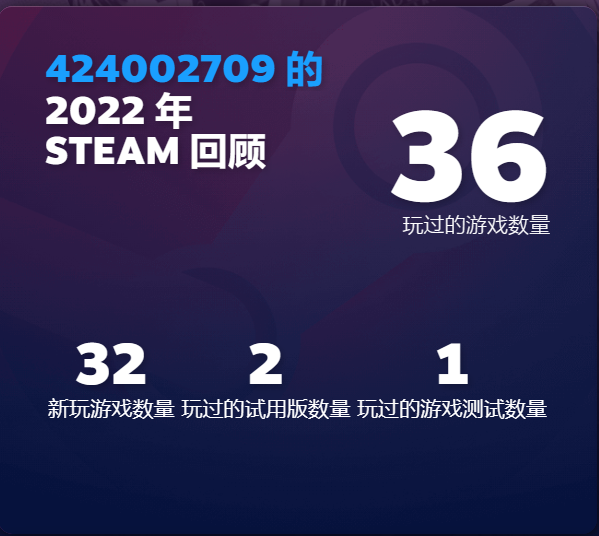

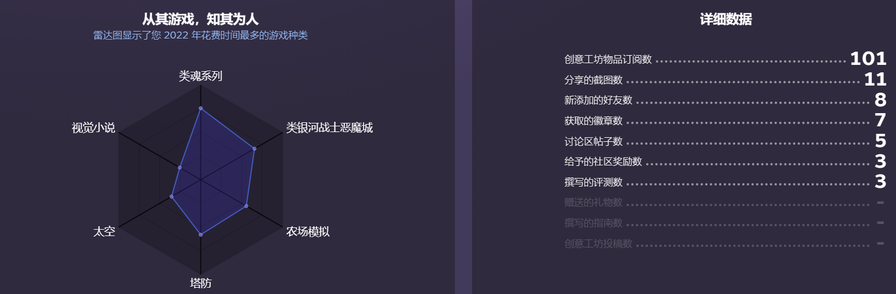

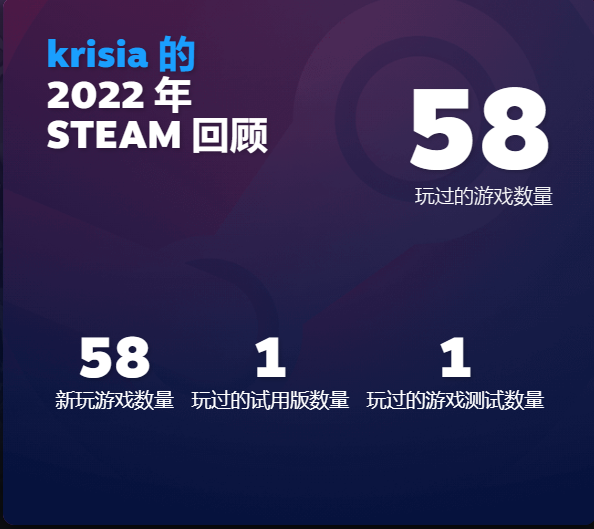

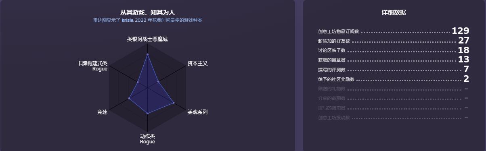

## 一.上半年---疫情---轻薄本扛大旗

2022年对于我来说可以简单分为上半年和下半年,上半年上海疫情闹得纷纷扬扬,我在宿舍差不多关了3个月,饭菜口味差天天吃盒饭,足不出户也洗不了澡,简直地狱.我在宿舍也只有一个轻薄本可玩...基本与3A无缘.

在这种情况下,我用核显打通了黑暗之魂3,AMD Ryzen 7 5700U这样一个低压zen2 cpu居然也能40帧(中低画质)左右,加上环印城和画中世界DLC总共80多个小时,期间还和两个室友三人联机.不过中途Fromsoft的服务器关了,不能再叫好哥哥帮忙了,按照黑魂3吧里的教程弄的私服又很不稳定,经常拉一个人要等半天...

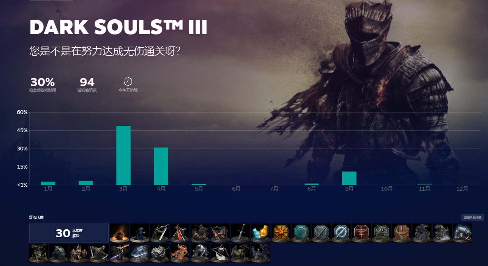

截图分享:

后面乘着打折入了只狼,游戏帧数就挺惨了,只有30帧不到,再加上操作和黑魂那一套完全不同,实在不习惯,打到蝴蝶夫人那里就弃了,之后有兴趣可能会捡回来接着玩.

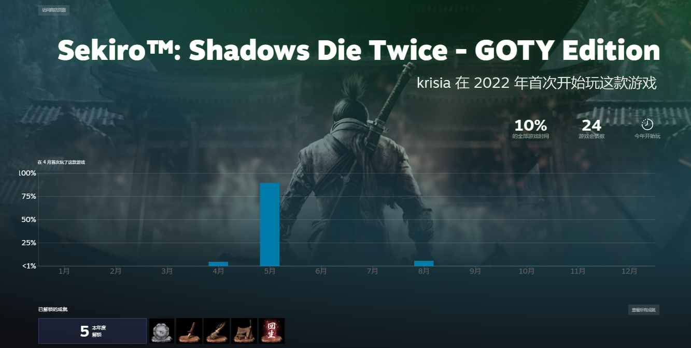

中途的小游戏没啥可说的...都是打发打发时间玩的.

## 二.下半年---高画质---台式机

我超,环!其实上半年刚出我就想买了,不过因为定价比较贵以及电脑性能带不动而作罢(然而我的舍友早就首发玩上了),期间还封校了,想换新电脑都没有条件,期间便混迹于卡吧图吧,一直蹲到矿潮快结束,大概是8月份配了一台r5 5600+Rtx2060的台式(后面显卡换了降价的6700xt并更换了2k高刷显示器),性能跟上了! 于是在国庆假期花费300大洋购买了游戏,用我的旧XBOX ones手柄通关了,法环的战技法术使用更多,还有骨灰这种官方逃课神器,其实相比魂三反倒变得简单了...

就我自己而言,玩法也不同了,我玩魂三的时候是纯纯战士加点,从法兰粪坑拿到流放者大刀就一直用翻滚加平A通关,基本没尝试过别的玩法.

法环自然要体验法爷,就点的法术加点了,前期用陨石球加名刀月影战技(虽然我玩的时候已经被削过了),后期用彗星亚兹勒和老婆🗡(祖传月光大剑)娱乐,打完皮蛋之后,用神躯化剑在鲜血王朝银行刷白金之子取钱,最后还是得叫上好哥哥才把女武神这个恶心boss给收拾掉了(手残...)

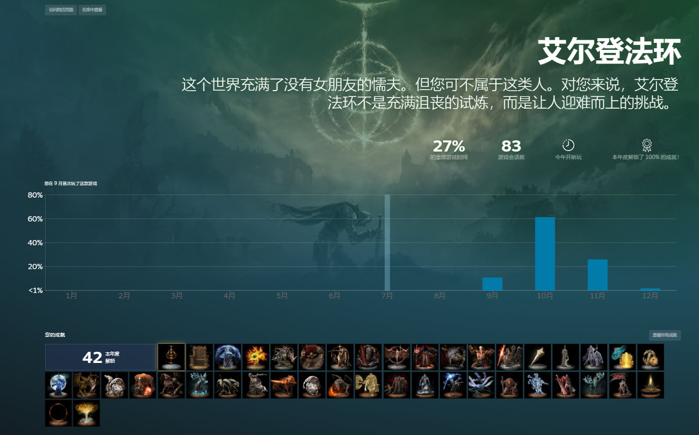

发现的小游戏,挺有意思的,据说是cy用关服的手游素材做的,算是简单的肉鸽,攻击是靠卡牌连携的和`ENDER LILIES` 手感类似,不过感觉人物机动性要好不少

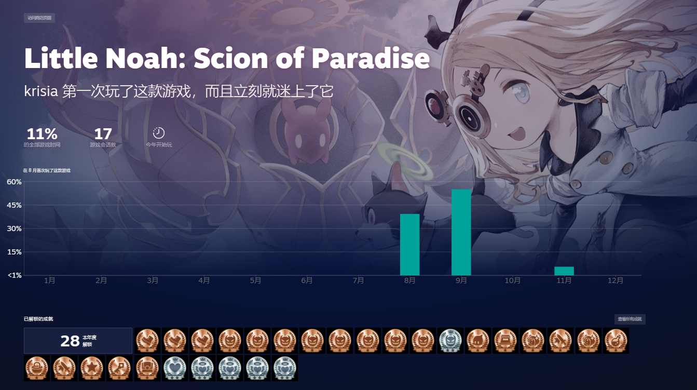

然后是巨硬的大作,地平线4,我就当开车看风景的,虽然我两年前就拿到驾照了,但这个游戏里开车感觉还是不习惯,拐弯经常撞...不过6700xt显卡能2k全高跑满显示器的170帧,开放世界赛车画面还是相当棒的,唯一的缺点是steam版没能体验到xbox手柄的扳机震动...

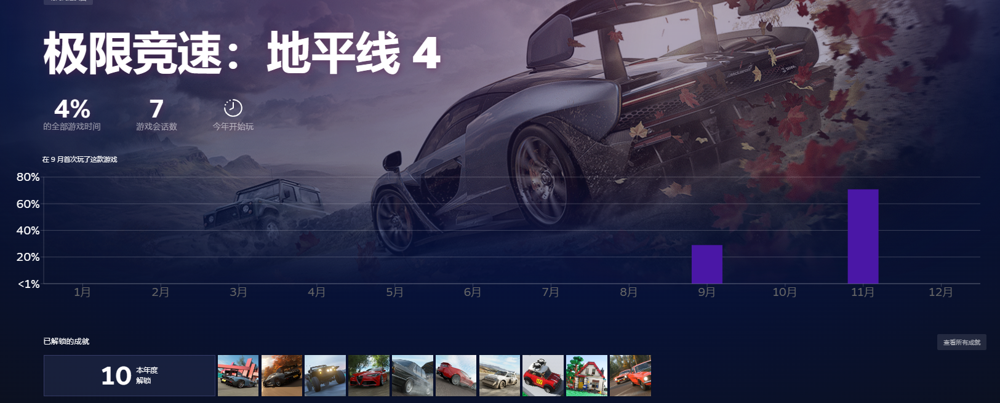

这个装机模拟器,呃呃,5月的记录大概是实际动手装机前的演练,11月算是真正在玩,自己当电脑城奸商给顾客装机也挺有意思🧐,这个最烦人的就是拆电脑拧螺丝,还有别忘了给cpu涂硅脂.前期给别人装了好多赛扬和gtx960🤣

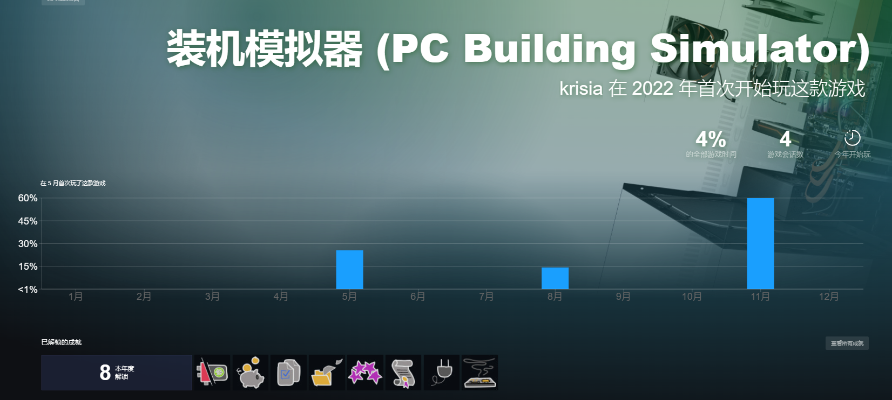

然后是最花钱的游戏---3dmark,估计我以后电脑升级都会跑几遍

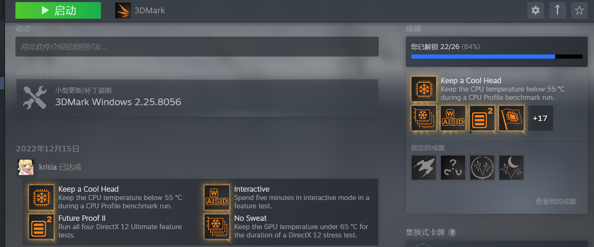

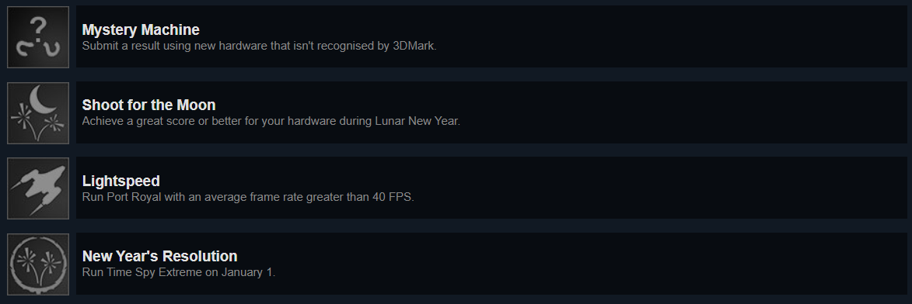

这四个成就因为我回老家只有笔记本就跑不了...神秘机器要去小黄鱼买es处理器来解锁,第三个基本要3080以上的显卡才能实现,最后的tse限制了`但是您的显卡至少要有 4 GB 的内存`核显就只能从内存那里共用2g的显存...还是等以后有时间升级配置了在学校跑吧.

前面的分别是我两张显卡的默频和超频分数以及轻薄本,还有一个我帮舍友的拯救者3060本子测试的(作为台式和笔记本对比项),可以发现a卡超频真的猛,直接提升了1000分(四舍五入就是一个笔记本核显)

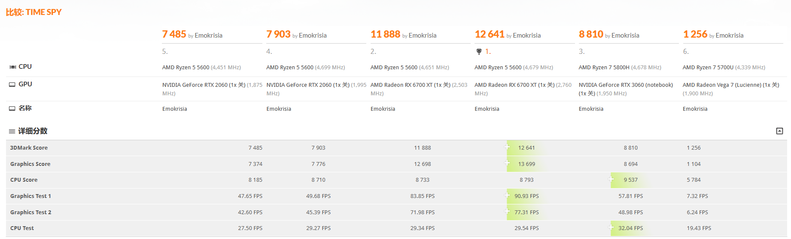

## 三.尾声

今年在steam上给我印象最深的大概也就是列出的几款,总之玩得很开心,期待2023年的法环DLC,装甲核心发售后看情况考虑是否购买吧,虽然是fs新作,但我对这类雀食不太熟,还是不要盲目跟风了...

明年应该暂时不会再升级电脑,对于市面上的2k游戏,我已经可以做到不用看配置直接购买了,而不需要像法环那样拖了半年才开始玩,对于学习和游戏来说已经满足需求了.不过,要是真的出了很有性价比的硬件估计还是会换的,不过看现在独立显卡市场上老黄的那套溢价玩意,以及不那么yes的a卡,或许显卡以后真成奢侈品了,那就真成DIY地狱了...

