# 一.起因

之前就有打算换回n卡，于是挑了半天选了张3070，前不久才把6700xt公版在海鲜市场卖掉，换回n卡似乎还多花了600多钱。。。不过n卡要玩ai之类的更方便，而且也保值一些，换的是碍国嘉旗舰/（次旗舰），亏了就亏了吧。

> 二手我倒是无所谓，新卡还是不推荐鸡架，毕竟有前科，有那钱不如买七彩虹火神或者猛禽。。。

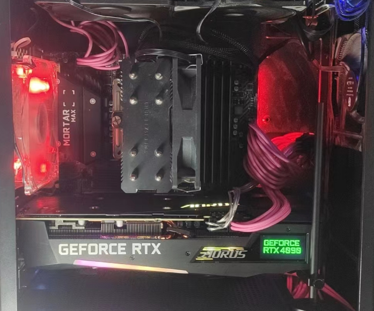

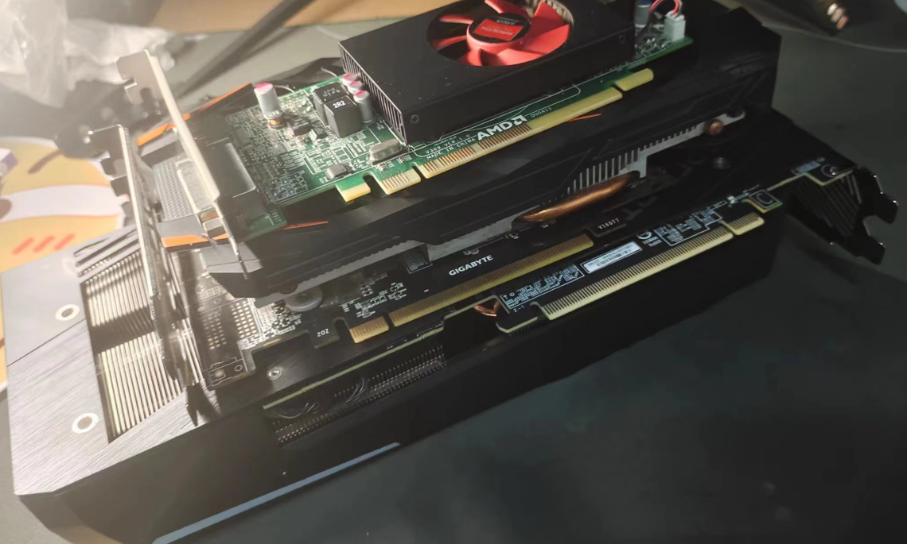

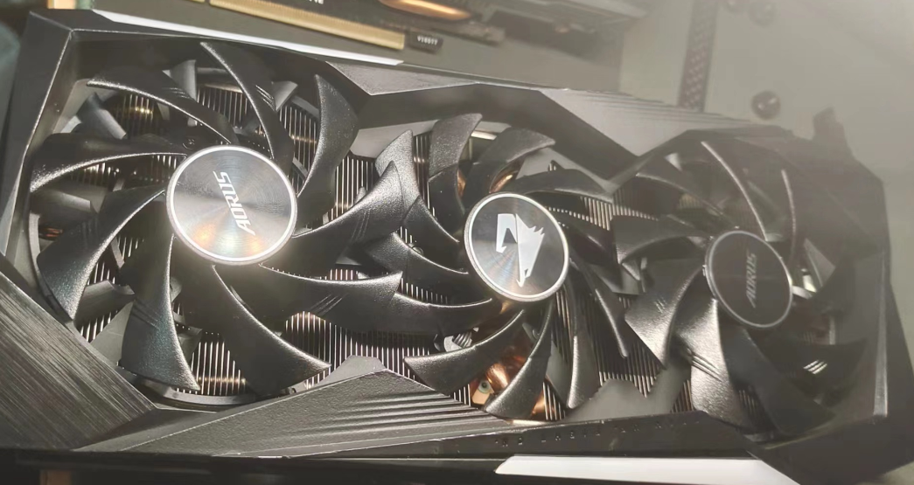

屁话不多说了，我新卡到手都是直接跑3dmark超频的，下面就直接上超频成绩吧。

# 二.超频成绩展示（部分项目）

## 1.Timespy(Dx12综合跑分)

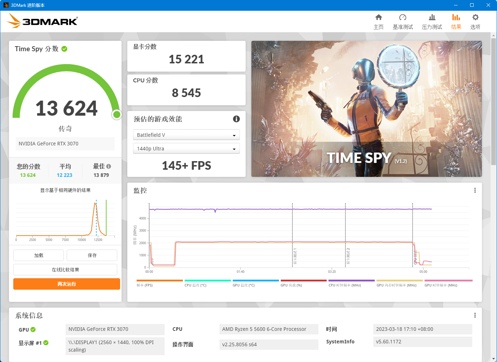

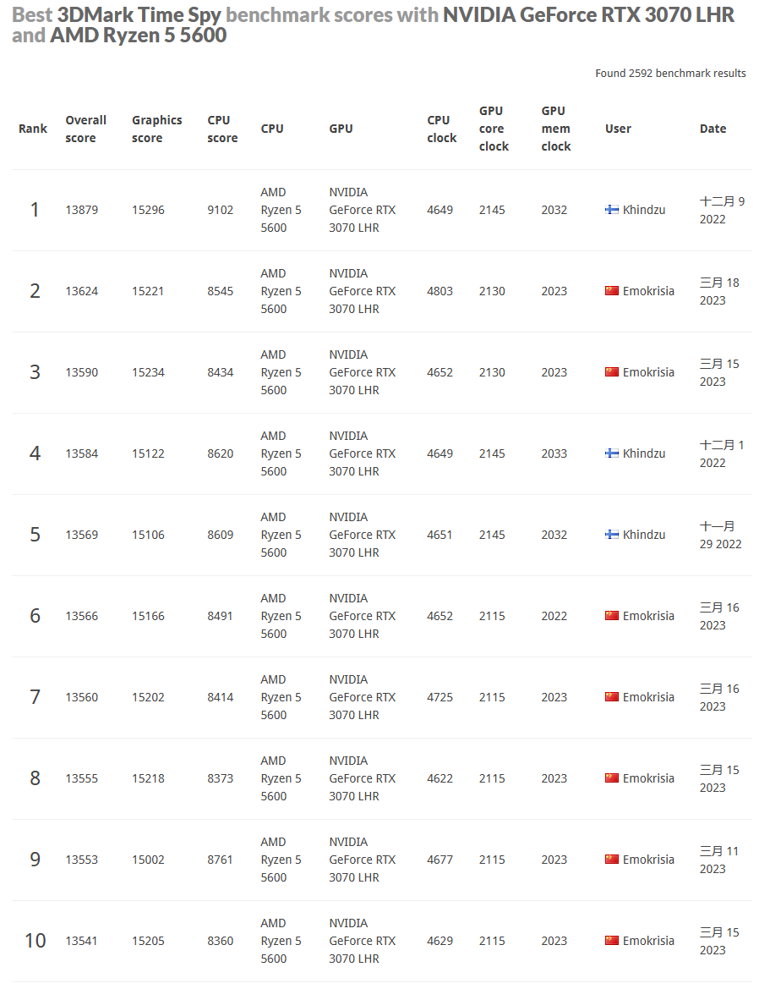

## 2.PortRoyal（光追测试）

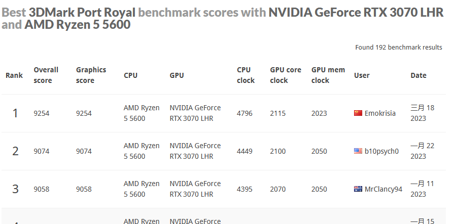

## 3.FireStrike（Dx11 1080p）

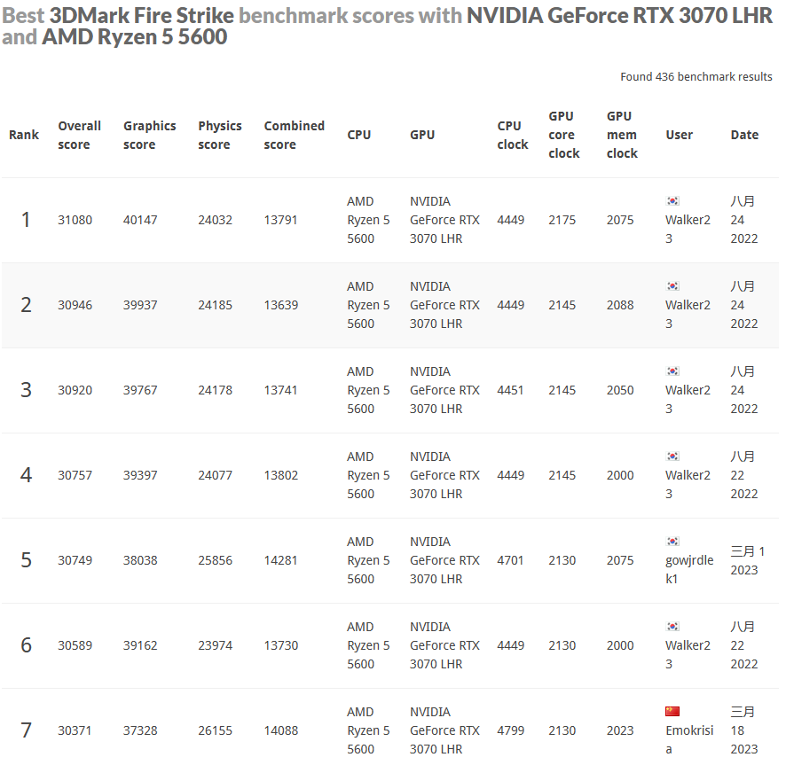

## 4.FireStrike Ex（Dx11 2k）

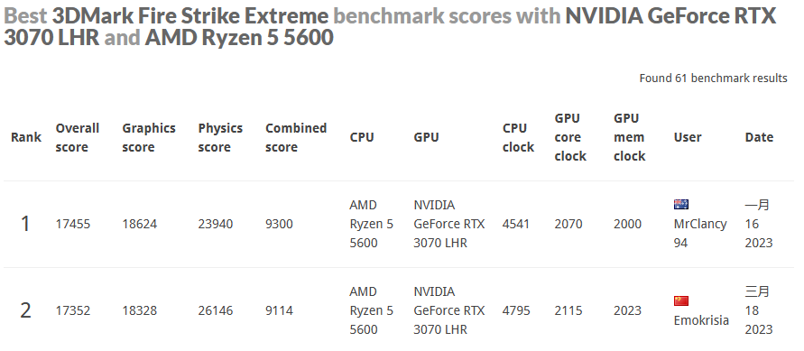

## 5.FireStrike Ultra（Dx11 4k）

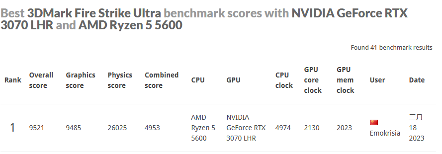

## 6.两冷门项目WildLife

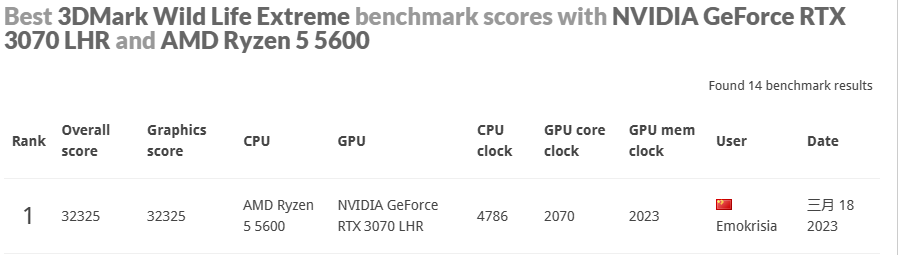

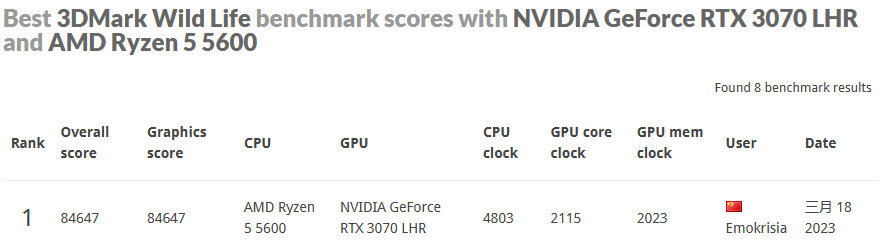

# 三.结尾

自己弄着玩的，如果是真的超频大佬的话优化空间很大，也不会像我这样cpu超频都搞不太定，我这就仅供娱乐了。

如果以后我又换卡，应该还会更类似的东西。。。