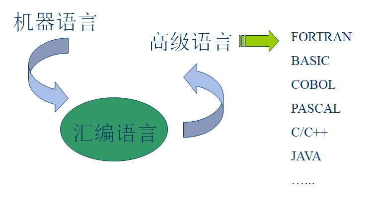
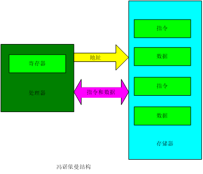
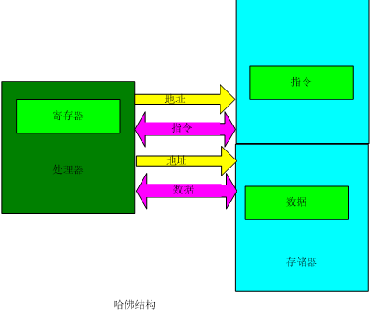
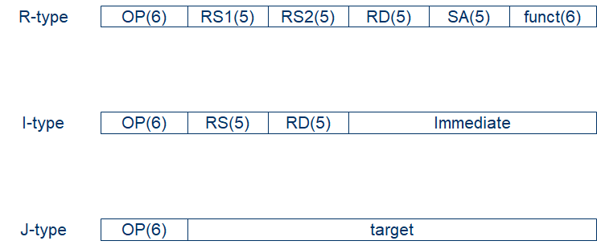
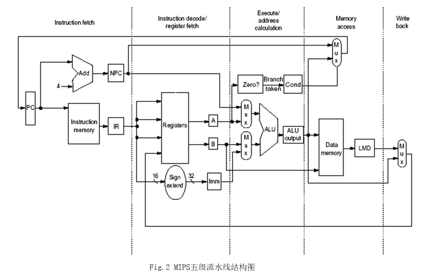
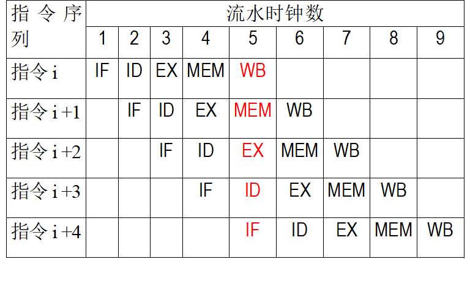
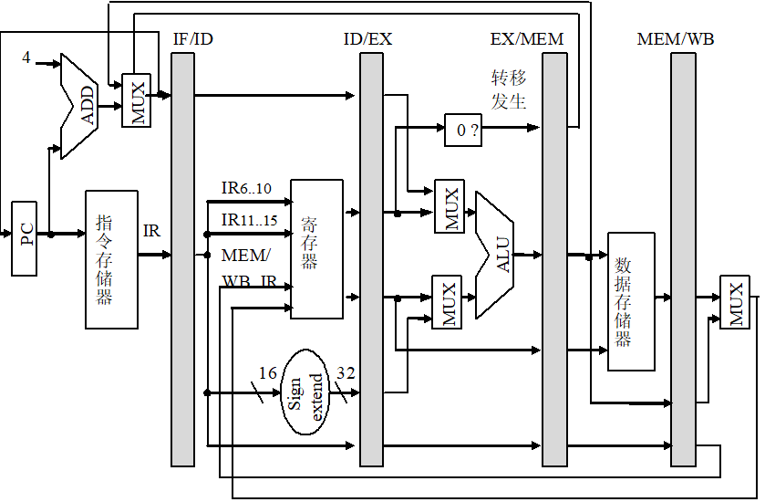
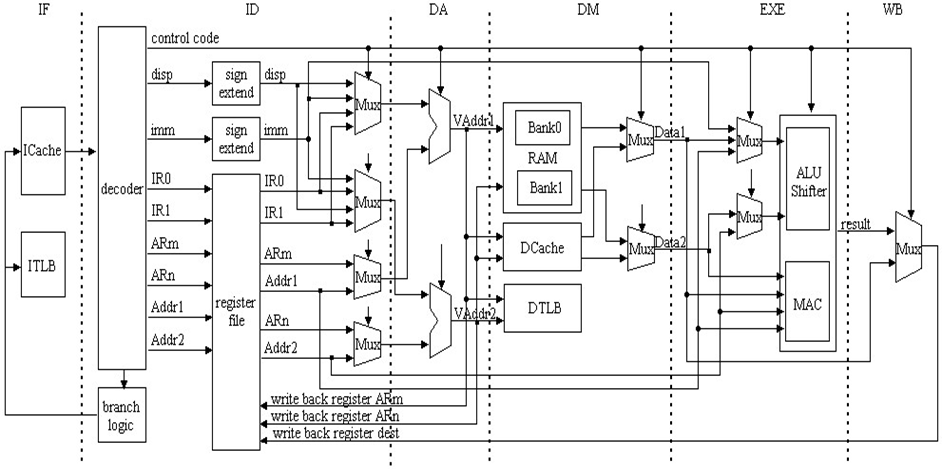

# **ARM体系结构与编程**

> 记录琚小明老师的arm体系结构课件
>
> **教材**
>
> 《ARM体系结构与编程》，杜春雷编著，清华大学出版社
>
> **参考资料**
>
> 《ARM 嵌入式系统结构与编程》，清华大学出版社2009年3月出版
>
> **http://www.arm.com/**
>
> **http://www.mips.com/**
>
> **目的**
>
> - 熟悉ARM体系结构
> - 掌握使用汇编语言设计、编写、调试和运行程序的方法
>
> **课程内容**
>
> - RISC体系结构介绍（新增）
> - ARM处理器体系结构
> - ARM指令寻址方式
> - ARM指令集
> - ARM汇编语言语法结构
> - ARM集成开发环境ADS
> - ARM异常中断处理

## 一.计算机语言发展简史



> 🔷**机器语言**：依赖于机器的低级语言，书写格式为二进制代码。
>
> ​      **优点**：执行速度快，效率高。
>
> ​	  **缺点**：表达的意义不直观，编写、阅读、调试较困难。  
>
> **🔷汇编语言**：是一种符号语言，与机器语言一一对应；使用助记符表示相应的操作，并遵循一定的语法规则。与机器语言有类似的优、缺点，但比机器语言更易于为人们所理解。
>
> **🔷高级语言**：面向人的语言，有多种类型。
>
> ​      **优点**：便于阅读，易学易用，不涉及硬件，具有通用性。
>
> ​      **缺点**：目标代码冗长，占用内存多，从而执行时间长，效率不高，不能对某些硬件进行操作。       

**汇编语言的特点：**

- 面向机器的低级语言，通常是为特定的计算机或计算机系列专门设计的。(ISA体系结构，面向特定的处理器)
- 保持了机器语言的优点，具有直接和简洁的特点。
- 可有效地访问、控制计算机的各种硬件设备，如磁盘、存储器、CPU、I/O端口等。
- 目标代码简短，占用内存少，执行速度快，是高效的程序设  计语言。
- 经常与高级语言配合使用（混合编程），应用十分广泛。

**汇编语言的应用：**

- 70%以上的系统软件是用汇编语言编写的。
- 某些快速处理、位处理、访问硬件设备等高效程序是用汇编语言编写的。
- 某些高级绘图程序、视频游戏程序、图像解压缩程序是用汇编语言编写的。

> ```
> 	  #include "stdafx.h"
>       #include "stdio.h"
>       int main(int argc, char* argv[])
>       {        int a,b,c;
>                 a=1; 
> 	    b=2;
> 	    c=a+b;
> 	    printf(“c=%d\n",c);
> 	    return 0;
>       }
> ```
>
> 以上程序段使用c++编译的目标文件达3.59kB
>
> 而汇编后的目标文件只有208字节

## 二.RISC处理器体系结构概述

### ISA体系结构分类

根据指令使用数据的方式，指令系统分为以下几类

🔷堆栈型(Stack)：操作数在栈顶，运算操作不用指定操作数

🔷累加器型(Accumulator)：一个操作数总在累加器中，结果也写回累加器

🔷寄存器型(Register)，每个操作数都由指令指定

- ​	Register-Register型，又称为Load-Store型，所有运算操作的操作数都在寄存器中
- ​	Register-Memory型
- ​	Memory-Memory型

上述三种指令系统类型也可以分别称为0地址指令，单地址指令，以及多地址指令

例子：不同指令系统完成C=A+B的指令序列，假设A、B、C在内存中不同的单元

| stack   | accumulator | Register  (memory-memory) | Register  (register-memory) | Register  (load-store) |
| ------- | ----------- | ------------------------- | --------------------------- | ---------------------- |
| push  A | load  A     | add  R1,A,B               | load  R1,A                  | load  R1,A             |
| push  B | add  B      | store  R1,C               | add  R1,B                   | load  R2,B             |
| add     | store  C    |                           | store  R1,C                 | add  R3,R1,R2          |
| pop  C  |             |                           |                             | store  R3,C            |

早期的计算机多用**堆栈和累加器型**指令

- 出于降低硬件复杂度的考虑
- 现在已经不用（Intel有点例外）

80年代后的机器主要是**寄存器型**

- 访问寄存器比访问存储器快
- 便于编译器使用和优化(操作单一，寄存器vs.内存)
- 寄存器可以用来存放变量，减少访存次数

处理器是一个执行存储器中指令的有限状态机，采用存储程序数字计算机的原理。

存储程序数字计算机把指令和数据存放在同一个存储器系统中，指令和数据可以放在一起或分开存放。

- 冯诺依曼结构
- 哈佛结构（感觉每堂课都在讲这个





> 冯.诺依曼型计算机的逻辑结构的三层含义：
>
> - 计算机应包含运算器、控制器、存储器、输入设备和输出设备五大基本部件；
> - 计算机内部采用二进制形式表示指令和数据；
> - 事先将编好的程序和始数据放入存储器中，计算机工作的时候能够自动高速地从存储器中提取指令并执行。

### CISC和RISC

> 复杂指令集计算机**CISC**（Complex Instruction Set Computer）增加指令的复杂度，一条指令在多个时钟周期内完成。
>
> 精简指令集计算机**RISC**（Reduced Instruction Set Computer）的思想起源于1980年斯坦福大学的一项处理器研究项目。RISC的指令是在单个时钟周期内完成的。

#### 体系结构发展历程

计算机自40年代中叶问世以来，其体系结构的发展经历了：

简单-->复杂-->极其复杂-->简单-->复杂-->极其复杂

大规模集成电路VLSI技术的发展促进了处理器体系结构的发展。

#### **CISC**

CISC的**特点**： （VAX机）

- 指令格式不固定，指令可长可短，操作数可多可少；
- 寻址方式复杂多样，操作数可来自寄存器，也可来自存储器；
- 采用微程序控制，执行每条指令均需完成一个微指令序列；
- CPI > ５，指令越复杂，CPI越大。

CISC的**缺点**：

- 指令集虽大，但指令使用频度不均衡；**20%/80%****定律**：20%的指令的使用时间占80%的运行时间；常用指令数仅占指令集总数的10-20%。
- 微程序控制器制约了速度提高，因为存放微码的存储器速度比CPU慢5-10倍；CPI很大；
- CISC不利于先进指令级并行（ILP）技术的采用；
- 编译器代码优化困难。

#### RISC

> ##### RISC的提出与发展：
>
> - Load/Store结构提出： CDC6600(1963)--CRAY1(1976)
> - RISC思想最早在IBM公司提出，但不叫RISC，IBM801处理器是公认体现RISC思想的机器。
> - D. Patterson提出RISC名词，并研制了RISC-I,P实验样机。
> - J. Hennessy研制MIPS芯片（1982）。
> - 85年后推出商品化RISC:  MIPS1(1986)和SPARC V1(1987)

**RISC的贡献**

- RISC统一了计算机的体系结构，在此前的计算机体系结构是五花八门的（累加器结构，栈结构，寄存器-内存结构等）
- 提高了性能，在80年代中期，CPU的MIPS数由80年代初的2-3MIPS提高到200-300MIPS.
- Architecture与Compiler紧密相关（如静、动态调度，ILP)
- 流水线技术的应用

##### RISC的体系结构

RISC处理器的思想、特点

- 80%/20%定律
- 精简指令集（reduced instruction set）

典型的RISC处理器的结构：MIPS，ARM

流水线技术

##### RISC基本设计思想：

- 减小CPI:

   CPUtime=Instr_Count * CPI * Clock_cycle

- 精简指令集:保留最基本的，去掉复杂的，使用频度不高的指令

- 采用Load/Store结构，有助于大大减少指令格式，统一了存储器访问方式

- 采用硬接线控制代替微程序控制

##### RISC结构的特点：

- 寻址方式少，指令格式少且规整，指令长度统一(32bit)，便于提高流水线效率。(见MIPS指令格式)
- Load/store指令结构
- 大寄存器文件（32个32位寄存器）
- CPI接近于1，大多数指令单周期完成
- 硬接线控制器
- 有助于编译优化代码

> #### **CISC vs. RISC**
>
> 🔷CISC 复杂指令集计算机
>
> - 指令多，功能复杂，线路复杂
> - 指令长度不一，编程简单，控制复杂；
> - 寻址方式多，复杂；
> - 每条指令的执行周期数CPI在1～20；
>
> 🔷RISC 精简指令集计算机
>
> - 定长指令，条数少，多级流水线；
> - 指令简化令机器结构简单，译码简单统一、优化；
> - 寻址方式少，简单；
> - 特定指令访问内存，如：Load,Store；
> - 每条指令的执行周期数CPI在1～2；

#### MIPS指令格式



> **高性能典型RISC处理器**
>
> - SUN公司的SPARC
> - MIPS公司的SGI：MIPS
> - HP公司的PA-RISC
> - IBM, Motorola公司的PowerPC
> - DEC、Compac公司的Alpha



> **什么是流水线（pipeline)**
>
> **流水线**是实现多条指令**重叠执行**的技术，是加快CPU执行速度的关键技术。
>
> 术语：
>
> - 流水级（pipe stage):流水线由多个流水级组成，通常一条指令由n级流水级完成。每个流水级完成指令的部分任务。
>
> - 吞吐量（throughput):单位时间内流出流水线的指令数
>
> - **机器周期**（machine cycle):不同流水线完成指令功能不等，所需时间有长有短，因此设计流水线的关键是合理划分指令功能，使每一流水级完成指令功能的时间大致相等。机器周期由最长流水级的时间决定，通常等于时钟周期。
>
> - 理想流水线的加速因子（Speedup)
>
>   =非流水线机器指令的平均执行时间/
>
>      流水线机器指令的平均执行时间
>
>    =非流水线机器指令的平均执行时间/
>
>   非流水线机器指令的平均执行时间/流水级数
>
>     = 流水级数

以典型RISC体系结构计算机为例，RISC指令的流水线实现分五步（即5个时钟周期）完成：

##### 1、取指令周期（IF）

​       IR ¬ Mem[PC]

​       NPC ¬ PC + 4

##### 2 、译码/读寄存器周期（ID）

​       A ¬ Reg[IR 6..10]

​       B ¬ Reg[IR11..15]

​       Imm ¬ ( (IR16)16## IR16..31)

##### 3、执行/有效地址计算（EX）

-  Load/Store

  ​      ALUoutput ¬A+Imm

-  R-R ALU

  ​     ALUoutput ¬A func B

- R-I ALU

  ​     ALUoutput ¬A op Imm

-  Branch

  ​      ALUoutput ¬NPC + Imm;

  ​         Cond ¬A op 0

##### 4、存储器访问/转移完成（MEM）

- Load/Store： 

  ​    LMD ¬ Mem[ALUoutput]

  ​     Mem[ALUoutput] ¬ B

-  Branch

  ​    if (Cond) then PC¬ALUoutput

  ​               else  PC ¬ NPC

##### 5、写回周期（WB）

-  R-R ALU

  ​        Regs[IR16..20] ¬ ALUoutput

- R-I ALU

  ​       Regs[IR11..15] ¬ ALUoutput

-  Load

  ​       Regs[IR11..15] ¬ LMD



🔷在两个相邻节拍间增加一暂存器（锁存器）用来保留指令的状态(及数据),共有IF/ID,ID/EX, EX/MEM, MEM/WB四个.



#### RISC与DSP处理器的比较

| RISC处理器                                 | DSP处理器                                                    |
| ------------------------------------------ | ------------------------------------------------------------ |
| 简单指令集                                 | 复杂指令集                                                   |
| Load/store体系结构                         | 内存寻址方式                                                 |
| 大的通用寄存器文件                         | 特殊用途寄存器                                               |
| 高级语言支持                               | 汇编语言支持                                                 |
| 通用用途                                   | 信号处理                                                     |
| 缓存（cache）机制                          | 片上RAM                                                      |
| 单数据通道                                 | 多数据通道                                                   |
| 利用编译器产生汇编代码，目前有较好的编译器 | 目前没有较好的编译器，为了提高程序执行效率，代码关键部分采用手工书写 |

> 在DSP处理器中，除了Load/store之外的其它指令也可以访问存储单元。这样，地址计算和算术运算共用一个执行单元便不再能满足指令的需要。面向存储器的指令类型需要由专门的地址计算单元负责计算访问存储单元的数据地址，然后利用从存储单元中得到的数据进行算术运算。所以，DSP处理器往往将地址计算级安排在存储单元访问级之前进行，而指令执行级则安排在存储单元访问级之后进行。
>
> 实例：MD32媒体处理器使用6级流水, 这六级流水的名称和功能分别是：
>
> - IF级：取指令和计算新PC值。
> - ID级：指令译码。
> - DA级：计算源操作数的地址。
> - DM级：存储访问读写数据。
> - EX级：ALU操作和MAC操作。
> - WB级：将ALU和load指令的输出结果写入寄存器文件。
> - 

## 思考

- ISA处理器是如何实现中断机制的？
- 与X86处理器相比，RISC有哪些特点？ 
- 指令和数据是怎么存放的？处理器如何获得指令和数据的？


**复习：**

- 二进制、八进制、十六进制数的表示及相互转换
- 原码、补码和反码的表示形式

**练习**

- 与X86处理器相比，RISC有哪些特点？
- 描述典型RISC 5级流水的基本功能。