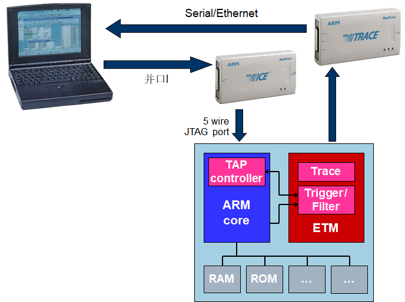

# 1.1 ARM 微处理器简介

- 成立于1990年11月
  - 前身为 Acorn计算机公司
  - ARM (Advance RISC Machine)
- 主要设计ARM系列RISC处理器内核
- 授权ARM内核给生产和销售半导体的合作伙伴
  - ARM 公司不生产芯片
  - IP(Intelligence Property)
- 另外也提供基于ARM架构的开发设计技术
  - 软件工具，评估板，调试工具，应用软件
  - 总线架构，外围设备单元，等等


# 1.2 ARM微处理器的应用领域及特点 (P.1)

## 1.2.1 ARM微处理器的应用领域

- 工业控制领域 ：高端微控制器 
- 无线通讯领域 ：无线通讯设备 
- 网络应用 ：宽带技术、语音及视频处理 
- 消费类电子产品 ：数字音频播放器、数字机顶盒和游戏机 
- 成像和安全产品 ：数码相机、打印机及32位SIM智能卡 


**ARM嵌入式处理器的片上系统**

- 基于ARM嵌入式处理器的片上系统解决方案可应用于企业应用、汽车系统，家庭网络和无线技术等市场领域。
- ARM CortexTM系列提供了一个标准的体系结构来满足以上各种技术的不同性能要求，基于ARM架构有3个分工明确的系列：
  - A系列面向复杂的尖端应用程序，用于运行开放式的复杂操作系统;
  - R系列针对实时系统;
  - M系列专为低成本控制和微控制器应用开发。
- Cortex-M3是基于ARM架构的处理器，是专门为了在微控制器等对功耗和成本敏感的应用领域实现高系统性能而设计的，它简化了可编程的复杂性，使ARM架构成为各种应用方案的良好选择。

## 1.2.2 ARM微处理器的特点

采用RISC架构的ARM微处理器具有如下特点：

- 体积小、低功耗、低成本、高性能；
- 支持Thumb（16位）/ARM（32位）双指令集，能很好的兼容8位/16位器件；
- 大量使用寄存器，指令执行速度更快；
- 大多数数据操作都在寄存器中完成；
- 寻址方式灵活简单，执行效率高；
-  指令长度固定。

ARM体系的特别技术**（与IA-64比较）**：

- 在同一条数据处理指令中包含算术逻辑处理单元处理和移位处理。
- 使用地址自动增加（减少）来优化程序中循环处理
- load/store指令可以批量传输数据，从而提高数据传输的效率。
- 所有指令都可以条件执行。

# 1.3 ARM微处理器系列(P.7)

- ARM7系列
- ARM9系列
- ARM9E系列
- ARM10E系列
- ARM11系列
- SecurCore系列
- Intel的StrongARM
- Intel的Xscale
- CortexTM-M3

其中，ARM7、ARM9、ARM9E和ARM10为4个通用处理器系列，每一个系列提供一套相对独特的性能来满足不同应用领域的需求。SecurCore系列专门为安全要求较高的应用而设计


## 1.3.1 ARM7微处理器系列(P.7)

ARM7系列微处理器为低功耗的32位RISC处理器(三级流水：IF,ID,EX)，最适合用于对价位和功耗要求较高的消费类应用。

> ARM7TDMI 是基于 ARM7 内核
>
> 3 级流水线---0.9MIPS/MHz
>
> 冯.诺依曼架构:只有数据存储器接口，同时用来取指令和数据访问。
>
> CPI(Clock-Cycle Per Instruction) 约为1.9 
>
> ARM7没有MMU,ARM720T是MMU的 
>
> **T** - Thumb 架构扩展, 提供两个独立的指令集：
>
> - ARM 指令，均为 32位
> - Thumb指令，均为 16位
> - 两种运行状态，用来选择哪个指令集被执行
>
> **D** - 内核具有Debug扩展结构
>
> **M** - 增强乘法器 (32x32) 支持64位结果.
>
> **I**  - Embedded ICE-RT逻辑---提供片上断点和调试点支持

### ARM MMU工作原理

MMU: Memory Management Unit

CPU管理虚拟存储器、物理存储器，也负责虚拟地址映射为物理地址。

虚拟地址空间划分成称为页（page）的单位

而相应的物理地址空间也被进行划分，单位是页框(frame)

页和页框的大小必须相同


**ARM7系列微处理器的主要应用领域为：**

工业控制、Internet设备、网络和调制解调器设备、移动电话等多种多媒体和嵌入式应用。

数字蜂窝电话和硬盘驱动器。

ARM7系列微处理器包括如下几种类型的核：

- ARM7TDMI
- ARM7TDMI-S
- ARM720T
- ARM7EJ

 其中，ARM7TMDI是目前使用最广泛的32位嵌入式RISC处理器，属低端ARM处理器核。


### 指令流水线

为增加处理器指令流的速度，ARM7 系列使用3级流水线.

允许多个操作同时处理，比逐条指令执行要快。


 **PC**指向正被取指的指令，而非正在执行的指令

**最佳(理想)流水线**


o该例中用6个时钟周期执行了6条指令

o所有的操作都在寄存器中（单周期执行）

o指令周期数 (CPI) = 1

**LDR 流水线举例**


o该例中，用6周期执行了4条指令

o指令周期数 (CPI) = 1.5 

**分支流水线举例**


o流水线被阻断（ARM没有延时槽）

o注意:内核运行在ARM状态

**中断流水线举例**


 IRQ 中断的反应时间最小=7周期

## 1.3.2 ARM9微处理器系列(P.8)

ARM9系列微处理器在**高性能和低功耗特性**方面提供最佳的性能。具有以下特点：

- 5级整数流水线，指令执行效率更高。
- 提供1.1MIPS/MHz的**哈佛结构：**独立的指令和数据存储器接口，可同时取指和读写数据。
- 实现了一个周期完成loads指令和stores指令
  - 引入了独立的存储器和写回流水线，分别用来访问存储器和将结果写回寄存器。
- 支持32位ARM指令集和16位Thumb指令集。
- 支持32位的高速AMBA总线接口。
- 全性能的MMU，支持Windows CE、Linux、Palm OS等多种主流嵌入式操作系统。
- MPU支持实时操作系统。
- 支持数据Cache和指令Cache，具有更高的指令和数据处理能力。
- 增强型乘法器设计

 ARM9系列微处理器主要应用于无线设备、仪器仪表、安全系统、机顶盒、高端打印机、数字照相机和数字摄像机等。

 ARM9系列微处理器包含ARM920T、ARM922T和ARM940T三种类型，以适用于不同的应用场合。

>  ARM9E系列微处理器为可综合处理器，使用单一的处理器内核提供了微控制器、DSP、Java应用系统的解决方案，极大的减少了芯片的面积和系统的复杂程度。ARM9E系列微处理器提供了增强的DSP处理能力，很适合于那些需要同时使用DSP和微控制器的应用
>
> oARM9E系列微处理器的主要特点如下：
>
> - 支持DSP指令集，适合于需要高速数字信号处理的场合。
> - **5**级整数流水线，指令执行效率更高。
> - 支持32位ARM指令集和16位Thumb指令集。
> - 支持32位的高速AMBA总线接口。
> - 支持VFP9浮点处理协处理器。
> - 全性能的MMU，支持Windows CE、Linux、Palm OS等多种主流嵌入式操作系统。
> - MPU支持实时操作系统。
> - 支持数据Cache和指令Cache，具有更高的指令和数据处理能力。
> - 主频最高可达300MIPS。

**ARM9主要应用**

- 无线网络设备：手机上网、电子邮件及其他定位服务等功能；
- PDA功能：含有用户操作系统(Windows CE、Symbian OS、Linux等）及其他功能；
- 高性能功能：音频播放器、视频电话、手机游戏等。
- o在2.5G和3G的应用中ARM9已经全面替代了ARM7。
- ARM9典型处理器：S3C2440

### **ARM9TDMI**

- **Harvard**架构
- 增加了可用的存储器宽度
  - 指令存储器接口
  - 数据存储器接口
- 可以实现对指令和数据存储器的同时访问
- **5** **级流水线**
- **实现了以下改进：**
  - 改进 CPI 到 ~1.5
  - 提高了最大时钟频率

**ARM9TDMI流水线的变化**


**ARM9TDMI数据通道 (1)**


MU逻辑单元包含有：多路复用器,乘法器和桶形移位器


#### **LDR互锁**


本例中，用了7个时钟周期执行6条指令， CPI = 1.2 。

LDR指令之后立即跟一条数据操作指令，由于使用了相同的寄存器，将会导致互锁 。

#### 互锁(interlocks)技术

- 当指令需要的数据因为以前的指令没有执行完而没有准备好就会产生管道自锁互锁。
- 当管道互锁发生时，硬件会停止这个指令的执行，直到数据准备好为止。
- 编译器以及汇编程序员可以通过重新设计代码的顺序或者其他方法来减少管道互锁的数量


本例中，用了6个时钟周期执行6条指令， CPI = 1。

LDR指令没有引起流水线互锁


本例中，用了8个时钟周期执行5条指令， CPI = 1.6

在LDM期间，有并行的存储器访问和回写周期


本例中，用了9个时钟周期执行5条指令， CPI = 1.8 

此处SUB 使用了 R3，增加了一个额外的互锁周期来完成该寄存器数据的获取

这种情况对任何LDM 指令，像带IA, DB, FD,等，都会发生 。

## 1.3.4 ARM10E微处理器系列（P.9）

ARM10E系列微处理器具有高性能、低功耗的特点，由于采用了新的体系结构，与同等的ARM9器件相比较，在同样的时钟频率下，性能提高了近50％，同时，ARM10E系列微处理器采用了两种先进的节能方式，使其功耗极低。

ARM10E系列微处理器的主要特点如下：

- 支持DSP指令集，适合于需要高速数字信号处理的场合。
- **6**级整数流水线，指令执行效率更高。
- 支持32位ARM指令集和16位Thumb指令集。
- 支持32位的高速AMBA总线接口。
- 支持VFP10浮点处理协处理器。
- 全性能的MMU，支持Windows CE、Linux、Palm OS等多种主流嵌入式操作系统。
- 支持数据Cache和指令Cache，具有更高的指令和数据处理能力
- 主频最高可达400MIPS。
- 内嵌并行读/写操作部件，支持64位的load/store体系。

   ARM10E系列微处理器主要应用于下一代无线设备、数字消费品、成像设备、工业控制、通信和信息系统等领域。

  ARM10E系列微处理器包含ARM1020E、ARM1022E和ARM1026EJ-S三种类型，以适用于不同的应用场合。

### ARM10E 系列

**ARM1020E**

- v5TE架构
- CPI » 1.3
- 6 级流水线
- 静态分支预测
- 32kB 指令cache和32kB数据cache
  - 支持“Hit under miss”
  -  非阻塞的执行单元
- 每周期64 位的 LDM / STM操作
- Embedded ICE逻辑 - RT-II
- 支持新的 VFPv1 结构

**ARM1022E**

同上，除了cache大小为16kB

对SUDL(single user design license )有效

#### ARM10 与ARM9的流水线对比


#### ARM10 整数单元数据通道


### 顺序代码的执行 

 开始于64位的对齐地址


## 1.3.5 SecurCore微处理器系列(P.10)

 SecurCore系列微处理器专为安全需要而设计，提供了完善的32位RISC技术的安全解决方案，因此，SecurCore系列微处理器除了具有ARM体系结构的低功耗、高性能的特点外，还具有其独特的优势，即提供了对安全解决方案的支持。

SecurCore系列微处理器除了具有ARM体系结构各种主要特点外，还在系统安全方面具有如下的特点：

- 带有灵活的保护单元，以确保操作系统和应用数据的安全。
- 采用软内核技术，防止外部对其进行扫描探测。
- 可集成用户自己的安全特性和其他协处理器。

  SecurCore系列微处理器主要应用于一些对安全性要求较高的应用产品及应用系统，如电子商务、电子政务、电子银行业务、网络和认证系统等领域。

  SecurCore系列微处理器包含SecurCore SC100、SecurCore SC110、SecurCore SC200和SecurCore SC210四种类型，以适用于不同的应用场合。

## 1.3.6 StrongARM微处理器系列

Intel StrongARM SA-1100处理器是采用ARM体系结构高度集成的32位RISC微处理器。它融合了Intel公司的设计和处理技术以及ARM体系结构的电源效率，采用在软件上兼容ARMv4体系结构、同时采用具有Intel技术优点的体系结构。

 Intel StrongARM处理器是便携式通讯产品和消费类电子产品的理想选择，已成功应用于多家公司的掌上电脑系列产品。

## 1.3.7 Xscale处理器

 Xscale 处理器是基于ARMv5TE体系结构的解决方案，是一款全性能、高性价比、低功耗的处理器。它支持16位的Thumb指令和DSP指令集，已使用在数字移动电话、个人数字助理和网络产品等场合。

 Xscale 处理器是Intel目前主要推广的一款ARM微处理器。

## 1.3.8 CortexTM-?处理器

ARM公司在经典处理器ARM11以后的产品改用Cortex命名，Cortex系列属于ARMV7架构，这是ARM公司最新的指令集架构。

ARM V7架构定义了三大分工明确的系列：

- “A”系列面向尖端的基于虚拟内存的操作系统和用户应用；
- “R”系列针对实时系统；
- “M”系列对微控制器。

CortexTM-M3处理器采用了纯Thumb2指令的执行方式，使得这个具有32位高性能的ARM内核能够实现8位和16位处理器级数的代码存储密度。

CortexTM-R4处理器是首款基于ARM v7架构的高级嵌入式处理器，其目标主要为产量巨大的高级嵌入式应用方案，如硬盘，喷墨式打印机，以及汽车安全系统等等。

CortexTM-R4F处理器在CortexTM-R4处理器的基础上加入了代码错误校正（ECC）技术、浮点运算单元（FPU）以及DMA综合配置的能力。

CortexTM-A8是ARM公司所开发的基于ARMv7架构的首款应用级处理器，同时也是ARM所开发的同类处理器中性能最好、能效最高的处理器。

**Cortex-A8的系统框图**

Cortex-A8第一款基于ARMv7构架的应用处理器。专门提供了新的函数库（Artisan Advantage-CE）


**Cortex-R4的系统框图**

Cortex-R4是ARM开发的超标量结构的ARM内核，主要面向实时控制领域，如汽车刹车控制等


**Cortex-M3的系统框图**

Cortex-M系列主要面向单片机领域，可以说是51单品机的完美替代品。


# 1.4 ARM微处理器结构

## 1.4.1 RISC体系结构

传统的**CISC**（**Complex Instruction Set Computer**，复杂指令集计算机）结构有其固有的缺点，即随着计算机技术的发展而不断引入新的复杂的指令集，为支持这些新增的指令，计算机的体系结构会越来越复杂，然而，在CISC指令集的各种指令中，其使用频率却相差悬殊，大约有20％的指令会被反复使用，占整个程序代码的80％。而余下的80％的指令却不经常使用，在程序设计中只占20％，显然，这种结构是不太合理的。

基于以上的不合理性，1979年美国加州大学伯克利分校提出了**RISC**（**Reduced Instruction Set Computer**，精简指令集计算机）的概念，RISC并非只是简单地去减少指令，而是把着眼点放在了如何使计算机的结构更加简单合理地提高运算速度上。RISC结构优先选取使用频度最高的简单指令，避免复杂指令；将指令长度固定，指令格式和寻址方式种类减少；以控制逻辑为主，不用或少用微码控制等措施来达到上述目的。


到目前为止，RISC体系结构也还没有严格的定义，一般认为，RISC体系结构应具有如下特点：

- **采用固定长度的指令格式，指令归整、简单、基本寻址方式有2-3种。**
- **使用单周期指令，便于流水线操作执行。**
- **大量使用寄存器，数据处理指令只对寄存器进行操作，只有加载/存储指令可以访问存储器，提高指令的执行效率。**

除此以外，ARM体系结构还采用了一些特别的技术，在保证高性能的前提下尽量缩小芯片的面积，并降低功耗：

- **所有的指令都可根据前面的执行结果决定是否被执行，从而提高指令的执行效率。（条件执行）**
- **可用加载/存储指令批量传输数据，以提高数据的传输效率。**
- **可在一条数据处理指令中同时完成逻辑处理和移位处理。**
- **在循环处理中使用地址的自动增减来提高运行效率。**

当然，和CISC架构相比较，尽管RISC架构有上述的优点，但决不能认为RISC架构就可以取代CISC架构，事实上，RISC和CISC各有优势，而且界限并不那么明显。现代的CPU往往采用CISC的外围，内部加入了RISC的特性，如**超长指令集**CPU就是融合了RISC和CISC的优势，成为未来的CPU发展方向之一。

#### ARM协处理器


- 多达16个可定义协处理器,用唯一的ID来标示 
- 扩充ARM指令集
- 通常用作ARM “internal functions” (例如：cp15通常 用作 ARM cache 控制器)
- 通常系统设计的时候最好用**内存映射外设**
  - 容易实现

## 1.4.2 数据和指令类型

ARM 采用的是32位架构.

ARM 约定:

- **Byte** **：**   **8 bits (1 byte)**
- **Halfword** **：** **16 bits (2 bytes)**
- **Word :   32 bits (4 bytes)**

大部分ARM core 提供：

- ARM 指令集（32-bit） 
- Thumb 指令集(T变种)（16-bit ） 

#### 字节顺序


## **1.4.3 ARM**体系结构的异常中断

ARM 有7个基本工作模式:

- **User**:非特权模式，大部分任务执行在这种模式
  - 正常程序执行的模式
- **FIQ**:当一个高优先级(fast)中断产生时将会进入这种模式
  - 高速数据传输和通道处理
- **IRQ**:当一个低优先级(normal)中断产生时将会进入这种模式
  - 通常的中断处理
- **Supervisor**:当复位或软中断指令执行时将会进入这种模式
  - 供操作系统使用的一种保护模式
- **Abort**: 当存取异常时将会进入这种模式
  - 虚拟存储及存储保护(指令预取和存取操作)
- **Undef**: 当执行未定义指令时会进入这种模式
  - 软件仿真硬件协处理器
- **System**: 使用和User模式相同寄存器集的特权模式
  - 特权级的操作系统任务

#### 系统模式

解决异常可重入问题的，就是如果异常处理函数中有函数调用的话要进入系统模式执行，因为使用的是用户模式的lr，这样就避免如果来了相同的异常造成lr_mode被复写，陷入死循环的问题

## 1.4.4 ARM微处理器的寄存器结构(P.11)

ARM处理器共有37个寄存器，被分为若干个组（bank），这些寄存器包括：

- 31个通用寄存器，包括程序计数器（PC指针），均为32位的寄存器。
- 6个状态寄存器，用以标识CPU的工作状态及程序的运行状态，均为32位，目前只使用了其中的一部分。

同时，ARM处理器又有7种不同的处理器模式，在每一种处理器模式下均有一组相应的寄存器与之对应。即在任意一种处理器模式下，可访问的寄存器包括15个通用寄存器（R0～R14）、一至二个状态寄存器和程序计数器。在所有的寄存器中，有些是在7种处理器模式下共用的同一个物理寄存器，而有些寄存器则是在不同的处理器模式下有不同的物理寄存器。

关于ARM处理器的寄存器结构，在后面的相关章节将会详细描述

#### 异常处理

当异常产生时, ARM core:

- **拷贝** **CPSR** **到** **SPSR_<mode>**
- **设置适当的** **CPSR** **位：** 
- **改变处理器状态进入** **ARM** **态**
- **改变处理器模式进入相应的异常模式**
- **设置中断禁止位禁止相应中断** (若需要）
- **保存返回地址到** **LR_<mode>**
- **设置** **PC** **为相应的异常向量**

返回时, 异常处理需要:

- **从** SPSR_<mode>恢复CPSR
- 从LR_<mode>恢复PC

> Note:这些操作只能在 ARM 态执行


## 1.4.5 ARM微处理器的指令结构

ARM微处理器的在较新的体系结构中支持两种指令集：

- ARM指令集
- Thumb指令集
-  其中，ARM指令为32位的长度，Thumb指令为16位长度。Thumb指令集为ARM指令集的功能子集，但与等价的ARM代码相比较，可节省30％～40％以上的存储空间，同时具备32位代码的所有优点。

关于ARM处理器的指令结构，在后面的相关章节将会详细描述。

#### ARM指令集

- 所有ARM指令均为32-bits长
- 大部分为单周期指令
- 所有指令都可以条件执行
- 采用 Load/Store 架构

```
#数据处理指令：
 SUB    r0,r1,#5		;r1-5->r0	  
 ADD    r2,r3,r3,LSL #2	;R3x4+r3->r2
 ANDS   r4,r4,#0x20		;r4+0x20->r4,更新条件码标志位
 ADDEQ  r5,r5,r6		;r5+r6->r5(条件-相等)
#存储器存取指令：
 LDR    r0,[r1],#4	;r1+4->r0
 STRNEB r2,[r3,r4]	;NE符合-将r2低8位数写到[r3+r4]内存单元
 LDRSH  r5,[r6,#8]! 	;[r6+8]->r5(半字节),r5中高16位设置成字节的符位
 STMFD  sp!,{r0,r2-r7,r10}	;压栈 
```

ARM 跳转分支指令

- B <label>
  - PC ±32 Mbyte .
- BL <子程序>
  - 保存返回地址到 LR
  - 返回时从 LR 恢复 PC
  - 对于 non-leaf 函数, LR 必须压栈保存


#### Thumb指令集

•Thumb 是一个 16-bits 指令集

​	–优化代码密度 (~65% of ARM )

​	–提高窄内存操作性能

​	–是ARM指令集的一个功能子集

•ARM / Thumb 转换使用 **BX** 指令


#### ARM / Thumb 性能分析


#### Jazelle

- Jazelle 使得 ARM cores 执行 8-bit 的Java 字节码
  - 95% 的字节码执行使用 hardware (typical)
    - Normal JVM: 1.0 Caffeinemarks/MHz
    - ARM9EJ: 5.5 Caffeinemarks/MHz
  - 更高的性能
  - 增加的门电路<12K （ARM9EJ-S 同 ARM9E-S比较）
- ARM JTEK (Java Technology Enabling Kit) 提供支持代码

# 1.5 ARM微处理器的应用选型

- ARM微处理器内核的选择
  - 从前面所介绍的内容可知，ARM微处理器包含一系列的内核结构，以适应不同的应用领域，用户如果希望使用WinCE或标准Linux等操作系统以减少软件开发时间，就需要选择ARM720T以上带有MMU（Memory Management Unit）功能的ARM芯片，ARM720T、ARM920T、ARM922T、ARM946T、Strong-ARM都带有MMU功能。而ARM7TDMI则没有MMU，不支持Windows CE和标准Linux，但目前有uCLinux等不需要MMU支持的操作系统可运行于ARM7TDMI硬件平台之上。事实上，uCLinux已经成功移植到多种不带MMU的微处理器平台上，并在稳定性和其他方面都有上佳表现。
- 系统的工作频率
  - 系统的工作频率在很大程度上决定了ARM微处理器的处理能力。ARM7系列微处理器的典型处理速度为0.9MIPS/MHz，常见的ARM7芯片系统主时钟为20MHz-133MHz，ARM9系列微处理器的典型处理速度为1.1MIPS/MHz，常见的ARM9的系统主时钟频率为100MHz-233MHz，ARM10最高可以达到700MHz。不同芯片对时钟的处理不同，有的芯片只需要一个主时钟频率，有的芯片内部时钟控制器可以分别为ARM核和USB、UART、DSP、音频等功能部件提供不同频率的时钟

- 芯片内存储器的容量
  - 大多数的ARM微处理器片内存储器的容量都不太大，需要用户在设计系统时外扩存储器，但也有部分芯片具有相对较大的片内存储空间，如ATMEL的AT91F40162就具有高达2MB的片内程序存储空间，用户在设计时可考虑选用这种类型，以简化系统的设计。
- 片内外围电路的选择
  - 除ARM微处理器核以外，几乎所有的ARM芯片均根据各自不同的应用领域，扩展了相关功能模块，并集成在芯片之中，称之为片内外围电路，如USB接口、IIS接口、LCD控制器、键盘接口、RTC、ADC和DAC、DSP协处理器等，设计者应分析系统的需求，尽可能采用片内外围电路完成所需的功能，这样既可简化系统的设计，同时提高系统的可靠性。

# 1.6 基于ARM系统设计示例


•AMBA

–Advanced Microcontroller Bus Architecture

•ADK

Complete AMBA Design Kit

•ACT

–AMBA Compliance Testbench

•PrimeCell

–ARM’s AMBA compliant peripherals

> **ARM Developer Suite 1.2**
>
> ADS1.2是为嵌入式ARM开发而设计的一整套软件开发工具
>
> 从最初的软件原型到最终优化的ROM代码。
>
> ADS1.2发布于2001的12月份
>
> 支持的主机系统
>
> - IBM compatible PCs with Windows 95, 98, 2000, ME or NT4
> - Sun workstations with Solaris 2.6, 2.7 or 2.8
> - HP workstations with HPUX 10.20, 11
> - Red Hat Linux 6.2 & 7.1
>
> 使用FLEXLM管理器,管理它的LICENSE
>
> 45天的评估版软件
>
> 第三方工具支持:
>
> **http://www.arm.com/DevSupp/**

**使用 Multi-ICE 调试**


- 被调试的系统可以是最终系统!
- 也可以使用第三方开发调试工具。



- **Embedded Trace** **Macrocell** **(ETM)**
  - 实时指令 (PC) 跟踪
  - 实时数据访问跟踪
  - 包含 ICE功能（trigger & filter logic）
- **MultiTrace** **Trace Port Analyzer (TPA)**
  - 更深层次的追踪
- **Trace Debug Tools**
  - 通过 JTAG/Multi-ICE配置 ETM 跟踪
  - 从ETM/MultiTrace接收跟踪信息
  - 使用源代码镜像文件得到 ETM跟踪的数据

# 1.7 本章小节

本章对ARM微处理器、ARM技术的基本概念做了一些简单的介绍，通过对本章的学习，能对ARM微处理器、ARM技术有一个总体上的认识