# 本章的主要内容

- ARM微处理器的工作状态
- ARM体系结构的存储器格式
- ARM微处理器的指令长度及数据类型
- ARM微处理器的工作模式
- ARM体系结构的寄存器组织
- ARM微处理器的异常状态

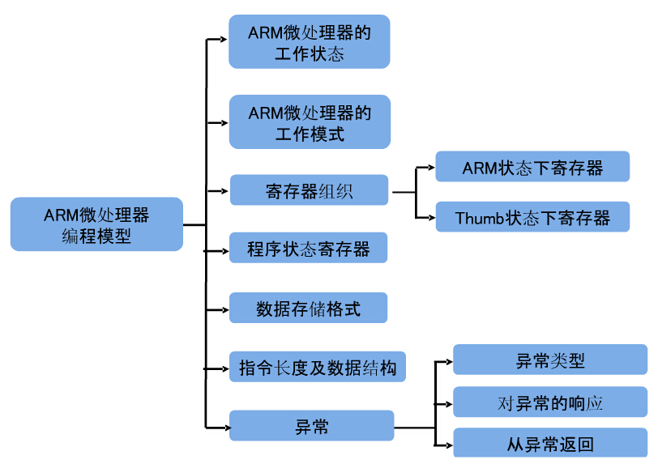

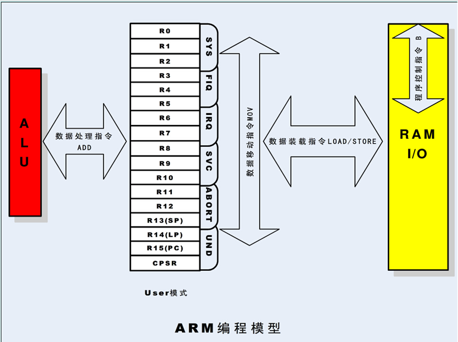

> 在开始本章之前，首先对字（Word）、半字（Half-Word）、字节（Byte）的概念作一个说明：
>
> 
>
> **字(Word) **：在ARM体系结构中，字的长度为32位，而在8位/16位处理器体系结构中，字的长度一般为16位。
>
> **半字（Half-Word）**：在ARM体系结构中，半字的长度为16位，与8位/16位处理器体系结构中字的长度一致。
>
> **字节（Byte）**：在ARM体系结构和8位/16位处理器体系结构中，字节的长度均为8位。
>
> 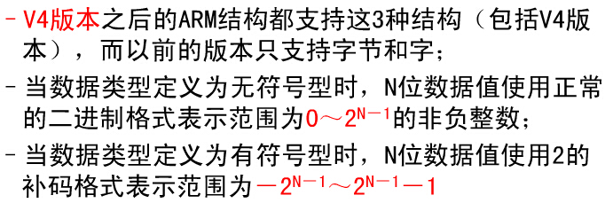

# 2.1 ARM微处理器的工作状态

- 从编程的角度看，ARM微处理器的工作状态一般有两种，并可在两种状态之间切换：
  - 第一种为**ARM状态**，此时处理器执行32位的字对齐的ARM指令；
  - 第二种为**Thumb状态**，此时处理器执行16位的半字对齐的Thumb指令。
- 当ARM微处理器执行32位的ARM指令集时，工作在ARM状态；
- 当ARM微处理器执行16位的Thumb指令集时，工作在Thumb状态。
- 在程序的执行过程中，微处理器可以随时在两种工作状态之间切换，并且，**处理器工作状态的转变并不影响处理器的工作模式和相应寄存器中的内容。**

#### 状态切换方法：

-  ARM指令集和Thumb指令集均有切换处理器状态的指令，并可在两种工作状态之间切换，但ARM微处理器在开始执行代码时，应该处于ARM状态。
  - 进入Thumb状态：当操作数寄存器的状态位（位0）为1时，可以采用执行BX指令的方法，使微处理器从ARM状态切换到Thumb状态。
    - 此外，当处理器处于Thumb状态时发生异常（如IRQ、FIQ、Undef、Abort、SWI等），则异常处理返回时，自动切换到Thumb状态。
  - 进入ARM状态：当操作数寄存器的状态位为0时，执行BX指令时可以使微处理器从Thumb状态切换到ARM状态。
    - 此外，在处理器进行异常处理时，把PC指针放入异常模式链接寄存器中，并从异常向量地址开始执行程序，也可以使处理器切换到ARM状态。

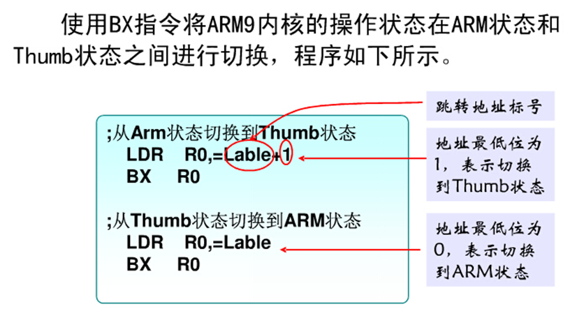

# 2.2 ARM体系结构的存储器格式

- ARM体系结构将存储器看作是从零地址开始的字节的线性组合。从零字节到三字节放置第一个存储的字数据，从第四个字节到第七个字节放置第二个存储的字数据，依次排列。作为32位的微处理器，**ARM体系结构所支持的最大寻址空间为4GB（2^32字节)**.
- ARM体系结构可以用两种方法存储字数据，称之为**大端格式**和**小端格式**，具体说明如下：

- 大端格式:

  在这种格式中，字数据的高字节存储在低地址中，而字数据的低字节则存放在高地址中，如图所示： 

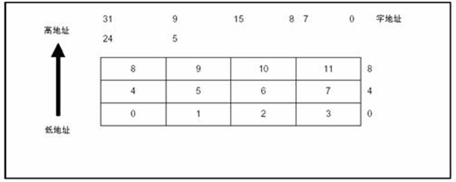

- 小端格式

 与大端存储格式相反，在小端存储格式中，低地址中存放的是字数据的低字节，高地址存放的是字数据的高字节。如图所示：

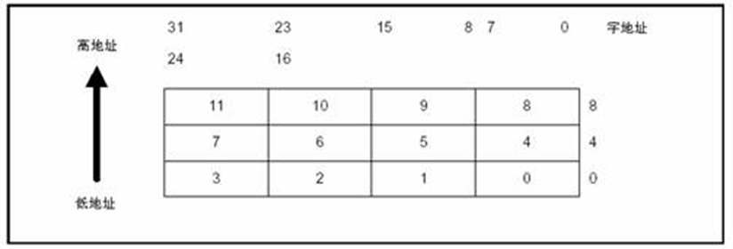

# 2.3 指令长度及数据类型

ARM微处理器的指令长度可以是32位（在ARM状态下），也可以为16位（在Thumb状态下）。

- ARM微处理器中支持三种数据类型：
  - 字节（8位）
  - 半字（16位）
  - 字（32位） 
  - 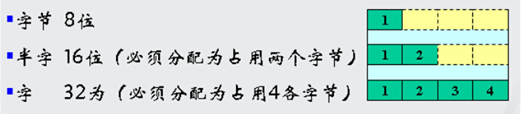
  - 其中，字需要4字节对齐（地址的低两位为0）、半字需要2字节对齐（地址的最低位为0）。

# 2.4 处理器模式

- ARM微处理器支持7种运行模式，分别为：
  - 用户模式（usr）：ARM处理器正常的程序执行状态
  - 快速中断模式（fiq）：用于高速数据传输或通道处理
  - 外部中断模式（irq）：用于通用的中断处理
  - 管理模式（svc）：操作系统使用的保护模式（复位或软中断）
  - 数据访问终止模式(abt)：当数据或指令预取终止时进入该模式，可用于虚拟存储及存储保护。
  - 系统模式（sys）：运行具有特权的操作系统任务。
  - 未定义指令中止模式（und）：当未定义的指令执行时进入该模式，可用于支持硬件协处理器的软件仿真。

- ARM微处理器的运行模式可以通过软件改变，也可以通过外部中断或异常处理改变。
- 大多数的应用程序运行在用户模式下，当处理器运行在用户模式下时，某些被保护的系统资源是不能被访问的。
- 除用户模式以外，其余的所有6种模式称之为非用户模式，或**特权模式**（Privileged Modes）；其中除去用户模式和系统模式以外的5种又称为**异常模式**（Exception Modes），常用于处理中断或异常，以及需要访问受保护的系统资源等情况。

# 2.5 寄存器组织

ARM微处理器共有37个32位寄存器，其中31个为通用寄存器，6个为状态寄存器。但是这些寄存器不能被同时访问，具体哪些寄存器是可编程访问的，取决微处理器的工作状态及具体的运行模式。

但在任何时候，通用寄存器R0～R14、程序计数器PC、一个或两个状态寄存器都是可访问的。

## 2.5.1 ARM状态下的寄存器组织

通用寄存器：

 通用寄存器包括R0～R15，可以分为三类：

-  未分组寄存器R0～R7
- 分组寄存器R8～R14(备份寄存器)
- 程序计数器PC(R15)

##### 未分组寄存器R0～R7：

 **在所有的运行模式下，未分组寄存器都指向同一个物理寄存器**，他们未被系统用作特殊的用途，因此，在中断或异常处理进行运行模式转换时，由于不同的处理器运行模式均使用相同的物理寄存器，可能会造成寄存器中数据的破坏，这一点在进行程序设计时应引起注意。

##### 分组寄存器R8～R14：

 **对于分组寄存器，每一次所访问的物理寄存器与处理器当前的运行模式有关**。

**对于**R8～R12**来说，每个寄存器对应两个不同的物理寄存器**，当使用fiq模式时，访问寄存器R8_fiq～R12_fiq；当使用除fiq模式以外的其他模式时，访问寄存器R8_usr～R12_usr

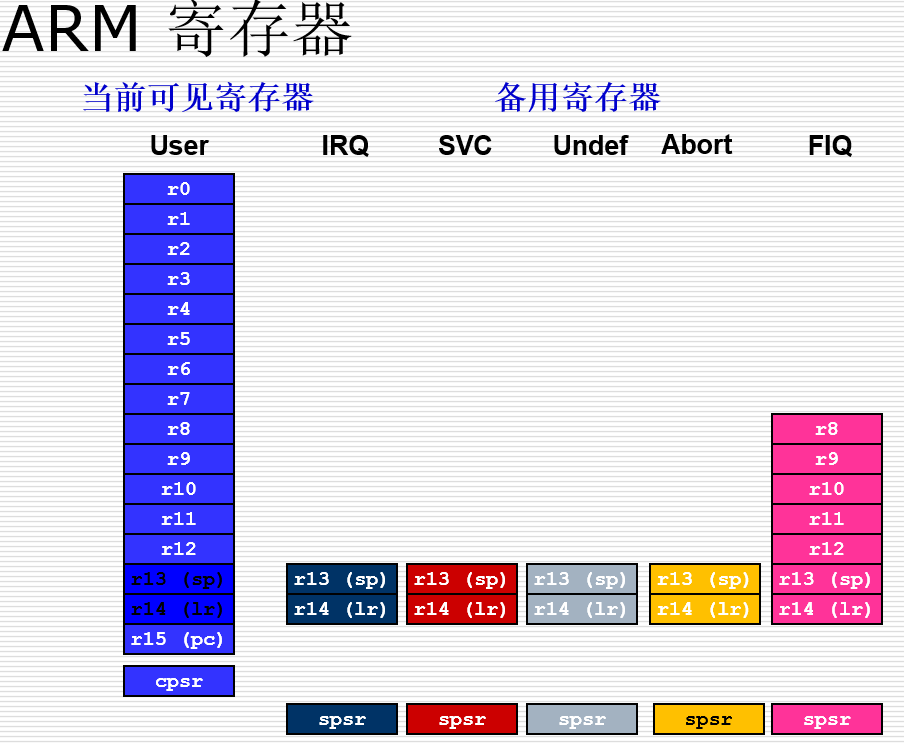

- ARM 有37个32-Bits长的寄存器.
  - 1 个用作PC
  - 1个用作CPSR
  - 5个用作SPSR
  - 30 个通用寄存器
- 当前处理器的模式决定着哪组寄存器可操作. 任何模式都可以存取： 
  - 相应的r0-r12子集
  - 相应的 r13 (sp) and r14 (lr)
  - 相应的 r15 (pc)
  - 相应的CPSR
- 特权模式 (除system模式) 还可以存取；
  
  - 相应的 SPSR
- 对于R13、R14来说，每个寄存器对应6个不同的物理寄存器，其中的一个是用户模式与系统模式共用，另外5个物理寄存器对应于其他5种不同的运行模式。
- 采用以下的记号来区分不同的物理寄存器：
  -  **R13_<mode>**
  -  **R14_<mode>**
  -  **其中，**mode为以下几种模式之一：**usr**、**fiq**、**irq**、**svc**、**abt**、**und**。

- 寄存器R13在ARM指令中常用作**堆栈指针**，但这只是一种习惯用法，用户也可使用其他的寄存器作为堆栈指针。
  - 而在Thumb指令集中，某些指令强制性的要求使用R13作为堆栈指针。
  - 由于处理器的每种运行模式均有自己独立的物理寄存器R13，在用户应用程序的初始化部分，一般都要初始化每种模式下的R13，使其指向该运行模式的栈空间，这样，当程序的运行进入异常模式时，可以将需要保护的寄存器放入R13所指向的堆栈，而当程序从异常模式返回时，则从对应的堆栈中恢复，采用这种方式可以保证异常发生后程序的正常执行。
- R14也称作**子程序连接寄存器**（Subroutine Link Register）或**连接寄存器**LR。当执行BL子程序调用指令时，R14中得到R15（程序计数器PC）的备份。其他情况下，R14用作通用寄存器。
  
- 与之类似，当发生中断或异常时，对应的分组寄存器R14_svc、R14_irq、R14_fiq、R14_abt和R14_und用来保存R15的返回值。
  
- 寄存器R14常用在如下的情况：

-  在每一种运行模式下，都可用R14保存子程序的返回地址。当用BL或BLX指令调用子程序时，将PC的当前值拷贝给R14，执行完子程序后，又将R14的值拷贝回PC，即可完成子程序的调用返回。以上的描述可用指令完成：

  1、执行以下任意一条指令可以返回：

  ​    MOV    PC，LR  ；PC      LR

     或 BX    LR

   2、在子程序入口处使用以下指令将R14存入堆栈：

  ​    STMFD  SP！,{<Regs>,LR}

     对应的，使用以下指令可以完成子程序返回：

  ​    LDMFD  SP！,{<Regs>,PC}

- R14也可作为通用寄存器。

- **程序计数器PC(R15)**

  - 寄存器R15用作**程序计数器（PC）**。在ARM状态下，位[1:0]为0，位[31:2]用于保存PC；在Thumb状态下，位[0]为0，位[31:1]用于保存PC；
  - R15虽然也可用作通用寄存器，但一般不这么使用，因为对R15的使用有一些特殊的限制，当违反了这些限制时，程序的执行结果是未知的。
  - 由于ARM体系结构采用了多级流水线技术，对于ARM指令集而言，PC总是指向当前指令的下两条指令的地址，即PC的值为当前指令的地址值加8个字节。（？P.14）

- 当处理器执行在ARM状态:

  - 所有指令 32 bits 宽
  - 所有指令必须 word 对齐
  - pc值由bits [31:2]决定, bits [1:0] 未定义 (所以指令不能halfword / byte对齐).

- 当处理器执行在Thumb状态:

  - 所有指令 16 bits 宽
  - 所有指令必须 halfword 对齐
  - pc值由bits [31:1]决定, bits [0] 未定义 (所以指令不能 byte对齐). 

- **当前程序状态寄存器：**

  - 寄存器的名字为**CPSR**(Current Program Status Register，当前程序状态寄存器)，CPSR可在任何运行模式下被访问，它包括条件标志位、中断禁止位、当前处理器模式标志位，以及其他一些相关的控制和状态位。
  - 每一种运行模式下又都有一个专用的物理状态寄存器，称为**SPSR**（Saved Program Status Register，备份的程序状态寄存器），当异常发生时，SPSR用于保存CPSR的当前值，从异常退出时则可由SPSR来恢复CPSR。
  - 由于用户模式和系统模式不属于异常模式，他们没有SPSR，当在这两种模式下访问SPSR，结果是未知的。

## 2.5.2 Thumb状态下的寄存器组织

- **Thumb**状态下的寄存器集是**ARM**状态下寄存器集的一个**子集**，程序可以直接访问8个通用寄存器（R0～R7）、程序计数器（PC）、堆栈指针（SP）、连接寄存器（LR）和CPSR。
- 同时，**在每一种特权模式下都有一组SP、LR和SPSR**。下图表明Thumb状态下的寄存器组织。

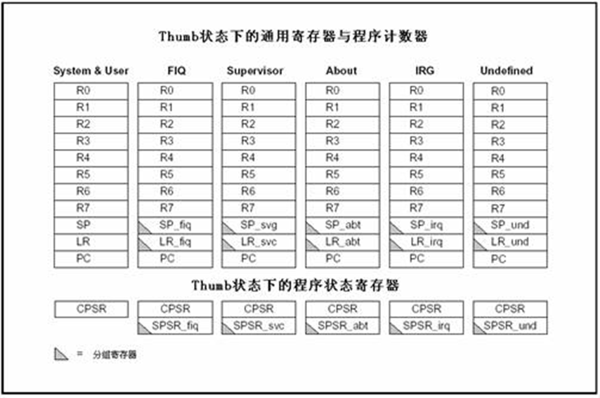

Thumb状态下的寄存器组织与ARM状态下的寄存器组织的关系：

- Thumb状态下和ARM状态下的R0～R7是相同的。
- Thumb状态下和ARM状态下的CPSR和所有的SPSR是相同的。
- Thumb状态下的SP对应于ARM状态下的R13。
- Thumb状态下的LR对应于ARM状态下的R14。
- Thumb状态下的程序计数器对应于ARM状态下R15。

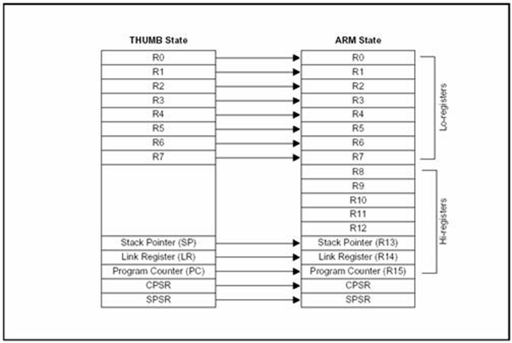

- 访问Thumb状态下的高位寄存器（Hi-registers）：
- 在Thumb状态下，高位寄存器R8～R15并不是标准寄存器集的一部分，但可使用汇编语言程序有限制的访问这些寄存器，将其用作快速的暂存器。
  - 使用带特殊变量的MOV指令，数据可以在低位寄存器和高位寄存器之间进行传送；
  - 高位寄存器的值可以使用CMP和ADD指令进行比较或加上低位寄存器中的值。

## 2.5.3 程序状态寄存器

ARM体系结构包含一个当前程序状态寄存器（CPSR）和五个备份的程序状态寄存器（SPSRs）。备份的程序状态寄存器用来进行异常处理，其功能包括：

- **保存ALU中的当前操作信息**
- **控制允许和禁止中断**
- **设置处理器的运行模式**

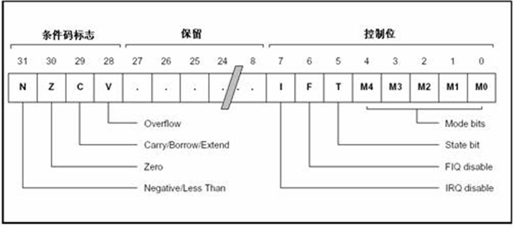

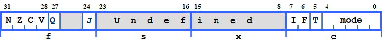

>  条件位：
>
> - **N** = 1-结果为负，0-结果为正或0
> - **Z** = 1-结果为0，0-结果不为0
> - **C** =1-进位，0-借位
> - **V** =1-结果溢出，0结果没溢出
>
> **Q** 位：
>
> - 仅ARM 5TE/J架构支持
> - 指示增强型DSP指令是否溢出
>
> **J** 位
>
> - 仅ARM 5TE/J架构支持
> - J = 1: 处理器处于Jazelle状态
>
> **中断禁止位：**
>
> - **I** = 1: 禁止 IRQ.
> - **F** = 1: 禁止 FIQ.
>
> 
>
> **T** Bit
>
> - 仅ARM xT架构支持
> - T = 0: 处理器处于 ARM 状态
> - T = 1: 处理器处于 Thumb 状态
>
> 
>
> Mode位(处理器模式位):
>
> - 0b10000 User
> - 0b10001 FIQ
> - 0b10010 IRQ
> - 0b10011 Supervisor
> - 0b10111 Abort
> - 0b11011 Undefined
> - 0b11111 System

#### 条件码标志（Condition Code Flags）

- N、Z、C、V均为条件码标志位。它们的内容可被算术或逻辑运算的结果所改变，并且可以决定某条指令是否被执行。
- 在ARM状态下，绝大多数的指令都是有条件执行的。
- 在Thumb状态下，仅有分支指令是有条件执行的。

条件码标志各位的具体含义如下表所示：

| 标志位 | 含    义                                                     |
| ------ | ------------------------------------------------------------ |
| N      | 当用两个补码表示的带符号数进行运算时，N=1  表示运算的结果为负数；N=0  表示运算的结果为正数或零； |
| Z      | Z=1  表示运算的结果为零；Z=0表示运算的结果为非零；           |
| C      | 可以有4种方法设置C的值：  ─  加法运算（包括比较指令CMN）：当运算结果产生了进位时（无符号数溢出），C=1，否则C=0。  ─  减法运算（包括比较指令CMP）：当运算时产生了借位（无符号数溢出），C=0，否则C=1。  ─  对于包含移位操作的非加/减运算指令，C为移出值的最后一位。  ─  对于其他的非加/减运算指令，C的值通常不改变。 |
| V      | 可以有2种方法设置V的值：  ─  对于加/减法运算指令，当操作数和运算结果为二进制的补码表示的带符号数时，V=1表示符号位溢出。  ─  对于其他的非加/减运算指令，V的值通常不改变。 |
| Q      | 在ARM  v5及以上版本的E系列处理器中，用Q标志位指示增强的DSP运算指令是否发生了溢出。在其他版本的处理器中，Q标志位无定义。 |

##### 控制位

PSR的低8位（包括I、F、T和M[4：0]）称为控制位，当发生异常时这些位可以被改变。如果处理器运行特权模式，这些位也可以由程序修改。

- 中断禁止位I、F：
- I=1  禁止IRQ中断;
- F=1  禁止FIQ中断。
- T标志位：该位反映处理器的运行状态。
  - 对于ARM体系结构v5及以上的版本的T系列处理器，当该位为1时，程序运行于Thumb状态，否则运行于ARM状态。
  - 对于ARM体系结构v5及以上的版本的非T系列处理器，当该位为1时，执行下一条指令以引起为定义的指令异常；当该位为0时，表示运行于ARM状态。
- 运行模式位M[4：0]：M0、M1、M2、M3、M4是模式位。这些位决定了处理器的运行模式。

###### 运行模式位M[4：0]的具体含义

| M[4：0] | 处理器模式 | 可访问的寄存器                                  |
| ------- | ---------- | ----------------------------------------------- |
| 0b10000 | 用户模式   | PC，CPSR,R0-R14                                 |
| 0b10001 | FIQ模式    | PC，CPSR,  SPSR_fiq，R14_fiq-R8_fiq,  R7～R0    |
| 0b10010 | IRQ模式    | PC，CPSR,  SPSR_irq，R14_irq,R13_irq,R12～R0    |
| 0b10011 | 管理模式   | PC，CPSR,  SPSR_svc，R14_svc,R13_svc,,R12～R0,  |
| 0b10111 | 中止模式   | PC，CPSR,  SPSR_abt，R14_abt,R13_abt,  R12～R0, |
| 0b11011 | 未定义模式 | PC，CPSR,  SPSR_und，R14_und,R13_und,  R12～R0, |
| 0b11111 | 系统模式   | PC，CPSR,  R14～R0  （ARM  v4及以上版本）       |

由表可知，并不是所有的运行模式位的组合都是有效地，其他的组合结果会导致处理器进入一个不可恢复的状态。

##### 保留位

PSR中的其余位为保留位，当改变PSR中的条件码标志位或者控制位时，保留位不要被改变，在程序中也不要使用保留位来存储数据。保留位将用于ARM版本的扩展

# 2.6  异常（Exceptions） 

- 当正常的程序执行流程发生暂时的停止时，称之为**异常**，处理器将进入异常模式，例如处理一个外部的中断请求。
- 在处理异常之前，当前处理器的状态必须保留，这样当异常处理完成之后，当前程序可以继续执行。处理器允许多个异常同时发生，它们将会按固定的优先级进行处理。
- 如果同时发生两个或更多异常，将按照固定的顺序来处理异常。
- ARM体系结构中的异常，与8位/16位体系结构的中断有很大的相似之处，但**异常**与**中断**（interrupt）的概念并不完全等同。

## 2.6.1 ARM体系结构所支持的异常类型

| 异常类型            | 具体含义                                                     |
| ------------------- | ------------------------------------------------------------ |
| 复位                | 当处理器的复位电平有效时，产生复位异常，程序跳转到复位异常处理程序处执行。 |
| 未定义指令          | 当ARM处理器或协处理器遇到不能处理的指令时，产生未定义指令异常。可使用该异常机制进行软件仿真。 |
| 软件中断            | 该异常由执行SWI指令产生，可用于用户模式下的程序调用特权操作指令。可使用该异常机制实现系统功能调用。 |
| 指令预取中止        | 若处理器预取指令的地址不存在，或该地址不允许当前指令访问，存储器会向处理器发出中止信号，但当预取的指令被执行时，才会产生指令预取中止异常。 |
| 数据中止            | 若处理器数据访问指令的地址不存在，或该地址不允许当前指令访问时，产生数据中止异常。 |
| IRQ（外部中断请求） | 当处理器的外部中断请求引脚有效，且CPSR中的I位为0时，产生IRQ异常。系统的外设可通过该异常请求中断服务。 |
| FIQ（快速中断请求） | 当处理器的快速中断请求引脚有效，且CPSR中的F位为0时，产生FIQ异常。 |

## 2.6.2 对异常的响应

当一个异常出现以后，ARM微处理器会执行以下几步操作：

- **1、将下一条指令的地址存入相应连接寄存器LR，以便程序在处理异常返回时能从正确的位置重新开始执行。**若异常是从ARM状态进入，LR寄存器中保存的是下一条指令的地址（当前PC＋4或PC＋8，与异常的类型有关）；若异常是从Thumb状态进入，则在LR寄存器中保存当前PC的偏移量，这样，异常处理程序就不需要确定异常是从何种状态进入的。例如：在软件中断异常SWI，指令 MOV PC，R14_svc总是返回到下一条指令，不管SWI是在ARM状态执行，还是在Thumb状态执行。
- **2、将CPSR复制到相应的SPSR中。**
- **3、根据异常类型，强制设置CPSR的运行模式位。**
- **4、强制PC从相关的异常向量地址取下一条指令执行，从而跳转到相应的异常处理程序处。**

还可以设置中断禁止位，以禁止中断发生。

**如果异常发生时，处理器处于Thumb状态，则当异常向量地址加载入PC时，处理器自动切换到ARM状态**

ARM微处理器对异常的响应过程用伪码可以描述为：

```
R14_<Exception_Mode> = Return Link
	SPSR_<Exception_Mode> = CPSR
	CPSR[4:0] = Exception Mode Number
	CPSR[5] = 0   ；当运行于ARM工作状态时
	If <Exception_Mode> == Reset or FIQ then
		CPSR[6] = 1  ；当响应FIQ异常时，禁止新的FIQ异常   
		CPSR[7] = 1  ；禁止新的IRQ异常
	PC = Exception Vector Address 
```

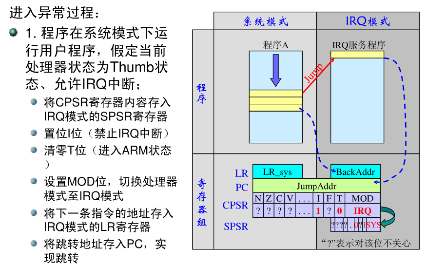

## 2.6.3 从异常返回

异常处理完毕之后，ARM微处理器会执行以下几步操作从异常返回： 

- **1、将SPSR复制回CPSR中。**
- **2、若在进入异常处理时设置了中断禁止位，要在此清除。**
- **3、将连接寄存器LR的值减去相应的偏移量后送到PC中。**

可以认为应用程序总是从复位异常处理程序开始执行的，因此复位异常处理程序不需要返回。

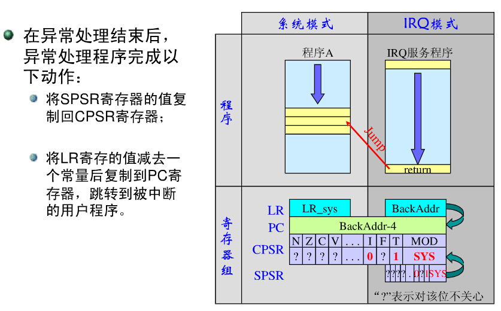

## 2.6.4 各类异常的具体描述

#### FIQ（Fast Interrupt Request）

- FIQ异常是为了支持数据传输或者通道处理而设计的。在ARM状态下，系统有足够的私有寄存器，从而可以避免对寄存器保存的需求，并减小了系统上下文切换的开销。
- 若将CPSR的F位置为1，则会禁止FIQ中断，若将CPSR的F位清零，处理器会在指令执行时检查FIQ输入。注意只有在特权模式下才能改变F位的状态。
- 可由外部通过对处理器上的nFIQ引脚输入低电平产生FIQ。不管是在ARM状态还是在Thumb状态下进入FIQ模式，FIQ处理程序均会执行以下指令从FIQ模式返回：

```
 SUBS  PC,R14_fiq ,#4
```

 		该指令将寄存器R14_fiq的值减去4后，复制到程序计数器PC中，从而实现从异常处理程序中的返	回，同时将SPSR_mode寄存器的内容复制到当前程序状态寄存器CPSR中。

#### IRQ（Interrupt Request）

- IRQ异常属于正常的中断请求，可通过对处理器的nIRQ引脚输入低电平产生，IRQ的优先级低于FIQ，当程序执行进入FIQ异常时，IRQ可能被屏蔽。
- 若将CPSR的I位置为1，则会禁止IRQ中断，若将CPSR的I位清零，处理器会在指令执行完之前检查IRQ的输入。注意只有在特权模式下才能改变I位的状态。
- 不管是在ARM状态还是在Thumb状态下进入IRQ模式，IRQ处理程序均会执行以下指令从IRQ模式返回：

```
 SUBS PC , R14_irq , #4
```

 		该指令将寄存器R14_irq的值减去4后，复制到程序计数器PC中，从而实现从异常处理程序中的返	回，同时将SPSR_mode寄存器的内容复制到当前程序状态寄存器CPSR中

#### ABORT（中止）

- 产生中止异常意味着对存储器的访问失败。ARM微处理器在存储器访问周期内检查是否发生中止异常。
- 中止异常包括两种类型：
  - **指令预取中止：发生在指令预取时。**
  - **数据中止：发生在数据访问时。**
- 当指令预取访问存储器失败时，存储器系统向ARM处理器发出存储器中止（Abort）信号，预取的指令被记为无效，但只有当处理器试图执行无效指令时，指令预取中止异常才会发生，如果指令未被执行，例如在指令流水线中发生了跳转，则预取指令中止不会发生。
- 若数据中止发生，系统的响应与指令的类型有关。
- 当确定了中止的原因后，Abort处理程序均会执行以下指令从中止模式返回，无论是在ARM状态还是Thumb状态：

```
SUBS PC, R14_abt, #4   ；指令预取中止

SUBS PC, R14_abt, #8   ；数据中止
```

​		以上指令恢复PC（从R14_abt）和CPSR（从SPSR_abt）的值，并重新执行中止的指令。

#### Software Interruupt(软件中断)

软件中断指令（SWI）用于进入管理模式，常用于请求执行特定的管理功能。软件中断处理程序执行以下指令从SWI模式返回，无论是在ARM状态还是Thumb状态：

```
 MOV PC , R14_svc
```

 以上指令恢复PC（从R14_svc）和CPSR（从SPSR_svc）的值，并返回到SWI的下一条指令。

#### Undefined Instruction(未定义指令)

- 当ARM处理器遇到不能处理的指令时，会产生未定义指令异常。采用这种机制，可以通过软件仿真扩展ARM或Thumb指令集。
- 在仿真未定义指令后，处理器执行以下程序返回，无论是在ARM状态还是Thumb状态：

```
 MOVS PC, R14_und
```

​		 以上指令恢复PC（从R14_und）和CPSR（从SPSR_und）的值，并返回到未定义指令后的下一	条指令。

## 2.6.5 异常进入/退出小节

|             | 返回指令                   | 以前的状态 | 备注      |      |
| ----------- | -------------------------- | ---------- | --------- | ---- |
| ARM   R14_x | Thumb  R14_x               |            |           |      |
| **BL**      | **MOV  PC，R14**           | **PC＋4**  | **PC＋2** | 1    |
| **SWI**     | **MOVS  PC，R14_svc**      | **PC4**    | **PC＋2** | 1    |
| **UDEF**    | **MOVS  PC，R14_und**      | **PC＋4**  | **PC＋2** | 1    |
| **FIQ**     | **SUBS  PC，R14_fiq，＃4** | **PC＋4**  | **PC＋4** | 2    |
| **IRQ**     | **SUBS  PC，R14_irq，＃4** | **PC＋4**  | **PC＋4** | 2    |
| **PABT**    | **SUBS  PC，R14_abt，＃4** | **PC＋4**  | **PC＋4** | 1    |
| **DABT**    | **SUBS  PC，R14_abt，＃8** | **PC＋8**  | **PC＋8** | 3    |
| **RESET**   | **NA**                     | **－**     | **－**    | 4    |

备注：

- 1--在此PC应是具有预取中止的BL/SWI/未定义指令所取的地址。
- 2--在此PC是从FIQ或IRQ取得不能执行的指令的地址。
- 3--在此PC是产生数据中止的加载或存储指令的地址。
- 4--系统复位时，保存在R14_svc中的值是不可预知的。

## 2.6.6 异常向量（Exception Vectors） 

| 地 址       | 异 常            | 进入模式       |
| ----------- | ---------------- | -------------- |
| 0x0000,0000 | 复位             | 管理模式       |
| 0x0000,0004 | 未定义           | 指令未定义模式 |
| 0x0000,0008 | 软件中断         | 管理模式       |
| 0x0000,000C | 中止（预取指令） | 中止模式       |
| 0x0000,0010 | 中止（数据）     | 中止模式       |
| 0x0000,0014 | 保留             | 保留           |
| 0x0000,0018 | IRQ              | IRQ            |
| 0x0000,001C | FIQ              | FIQ            |

## 2.6.7 异常优先级（Exception Priorities）

当多个异常同时发生时，系统根据固定的优先级决定异常的处理次序。异常优先级由高到低的排列次序如下表所示。

| 优先级    | 异 常           |
| --------- | --------------- |
| 1（最高） | 复位            |
| 2         | 数据中止        |
| 3         | FIQ             |
| 4         | IRQ             |
| 5         | 预取指令中止    |
| 6（最低） | 未定义指令、SWI |

## 2.6.8 应用程序中的异常处理

当系统运行时，异常可能会随时发生，为保证在ARM处理器发生异常时不至于处于未知状态，在应用程序的设计中，首先要进行异常处理，采用的方式是在异常向量表中的特定位置放置一条跳转指令，跳转到异常处理程序。当ARM处理器发生异常时，程序计数器PC会被强制设置为对应的异常向量，从而跳转到异常处理程序，当异常处理完成以后，返回到主程序继续执行。

# 2.7 本章小节

本章对ARM微处理器的体系结构、寄存器的组织、处理器的工作状态、运行模式以及处理器异常等内容进行了描述，这些内容也是ARM体系结构的基本内容，是系统软、硬件设计的基础。

- 掌握各种运行模式下寄存器的组织使用
- 掌握异常响应和异常返回的代码设置

# 复习与作业

复习：

- 1、ARM处理器有几个寄存器？分别说明其用途。
- 2、CPSR状态寄存器中各位表示的含义是什么？
- 3、ARM中断向量表位于存储器的什么位置？

作业：

- 4、思考为什么处理器采用中断运行机制？并且设置中断向量表？（自查资料）
- 要求与第一次作业同