# **ARM体系结构与编程**

本章的主要内容有：

- ARM指令集、Thumb指令集概述
- ARM指令的寻址方式
- ARM指令集的分类与具体应用
- Thumb指令集简介及应用场合

## 3.1 ARM微处理器的指令集概述

### 3.1.1 ARM微处理器的指令的分类与格式

ARM微处理器的指令集是加载/存储型的，也即指令集仅能处理寄存器中的数据，而且处理结果都要放回寄存器中，而对系统存储器的访问则需要通过专门的加载/存储指令来完成。

ARM微处理器的指令集可以分为：

- 跳转指令
- 数据处理指令
- 加载/存储指令
- 程序状态寄存器（PSR）处理指令
- 协处理器指令
- 异常产生指令

六大类，具体的指令及功能如下表所示（表中指令为基本ARM指令，不包括派生的ARM指令）。

**ARM指令及功能描述** 

| 助记符 | 指令功能描述               |
| ------ | -------------------------- |
| ADC    | 带进位加法指令             |
| ADD    | 加法指令                   |
| AND    | 逻辑与指                   |
| B      | 跳转指令                   |
| BIC    | 位清零指令                 |
| BL     | 带返回的跳转指             |
| BLX    | 带返回和状态切换的跳转指令 |
| BX     | 带状态切换的跳转指令       |
| CDP    | 协处理器数据操作指令       |

| 助记符 | 指令功能描述                              |
| ------ | ----------------------------------------- |
| CMN    | 比较反值指令                              |
| CMP    | 比较指令                                  |
| EOR    | 异或指令                                  |
| LDC    | 存储器到协处理器的数据传输指令            |
| LDM    | 加载多个寄存器指令                        |
| LDR    | 存储器到寄存器的数据传输指令              |
| MCR    | 从ARM寄存器到协处理器寄存器的数据传输指令 |
| MOV    | 数据传送指令                              |

| 助记符 | 指令功能描述                              |
| ------ | ----------------------------------------- |
| MRC    | 从协处理器寄存器到ARM寄存器的数据传输指令 |
| MRS    | 传送CPSR或SPSR的内容到通用寄存器指令      |
| MSR    | 传送通用寄存器到CPSR或SPSR的指            |
| MUL    | 32位乘法指                                |
| MLA    | 32位乘加指令                              |
| MVN    | 数据取反传送指令                          |
| ORR    | 逻辑或指令                                |
| RSB    | 逆向减法指令                              |
| RSC    | 带借位的逆向减法指令                      |

| 助记符 | 指令功能描述               |
| ------ | -------------------------- |
| SBC    | 带借位减法指令             |
| STC    | 协处理器寄存器写入存储器指 |
| STM    | 批量内存字写入指令         |
| STR    | 寄存器到存储器的数据传输指 |
| SUB    | 减法指令                   |
| SWI    | 软件中断指令               |
| SWP    | 交换指令                   |
| TEQ    | 相等测试指                 |
| TST    | 位测试指                   |

#### ARM指令编码格式

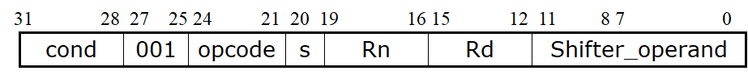

**说明**

- Cond
  - 指令执行的条件编码
- Opcode
  - 指令操作符编码
- S
  - 决定指令的操作是否影响CPSR的值
- Rd
  - 操作目标寄存器编码
- Rn
  - 包含第一操作数的寄存器编码
- **Shifter_operand**
  - 表示第二操作数

### 3.1.2 指令的条件域

- 当处理器工作在ARM状态时，几乎所有的指令均根据CPSR中条件码的状态和指令的条件域有条件的执行。当指令的执行条件满足时，指令被执行，否则指令被忽略。
- 每一条ARM指令包含4位的条件码，位于指令的最高4位[31:28]。条件码共有16种，每种条件码可用两个字符表示，这两个字符可以添加在指令助记符的后面和指令同时使用。
  - 例如，跳转指令B可以加上后缀EQ变为BEQ表示“相等则跳转”，即当CPSR中的Z标志置位时发生跳转。
- n在16种条件标志码中，只有15种可以使用，如表3-2所示，第16种（1111）为系统保留，暂时不能使用。

#### **指令的条件码**

| 条件码 | 助记符后缀 | 标 志 | 含 义              |
| ------ | ---------- | ----- | ------------------ |
| 0000   | EQ         | Z置位 | 相等               |
| 0001   | NE         | Z清零 | 不相等             |
| 0010   | CS         | C置位 | 无符号数大于或等于 |
| 0011   | CC         | C清零 | 无符号数小于       |
| 0100   | MI         | N置位 | 负数               |
| 0101   | PL         | N清零 | 正数或零           |
| 0110   | VS         | V置位 | 溢出               |
| 0111   | VC         | V清零 | 未溢出             |

| 条件码 | 助记符后缀 | 标 志               | 含 义              |
| ------ | ---------- | ------------------- | ------------------ |
| 1000   | HI         | C置位Z清零          | 无符号数大于       |
| 1001   | LS         | C清零Z置位          | 无符号数小于或等于 |
| 1010   | GE         | N等于V              | 带符号数大于或等于 |
| 1011   | LT         | N不等于V            | 带符号数小于       |
| 1100   | GT         | Z清零且（N等于V）   | 带符号数大于       |
| 1101   | LE         | Z置位或（N不等于V） | 带符号数小于或等于 |
| 1110   | AL         | 忽略                | 无条件执行         |
| 1111   | NV         |                     | 该指令从不执行     |

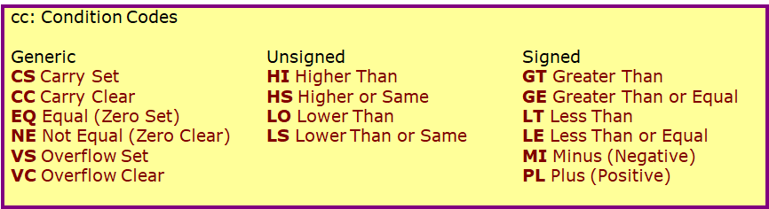

#### 条件执行及标志位

ARM指令可以通过添加适当的条件码后缀来达到条件执行的目的。

这样可以提高代码密度，减少分支跳转指令数目，提高性能。

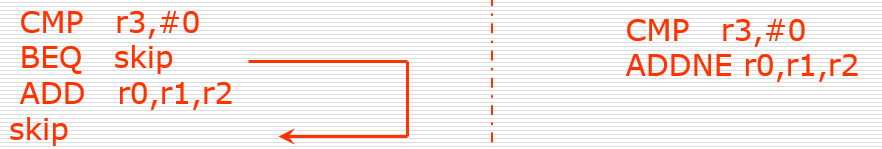

默认情况下，数据处理指令不影响条件码标志位，但可以选择通过添加“S”来影响标志位。 CMP不需要增加 “S”就可改变相应的标志位。

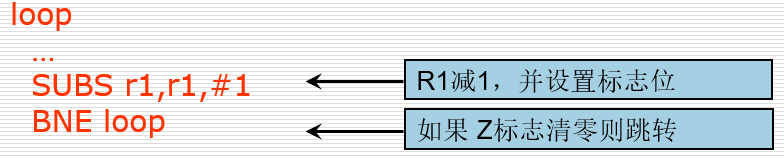

## 3.2 ARM指令的寻址方式

所谓**寻址方式**就是处理器根据指令中给出的地址信息来寻找物理地址的方式。目前ARM指令系统支持如下几种常见的寻址方式。

### 3.2.1 立即寻址

立即寻址也叫立即数寻址，这是一种特殊的寻址方式，操作数本身就在指令中给出，只要取出指令也就取到了操作数。这个操作数被称为立即数，对应的寻址方式也就叫做立即寻址。例如以下指令：

```
ADD R0，R0，＃1          	；R0←R0＋1
ADD R0，R0，＃0x3f       	；R0←R0＋0x3f
```

在以上两条指令中，第二个源操作数即为立即数，要求以“＃”为前缀，对于以十六进制表示的立即数，还要求在“＃”后加上“0x”或“&” ，另外％表示二进制数。

#### 立即数 (1)

没有任何一条ARM 指令可包括一个32 bit的立即数

所有的ARM指令都是32 bits固定长度

数据处理指令格式中，第二个操作数有12位

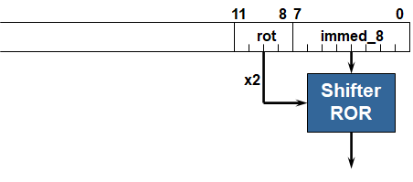

```
Immed_8=0x3F,rotate_imm=0xE
or
Immed_8=0xFC,rotate_imm=0xF
```

4 bit 移位值 (0-15)乘于2，得到一个范围在0-30，步长为 2的移位值。

记住一条准则： “**最后8位一定要移动偶数位**”.

```
Quick Quiz:
0x3F0   #???
0xe3a004ff
MOV r0, #???
```

#### 立即数 (2)

Examples:

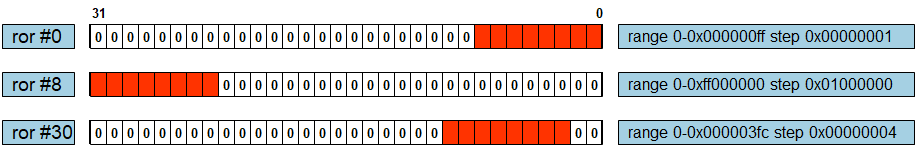

下列命令中，汇编器把立即数转换为移位操作：

```
 MOV r0,#4096		 ; uses 0x40 ROR 26
 ADD r1,r2,#0xFF0000 ; uses 0xFF ROR 16
```

也可使用 MVN来进行位反转:

```
 MOV r0, #0xFFFFFFFF ; assembles to MVN r0,#0
```

使用无法用上述方法生成的数据，将产生错误。

### 3.2.2 寄存器寻址

寄存器寻址就是利用寄存器中的数值作为操作数，这种寻址方式是各类微处理器经常采用的一种方式，也是一种执行效率较高的寻址方式。如下指令：

```
ADD R0，R1，R2   ；R0←R1＋R2
```

  该指令的执行效果是将寄存器R1和R2的内容相加，其结果存放在寄存器R0中。

### 3.2.3 寄存器间接寻址

  寄存器间接寻址就是以寄存器中的值作为操作数的地址，而操作数本身存放在存储器中。例如以下指令：

```
LDR  R0，[R1]                 ；R0←[R1]
STR  R0，[R1]                 ；[R1]←R0
```

- 第一条指令将以R1的值为地址的存储器中的数据传送到R0中。
- 第二条指令将R0的值传送到以R1的值为地址的存储器中

### 3.2.4 基址变址寻址

  基址变址寻址就是将寄存器（该寄存器一般称作**基址寄存器**）的内容与指令中给出的地址偏移量相加，从而得到一个操作数的有效地址。变址寻址方式常用于访问某基地址附近的地址单元。

 地址偏移量通常有以下三种表示方式

- 常量
- 寄存器
- 比例（scaled）

偏移寻址（offset addressing）

- LDR R0, [R1]
- LDR R0, [R1, #4]
- LDR R0, [R1, R2]
- LDR R0, [R1, R2, LSL #2]

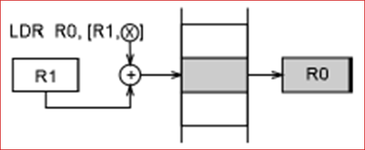

#### 地址的偏移（offset）

使用一个绝对值不大于4095的数值，可使用带符号数，即在-4095~+4095之间； 如：

```
 LDR R2, [Rn, #-0x8]
```

使用对寄存器移位的方法计算偏移量；如：

```
 LDR R2, [Rn, R3,LSL #2]
```

使用寄存器偏移的方法计算偏移量；如：

```
 LDR R2, [Rn, -R3]
```

使用语句标号。如：

```
LDR R2, START;R2<-[START]
```

在这种寻址方式中，程序计算器PC是隐含的基址寄存器，偏移量是语句标号所在的地址和PC（当前正在执行的指令）之间的差值。

#### 事先更新寻址（pre-index addressing）

```
LDR R0, [R1, #4]!
LDR R0, [R1, R2]!
LDR R0, [R1, R2, LSL #2]!
```

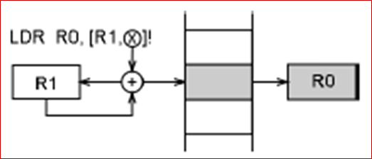

#### 事后更新寻址（Post-index addressing）

```
LDR R0, [R1], #4
LDR R0, [R1], R2
LDR R0, [R1], R2, LSL #2
```

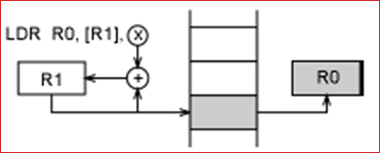

> Pre or Post Indexed 寻址?
>
>  Pre-indexed: **STR r0,[r1,#12]!**
>
> 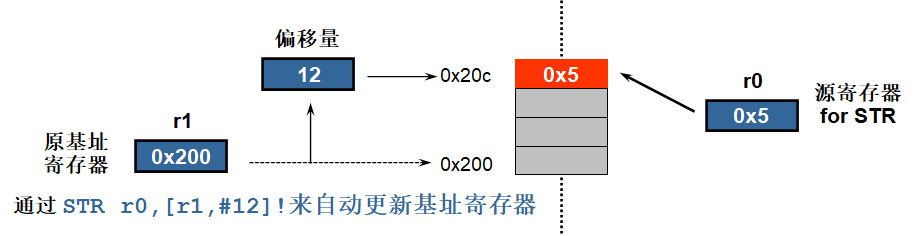
>
>  Post-indexed: **STR r0,[r1],#12**
>
> 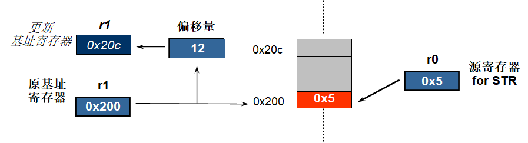

#### 数据移动寻址方式（data movement addressing modes）

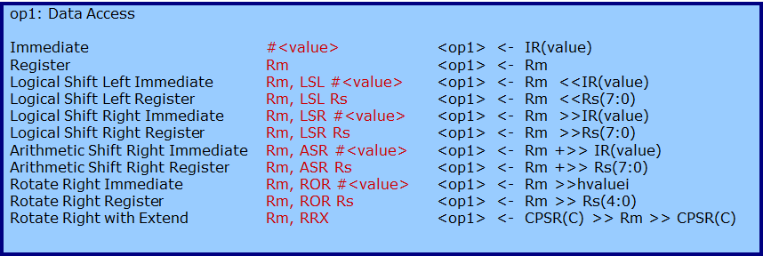

#### 内存寻址方式（memory addressing modes）

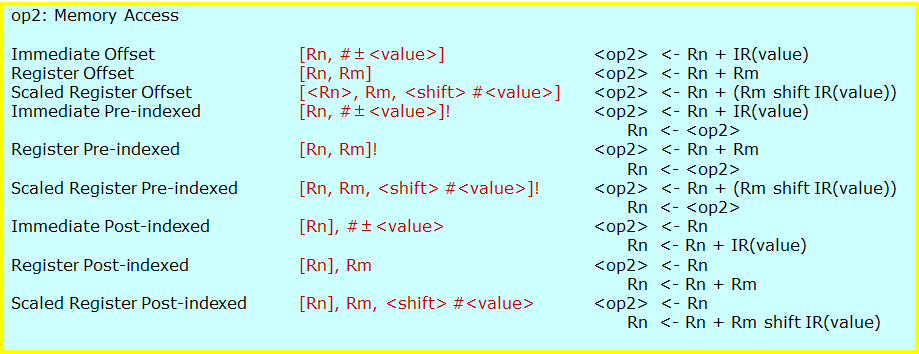

### 3.2.5 多寄存器寻址

采用多寄存器寻址方式，一条指令可以完成多个寄存器值的传送。这种寻址方式可以用一条指令完成传送最多16个通用寄存器的值。以下指令：

```
LDMIA R13，{R1，R2，R3，R4}  
或写成：LDMIA R13，{R1-R4} 							 ；R1←[R13]
                                					；R2←[R13＋4]
                                     				；R3←[R13＋8]
                                    				；R4←[R13＋12]
```

该指令的后缀**IA**表示在每次执行完加载/存储操作后，Rn按字长度增加，因此，指令可将连续存储单元的值传送到R1～R4。

指令中寄存器和内存单元的对应关系：**编号低的寄存器对应于内存中低地址单元，编号高的寄存器对应于内存中高地址单元。**

### 3.2.6 堆栈寻址

- 堆栈是一种数据结构，按先进后出（First In Last Out，FILO）的方式工作，使用一个称作堆栈指针的专用寄存器指示当前的操作位置，堆栈指针总是指向栈顶。
- 当堆栈指针指向最后压入堆栈的数据时，称为**满堆栈**（Full Stack），而当堆栈指针指向下一个将要放入数据的空位置时，称为**空堆栈**（Empty Stack）

同时，根据堆栈的生成方式，又可以分为**递增堆栈**（Ascending Stack）和**递减堆栈**（Decending Stack），当堆栈由低地址向高地址生成时，称为递增堆栈，当堆栈由高地址向低地址生成时，称为递减堆栈。这样就有四种类型的堆栈工作方式，ARM微处理器支持这四种类型的堆栈工作方式，即：

- 满递增堆栈 (**FA**)：堆栈指针指向最后压入的数据，且由低地址向高地址生成。
- 满递减堆栈(**FD**) ：堆栈指针指向最后压入的数据，且由高地址向低地址生成。
- 空递增堆栈(**EA**) ：堆栈指针指向下一个将要放入数据的空位置，且由低地址向高地址生成。
- 空递减堆栈(**ED**) ：堆栈指针指向下一个将要放入数据的空位置，且由高地址向低地址生成

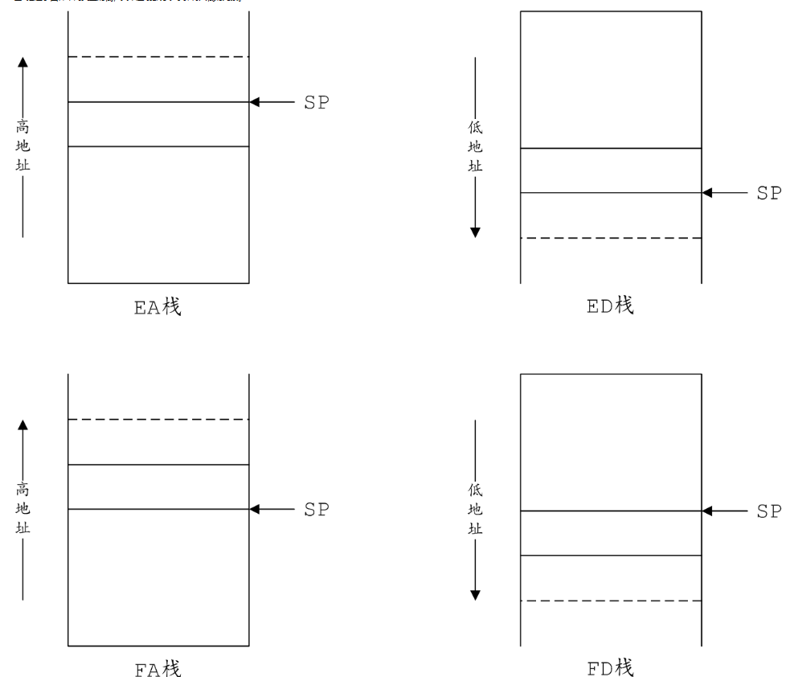

> 此处我个人易混，放一个别人的[链接](https://www.cnblogs.com/fanzhidongyzby/p/5250116.html)

### 3.2.7 块拷贝寻址

- 多寄存器传送指令用于将一块数据从存储器的某一位置拷贝到另一位置。 如：STMIA R0!,{R1-R7} ; 将R1～R7的数据保存到存储器中。
- IA (increment after)  事后递增方式
- IB (increment before)  事先递增方式
- DA (decrement after)  事后递减方式
- DB (decrement before)  事先递减方式

批量load/store指令可以实现在一组寄存器和一块连续的内存单元之间传输数据。例如：

LDMIA R13,{R5-R8} ;将内存单元（R13）到（R13+12）4个数据读取到R5-R8的4个寄存器中。

### 3.2.8 相对寻址

与基址变址寻址方式相类似，相对寻址是基址寻址的一种变通。

相对寻址以程序计数器PC的当前值为基地址，指令中的地址标号作为偏移量，将两者相加之后得到操作数的有效地址。以下程序段完成子程序的调用和返回，跳转指令BL采用了相对寻址方式：

```
BL  NEXT      ；跳转到子程序NEXT处执行
		……                         
NEXT			；跳转地址：PC+NEXT
		……                             
		MOV  PC，LR        ；从子程序返回
```

## 课后练习

下面哪些立即数是数据处理指令中有效的数据? 并分别写出指令编码中的立即数和循环移位的位数。

 **a) 0x0000ef00    b) 0x00011113**    

 **c) 0xf0000009   d) 0x08000012**   

 **e) 0x00001280    f) 0xffffffff**

 **g) 0x00ab0000    h) 0x0001ffff**    

 **i) 0xf000001a   j) 0x08000012**   

 **k) 0x00001f80    l) 0xf0f0f0f0**


 STMFD sp!, {R0-R5,LR}是一条批量存储指令，画出该指令执行前后内存中数据存放及栈指针变化情况，并简述该指令的操作过程。