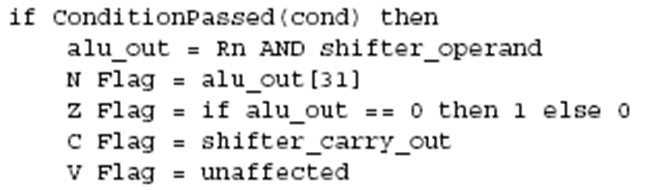

# **ARM体系结构与编程**

# 3.3 ARM指令集

ARM指令集的六大类指令进行详细的描述

- **跳转指令**
- **数据处理指令**
- **Load/store指令**
- **程序状态寄存器传输指令**
- **协处理器指令**
- **异常中断产生指令** 


#### ARM指令具有以下特点：

- ARM指令集含有十分多的未定义指令；
- ARM指令代码域最高4位[31:28]是条件码域；
- ARM指令一般把位[27:20]作为指令码域；
- 位[19:0]包含立即数、寄存器和偏移量等信息；
- ARM指令集为寄存器寻址安排4位代码，4位可寻址16个寄存器；
- 大多数情况下，目标寄存器Rd的寄存器编号存放在[15:12]位域；
- 位[20]是条件标志S存放位。

#### ARM指令代码一般可以分为5个域：

- 条件码域[31:28] ，4位条件码共有16种组合；
- 指令代码域[27:20]，除指令编码外、还包含几个很重要的指令特征位和可选后缀的编码；
- 地址基址Rn域[19:16]，4位可编码R0-R15共16个寄存器；
- 目标或源寄存器Rd域[15:12]，4位可编码R0-R15共16个寄存器；
- 地址偏移或操作寄存器、操作数域[11:0]。

#### 指令可选后缀－ S后缀

S后缀的含义：

- 使用S后缀时，指令执行后程序状态寄存器的条件标志位将刷新；如：ADDS R3,R5,R8
- 不使用S后缀时，指令执行后程序状态寄存器的条件标志位将不发生变化。如：ADD R3,R5,R8

S后缀的使用范围：

- 有些指令不需要加S后缀，在执行时同样可以刷新条件标志位；如：CMP, TEQ, TST等。
- 有些指令不会引起条件标志位的变化，如：STR R5, [R7]

S后缀的使用目的：

- 在需要的时候，对条件进行测试。

在书写时，S后缀紧跟在指令助记符后面。

#### 指令可选后缀－ ！后缀

！后缀的含义：

- 在指令的地址表达式中含有！后缀时，指令执行后，基址寄存器中的地址将发生变化，变化的结果如下：
  - 基址寄存器中的地址值（指令执行后）＝指令执行前的值＋地址偏移量
- 如果指令不含！后缀，则地址值不会发生变化。

！后缀的位置和范围：

- ！后缀必须紧跟在表达地址的表达式后面，而地址表达式要有明确的地址偏移量；
- ！后缀不能用在R15的后面；
- 当使用在单个地址寄存器后面时，必须确信这个寄存器有隐性的偏移量，如：STMDB R1!, {R3,R14} 

#### 指令可选后缀－ B后缀/ H后缀

- B后缀的含义：
  - 指令所涉及的数据是一字节，不是一字或半字。如：LDRB R0, [R1,#4]
- B后缀的位置：
  - B后缀紧跟在指令助记符后面。
- H后缀的含义：
  - 指令所涉及的数据是二字节，不是一字。如：LDRH R0, [R1,#4]
- H后缀的位置：
  - H后缀紧跟在指令助记符后面。

#### 指令可选后缀－ T后缀

T后缀的含义：

- 指令在特权模式下对存储器的访问，将被存储器看成是用户模式的访问。

T后缀的限制：

- 一般只用在字传送和无符号字节传送中；
- 在用户模式下不可选用，选用是没有意义的；
- 不能与事先更新寻址一起使用

#### 指令可选后缀－ 条件后缀

- 条件后缀的定义：
  - 如果满足后缀条件，则执行本条指令；否则不执行本条指令。
- 条件后缀只是影响指令的是否执行，不影响指令的内容。
- 条件后缀的说明：
  - 条件后缀的含义为满足则执行，不满足则不执行；
  - 被测试条件位有Z、C、N和V；
  - 条件后缀共有15种，其编码称条件码，为4位代码；
  - 在指令代码中，条件码排列在最高4位[31:28]；
  - 在汇编语言中，条件码助记符紧接在指令助记符后面；
  - 无条件后缀AL应该省略不用。
- 条件后缀和S后缀的关系：
  - 如果既选条件后缀也选S后缀，则书写中“S”排列在后面；
  - 条件后缀是要测试条件标志位，而S后缀是要刷新条件标志位；
  - 条件后缀要测试的是指令执行前的标志位，而S后缀是依据指令执行的结果改变条件标志。

## 3.3.1 跳转指令

跳转指令用于实现程序流程的跳转，在ARM程序中有两种方法可以实现程序流程的跳转：

- **使用专门的跳转指令。**
- **直接向程序计数器PC写入跳转地址值。**

  通过向程序计数器PC写入跳转地址值，可以实现在4GB的地址空间中的任意跳转，在跳转之前结合使用

```
   MOV  LR，PC
```

 等类似指令，可以保存将来的返回地址值，从而实现在4GB连续的线性地址空间的子程序调用。


ARM指令集中的跳转指令可以完成从当前指令向前或向后的32MB的地址空间的跳转，包括以下4条指令：

- **B  转指令**
- **BL** **带返回的跳转指令**
- **BLX** **带返回和状态切换的跳转指令(ARM7不支持)**
- **BX带状态切换的跳转指令**

#### 跳转指令的编码


处理器把偏移量左移两位，进行符号扩展后再与PC相加 

- 跳转范围：± 32 Mbyte （2^25）
- **如何执行长跳转？**

**直接向程序计数器PC写入跳转地址值（长跳转）**


##### 1、 B指令

- B指令的格式为：
  -   **B{条件}** **目标地址**
- B指令是最简单的跳转指令。一旦遇到一个 B 指令，ARM 处理器将立即跳转到给定的目标地址，从那里继续执行。

**注意存储在跳转指令中的实际值是相对当前PC值的一个偏移量，而不是一个绝对地址，它的值由汇编器来计算**（参考寻址方式中的相对寻址）。它是 24 位有符号数，有符号扩展为 32 位后左移两位，表示的有效偏移为 26 位(前后**32MB**的地址空间)。

指令操作的伪代码：


```
B指令的例子：
B  Label ；程序无条件跳转到标号Label处执行
CMP   R1，＃0 ；当CPSR寄存器中的Z条件码置位时，程序跳转到标号Label处执行
BEQ   Label       
```

#####  

##### 2、 BL指令


BL指令的格式为：

   **BL{条件}** **目标地址**

 BL 是另一个跳转指令，**但跳转之前，会在寄存器R14中保存PC的当前内容**，因此，可以通过将R14 的内容重新加载到PC中，来返回到跳转指令之后的那个指令处执行。

以下指令：

  BL  Label ；当程序无条件跳转到标号Label处执行时，同 时将当前的PC值保存到R14中。


条件跳转


##### 3、 BLX指令

BLX指令的格式为：

  **BLX** **目标地址**

BLX 目标地址指令从ARM指令集跳转到指令中所指定的目标地址，并将处理器的工作状态有ARM状态切换到Thumb状态，该指令同时将PC的当前内容保存到寄存器R14中。

因此，当子程序使用Thumb指令集，而调用者使用ARM指令集时，可以通过BLX指令实现子程序的调用和处理器工作状态的切换。同时，子程序的返回可以通过将寄存器R14值复制到PC中来完成。

- **本指令属于无条件执行的指令。**
- 从ARM到Thumb的状态切换，并可以通过BX R14返回。


指令编码中的bit[24]被作为目标地址的bit[1]


BLX指令的格式为：

  **BLX{条件}  < Rm>**

BLX{条件}  < Rm>指令跳转到指令中所指定的目标地址，目标地址处的指令既可以是ARM指令，也可以是Thumb指令。目标地址处的指令类型由寄存器< Rm>的bit[0]决定。

**从ARM到ARM或Thumb的状态切换。**

指令操作的伪代码：


##### 4、 BX指令

BX指令的格式为：

 BX{条件} < Rm> 

BX指令跳转到指令中所指定的目标地址，目标地址处的指令既可以是ARM指令，也可以是Thumb指令。

目标地址处的指令类型由寄存器<Rm>的bit[0]决定。

指令操作的伪代码：


#### 三种子程序的返回方法

```
MOV PC, R14

BX R14

当子程序入口中使用了
	STMFD R13!, {< registers>,R14}时，可以用指令
	LDMFD R13!, {< registers>,PC}返回
```


## 3.3.2 数据处理指令

数据处理指令可分为数据传送指令、算术逻辑运算指令和比较指令等。

- 数据传送指令用于在寄存器和第二个操作数之间进行数据的传输。
- 算术逻辑运算指令完成常用的算术与逻辑的运算，该类指令不但将运算结果保存在目的寄存器中，同时更新CPSR中的相应条件标志位。
- 比较指令不保存运算结果，只更新CPSR中相应的条件标志位。

> 包括：
>
> 算术指令： **ADD ADC SUB SBC RSB RSC**
>
> 逻辑指令： **AND ORR EOR BIC**
>
> 比较指令： **CMP CMN TST TEQ**
>
> 数据搬移： **MOV MVN**
>
> **上述指令只能对寄存器操作，不能针对存储器。**
>
> 语法：
>
>  **< 操作>{< cond>}{S} Rd, Rn, Operand2**
>
> 比较指令影响标志位 -不指定Rd
>
> 数据搬移不指定Rn
>
> **第二个操作数通过桶型移位器送到ALU中。**


#### 桶型移位器


桶型移位器: 第二个操作数


​		寄存器, 可选择是否增加移位操作.

移位值可以是：

-  5 bit 无符号整数
- 放在另一个寄存器的低字节（8bits）

用于常数乘法

​     立即数

- 8 bit ，大小范围0-255。
  - 右移偶数位
- 允许直接加载32-bit 常数到寄存器中


##### 1、 MOV指令

- MOV指令的格式为：
  -  MOV{条件}{S} 目的寄存器，源操作数
- MOV指令可完成从另一个寄存器、被移位的寄存器或将一个立即数加载到目的寄存器。
- 其中S选项决定指令的操作是否影响CPSR中条件标志位的值，当没有S时指令不更新CPSR中条件标志位的值。
- **当PC作为目标寄存器且指令中S位被置位时，指令在执行跳转操作的同时，将当前处理器模式的SPSR内容复制到CPSR中。**

> **MOVS PC, LR可以实现从某些异常中断中返回**


```
  MOV   R1，R0 ；将寄存器R0的值传送到寄存器R1
  MOV   PC，R14 ；将寄存器R14的值传送到PC，常用于子程序返回
  MOV   R1，R0，LSL＃3 ；将寄存器R0的值左移3位后传送到R1
  MOV   R1，＃123 ；将立即数123传送到R1
```


##### 2、 MVN指令

- MVN指令的格式为：
  -  MVN{条件}{S} 目的寄存器，源操作数
- MVN指令可完成从另一个寄存器、被移位的寄存器、或将一个立即数加载到目的寄存器。
- 与MOV指令不同之处是在传送之前**按位被取反**了，即把一个被取反的值传送到目的寄存器中。
- 其中S决定指令的操作是否影响CPSR中条件标志位的值，当没有S时指令不更新CPSR中条件标志位的值。


>  MVN  R0，＃0 ；将立即数0取反传送到寄存器R0中，完成后 **R0=-1**


##### 3、 CMP指令

- CMP指令的格式为：
  -  CMP{条件} 操作数1，操作数2
- CMP指令用于把一个寄存器的内容和另一个寄存器的内容或立即数进行比较，同时更新CPSR中条件标志位的值。
- 该指令进行一次**减法**运算，但不存储结果，只更改条件标志位。标志位表示的是操作数1与操作数2的关系(大、小、相等)，例如，当操作数1大于操作操作数2，则此后的有GT 后缀的指令将可以执行。


> CMP  R1，R0 ；将寄存器R1的值与寄存器R0的值相减，并根据 结果设置CPSR的标志位
>
>   CMP  R1，＃100 ；将寄存器R1的值与立即数100相减，并根据 结果设置CPSR的标志位


##### 4、 CMN指令

- CMN指令的格式为：
  -  CMN{条件} 操作数1，操作数2
- CMN指令用于把一个寄存器的内容和另一个寄存器的内容或立即数取反后进行比较，同时更新CPSR中条件标志位的值。
- 该指令实际完成操作数1和操作数2**相加**，并根据结果更改条件标志位。

> **CMP指令与SUBS指令的区别在于CMP指令不保存操作结果**


>    CMN  R1，R0 ；将寄存器R1的值与寄存器R0的值相 加，并根据结果设置CPSR的标志位
>
>   CMN  R1，＃100 ；将寄存器R1的值与立即数100相 加，并根据结果设置CPSR的标志位


##### 5、 TST指令

TST指令的格式为：

 TST{条件} 操作数1，操作数2

TST指令用于把一个寄存器的内容和另一个寄存器的内容或立即数进行**按位与运算**，并根据运算结果更新CPSR中条件标志位的值。

操作数1是要测试的数据，而操作数2是一个位掩码，该指令一般用来检测是否设置了特定的位。

> **TST指令用于测试寄存器中某些位是1还是0**



>  TST  R1，＃％1 ；用于测试在寄存器R1中是否设置了最低 位（％表示二进制数）
>
>   TST  R1，＃0xfe ；将寄存器R1的值与立即数0xfe按位 与，并根据结果设置CPSR的标志位


##### 6、 TEQ指令

- TEQ指令的格式为：
  -  TEQ{条件} 操作数1，操作数2
- TEQ指令用于把一个寄存器的内容和另一个寄存器的内容或立即数进行**按位异或运算**，并根据运算结果更新CPSR中条件标志位的值。

> **TEQ指令通常用于比较操作数1和操作数2是否相等**


>  TEQ  R1，R2 ；将寄存器R1的值与寄存器R2的值按位异或， 并根据结果设置CPSR的标志位


##### 7、 ADD指令

- ADD指令的格式为：
  -  ADD{条件}{S} 目的寄存器，操作数1，操作数2
- ADD指令用于把两个操作数相加，并将结果存放到目的寄存器中。
- 操作数1应是一个寄存器，操作数2可以是一个寄存器，被移位的寄存器，或一个立即数。


> ADD  R0，R1，R2 ； R0 = R1 + R2
>
>   ADD  R0，R1，#256 ； R0 = R1 + 256
>
>   ADDS  R0，R2，R3，LSL#1 ； R0 = R2 + (R3 << 1)


#####  8、 ADC指令

- ADC指令的格式为：
  -  ADC{条件}{S} 目的寄存器，操作数1，操作数2
- ADC指令用于把两个操作数相加，再加上CPSR中的C条件标志位的值，并将结果存放到目的寄存器中。
- **它使用一个进位标志位，这样就可以做比32位大的数的加法，注意不要忘记设置S后缀来更改进位标志**。
- 操作数1应是一个寄存器，操作数2可以是一个寄存器，被移位的寄存器，或一个立即数。

> **ADC指令和ADD指令联合使用可以实现64位、128位的加法操作**


以下指令序列完成两个128位数的加法，第一个数由高到低存放在寄存器R7～R4，第二个数由高到低存放在寄存器R11～R8，运算结果由高到低存放在寄存器R3～R0：

```
   ADDS   R0，R4，R8     ； 加低端的字
   ADCS   R1，R5，R9     ； 加第二个字，带进位
   ADCS   R2，R6，R10   ； 加第三个字，带进位
   ADC     R3，R7，R11    ； 加第四个字，带进位
```


##### 9、 SUB指令

- SUB指令的格式为：
  -  SUB{条件}{S} 目的寄存器，操作数1，操作数2
- SUB指令用于把操作数1减去操作数2，并将结果存放到目的寄存器中。
- 操作数1应是一个寄存器，操作数2可以是一个寄存器，被移位的寄存器，或一个立即数。
- 该指令可用于有符号数或无符号数的减法运算。


>   SUB   R0，R1，R2  ； R0 = R1 - R2
>
>   SUB   R0，R1，#256  ； R0 = R1 - 256
>
>   SUBS  R0，R2，R3，LSL#1 ； R0 = R2 - (R3 << 1)


##### 10、SBC指令

- SBC指令的格式为：
  -  SBC {条件 }{ S} 目的寄存器，操作数1，操作数2
- SBC指令用于把操作数1减去操作数2，再减去CPSR中的**C条件标志位的反码**，并将结果存放到目的寄存器中。
- 操作数1应是一个寄存器，操作数2可以是一个寄存器，被移位的寄存器，或一个立即数。
- 该指令使用进位标志来表示借位，这样就可以做大于32位的减法，注意不要忘记设置S后缀来更改进位标志。
- 该指令可用于有符号数或无符号数的减法运算

> **SBC指令和SUB指令联合使用可以实现64位、128位的减法操作**


>   SBC R0，R1，R2 ；R0 = R1 - R2 - ！C，并根据结 果设置CPSR的进位标志位


##### 11、RSB指令

- RSB指令的格式为：
  -  RSB{条件}{S} 目的寄存器，操作数1，操作数2
- RSB指令称为逆向减法指令，用于把操作数2减去操作数1，并将结果存放到目的寄存器中。
- 操作数1应是一个寄存器，操作数2可以是一个寄存器，被移位的寄存器，或一个立即数。
- 该指令可用于有符号数或无符号数的减法运算。


>  RSB   R0，R1，R2 ； R0 = R2 – R1
>
>   RSB   R0，R1，#256 ； R0 = 256 – R1
>
>   RSBS  R0，R2，R3，LSL#1 ； R0 = (R3 << 1) - R2


#####  12、RSC指令

- RSC指令的格式为：
  -  RSC{条件}{S} 目的寄存器，操作数1，操作数2
- RSC指令用于把操作数2减去操作数1，再减去CPSR中的**C**条件标志位的反码，并将结果存放到目的寄存器中。
- 操作数1应是一个寄存器，操作数2可以是一个寄存器，被移位的寄存器，或一个立即数。
- **该指令使用进位标志来表示借位，这样就可以做大于32位的减法，注意不要忘记设置S后缀来更改进位标志。**
- 该指令可用于有符号数或无符号数的减法运算。

> **RSC指令和RSB指令联合使用可以实现64位、128位的减法操作**


>  RSC  R0，R1，R2  ； R0 = R2 – R1 - ！C


##### 13、AND指令

- AND指令的格式为：
-  AND{条件}{S} 目的寄存器，操作数1，操作数2
- AND指令用于在两个操作数上进行**逻辑与运算**，并把结果放置到目的寄存器中。
- 操作数1应是一个寄存器，操作数2可以是一个寄存器，被移位的寄存器，或一个立即数。
- **该指令常用于屏蔽操作数1的某些位。**

> **设置一个掩码值，AND指令可以提取寄存器中某些位的值**


>  AND  R0，R0，＃3  ； 该指令保持R0的0、1位，其余位 清零。


##### 14、ORR指令

- ORR指令的格式为：
  -  ORR{条件}{S} 目的寄存器，操作数1，操作数2
- ORR指令用于在两个操作数上进行**逻辑或运算**，并把结果放置到目的寄存器中。
- 操作数1应是一个寄存器，操作数2可以是一个寄存器，被移位的寄存器，或一个立即数。
- **该指令常用于设置操作数1的某些位。**

> **设置一个掩码值，ORR指令可以设置寄存器中某些位的值为1**


>   ORR  R0，R0，＃3 ； 该指令设置R0的0、1位，其余位保持 不变。


##### 15、EOR指令

- EOR指令的格式为：
  -  EOR{条件}{S} 目的寄存器，操作数1，操作数2
- EOR指令用于在两个操作数上进行**逻辑异或运算**，并把结果放置到目的寄存器中。
- 操作数1应是一个寄存器，操作数2可以是一个寄存器，被移位的寄存器，或一个立即数。
- **该指令常用于反转操作数1的某些位。**

> **设置一个掩码值，EOR指令可以将寄存器中某些位的值取反**


>   EOR  R0，R0，＃3  ； 该指令反转R0的0、1位，其余位保 持不变。


##### 16、BIC指令

- BIC指令的格式为：
  -  BIC{条件}{S} 目的寄存器，操作数1，操作数2
- BIC指令用于清除操作数1的某些位，并把结果放置到目的寄存器中。
- 操作数1应是一个寄存器，操作数2可以是一个寄存器，被移位的寄存器，或一个立即数。
- 操作数2为32位的掩码，**如果在掩码中设置了某一位，则清除这一位**，**未设置的掩码位保持不变**。

> **设置一个掩码值，BIC指令可以将寄存器中某些位的值设置成0**


>   BIC  R0，R0，＃％1011 ； 该指令清除 R0 中的位 0、1、和  3，其余的位保持不变。

## 3.3.3 乘法指令与乘加指令

ARM微处理器支持的乘法指令与乘加指令共有6条，可分为运算结果为32位和运算结果为64位两类，与前面的数据处理指令不同:

- **指令中的所有操作数、目的寄存器必须为通用寄存器，不能对操作数使用立即数或被移位的寄存器**
- **同时，目的寄存器和操作数1必须是不同的寄存器**

乘法指令与乘加指令共有以下6条：

> MUL   32位乘法指令
>
> MLA   32位乘加指令
>
> SMULL  64位有符号数乘法指令
>
> SMLAL  64位有符号数乘加指令
>
> UMULL  64位无符号数乘法指令
>
> UMLAL  64位无符号数乘加指令


#### 1、 MUL指令

- MUL指令的格式为：
  -   MUL{条件}{S} 目的寄存器，操作数1，操作数2
- MUL指令完成将操作数1与操作数2的乘法运算，并把结果放置到目的寄存器中，同时可以根据运算结果设置CPSR中相应的条件标志位。
- 其中，操作数1和操作数2均为32位的有符号数或无符号数。

> **结果仅保存了64位的低32位**


####  2、 MLA指令

- MLA指令的格式为：

-  MLA{条件}{S}  目的寄存器， 操作数1，操作数2，操作数3

  

- MLA指令完成将操作数1与操作数2的乘法运算，再将乘积加上操作数3，并把结果放置到目的寄存器中，同时可以根据运算结果设置CPSR中相应的条件标志位。

  - 其中，操作数1和操作数2均为32位的有符号数或无符号数


>  MLA   R0，R1，R2，R3 ；R0 = R1 × R2 + R3
>
>   MLAS R0，R1，R2，R3  ；R0 = R1 × R2 + R3，同时设 置CPSR中的相关条件标志位


#### 3、 SMULL指令

- SMULL指令的格式为：
  -  SMULL{条件}{S}  目的寄存器Low，目的寄存器低High，操作数1，操作数2
- SMULL指令完成将操作数1与操作数2的乘法运算，并把结果的低32位放置到目的寄存器Low中，结果的高32位放置到目的寄存器High中，同时可以根据运算结果设置CPSR中相应的条件标志位。
- 其中，操作数1和操作数2均为32位的有符号数。


>   			  	SMULL R0，R1，R2，R3 
>			  	；R0 = （R2 × R3）的低32位
>  			    ；R1 = （R2 × R3）的高32位           
>


####  4、 SMLAL指令

- SMLAL指令的格式为：
  -  SMLAL{条件}{S}  目的寄存器Low，目的寄存器低High，操作数1，操作数2
- SMLAL指令完成将操作数1与操作数2的乘法运算，并把结果的低32位同目的寄存器Low中的值相加后又放置到目的寄存器Low中，结果的高32位同目的寄存器High中的值相加后又放置到目的寄存器High中，同时可以根据运算结果设置CPSR中相应的条件标志位。
  - 其中，操作数1和操作数2均为32位的有符号数。
- 对于目的寄存器Low，在指令执行前存放64位加数的低32位，指令执行后存放结果的低32位。
- 对于目的寄存器High，在指令执行前存放64位加数的高32位，指令执行后存放结果的高32位。


> 			 SMLAL R0，R1，R2，R3
> 			 ；R0 = （R2 × R3）的低32位 ＋ R0
> 			 ；R1 = （R2 × R3）的高32位 ＋ R1 ＋ C
>


#### 5、 UMULL指令

- UMULL指令的格式为：
  -  UMULL{条件}{S}  目的寄存器Low，目的寄存器低High，操作数1，操作数2
- UMULL指令完成将操作数1与操作数2的乘法运算，并把结果的低32位放置到目的寄存器Low中，结果的高32位放置到目的寄存器High中，同时可以根据运算结果设置CPSR中相应的条件标志位。
  - 其中，操作数1和操作数2均为32位的无符号数。


> 	UMULL R0，R1，R2，R3 	
>	；R0 = （R2 × R3）的低32位
>  	；R1 = （R2 × R3）的高32位               
>


#### 6、 UMLAL指令

- UMLAL指令的格式为：
  -  UMLAL{条件}{S}  目的寄存器Low，目的寄存器低 High，操作数1，操作数2
- UMLAL指令完成将操作数1与操作数2的乘法运算，并把结果的低32位同目的寄存器Low中的值相加后又放置到目的寄存器Low中，结果的高32位同目的寄存器High中的值相加后又放置到目的寄存器High中，同时可以根据运算结果设置CPSR中相应的条件标志位。
  - 其中，操作数1和操作数2均为32位的无符号数。
- 对于目的寄存器Low，在指令执行前存放64位加数的低32位，指令执行后存放结果的低32位。
- 对于目的寄存器High，在指令执行前存放64位加数的高32位，指令执行后存放结果的高32位。


>  ​				UMLAL R0，R1，R2，R3    
>
> ​			  ；R0 = （R2 × R3）的低32位 ＋ R0
>
> ​              ；R1 = （R2 × R3）的高32位 ＋ R1 ＋C

## 课后练习

用一条指令实现下列表达式：

- R2=R1+R0
- R2=R1-64
- R2=32-R1
- R5=R5*R4 (32位乘法)
- R5=R4*R3+R2 (32位乘法)
- R4=R3+R2*16
- R4=5*R3
- R4=7*R3
- 分别将寄存器R2的bit8、bit7置位和清零。