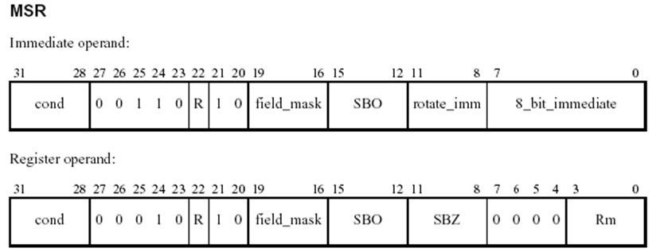
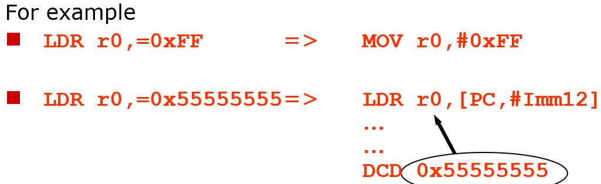
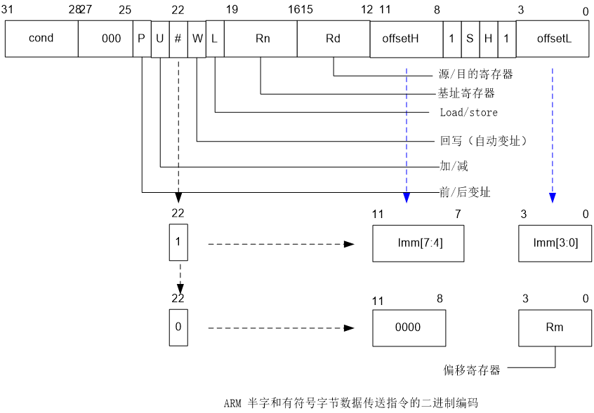
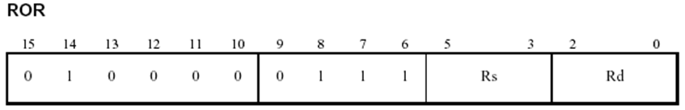
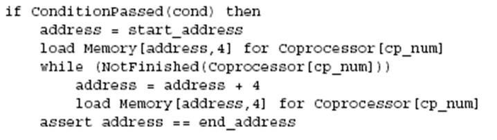
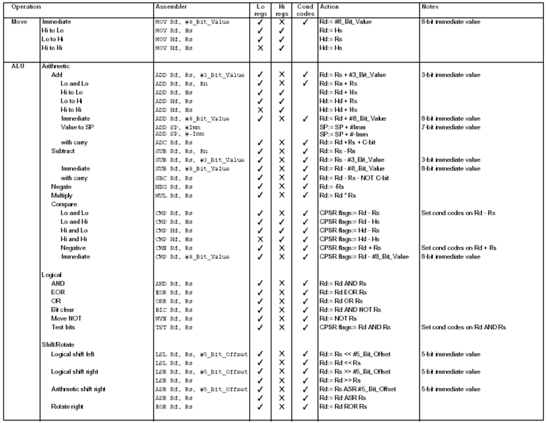

# **ARM体系结构与编程**

### 3.3.4 程序状态寄存器访问指令

 ARM微处理器支持程序状态寄存器访问指令，用于在程序状态寄存器和通用寄存器之间传送数据，程序状态寄存器访问指令包括以下两条：

- MRS 程序状态寄存器到通用寄存器的数据传送指令
- MSR 通用寄存器到程序状态寄存器的数据传送指令


#### 1、 MRS指令

MRS指令的格式为：

>  MRS{条件}  通用寄存器，程序状态寄存器（CPSR或SPSR）

MRS指令用于将程序状态寄存器的内容传送到通用寄存器中。

该指令一般用在以下几种情况：

**当需要改变程序状态寄存器的内容时，可用MRS将程序状态寄存器的内容读入通用寄存器，修改后再写回程序状态寄存器。**

**当在异常处理或进程切换时，需要保存程序状态寄存器的值，可先用该指令读出程序状态寄存器的值，然后保存**


```
MRS   R0，CPSR   ；传送CPSR的内容到R0
MRS   R0，SPSR   ；传送SPSR的内容到R0
```



#### 2、MSR指令

MSR指令的格式为：

>  MSR{条件}  程序状态寄存器（CPSR或SPSR）_<域>，操作数

MSR指令用于将操作数的内容传送到程序状态寄存器的特定域中。

其中，操作数可以为通用寄存器或立即数


< 域>用于设置程序状态寄存器中需要操作的位，32位的程序状态寄存器可分为4个域：

- 位[31：24]为条件标志位域，用**f**表示；
- 位[23：16]为状态位域，用**s**表示；
- 位[15：8]为扩展位域，用**x**表示；
- 位[7：0]为控制位域，用**c**表示；


该指令通常用于恢复或改变程序状态寄存器的内容，在使用时，一般要在MSR指令中指明将要操作的域。

**用户模式下，所有位均可以被读取，但只有条件标志位(_f)可被写。**

```
MSR   CPSR_c，R0  ；传送R0的内容到CPSR ，但仅仅修改CPSR中的控制位域
MSR   SPSR_f，R0  ；传送R0的内容到SPSR ，但仅仅修改SPSR中的条件标志位域
```

> 例子
>
> 将处理器模式切换到特权模式
>
> MRS R0, CPSR 
>
> BIC R0, R0, #0x1F
>
> ORR R0, R0, #0x13 ;set Supervisor mode
>
> MSR CPSR_c, R0

### 3.3.5 加载/存储指令

ARM微处理器支持加载/存储指令用于在寄存器和存储器之间传送数据，加载指令用于将存储器中的数据传送到寄存器，存储指令则完成相反的操作。常用的加载存储指令如下：

| NAME |                  |
| ---- | ---------------- |
| LDR  | 字数据加载指令   |
| LDRB | 字节数据加载指令 |
| LDRH | 半字数据加载指令 |
| STR  | 字数据存储指令   |
| STRB | 字节数据存储指令 |
| STRH | 半字数据存储指令 |


#### 1、LDR指令

LDR指令的格式为：

>  LDR{条件} 目的寄存器，<存储器地址>


- LDR指令用于从存储器中将一个32位的字数据传送到目的寄存器中。
- 该指令通常用于从存储器中读取32位的字数据到通用寄存器，然后对数据进行处理。
- 当程序计数器PC作为目的寄存器时，指令从存储器中读取的字数据被当作目的地址，从而可以实现程序流程的跳转。
- 该指令在程序设计中比较常用，且寻址方式灵活多样


```
	LDR   R0，[R1]   	；将存储器地址为R1的字数据读入寄存器R0。
    LDR   R0，[R1，R2]   ；将存储器地址为R1+R2的字数据读入寄存器R0。
    LDR   R0，[R1，＃8]     ；将存储器地址为R1+8的字数据读入寄存器R0。
   	LDR   R0，[R1，R2] ！ ；将存储器地址为R1+R2的字数据读入寄存器R0，并将新地址R1＋R2写入R1。
    LDR   R0，[R1，＃8] ！ ；将存储器地址为R1+8的字数据读入寄存器R0，并将新地址R1＋8写入R1。
    LDR   R0，[R1]，R2  ；将存储器地址为R1的字数据读入寄存器R0，并将新地址R1＋R2写入R1。
    LDR   R0，[R1，R2，LSL＃2]！ ；将存储器地址为R1＋R2×4	的字数据读入寄存器R0，并将新地址R1＋R2×4写入R1。
    LDR   R0，[R1]，R2，LSL＃2  ；将存储器地址为R1的字数据读入寄存器R0，并将新地址R1＋R2×4写入R1。
```


为允许装载大常数，汇编器提供了一条伪指令:

```
LDR rd, =const
```

它可能汇编成下列指令：

```
MOV or  MVN
或
LDR 指令，从数据池（Literal pools）读取常数
```



推荐使用这种方法把常数装入寄存器 。

**地址访问**

LDR/STR访问的地址由基址寄存器加上偏移量来产生。

针对word和无符号byte 的访问, 偏移量可以是：

一个无符号12-bit立即数 (如 0 - 4095 bytes).

```
LDR r0,[r1,#8]
```

一个寄存器，或再加上移位（由立即数指定）

```
LDR r0,[r1,r2]
LDR r0,[r1,r2,LSL#2]
```

可以是从基址寄存器上加或减去偏移量:

```
LDR r0,[r1,#-8]
LDR r0,[r1,-r2]
LDR r0,[r1,-r2,LSL#2]
```

对于halfword和带符号的halfword / byte, 偏移量可以是:

- 一个无符号8 bit 立即数 (如 0-255 bytes).
- 一个寄存器 (不能偏移)。

可选择采用*pre-indexed*或*post-indexed*方式寻址




#### 2、LDRB指令

LDRB指令的格式为：

```
			LDR{条件}B 目的寄存器，<存储器地址>
```

LDRB指令用于从存储器中将一个8位的字节数据传送到目的寄存器中，同时将寄存器的高24位清零。

该指令通常用于从存储器中读取8位的字节数据到通用寄存器，然后对数据进行处理。

当程序计数器PC作为目的寄存器时，指令从存储器中读取的字数据被当作目的地址，从而可以实现程序流程的跳转。


```
	LDRB R0，[R1]   ；将存储器地址为R1的字节数据读入寄存器R0，并将R0的高24位清零。
    LDRB R0，[R1，＃-8]  ；将存储器地址为R1-8的字节数据读入寄存器R0，并将R0的高24位清零。
```


#### 3、LDRH指令

LDRH指令的格式为：

```
			LDR{条件}H 目的寄存器，<存储器地址>
```

- LDRH指令用于从存储器中将一个16位的半字数据传送到目的寄存器中，同时将寄存器的高16位清零。
- 该指令通常用于从存储器中读取16位的半字数据到通用寄存器，然后对数据进行处理。
- 当程序计数器PC作为目的寄存器时，指令从存储器中读取的字数据被当作目的地址，从而可以实现程序流程的跳转


```
	LDRH R0，[R1]    ；将存储器地址为R1的半字数据读入寄存器R0，并将R0的高16位清零。
     LDRH R0，[R1，＃8]    ；将存储器地址为R1＋8的半字数据读入寄存器R0，并将R0的高16位清零。
     LDRH R0，[R1，R2]    ；将存储器地址为R1＋R2的半字数据读入寄存器R0，并将R0的高16位清零
```


####  4、STR指令

STR指令的格式为：

```
STR{条件} 源寄存器，<存储器地址>
```

- STR指令用于从源寄存器中将一个32位的字数据传送到存储器中。
- 该指令在程序设计中比较常用，且寻址方式灵活多样，使用方式可参考指令LDR。


```
	STR   R0，[R1]，＃8 ；将R0中的字数据写入以R1为地址的存储器中，并将新地址R1＋8写入R1。
    STR   R0，[R1，＃-8] ；将R0中的字数据写入以R1-8为地址的存储器中。
```


#### 5、STRB指令

STRB指令的格式为：

```
		STR{条件}B 源寄存器，<存储器地址>
```

STRB指令用于从源寄存器中将一个8位的字节数据传送到存储器中。

该字节数据为源寄存器中的低8位。


```
	STRB R0，[R1]  ；将寄存器R0中的字节数据写入以R1为地址的存储器中。
    STRB R0，[R1，＃8] ；将寄存器R0中的字节数据写入以R1＋8为地址的存储器中。

```


#### 6、STRH指令

STRH指令的格式为：

```
			STR{条件}H 源寄存器，<存储器地址>
```

STRH指令用于从源寄存器中将一个16位的半字数据传送到存储器中。

该半字数据为源寄存器中的低16位。


```
	STRH R0，[R1]  ；将寄存器R0中的半字数据写入以R1为地址的存储器中。
    STRH R0，[R1，＃8]  ；将寄存器R0中的半字数据写入以R1＋8为地址的存储器中。

```

### 3.3.6 批量数据加载/存储指令

 ARM微处理器所支持批量数据加载/存储指令可以一次在一片连续的存储器单元和多个寄存器之间传送数据，批量加载指令用于将一片连续的存储器中的数据传送到多个寄存器，批量数据存储指令则完成相反的操作。常用的加载存储指令如下：

```
LDM     批量数据加载指令
STM     批量数据存储指令
```

LDM（或STM）指令的格式为：

```
LDM（或STM）{条件}{类型}   基址寄存器{！}，寄存器列表{∧}
```


       


> **注意Rn不自更新，Rn可以出现在寄存器列表中；**
>
> **同时寄存器列表中没有PC。**
>
> **^表示指令中所用的寄存器为用户模式下的寄存器。**
>
> **Rn是指令执行时当前处理器模式对应的物理寄存器。**


**^**表示将当前处理器模式下的**SPSR值复制到CPSR**中。


**如果R15被作为Rn，指令将产生不可预知的结果。**

**主要用于块数据的写入、数据栈操作以及进入子程序时保存相关的寄存器的操作。**


LDM（或STM）指令用于从由基址寄存器所指示的一片连续存储器到寄存器列表所指示的多个寄存器之间传送数据，该指令的常见用途是将多个寄存器的内容入栈或出栈。其中，{类型}为以下几种情况：

| type |                       |
| ---- | --------------------- |
| IA   | **每次传送后地址加**1 |
| IB   | **每次传送前地址加**1 |
| DA   | **每次传送后地址减**1 |
| DB   | **每次传送前地址减**1 |
| FD   | **满递减堆栈**        |
| ED   | **空递减堆栈**        |
| FA   | **满递增堆栈**        |
| EA   | **空递增堆栈**        |

> I:increase 
>
> d:decrease
>
> a:after
>
> b:before
>
> F:full
>
> E:empty
>
> D:Decrease
>
> A:Arise

{**！**}为可选后缀，若选用该后缀，则当数据传送完毕之后，将最后的地址写入基址寄存器，否则基址寄存器的内容不改变。

> 基址寄存器不允许为R15，寄存器列表可以为R0～R15的任意组合。

{**∧**}为可选后缀，**当指令为LDM且寄存器列表中包含R15，选用该后缀时表示：除了正常的数据传送之外，还将SPSR复制到CPSR。同时，该后缀还表示传入或传出的是用户模式下的寄存器，而不是当前模式下的寄存器。**

```
	STMFD  R13!，{R0，R4-R12，LR}      ；将寄存器列表中的寄存器（R0，R4到R12，LR）存入堆栈。
	LDMFD  R13!，{R0，R4-R12，PC}      ；将堆栈内容恢复到寄存器（R0，R4到R12，PC）。

```

#### **LDM / STM 操作**

语法：

```
<LDM|STM>{<cond>}<addressing_mode> Rb{!}, <寄存器 list>
```

4 种寻址操作:

```
 LDMIA / STMIA	Increment After（先操作，后增加）
 LDMIB / STMIB	Increment Before（先增加，后操作）
 LDMDA / STMDA	Decrement After （先操作，后递减）
 LDMDB / STMDB	Decrement Before （先递减，后操作）
```


ARM堆栈操作通过块传送指令来完成:

```
STMFD	(Push)	块存储- Full Descending stack [STMDB]
LDMFD	(Pop)	块装载- Full Descending stack [LDMIA]
```


#### **存储器块拷贝**

可选项“ **!** ”将导致LDM / STM 指令去自动更新基址寄存器

> 后缀为**IA**, **IB时，加上**4 乘以 用于传送的寄存器的数目的值
>
> 后缀为**DA**, **DB时，减去**4乘以用于传送的寄存器的数目的值

; r12指向源数据起始地址

; r14指向源数据尾地址

; r13指向目的数据起始地址

```
Loop		LDMIA	r12!, {r0-r11}	; 装载48 bytes
			STMIA	r13!, {r0-r11}	;和存储them
			CMP	r12, r14	; check for the end
			BNE	loop		;和loop until done
```

此循环传送 48 bytes占用了31周期

时钟为33 MHz时传输速率超过50 Mbytes/sec


### 3.3.7 数据交换指令

 ARM微处理器所支持数据交换指令能在存储器和寄存器之间交换数据。数据交换指令有如下两条：

- SWP   字数据交换指令
- SWPB  字节数据交换指令


#### 1、SWP指令

SWP指令的格式为：

```
		SWP{条件} 目的寄存器，源寄存器1，[源寄存器2]
```

方向：1.[源寄存器2] ->目的寄存器

​			2.源寄存器1->[源寄存器2]

SWP指令用于将源寄存器2所指向的存储器中的字数据传送到目的寄存器中，同时将源寄存器1中的字数据传送到源寄存器2所指向的存储器中。

显然，当源寄存器1和目的寄存器为同一个寄存器时，指令交换该寄存器和存储器的内容。


```
 	SWP   R0，R1，[R2]     ；将R2所指向的存储器中的字数据传送到R0，同时将R1中的字数据传送到R2所指向		的存储单元。
    SWP   R0，R0，[R1]     ；该指令完成将R1所指向的存储器中的字数据与R0中的字数据交换。
```

在寄存器和存储器之间，由一次存储器读和一次存储器写组成的**原子操作**，完成一个字节或字的交换。

语法：

```
 SWP{<cond>}{B} Rd, Rm, [Rn]

```


可用作信号量

不能由armcc编译产生，必须使用汇编器。


#### 2、SWPB指令

SWPB指令的格式为

```
		SWP{条件}B 目的寄存器，源寄存器1，[源寄存器2]

```

SWPB指令用于将源寄存器2所指向的存储器中的字节数据传送到目的寄存器中，目的寄存器的高24清零，同时将源寄存器1中的字节数据传送到源寄存器2所指向的存储器中。

显然，当源寄存器1和目的寄存器为同一个寄存器时，指令交换该寄存器和存储器的内容。


```
	SWPB R0，R1，[R2]     ；将R2所指向的存储器中的字节数据传送到R0，R0的高24位清零，同时将R1中的低		8位数据传送到R2所指向的存储单元。
    SWPB R0，R0，[R1]     ；该指令完成将R1所指向的存储器中的字节数据与R0中的低8位数据交换。

```

### 3.3.8 移位指令（操作）

ARM微处理器内嵌的桶型移位器（Barrel Shifter），支持数据的各种移位操作。

**移位操作在ARM指令集中不作为单独的指令使用，它只能作为指令格式中是一个字段，在汇编语言中表示为指令中的选项**。

例如，数据处理指令的第二个操作数为寄存器时，就可以加入移位操作选项对它进行各种移位操作。

移位操作包括如下6种类型，ASL和LSL是等价的，可以自由互换

|      |                  |
| ---- | ---------------- |
| LSL  | 逻辑左移         |
| LSR  | 逻辑右移         |
| ASL  | 算术左移         |
| ASR  | 算术右移         |
| ROR  | 循环右移         |
| RX   | 带扩展的循环右移 |


#### 1、LSL（或ASL）操作

LSL（或ASL）操作的格式为

```
			通用寄存器，LSL（或ASL） 操作数      

```

LSL（或ASL）可完成对通用寄存器中的内容进行逻辑（或算术）的左移操作，按操作数所指定的数量向左移位，低位用零来填充。其中，操作数可以是通用寄存器，也可以是立即数（0～31）

```
    MOV    R0, R1, LSL#2     ；将R1中的内容左移两位后传送到R0中。

```


#### 2、LSR操作

LSR操作的格式为

```
		通用寄存器，LSR 操作数      
```

nLSR可完成对通用寄存器中的内容进行右移的操作，按操作数所指定的数量向右移位，左端用零来填充。其中，操作数可以是通用寄存器，也可以是立即数（0～31）。

操作示例：

```
  MOV  R0, R1, LSR#2   ；将R1中的内容右移两位后传送 到R0中，左端用零来填充。
```


#### 3、ASR操作

ASR操作的格式为：

```
 通用寄存器，ASR 操作数   
```

ASR可完成对通用寄存器中的内容进行右移的操作，按操作数所指定的数量向右移位，左端用第31位的值来填充。其中，操作数可以是通用寄存器，也可以是立即数（0～31）。

操作示例：

```
  MOV  R0, R1, ASR#2   ；将R1中的内容右移两位后传送 到R0中，左端用第31位的值来填充。
```



#### 4、ROR操作

ROR操作的格式为：

```
		通用寄存器，ROR 操作数      
```

ROR可完成对通用寄存器中的内容进行循环右移的操作，按操作数所指定的数量向右循环移位，左端用右端移出的位来填充。其中，操作数可以是通用寄存器，也可以是立即数（0～31）。显然，当进行32位的循环右移操作时，通用寄存器中的值不改变。

操作示例：

```
  MOV  R0, R1, ROR#2   ；将R1中的内容循环右移两位 后传送到R0中。
```

#### 5、RRX操作

RRX操作的格式为：

```
		通用寄存器，RRX 操作数      
```

RRX可完成对通用寄存器中的内容进行带扩展的循环右移的操作，按操作数所指定的数量向右循环移位，左端用进位标志位C来填充。其中，操作数可以是通用寄存器，也可以是立即数（0～31）。

操作示例：

```
 MOV  R0, R1, RRX #2   ；将R1中的内容进行带扩 展的循环右移两位后传送到R0中。
```

###  3.3.9 协处理器指令

ARM微处理器可支持多达16个协处理器，用于各种协处理操作，在程序执行的过程中，每个协处理器只执行针对自身的协处理指令，忽略ARM处理器和其他协处理器的指令

这有三种协处理器指令

- 协处理器数据处理指令
  -  CDP：初始化协处理器数据处理操作
- 协处理器寄存器传送指令
  -  MRC： 从 ARM 寄存器移到协处理器寄存器
  - MCR：从协处理器寄存器移到ARM 寄存器
- 协处理器存储器传送指令
  - LDC：从存储器装载到协处理器寄存器
  - STC：从协处理器寄存器存储到存储器


#### 1、CDP指令

CDP指令的格式为：

```
CDP{条件} 协处理器编码，协处理器操作码1，目的寄存器，源寄存器1，源寄存器2，协处理器操作码2

```

CDP指令用于ARM处理器通知ARM协处理器执行特定的操作,若协处理器不能成功完成特定的操作，则产生未定义指令异常。

其中协处理器操作码1和协处理器操作码2为协处理器将要执行的操作，目的寄存器和源寄存器均为协处理器的寄存器，**指令不涉及ARM处理器的寄存器和存储器。**


```
	CDP   P3，2，C12，C10，C3，4   ；该指令完成协处理器P3的初始化 

```


#### 2、LDC指令

LDC指令的格式为：

```
	LDC{条件}{L} 协处理器编码,目的寄存器，[源寄存器]

```

LDC指令用于将源寄存器所指向的一系列连续的存储单元中的字数据传送到协处理器的寄存器中，若协处理器不能成功完成传送操作，则产生未定义指令异常。

其中，{L}选项表示指令为长读取操作，如用于双精度数据的传输。



```
 LDC  P3，C4，[R0]     ；将ARM处理器的寄存器R0所   指向的存储器中的字数据传送到协处理器P3的寄存器C4中
```


#### 3、STC指令

STC指令的格式为

```
	STC{条件}{L} 协处理器编码,源寄存器，[目的寄存器]

```

STC指令用于将协处理器中的寄存器中的字数据传送到目的寄存器所指向一系列连续的存储单元中，若协处理器不能成功完成传送操作，则产生未定义指令异常。

其中，{L}选项表示指令为长读取操作，如用于双精度数据的传输。


```
STC  P3，C4，[R0] ；将协处理器P3的寄存器C4中的字    数据传送到ARM处理器的寄存器R0所指向的存储器中。
```


#### 4、MCR指令

MCR指令的格式为：

```
MCR{条件} 协处理器编码，协处理器操作码1，源寄存器，目的寄存器1，目的寄存器2，协处理器操作码2

```

MCR指令用于将ARM处理器寄存器中的数据传送到协处理器寄存器中,若协处理器不能成功完成操作，则产生未定义指令异常。

其中协处理器操作码1和协处理器操作码2为协处理器将要执行的操作，源寄存器为ARM处理器的寄存器，目的寄存器1和目的寄存器2均为协处理器的寄存器。


```
MCR  P3，3，R0，C4，C5，6  ；该指令将ARM处理器寄存器R0中的数据传送到协处理器P3的寄存器C4和C5中
```


#### 5、MRC指令

MRC指令的格式为：

```
MRC{条件} 协处理器编码，协处理器操作码1，目的寄存器，源寄存器1，源寄存器2，协处理器操作码2

```

MRC指令用于将协处理器寄存器中的数据传送到ARM处理器寄存器中,若协处理器不能成功完成操作，则产生未定义指令异常。

其中协处理器操作码1和协处理器操作码2为协处理器将要执行的操作，目的寄存器为ARM处理器的寄存器，源寄存器1和源寄存器2均为协处理器的寄存器。


```
MRC   P3，3，R0，C4，C5，6    ；该指令将协处理器P3的寄存器中的数据传送到ARM处理器寄存器中
```

### 3.3.10 异常产生指令


#### 1、SWI指令

SWI指令的格式为：

```
			SWI{条件} 24位的立即数
```

SWI指令用于产生软件中断，以便用户程序能调用操作系统的系统例程。

**操作系统在SWI的异常处理程序中提供相应的系统服务，指令中24位的立即数指定用户程序调用系统例程的类型，相关参数通过通用寄存器传递。**

**当指令中24位的立即数被忽略时，用户程序调用系统例程的类型由通用寄存器P0的内容决定，同时，参数通过其他通用寄存器传递。** 


```
 SWI  0x02   ；该指令调用操作系统编号位02的系统例程。

```

软件中断 (SWI)


- 产生一个异常陷阱，跳转到SWI 硬件向量。
- SWI 处理程序可以检测SWI号，从而决定采取何种操作。
- 通过SWI机制，运行在用户模式下的应用程序，可请求操作系统执行一系列特权操作。

```
 SWI{<cond>} <SWI number>   ;SWI number (ignored by processor)

```


#### 2、BKPT指令

BKPT指令的格式为：

```
			BKPT   16位的立即数
```

BKPT指令产生软件断点中断，可用于程序的调试(现在使用图形化界面打断点更方便)


##   3.4 Thumb指令及应用

为兼容数据总线宽度为16位的应用系统，ARM体系结构除了支持执行效率很高的32位ARM指令集以外，同时支持16位的Thumb指令集。**Thumb指令集是ARM指令集的一个子集**，允许指令编码为16位的长度。与等价的32位代码相比较，Thumb指令集在保留32代码优势的同时，大大的节省了系统的存储空间。

所有的Thumb指令都有对应的ARM指令，而且Thumb的编程模型也对应于ARM的编程模型，在应用程序的编写过程中，只要遵循一定调用的规则，**Thumb子程序和ARM子程序就可以互相调用**。当处理器在执行ARM程序段时，称ARM处理器处于ARM工作状态，当处理器在执行Thumb程序段时，称ARM处理器处于Thumb工作状态。

与ARM指令集相比较，**Thumb指令集中的数据处理指令的操作数仍然是32位**，指令地址也为32位，但Thumb指令集为实现16位的指令长度，舍弃了ARM指令集的一些特性，如大多数的Thumb指令是无条件执行的，而几乎所有的ARM指令都是有条件执行的；大多数的Thumb数据处理指令的目的寄存器与其中一个源寄存器相同。

由于Thumb指令的长度为16位，即只用ARM指令一半的位数来实现同样的功能，所以，要实现特定的程序功能，所需的Thumb指令的条数较ARM指令多。在一般的情况下，Thumb指令与ARM指令的时间效率和空间效率关系为：

- Thumb代码所需的存储空间约为ARM代码的60％～70％
- Thumb代码使用的指令数比ARM代码多约30％～40％
- 若使用32位的存储器，ARM代码比Thumb代码快约40％
- 若使用16位的存储器，Thumb代码比ARM代码快约40％～50％
- 与ARM代码相比较，使用Thumb代码，存储器的功耗会降低约30％

显然，ARM指令集和Thumb指令集各有其优点，若对系统的性能有较高要求，应使用32位的存储系统和ARM指令集，若对系统的成本及功耗有较高要求，则应使用16位的存储系统和Thumb指令集。当然，若两者结合使用，充分发挥其各自的优点，会取得更好的效果。




