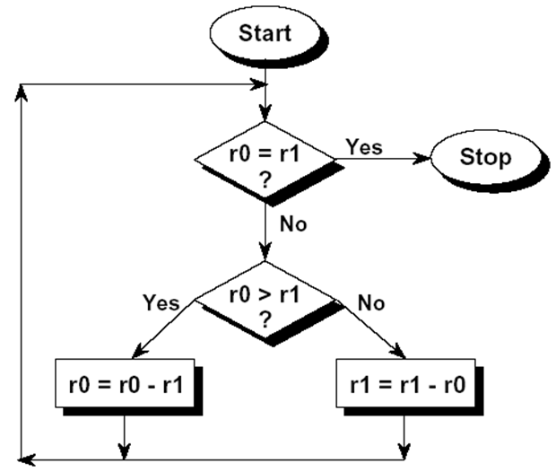
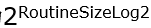
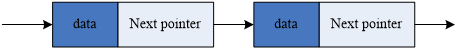

# **ARM体系结构与编程**

## 3.5 基本ARM指令的应用

- 算术逻辑运算指令的应用
- 跳转指令的应用
- Load/store指令的应用
- 批量load/store指令的应用
- 信号量指令的应用
- 与系统相关的一些指令的应用

### 3.5.1 算术逻辑运算指令的应用

1. #### 位操作指令应用

   将r2中的高8位数据传送到r3的低8位中

```
MOV R0, R2, LSR #24

ORR R3, R0, R3, LSL #8

OR

MOV R0, R2, ROR #24
MOV R3, #0 / BIC R3, R3, #0xFF
ORR R3, R0, R3

```

2. #### 实现乘法的指令段

```
MOV R0, R0, LSL #1 ;2*R0

ADD R0, R0, R0, LSL #1 ;3*R0

RSB R0, R1, R0, LSL #2 ;4*R0-R1


MOV R0, R0, LSL #n ;2^n*R0

ADD R0, R0, R0, LSL #n ;(2^n+1)*R0

RSB R0, R0, R0, LSL #n ;(2^n-1)*R0
```

> **ARM指令的特色：两个操作在一条指令中完成。**

3. #### 64位数据运算

R0,R1存放64位数据的低32位和高32位；R2,R3存放64位数据的低32位和高32位：

```
ADDS R0, R0, R2

ADC R1, R1, R3 ;64位加法


SUBS R0, R0, R2

SBC R1, R1, R3  ;64位减法


CMP R1, R3

CMPEQ R0, R2  ;64位数据比较
```

**注意:进位标志C在CPSR中**

4. #### 内存中数据存储方式的转换

big endian<-->  little endian

R0=ABCD  <-->  R0=DCBA

```
EOR R1, R0, R0, ROR #16 	;R1=A^C,   B^D,	   C^A, 	D^B
BIC R1, R1, #0xFF0000 		;R1=A^C,     0,    C^A, 	D^B
MOV R0, R0, ROR #8 			;R0=  D,     A,      B,       C
EOR R0, R0, R1, LSR #8 		;LSR: 0,   A^C,      0,     C^A
							;R0=  D,     C,      B,       A

```

```
MOV R2, #0xFF			;R2=0xFF
ORR R2, R2, #0xFF0000	;R2=0x00FF00FF
AND R1, R2, R0			;R1= 0 B  0 D
AND R0, R2, R0, ROR #24	;R0= 0 C  0 A
ORR R0, R0, R1, ROR #8	;R0= D C B A

```

### 3.5.2 跳转指令的应用

1. #### 子程序调用

BL指令在指令跳转操作的同时保存当前PC寄存器值，用于从被调用的子程序中返回。

```
		;……
		BL function_name
		SUB R2,R1,R0
		;……


function_name
		;……
		MOV PC, LR
```

> **注意：B和BL指令的区别。**

2. #### 条件执行－最大公约数



最大公约数C语言代码：

```
int gcd (int a, int b)
{
  while (a ! = b)
		if (a > b)
			a = a - b;
		else
			b = b - a;
  return a;
}
```

最大公约数ARM汇编代码：

```
gcd 	cmp r0, r1 	;reached the end?
		beq stop
		blt less 	;if r0 > r1
		sub r0, r0, r1 	;subtract r1 from r0
		b   gcd
less 	sub r1, r1, r0 	;subtract r0 from r1
		b   gcd
stop	;……
```

最大公约数ARM汇编代码（条件执行）：

代码执行前r0中存放a，r1中存放b；代码执行后r0中存放a和b的最大公约数：

```
gcd
		CMP R0, R1
		SUBGT R0, R0, R1
		SUBLT R1, R1, R0
		BNE gcd
		MOV PC, LR
```

3. #### 条件判断语句（C语言代码）

```
if (a == 0 || b == 1)
			c= d + e;
```

代码执行前r0中存放a，r1中存放b；代码执行后r2中存放d和e的和：

```
		CMP R0, #0
		CMPNE R1, #1
		ADDEQ R2, R3, R4

```

> 注意：两个条件按顺序进行判断，如果第一个条件不成立，则后面的条件无需进行判断

4. #### 循环语句

对于一个for或while循环：

```
		MOV R0, #loopcount ;初始化计数器
loop
		;……
		SUBS R0, R0, #1	;计数器的更新及CPSR的更新
		BNE loop
		;……
```

> **注意：此时SUB指令必需带后缀S。**

5. #### 多路分支程序语句

代码根据maxindex的不同值跳转不同的代码段，这里要求各目标代码段的大小都为



```
	CMP R0, #maxindex	;R0中保存了跳转的索引值
	ADDLO PC, PC, R0, LSL #RoutineSizeLog2
	B IndexOutofRange
	……
	Index0Handler	;索引值为0时对应的代码段
	……
	Index1Handler
	…..
	Index2Handler
	……
	IndexOutofRange
	……
```

### 3.5.3 load/store指令的应用

1. #### 链表操作

在链表中搜索与某一个数据相等的元素。链表中的每个元素包括两个字，第一个字中包含一个字节数据；第二个字中包含指向下一个链表元素的指令，当这个指针为0时表示链表结束。

```
llsearch
		CMP R0, #0		;R0是next pointer
		LDRNEB R2, [R0]
		CMPNE R1, R2	;R1存放要搜索的数据
		LDRNE R0, [R0, #4]
		BNE llsearch
		MOV PC, LR
```



2. #### 简单的串比较

比较两个串的大小：R0指向第一个串，R1指向第二个串。

```
strcmp
		LDRB R2, [R0], #1		;注意字符寻址的偏移量
		LDRB R3, [R1], #1
		CMP R2, #0
		CMPNE R3, #0
		BEQ return
		CMP R2, R3
		BEQ strcmp
return
		SUB R0, R2, R3			;比较两字符的大小
		MOV PC, LR
```

3. #### 长跳转

通过直接向PC寄存器中存取数据，程序可以实现在4GB的地址空间的任意跳转，这种跳转叫做**长跳转**。

```
		ADD LR, PC, #4		;保存返回地址，指向PC＋12处，即return_here
		LDR PC, [PC, #-4]	;内存寻址指向DCD
		DCD function
return_here
		ADD
```

4. #### 多路跳转 （比较前面的5. 多路分支程序语句）

通过函数地址表实现多路转移，其中maxendex为跳转的最大索引号，R0中为跳转的索引号。

```
	CMP R0, #maxindex
	LDRLO PC, [PC, R0, LSL #2]
	B IndexOutofRange
	DCD Handler0	;子程序0的入口地址
	DCD Handler1
	DCD Handler2
	;……
```

**注意：这里子程序没有限定相同的大小。**

### 3.5.4 批量load/store指令的应用

1. #### 简单的块复制

一次将48个字数据从R12作为首地址的一段连续的内存单元复制到R13作为首地址的一段连续的内存单元。R14为源数据区末地址。

```
loop
		LDMIA R12!, {R0-R11}	;每次12个字
		STMIA R13!, {R0-R11}
		CMP R12, R14			;判断是否结束
		BLO loop

```

**思考：当数据块大小不是一次搬移数据的倍数时，程序如何设计？**

##### **LDM/STM应用实例-上机编程实践**

```
SOURCE  		    DCD    1,  2,  3,  4, 5,  6,  7,  8, 9, 10
                    DCD   11,12,13,14,15,16,17,18,19,20
                    DCD   21,22,23,24,25,26,27,28,29,30
                    DCD   31,32,33,34,35,36,37,38,39,40
                    DCD   41,42,43,44,45,46,47,48
                    
DEST       		    DCD   0
```

2. #### 子程序进入和退出时数据的保存和恢复

在调用子程序时，通常利用寄存器r0－r3传递参数和返回结果，这几个参数由子程序的调用者来保存，其他的子程序将要用到的寄存器在子程序入口处保存，在子程序返回前恢复这些寄存器。

```
function
		STMFD R13!, {R4-R12, R14}	;函数入口
		;……
		;function body
		;……
		LDMFD R13!, {R4-R12, PC} 	;函数出口
```

### 3.5.5 信号量指令的应用

信号量用于实现对临界区数据访问的同步。

```
		MVN R2, #0 			;set -1
spinin
		SWP R3, R2, [R0]	;读取信号到R3，
							;同时将信号设置成-1.
		CMN R3, #1			;判断R3是否为-1
		;……
		BEQ spinin			;其它进程访问，继续查询
		CMP R3, #0			;不为0时表示其它进程拥有信号量
		;……
		STRNE R3, [R0]		;恢复信号量的值
		;……
		BNE spinin			;重新尝试获取信号量
		STR R1, [R0]
		;……
```

### 3.5.6 与系统相关的一些指令的应用

1. #### SWI中断处理程序

- SWI指令使处理器切换到特权模式，在特权模式下请求特定的系统服务（由操作系统提供）。
- SWI指令执行时通常完成下面的工作：

```
	R14_svc = SWI指令的下面一条指令的地址
	SPSR_svc = CPSR
	CPSR[4:0] = 0b10011 	; supervisor mode
	CPSR[5] = 0			; T
	CPSR[6] = 1			; F
	CPSR[7] = 1			; I
	if high vectors configured then
			PC = 0xFFFF0008
	else
			PC = 0x00000008
```

当程序执行到SWI指令时，程序跳转到0x00000008处执行，由于该处是一条跳转指令，程序接着跳转到下面中断服务程序开始处执行。

```
	SWIHandler
		STMFD sp!, {R0-R3, R12, LR}
		MRS R0, SPSR
		TST R0, #0x20
		LDRNEH R0, [LR, #-2]
		BICNE R0, R0, #0xFF00
		LDREQ R0, [LR, #-4]
		BICEQ R0, R0, #0xFF000000
		CMP R0, #MaxSWI
		LDRLS PC, [PC, R0, LSL #2]
		B SWIOutofRange
		;switable
		DCD SWIHANDLER0
		DCD SWIHANDLER1
		;……
		;Code to handle SWI here
		;……
		LDMFD sp!, {R0-R3, R12, PC}^
```

## 3.5 本章小节

本章系统的介绍了ARM指令集中的基本指令，以及各指令的应用场合及方法，由基本指令还可以派生出一些新的指令，但使用方法与基本指令类似。与常见的如X86、MIPS体系结构的汇编指令相比较，ARM指令系统无论是从指令集本身，还是从寻址方式上，都相对复杂一些。


Thumb指令集作为ARM指令集的一个子集，其使用方法与ARM指令集类似，在此未作详细的描述，但这并不意味着Thumb指令集不如ARM指令集重要，事实上，他们各自有其自己的应用场合。