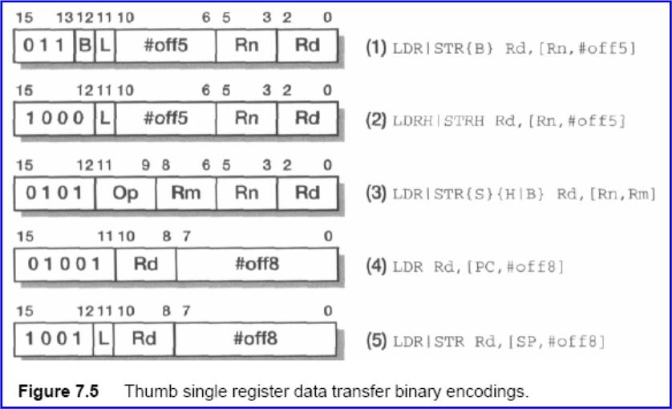
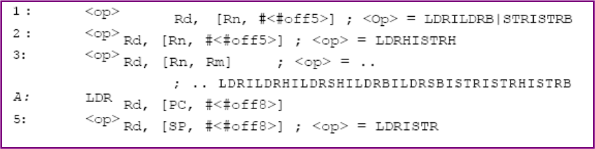
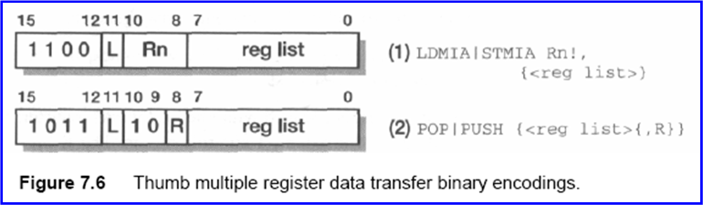
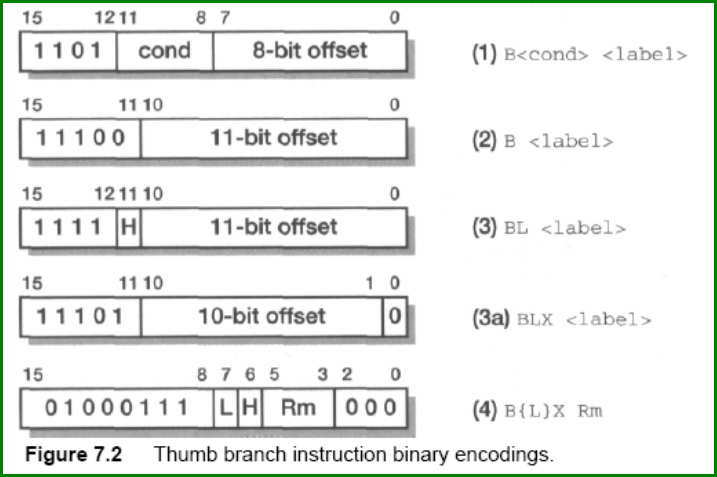
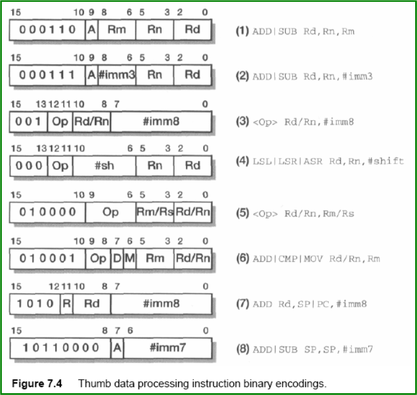
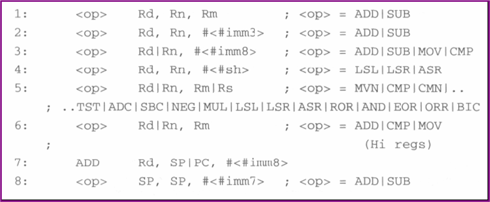
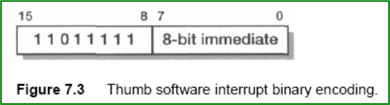
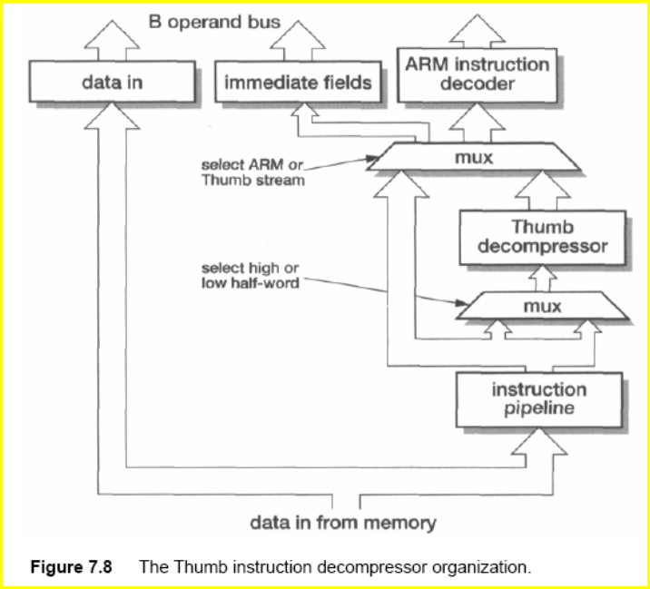
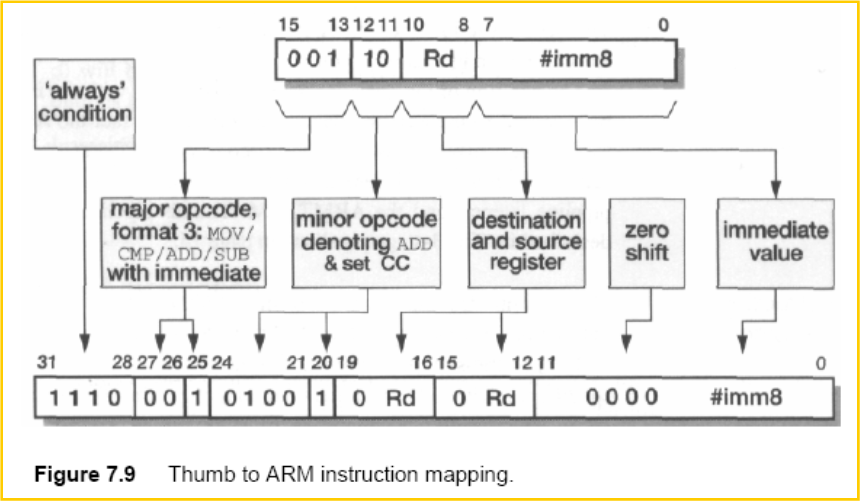

# **ARM体系结构与编程**

# 3.6.1 Thumb 指令的特点

- Thumb指令的代码密度高；
- Thumb指令集是ARM指令集的一个子集，不是一个完整的体系结构；
  - 不能用Thumb指令编制一个完整的程序。
- ARM和Thumb指令的功能是相近的；
- ARM状态和Thumb状态的区别也表现在程序状态寄存器中，CPSR[5]位T就是标志位；
- Thumb指令16位编码所包含的信息较ARM指令少；
- Thumb指令与ARM指令一样，是32位的数据操作。

# 3.6.2Thumb指令 vs. ARM指令

- Thumb指令集没有：
  - 和协处理器相关的指令；
  - 数据交换指令；
  - 乘加指令和长乘法指令；
  - CPSR和SPSR访问指令。
- Thumb指令增加：
  - 逻辑移位指令；
  - 堆栈指令PUSH和出栈指令POP。
- Thumb指令除分支指令外，都是无条件指令。
- Thumb指令通常只使用两个操作数。
- Thumb没有可选的S后缀，每条指令都可以刷新条件标志位

# 3.6.3 Thumb指令集中的数据传送指令



The various assembler formats are:



## 3.6.3.1立即数偏移的无符号字/字节传送指令

指令：LDR, STR, LDRB, STRB

- 用于在寄存器和存储器之间进行无符号的字和字节传送，其地址的表达式是基址寄存器和一个立即数的偏移。
- 指令格式：

```
 LDR/STR  Rd, [Rb, #立即数]

 LDRB/STRB  Rd, [Rb, #立即数]
```

- Rd是源/目标寄存器，使用范围为R0~R7；
- Rb是地址基址寄存器，使用范围为R0~R7；
- 立即数是字传送使用7位，字节传送使用5位；
- 立即数偏移只能是正数或0，不能是负数；
- 使用事先寻址方式，不能更新；
- 字传送要求字对齐。

## 3.6.3.2寄存器偏移的无符号字/字节传送指令

指令：LDR, STR, LDRB, STRB

- 用于在寄存器和存储器之间进行无符号的字和字节传送，其地址的表达式是基址寄存器和一个寄存器的偏移。
- 指令格式：

```
 LDR/STR  Rd, [Rb, Ri]

 LDRB/STRB  Rd, [Rb, Ri]
```


- Rd是源/目标寄存器，使用范围为R0~R7；
- Rb是地址基址寄存器，使用范围为R0~R7；
- Ri是偏移寄存器，使用范围为R0~R7；
- 使用事先寻址方式，不能更新；
- 字传送要求字对齐。

## 3.6.3.3立即数偏移的无符号半字传送指令

指令：LDRH, STRH

- 用于在寄存器和存储器之间进行无符号的半字传送，其地址的表达式是基址寄存器和一个立即数的偏移。
- 指令格式：

```
 LDRH/STRH  Rd, [Rb, #立即数]
```

- Rd是源/目标寄存器，使用范围为R0~R7；
- Rb是地址基址寄存器，使用范围为R0~R7；
- 立即数是6位无符号数，不得大于64；
- 只能加载或存储低16位；
- 使用事先寻址方式，不能更新；
- 半字传送要求半字对齐。

## 3.6.3.4寄存器偏移的无符号半字传送指令和寄存器偏移的带符号字节/半字加载指令

指令：LDRH, STRG, LDSB, LDSH

- 用于在寄存器和存储器之间进行无符号的半字传送以及带符号的字节/半字加载，其地址的表达式是基址寄存器和一个寄存器的偏移。
- 指令格式：

```
 LDRH/STRH Rd, [Rb, Ri]

 LDSB/LDSH Rd, [Rb, Ri]
```

- Rd是源/目标寄存器，使用范围为R0~R7；
- Rb是地址基址寄存器，使用范围为R0~R7；
- Ri是偏移寄存器，使用范围为R0~R7；
- 半字加载时，加载低16位，高位进行符号/无符号扩展；
- 使用事先寻址方式，不能更新；
- 半字传送要求半字对齐。

## 3.6.3.5用PC和SP做基址的数据传送指令

指令：LDR, STR

- 用于在寄存器和存储器之间进行无符号的数据传送，其地址表达式的基址是PC或SP。
- 指令格式：

```
 LDR  Rd, [PC, #立即数]

 LDR/STR  Rd, [SP, #立即数]
```

- Rd是源/目标寄存器，使用范围为R0~R7；
- SP是堆栈指针做地址基址；
- PC是程序计数器做地址基址；
- 立即数是无符号10位的地址偏移值，小于1024；
- 使用事先寻址方式，不能更新；
- 字传送要求字对齐。

## 3.6.3.6多寄存器的数据传送指令

指令：LDMIA, STMIA

- 用于在寄存器和存储器之间进行成组的数据传送，其地址表达式只用一个无偏移的基址寄存器。
- 指令格式：

```
 LDMIA/STMIA Rb！, {寄存器列表}
```

- Rb是地址基址寄存器，使用范围为R0~R7；
- ！后缀是写回标志，必须使用；
- 寄存器列表是从R0~R7的任意组合，寄存器分隔使用逗号；
- 无论加载还是存储，每传送一个数据，基址地址就自动增4，属于事后更新寻址方式；
- 寄存器在列表中是从小到大排列，无论加载还是存储，最小寄存器总是指向最初的基址地址；
- Rb可以在列表中，但Rb必须是寄存器列表中最小的，否则结果不可预测；
- 后缀IA是表明每传送一次数据地址自动增4。



## 3.6.3.7栈操作指令

指令：PUSH, POP

- 用于在寄存器和存储器之间进行成组的数据传送，其地址表达式是隐含的堆栈指针。
- 指令格式：

```
 PUSH/POP  {寄存器列表}

 PUSH  {寄存器列表，LR}

 POP  {寄存器列表，PC}
```


- LR是链接寄存器；
- PC是程序计数器；
- 寄存器列表是从R0~R7的任意组合，寄存器分隔使用逗号；
- 堆栈指针是隐含的地址基址，Thumb指令中的堆栈是满栈递减的，堆栈向下增长，堆栈指针总是指向最后入栈的数据；
- 寄存器在列表中是从小到大排列，无论加载还是存储，最小寄存器总是指向最初的基址地址；
- 但使用POP指令且PC出现在列表中时，从栈区赋给PC的数据将引起程序的跳转，这只能用在子程序的返回。

# 3.6.4 Thumb指令集的分支指令

Thumb指令集包含4条分支指令：

- 无条件分支指令；
- 条件分支指令；
- 带链接分支指令；
- 状态切换指令



## 3.6.4.1 无条件分支指令

无条件分支指令B能够使程序产生一次无条件跳转。

指令格式：

```
 B 语句标号
```

- 语句标号通常在同一程序段内，地址范围不超过±2048字节；
- 以PC为基址的相对偏移跳转，跳转方向可以向前，也可以向后；
- 语句标号处的地址必须是半字对齐的。

## 3.6.4.2 条件分支指令

条件分支指令B能够使程序产生一次有条件跳转。

指令格式：

```
 B{cond} 语句标号
```

- 语句标号通常在同一程序段内，地址范围不超过±254字节；
- cond是条件后缀，共14种；
- 指令满足条件时分支跳转，否则不分支；
- 以PC为基址的相对偏移跳转，跳转方向可以向前，也可以向后；
- 语句标号处的地址必须是半字对齐的

## 3.6.4.3 带链接的长分支指令

带链接的长分支指令BL能够使程序产生长跳转，同时把分支处地址保存在LR中。

指令格式：

```
 BL 语句标号
```

- 语句标号是一条长跳转，地址范围可以用一个23位的带符号数值表达；
- Thumb指令编码是16位，一条指令是不能实现23位的地址编码的，该语句实际分解乘两条指令来实现；
- 以PC为基址的相对偏移跳转，跳转方向可以向前，也可以向后；
- 语句标号处的地址必须是半字对齐的。

## 3.6.4.4 状态切换的分支指令

状态切换的分支指令BX能够使程序产生分支，同时使程序从一个指令状态跳转到另一个指令状态。

指令格式：

```
 BX Rs
 BX Hs
```

- Rs是Thumb指令集的通用寄存器R0~R7，其中数据作为分支目标地址；
- Hs是高位寄存器R8~R15，在Thumb指令集中用H8~H15表达，其中数据作为分支目标地址；
- 以寄存器数据作为绝对地址的分支指令，跳转方向可以向前，也可以向后；
- 寄存器中的地址是目标地址，其中的最低位[0]不是地址信息。当[0]为1时，表明目标地址处是Thumb指令；当[0]为0时，表明目标地址处是ARM指令，要求字对齐。

# 3.6.5 Thumb指令集的数据处理指令

Thumb指令集中的数据处理指令包括

- 算术运算指令
- 逻辑运算指令
- 寄存器之间的数据传送指令



## 3.6.5.1 使用3个寄存器（或两个寄存器、一个立即数）的加减算术运算指令

指令格式：

```
 ADD/SUB Rd, Rs, Rn

 ADD/SUB Rd, Rs, #立即数
```

- Rs是Thumb指令集的通用寄存器R0~R7；
- Rn是Thumb指令集的通用寄存器R0~R7；
- Rd是Thumb指令集的通用寄存器R0~R7，保存操作结果；
- 立即数是3位无符号数值，不能大于7；
- 会刷新程序状态寄存器的条件标志。

## 3.6.5.2 使用1个寄存器和1个立即数的数据处理指令

n共有4条指令： ADD, SUB, MOV, CMP

指令格式：

```
 Opcode Rd, #立即数
```


- Opcode是操作指令，指ADD, SUB, MOV, CMP等4条指令；
- Rd是Thumb指令集的通用寄存器R0~R7，保存操作结果；
- 立即数是8位无符号数值，不能大于255；
- 会刷新程序状态寄存器的条件标志。

## 3.6.5.3 使用2个寄存器的数据处理指令

共有16条指令：

- AND, EOR, ORR, BIC;
- ADC, SBC, MUL;
- CMP, CMN;
- LSL, LSR, ASR, ROR;
- NEG, MVN;
- TST

### 3.6.5.3.1 逻辑操作指令

共有4条指令： AND, EOR, ORR, BIC

指令格式：

```
 Opcode Rd, Rs
```

- Opcode是操作指令；
- Rd是Thumb指令集的通用寄存器R0~R7，保存操作结果；
- Rs是源寄存器R0~R7 ；
- AND, EOR, ORR指令与寄存器的顺序无关，而BIC指令是有关的；
- 会刷新程序状态寄存器的条件标志。

### 3.6.5.3.2 算术运算指令

共有3条指令： ADC, SBC, MUL

指令格式：

```
 Opcode Rd, Rs
```

- Opcode是操作指令；
- Rd是Thumb指令集的通用寄存器R0~R7，保存操作结果；
- Rs是源寄存器R0~R7 ；
- 会刷新程序状态寄存器的条件标志。

### 3.6.5.3.3 逻辑操作指令

共有2条指令： CMP, CMN

指令格式：

```
 Opcode Rd, Rs
```

- Opcode是操作指令；
- Rd是Thumb指令集的通用寄存器R0~R7；
- Rs是源寄存器R0~R7 ；
- 会刷新程序状态寄存器的条件标志。

### 3.6.5.3.4 逻辑移位操作指令

共有4条指令： LSL, LSR, ASR, ROR

指令格式：

```
 Opcode Rd, Rs
```

- Opcode是操作指令；
- Rd是Thumb指令集的通用寄存器R0~R7，保存操作结果；
- Rs是源寄存器R0~R7，其中的数值是Rd移位的位数；
- 会刷新程序状态寄存器的条件标志。

### 3.6.5.3.5 寄存器传送指令

共有2条指令： NEG, MVN

指令格式：

```
 Opcode Rd, Rs
```

- Opcode是操作指令；
- Rd是Thumb指令集的通用寄存器R0~R7，保存操作结果；
- Rs是源寄存器R0~R7 ；
- 会刷新程序状态寄存器的条件标志。

### 3.6.5.3.6 测试指令

共有1条指令： TST

指令格式：

```
 Opcode Rd, Rs
```

- Opcode是操作指令；
- Rd是Thumb指令集的通用寄存器R0~R7；
- Rs是源寄存器R0~R7 ；
- 会刷新程序状态寄存器的条件标志。

## 3.6.5.4 对寄存器进行移位并传送的操作指令

共有3条指令： LSL, LSR, ASR

指令格式：

```
 Opcode Rd, Rs, #立即数
```

- Opcode是操作指令；
- Rd是Thumb指令集的通用寄存器R0~R7，保存操作结果；
- Rs是源寄存器R0~R7，对其中的内容进行移位；
- 移位位数不能大于31；
- 会刷新程序状态寄存器的条件标志。

## 3.6.5.5 与高位寄存器有关的数据处理指令

共有3条指令： ADD, CMP, MOV

指令格式：

```
 Opcode Rd, Rs
```

- Opcode是操作指令；
- Rd是Thumb指令集的通用寄存器R0~R15，保存操作结果；
- Rs是源寄存器R0~R15，对其中的内容进行移位；
- CMP指令会刷新程序状态寄存器的条件标志。

## 3.6.5.6 使用PC和SP的加法指令

Thumb指令中有一条对堆栈指针SP的加法指令和一条对PC的加法指令。

指令格式：

```
 ADD Rd, PC, #立即数

 ADD Rd, SP, #立即数
```

- Rd是Thumb指令集的通用寄存器R0~R7；
- PC是程序计数器，做源寄存器；
- SP是堆栈指针，做源寄存器；
- 立即数是一个10位的无符号数；
- 立即数必须字对齐；
- 当把PC作为源寄存器时，PC中的值是指令处的地址加4；
- 不影响程序条件标志位。

## 3.6.5.7 堆栈指针加偏移的加法指令

Thumb指令中有一条对堆栈指针SP加偏移的加法指令。

指令格式：

```
 ADD SP, #立即数

 ADD SP, #-立即数
```

- SP是堆栈指针，做目标寄存器；
- 立即数是一个9位的无符号数；
- 立即数必须字对齐；
- 表达式中可以使用负号，堆栈指针可以向前偏移，也可以向后偏移。

The various instruction formats are:



Equivalent ARM instruction

```
ARM instruction 		Thumb instruction

MOVS Rd, #<#imm8> 	; MOV Rd, #<#imm8>
MVNS Rd, Rm 		; MVN Rd, Rm
CMP Rn, #<#imm8> 		; CMP Rn, #<#imm8>
CMP Rn, Rm 			; CMP Rn, Rm
CMN Rn, Rm 		; CMN Rn, Rm
TST Rn, Rm 			; TST Rn, Rm
ADDS Rd, Rn, #<#imm3> 	; ADD Rd, Rn, #<#imm3>
ADDS Rd, Rd, #<#imm8> 	; ADD Rd, #<#imm8>
ADDS Rd, Rn, Rm 		; ADD Rd, Rn, Rm
ADCS Rd, Rd, Rm 		; ADC Rd, Rm
SUBS Rd, Rn, #<#imm3> 	; SUB Rd, Rn, #<#imm3>
SUBS Rd, Rd, #<#imm8> 	; SUB Rd, #<#imm8>
SUBS Rd, Rn, Rm 		; SUB Rd, Rn, Rm
SBCS Rd, Rd, Rm 		; SBC Rd, Rm
RSBS Rd, Rn, #0 		; NEC Rd, Rn
MOVS Rd, Rm, LSL #<#sh> 	; LSL Rd, Rm, #<#sh>
```

```
; ARM instruction 			Thumb instruction

MOVS Rd, Rd, LSL Rs 			; LSL Rd, Rs
MOVS Rd, Rm, LSR #<#sh> 		; LSR Rd, Rm, #<#sh>
MOVS Rd, Rd, LSR Rs 		; LSR Rd, Rs
MOVS Rd, Rm, ASR #<#sh> 		; ASR Rd, Rm, #<#sh>
MOVS Rd, Rd, ASR Rs 		; ASR Rd, Rs
MOVS Rd, Rd, ROR Rs 		; ROR Rd, Rs
ANDS Rd, Rd, Rm 			; AND Rd, Rm
EORS Rd, Rd, Rm 			; EOR Rd, Rm
ORRS Rd, Rd, Rm 			; ORR Rd, Rm
BICS Rd, Rd, Rm 			; BIG Rd, Rm
MULS Rd, Rm, Rd 			; MUL Rd, Rm
```

```
Instructions that operate with or on the 'Hi' registers (r8 to r15), in some cases in
combination with a 'Lo' register:

; ARM instruction 		Thumb instruction

ADD Rd, Rd, Rm 		; ADD Rd, Rm (1/2 Hi regs)
CMP Rn, Rm 			; CMP Rn, Rm (1/2 Hi regs)
MOV Rd, Rm 		; MOV Rd, Rm (1/2 Hi regs)
ADD Rd, PC, #<#imm8> 	; ADD Rd, PC, #<#imm8>
ADD Rd, SP, #<#imm8> 	; ADD Rd, SP, #<#imm8>
ADD SP, SP, #<#imm7> 	; ADD SP, SP, #<#imm7>
SUB SP, SP, #<#imm7> 	; SUB SP, SP, #<#imm7>

```

# 3.6.6 Thumb指令集的软件中断指令

Thumb指令集中只有一条软件中断指令SWI，与ARM指令集是一样的。

指令格式：

```
 SWI #中断参数
```

- 中断参数是一个8位的无符号数，可以是0；
- 执行此指令后，处理器由Thumb状态切换到ARM状态；
- 处理器由用户模式转换到管理模式；中断处下一条指令的地址被拷贝到链接寄存器R14，CPSR被拷贝到SPSR中，处理器把中断向量0x00000008装入PC;
- 中断参数不可以省略（可以为0），这个参数对指令无影响，是中断过程传递的一个参数，如中断功能号；
- 指令不影响条件标志位。



# 3.6.7 Thumb implementation

The biggest addition is the Thumb instruction decompressor in the instruction pipeline; this logic translates a Thumb instruction into its equivalent ARM instruction.

The Thumb decompressor performs a static translation from the 16-bit Thumb instruction into the equivalent 32-bit ARM instruction.



