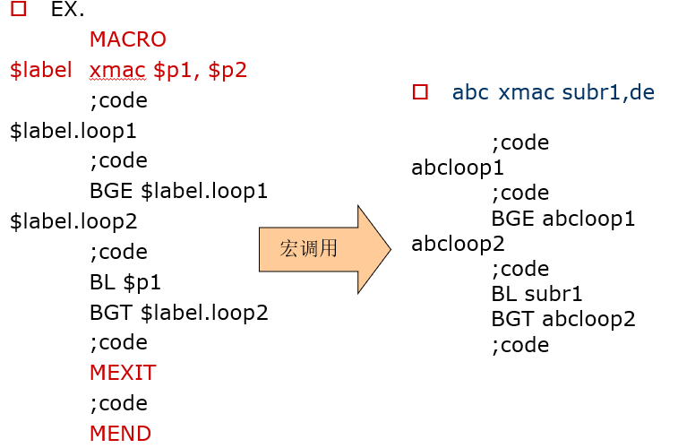
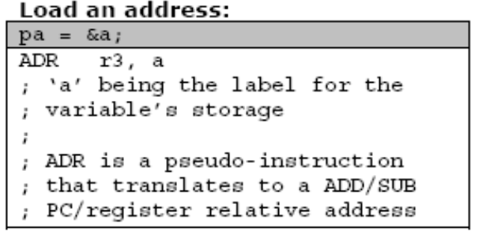

# ARM体系结构与编程

## **第4章** ARM程序设计基础

ARM编译器一般都支持汇编语言的程序设计和C/C++语言的程序设计，以及两者的混合编程。本章介绍ARM程序设计的一些基本概念，如ARM汇编语言的伪指令、汇编语言的语句格式和汇编语言的程序结构等。

本章的主要内容：

- ARM编译器所支持的伪指令
- 汇编语言的语句格式
- 汇编语言的程序结构
- 相关的程序示例

## 4.1 ARM汇编器所支持的伪指令 

在ARM汇编语言程序里，有一些特殊指令助记符，这些助记符与指令系统的助记符不同，没有相对应的操作码，通常称这些特殊指令助记符为**伪指令**，他们所完成的操作称为**伪操作**。

伪指令在源程序中的作用是为完成汇编程序作各种准备工作的，这些伪指令仅在汇编过程中起作用，一旦汇编结束，伪指令的使命就完成。

伪指令的两个基本特征：

- 伪指令是一条指令；
- 伪指令不是一条真正的指令，通常没有指令代码。

在ARM的汇编程序中，有如下几种伪指令：

- 符号定义伪指令
- 数据定义伪指令
- 汇编控制伪指令
- 宏指令
- 其他伪指令

### 4.1.1 符号定义（Symbol Definition）伪指令

符号定义伪指令用于定义ARM汇编程序中的变量、对变量赋值以及定义寄存器的别名等操作。常见的符号定义伪指令有如下几种：

- 用于定义全局变量的GBLA、GBLL和GBLS。
- 用于定义局部变量的LCLA、LCLL和LCLS。
- 用于对变量赋值的SETA、SETL、SETS。
- 为通用寄存器列表定义名称的RLIST。

1. #### GBLA、GBLL和GBLS

语法格式：

```
GBLA（GBLL或GBLS） 全局变量名
```

GBLA、GBLL和GBLS伪指令用于定义一个ARM程序中的全局变量，并将其初始化。其中：

- GBLA伪指令用于定义一个全局的数字变量，并初始化为0；
- GBLL伪指令用于定义一个全局的逻辑变量，并初始化为F（假）；
- GBLS伪指令用于定义一个全局的字符串变量，并初始化为空；

由于以上三条伪指令用于定义全局变量，因此在整个程序范围内变量名必须唯一。

```
使用示例：
			GBLA	Test1	;定义一个全局的数字变量，
					;变量名为Test1
	Test1	SETA	0xaa	;将该变量赋值为0xaa	
			GBLL	Test2	;定义一个全局的逻辑变量，
					;变量名为Test2
	Test2	SETL	{TRUE};将该变量赋值为真	
			GBLS	Test3	;定义一个全局的字符串变量，
					;变量名为Test3
	Test3	SETS	“Testing”   ;将该变量赋值为“Testing”

```

2. #### LCLA、LCLL和LCLS

语法格式：

```
 LCLA（LCLL或LCLS） 局部变量名
```

LCLA、LCLL和LCLS伪指令用于定义一个ARM程序中的局部变量，并将其初始化。其中：

- LCLA伪指令用于定义一个局部的数字变量，并初始化为0；
- LCLL伪指令用于定义一个局部的逻辑变量，并初始化为F（假）；
- LCLS伪指令用于定义一个局部的字符串变量，并初始化为空；

以上三条伪指令用于声明局部变量，在其作用范围内变量名必须唯一。

```
使用示例：
			LCLA	Test4	;声明一个局部的数字变量，
					;变量名为Test4
	Test3	SETA	0xaa	;将该变量赋值为0xaa	
			LCLL	Test5	;声明一个局部的逻辑变量，
					;变量名为Test5
	Test4	SETL	{TRUE} ;将该变量赋值为真	
			LCLS	Test6	;定义一个局部的字符串变量，
					;变量名为Test6
	Test6	SETS	“Testing” ;将该变量赋值为“Testing”

```

3. #### SETA、SETL和SETS

语法格式：

```
变量名 SETA（SETL或SETS） 表达式
```

伪指令SETA、SETL、SETS用于给一个已经定义的全局变量或局部变量赋值。

- SETA伪指令用于给一个数学变量赋值；
- SETL伪指令用于给一个逻辑变量赋值；
- SETS伪指令用于给一个字符串变量赋值；
- 其中，变量名为已经定义过的全局变量或局部变量，表达式为将要赋给变量的值。

```
使用示例：
			LCLA	Test3 	;声明一个局部的数字变量，
					;变量名为Test3
	Test3	SETA	0xaa	 ;将该变量赋值为0xaa	
			LCLL	Test4 ;声明一个局部的逻辑变量，
					;变量名为Test4
	Test4	SETL	{TRUE} ;将该变量赋值为真
			LCLS	Test6	 ;定义一个局部的字符串变量，					 ;变量名为Test6
	Test5	SETS	“Testing” ;将该变量赋值为“Testing”

```

4. #### RLIST

语法格式：

```
 名称 RLIST   {寄存器列表}
```

RLIST伪指令可用于对一个通用寄存器列表定义名称，使用该伪指令定义的名称可在ARM指令LDM/STM中使用。

**在LDM/STM**指令中，列表中的寄存器访问次序为根据寄存器的编号由低到高，而与列表中的寄存器排列次序无关。

```
使用示例：
	RegList  RLIST   {R0-R5，R8，R10}	
				;将寄存器列表名称定义为RegList，
				;可在ARM指令LDM/STM中通过
				;该名称访问寄存器列表。
```

### 4.1.2 数据定义（Data Definition）伪指令

数据定义伪指令一般用于为特定的数据分配存储单元，同时可完成已分配存储单元的初始化。常见的数据定义伪指令有如下几种：

- DCB       用于分配一片连续的**字节**存储单元并用指定 的数据初始化。
- DCW（DCWU）用于分配一片连续的**半字**存储单元并用指定的 数据初始化。
- DCD（DCDU） 用于分配一片连续的**字**存储单元并用指定的数 据初始化。
- DCFD（DCFDU） 用于为双精度的浮点数分配一片连续的字存 储单元并用指定的数据初始化。
- DCFS（DCFSU）用于为单精度的浮点数分配一片连续的字存 储单元并用指定的数据初始化。
- DCQ（DCQU）用于分配一片以8字节为单位的连续的存储单元 并用指定的数据初始化。
- SPACE 用于分配一片连续的存储单元
- MAP 用于定义一个结构化的内存表首地址
- FIELD 用于定义一个结构化的内存表的数据域

1. #### DCB

语法格式：

```
  标号 DCB 表达式{,表达式}……
```

DCB伪指令用于分配一片连续的字节存储单元并用伪指令中指定的表达式初始化。其中，表达式可以为0～255的数字或字符串。

DCB也可用“=”代替。

```
使用示例：
	string	DCB	“This is a test！”	
	string	=	“This is a test！”	
				;分配一片连续的字节存储单元并初始化。
```

2. #### DCW（或DCWU）

语法格式：

```
 标号 DCW（或DCWU） 表达式{,表达式}…..
```

DCW（或DCWU）伪指令用于分配一片连续的半字存储单元并用伪指令中指定的表达式初始化。其中，表达式可以为程序标号或数字表达式。

用DCW分配的字存储单元是半字对齐的，而用DCWU分配的字存储单元并不严格半字对齐。

```
使用示例：
 DataTest DCW 1，2，3
 ;分配一片连续的半字存储单元并初始化
```

3. #### DCD（或DCDU）

语法格式：

```
标号  DCD（或DCDU） 表达式{,表达式}…..
```

DCD（或DCDU）伪指令用于分配一片连续的字存储单元并用伪指令中指定的表达式初始化。其中，表达式可以为程序标号或数字表达式。

DCD也可用“&”代替。

用DCD分配的字存储单元是字对齐的，而用DCDU分配的字存储单元并不严格字对齐。

```
使用示例：

 DataTest DCD   4，5，6 

 DataTest &   4，5，6 

 ;分配一片连续的字存储单元并初始化。
```

4. #### DCFD（或DCFDU）

语法格式：

```
 标号 DCFD（或DCFDU） 表达式{,表达式}…..
```

DCFD（或DCFDU）伪指令用于为双精度的浮点数分配一片连续的字存储单元并用伪指令中指定的表达式初始化。每个双精度的浮点数占据两个字单元。

用DCFD分配的字存储单元是字对齐的，而用DCFDU分配的字存储单元并不严格字对齐。

```
使用示例：
 FDataTest   DCFD 2E115，-5E7 
  ;分配一片连续的字存储单元并初始化为指定的双精度数。
```

5. #### DCFS（或DCFSU）

语法格式：

```
 标号 DCFS（或DCFSU）表达式{,表达式}…..
```

DCFS（或DCFSU）伪指令用于为单精度的浮点数分配一片连续的字存储单元并用伪指令中指定的表达式初始化。每个单精度的浮点数占据一个字单元。

用DCFS分配的字存储单元是字对齐的，而用DCFSU分配的字存储单元并不严格字对齐。

```
使用示例：
 FDataTest  DCFS 2E5，-5E－7 
;分配一片连续的字存储单元并初始化为指定的单精度数。
```

6. #### DCQ(或DCQU）

语法格式：

```
 标号 DCQ（或DCQU） 表达式{,表达式}…..
```

DCQ（或DCQU）伪指令用于分配一片以8个字节为单位的连续存储区域并用伪指令中指定的表达式初始化。

用DCQ分配的存储单元是字对齐的，而用DCQU分配的存储单元并不严格字对齐。

```
使用示例：
 DataTest   DCQ 100 
 ;分配一片连续的存储单元并初始化为指定的值。
```

7. #### SPACE

语法格式：

```
标号 SPACE 表达式
```

SPACE伪指令用于分配一片连续的存储区域并初始化为0。其中，表达式为要分配的字节数。

SPACE也可用“％”代替。

```
使用示例：
DataSpace SPACE 100 
DataSpace % 100  
;分配连续100字节的存储单元并初始化为0。
```

8. #### MAP

语法格式：

```
 MAP 表达式{，基址寄存器}
```

MAP伪指令用于定义一个结构化的内存表的首地址。

MAP也可用“＾”代替。

表达式可以为程序中的标号或数学表达式，基址寄存器为可选项。

当基址寄存器选项不存在时，表达式的值即为内存表的首地址；

当该选项存在时，内存表的首地址为表达式的值与基址寄存器的和。

MAP伪指令通常与FIELD伪指令配合使用来定义结构化的内存表。

```
使用示例：
 MAP 0x100，R0 
 ^ 0x100，R0  
 ;定义结构化内存表首地址的值为0x100＋R0。
```

9. #### FILED

语法格式：

```
 标号 FIELD 表达式
```

FIELD伪指令用于定义一个结构化内存表中的数据域。

FILED也可用“#”代替。

表达式的值为当前数据域在内存表中所占的字节数。

FIELD伪指令常与MAP伪指令配合使用来定义结构化的内存表。MAP伪指令定义内存表的首地址，FIELD伪指令定义内存表中的各个数据域，并可以为每个数据域指定一个标号供其他的指令引用。

注意MAP和FIELD伪指令仅用于定义数据结构，并不实际分配存储单元。

```
使用示例：
 MAP 0x100 ;定义结构化内存表首地址的值为0x100。
 A FIELD 16 ;定义A的长度为16字节，位置为0x100
 B # 32 ;定义B的长度为32字节，位置为0x110
 S FIELD 256 ;定义S的长度为256字节，位置为0x130
```

### 4.1.3 汇编控制（Assembly Control）伪指令

汇编控制伪指令用于控制汇编程序的执行流程，常用的汇编控制伪指令包括以下几条：

- IF、ELSE、ENDIF
- WHILE、WEND
- MACRO、MEND
- MEXIT

1. #### IF、ELSE、ENDIF

```
语法格式：
	IF	逻辑表达式
			指令序列1
	ELSE
			指令序列2
	ENDIF
```

- IF、ELSE、ENDIF伪指令能根据条件的成立与否决定是否执行某个指令序列。当IF后面的逻辑表达式为真，则执行指令序列1，否则执行指令序列2。其中，ELSE及指令序列2可以没有，此时，当IF后面的逻辑表达式为真，则执行指令序列1，否则继续执行后面的指令。
- IF、ELSE、ENDIF伪指令可以嵌套使用。

```
使用示例：
    GBLL	Test	;声明一个全局的逻辑变量，变量名为Test
    ……
    IF	Test = TRUE
	  	指令序列1
    ELSE
	 	指令序列2
    ENDIF
```

2. #### WHILE、WEND

语法格式：

```
 WHILE 		逻辑表达式
		指令序列
 WEND
```

WHILE、WEND伪指令能根据条件的成立与否决定是否循环执行某个指令序列。当WHILE后面的逻辑表达式为真，则执行指令序列，该指令序列执行完毕后，再判断逻辑表达式的值，若为真则继续执行，一直到逻辑表达式的值为假。

WHILE、WEND伪指令可以嵌套使用。

```
使用示例：
    			GBLA  counter ;声明一个全局的数学变量，变量名为;counter
counter	SETA   1 ;初始化循环控制计数器
    			……
    			WHILE  counter < 10
	 		 指令序列
counter SETA   counter +1
    			WEND
```

3. #### MACRO、MEND (CF.P.129)

语法格式：

```
MACRO	
	$标号	宏名	$参数1，$参数2，……	
	指令序列
	MEND
```

MACRO、MEND伪指令可以将一段代码定义为一个整体，称为宏指令，然后就可以在程序中通过宏指令多次调用该段代码。其中，$标号在宏指令被展开时，标号会被替换为用户定义的符号，

宏指令可以使用一个或多个参数，当宏指令被展开时，这些参数被相应的值替换。

宏指令的使用方式和功能与子程序有些相似，子程序可以提供模块化的程序设计、节省存储空间并提高运行速度。但在使用子程序结构时需要保护现场，从而增加了系统的开销，因此，在代码较短且需要传递的参数较多时，可以使用宏指令代替子程序。

包含在MACRO和MEND之间的指令序列称为**宏定义体**，在宏定义体的第一行应声明宏的原型（包含宏名、所需的参数），然后就可以在汇编程序中通过宏名来调用该指令序列。在源程序被编译时，汇编器将宏调用展开，用宏定义中的指令序列代替程序中的宏调用，并将实际参数的值传递给宏定义中的形式参数。

MACRO、MEND伪指令可以嵌套使用。

4. #### MEXIT

语法格式：

```
MEXIT
```

MEXIT用于从宏定义中跳转出去



### 4.1.4 其他常用的伪指令

还有一些其他的伪指令，在汇编程序中经常会被使用，包括以下几条：

- AREA
- ALIGN
- CODE16、CODE32
- ENTRY
- END
- EQU
- EXPORT（或GLOBAL）
- IMPORT
- EXTERN
- GET（或INCLUDE）
- INCBIN
- RN
- ROUT

1. #### AREA

语法格式：

```
		AREA	段名	属性1，属性2，……	
```

AREA伪指令用于定义一个代码段或数据段。其中，段名若以数字开头，则该段名需用“|”括起来，如|1_test|。

属性字段表示该代码段（或数据段）的相关属性，多个属性用逗号分隔。常用的属性如下：

- CODE属性：用于定义代码段，默认为READONLY。
- DATA属性：用于定义数据段，默认为READWRITE。
- READONLY属性：指定本段为只读，代码段默认为READONLY。
- READWRITE属性：指定本段为可读可写，数据段的默认属性为READWRITE。
- ALIGN属性：使用方式为ALIGN=expression。在默认时，ELF（可执行连接文件）的代码段和数据段是按字对齐的，表达式的取值范围为0～31，相应的对齐方式为**2****expression****次方**。
- COMMON属性：该属性定义一个通用的段，不包含任何的用户代码和数据。各源文件中同名的COMMON段共享同一段存储单元。

一个汇编语言程序至少要包含一个段，当程序太长时，也可以将程序分为多个代码段和数据段。

段的常用属性：

- 每个段都有一个名字，段名字可以重复使用，编译器将同名段作为一个段的不同部分；
- 指令（代码）段定义为CODE，数据段定义为DATA，这个属性一般不能忽略。
  - 代码段可以存放数据，如数据缓区LTORG或分配内存单元DCD等，但数据段不能存放指令；
- 代码段的属性通常是READONLY， 数据段的属性通常是READWRITE。

```
使用示例：
  AREA Init，CODE，READONLY
  指令序列
  ；该伪指令定义了一个代码段，段名为Init，属性为只读
```

2. #### ALIGN

语法格式：

```
	ALIGN	{表达式{，偏移量}}	
```

ALIGN伪指令可通过添加填充字节的方式，使当前位置满足一定的对其方式。其中，表达式的值用于指定对齐方式，可能的取值为2的幂，如1、2、4、8、16等。若未指定表达式，则将当前位置对齐到下一个字的位置。偏移量也为一个数字表达式，若使用该字段，则当前位置的对齐方式为：2的表达式次幂＋偏移量。

```
使用示例：
   AREA Init，CODE，READONLY，ALIGN＝3 
 				;指定后面的指令为8字节对齐。
   指令序列
   ALIGN 4		 ;指定后面的指令是4字节对齐的
 END
```

3. #### CODE16、CODE32

语法格式：(**注意：这两条伪指令并不能实现ARM状态的切换。**)

```
	CODE16（或CODE32）
```

CODE16伪指令通知编译器，其后的指令序列为16位的Thumb指令。

CODE32伪指令通知编译器，其后的指令序列为32位的ARM指令。

若在汇编源程序中同时包含ARM指令和Thumb指令时，可用CODE16伪指令通知编译器其后的指令序列为16位的Thumb指令，CODE32伪指令通知编译器其后的指令序列为32位的ARM指令。

因此，**在使用ARM指令和Thumb**指令混合编程的代码里，可用这两条伪指令进行切换，但注意他们只通知编译器其后指令的类型，并不能对处理器进行状态的切换

```
使用示例：
    		AREA	Init，CODE，READONLY
     	……
     	CODE32  ；通知编译器其后的指令为32位的ARM指令
     	LDR	R0，＝NEXT＋1  ；将跳转地址放入寄存器R0
     	BX	R0；程序跳转到新的位置执行，并将处理器切换			到Thumb工作状态
     	……
     	CODE16 ；通知编译器其后的指令为16位的Thumb指令
NEXT	LDR	R3，＝0x3FF	
     	……
     		END	；程序结束
```

4. #### ENTRY

语法格式：

```
ENTRY
```

ENTRY伪指令用于指定汇编程序的入口点。在一个完整的汇编程序中至少要有一个ENTRY（也可以有多个，当有多个ENTRY时，程序的真正入口点由链接器指定），但在一个源文件里最多只能有一个ENTRY（可以没有）。

在只有一个入口时，编译程序会把这个入口的地址定义为系统复位后的程序起始点。

程序入口应该定义在源文件的第1条有效语句之前。

```
使用示例：
  AREA Init，CODE，READONLY
  ENTRY ；指定应用程序的入口点

 ……
```

5. #### END

语法格式：

```
 END
```

END伪指令用于通知编译器已经到了源程序的结尾。

```
使用示例：
  AREA   Init，CODE，READONLY
  ……
  END ；指定应用程序的结尾
```

6. #### EQU

语法格式：

```
	名称	EQU	表达式{，类型}
```

EQU伪指令用于为程序中的常量、标号等定义一个等效的字符名称，类似于C语言中的＃define。

EQU可用“*”代替。

名称为EQU伪指令定义的字符名称，当表达式为32位的常量时，可以指定表达式的数据类型，可以有以下三种类型：

- CODE16
- CODE32
- DATA

```
使用示例：
	Test	EQU	50	；定义标号Test的值为50
	Addr	*	0x55，CODE32	
			；定义Addr的值为0x55，且该处为32位的ARM指令
```

7. #### EXPORT（或GLOBAL）

语法格式：

```
	EXPORT	标号   {[WEAK]}
```

EXPORT伪指令用于在程序中声明一个全局的标号，该标号可在其他的文件中引用。

EXPORT可用GLOBAL代替。

标号在程序中区分大小写，[WEAK]选项声明其他的同名标号优先于该标号被引用。

```
使用示例：
    AREA	Init，CODE，READONLY
    EXPORT  Stest	；声明一个可全局引用的标号Stest
    ……
    END		
```

#### 8.IMPORT

语法格式：

```
IMPORT	 标号  {[WEAK]}
```

IMPORT伪指令用于通知编译器要使用的标号在其他的源文件中定义，但要在当前源文件中引用，而且无论当前源文件是否引用该标号，该标号均会被加入到当前源文件的符号表中。

标号在程序中区分大小写，[WEAK]选项表示当所有的源文件都没有定义这样一个标号时，编译器也不给出错误信息，在多数情况下将该标号置为0，若该标号为B或BL指令引用，则将B或BL指令置为NOP操作。

```
使用示例：
     AREA	Init，CODE，READONLY
     IMPORT  Main	；通知编译器当前文件要引用标号				;Main，但Main在其他源文件中定义
     ……
     END		
```

#### 9 EXTERN

语法格式：

```
	EXTERN	标号{[WEAK]}
```

EXTERN伪指令用于通知编译器要使用的标号在其他的源文件中定义，但要在当前源文件中引用，如果当前源文件实际并未引用该标号，该标号就不会被加入到当前源文件的符号表中。

标号在程序中区分大小写，[WEAK]选项表示当所有的源文件都没有定义这样一个标号时，编译器也不给出错误信息，在多数情况下将该标号置为0，若该标号为B或BL指令引用，则将B或BL指令置为NOP操作。

```
使用示例：
    AREA	Init，CODE，READONLY
    EXTERN	Main	；通知编译器当前文件要引用标号Main，但			;Main在其他源文件中定义
    ……
    END	
```

#### 10、 GET（或INCLUDE）

语法格式：

```
	GET	文件名
```

GET伪指令用于将一个源文件包含到当前的源文件中，并将被包含的源文件在当前位置进行汇编处理。

可以使用INCLUDE代替GET。

汇编程序中常用的方法是在某源文件中定义一些宏指令，用EQU定义常量的符号名称，用MAP和FIELD定义结构化的数据类型，然后用GET伪指令将这个源文件包含到其他的源文件中。使用方法与C语言中的“include”相似。

GET伪指令只能用于包含源文件，包含目标文件需要使用INCBIN伪指令

```
使用示例：
  	AREA	Init，CODE，READONLY
    	GET	a1.s	；通知编译器当前源文件包含源文件a1.s
    	GET	C：\a2.s ；通知编译器当前源文件包含源文件C：\ a2.s
    	……
    	END	
```

#### 11、INCBIN

语法格式：

```
	INCBIN	文件名
```

INCBIN伪指令用于将一个**目标文件或数据文件**包含到当前的源文件中，被包含的文件不作任何变动的存放在当前文件中，编译器从其后开始继续处理。

```
使用示例：
    AREA	Init，CODE，READONLY
    INCBIN	a1.dat		；通知编译器当前源文件包含文件				；a1.dat
    INCBIN 	C：\a2.txt	；通知编译器当前源文件包含文件				；C:\a2.txt
    ……
    END	
```

#### 12、 RN

语法格式：

```
	名称	RN	表达式
```

RN伪指令用于给一个寄存器定义一个别名。采用这种方式可以方便程序员记忆该寄存器的功能。其中，名称为给寄存器定义的别名，表达式为寄存器的编码。

```
使用示例：
    Temp	RN	R0  ；将R0定义一个别名Temp
```

#### 13、ROUT

语法格式：

```
	{名称}	ROUT
```

ROUT伪指令用于给一个局部变量定义作用范围。

在程序中未使用该伪指令时，局部变量的作用范围为所在的AREA，而使用ROUT后，局部变量的作为范围为当前ROUT和下一个ROUT之间（指同一个段中）。

### 4.1.5**几条特殊的伪指令**

- ADR (小范围的地址读取伪指令)
- ADRL(中等范围的地址读取伪指令)
- LDR(大范围的地址读取伪指令)
- NOP(空操作伪指令)

#### 1、ADR

语法格式

```
	ADR {cond} 寄存器，表达式
```

在汇编编译器处理源程序时，ADR伪指令被编译器替换成一条合适的指令。

通常编译器用一条ADD指令或SUB指令来实现该ADR伪指令的功能。

ADR伪指令中的地址是基于PC或寄存器的，所以ADR读取到的地址与位置无关。

```
使用示例：
	start 	MOV r0,#10
		   	ADR r4,start  ;本指令被替换成一条SUB指令
			SUB r4,pc,#0xc
```



#### 2、ADRL

语法格式

```
	ADRL {cond} 寄存器，表达式
```

将基于PC或基于寄存器的地址值读取到寄存器中。

在汇编编译器处理源程序时，ADR伪指令被编译器替换成两条合适的指令。

```
使用示例：
	start 	MOV r0,#10
		   	ADRL r4,start +60000 ;本指令被替换成以下两条指令
		   
		    	*ADD r4,pc,#0xe800
		   		*ADD r4,r4,#0x254
```

#### 3、LDR

> **注意：唯一一条ARM指令与伪指令同名的指令。**

语法格式

```
	LDR {cond} 寄存器，=[表达式|标号]
```

将一个32位的常数或者一个地址值读取到寄存器中。

当表达式表示的地址值没有超过MOV或MVN指令中地址的取值范围时，用合适的MOV或MVN指令来代替该指令；否则将标签表示的数值放在数据缓冲区中，同时用一条基于PC的LDR指令读取该数值。

```
使用示例：
			LDR R1,=0xFF0 汇编后变换成：MOV R1,0xFF0
			LDR R1,=0xFFFFFF00 汇编后变换成：

			LDR R1,[PC,OFFSET_TO LPOOL]
			……..
	LPOOL DCD 0xFFFFFF00
```

#### 4、NOP

语法格式

```
 NOP
```

NOP伪指令将被替换成ARM中的空操作，如MOV R0,R0

NOP伪指令不影响CPSR中的条件标志位。