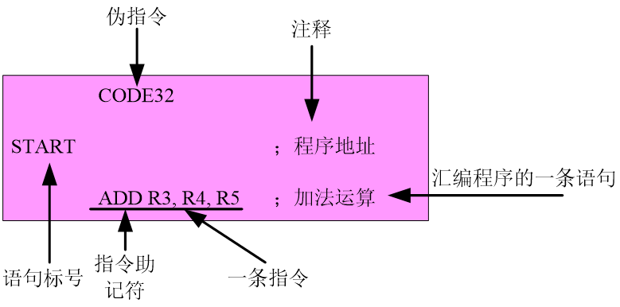

# ARM体系结构与编程

## **第4章** ARM程序设计基础

## 4.2 汇编语言的语句格式

- ARM（Thumb）汇编语言的语句格式为：
-  **{标号}  {指令或伪指令}  {；注释}**
- 标号必须从一行的行头开始，并且符号中不能包含空格。
- 指令不能从一行的行头开始，即在一行语句中，指令的前面必须有空格或者标号。
- 在汇编语言程序设计中，每一条指令的助记符可以全部用大写、或全部用小写，但不允许在一条指令中大、小写混用。
- 寄存器可以大写或小写。
- 伪指令有些必须在一行的开头顶格书写，另外一些必须留有空格。
- 注释以分号“；”开头，到行末结束。
- 如果一条语句太长，可将该长语句分为若干行来书写，在行的末尾用“**\**”表示下一行与本行为同一条语句。
- 在源程序中，语句之间可以插入空行，增强可读性。

**常数：数值、布尔值、字符或字符串**

- 数字：十进制数、十六进制数
- 布尔值：{TRUE/FALSE}
- 字符：由左右单引号组成
- 字符串：由左右双引号括住多个字符或空格组成



**汇编语言的源程序主要由指令、伪指令、语句标号和注释组成。**

- 指令：一条指令一般是一个简短的汇编语句行，由指令助记符和操作数、操作寄存器或语句标号组成。
- 伪指令：
  - 通过伪指令把设计意图表达给编译器，编译器依据这些伪指令，组织、编译和连接程序；
  - 大多数伪指令在编译后都不留痕迹。
- 语句标号：语句标号的主要作用有两个：
  - 一是表达地址；
  - 二是为一段语句命名，以方便记忆和阅读。
- 注释：注释是为了方便阅读和记忆。

### **4.2.1** **在汇编语言程序中常用的符号**

- 在汇编语言程序设计中，经常使用各种符号代替地址、变量和常量等，以增加程序的可读性。
- 尽管符号的命名由编程者决定，但并不是任意的，必须遵循以下的约定：
  - **符号由大小写字母、数字以及下划线组成；**
  - **局部标号以数字开头，其他的符号都不能以数字开头；**
  - **符号区分大小写，同名的大、小写符号会被编译器认为是两个不同的符号；**
  - **符号在其作用范围内必须唯一；**
  - **自定义的符号名不能与系统的保留字相同；**
  - **符号名不应与指令或伪指令同名。**

#### 1、 程序中的变量

-  程序中的变量是指其值在程序的运行过程中可以改变的量。ARM（Thumb）汇编程序所支持的变量有数字变量、逻辑变量和字符串变量。
  - 数字变量用于在程序的运行中保存数字值，但注意数字值的大小不应超出数字变量所能表示的范围。
  - 逻辑变量用于在程序的运行中保存逻辑值，逻辑值只有两种取值情况：真{true}或假{false}。
  - 字符串变量用于在程序的运行中保存一个字符串，但注意字符串的长度不应超出字符串变量所能表示的范围。
- 在ARM（Thumb）汇编语言程序设计中，可使用GBLA、GBLL、GBLS伪指令声明全局变量；使用LCLA、LCLL、LCLS伪指令声明局部变量；并可使用SETA、SETL和SETS对其进行初始化。

#### 2、 程序中的常量

- 程序中的常量是指其值在程序的运行过程中不能被改变的量。ARM（Thumb）汇编程序所支持的常量有数字常量、逻辑常量和字符串常量。
  - 数字常量一般为32位的整数，当作为无符号数时，其取值范围为0～232-1；当作为有符号数时，其取值范围为-2^31～2^31-1。
  - 逻辑常量只有两种取值情况：真或假。
  - 字符串常量为一个固定的字符串，一般用于程序运行时的信息提示。
- 使用EQU来定义数字常量。

#### 3、 程序中的变量替换

- 程序中的变量可通过替换操作取得一个常量。
- 替换操作符为“**$**”。
  - 如果在数字变量前面有一个代换操作符“$”，编译器会将该数字变量的值转换为十六进制的字符串，并将该十六进制的字符串替换“$”后的数字变量。
  - 如果在逻辑变量前面有一个替换操作符“$”，编译器会将该逻辑变量替换为它的取值（真或假）。
  - 如果在字符串变量前面有一个替换操作符“$”，编译器会将该字符串变量的值替换“$”后的字符串变量。
- 使用示例：

```
  LCLS S1 ；定义局部字符串变量S1和S2

  LCLS S2 

  S1 SETS “Test！”

  S2 SETS “This is a $S1” 

 ；字符串变量S2的值为“This is a Test！”
```

- 变量替换的特殊情况：

  - 如果需要字符$，则用$$来表示。
  - 包含在两个竖线（|）之间的$不进行变量替换，但如果竖线是在双引号内，则将进行变量替换。
  - 使用“**.**”来表示变量名称的结束。
  - 
  - 
  - 

  例如

- ```
   STR1  SETS  “STRING”
   STR2  SETS  “THISISA$STR1.INSETENCE”
   
  ```

  #### 4、标号

标号是表示程序中的指令或数据地址的符号，主要有三种：

- 基于PC的标号
  - 是位于目标指令前或者程序中数据定义伪操作前的标号。
  - 被处理成PC值加上或减去一个数字常量。
- 基于寄存器的标号
  - 通常用MAP和FIELD伪操作定义，或用EQU伪操作定义。
  - 被处理成寄存器的值加上或减去一个数字常量。
- 绝对地址
  - 绝对地址是一个32位的数字量。
  - 寻址范围为0～231-1，即可以寻址整个内存空间。

#### 5、局部标号

局部标号主要在局部范围使用。

局部标号定义的语法格式：

```
N{routname}
```

N为0－99的数字,routname为当前作用范围的名称。

局部变量引用的语法格式：

```
		%{F|B}{A|T}   N{routname}
```

### **4.2.2** **汇编语言程序中的表达式和运算符**

在汇编语言程序设计中，也经常使用各种表达式，表达式一般由变量、常量、运算符和括号构成。

常用的表达式有数字表达式、逻辑表达式和字符串表达式，其运算次序遵循如下的优先级：

- 优先级相同的双目运算符的运算顺序为从左到右。
- 相邻的单目运算符的运算顺序为从右到左，且单目运算符的优先级高于其他运算符。
- 括号运算符的优先级最高。

#### 1、 数字表达式及运算符

数字表达式一般由数字常量、数字变量、数字运算符和括号构成。与数字表达式相关的运算符如下：

 “＋”、“－”、“×”、“/” 及“MOD”算术运算符

 以上的算术运算符分别代表加、减、乘、除和取余数运算。例如，以X和Y表示两个数字表达式，则：

```
X＋Y			;表示X与Y的和
X－Y			;表示X与Y的差
X×Y			;表示X与Y的乘积
X/Y			;表示X除以Y的商
X：MOD：Y		;表示X除以Y的余数
```

“ROL”、“ROR”、“SHL”及“SHR”移位运算符

 以X和Y表示两个数字表达式，以上的移位运算符代表的运算如下：

```
	X：ROL：Y		;表示将X循环左移Y位
	X：ROR：Y		;表示将X循环右移Y位
	X：SHL：Y		;表示将X左移Y位
	X：SHR：Y		;表示将X右移Y位

```

“AND”、“OR”、“NOT”及“EOR”按位逻辑运算符

 以X和Y表示两个数字表达式，以上的**按位**逻辑运算符代表的运算如下：

```
X：AND：Y	;表示将X和Y按位作逻辑与的操作
X：OR：Y	;表示将X和Y按位作逻辑或的操作
：NOT：Y	;表示将Y按位作逻辑非的操作
X：EOR：Y	;表示将X和Y按位作逻辑异或的操作
```

#### 2、 逻辑表达式及运算符

逻辑表达式一般由逻辑量、逻辑运算符和括号构成，其表达式的运算结果为真或假。与逻辑表达式相关的运算符如下：

 “=”、“>”、“<”、“>=”、“<= ”、“/=”、“ <>” 运算符

以X和Y表示两个逻辑表达式，以上的运算符代表的运算如下

```
	X = Y		;表示X等于Y
	X > Y		;表示X大于Y
	X < Y		;表示X小于Y
	X >= Y		;表示X大于等于Y
	X <= Y		;表示X小于等于Y
	X /= Y		;表示X不等于Y
	X <> Y		;表示X不等于Y
```

“LAND”、“LOR”、“LNOT”及“LEOR”运算符

 以X和Y表示两个逻辑表达式，以上的逻辑运算符代表的运算如下：

```
X：LAND：Y		;表示将X和Y作逻辑与的操作
X：LOR：Y		;表示将X和Y作逻辑或的操作
：LNOT：Y		;表示将Y作逻辑非的操作
X：LEOR：Y		;表示将X和Y作逻辑异或的操作
```

操作结果为{FALSE}或{TRUE}

#### 3、 字符串表达式及运算符

字符串表达式一般由字符串常量、字符串变量、运算符和括号构成。编译器所支持的字符串最大长度为512字节。常用的与字符串表达式相关的运算符如下：

**LEN运算符**

 LEN运算符返回字符串的长度（字符数），以X表示字符串表达式，其语法格式如下：

```
	：LEN：X
```

**CHR运算符**

CHR运算符将0～255之间的整数转换为一个ASCII字符，以M表示某一个整数，其语法格式如下：

```
	：CHR：M
```

**STR运算符**

STR运算符将将一个数字表达式或逻辑表达式转换为一个字符串。对于数字表达式，STR运算符将其转换为一个以十六进制组成的字符串；对于逻辑表达式，STR运算符将其转换为字符串T或F，其语法格式如下：

```
	：STR：X
```

 其中，X为一个数字表达式或逻辑表达式。

**LEFT运算符**

 LEFT运算符返回某个字符串左端的一个子串，其语法格式如下：

```
	X：LEFT：Y
```

 其中：X为源字符串，Y为一个整数，表示要返回的字符个数。

**RIGHT运算符**

 与LEFT运算符相对应，RIGHT运算符返回某个字符串右端的一个子串，其语法格式如下：

```
	X：RIGHT：Y
```

 其中：X为源字符串，Y为一个整数，表示要返回的字符个数。

**CC运算符**

 CC运算符用于将两个字符串连接成一个字符串，其语法格式如下：

```
	X：CC：Y
```

 其中：X为源字符串1，Y为源字符串2，CC运算符将Y连接到X的后面。

#### 4、 与寄存器和程序计数器（PC）相关的表达式及运算符

 常用的与寄存器和程序计数器（PC）相关的表达式及运算符如下：

 **BASE运算符**

BASE运算符返回基于寄存器的表达式中寄存器的编号，其语法格式如下：

```
 ：BASE：X

```

 其中，X为与寄存器相关的表达式。

**INDEX运算符**

 INDEX运算符返回基于寄存器的表达式中相对于其基址寄存器的偏移量，其语法格式如下：

```
 ：INDEX：X

```

 其中，X为与寄存器相关的表达式。

####  5、 其他常用运算符

**？运算符**

 ？运算符返回某代码行所生成的可执行代码的长度，例如：

```
	?X
```

 返回定义符号X的代码行所生成的可执行代码的字节数。

**DEF运算符**

 DEF运算符判断是否定义某个符号，例如：

```
	：DEF：X

```

 如果符号X已经定义，则结果为真，否则为假。

操作符运算顺序

|      | 单目操作                 | 备注           |
| ---- | ------------------------ | -------------- |
| 1    | *、/、MOD                | 乘除和取模     |
| 2    | SHL、SHR、ROR、ROL       | 移位运算       |
| 3    | +、-、AND、OR、EOR       | 加减和逻辑运算 |
| 4    | ==、>、>=、<、<=、/=、<> | 各种逻辑运算   |
| 5    | LAND、LOR、LEOR          | 逻辑运算       |

## 4.3 汇编语言的程序结构

### **4.3.1** **汇编语言的程序结构**

在ARM（Thumb）汇编语言程序中，以程序**段**为单位组织代码。段是相对独立的指令或数据序列，具有特定的名称。

段可以分为代码段和数据段，代码段的内容为执行代码，数据段存放代码运行时需要用到的数据。

一个汇编程序至少应该有一个代码段，当程序较长时，可以分割为多个代码段和数据段，多个段在程序编译链接时最终形成一个可执行的映象文件。

可执行映象文件通常由以下几部分构成：

- **一个或多个代码段，代码段的属性为只读。**
- **零个或多个包含初始化数据的数据段，数据段的属性为可读写。**
- **零个或多个不包含初始化数据的数据段，数据段的属性为可读写**

链接器根据系统默认或用户设定的规则，将各个段安排在存储器中的相应位置。因此源程序中段之间的相对位置与可执行的映象文件中段的相对位置一般不会相同。

文件应该按功能构成，尽可能把一个功能完整地编辑在同一个文件中，这样便于调试和修改。

尽量减少一个文件与其他文件之间的关联，尽量减少文件的入口和出口，这样使程序条理更加清晰。

一个文件中代码段和数据段地设立不要过多，应该把夹在代码段中的数据缓冲区尽可能的集中在一起。

最好把Thumb指令设计为单独的段，并把ARM指令段和Thumb指令段分开存储。

数据存储区也要按功能划分，特权模式和用户模式程序使用不同的存储区块，以便对这些存储区块进行属性定义。

以下是一个汇编语言源程序的基本结构：

```
   	 AREA	Init，CODE，READONLY
     ENTRY
start
     LDR	R0，=0x3FF5000
     LDR	R1，0xFF
     STR	R1，[R0]
     LDR	R0，=0x3FF5008
     LDR	R1，0x01
     STR	R1，[R0]
     ………
     END
	
```

> 在汇编语言程序中，用AREA伪指令定义一个段，并说明所定义段的相关属性，本例定义一个名为Init的代码段，属性为只读。ENTRY伪指令标识程序的入口点，接下来为指令序列，程序的末尾为END伪指令，该伪指令告诉编译器源文件的结束，每一个汇编源程序都必须有一条END伪指令，指示源程序的结束。

### **4.3.2** **汇编语言的子程序调用**

在ARM汇编语言程序中，子程序的调用一般是通过**BL**指令来实现的。在程序中，使用指令：

```
 BL 子程序名
```

 即可完成子程序的调用。

该指令在执行时完成如下操作：

- 将子程序的返回地址存放在连接寄存器LR中，同时将程序计数器PC指向子程序的入口点。
- 当子程序执行完毕需要返回调用处时，只需要将存放在LR中的返回地址重新拷贝给程序计数器PC即可。

在调用子程序的同时，也可以完成参数的传递和从子程序返回运算的结果，通常可以使用寄存器R0～R3完成。


以下是使用BL指令调用子程序的汇编语言源程序的基本结构：

```
    AREA	Init，CODE，READONL
    ENTRY
  start
     LDR	R0，=0x3FF5000
     LDR	R1，0xFF
     STR	R1，[R0]
     LDR	R0，=0x3FF5008
     LDR	R1，0x01
     STR	R1，[R0]
     BL	PRINT_TEXT
     ;………
  PRINT_TEXT
     ;………
     ;………

     MOV	PC，LR
          
   END
```

### **4.3.3** **汇编语言程序示例**

以下是一个基于S3C4510B的串行通讯程序，在此仅说明一个完整汇编语言程序的基本结构：

```
    ; *********************************************************************
	;   Software Engineering Institute East China Normal University
	;    Description:  This example shows the UART communication！
	;    Author:   BBsitman
	;    Date:	
	;**********************************************************************
	UARTLCON0	EQU	0x3FFD000
    UARTCONT0	EQU	0x3FFD004
    UARTSTAT0	EQU 	0x3FFD008
    UTXBUF0	EQU	0x3FFD00C
    UARTBRD0	EQU	0x3FFD014
		AREA Init,CODE,READONLY
		ENTRY
	;   **************************************************	
	;   LED Display
	;   **************************************************
		LDR	R1,=0x3FF5000
		LDR	R0,=&ff
		STR	R0,[R1]
		LDR	R1,=0x3FF5008
		LDR	R0,=&ff
		STR	R0,[R1]
	;   *************************************************
	;   UART0 line control register
	;   *************************************************
		LDR	R1,=UARTLCON0
		LDR	R0,=0x03
		STR	R0,[R1]
	;   **************************************************
	;   UART0 control regiser
	;   **************************************************
		LDR	R1,=UARTCONT0
		LDR	R0,=0x9
		STR	R0,[R1]
	;   **************************************************
	;   UART0 baud rate divisor regiser
	;   Baudrate=19200，对应于50MHz的系统工作频率
	;  ***************************************************
		LDR	R1,=UARTBRD0
		LDR	R0,=0x500      
		STR	R0,[R1]
	;  ***************************************************
	;  Print the messages!
	;  ***************************************************
	LOOP	
		LDR	R0,=Line1
		BL	PrintLine
		LDR	R0,=Line2
		BL	PrintLine
		LDR	R0,=Line3
		BL	PrintLine
		LDR	R0,=Line4
		BL	PrintLine
		LDR	R1,=0x7FFFFF
	LOOP1	
		SUBS	R1,R1,#1
		BNE	LOOP1	
		B	LOOP
	;  ***************************************************
	; Print line 
	; ***************************************************
	PrintLine
		MOV	R4,LR
		MOV	R5,R0
	Line	
		LDRB	R1,[R5],#1
		AND	R0,R1,#&FF
		TST	R0,#&FF
		MOVEQ	PC,R4
		BL	PutByte
		B	Line	
	PutByte	
		LDR	R3,=UARTSTAT0
		LDR	R2,[R3]
		TST	R2,#&40
		BEQ	PutByte
		LDR	R3,=UTXBUF0	
		STR	R0,[R3]
		MOV	PC,LR
	Line1 DCB  &A,&D,"******************************************************************",0
	Line2 DCB	&A,&D,"Chinese Academy of Sciences,Institute of Automation,Complex 	System Lab.",0
	Line3 DCB	&A,&D,"ARM Development Board Based on Samsung ARM S3C4510B.",0
	Line4 DCB  &A,&D,&A,&D,&A,&D,&A,&D,&A,&D,&A,&D,&A,&D,&A,&D,&A,&D,&A,&D,&A,&D,&A,&D,&A
	 DCB	&D,&A,&D,&A,&D,0
	END
```

## 4.4 本章小节

本章介绍了ARM程序设计的一些基本概念，以及在汇编语言程序设计中常见的伪指令、汇编语言的基本语句格式等，汇编语言程序的基本结构等，这些问题均为程序设计中的基本问题，要求理解并掌握。

练习:

1、用LDM/STM实现一块连续内存单元之间的数据传输（块复制）。

- R12指向数据块的起始地址，r14指向数据块的结束地址，r13指向目的处的起始地址。

2、函数的调用与返回

- 以题1块拷贝的功能模块作为函数体，写出该函数原型；
- 写出函数blockcopy调用的相关代码。

3、利用ARM指令具有条件执行的功能写出下列C代码对应的汇编代码。要求按照ARM汇编程序语法书写。

```
int a=1,b=4;
if (a>b)
   a=b+1;
else
   b=a+1;
return a-b;
```

```
int i,a[10]={0,1,2,3,4,5,6,7,8,9};
for (i=0;i<10;i++)
   a[i]=a[i]+i;
```

