​	截止到2023年1月10日,我搭建好这个博客有好几天了,最近也忙着在增改博客的功能.我尽量用简单的语言,记录一下我的工作, 如果大佬看到能给出一点建议就更好了.

## 一.安装node.js ,使用npm本地安装hexo博客

​	首先是在笔记本上下载好node.js,官网下载：https://nodejs.org/en/ ,直接一路点点点,就行.我之前也在linux弄过,应该是把压缩包git下来,解压安装,总是还挺麻烦.


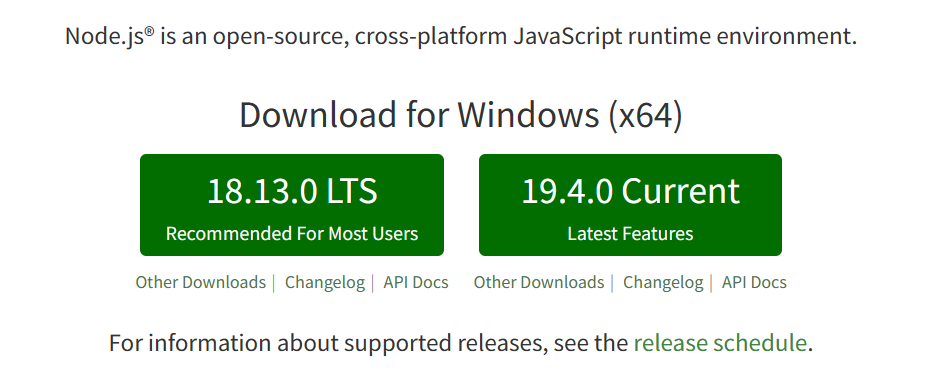

安装完成后,检查是否正确安装,`node -v` 和 `npm -v` 查看版本号

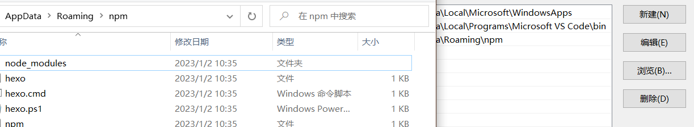

调用下述指令安装hexo

```cmd
npm install -g hexo-cli
```

可以使用`hexo -v` 查看是否安装

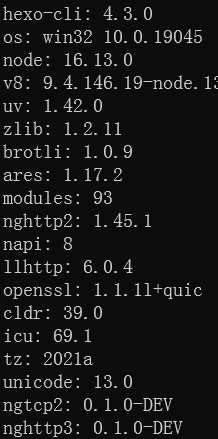

自定位置,使用 `hexo init blog` 创建blog文件夹,并初始化

可以试试 `hexo -g` 静态部署,以及 `hexo -s` 开始本地服务器, 之后跳转到 http://localhost:4000 查看本地网页,之后写完博客,也可以这样预览.

`hexo new XXX(名字)` 就可以在本地,\source\_posts\下生成同名md文件了, 

然后就可以愉快的用Typora等编辑器写作了,不过此时博客还在本地,我们还需要借助github(或者gitee等类似网站来托管)

## 二. 部署hexo 静态博客 到github

这里我选择的是github, 主要是gitee pages开启需要实名认证,大概要等个一两天才能通过,之后的网站更新还需要手动去仓库刷新,不像github提交hexo -d 后自动就给网页更新了,总之,在网络条件允许的情况下,还是建议github.

首先要有个github 账号,新建一个XXX.github.io的仓库(xxx和账户同名),类型选公开,即public


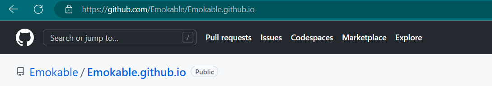

点开setting下左侧栏的Pages页面,应该会有类似的提示,

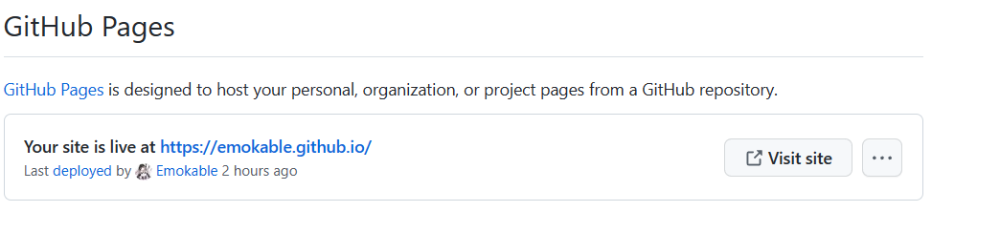

但目前为止我们还没有把本地的hexo博客和github结合起来,别急,接着编辑我们新建的blog文件夹下的

`_config.yml`文件,拉到最底层,做如下修改, repo地址为自己仓库的地址

```
# Docs: https://hexo.io/docs/one-command-deployment
deploy:
 type: git
 repo: git@github.com:Emokable/Emokable.github.io.git
 branch: main
```

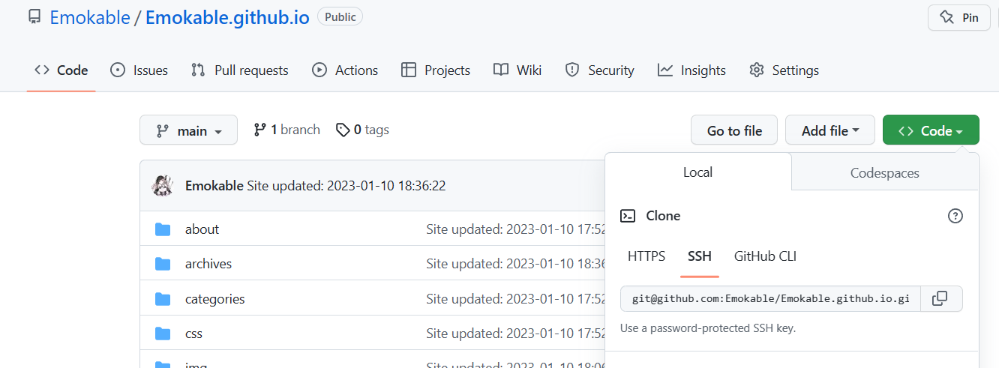

如果没有设置过git ,还需要配置账号,生成ssh密钥

```
git config –global user.name yourname
git config –global user.email yourname@mail.com
```

```
ssh-keygen -t rsa -C yourname@mail.com
```

之后用cat命令打开生成的id_rsa.pub文件,复制下来,粘贴到github里

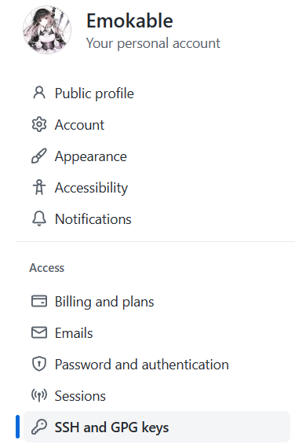

认证完成后  ssh git@github.com 查看是否成功

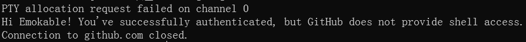

然后安装hexo git 插件

`npm install hexo-deployer-git –save`

安装完成后, `hexo -cl`    `hexo -g`  `hexo -v` 三连击,上传本地博客,结束!

## 三.DLC  1---更换hexo主题

正所谓科技以换皮为主, 一个好的博客 外在同样重要, 可以到官方的[主题站](https://hexo.io/themes/index.html)去挑选喜欢的样式

我选择的是比较简约的fluid主题,当然还有别的好看的比如NexT,Butterfly之类的,配置方法参考各自的配置文档就行.

不过我现在用的fluid设置都还没吃透,就不详细讲了,有空再说吧...

## 四.DLC  2---图文结合的博客

我是使用typora写作的,其实也还挺容易.先到`_config.yml`里修改

```
post_asset_folder: true
```

新建博客的时候同时创建用于存储图片的同名文件夹,再如下修改typora的偏好设置

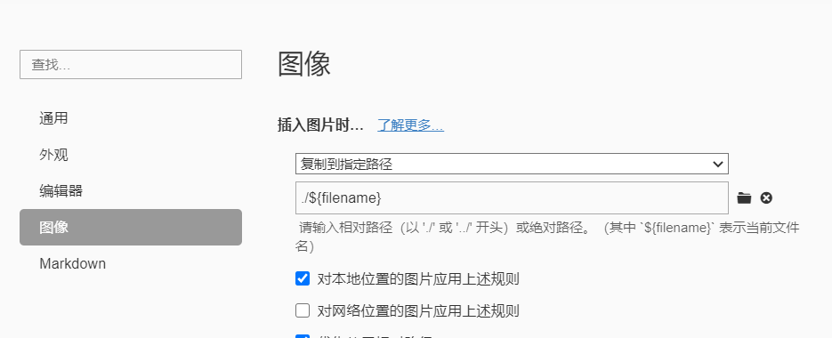

这样写作的时候直接往typora里添加文件,图片就能直接自动添加到我们生成的同名文件夹里了,写完保存后,执行三连指令,我们的图片就出现在博客正文里了.

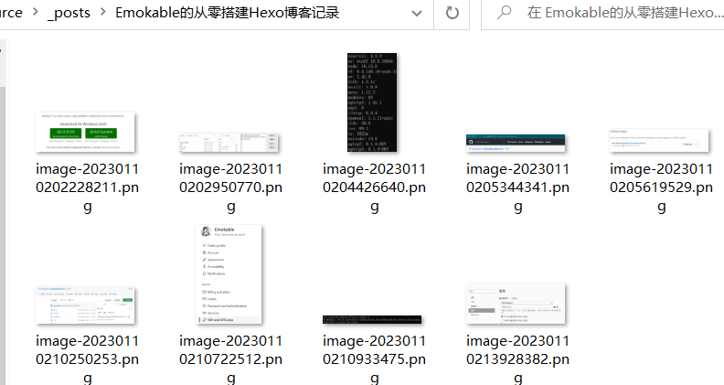

不过我看网上还有图床cdn之类的优化方法,我还没有研究过,就先放着这里,等我弄懂了再细说

> 2023/1/13:
>
> ### 	- 新增了压缩插件的使用,这个插件可以压缩图片,css,js,html加快博客加载速度
>
> 在博客根目录执行指令:
>
> ```
> npm install hexo-all-minifier --save
> ```
>
> 然后果不其然的安装报错了......(忘了截图了)
>
> 尝试换到cnpm淘宝版
>
> ```
> npm install -g cnpm -registry=https://registry.npm.taobao.org  #安装cnpm
> cnpm install hexo-all-minifier --save    
> ```
>
>  我只是换成cnpm就成功了,其他人如果安装失败也可以试试
>
> 然后在根目录_comfig.yml里增加
>
> 在博客根目录的站点配置文件`_config.yml`里添加配置项
>
> ```
> # minifier
> all_minifier: true
> html_minifier:
>   enable: true
>   ignore_error: true
>   exclude:
> css_minifier:
>   enable: true
>   exclude:
>     - '*.min.css'
> js_minifier:
>   enable: true
>   mangle: true
>   #output:
>   compress:
>   exclude:
>     - '*.min.js'
> image_minifier:
>   enable: true
>   interlaced: false
>   multipass: false
>   optimizationLevel: 2
>   pngquant: false
>   progressive: false
> ```
>
> 我是选择了全部压缩的方案,但这样图片比较多的情况下,hexo g和hexo d的所需的时间会变长
>
> 此外再注意一点就是`ignore_error: true`这个选项,我选择了忽略错误,否则生成博客时,我的博客主题会在about页报错,运行时无法加载出about页...
>
> > 此处安装过程参考了[ **七夏浅笑** ](https://www.julydate.com/post/60859300/#%E6%96%87%E4%BB%B6%E5%8E%8B%E7%BC%A9)这篇博客.


## 五.DLC  3---评论区设置

我所使用的fluid主题里,是预留了评论区的位置的,其他主题应该也类似,只要选择好喜欢的评论插件,填写自己的地址就行.

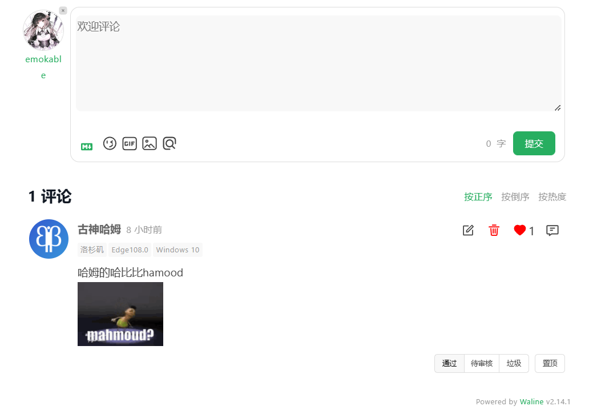

这里以waline为例,首先去注册 [Leanclound](https://console.leancloud.app/apps) 作为评论数据库，在 [Vercel](https://vercel.com/dashboard) 上部署服务端。接着就按照 [Waline的官方文档](https://waline.js.org/guide/get-started/#leancloud-%E8%AE%BE%E7%BD%AE-%E6%95%B0%E6%8D%AE%E5%BA%93) 进行操作,挺简单的,这里就懒得写了.

不过要注意,部署完成后尽快到`<serverURL>/ui/register` 进行注册,首个注册的人会被设定成管理员,之后也可以到这个界面去管理评论.

## 六.DLC  4---看板娘设置

哇,这个我现在还在搞,留个坑在这里,弄完了再写吧...

> 2023/1/11 蚌埠住了,家人们,搞这个直接把hexo搞崩了,又把博客重新部署了一遍😔,心累,下次记得做好备份

## 七.个性域名和cdn加速

原来的username.github.io被我换成了现在的emokable.top, 这个域名是namesilo上花1刀买的,可以用支付宝,不过我目前还没有在国内做备案的打算,不然国内找找肯定有更便宜的,这里各家购买方式不一,网上资料也很多,没什么写的必要(偷懒)...

买完后,进入到域名管理界面

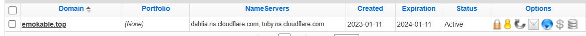

修改A和CNAME类,一个是github的ip,另一个是博客原地址,改完后,在博客本地,新建一个CNAME无后缀文件,里面内容是新申请的域名,比如我就填emokable.top

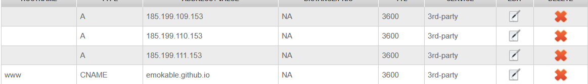

最后到GitHub仓库的setting里更改就完成了

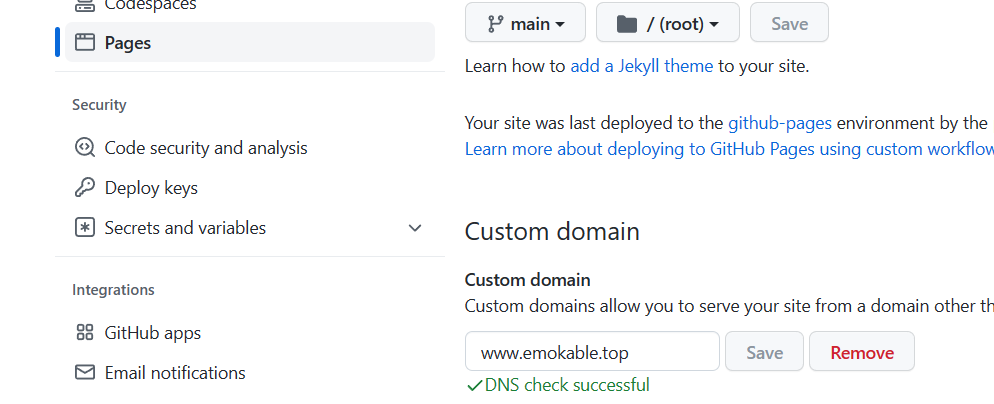

不过这样直接改完会有一点小问题,就是网站ssl证书的问题,浏览器会有隐私提示,非常丑

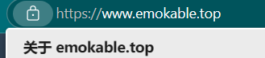

我是到cloudflare上开cdn服务自动添加的证书,现在就好看多了

首先进入官网,添加自己的域名(这里我已经弄好了),然后按着步骤来,中途会教你换一下域名服务器,需要到购买的域名后台去修改.

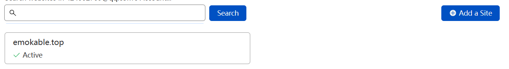

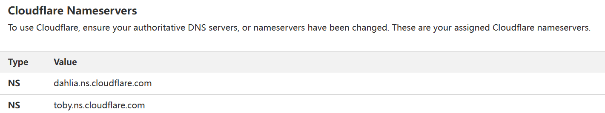

之后就算开启了cloudflare的托管服务了,应该会自动安装好证书.