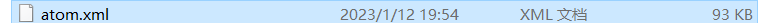
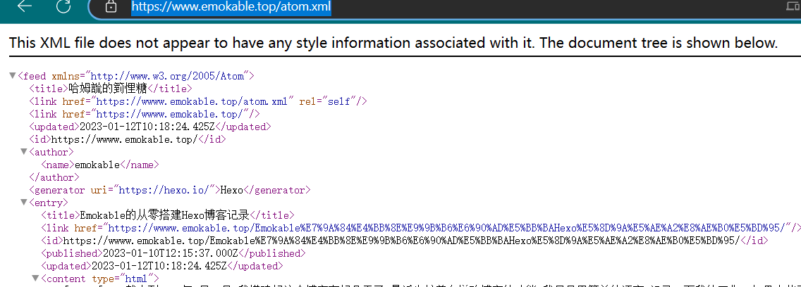
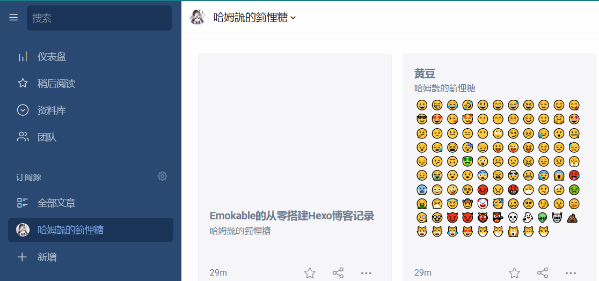
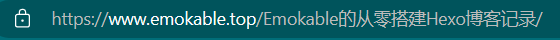
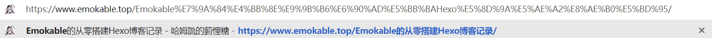
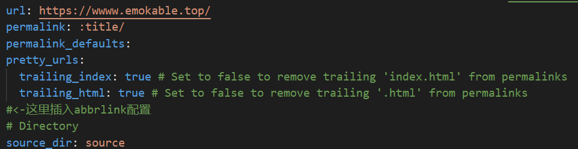

​	截止到2023年1月10日,我搭建好这个博客有好几天了,最近也忙着在增改博客的功能.我尽量用简单的语言,记录一下我的工作, 如果大佬看到能给出一点建议就更好了.

## 一.安装node.js ,使用npm本地安装hexo博客

​	首先是在笔记本上下载好node.js,官网下载：https://nodejs.org/en/ ,直接一路点点点,就行.我之前也在linux弄过,应该是把压缩包git下来,解压安装,总是还挺麻烦.


安装完成后,检查是否正确安装,`node -v` 和 `npm -v` 查看版本号


调用下述指令安装hexo

```cmd
npm install -g hexo-cli
```

可以使用`hexo -v` 查看是否安装


自定位置,使用 `hexo init blog` 创建blog文件夹,并初始化

可以试试 `hexo -g` 静态部署,以及 `hexo -s` 开始本地服务器, 之后跳转到 http://localhost:4000 查看本地网页,之后写完博客,也可以这样预览.

`hexo new XXX(名字)` 就可以在本地,\source\_posts\下生成同名md文件了, 

然后就可以愉快的用Typora等编辑器写作了,不过此时博客还在本地,我们还需要借助github(或者gitee等类似网站来托管)

## 二. 部署hexo 静态博客 到github

这里我选择的是github, 主要是gitee pages开启需要实名认证,大概要等个一两天才能通过,之后的网站更新还需要手动去仓库刷新,不像github提交hexo -d 后自动就给网页更新了,总之,在网络条件允许的情况下,还是建议github.

首先要有个github 账号,新建一个XXX.github.io的仓库(xxx和账户同名),类型选公开,即public


点开setting下左侧栏的Pages页面,应该会有类似的提示,


但目前为止我们还没有把本地的hexo博客和github结合起来,别急,接着编辑我们新建的blog文件夹下的

`_config.yml`文件,拉到最底层,做如下修改, repo地址为自己仓库的地址

```
# Docs: https://hexo.io/docs/one-command-deployment
deploy:
 type: git
 repo: git@github.com:Emokable/Emokable.github.io.git
 branch: main
```


如果没有设置过git ,还需要配置账号,生成ssh密钥

```
git config –global user.name yourname
git config –global user.email yourname@mail.com
```

```
ssh-keygen -t rsa -C yourname@mail.com
```

之后用cat命令打开生成的id_rsa.pub文件,复制下来,粘贴到github里


认证完成后  ssh git@github.com 查看是否成功


然后安装hexo git 插件

`npm install hexo-deployer-git –save`

安装完成后, `hexo -cl`    `hexo -g`  `hexo -v` 三连击,上传本地博客,结束!

## 三.DLC  1---更换hexo主题

正所谓科技以换皮为主, 一个好的博客 外在同样重要, 可以到官方的[主题站](https://hexo.io/themes/index.html)去挑选喜欢的样式

我选择的是比较简约的fluid主题,当然还有别的好看的比如NexT,Butterfly之类的,配置方法参考各自的配置文档就行.

不过我现在用的fluid设置都还没吃透,就不详细讲了,有空再说吧...

## 四.DLC  2---图文结合的博客

我是使用typora写作的,其实也还挺容易.先到`_config.yml`里修改

```
post_asset_folder: true
```

新建博客的时候同时创建用于存储图片的同名文件夹,再如下修改typora的偏好设置


这样写作的时候直接往typora里添加文件,图片就能直接自动添加到我们生成的同名文件夹里了,写完保存后,执行三连指令,我们的图片就出现在博客正文里了.


不过我看网上还有图床cdn之类的优化方法,我还没有研究过,就先放着这里,等我弄懂了再细说

------

> 2023/1/12
>
> 图床的原理我基本明白了,最简单的就是直接在github建个仓库就行,使用picgo配置好仓库和上传图片的文件夹,同时typora里也要更改,自定义域名采用cdn加速格式：https://cdn.jsdelivr.net/gh/username/repo，username为GitHub用户名，repo为新建的仓库，用于存储图片,我暂时还没有更改的必要,毕竟现在网页也已经采用全局cdn加速了,后续有兴趣我会考虑修改。


> 2023/1/11:
>
> ### 	- 新增了压缩插件的使用,这个插件可以压缩图片,css,js,html加快博客加载速度
>
> 在博客根目录执行指令:
>
> ```
> npm install hexo-all-minifier --save
> ```
>
> 然后果不其然的安装报错了......(忘了截图了)
>
> 尝试换到cnpm淘宝版
>
> ```
> npm install -g cnpm -registry=https://registry.npm.taobao.org  #安装cnpm
> cnpm install hexo-all-minifier --save    
> ```
>
> 我只是换成cnpm就成功了,其他人如果安装失败也可以试试
>
> 然后在根目录_comfig.yml里增加
>
> 在博客根目录的站点配置文件`_config.yml`里添加配置项
>
> ```
> # minifier
> all_minifier: true
> html_minifier:
> enable: true
> ignore_error: true
> exclude:
> css_minifier:
> enable: true
> exclude:
>     - '*.min.css'
> js_minifier:
>   enable: true
>   mangle: true
>   #output:
>   compress:
>   exclude:
>     - '*.min.js'
> image_minifier:
>   enable: true
>   interlaced: false
>   multipass: false
>   optimizationLevel: 2
>   pngquant: false
>   progressive: false
> ```
>
> 我是选择了全部压缩的方案,但这样图片比较多的情况下,hexo g和hexo d的所需的时间会变长
>
> 此外再注意一点就是`ignore_error: true`这个选项,我选择了忽略错误,否则生成博客时,我的博客主题会在about页报错,运行时无法加载出about页...
>
> > 此处安装过程参考了[ **七夏浅笑** ](https://www.julydate.com/post/60859300/#%E6%96%87%E4%BB%B6%E5%8E%8B%E7%BC%A9)这篇博客.


## 五.DLC  3---评论区设置

我所使用的fluid主题里,是预留了评论区的位置的,其他主题应该也类似,只要选择好喜欢的评论插件,填写自己的地址就行.


这里以waline为例,首先去注册 [Leanclound](https://console.leancloud.app/apps) 作为评论数据库，在 [Vercel](https://vercel.com/dashboard) 上部署服务端。接着就按照 [Waline的官方文档](https://waline.js.org/guide/get-started/#leancloud-%E8%AE%BE%E7%BD%AE-%E6%95%B0%E6%8D%AE%E5%BA%93) 进行操作,挺简单的,这里就懒得写了.

不过要注意,部署完成后尽快到`<serverURL>/ui/register` 进行注册,首个注册的人会被设定成管理员,之后也可以到这个界面去管理评论.

## 六.DLC  4---看板娘设置

哇,这个我现在还在搞,留个坑在这里,弄完了再写吧...

> 2023/1/11 蚌埠住了,家人们,搞这个直接把hexo搞崩了,又把博客重新部署了一遍😔,心累,下次记得做好备份

## 七.DLC  5---个性域名和cdn加速

原来的username.github.io被我换成了现在的emokable.top, 这个域名是namesilo上花1刀买的,可以用支付宝,不过我目前还没有在国内做备案的打算,不然国内找找肯定有更便宜的,这里各家购买方式不一,网上资料也很多,没什么写的必要(偷懒)...

买完后,进入到域名管理界面


修改A和CNAME类,一个是github的ip,另一个是博客原地址,改完后,在博客本地,新建一个CNAME无后缀文件,里面内容是新申请的域名,比如我就填emokable.top


最后到GitHub仓库的setting里更改就完成了


不过这样直接改完会有一点小问题,就是网站ssl证书的问题,浏览器会有隐私提示,非常丑


我是到cloudflare上开cdn服务自动添加的证书,现在就好看多了

首先进入官网,添加自己的域名(这里我已经弄好了),然后按着步骤来,中途会教你换一下域名服务器,需要到购买的域名后台去修改.


之后就算开启了cloudflare的托管服务了,应该会自动安装好证书.

## 八.DLC  6---博客备份,防止崩溃

之前搞崩了一次真的很难受,github仓库里只存了博客网页的文件,而本地文件是没有的,所以重新备份一遍吧

先创建新的分支

- 登录GitHub网站，在博客的仓库下新建一个分支，命名为hexo
- 在创建好分支后，在setting中将新建的分支设置为default

再配置用来备份文件夹

在本地的任意目录下执行git clone https://github.com/username/uesrname.github.io.git，
将克隆下来的目录中除了.git文件夹外的所有文件删除
将本地博客文件夹下除了.deploy_git的其他源文件全部复制过来(如果之前克隆过themes中的主体文件，要将主题文件中的.git目录删除掉)

```shell
git add .
git commit -m "备注"
git push
```

这样hexo博客的目录就备份好了,之后可以把.git文件夹移回原blog文件夹了,再次pull,重新提交,这样就不需要再弄插件了.

因为我们博客默认在main分支的,备份是在新建的hexo分区,因此使用hexo d和git push指向的分支各不干扰,写博客的时候正常写就行.

## 九.DLC  7---设置博客rss订阅

简易信息聚合是“Really Simple Syndication”或“Richsite summary”(网站内容摘要)的中文名字。是站点用来和其他站点之间共享内容的一种简易方式。英文缩写为RSS技术。

RSS是一种信息聚合的技术，是某一站点和其他站点之间共享内容的一种简易信息发布与传递的方式，使得一个网站可以方便的调用其他提供[RSS订阅](https://baike.baidu.com/item/RSS订阅?fromModule=lemma_inlink)服务的网站内容，从而形成非常高效的信息聚合，让网站发布的内容在更大的范围内传播。他是一种用于共享新闻和其他WEB内容的数据交换规范，也是使用最广泛的一种扩展性标识语言。([粘自百度百科](https://baike.baidu.com/item/%E7%AE%80%E6%98%93%E4%BF%A1%E6%81%AF%E8%81%9A%E5%90%88/6453727))

RSS算是比较古老的玩意了,而且需要阅读器支持,我用的是[innoreader](https://www.innoreader.com/),但大多数博客都有,所以我也做一个

首先安装插件

```
 npm install hexo-generator-feed
```

然后在主目录下_config.yml添加

```
#RSS订阅
feed: 
type: atom #RSS的类型(atom/rss2)
path: atom.xml #文件路径,默认是atom.xml/rss2.xml
limit: 20 #展示文章的数量,使用0或则false代表展示全部
hub: 
content:  #在RSS文件中是否包含内容 ,有3个值 true/false默认不填为false
content_limit: 140 #指定内容的长度作为摘要,仅仅在上面content设置为false和没有自定义的描述出现
content_limit_delim: " " #上面截取描述的分隔符,截取内容是以指定的这个分隔符作为截取结束的标志.在达到规定的内容长度之前最后出现的这个分隔符之前的内容,防止从中间截断
order_by: -date
icon: #icon.png
```

这样在我们hexo g的时候就会生成atom.xml文件



然后https://www.emokable.top/atom.xml 就是我的rss订阅连接,打开能看到我们的短消息



最后看看阅读器效果



## 十.DLC  8---文章连接生成简化

主题默认的文章连接是

`:year/:month/:day/:tite`太长了,所以我最早考虑的是去掉日期(因为文章里面已经有日期了),只保留标题`permalink: :title/`.

但是这样虽然看起来简化了,实际上中文连接在互联网的支持还是不够





考虑过再次更改文章样式,比如换成随机数字字母或者拼音

参考了这篇博客[cungudafa姑 ](https://cungudafa.gitee.io/post/9958.html),但最终还是没有采用......(人就是懒)

**字母**:

安装插件:

```
npm install hexo-abbrlink --save
```

文章生成处修改为    `permalink: :abbrlink.html`

在插入处增加代码段:

```
abbrlink:
	alg: crc16	#算法,默认crc16,可选crc32
	rep: hex	#进制, 默认dec-10进制,可选hex-16进制
```



```
 效果:
 crc16 & hex https://www.emokable.com/66c8.html 

 crc16 & dec https://www.emokable.com/65535.html

 crc32 & hex https://www.emokable.com/8ddf18fb.html 

 crc32 & dec https://www.emokable.com/1690090958.html
```

**拼音:**

安装插件: 

```
npm install hexo-permalink-pinyin --save
```

在下方相同位置插入

```
permalink_pinyin:
	enable: true
	separator: '-'	#间隔符
```

但最后我还是都没采用,因为我试了一下,网页是可以正常生成的,但是图片连接出了问题(我是引用的本地图片),最后懒得去矫正了,如果在写博客之前就修改应该是不错的选择.

