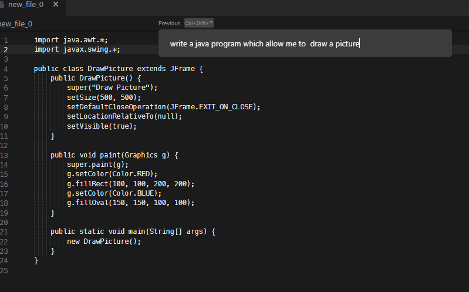
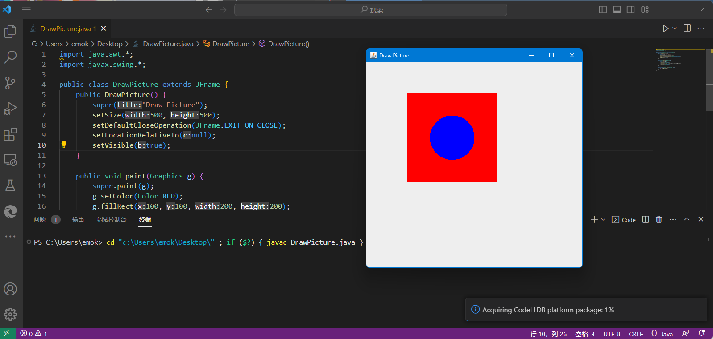
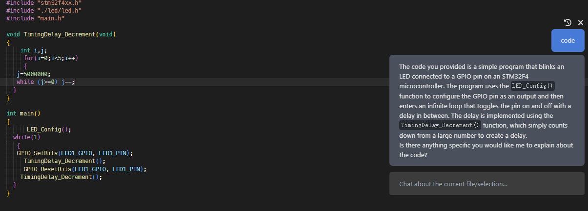

# 一.大概的背景

舍友推荐了一个新的GPT代码辅助IDE

网址https://www.cursor.so/

ctrl +l 可以询问代码相关问题

ctrl +k 可以叫他帮忙写代码

目前应该对英语支持较好，使用模型为GPT-3(问他不认识3090ti，回答的最新ubuntu为21.04)

免费，不需要梯子，这点好评。

# 二.使用测试

试着让他帮我写个可以画图的java代码

能跑，但不太对劲

我舍友测过叫他写二叉树是可以的，如果输出不完可以输入continue继续写

代码解释

# 三.评价

虽然仍有缺陷，但功能研究够强大了，目前免费，如果以后转收费了，可能会更强，趁着还没火，多玩几下还是爽的。