# 物联网技术与应用

### **物物互联**

•物联网概念在2005年国际电信联盟（ITU）发布的《ITU互联网报告2005：物联网》中被正式提出：

”它通过泛在网络，借助物体识别技术（如射频识别）、传感技术、嵌入式智能技术、小型化技术（如纳米结构），将世界万物连接在一起，通过感知世界、认识世界、改造世界，进而推动整个世界发展。

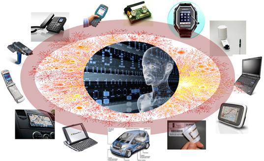

### 物联网是一项技术吗 ……

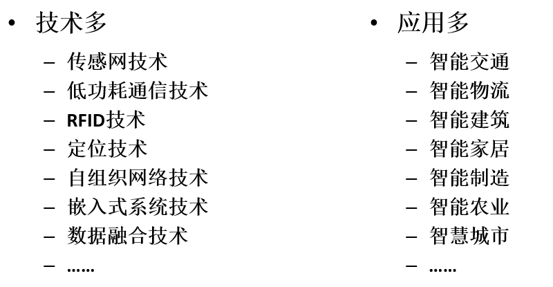

**来源多样，主线复杂**

物联网不是某项具体的技术，而是很多推动万物互联趋势的支撑技术的有机集合。

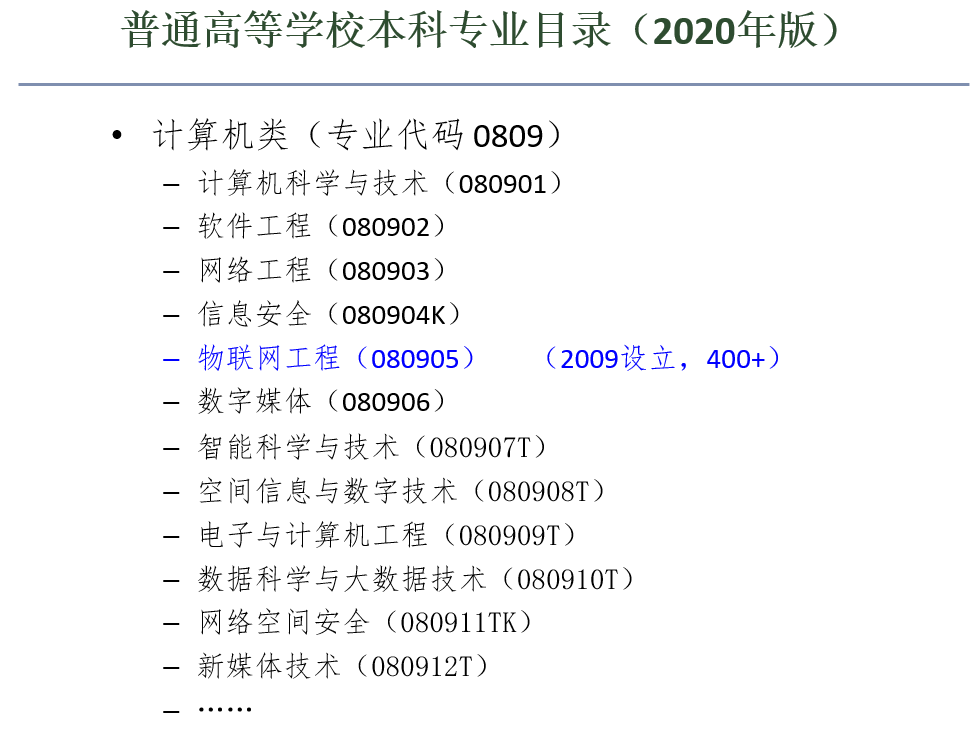

> 虽然这里是软工。。。

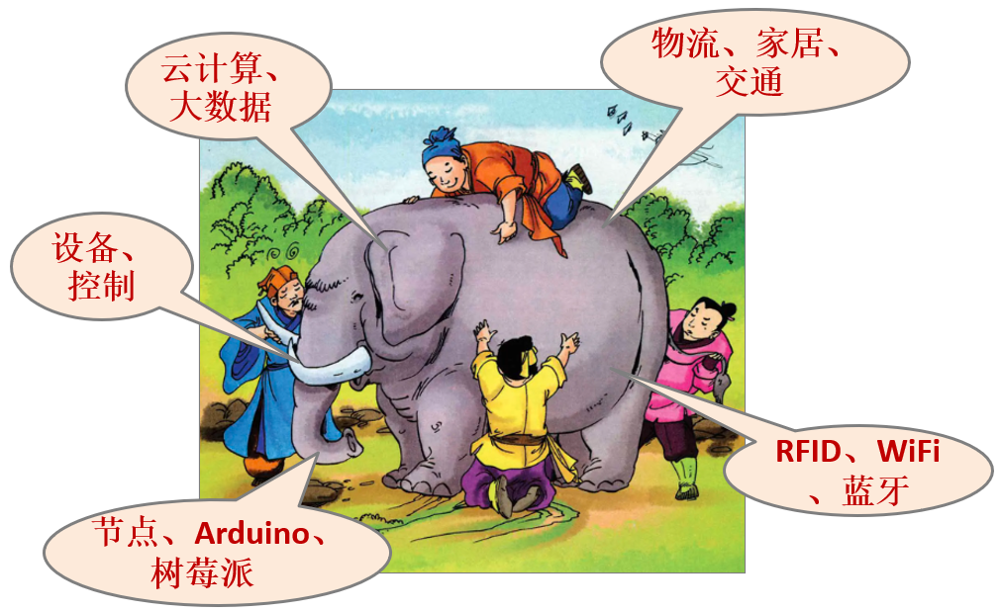

# 物联网  IoT (Internet of Things)

- 概述
- 感知识别
- 传感网络
- 支撑管理
- 广域连接
- 综合应用

## **第一章 物联网概述**

### 1.1**发展起源和背景**

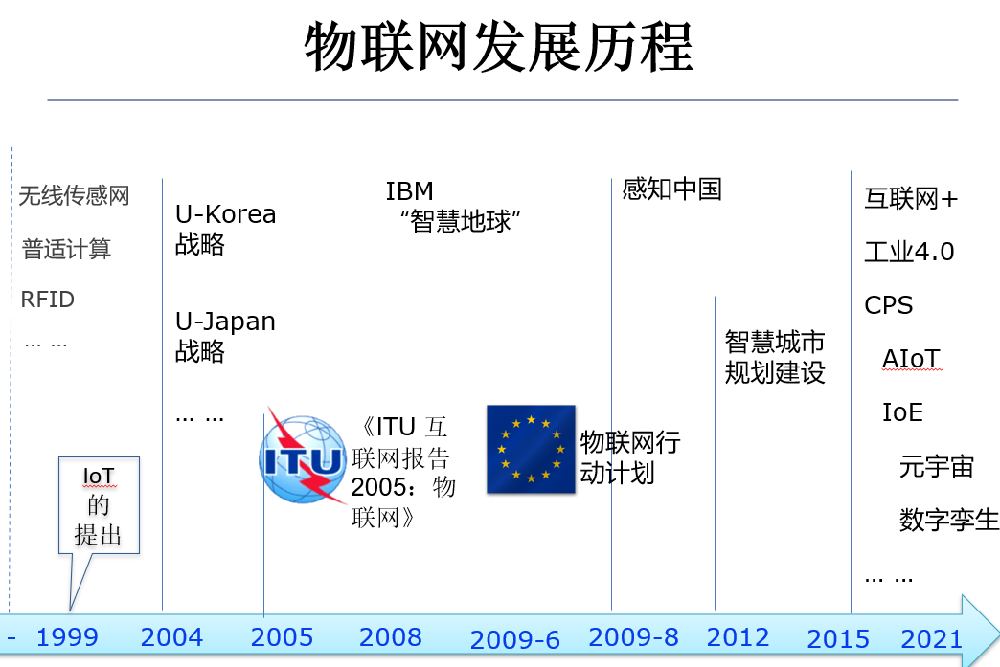

#### **IoT** **起源： 普适计算**

•1988年，Xerox PARC 研究中心的 Mark Weiser 提出普适计算的概念。

–1991年，在  *Scientific American* 上发表 “The Computer for the 21st Century” ，正式提出了普适计算 Ubiquitous Computing

–"The most profound technologies are those that disappear. They weave themselves into the fabric of everyday life until they are indistinguishable from it.”

•1999年，IBM也提出 Pervasive Computing的概念，即为无所不在的、随时随地可以进行计算的一种方式。强调计算资源普存于环境当中，人们可以随时随地获得需要的信息和服务。

•1999年，欧洲 ISTAG 提出了环境智能（Ambient Intelligence）的概念。提法不同，但是含义一致。

##### **普适计算的特点**：

- 当时的计算领域新浪潮，是多技术的融合，突破桌面计算的模式，将计算和互联技术普及到日常生活中
- 倡导发展可以广泛部署的微小计算设备，并与已有的互联网技术结合，实现移动、无缝、透明、泛在的计算服务，又称为不可见计算（Invisible Computing）
- 强调和环境融为一体的计算概念，计算机本身从人们的视线里消失。 能够在任何时间、任何地点、以任何方式进行信息的获取与处理
- 模式转变：（互联网）让人围绕着网络运行 à 让微小系统形成的网络围绕着人运转
- 然而，普适设备大多是已有计算系统的延伸和拓展，集聚化、智能化程度较低，而且服务对象主要是个体，缺乏突破性应用场景，未能大规模推广
- 将互联网推广到物理世界的一种初步尝试

#### **IoT** **起源：无线传感网（WSN: Wireless Sensor Network）**

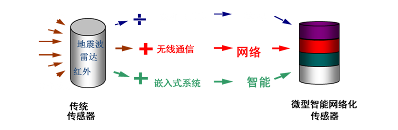

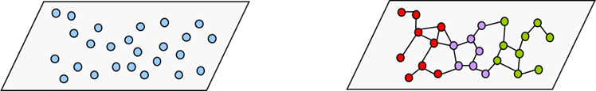

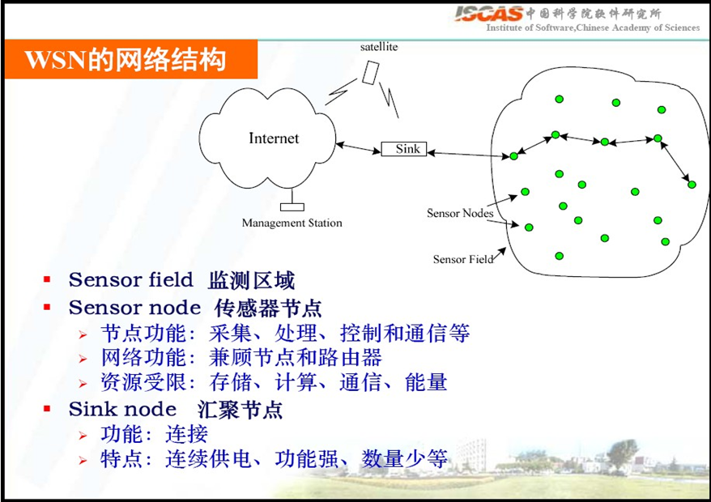

#### **物联网的起源和发展**

- 本世纪初，泛在网络 Ubiquitous Networks: 互联网和移动通信的融合与拓展
- 2006年，Cyber-Physical Systems (CPS) ：相比传感网系统，注重实现开放、可控、闭环的计算支持
- 2009年，美国工商业领袖“圆桌会议”，IBM提出“智慧地球”概念
- 2009年，“感知中国”战略启动
  - –前期：中科院、科工委、高校、中电等预研攻关
  - –传感器网络被列入国家重大科技计划三“新一代移动通信网络”
  - –初期行业应用，与运营商合作探讨三步走
  - –2019年被视为中国物联网元年，收到全社会关注
  - –物联网被正式列入国家五大新兴战略性产业之一
- 2016年，十三五规划建议提出实施“互联网+”行动计划
- …… ……

##### **物联网发展并提升至战略高度**

•《中华人民共和国国民经济和社会发展第十四个五年规划和2035年远景目标纲要》（2021年）要求，在信息领域重点发展云计算、大数据、物联网、工业互联网、区块链、人工智能（AI）、虚拟现实（VR） / 增强现实（AR）等七大产业。

•《物联网新型基础设施建设三年行动计划（2021—2023）》（2021年）提出，到2023年国内主要城市初步建成物联网新型基础设施。

物联网是一个**动态的全球网络化基础设施**，它具有基于标准和互操作通信协议的自组织能力，其中物理的和虚拟的“物”具有身份标识、物理属性、虚拟的特性和智能的接口，并与信息网络无缝整合。物联网将与媒体互联网、服务互联网和企业互联网一起，构成未来互联网。

#### **物联网过去、现在与发展**

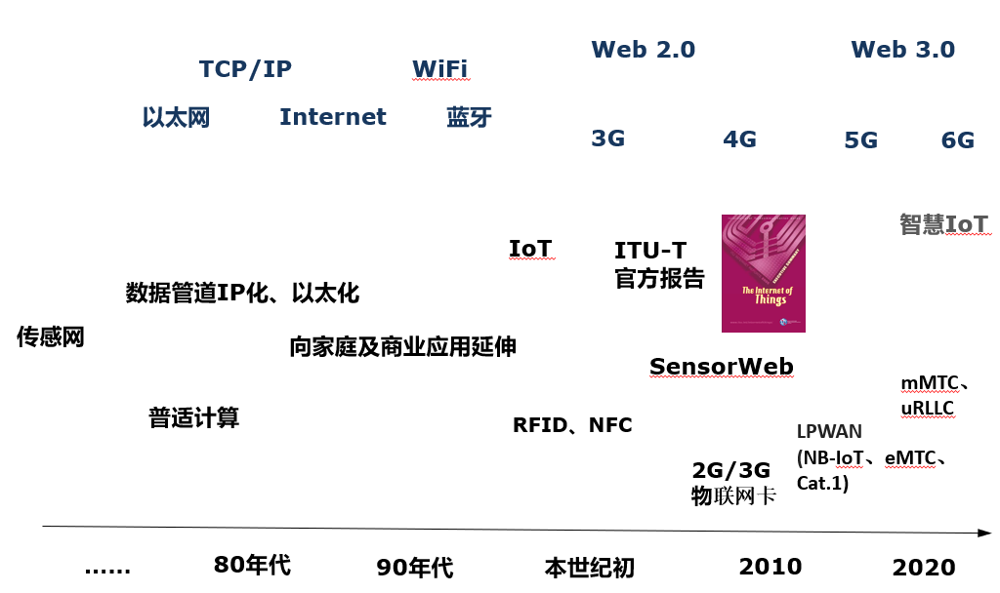

### 1.2**概念和特点**

#### **物联网概念**

- 1998，MIT的Kevin Ashton首次提及 Internet of Things
  - 将RFID技术与传感器技术应用于日常物品中将会创建一个“物联网”，这项技术将带来人们对机器理解的新纪
- 2003年，美国<技术评论>：传感网技术将是未来改变人们生活的十大技术之首。
- 2005,ITU发布《ITU互联网报告2005：物联网》
  - 物联网是通过RFID和智能计算等技术实现全世界设备互连的
- 2008，欧委会的CERP-IOT工程给出新的物联网定
  - 物联网是物理和数字世界融合的网络，每个物理实体都有一个数字的身份；物体具有上下文感知能力―他们可以感知、沟通与互动。他们对待物理事件进行即时反映，对物理实体的信息进行即时传送；使得实时作出决定成为可能
- 早期的维基百科
  - 所谓“物联网”（Internet of Things），指的是将各种信息传感设备，如射频识别（RFID）装置、红外感应器、全球定位系统、激光扫描器等种种装置与互联网结合起来而形成的一个巨大网络。

##### 物联网的其他定义

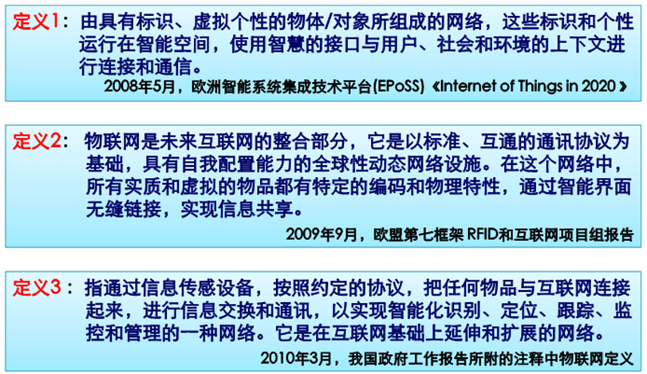

#### **物联网的系统化概念**

物联网的系统化概念由中国提出，整合了美国CPS (Cyber-Physical Systems)、欧盟 IoT（Internet of Things) 和 日本 U-Japan 等概念。是一个基于互联网、传统电信网等信息载体，让所有（能被独立寻址的）普通物理对象实现被感知和互联互通的网络。物理环境感知化、普通对象设备化、自治终端互联化和普适服务智能化是其重要特征。

#### IoT (Internet-of-Things)  物联网

**全面感知：利用传感器、RFID、卫星、微波，及其它各种感知设备随时随地采集各种动态对象，全面感知世界。**

**可靠传送：利用无线网、移动网、工控网等网络将感知的信息进行实时传送。**

**协同处理：对多维、多源信息进行融合处理，协同决策。**

**智能控制：对物体实现智能化的控制和管理，达到人与物的沟通。**

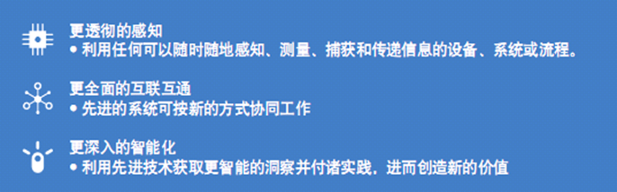

#### **物联网应用 **vs. 互联网应用

**互联网应用：**人们想要在互联网上了解某种信息，需要有人去收集、发布这个信息到互联网上，才可供人们浏览。人需要在环路中做大量工作，并难以动态了解其变化。

**物联网应用**：物联网通过各种感知设备，如射频识别、传感器、红外等，将信息传送到接收器，再通过互联网传送，通过高层应用进行信息处理，以实现远程监视、自动报警、控制、诊断和维护，进而实现“管理、控制、营运”的一体化。

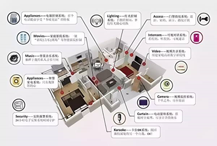

#### **几种网络概念之间的关系**

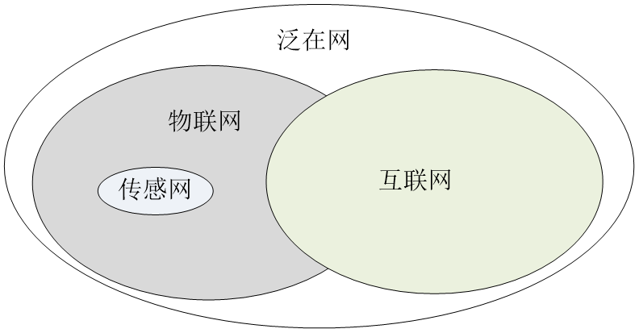

### 1.3**体系结构**

传感网（物联网）三层体系架构 （2007-2009）

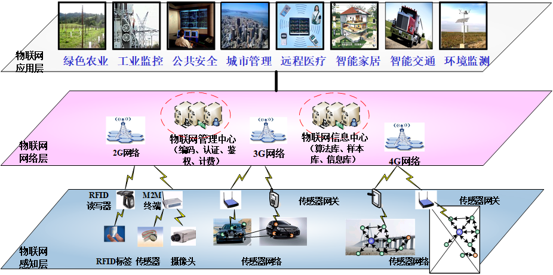

**物联网四层模型（例）**

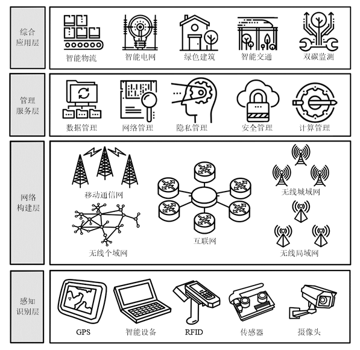

• **To be continued ...**