# **第二章 物联网感知识别**

## **2.1**  **自动识别**

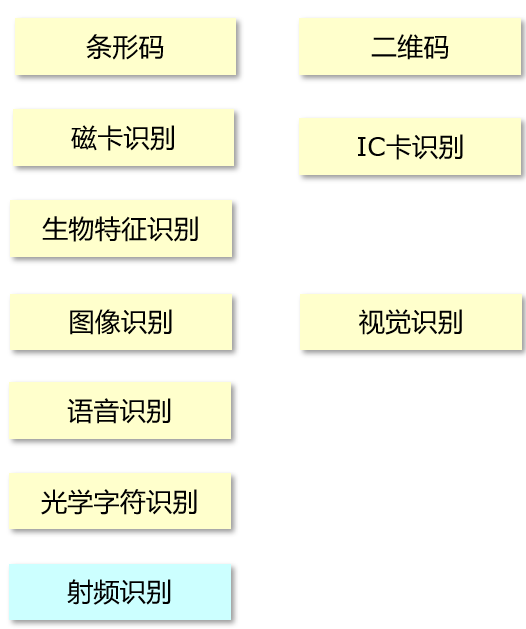

### **2.1.1** **自动识别技术概述**

**识别：对有关事务进行归类和定性**

**自动识别技术是一种机器自动数据采集技术**

- **应用一定的识别装置，自动地获取被识别物品的相关信息，并传递给后台进行数据处理**
- **自动识别是用机器来实现类似人对各种事物或现象的检测与分析，并做出辨识的过程**
- **需要：经验、标准、规则**

**自动识别技术标准组织**

- **国际自动识别制造商协会** **Association for Automatic Identification and Mobility,  AIM Global**
- **中国自动识别技术协会**  **AIM China**

#### 自动识别技术的分类

•**数据采集技术**

- **特点：需要特定的载体存放信息**
- **光存储识别 （条码识别、二维码识别、答题卡识别）**
- **磁存储识别（磁条、非接触磁卡、磁光存储识别）**
- **电存储识别（射频识别、IC卡识别）**

•**特征提取技术**

- **特点：根据事物本身的行为特征来判决信息**
- **静态特征 （指纹、虹膜、面部、光学字符识别** **OCR** **）**
- **动态特征 （语音、步态、表情）**
- **属性特征 （化学、物理、生物、联合感觉）**

#### 自动识别系统的构成

一般自动识别系统模型:

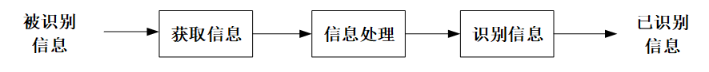

基于特征提取的自动识别系统模型

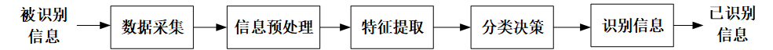

### **2.1.2** **条形码识别**

**最“古老”的自动识别技术**

**条形码是由一组规则排列的条、空以及对应的字符组成的标记。普通的条形码在使用过程中仅作为识别信息。**

**一个完整的条码的组成次序依次为：**

**左侧空白区（静区）、起始符、数据符、（中间分割符，主要用于EAN码）、（校验符）、终止符、右侧空白区（静区）**

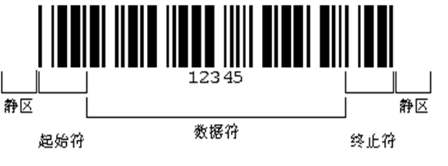

#### **条形码的分类**

按照长度： 定长、非定长条形码

依据排列方式： 连续型、非连续型条形码

按照扫描方式： 双向、单向条形码

按照单元模块方式： 宽窄调节码、模块组合码

一维条形码（条形码）、二维条形码（二维码）

#### **条形码：基本概念**

- **模块：构成条码的基本单位是模块，模块是指条码中最窄的条或空，模块的宽度通常以** **mm** **或** **mil（千分之一英寸）为单位。**
- **单元：构成条码的一个条或空称为一个单元，一个单元包含的模块数是由编码方式决定的，有些码制中，如** **EAN** **码，所有单元由一个或多个模块组成（模块组合法）；而另一些码制，如** **39** **码中，所有单元只有两种宽度，即宽单元和窄单元，其中的窄单元即为一个模块（宽度调节法）。** 
- **密度：单位长度的条码所表示的字符个数。模块尺寸越小，密度越大，所以密度值通常以模块尺寸的值来表示（如** **5 mil）。通常** **7.5 mil** **以下的条码称为高密度条码，15 mil** **以上的条码称为低密度条码。**
- **宽窄比：对于只有两种宽度单元的码制，宽单元与窄单元的比值称为宽窄比，一般为2-3左右（常用的有2：1，3：1）。宽窄比较大时，阅读设备更容易分辨宽单元和窄单元，因此比较容易阅读。**

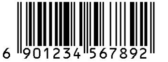

- **对比度（PCS）：条码符号的光学指标，PCS值越大则条码的光学特性越好。**
  -    **PCS＝(RL - RD) / RL** **× 100%** **（RL:条形码反射率，RD:空气反射率）**
- **条码长度：从条码起始符前缘到终止符后缘的长度。**
- **条码密度：单位长度的条码所表示的字符个数。**
- **双向条码：条码的两端都可以作为扫描起点的。**
- **中间分隔符：在条码符号中，位于两个相邻的条码符号之间且不代表任何信息的空。**
- **连续性条码：在条码字符中，两个相邻的条码字符之间没有中间分隔符的条码。**
- **非连续性条码：在条码字符中，两个相邻的条码字符之间存在中间分隔符的条码。**

#### **条形码的编码方法**

**宽度调节法**

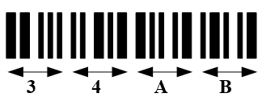

条形码中条与空的宽窄设置不同，用宽单元表示二进制的“1”，而用窄单元表示二进制的“0”，宽窄单元之比控制在2～3之间。印刷精度要求低。

**模块组合法 / 色度调节法**

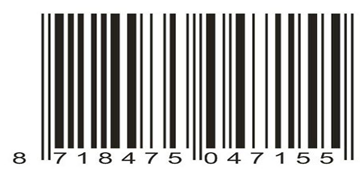

条形码符号中，条与空是由标准宽度的模块组成的。一个标准宽度的条模块表示二进制的“1”，而一个标准宽度的空模块表示二进制的“0”。印刷精度要求高。

##### **EAN-13** **条形码**  **（模块组合法、非连续）**

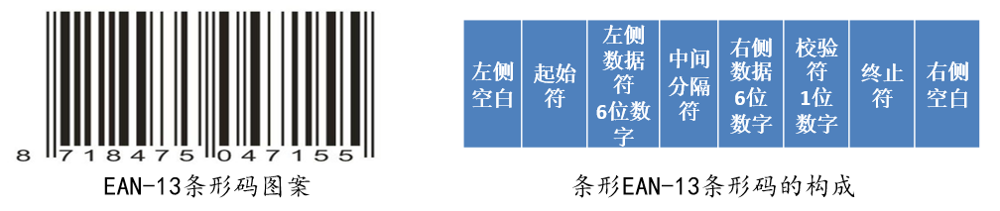

起始部分: 由11条线组成，从左到右依次为8条白线、1条黑线、1条白线、1条黑线

第一数据部分: 由42条线组成，按照一定算法形成，包含了左侧数据符（d1～d6）的信息

中间部分: 由5条线组成，从左到右依次为1条白线、1条黑线、1条白线、1条黑线、1条白线

第二数据部分: 由42条线组成，和第一数据部分一样由一定算法形成，包含右侧数据符（d7～d12）数字的信息

结尾部分: 由11条线组成，从左至右分别是1条黑线、1条白线、1条黑线、8条白线

##### 25码 （宽度调节法、连续）

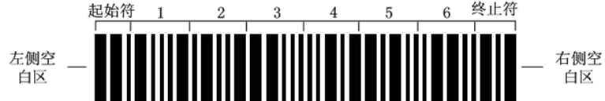

##### 39码 （宽度调节法、连续）

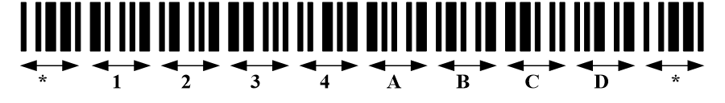

##### **UPC** **条形码**

Universal Product Code

UPC-A 码 

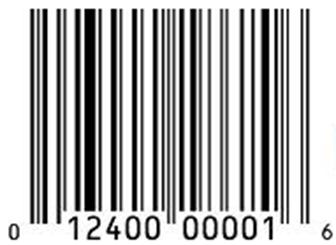

UPC-E 码

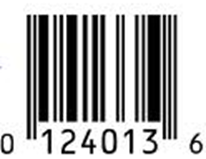

##### **ISBN / ISSN**

国际标准书号  International Standard Book Number

国际标准连续出版物号 International Standard Serial Number

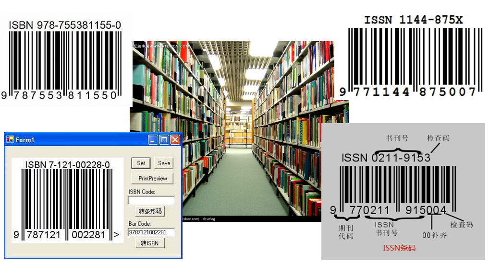

**ISBN** **号包含的信息**:

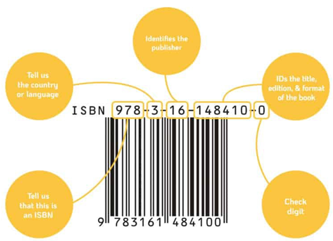

978 表示用于 ISBN 	国家 / 语言  	出版商 	  图书编号	   检查码

##### **EAN（欧洲商品编号）条形码**

UPC超集

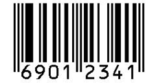

UCC/EAN-128码（连续型、非定长）

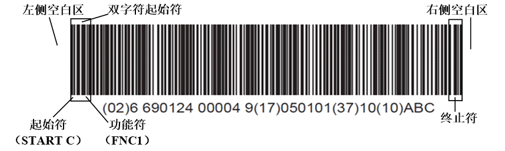

#### **条形码阅读器工作原理：** **扫描** **+** **译码**

**激光扫描仪通过一个激光二极管发出一束光线，照射到一个旋转的棱镜或来回摆动的镜子上，反射后的光线穿过阅读窗照射到条码表面，光线经过条或空的反射后返回阅读器，由一个镜子进行采集、聚焦，通过光电转换器转换成电信号，该信号将通过扫描期或终端上的译码软件进行译码。**

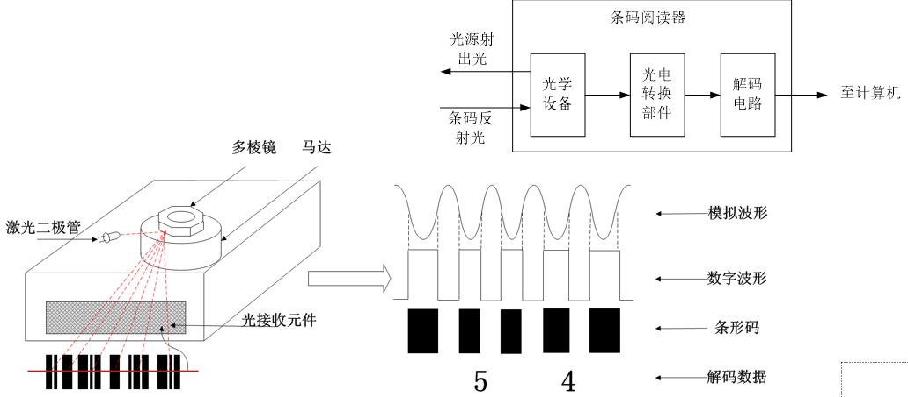

##### **条形码阅读器产品和应用**

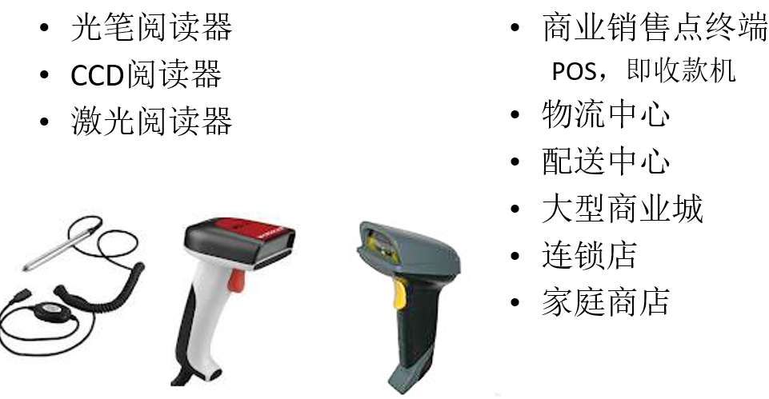

#### **典型条形码制比较**

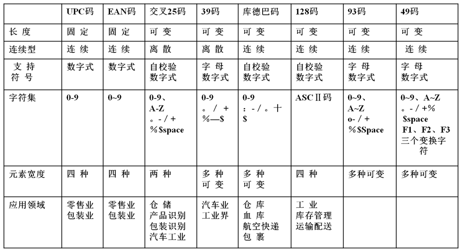

### **2.1.3** **二维码**

- **二维码利用某种特定的几何图形按一定规律在平面（二维方向上）分布的黑白相间的图形记录数据符号信息；**
- **在代码编制上，使用若干个与** **0、1** **二进制相对应的几何形体来表示文字数值信息，通过图象输入设备或光电扫描设备自动识读以实现信息自动处理。**
- **二维码具有条码技术的一些共性：**
  - **每种码制有其特定的字符集**
  - **每个字符占有一定的宽度**
  - **具有一定的校验功能等**
- **同时还具有对不同行的信息自动识别功能、以及处理图形旋转变化等特点。**

#### **二维码符号**

•**目前，世界上应用最多的二维码符号有Aztec Code、PDF147、Data Matrix、QR Code、Code16K** **等。**

**国际自动识别制造商协会（AIM）**

**美国标准化协会（ANSI）**

**ISO/IEC**

**中国物品编码中心**

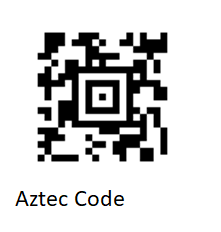

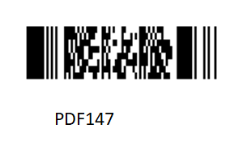

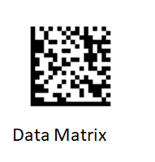

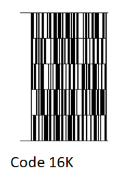

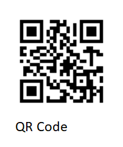

#### **二维码的分类**

§**行排式**

- **又称堆积式或层叠式二维码，是在一维条形码的基础上按需要将其堆积成多行而成**
- **PDF417、49码、Code 16K** **条码**

§**矩阵式**

- **用点阵表示二进制** **0/1** **的序列**
- **Code One、QR码、Data Matrix、Vericode、田字码、汉信码、龙贝码**

§**邮政码**

- **通过不同高度的条进行编码，主要用于邮政编码**
- **Postnet、BPO 4-State**

§**彩码**

- **在传统二维码的基础上添加色彩元素而形成，也称为三维码**

§**复合码**

- **各种条码类型的组合**
- **EAN.UCC：一维码对主要标识、二维码对附加数据如批号、有效期等编码**

##### **PDF417码：行排式二维码** **Portable Data** **File**

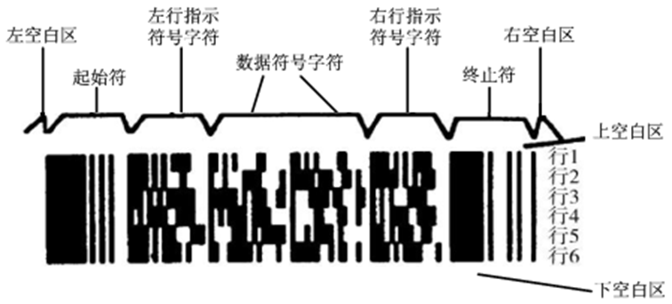

PDF417条形码中每个数据字符包括4个条和4个空，每个条或空由1～6个模块组成，一个数据字符中，4个条和4个空的总模块数为17，故名PDF417

##### **QR** **码：矩阵式二维码**

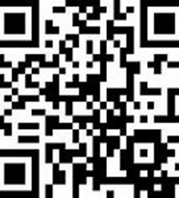

- **快速响应矩阵（Quick Response Code, QR）**
- **国标：GB/T 18284 - 2000**
- **使用最为广泛的二维码**
- **超高速识读、全方位识读、高效表示汉字**

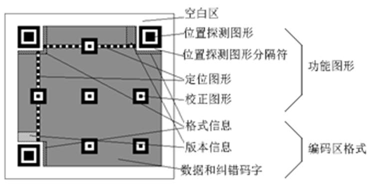

##### **QR** **码符号版本**

**QR** **码符号共有40种版本**

- **版本1：21 x 21**
- **版本2：25 x 25**
- **每个版本增加4个模块**
- **版本40：177 x** **177**

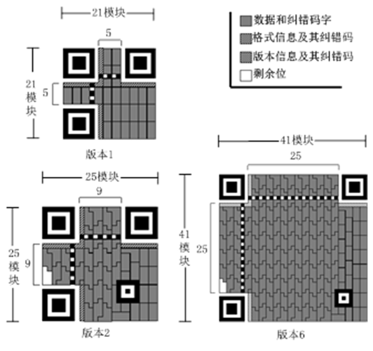

##### **汉信码：矩阵式二维码**

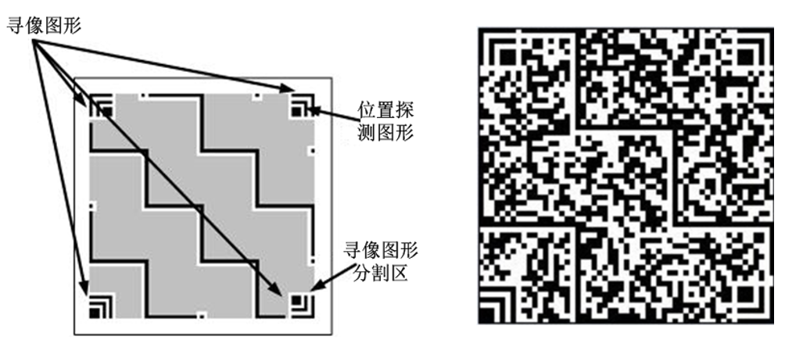

##### **彩码**

#### **二维码的生成过程**

- **数据分析**
- **数据编码**
- **纠错**
- **构造最终信息**
- **在矩阵中布置模块**
- **掩模**
- **添加格式信息和版本信息**

#### **一维条形码与二维码的比较**

- **一维条形码特点：**
  - **可直接显示内容为英文、数字、简单符号；**
  - **贮存数据不多，主要依靠计算机中的关联数据库；**
  - **保密性能不高；**
  - **损污后可读性差。**
- **二维码特点：**
  - **可直接显示英文、中文、数字、符号、图形；**
  - **贮存数据量大，可存放1K字符，可用扫描仪直接读取内容，无需另接数据库；**
  - **保密性高（可加密）；**
  - **安全级别最高时，损污50%仍可读取完整信息。**

#### **QR 码结构图**

**QR 码由编码区域和包括寻像图形、分隔符、定位图形和校正图形在内的功能图形组成。**

**QR 码结构图如下图所示：** 

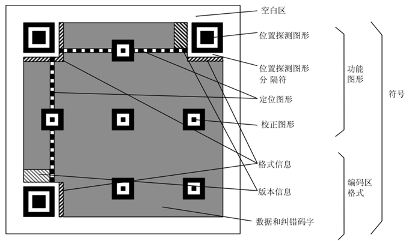

> **二维码的特点：**
>
> - **存储大容量信息**
> - **在小空间内打印**
> - **有效表现各种字母**
> - **对变脏和破损的纠错能力强**
> - **从任意方向读取**
> - **可以数据分割与合并**

#### **二维码识别原理**

**定位校正图形：**

**根据 3 个位置探测图像估计右下角校正符，共同定位该图形。**

**透视变换：**

**根据 3 个定位中心点和校正符中心点，和理想 4 个点的坐标，获取单应性矩阵，再通过透视变换获取标准正方形图像。**

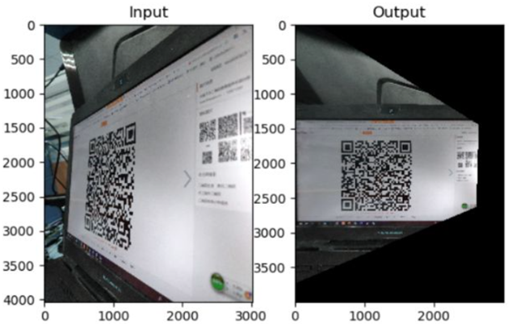

**译码和纠错**：**译码是对二维码版本信息、格式信息、数据和纠错码进行解码和对比。将数据区转为0和1的比特流，并用Reed-Solomon纠错算法对比特流校验和纠错。判断QR码编码格式后译码，这样得到了二维码包含的数据。**

**常规的QR码识别过程容易受到环境影响而难以识别，往往需要一些预处理改善图像质量和识别环境。**

**图像灰度化**

**去噪**

**畸变矫正**

**二值化**

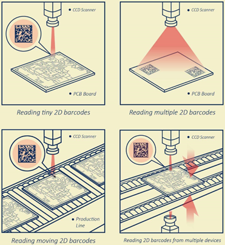

#### **常见的工业领域应用问题**

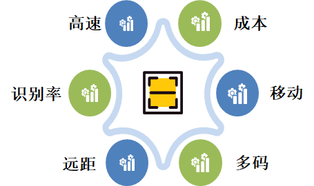

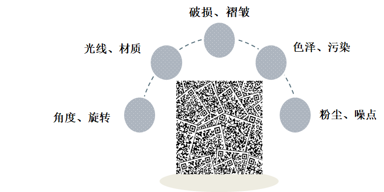

#### **二维码检测定位技术（例）**

**更高的检测精度、复杂环境应用、防止图像失真、具有鲁棒性**

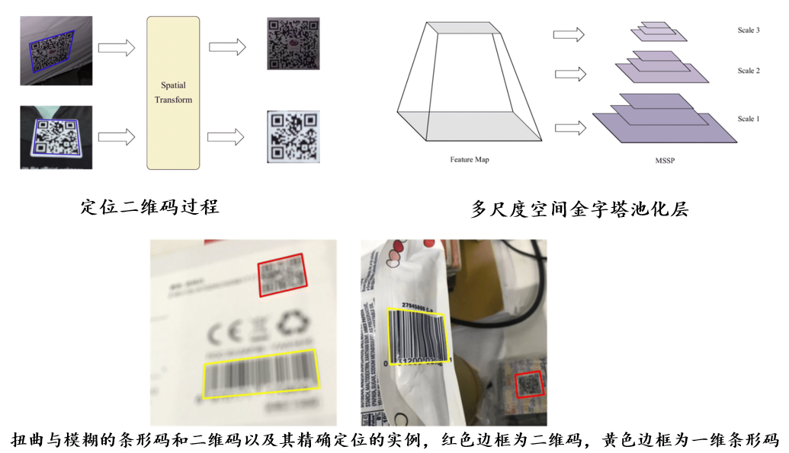

### **2.1.3  IC卡识别**

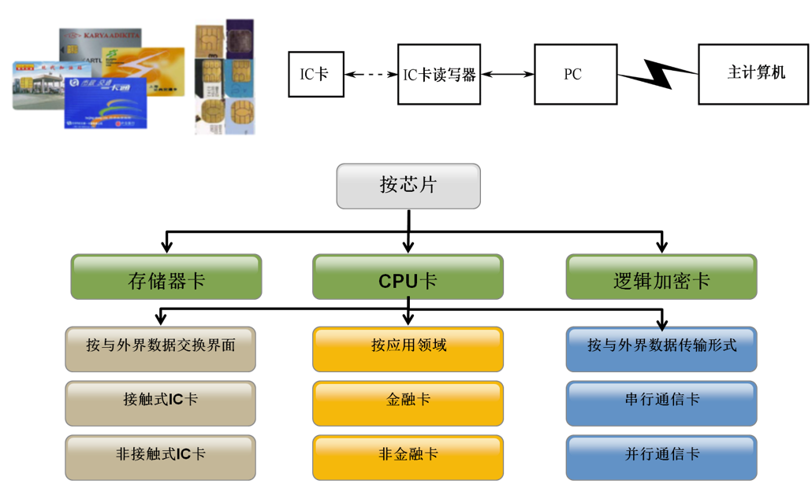

#### **CPU卡： 按与外界数据交换界面**

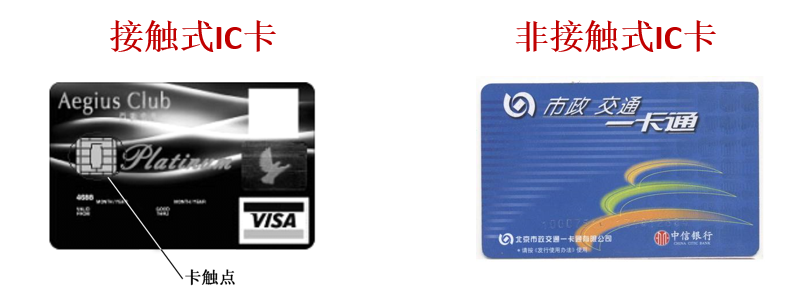

接触式IC卡的多个金属触点为卡芯片与外界的信息传输媒介，成本低，实施相对简便；非接触式IC卡则不用触点，而是借助无线收发传送信息，因此在前者难以胜任的交通运输等诸多场合有较多应用。

### **2.1.4**  **光学字符识别**

光学字符识别（optical character recognition，OCR）： 采用电子设备（如扫描仪或数码相机）检查纸上打印的字符，通过检测暗亮的模式确定其形状，然后用字符识别方法将形状翻译成计算机文字的过程，即对文本资料进行扫描，然后对图像文件进行分析处理，获取文字及版面信息的过程。

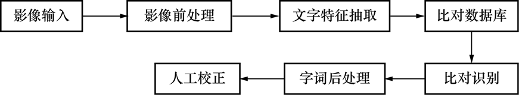

### **2.1.5** **语音识别**

语音识别：采用数字信号处理技术自动提取及决定语言信号中最基本有意义的信息，同时也包括利用音律特征等个人特征识别说话人。

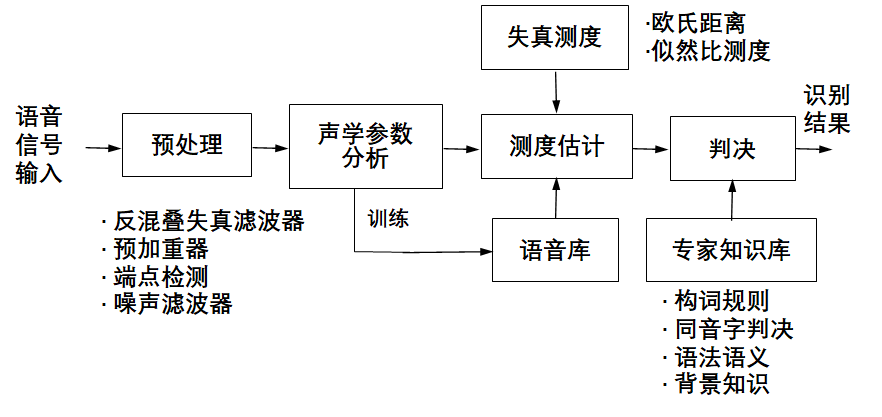

### **2.1.6** **生物特征识别**

概念：

 通过计算机与光学、声学、生物传感器和生物统计学原理等高科技手段密切结合，利用人体固有的生理特性（如指纹、指静脉、人脸、虹膜等）和行为特征（如笔迹、声音、步态等）来进行个人身份的鉴定

分类：

- 指纹识别
- 掌纹识别
- 静脉识别
- 虹膜识别
- 人脸识别
- 声音识别

#### **指纹识别**

从实用角度看，指纹识别是优于其他生物识别技术的身份鉴别方法。因为指纹具有各不相同、终生基本不变的特点，且目前的指纹识别系统已达到操作方便、准确可靠、价格适中的阶段，正逐步应用于民用市场。

指纹识别的处理流程：

–通过特殊的光电转换设备和计算机图像处理技术，对活体指纹进行采集、分析和比对，可以迅速、准确地鉴别出个人身份。系统一般主要包括对指纹图像采集、指纹图像处理、特征提取、特征值的比对与匹配等过程。

##### **指纹的总体特征**

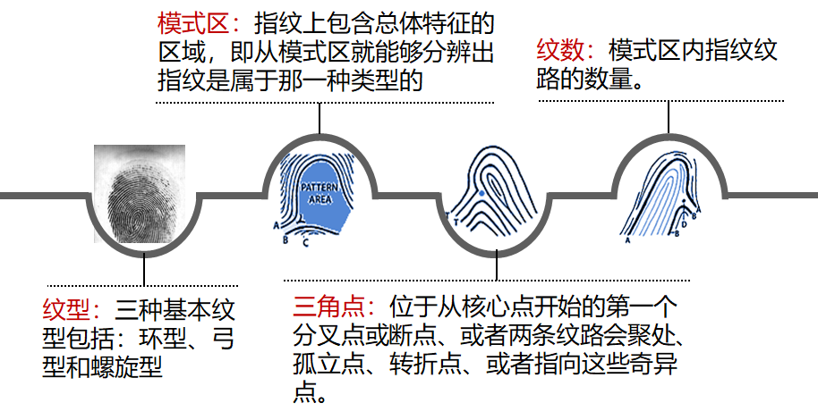

#### **静脉识别**

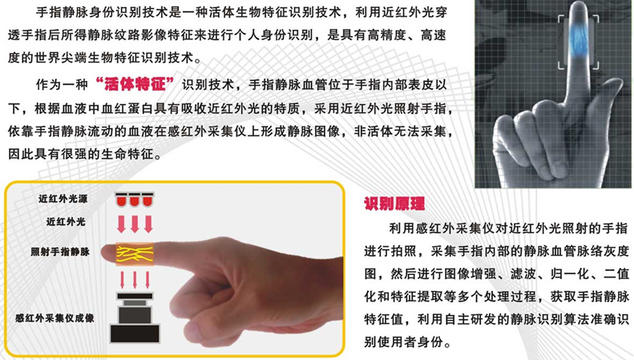

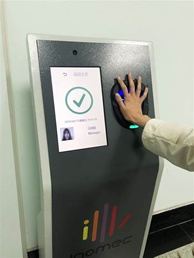

#### **虹膜识别**

•**虹膜识别是当前应用最方便精确的生物识别技术，虹膜的高度独特性和稳定性是其用于身份鉴别的基础。**

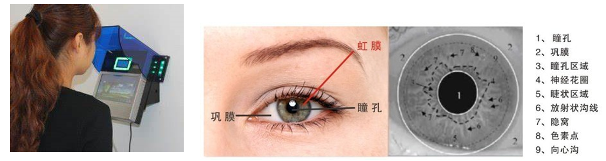

##### **虹膜识别的高识别率**

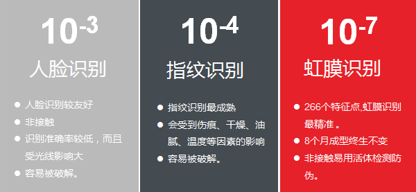

**虹膜识别的特点：**

- **生物活性:** **虹膜处在巩膜的保护下，生物活性强。**
- **非接触性:** **无需用户接触设备，对人身没有侵犯。**
- **唯一性:**  **形态完全相同虹膜的可能性低于其他组织。**
- **稳定性:**  **虹膜定型后终身不变，一般疾病不会对虹膜组织造成损伤。**
- **防伪性:** **不可能在对视觉无严重影响的情况下用外科手术改变虹膜特征。**
- **识别率极高，仅次于DNA识别。**

#### **人脸识别**

人脸识别（human face recognition）是基于人的面部特征信息进行身份识别。其准确性要低于虹膜、指纹识别，但它具有非强制性、非接触性、操作简单、隐蔽性好等特点，因此成为最容易被接受的生物特征识别方式。

人脸识别过程：

- 建立人脸的面像档案：制作面像文件，并生成面纹编码进行存储
- 获取当前的人体面像，并以此生成面纹编码
- 用当前的面纹编码与档案库存中的面纹编码进行检索对比 

##### **人脸识别涉及到的技术模块**

**人脸检测**

在动态场景、复杂背景中判断是否存在面像，并分离出面像。

- 参考模板法、人脸规则法、样品学习法、肤色模型法、特征脸法 

**人脸跟踪**

在检测之后，在后续帧中继续捕获人脸的运动轨迹及大小变化。

- 基于模型跟踪、运动信息跟踪、人脸局部特征跟踪、神经网络跟踪

**人脸比对** 

对被检测到的面像进行身份确认，即在面像库中进行目标检索，找出最佳匹配。面像的描述决定了面像识别的具体方法与性能。

- 特征向量、面纹模板

##### **人脸识别的特征提取**

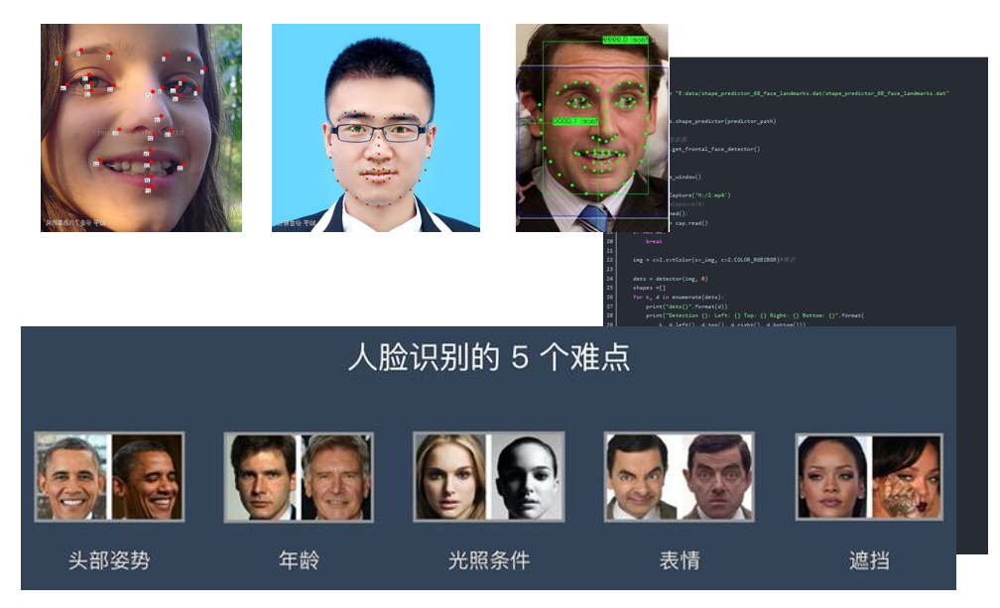

#### **声音识别**

通过对采集到的语音信号进行分析和处理，提取相应的特征以识别说话人的身份。

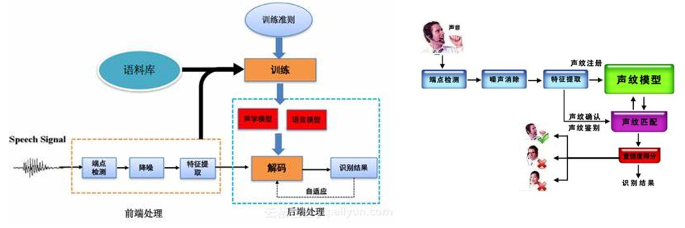

### **2.1.7** **图像识别、机器视觉**

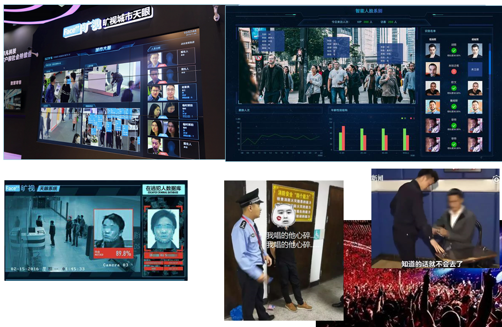