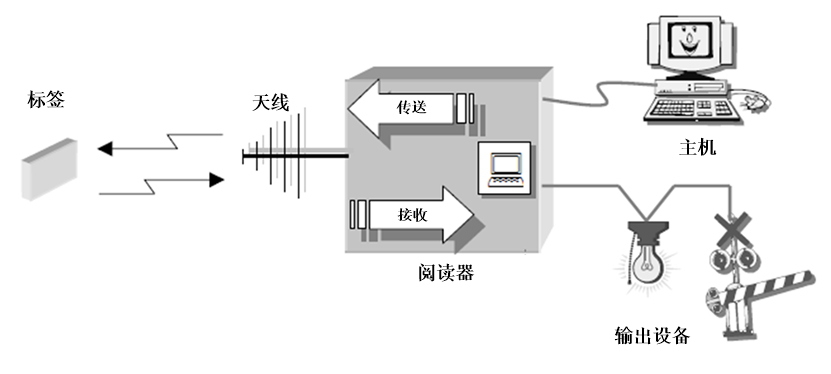
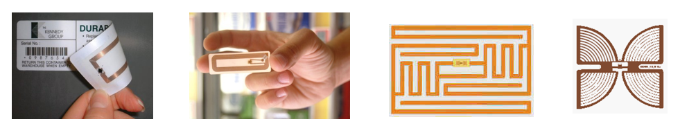

# **第二章 物联网感知识别**

## **2.2** **RFID**

RFID是射频识别技术（Radio Frequency Identification）的英文缩写，利用射频信号通过空间耦合（交变磁场或电磁场）实现无接触信息传递并通过所传递的信息达到识别目的。

它是上世纪90年代兴起的自动识别技术，首先在欧洲市场上得以使用，随后在世界范围内普及。

RFID较其它技术明显的优点是电子标签和阅读器无需接触便可完成识别。射频识别技术改变了条形码依靠“有形”的一维或二维几何图案来提供信息的方式，通过芯片来提供存储在其中的数量巨大的“无形”信息。

### **RFID** **系统组成**

RFID系统主要由电子标签、阅读器、中间件和位于后台的中央信息系统组成 

### **RFID系统工作原理**

RFID系统工作原理

标签进入磁场后，只要接收到阅读器发出的射频信号，就能产生感应电流获得能量，然后发送出存储在芯片中的信息，或者是主动发送信号（限于有源标签），阅读器读取标签信息，进行解码后送至后台的中央信息系统进行数据处理。

RFID 的两种耦合方式：电感耦合、电磁反向散射耦合

电子标签与阅读器之间通过耦合元件实现射频信号的非接触的空间耦合，从而根据时序关系，实现能量、数据的交换

### **RFID** **设备基本组件**

RFID 设备的基本组件构成

- 阅读器 (Reader)
- 天线 (Antenna)
- 标签 (Tag)

#### **RFID** **组件：阅读器**

阅读器：读取或读写电子标签信息的设备。主要任务是控制射频模块向标签发射信号，并接收标签的应答，对标签的对象识别信息及其它信息进行解码，传输到后台主机以供处理。

因其工作模式一般是主动向标签询问标识信息，所以又被称为询问器（Interrogator）。

固定式阅读器通过有线接口、手持式阅读器通过无线接口，同后台主机相连。

#### **RFID** **组件：天线**

天线：在标签和阅读器之间传递射频信号。阅读器可以连接一个或多个天线。

RFID系统的工作频率从低频到微波，这使得天线与标签芯片之间的匹配问题变得很复杂。

#### **RFID** **组件：标签**

标签（Tag）：由微型天线、耦合元件、芯片组成。芯片内保存有一定格式的电子数据，每个标签内部存有唯一的电子编码，作为标识性信息的数据载体，可附着在物体上用于标识目标对象。

标签进入 RFID 阅读器扫描场以后，接收到阅读器发出的射频信号，凭借感应电流获得的能量发送出存储在芯片中的电子编码（被动式标签），或者主动发送某一频率的信号（主动式标签）。

##### **标签分类**：

- 被动式标签（Passive Tag）：因内部没有电源设备又被称为无源标签。被动式标签内部的集成电路通过接收由阅读器发出的电磁波进行驱动，向阅读器发送数据。
- 主动标签（Active Tag）：因标签内部携带电源又被称为有源标签。主动式标签要比被动式标签体积大、价格昂贵。但主动标签通信距离更远，可达数十米。
- 半主动标签（Semi-active Tag）：兼有被动标签和主动标签的所有优点，内部携带电池，能够为标签内部计算提供电源。
  - 这种标签可以携带传感器，可用于检测环境参数，如温度、湿度、是否移动等。
  - 然而与主动式标签不同的是它们的通信并不需要电池提供能量，而是像被动式标签一样通过阅读器发射的电磁波获取通信能量

### **RFID技术分析：频率**

频率是RFID系统的一个很重要的参数，它决定了系统工作原理、通信距离、成本、天线形状和应用领域等因素。

RFID典型的工作频率有125KHz、133KHz、13.56MHz、27.12MHz、433MHz、860-960MHz、2.45GHz、5.8GHz等。按照工作频率的不同，RFID系统集中在低频、高频和超高频三个区域。

#### **标签分类：按** **RFID** **频率**

#### **阅读器及标签分类**

### 阅读器操作规范

**为保证阅读器的性能满足应用需求，在阅读器的使用过程中通常要遵循相应的操作规范。**

**在操作规范中，下面几点是选择使用阅读器时需要重点考虑的方面：**

#### 阅读器组成

### 标签操作规范

**与阅读器类似，在实际系统中，标签的操作规范也要考虑很多因素，下面几个是需要重点考虑的：**

#### 标签组成

### 标签天线

**天线是一种专门设计用来耦合、辐射电磁能量的导体结构。**

**通常标签天线尺寸越小，天线辐射阻抗越小，标签工作距离越短，工作效率越低。**

**天线性能包括方向特性、天线效率、天线增益等。**

**根据工作原理不同，可以将标签天线分为三类：**

### 标签芯片

**可分为：模拟前端、控制部件和存储部件**

**模拟前端：整流天线输入信号提供稳定电压、将天线输入检波得到数字信号、调制控制部件发送信号给天线发送、为控制模块提供时钟。**

**控制部件：数据解码、数据校验、数据编码、加密解密、防碰撞、读写控制。**

**存储部件：标签数据载体。**

### 标签制造

**标签的制作工艺主要有：**

**线圈绕制法、化学蚀刻法和印刷法**

**制造过程分为：**

**天线制造和芯片组装**

#### **声表面波电子标签结构**

**声表面波**

–**Surface Acoustic Wave**

–**SAW**

#### **RFID** **中间件**

RFID 中间件的主要功能

- 对读写器或数据采集设备的管理、协同、控制
- 数据过滤与数据处理
- 事件数据报告生成与发送
- 访问安全控制
- 发布/订阅模型
- 提供符合标准的接口、集中统一的管理界面
- 进程管理与负载均衡
- 数据路由与集成

#### **RFID** **标签的存储结构**

#### **RFID系统组件原理小结**

### EPCglobal 的 RFID 体系架构

### **RFID标签与条形码相比的优点**

**体积小且形状多样：RFID标签在读取上并不受尺寸大小与形状限制，不需要为了读取精度而配合纸张的固定尺寸和印刷品质。**

**环境适应性：纸张容易被污染而影响识别。但RFID对水、油等物质却有极强的抗污性。另外，即使在黑暗的环境中，RFID标签也能够被读取。**

**可重复使用：标签具有读写功能，电子数据可被反复覆盖，因此可以被回收而重复使用。**

**穿透性强：标签在被纸张、木材和塑料等非金属或非透明的材质包裹的情况下也可以进行穿透性通讯。**

**数据安全性：标签内的数据通过循环冗余校验的方法来保证标签发送的数据准确性。**

### **RFID和物联网**

基于RFID标签对物体的唯一标识特性，引发了物联网初期的应用场景和热潮。

通过给物品贴上RFID标签，在现有互联网基础之上构建所有参与流通的物品信息网络。

通过RFID接入物联网，世界上任何物品都可以随时随地按需被标识、追踪和监控。

RFID和物联网的建立将对生产制造、销售、运输、使用、回收等物品流通的各个环节以及政府、企业和个人行为带来深刻影响。

### **RFID的标签识别协议**

**RFID系统支持多目标识别，在多个阅读器和多个电子标签同时工作的情况下，会造成阅读器和电子标签之间的相互干扰，无法读取信息，这种现象称为冲突（或碰撞、干扰）。**

**RFID系统中，主要存在以下两种类型的信号干扰：**标签冲突、阅读器冲突

**因此，需要降低阅读器之间以及标签之间的冲突来提高对标签的识别效率。**

#### **RFID系统的防冲突（防碰撞）技术**

- **空分多址法**
  - **按空间区域进行划分**
    - **读写器和天线的作用距离**
  - **相控阵天线**
    - **天线的方向**
- **频分多址法**
  - **不同载波频率**
    - **副载波**
- **时分多址法**
  - **ALOHA算法**
  - **基于二进制算法（确定性算法）**

**针对阅读器之间的冲突问题，存在一些典型的防冲突协议：**

**与阅读器相比，标签受硬件资源限制，存储能力和计算能力很有限。这使得标签没有冲突检测功能，标签之间不能相互的通信，所有的冲突检测都需要借助于阅读器完成。从系统的复杂度以及成本方面考虑，TDMA** **可用于检测** **RFID** **标签之间的冲突。**

#### **基于纯** **ALOHA** **的防冲突算法**

**算法简单，易于实现，但信道利用率仅为** **18.4%，性能差。**

#### **基于时隙** **ALOHA** **的防冲突算法**

**S-ALOHA** **算法将纯** **ALOHA** **的时间分为若干时隙，每个时隙大于或等于标签标识符发送的时间长度，并且每个标签只能在时隙开始时刻发送标识符。由于系统进行了时间同步，S‐ALOHA** **协议的信道利用率达到36.8%，是纯** **ALOHA** **的两倍。**

#### **基于帧的时隙** **ALOHA** **(FSA)** **防冲突算法**

**1、每一帧开始时，阅读器广播帧长度** **f（时隙个数），并激活所有标签。**

**各个标签在接收 f 以后随机在0 ~ ( f – 1 ) 中选择一个整数，作为其发送标识符的时隙序号 SN，并存于其寄存器内。**

**2、阅读器通过时隙开始命令启动一个新时隙。对每个标签而言：**

**如果 SN = 0 则立即发送标识符；否则就不发送并且设 SN = SN – 1 。**

**若标签发送成功即无冲突发生，则立即休眠即不再活动；否则，该标签进入等待，在下一帧中再选择一个时隙重新发送标识符。**

**3、重复此过程，直到阅读器在某一帧中没有收到标签信号，即标签均被识别**

**例：帧长** **f = 3，每个标签产生** **0 ~ 2** **的随机数**

**冲突时隙：不止一个标签响应**  **（响应标签#** **> 1）**

**单 时 隙：只有一个标签响应**    **（响应标签#**  **= 1）**

**空 时 隙：没有标签响应**           **（响应标签#**  **= 0）**

> **FSA** **算法的优点在于逻辑简单，电路设计简单，所需内存少，且在帧内只随机发送一次，这样能够更进一步降低了冲突的概率。**
>
> **FSA** **成为** **RFID** **系统中最常用的一种基于** **ALOHA** **的防冲突算法**

**FSA** **算法局限性：**

   **帧的长度** **L** **固定（标签数** **n** **动态变化）**

- **当标签数远小于帧长度：时隙会巨大浪费，识别时间也会增加**
- **当标签数远大于帧长度：标签冲突概率增大，识别标签的时间会极大地增加**
- **当帧长度等于标签的数目（L = n）时，FSA** **才能获得最佳的识别性能。**

#### **FSA +** **帧长调整**    ->**Q** **算法**

**实际中标签的数量是未知的，并且动态变化。**

**动态自适应设置帧长度的算法可以解决** **FSA** **的局限性。**

**常见的帧长调整方法：**

**方法一：根据前一帧通信获取的空时隙数目，发生碰撞的时隙数目、成功识别标签的时隙数目，来估计当前的标签数并设置下一帧的最优长度；** **（ISO/IEC 18000-6** **中** **Type A** **标准）**

**方法二：根据前一时隙的反馈，动态调整帧长为** **2** **的整数倍，最具代表性的是** **EPCglobalGen2** **标准中的** **Q** **算法** **（ISO/IEC 18000-6** **中** **Type C** **标准）**

- **当一个帧出现过多的冲突时隙时，阅读器会提前结束该帧，并重新启动一个更长的帧；**
- **当一个帧出现过多的空闲时隙时，阅读器也会提前结束帧，并重新启动一个更短的帧**

> **Q** **算法过程**：
>
> 
>
> - **用** **Q** **值标记** **FSA** **中帧长** **2Q** **，Q** **值取值范围** **0 ~ 15，作为** **Query** **命令参数。**
> - **Qfp** **作为** **Q** **的浮点表示形式，初始值为** **4.0。**
> - **常量** **c** **是** **Q** **的浮动因子，取值为** **0.1 ~ 0.5。**
> - **reader** **广播帧长：** **帧开始命令Query** **中包含了** **Q值** **(帧长** **2Q** **)。**
> - **tag** **选时隙：非休眠的标签收到** **Query** **时，随机产生** **0 ~ 2Q-1** **并存入寄存器SN** **，每过一时隙减一。**
> - **当** **SN** **减至** **0** **则向阅读器回复。**
> - **reader** **根据前一个时隙的回复情况来更改** **Qfp** 
>   - **如没有标签回复：Qfp** **减去** **c**  
>   - **如多个标签回复：Qfp** **加上** **c** 
>   - **如一个标签回复：Qfp** **不变** 
> - **根据** **Q = round(Qfp)** **是否变化，决定是继续该帧还是重新开启新帧。**
>
> **Q** **算法自适应地调整帧长为** **2Q** **，识别效率高，该算法以及改进算法在超高频射频识别系统中得到广泛的应用。**

#### **基于** **ALOHA** **算法的不足**

- ##### **基于** **ALOHA** **的防冲突算法简单，并且兼顾了公平性。**

- **但是，标签存在饿死的问题。当一个标签选择的时隙总是冲突时隙，则该标签可能永远无法被识别。**

**确定性算法可解决上述问题。**

**基于确定性二进制的防冲突算法**

- **BSA** **二进制搜索算法、FBSA** **动态二进制搜索算法、基于查询二进制树**
- **特点：**
  - **无状态协议，标签只需要根据阅读器广播的标示符作比较，可用于无可写存储区的标签**
  - **不存在标签饿死**
  - **识别时延受标签ID分布及长度影响**

**基于随机二进制树的防冲突算法**

- **自适应** **B** **树算法**
  - **状态协议，标签需要可写存储区**
  - **仍有可能存在标签饿死**
  - **识别时延受标签ID分布及长度影响**

#### **二进制搜索算法**  **BSA**

**算法原理**

- **标签** **SN：每个标签具有自身唯一的序号SN（假设序号长度一致）。**
- **每一轮选择：阅读器多次向标签群发送命令，每次命令都会把标签群分成两组，多次分组，最后得到此轮唯一的一个标签。**
- **对剩余的标签群继续上述操作。每轮选中一个标签，直至选完所有标签。**

**算法基本命令**

- **请求** **Request (SN)：携带一个参数** **SN，当标签收到该命令时，将自身的** **SN** **与收到的** **SN** **对比，若自身** **SN** **小于或等于收到的** **SN，则向阅读器回复标签SN。**
- **休眠** **Sleep (SN)：携带一个参数** **SN，若标签自身的** **SN** **与收到的** **SN** **相等，则被阅读器选中，完成数据传送后，进入休眠状态。**

##### **BSA** **算法步骤**：

**阅读器发出请求序列号** **SN，属于** **{ tag |** **SNtag** **<= SN}** **的标签回复自身序列号**

1.**阅读器第一次发送请求Request命令；参数设为最大序列号（11 … 11），因此所有标签向阅读器回复自身。**

2.**当存在两个以上的标签同时回复阅读器时，必然发生碰撞，设这些标签序列号出现不一致的最高位为** **C（碰撞位），阅读器更新自身序列号：第** **C** **位置0，高于该位的置为这些标签序列号相同的前** **C - 1** **位，低于该位的置** **1。阅读器发送Request命令，参数采用新序列号。**

3.**标签接收到新一轮的请求序列号， 只有序列号小于或等于此序列号的标签，才向阅读器回复自身序列号。**

4.**循环执行** **2 - 3，依次排除序列号较大的标签，选出一个序列号最小的标签；阅读器与此标签通信，结束后发送休眠** **Sleep** **命令使其休眠，即对阅读器发送的请求命令不进行响应。**

**重复上述过程，可以按照序列号从小到大的次序，完成所有标签的识别和读取。**

#### **动态二进制搜索算法** **FBSA**

传统二进制搜索算法，每次传输的数据是全部长度的序列号，造成了识别所需时间和所消耗功率的浪费。

动态二进制树搜索算法FBSA，其改进思路是把数据分成两部分，阅读器和标签双方各自传送其中的一部分数据，阅读器只发送前面一致部分，标签只发送其余的比特位（阅读传送部分+ 标签传送部分=** 序列号总长度）。因此总的传输量减小一半，缩短防碰撞执行时间

FBSA的主要命令和传统BSA算法一样，只是传输策略上有所不同。

##### **FBSA** **算法步骤**

1.**阅读器第一次发送请求** **Request** **命令；参数设为最大序列号（11 … 11），所有标签回复其自身的序列号。**

2.**阅读器检测到碰撞位，将最高碰撞位（C）置** **0。阅读器发送Request命令，只传输** **C** **~** **N** **的位作为下一次的请求序列号。**

3.**标签接收到新一轮的请求序列号，只有序列号与** **C** **~** **N** **位相同（序列号 ≤ 请求序列号）的标签，才会把其剩余的序列号（1** **~** **C-1）回复给阅读器。**

4.**循环执行** **2 - 3，选出一个序列号最小的标签；阅读器与此标签通信，结束后发送休眠** **Sleep** **命令使其休眠，即对阅读器发送的请求命令不进行响应。**

5.**重复上述过程，可以按照序列号从小到大的次序，完成所有标签的识别和读取。**

##### **图例：** **BSA** **算法及** **FBSA算法**

#### **基于随机二进制树的防冲突算法**

- **基于** **B** **树算法** **（ISO/IEC 18000-6** **中** **Type B** **标准）**
- **需要每个标签维持一个计数器（初始值为** **0）。**
- **标签在每一个时隙开始时，检查计数器值，决定是否响应：**
  - **如果计数器为** **0** **则立即响应发送自己的标识符号，**
  - **否则，标签在该时隙不响应。**
  - **标签被成功识别后将进入沉默状态，对以后时隙的阅读器命令均不响应。**
- **如果阅读器收到有冲突响应，则广播** **FAIL** **命令。**
- **当标签收到** **FAIL** **命令后，查看并调整自己的计数器**
  - **如果计数器不为** **0，则把计数器加** **1，推后发送时间**
  - **反之，生成** **1** **或** **0** **的随机数，并加到计数器（产生1的标签退出下一个时隙的竞争，产生** **0** **的标签继续下一时隙的竞争）**
- **如果阅读器收到的响应数为** **0，则广播** **Success** **命令。**
- **如果只有一个标签的计数器为** **0，则阅读器感知到无冲突，于是发送** **Read** **命令（包含** **ID），与该标签完成数据交换后，阅读器广播** **Success** **命令。**
- **收到** **Success** **命令的所有标签将计数器减** **1** **。**
- **如果全部标签都成功发送数据，则结束算法。**

**B** **树算法示例**:

| **角色**   | **命令**         | 时隙**1** | 时隙  2            | 时隙3     | 时隙 4   | 时隙5     | 时隙5     | 时隙 **7** | 时隙5     | 时隙5     |
| ---------- | ---------------- | --------- | ------------------ | --------- | -------- | --------- | --------- | ---------- | --------- | --------- |
| **阅读器** | **Group_Select** |           |                    | **Read**  |          | **Read**  | **Read**  |            | **Read**  | **Read**  |
| **标签1**  |                  | **0**     | **0**              | **0**     |          |           |           |            |           |           |
| **标签2**  |                  | **0**     | **1**              | **2**     | **1**    | **2**     | **1**     | **0**      | **1**     | **0**     |
| **标签3**  |                  | **0**     | **0**  **( 1 ? )** | **1**     | **0**    | **1**     | **0**     |            |           |           |
| **标签4**  |                  | **0**     | **0**  **( 1 ? )** | **1**     | **0**    | **0**     |           |            |           |           |
| **标签5**  |                  | **0**     | **1**              | **2**     | **1**    | **2**     | **1**     | **0**      | **0**     |           |
|            |                  | **冲突**  | **冲突**           | **发送1** | **冲突** | **发送4** | **发送3** | **冲突**   | **发送5** | **发送2** |

### **防冲突算法的性能对比**

**基于ALOHA的防冲突算法**

- **标签“饿死”**
- **最坏情况，识别时延趋于+∞**
- **低负载情况，识别时延小**
- **结果可进行统计性分析**
- **标签需要可写存储区**

**基于确定性二进制（BSA、FBSA、查询二进制树）的防冲突算法**

- **标签在确定时间内可识别，不存在“饿死”**
- **识别时延受标签ID分布及长度影响**
- **标签不需要可写存储区**

**基于随机二进制树的防冲突算法**

- **存在标签“饿死”**
- **识别时延受标签ID分布及长度影响**
- **标签需要可写存储区**

### **RFID分类及应用**

**无源RFID的有效识别距离通常较短，一般用于近距离的接触式识别。无源RFID主要工作在较低频段125KHz、13.56MKHz等，其典型应用包括：公交卡、二代身份证（高频频段，通讯协议** **ISO14443B）、校园卡、食堂餐卡等。**

**有源RFID的远距性、高效性，使得它在一些需要高性能、大范围的射频识别应用场合里必不可少。一个典型的有源RFID标签能在百米之外主动与射频识别阅读器建立联系，读取率可达1,700read/sec。有源RFID主要工作在900MHz、2.45GHz、5.8GHz等较高频段，且具有可以同时识别多个标签的功能。其典型应用包括：高速公路电子不停车收费系统等。**

**半有源RFID，又称作低频激活触发技术。无源RFID自身不供电，但有效识别距离太短。有源RFID识别距离足够长，但需外接电源，体积较大。而半有源RFID就是为这一矛盾而妥协的产物。在通常情况下，半有源RFID产品处于休眠状态，仅对标签中保持数据的部分进行供电，因此耗电量较小，可维持较长时间。当标签进入射频识别阅读器识别范围后，阅读器先以125KHz低频信号在小范围内精确激活标签使之进入工作状态，再通过2.4GHz微波与其进行信息传递。也即是说，先利用低频信号精确定位，再利用高频信号快速传输数据。其通常应用场景为：在一个高频信号所能所覆盖的大范围中，在不同位置安置多个低频阅读器用于激活半有源RFID产品。这样既完成了定位，又实现了信息的采集与传递。**

### **RFID的通信协议**

**RFID** **空中接口**

**规范阅读器与标签之间的信息交互，实现不同厂商设备之间的互联互通。**

| **协议**                 | **内容及适用范围**                                           |
| ------------------------ | ------------------------------------------------------------ |
| **ISO/IEC** **18000-1**  | **参考结构和标准化的参数定义。规范协议中应共同遵守的阅读器与标签的通信参数表、知识产权基本规则等** |
| **ISO/IEC** **18000-2**  | **适用于** **125 – 134 KHz**                                 |
| **ISO/IEC** **18000-3**  | **适用于** **13.56 MHz**                                     |
| **ISO/IEC** **18000-4**  | **适用于** **2.45 GHz**                                      |
| **ISO/IEC**  **18000-6** | **适用于** **860 – 930 MHz**                                 |
| **ISO/IEC** **18000-7**  | **适用于**  **433.92**  **MHz**                              |

**RFID** **数据标准**

- **主要规定数据的表示形式。**
- **ISO/IEC 15961** **规定阅读器与应用软件之间的接口，侧重于交换数据的标准方式，这样应用软件可以完成对标签数据的读取、写入、修改、删除等操作。**
- **ISO/IEC 15962** **规定数据的编码、压缩、逻辑内存映射格式，以及如何将标签中的数据转化为对应用软件有意义的形式。**

####  **ISO/IEC 18000-6** **协议**

**规定了阅读器与标签之间的物理接口、协议和命令，以及防冲突仲裁机制等**

- **物理层：** **RFID** **频率。数据编码方式、调制格式、数据传输速率等**
- **标签标识层： 阅读器读写标签的各种指令**

| **参数**               | **Type** **B**                      | **Type C**                            |
| ---------------------- | ----------------------------------- | ------------------------------------- |
| **调制方式**           | **ASK**                             | **SSB-ASK, DSB-ASK, PR-ASK**          |
| **前向链路编码**       | **曼切斯特编码**                    | **PIE** **编码**                      |
| **返向链路编码**       | **FM0**                             | **FM0** **或** **Miller**  **子载波** |
| **标签唯一标识号长度** | **64** **位**                       | **16 – 496** **位**                   |
| **数据速率**           | **10** **kbps** **或**  **40 kbps** | **26.7 kbps – 128 kbps**              |
| **标签容量**           | **2048** **位**                     | **最大** **512** **位**               |
| **防冲突算法**         | **自适应二进制树（B树）**           | **随机时隙反碰撞（Q算法）**           |

##### **部分** **ISO/IEC 18000-6B** **命令表**

| **命令码** | **类型** | **命令名称**        | **备注**                 |
| ---------- | -------- | ------------------- | ------------------------ |
| **00**     | **强制** | **GROUP_SELECT_EQ** | **选择标签作为识别对象** |
| **08**     | **强制** | **FAIL**            | **失败命令**             |
| **09**     | **强制** | **SUCCESS**         | **成功命令**             |
| **0A**     | **强制** | **INT**             | **初始化**               |
| **0C**     | **强制** | **READ**            | **从标签读数据**         |
| **0D**     | **可选** | **WRITE**           | **向标签写数据**         |
| **0F**     | **可选** | **LOCK**            |                          |

### **RFID** **典型应用领域**

**1、物流**

**物流仓储是RFID最有潜力的应用领域之一，可应用的过程包括：物流过程中的货物追踪、信息自动采集、仓储管理应用、港口应用、邮政包裹、快递等。**

**2、交通**

**出租车管理、公交车枢纽管理、铁路机车识别等。**

**3、身份识别**

**RFID技术由于具有快速读取与难伪造性，所以被广泛应用于个人的身份识别证件中。如电子护照、我国第二代身份证、学生证等其他各种电子证件。**

**4、防伪**

**RFID具有很难伪造的特性，但是如何应用于防伪还需要政府和企业的积极推广。可以应用的领域包括贵重物品（烟、酒、药品）的防伪和票证的防伪等。**

**5、资产管理**

**可应用于各类资产的管理，包括贵重物品、数量大相似性高的物品或危险品等。随着标签价格的降低，RFID几乎可以管理所有的物品。**

**6、食品**

**可应用于水果、蔬菜、生鲜、食品等管理。需要在标签的设计及应用模式上有所创新。**

## **NFC** **近场通讯**

**NFC** **（Near Field Communication）即近场无线通讯，是一种非接触式识别和互联技术，可以在移动设备、消费类电子产品、PC和智能控件工具间进行近距离无线通信。**

**NFC** **技术起源于** **RFID，但是与** **RFID** **相比有一定的区别**

–**NFC** **将非接触读卡器、非接触卡和点对点功能整合进一块单芯片，而** **RFID** **必须由阅读器和标签组成**

–**NFC** **技术则强调的是信息交互，而** **RFID** **只能实现信息的读取以及判定**

**NFC设备的功能定位**

–**NFC** **设备内置** **NFC** **芯片，组成** **RFID** **模块的一部分，可以当作** **RFID** **无源标签使用进行支付费用；**

–**也可以当作** **RFID** **读写器，用作数据交换与采集，还可以进行** **NFC** **设备之间的数据通信。**

### **NFC** **与** **RFID** **的区别**

- **工作频段**
  - **NFC** **的工作频段为** **13.56MHz，而** **RFID** **有低频，高频（13.56MHz）及超高频。**
- **工作有效距离**
  - **NFC** **的工作距离理论上为** **0** **~** **20 cm，但是在产品实现上，由于采用了特殊功率抑制技术，使其工作距离只有** **0** **~** **10 cm** **，业务更具有安全性。**
  - **相对于** **RFID** **来说** **NFC** **具有距离近、带宽高、能耗低等特点。**
  - **RFID** **具有不同的频率，其工作距离在几厘米到几十米不等。**
- **工作模式**
  - **NFC** **同时支持读写模式和卡模式；支持点对点** **P2P** **模式。**
  -  **RFID** **的读卡器和非接触卡是独立的两个实体，模式不能切换/并存，不支持** **P2P。**
- **兼容性**
  - **NFC设备都工作于13.56MHz，并与现有非接触智能卡技术兼容，NFC兼容性更好 。**
  - **RFID** **标准较多，统一较为复杂。**
- **应用领域**
  - **RFID** **更多的应用在生产，物流，跟踪和资产管理上，更擅长在长距离识别、批量识别**
  - **NFC** **工作在门禁，公交卡，手机支付等领域，更多应用于消费类电子设备相互通讯。**
- **标准协议**
  - **NFC** **的底层通讯协议兼容高频** **RFID** **的底层通信标准，即兼容** **ISO14443/ISO15693** **。**
  - **NFC** **技术还定义了比较完整的上层协议，如** **LLCP，NDEF** **和** **RTD** **等。**

#### **RFID、NFC** **相关标准**

1.**ISO/IEC**

**RFID** **技术符合** **ISO14443、ISO15693** **标准**

- **ISO14443** **和** **ISO 15693** **二者皆以** **13.56MHz** **交变信号为载波频率；**
- **ISO15693** **读写距离较远，与应用系统的天线形状和发射功率有关；**
- **ISO14443** **读写距离稍近，应用较广泛，第二代电子身份证采用** **ISO14443 TYPE B** **；**
- **传输速率为** **106kbits/s，它们的不同主要在于载波的调制深度及位的编码方式。**

**NFC** **技术符合** **ISO18092、ISO21481** **标准，兼容** **ISO14443、ISO15693** **等射频标准**

- **ISO18092** **标准定义了13.56MHz** **的** **NFC** **相关协议内容；**
- **ISO18092** **后来增加了对** **ISO15693** **的兼容，形成新的** **NFC** **标准 即** **ISO21481；**
- **NFC** **的传输速率有** **106kbps、212kbps、424kbps。**

**ISO7816** **是接触式智能卡的标准。**

2.**ECMA340、ECMA352**

- **ECMA（European Computer Manufacturers Association）是欧洲的标准组织**
- **ECMA340** **是** **ISO18092** **的前身，它被** **ISO** **接收后成为了** **ISO18092；**
- **ECMA352** **是** **ISO21481** **的前身。**

3.**NFC Forum**

- **行业标准，将** **ISO14443、ISO18092** **及** **JIS X6319-4（Felica）融合用于支持** **NFC-A/B/F** **。**
- **其中** **NFC** **的模式有读写模式、卡模拟模式以及点对点模式**

#### **NFC** **技术架构**

#### **NFC** **各种标签类型的属性**

