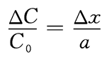

# **第二章 物联网感知识别**

## **2.3** **传感器技术**

**自动门、自动水龙头、安检门**

### **传感器的作用**

- **一般的仪器、仪表要求输入的信号必须为电信号** **，计算机及各种电子设备只能处理电信号 ，**
- **而表征物质特性或其运动形式的参数 中有很多都是非电量，如大家在自然界经常接触到的温度、压力、距离、流量、重量、速度、加速度、浓度、酸碱度、湿度、光 、磁场等 。**
- **上述的非电量需要转换成与非电量有一定关系的电量，再运用电子设备和仪器测量，实现这种转换技术的器件就是传感器。**

### **传感器的定义与组成**

根据国家标准（GB/T 7665-2005）传感器通用术语的规定，传感器是能感受规定的被测量并按照一定的规律转换成可用输出信号的器件或装置。

传感器通常由对被测量敏感的元件和转换元件组成，

•**敏感元件**是指传感器中能直接感受或响应被测量的部分，如应变式压力传感器中的弹性膜片，就是敏感元件。

•**转换元件**是指传感器中能将敏感元件感受或响应到的被测量转换成适于传输或测量的电信号（电压、电流）部分，如电阻应变片就是转换元件。

### **传感器的分类**

#### **1．按被测物理量划分** 

**这一种方法是根据被测量的性质进行分类，如被测量分别为温度、湿度、压力、位移、流量、加速度、光，则对应的传感器分别为温度传感器、湿度传感器，压力传感器、位移传感器、流量传感器、加速度传感器、光电传感器。**

#### **2．按传感器工作原理划分**

​    这一种分类方法是以工作原理来划分，将物理、化学、生物等学科的原理、规律和效应作为分类的依据，据此可将传感器分为电阻式、电感式、电容式、阻抗式、磁电式、热电式、压电式、光电式、超声式、微波式等类别。这种分类方法有利于传感器的专业工作者从原理与设计上作归纳性的分析研究。

### **传感技术的特点**

**1、用传感技术进行检测时，响应速度快，精确度高，灵敏度高；**

**2、能在特殊环境下连续进行检测，便于自动记录。**

能在人类无法存在的高温、高压、恶劣环境中，和对人类五官不能感觉到的信息（如超声波、红外线等），进行连续检测，记录变化的数据。

**3、可与计算机相连，进行数据的自动运算、分析和处理**

   传感器将非电物理量转换成电信号后，通过接口电路变成计算机能够处理的信号，进行自动运算、分析和处理。

**4、品种繁多，应用广泛**

​    现代信息系统中待测的信息量很多，一种待测信息可由几种传感器来测量，一种传感器也可测量多种信息，因此传感器种类繁多，应用广泛，从航空、航天、兵器、交通、机械、电子、冶炼、轻工、化工、煤炭、石油、环保、医疗、生物工程等领域，到农、林、牧、副、渔业，以及人们的衣、食、住、行等生活的方方面面，几乎无处不使用传感器，无处不需要传感器。

### 传感器的发展趋势

**1．新材料的开发、应用**

如：半导体材料 、功能陶瓷材料 、功能金属、功能有机聚合物、非晶态材料、固体材料及薄膜材料等，都可进一步提高传感器的产品质量，降低生产成本。

**2．新工艺、新技术的应用**

将半导体的精密细微加工技术应用在传感器的制造中，可极大提高传感器的性能指标，并为传感器的集成化、超小型化提供技术支撑。借助半导体的蒸镀技术、扩散技术、光刻技术、静电封闭技术、全固态封接技术，也可取得类似的功效。

**3．向小型化、集成化方向发展**

由于航空技术的发展，以及医疗器件和一些特殊场合的需要，传感器必须向小型化、微型化方向发展，以便减小体积和质量。

 **4.** **向多功能化方向发展**

传感器多功能化也是传感器今后发展的一个重要方向，在一块集成传感器上综合多个传感器的功能，可以同时测量多个被测量，它可以借助于敏感元件中的不同物理结构或化学物质及其不同的表征方式，用单独一个传感器系统来同时实现多种传感器的功能。

**5．传感器的智能化**

将传统的传感器和微处器及相关电路组成一体化的结构就是智能传感器。因为它本身带有微型计算机，具有自动校准、自动补偿、自动诊断、数据处理、远距离双向通信、信息存储记忆和数字信号输出等功能。

**6．传感器的网络化**

将传感器和计算机与网络技术有机结合，使传感器成 为网 络中的智能节点。这种努力使多个传感器组成网络直接通信，实现数据的实施发布、共享，以及网络控制器对节点的控制操作。另外，通过Internet网，传感器与用户之间可异地交换信息，厂商能直接与异地用户交流，能及时完成传感器故障诊断，指导用户维修或交换新仪器改进的数据，软件升级等工作。另外，在微机电技术、自组织网络技术、低功耗射频通信技术及低功耗微型计算机技术的共同促进下，传感器朝微型化和网络化的方向迅速发展，产生了无线传感器网络。

### **传感器的基本特性**

传感器的基本特性一般是指传感器的输出与输入之间的关系，有静态和动态之分。通常是以建立数学模型来体现的，为了简化传感器的静、动态特性，可以分开来研究。

### **1．传感器的静态特性** 

**静态特性是指在静态信号作用下，传感器输出与输入量间的一种函数关系，其静态特性可表示为**

  **常用的静态性能指标包括灵敏度、精确度、测量范围、量程、线性度及误差等。**

#### **（1）灵敏度**

**传感器的灵敏度是指达到稳定状态时，输出增量与输入增量的比值**

**线性传感器的灵敏度就是其静态特性的斜率**

**非线性传感器的灵敏度则是其静态特性曲线某点处切线的斜率**

#### **（2）线性度**

**线性度是传感器输出量与输入量之间的实际关系曲线偏离直线的程度，又称非线性误差。**

**如图所示，即为在垂直方向上最大偏差** **|Δymax|** **与最大输出** **ymax** **的百分比。图中** **a0** **称为零位输出，即被测量为零时传感器的指示值。**

#### **（3）重复性**

   **重复性表示传感器在输入量按同一方向作全量程连续多次变动时所得到的特性曲线的不一致程度，如图所示，用公式表示为**

**式中，⊿mmax取⊿** **m1、** **⊿** **m2中最大的计算，ymax为满量程输出值。**

**传感器输出特性的不重复性主要是由传感器的机械部分的磨损、间隙、松动、部件内摩擦、积尘、电路元件老化、工作点漂移等原因产生的。**

#### **（4）迟滞现象**

   **迟滞现象是传感器在正向行程（输入量增大）和反向行程（输入量减小）期间输出—输入曲线不重合的程度，如图所示。**

或

**迟滞现象反映了传感器机械结构和制造工艺上的缺陷，如轴承摩擦、间隙、螺钉松动、元件腐蚀等。** 

#### **（5）精确度**

   **传感器的精确度是指传感器的输出指示值与被测量约定真值的一致程度，反映了传感器测量结果的可靠程度。在工程应用中，为了简单表示测量结果的可靠性程度，引入精确度这个等级概念，用** **A** **表示，它表示允许的最大绝对误差与满度量程的比值的百分数，即**

式中 *A*——传感器精确度；

​     ⊿ *A*——测量范围内允许的最大绝对误差；

​     *y*max ——满度量程输出值。

常用的档次为 0.1、0.2、0.5、1.0、1.5、2.5、4.0、5.0。例如，0.5级的仪表表示其允许的最大使用误差为 0.5%。

#### **（6）分辨力**

  **传感器的分辨力是在规定测量范围内所能检测的输入量的最小变化量的能力。通常是以最小量程单位值表示。当被测量的变化值小于分辨力时，传感器对输入量的变化无任何反应。**

#### **（7）稳定性**

  **传感器的稳定性是指在室温条件下经过一定的时间间隔，传感器的输出与起始标定时的输出之间的差异。通常有长期稳定性（如年、月、日）和短期稳定性（如时、分、秒）之分，传感器的稳定性常用长期稳定性表示。**

#### **（8）漂移**

  **传感器的漂移是指在外界的干扰下，输出量发生与输入量无关的不需要的变化。漂移包括零点漂移和灵敏度漂移等。零点漂移和灵敏度漂移又可分为时间漂移和温度漂移。**

- **时间漂移是指在规定的条件下，零点或灵敏度随时间的缓慢变化；**
- **温度漂移为环境温度变化而引起的零点或灵敏度的变化。**

### **2．传感器的动态特性**

传感器的动态特性是指传感器在测量快速变化的输入信号情况下，输出对输入的响应特性。传感器测量静态信号时，由于被测量不随时间变化，测量和记录的过程不受时间限制。但是在工程实践中，检测的是大量随时间变化的动态信号，这就要求传感器不仅能精确地测量信号的幅值大小，而且还能显示被测量随时间变化的规律，即正确的再现被测量波形。传感器测量动态信号的能力用动态特性来表示。

在动态测量中，当被测量作周期性变化时，传感器的输出值随着周期性变化，其频率与前者相同，但输出幅值和相位随频率的变化而变化，这种关系称为频率特性。输出信号的幅值随频率变化而改变的特性称为幅频特性；输出信号的相位随频率的变化而改变的特性称为相频特性，幅值下降到稳定幅值的0.707倍时所对应的频率称为截止频率。

- **传感器静态特性是输入信号不随时间变化时的输出与输入之间的关系。**
- **静态特性指标：灵敏度、线性度、重复性、迟滞现象、精确度、分辨力、稳定性和漂移。**
- **传感器的动态特性是输入信号随时间周期性作变化时的输出与输入之间的关系。**

#### **力敏传感器及其应用**

力敏传感器，顾名思义就是能对各种力或能转化为力的物理量产生反应，并能将其转变为电参数的装置或元件。很显然，要成为真正实用意义上的力敏传感器，这个由力转化为电参数的过程最好能成线性关系。

根据由力至电参数转变的方式不同，力敏传感器一般有电阻应变式传感器、电位计式传感器、电感式传感器、压电式传感器、电容式传感器等，它们可用来测量力值。

### 电阻应变式传感器

  电阻应变式传感器是目前工程测力传感器中应用最普遍的一种传感器，它测量精度高，范围广，频率响应特性较好，结构简单，尺寸小，易实现小型化，并能在高温、强磁场等恶劣环境下使用，并且工艺性好，价格低廉。它主要应用在力作用下，将材料应变转变为电阻值的变化，从而实现力值的测量。组成电阻应变片的材料一般为金属或半导体材料。

#### **电阻应变式传感器工作原理**

**（1）应变效应**

由物理学可知，电阻丝的电阻 *R* 与电阻丝的电阻率、导体长度及截面积存在如下关系

当电阻丝受到拉力作用时，长度伸长 *Δ**l*，横截面收缩 *Δ**S*，电阻率也将变化 *Δρ*，此时电阻值产生 ΔR 变化。

**电阻应变式传感器的结构及特性** :

**金属电阻应变片分为金属丝式和金属箔式两种。**

**① 金属丝式电阻应变片。金属丝式电阻应变片的基本结构图如图所示。由敏感栅1、基底2和盖层3、引线4和黏结剂几个基本部分组成。**

  **②** **金属箔式应变片。如图所示，它与金属丝式电阻应变片相比，有如下优点：用光刻技术能制成各种复杂形状的敏感栅；横向效应小；散热性好，允许通过较大电流，可提高相匹配的电桥电压，从而提高输出灵敏度；疲劳寿命长，蠕变小；生产效率高。**

  **但是，制造箔式应变片的电阻值的分散性要比丝式应变片的大，有的能相差几十欧姆，需要调整阻值。金属箔式应变片因其一系列优点而将逐渐取代丝式应变片，并占主要地位。**

> **各种箔式应变片**
>
> 

**电阻应变片传感器基本应用电路**

 **将电阻应变片粘贴于待测构件上，应变片电阻随着构件应变而改变，将应变片电阻接入相应的电路中，使其转化为电流或电压输出，即可测出力值。**

**通常将应变片接入电桥来实现电阻至电压或电流的转换。根据电桥电源不同，又分直流电桥和交流电桥。这里主要介绍直流电桥。**

**如图所示为一直流电桥，计算可知：**

**∆U=(R_1 R_3-R_2** **R_4)/(R_1+R_2 )(R_3+R_4 ) *E**

**若使此电桥平衡，即** **ΔU = 0，只要** **R1** **R3** **–** **R2** **R4** **=** **0** **。一般我们取** **R1** **=** **R2** **=** **R3** **=** **R4** **=** **R** **即可实现。**

**按上述，取** **R1** **=** **R2** **=** **R3** **=** **R4** **=** **R** **即可实现电桥平衡。**

**现将** **R1** **换成电阻应变片，即组成半桥单臂电桥，随构件产生应变造成传感器电阻变化时，上式变成**

**∆U=∆R/(4R+2∆R) E**

**一般** **ΔU** **<<** **R** **，可忽略，由此可得**

**∆U≈1/4  ∆R/R E**

 **可见，输出电压与电阻变化率成线性关系，即和应变力成线性关系，由此即可测出力值。由上式可得半桥单臂工作输出的电压灵敏度**  **k_u=∆U/(∆R∕R)= E/4** 

  **为了提高输出电压灵敏度，可以采用半桥双臂或全桥双肩电路。**

**即半桥双臂可使电压灵敏度比半桥单臂提高一倍，而全桥电路电压灵敏度又比半桥双臂电压灵敏度提高一倍。可见，利用全桥，并提高供电电压** **E，可提高灵敏度系数。**

##### 温度误差及其补偿

**（1） 温度误差**

**用作测量应变的金属应变片，希望其阻值仅随应变力变化，而不受其它因素的影响。但是，环境温度的变化，会造成阻值的额外变化。**

Ø**阻温效应： 当环境温度改变时，由于热输出会引起电阻率的变化，而且与构件应变所造成的电阻变化有相同的数量级，从而产生很大的测量误差。**

Ø**附加应变： 当环境温度改变时，构件和应变片产生变形，使应变片产生附加应变，从而使应变片在被测应力作用下产生** **Δ** **R** **的基础上附加了** **ΔRi** **，使测力结果发生误差。**

**（2） 温度补偿**

**一般采用桥路补偿法、应变片补偿法或热敏电阻补偿法。**

**桥路补偿法： 如图所示，当** **ab** **间接入应变片传感器，bc** **间也接入同样的应变片，但** **bc** **间接入的应变片不受构件应变力的作用，将它用同样的方法粘贴在与** **ab** **间应变片所贴构件材料相同的材料上，并与** **ab** **间应变片处于同一温度场，这样** **ab、bc** **间应变片的阻温效应相同，电阻的变化量** **ΔRi** **也相同，由电桥理论可知，它们起了互相抵消作用，对输出电压没有影响。**

**（阻温 ）**

> **应变片补偿法分自补偿和互补偿两种。**
>
> •**自补偿法：其原理是合理选择应变片阻温系数及线膨胀系数，使之与被测构件线膨胀系数匹配，使应变片温度变化** **Δt** **时，由热造成的输出值为** **0。（阻温** **+** **附加）**
>
> •**应变片互补偿法：其原理是检测用的应变片敏感栅由两种材料组成，在温度变化** **Δt** **时，它们的阻值变化量** **ΔR** **相同，但符号相反，这样就可抵消由于温度变化而造成传感器误输出。使用中要注意选配敏感栅电阻丝材料。** **（阻温** **）**
>
> **热敏电阻补偿法**
>
> •**如图所示，图中** **R5** **为分流电阻，Rt** **为** **NTC热敏电阻，使** **Rt** **与应变式传感器处在同一温度场中，适当调整** **R5** **值，可使** **ΔR** **附加的热输出为零。（阻温）**
>
> 

**电阻应变式传感器应用于测力（如称重）**

•**电阻应变式传感器广泛应用在测力及可以转化为力值的量（如加速度等）。** 

•**图中** **1、2、3、4** **为四个相同的应变片，沿同一高度圆周均布，接入全桥测量电路。在外力** **F** **的作用下应变片** **1、3** **的电阻变大，应变片** **2、4** **的电阻变小。**

•**测量电路输出电压为**  **∆U=U** **∆R/R** **=k** **F** **，（k** **值与圆筒截面积、圆筒材料泊松比、弹性元件的弹性模量、馈电电源等相关）**

•**∆U** **与所称重量成线性关系，将** **∆U经过放大等一系列处理电路，可送显示仪表直接读出称重量。**

##### **加速度传感器**

**将被测加速度** **a** **通过一个悬臂梁将力** **F** **= ma** **转化成应变片的应力，从而达到测量加速度** **a** **的目的。**

**力敏传感器应用实例：电子秤** 

**如图所示是采用微处理器的电子秤原理图**：

### 电感式传感器

#### **工作原理**

**电感式传感器是利用线圈自感或互感的变化来实现测量的一种装置，可以用来测量位移、振动、压力、流量、重量、力矩和应变等多种物理量。**

**电感式传感器的核心部分是可变自感或可变互感，在被测量转换成线圈自感或互感的变化时，一般要利用磁场作为媒介或利用铁磁体的某些现象。这类传感器的主要特征是具有绕组。**

#### **优点和缺点**

**（1）优点：结构简单可靠，输出功率大，抗干扰能力强，对工作环境要求不高，分辨力较高（如在测量长度时一般可达0.1mm），示值误差一般为示值范围的0.1%~0.5%，稳定性好。**

**（2）缺点：频率响应低，不宜用于快速动态测量。一般来说，电感式传感器的分辨力和示值误差与示值范围有关。示值范围大时，分辨力和示值精度将相应降低。**

#### **种类**

**有利用自感原理的自感式传感器，有利用互感原理的差动变压器式传感器。此外，还有利用涡流原理的涡流式传感器，利用压磁原理的压磁式传感器和利用互感原理的感应同步器等。**

### **变压器式传感器**

#### **工作原理**

**变压器式传感器是将非电量转换为线圈间互感的一种磁电动机构，很像变压器的工作原理，因此常称其为变压器式传感器。这种传感器多采用差动形式。**

Ø**气隙型差动变压器式**

Ø**截面积型差动变压器式**

#### **气隙型差动变压器式传感器**

**当没有非电量输入时，衔铁** **C** **与铁芯** **A、B** **的间隔相同，则绕组** **W1a** **和** **W2a** **间的互感** **ma** **与绕组** **W1b** **和** **W2b** **间的互感** **mb** **相等。**

**当衔铁位置改变时，ma** **和** **mb** **的差值即反映被测量值的大小。**

**为反映差值互感，将两个一次绕组的同名端顺向串联，并施加交流电压** **u，二次绕组的同名端反向串联，同时测量串联后的合成电动势** **e2** **为：e2** **=** **e2a** **-** **e2b**

#### **截面积型差动变压器式传感器**

n**改变气隙有效截面积，输入非电量为角位移Δα。它是一个山字形铁芯** **A上 绕有三个绕组。** **W1** **为一次绕组，W2a** **及** **W2b** **为两个二次绕组。**

n**衔铁** **B** **以** **O** **点为轴转动时，由于改变了铁芯与衔铁间磁路上的垂直有效截面积** **s，也就改变了绕组间的互感，使其中一个互感增大，另一个互感减小，因此两个二次绕组中的感应电动势也随之改变。**

n**将绕组** **w2a** **和** **w2b** **反相串联并测量合成电动势** **e2，就可以判断出非电量的大小及方向。**

#### **差动变压器应用实例**

**一般来说，较小位移量的测量采用差动变压器，**

- **电子秤：用差动变压器把弹簧的位移变为电信号，换算为重量**
- **偏心测量仪：以起始点作为基准，最后换算为转体的偏心程度**

#### **电感式传感器应用实例：测量列车运行**

**测量列车运行的速度和加速度，组成包括：**

- **安装在列车头底部的一块强磁体**
- **埋设在轨道地面的一组线圈**
- **电流测量仪**

**当列车经过线圈上方时，线圈中产生的电流被记录下来，即能求出列车在各位置的速度和加速度。**

**力敏传感器是将动态或静态力的大小转换成便于测量的电量的装置。**

- **电阻应变式传感器：其将外力转化成电阻值的变化，再利用电桥电路检测出电阻值的变化值，从而得出对应的力变化量。**
- **电感式传感器：其将外力引起的微小位移量转化成电感参数的变化，从而得出相应力的变化量。如位移量很小，可采用差动变压器来放大信号的方式，以提高传感器的灵敏度。**
- **电容式传感器**

- **...**

### 电容式传感器

#### **电容式传感器的工作原理和结构**

**由绝缘介质分开的两个平行金属板组成的平板电容器，如果不考虑边缘效应，其电容量为：** **C=ϵA/d**

**式中：ε——电容极板间介质的介电常数，ε=ε0εr，
 　　　　其中ε0为真空介电常数，εr为极板间介质的相对介电常数；**

 			　**A——两平行板所覆盖的面积；**

  		**d——两平行板之间的距离。**

**当被测参数变化使得公式中的** **A、d** **或** **ε** **发生变化时，电容量** **C** **也随之变化。**

**如果保持其中两个参数不变，而仅改变其中一个参数，就可把该参数的变化转换为电容量** **C** **的变化，通过测量电路就可转换为电量输出。**

**电容式传感器可分为变极距型、变面积型和变介电常数型三种。**

##### **变极距型电容传感器**

**当** **εr** **和** **A** **为常数，初始极距为** **d0** 时，初始电容量为 

** **
 **若电容器极板间距离由初始值** **d0** **缩小了** **Δd，电容量增大了** **ΔC，则有 

** **
**如图，传感器的输出特性不是线性关系。**

##### **采用云母片的变极距型电容传感器**

- **在** **d0** **较小时，对于同样的** **Δd** **变化所引起的** **ΔC** **更大，从而使传感器灵敏度提高。**
- **但** **d0** **过小，容易引起电容器击穿或短路。**
- **为此，极板间可采用高介电常数的材料（云母、塑料膜等）作介质。此时电容** **C** **变为
  **

 式中：εg——云母的相对介电常数，εg=7；
　　**ε0——空气的介电常数，ε0=1；
** 　　**d0——空气隙厚度；
** 　　**dg——云母片的厚度。**

**云母片的相对介电常数是空气的** **7** **倍，其击穿电压不小于1000kV/mm，而空气仅为3kV/mm。因此有了云母片，极板间起始距离可大大减小。**

**一般起始电容在20～100pF，极板间距离在25～200μm。最大位移应小于间距的1/10，故在微位移测量中应用最广。**

##### **变面积型电容式传感器**

被测量通过动极板移动引起两极板有效覆盖面积 A 改变，从而得到电容量的变化。

当动极板相对于定极板沿长度方向平移Δx时，电容变化量为
 

 式中 **C0** **=** **ε0εrba/d** **为初始电容。**

电容相对变化量为：

很明显，这种形式的传感器其电容量 **C** 与水平位移Δx呈线性关系。

##### **电容式角位移传感器**

**当动极板有一个角位移** **θ** **时，与定极板间的有效覆盖面积就发生改变，从而改变了两极板间的电容量。**

**当** **θ** **= 0** 时，有 

 式中：εr——介质相对介电常数；
 　　d0——两极板间距离；

​		A0——两极板间初始覆盖面积。

当θ ≠ 0时，有

**可见，传感器的电容量** **C** **与角位移**θ呈线性关系。

##### **变介质型电容式传感器**

**变介质型电容传感器有较多的结构形式，可以用来测量纸张、绝缘薄膜等的厚度，也可用来测量粮食、纺织品、木材或煤等非导电固体介质的湿度。**

**图中，两平行电极固定不动，极距为** **d0，相对介电常数为** **εr2** **的电介质以不同深度嵌入电容器中，从而改变两种介质的极板覆盖面积。**

**传感器总电容量** **C** 为 

 **式中：L0、b0——极板的长度、宽度；
**L——第二种介质进入极板间的长度。

**若电介质** **εr1** **=** **1，则当** **L** **=** **0** **时，传感器初始电容** **C0** **=** **ε0εr1L0b0/d0。**

**当被测介质** **εr2** **进入极板间** **L深度后，引起电容相对变化量为**

**可见，电容量的变化与电介质** **εr2** 的移动量 L成线性关系。

#### **电介质材料的相对介电常数**

##### **应用：电容式液位变换器结构原理**

**如图是一种利用改变极板间介质的方式测量液位高低的电容式传感器结构原理图。**

**设被测介质的介电常数为 ε1，液面高度为 h，变换器总高度为 H，内筒外径为 d，外筒内径为 D，则此时变换器电容值为**

　　**式中：ε——空气介电常数；
　　    **C0——由变换器的基本尺寸决定的初始电容值，即

**可见，此变换器的电容增量正比于被测液位高度**h。

#### **变极距型差动平板式电容传感器**

**在实际应用中，为了提高灵敏度，减小非线性误差，大多采用差动式结构。**

**电容传感器做成差动式之后，灵敏度增加了一倍，而且非线性误差则大大降低了。**

##### **应用：** **（差动）电容式加速度传感器**

**有两个固定极板（与壳体绝缘），中间有一用弹簧片支撑的质量块，此质量块的两个端面经过磨平抛光后作为可动极板（与壳体电连接）。**

　　**当传感器壳体随被测对象沿垂直方向作直线加速运动时，质量块在惯性空间中相对静止，两个固定电极将相对于质量块在垂直方向产生大小正比于被测加速度的位移。此位移使两电容的间隙发生变化，一个增加，一个减小，从而使C1、C2产生大小相等、符号相反的增量，此增量正比于被测加速度。
 　电容式加速度传感器的主要特点是频率响应快和量程范围大。**

##### **应用：（差动）电容式测厚传感器**

　　**电容测厚传感器是用来对金属带材在轧制过程中厚度的检测。**

**其工作原理是在被测带材的上下两侧各置放一块面积相等，与带材距离相等的极板，这样极板与带材就构成了两个电容器C1、C2。**

**把两块极板用导线连接起来成为一个极，而带材就是电容的另一个极，其总电容为** **C1** **+** **C2。**

**如果带材的厚度发生变化，将引起电容量的变化。**

**用交流电桥将电容的变化测出来，经过放大即可由电表指示测量结果。**

### **热电式传感器**

#### **热电式传感器的分类**

**热电式传感器是一种将温度变化转换为电量变化的转换装置。它利用敏感元件的电参数随温度变化的特性，对温度和温度相关的参数进行测量，**

**其中将温度转换为电势的热电式传感器叫热电偶**

**将温度变化转换为电阻值的热电式传感器叫热电阻**

- **用金属作为感温元件的热电阻，称为金属热电阻**
- **用半导体材料作为感温元件的热电阻，称为热敏电阻**

#### **热电偶的测温原理**

**热电偶是利用热电效应制成的温度传感器。**

**热电效应： 当不同材料的导体或半导体组成一个闭合回路时，若两个接点的温度不同，那么在回路中将会产生电动势的现象。**

**这种闭合回路组合被称为热电偶，不同的导体或半导体称为热电极，温度高的接点称为热端（或工作端、测量端），温度低的接点称为冷端（或自由端、补偿端）。**

**两点间的温差越大，产生的电动势就越大。引入适当的测量电路测量电动势的大小，就可测得温度的大小。**

**热电动势的组成**

- **接触电动势：是由两种不同导体的自由电子，其密度不同而在接触处形成的热电势。它的大小取决于两导体的性质及接触点的温度，而与导体的形状和尺寸无关。**
- **温差电动势：是在同一根导体中，由于两端温度不同而产生的一种电势。**

#### **热电偶的特点**

热电偶作为热电式传感器，凭借其简单的结构，便捷的操作，稳定的性能，广阔的测温范围，较小的热惯性和热容量，便于检测和控制的输出信号，在温度测量中占有重要地位。所以常被用作测量炉子、管道内的气体或液体的温度及固体的表面温度。

#### **金属热电阻**

**金属热电阻传感器是利用导体的电阻值随温度变化的原理，将温度的变化量转换成与之有一定函数关系的电阻值的变化量，通过对电阻值的测量实现对温度的测量。**

**大多数金属导体的电阻随温度变化而变化，当温度升高时，金属内部自由电子的动能增加，在电场作用下，这些杂乱无章的电子作定向移动会遇到更大的阻力，导致金属电阻值随温度的升高而增加。**

**材料：温度系数大、线性度好、热容量小、电阻率大、易提纯等**

| **材料** | **使用温度范围/℃** | **（0～100）℃间电阻温度系数α（平均值）（1/C）** | **化学稳定性**                                               | **特性**                           | **应用**                                     |
| -------- | ------------------ | ----------------------------------------------- | ------------------------------------------------------------ | ---------------------------------- | -------------------------------------------- |
| **铂**   | **-200～850**      | **0.00385**                                     | **在氧化性介质中较稳定，不能在还原性介质中使用，尤其在高温情况下** | **特性近于线性、性能稳定、精度高** | **适于较高温度的测量，可作标准测温装置**     |
| **铜**   | **-50～150**       | **0.00428**                                     | **超过100℃易氧化**                                           | **线性较好、价格低廉、体积大**     | **适于测量低温、无水分、无腐蚀性介质的温度** |

#### **热敏电阻**

- **热敏电阻属于半导体器件，对温度敏感，不同的温度下表现出不同的电阻值。正温度系数热敏电阻在温度越高时电阻值越大，负温度系数热敏电阻在温度越高时电阻值越低。**
- **热敏电阻具有结构简单、温度系数大、灵敏度高、电阻率高、热惯性小等特点，比较适合动态测量。**
- **热敏电阻线性度较差，只在某一较窄温度范围内有较好的线性度，且由于是半导体材料其互换性差。**
- **热敏电阻两大用途**

**作为检测元件**

**作为电路元件**

### **光电式传感器**

- **光电式传感器也称为光电器件，是将光信号转换为电信号的一种装置。**
- **光电式传感器工作时，先将被测量的变化转换为光量的变化，然后通过光电器件再把光量的变化转换为相应的电量变化，从而实现非电量的测量。**
- **其原理为光电效应，是指物体吸收了光能后，光能转化为该物体中某些电子的能量，从而产生电效应。**
- **光电效应分类**
  - **外光电效应：** **在光线作用下，电子逸出物体表面而产生光电子发射的现象。**
  - **内光电效应：** **在光线作用下，物体的电阻率改变的现象。**
  - **光生伏特效应：** **在光线作用下，物体内部产生一定方向电动势。**
  - **热释电现象：** **热电材料受红外线等照射时，若其表面温度发生变化，则该表面产生电荷的现象。**

#### **光电式传感器的工作原理**

- **光电式传感器也称为光电器件，是将光信号转换为电信号的一种装置。**
- 光敏电阻作为被广泛使用的光电器件，工作原理基于内光电效应，其核心器件为光电导体，由半导体制成。
  - 在室温条件下，没有光照射时，阻值变大，电流变弱，流过回路的电流称为暗电流；有光照射时，阻值变小，电流变强。
  - 能产生光电效应的器件称为光电效应器件，常用的制作材料为硫化镉，另外还有硒、硫化铝、硫化铅和硫化铋等材料。
- **光电池，即太阳能电池，也是光电器件的一种，其物理基础是光生伏特效应，将光量转换为电动势，它能够接收不同强度的光照射，产生不同大小的电流。**
- **光电检测方法具有精度高、响应快、非接触、结构简单、形式多样等优点，因此在自动控制系统中得到了广泛应用。**

###  **MEMS** 传感器

 **（MEMS：微机电系统）**

•**MEMS** **全称为** **Microelectro Mechanical Systems，中文名称为微机电系统，是利用微纳加工技术将机械零件、电子电路、传感与执行机构高度集成的高附加值半导体器件。**

•**利用** **MEMS** **技术构建的器件具有体积小、重量轻、功耗低、集成度高、易于使用等特点，适于大批量生产，广泛应用于汽车、消费电子、工业、医疗、国防、航空航天等领域。**

•**常见的产品包括** **MEMS** **加速度计、MEMS** **麦克风、微马达、微泵、微振子、MEMS** **光学传感器、MEMS** **压力传感器、MEMS陀螺仪、MEMS** **气体传感器等等，以及它们的集成产品。**

•**MEMS技术的目标是通过系统的微型化、集成化、智能化来探索具有新原理、新功能的元件和系统。**

#### **MEMS** **概况**

**微机电系统（MEMS, Micro-Electro-Mechanical System），也叫做微电子机械系统、微系统、微机械等，指尺寸在几毫米乃至更小的高科技装置。**

**微机电系统其内部结构一般在微米甚至纳米量级，是一个独立的智能系统。** 

**微机电系统是在微电子技术（半导体制造技术）基础上发展起来的，融合了光刻、腐蚀、薄膜、LIGA、硅微加工、非硅微加工和精密机械加工等技术制作的高科技电子机械器件。**

**微机电系统是集微传感器、微执行器、微机械结构、微电源微能源、信号处理和控制电路、高性能电子集成器件、接口、通信等于一体的微型器件或系统。MEMS是一项革命性的新技术，广泛应用于高新技术产业，是一项关系到国家的科技发展、经济繁荣和国防安全的关键技术。** 

**MEMS侧重于超精密机械加工，涉及微电子、材料、力学、化学、机械学诸多学科领域。它的学科面涵盖微尺度下的力、电、光、磁、声、表面等物理、化学、机械学的各分支。** 

#### **MEMS** **主要研究方面**

**MEMS技术是一种典型的多学科交叉的前沿性研究领域，几乎涉及到自然及工程科学的所有领域，如电子技术、机械技术、物理学、化学、生物医学、材料科学、能源科学等。其研究内容一般可以归纳为以下三个基本方面：** 
 **1．理论基础： 在当前MEMS所能达到的尺度下，宏观世界基本的物理规律仍然起作用，但由于尺寸缩小带来的影响（Scaling Effects），许多物理现象与宏观世界有很大区别，因此许多原来的理论基础都会发生变化，如力的尺寸效应、微结构的表面效应、微观摩擦机理等，因此有必要对微动力学、微流体力学、微热力学、微摩擦学、微光学和微结构学进行深入的研究。这一方面的研究虽然受到重视，但难度较大，往往需要多学科的学者进行基础研究。**

**2．技术基础研究：主要包括微机械设计、微机械材料、微细加工、微装配与封装、集成技术、微测量等技术基础研究。**

**3．微机械在各学科领域的应用研究。**

#### MEMS主要应用分类

**传感**： 传感 MEMS 技术是指用微电子微机械加工出来的、用敏感元件如电容、压电、压阻、热电耦、谐振、隧道电流等来感受转换电信号的器件和系统。它包括速度、压力、湿度、加速度、气体、磁、光、声、生物、化学等各种传感器，按种类分主要有：面阵触觉传感器、谐振力敏感传感器、微型加速度传感器、真空微电子传感器等。传感器的发展方向是阵列化、集成化、智能化。由于传感器是人类探索自然界的触角，是各种自动化装置的神经元，且应用领域广泛，未来将备受世界各国的重视。

**生物**： 生物 MEMS 技术是用 MEMS 技术制造的化学/生物微型分析和检测芯片或仪器，有一种在衬底上制造出的微型驱动泵、微控制阀、通道网络、样品处理器、混合池、计量、增扩器、反应器、分离器以及检测器等元器件并集成为多功能芯片。可以实现样品的进样、稀释、加试剂、混合、增扩、反应、分离、检测和后处理等分析全过程。它把传统的分析实验室功能微缩在一个芯片上。生物 MEMS 系统具有微型化、集成化、智能化、成本低的特点。功能上有获取信息量大、分析效率高、系统与外部连接少、实时通信、连续检测的特点。国际上生物 MEMS 的研究已成为热点，不久将为生物、化学分析系统带来一场重大的革新。

**光学**：随着信息技术、光通信技术的迅猛发展，MEMS 发展的又一领域是与光学相结合，即综合微电子、微机械、光电子技术等基础技术，开发新型光器件，称为微光机电系统 (MOEMS)。它能把各种 MEMS 结构件与微光学器件、光波导器件、半导体激光器件、光电检测器件等完整地集成在一起。形成一种全新的功能系统。MOEMS 具有体积小、成本低、可批量生产、可精确驱动和控制等特点。较成功的应用研究：

 一是基于 MOEMS 的新型显示、投影设备，主要研究如何通过反射面的物理运动来进行光的空间调制，典型代表为数字微镜阵列芯片和光栅光阀。

二是通信系统，主要研究通过微镜的物理运动来控制光路发生预期的改变，较成功的有光开关调制器、光滤波器及复用器等光通信器件。

**射频**：射频 MEMS 技术传统上分为固定的和可动的两类。固定的 MEMS 器件包括本体微机械加工传输线、滤波器和耦合器，可动的 MEMS 器件包括开关、调谐器和可变电容。按技术层面又分为由微机械开关、可变电容器和电感谐振器组成的基本器件层面；由移相器、滤波器和 VCO 等组成的组件层面；由单片接收机、变波束雷达、相控阵雷达天线组成的应用系统层面。

#### **MEMS** **加速度计**

ADXL203是完整的高精度、低功耗、单轴/双轴加速度计，提供经过信号调理的电压输出，所有功能（MEMS & IC）均集成于一个单芯片中。这些器件的满量程加速度测量范围为±1.7 g，既可以测量动态加速度（例如振动），也可以测量静态加速度（例如重力）。

  **加速度传感器是最早广泛应用的** **MEMS** **之一。MEMS** **作为一个机械结构为主的技术，可以通过设计使一个部件（图中橙色部件）相对底座** **substrate** **产生位移（这也是绝大部分** **MEMS** **的工作原理），这个部件称为质量块（proof mass）。质量块通过锚** **anchor，铰链** **hinge，或弹簧** **spring与底座连接。绿色部分固定在底座。当感应到加速度时，质量块相对底座产生位移。通过一些换能技术可以将位移转换为电能，如果采用电容式传感结构（电容的大小受到两极板重叠面积或间距影响），电容大小的变化可以产生电流信号供其信号处理单元采样。通过梳齿结构可以极大地扩大传感面积，提高测量精度，降低信号处理难度。加速度计还可以通过压阻式、力平衡式和谐振式等方式实现。**

####  **NEMS（Nanoelectromechanical systems，纳机电系统）**

   首个 NEMS 器件由 IBM 在2000年展示。器件为一个 32×32的二维悬臂梁（2D cantilever array）。该器件采用表面微加工技术加工而成。该器件设计用来进行超高密度，快速数据存储，基于热机械读写技术（thermomechanical writing and readout），高聚物薄膜作为存储介质。该数据存储技术来源于AFM (原子力显微镜) 技术，相比磁存储技术，基于AFM的存储技术具有更大潜力。

#### **S-PPA** **仿生水凝胶压力传感器**

**2023年，东北大学田野课题组受芦荟的启发，成功地制备一种特殊结构的水凝胶（名为皮肤-聚乙烯醇-聚苯胺-AgNWs，S-PPA）。相关研究成果发表在** **Advanced Functional Materials** **期刊。**

**S-PPA水凝胶具有很强的抗损伤能力（拉伸强度为5 MPa，是无皮肤水凝胶的11倍），具有双重电导率（内皮肤为0.8 S/m，外皮肤为0.33 S/m），具有保水能力、抗菌性能（对金黄色葡萄球菌的抑制率为89.4%）和对金属电极的最小腐蚀。**

**S-PPA水凝胶不仅具有优异的抗损伤性，而且还表现出高压缩性能。并且可以在多个加载循环中保持稳定的性能，而不会出现明显的变形或损坏。**

**S-PPA 水凝胶表现出高压缩性和可变形性，内部微观结构在施加压力时发生变化，导致电荷传输路径和阻抗发生变化，这些变化可以通过电气测量来测量和量化，从而实现压力信号的传感和测量。**

**具有良好的压敏稳定性，能够抵抗多次压缩的疲劳影响，表现出更高的压力灵敏度。**

**可用于评估肌肉力量、控制力和耐力。**

#### **基于** **PMUT** **的液体密度测量传感器**

- **2023年，中国科学院苏州纳米技术与纳米仿生研究所轻量化实验室、长春理工大学合作，开发了一种基于压电式微机械超声换能器（PMUT）的液体密度测量传感器。**
- **解决当前传统密度测量装置体积大、功耗高、不易在线测量的问题，**
- **由两个** **PMUT（半径** **500 μm，空气中的谐振频率** **136 kHz）组成，作为发射、接收端。**
- **基于虚拟质量增加效应，即当一个机械结构在不同密度的介质中振动时，其固有频率会发生不同程度的变化。介质密度越大，机械结构的谐振频率变化越大。**
- **通过对该传感器在不同密度介质中所产生的时域信号与频域信号的分析，得出液体密度与PMUT谐振频率的关系，可应用于微型化可在线测量液体密度传感器。**

#### **微流控技术** 

**微流控（Microfluidics）指的是使用微管道（尺寸为数十到数百微米）处理或操纵微小流体（纳升到阿升）的系统所涉及的科学和技术，是一门涉及化学、流体物理、微电子、新材料、生物学和生物医学工程的新兴交叉学科。**

**微流控的重要特征之一是微尺度环境下具有独特的流体性质，如层流和液滴等。借助这些独特的流体现象，微流控可以实现一系列常规方法所难以完成的微加工和微操作。**

**过去十年，通过将最多达数千个阀门和泵集成到单个芯片平台上，实现高度多路复用的自动化复杂性液滴控制系统的研究爆炸式增长。**

**传统的方法大多使用串行控制来处理单个液滴，不能高效和稳定地控制微流体的存储路径或运动方位。其次，作为流体逻辑元件的微阀，通常需要通过施加包括外部压力、加热、电场或磁场来实现功能。在此背景下，缩小阀门及其驱动系统非常困难，对制造工艺提出了巨大的挑战。**

**离心微流控系统：多进程控制的实现**

**依靠偏转角和偏转速度实现多进程**

**可变位姿微流控芯片在工作过程中能不断进行顺时针和逆时针的偏转，类似于提供时钟信号；离心力与电源十分相似同样为系统提供动力。**

**研究团队从逻辑电路角度去构思芯片设计，称之为逻辑水路。通过对偏转脉冲的控制，研究团队实现了逻辑液滴的加法器。证明在离心微流控平台实现液滴逻辑控制的可行性。**

**构建了一种由逻辑开关单元组成的液体混合器，ABCD端口代表四种携带生物信息的液体输入，其能排列组合合成所有混合产物，共计16种组合方式。能快速实现对生物信息的匹配，可应用于核酸大规模自动筛查。**

#### **中国首款商用可重构5G射频芯片“破风”**

**2023年8月30日，中国移动核心自主创新成果“破风8676” 可重构5G射频收发芯片首次亮相。**

**射频收发芯片是无线电波和数字信号之间的转换器，是** **5G** **网络设备中的关键器件，被称为** **5G** **基站上的“明珠”。**

**国内首款基于可重构架构设计，可广泛商业应用于** **5G** **云基站、皮基站、家庭基站等** **5G** **网络核心设备中的关键芯片，实现从零到一的关键性突破，填补了该领域的国内空白，有效提升了我国** **5G** **网络核心设备的自主可控度。**

#### **移动式高效率超导单光子探测系统**

**2023年，中国科学院上海微系统所李浩、尤立星团队和赋同量子科技（浙江）有限公司合作，成功研制了基于小型液氦杜瓦（工作温度4.2K）、在1550nm波段系统探测效率超过70%的移动式超导单光子探测系统。**

**为未来开展基于移动平台（机载、车载等）的高性能单光子探应用铺平了道路。获得** **2023年上海工业博览会金奖。**

**超导条带光子探测器（SSPD：Superconducting strip photon detector）作为高性能的单光子探测器，广泛地应用于量子信息和弱光探测等领域。**

**迄今为止，高效率的** **SSPD** **系统通常需要使用** **GM** **制冷机** **(T≤2.5 K)、吸附式制冷机** **(T≤0.85 K)甚至更低温度的制冷机，这些系统的质量、体积、功耗等成为了限制** **SSPD** **在机载等移动平台应用的关键原因。**

