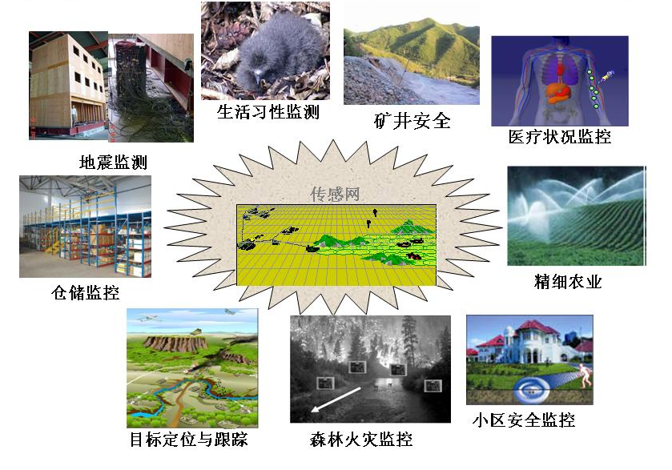

# **第三章 **无线传感器网络

## 3.1 **简述**

## **传感器网络** **Sensor Networks**

传感器网络是一种由传感器节点组成的网络，其中每个传感器节点具有传感器、微处理器和通信接口电路，节点之间通过通信链路组成网络，共同协作来监测各种物理量和事件。简称传感网。

有线传感器网络

- 较多用于自动化领域，可以构成网络控制系统，把单个分散的测量控制设备当成为网络节点，通过底层控制网络把它们连接起来，共同完成信息汇集、自动控制的任务。
- 现场总线系统可以在一对导线上挂接多个传感器、执行器、开关、按钮和控制设备等。
- Profibus、LonWorks、HART、CAN (车内总线)、M-bus** (仪表总线) …

无线传感器网络

- 低功耗、短距离、无线移动网络
- 简称：无线传感网

### **无线传感网 （WSN: Wireless Sensor Network）**

#### **WSN** **的早期需求来源：态势感知**

#### **无线传感器网络的早期发展**

#### **无线传感器网络的应用优势**

**分布节点中多角度和多方位信息的综合有效地提高了信噪比**

**低成本、高冗余的设计提供了较强的容错能力**

**节点与探测目标的近距离接触消除了环境噪声对系统性能的影响**

**节点中多种传感器的混合应用提高了探测的性能指标**

**多节点联合，形成覆盖面积较大的实时探测区域**

**个别移动节点对拓扑结构的调整有效消除了探测阴影和盲点**

#### **无线传感器网络的技术定位**

#### **无线传感器网络的技术特点**

**节点**

–**微型化：嵌入物理世界**

–**智能化：增强的数据处理**

–**自治化：容错性**

–**多样化：尽可能感知周围感兴趣的物质现象**

**网络**

–**密集性：抵抗敌意和恶意破坏**

–**灵活性：快速构建信息基础设施**

–**自组织：鲁棒性**

–**多跳性：低能耗**

#### **无线传感器网络的体系结构**

**传感器网络结构**

**传感器网络系统通常包括传感器节点、汇聚节点和管理节点。**

大量**传感器节点**（sensor nodes）都随机部署在**监测区域**（sensor field）内部或附近，能够通过自组织方式构成网络。传感器节点监测的**数据**沿着其他传感器节点逐跳地进行传输，在传输过程中监测数据可能被多个节点处理，经过多跳后路由到**汇聚节点**，最后通过互联网或卫星到达管理节点。用户通过**管理节点**对传感器网络进行配置和管理，发布监测任务以及收集监测数据。

**传感器节点**是一个微型的嵌入式系统，处理能力、存储能力和通信能力相对较弱。每个传感器节点兼顾传统网络节点的终端和路由功能，除了进行信息收集和数据处理外，还要对其它传感器节点发出来的数据进行存储、管理和融合等处理，同时与其它节点协作完成一些特定的任务。

**汇聚节点**（sink node）的处理能力、存储能力和通信能力相对较强，它连接无线传感器网络与Internet等外部网络，实现两种协议之间的通讯协议转换，同时发布管理节点的监测任务，并把收集到的信息数据转发到外部网络上。

##### **传感器节点结构**

**传感器节点一般由传感模块、处理模块、无线通信模块和能量供应模块组成。**

- 传感器模块负责监测区域内信息的采集和数据转换；
- 处理模块负责控制整个传感器节点的操作，存储和处理本身采集的数据以及其他节点发来的数据；
- 无线通信模块负责与其他传感器节点进行无线通信，交换控制消息和收发采集数据；
- 能量供应模块为传感器节点提供运行所需的能量。

##### **传感器节点硬件架构（例）**

##### **传感器节点（例）** Motes

**Devices that incorporate communications, processing, sensors, and batteries into a small package** 

**Atmel microcontroller with sensors and a communication unit**

- **RF transceiver, laser module, or a corner cube reflector** 
- **temperature, light, humidity, pressure, 3 axis magnetometers, 3 axis accelerometers** 

**TinyOS**

##### **传感器节点**

传感器节点是一个微型化的嵌入式系统，它构成了传感网的基础层支持平台。

典型的传感器节点由数据采集的感知模块、数据处理和存储模块、无线通信模块、能源供给模块4个部分组成，

- 感知模块由传感器、A/D转换器组成，负责感知监控对象的信息；
- 能源供给单元负责供给节点工作所消耗的能量，一般为小体积的电池；
- 无线通信模块完成节点间的交互通信工作，一般为无线电收发装置；
- 数据处理模块包括存储器和微处理器等部分，负责控制整个传感器节点的操作，存储和处理本身采集的数据以及其它节点发来的数据。
- 同时，有些节点上还装配有能源再生装置、移动或执行机构、定位系统及复杂信号处理（包括声音、图像、数据处理及数据融合）等扩展设备以获得更完善的功能。

##### **传感器网络协议栈**

- 物理层提供简单但健壮的信号调制和无线收发技术，主要解决编码调制、通信速率，通信频段的选取等问题 。
- 数据链路层负责数据成帧、多路复用、帧检测、媒体访问和差错控制，保证了传感器网络内点到点和点到多点的连接 。
- 网络层负责路由生成与路由选择。
- 传输层负责数据流的传输控制，是保证通信服务质量的重要部分。
- 应用层包括一系列基于监测任务的应用软件。
- 能量管理平台管理传感器节点如何使用能源，在各个协议层都需要考虑节省能量。
- 移动管理平台检测并注册传感器应用的移动，维护到汇聚节点的路由，使得传感器节点能够动态跟踪其邻居的位置。
- 任务管理平台在一个给定的区域内平衡和调度监测任务

> **协议栈** **B** **细化并改进了协议栈** **A**
>
> •**定位和时间同步子层，既要依赖于数据通道进行协作定位和时间同步协商，同时又要为网络协议各层提供信息支持，如基于时分复用的MAC协议，基于地理位置的路由协议等都需要定位和同步信息。**
>
> •**右边的诸多机制一部份融合到各层协议中，用以优化和管理协议流程；另一部分独立在协议外层，通过各种收集和配置接口对相应机制进行配置和监控。**
>
> •**QoS管理在各协议层设计队列管理、优先级机制或带宽预留等机制，并对特定应用的数据给于特别处理。**
>
> •**拓扑控制利用物理层、链路层或路由层完成拓扑生成，反过来又为它们提供基础信息支持，优化MCA层协议和路由协议的协议过程，减少网络能量消耗。**
>
> •**网络管理则要求协议各层嵌入各种信息接口，并定时收集协议运行状态和流量信息，协调控制网络中各个协议组件的运行。**

##### **传感器网络的特点**

- 节点数量大，密度高
- 拓扑动态变化
- 节点异构，或只有少量特殊节点；
- 分布式：没有预先指定的中心，所有节点通过分布式算法相互协调；
- 自组织：传感器网络的部署和初始化等不需要外界干预；
- 节点资源受限，特别是能量非常有限；
- 以数据为中心的网络，节点具有数据处理的能力；
- 与应用紧密耦合的网络
- 大规模网络
- 自组织网络
- 动态性网络
- 可靠性网络
- 应用性相关的网络
- 以数据为中心的网络

##### **传感器节点的能耗分布**

E(trans.) ≈ E(rece.) ≈ E(idle) >> E(sleep) ≈ E(sens.) ≈ E(cpu)

> **降低功耗的举措**
>
> **减少通信流量**
>
> **采用多跳通信方式**
>
> **增加休眠时间**
>
> **……** 

## **无线传感器网络与物联网**

•**无线传感器网络为物联网奠定了传感和监控的技术基础**

•**无线传感器网络位于物联网联接物理空间的感知层面**

•**物联网是广义联网的无线传感器网络**

•**物联网不仅仅感知，还要做到控制**

•**物联网面临更多的技术挑战**