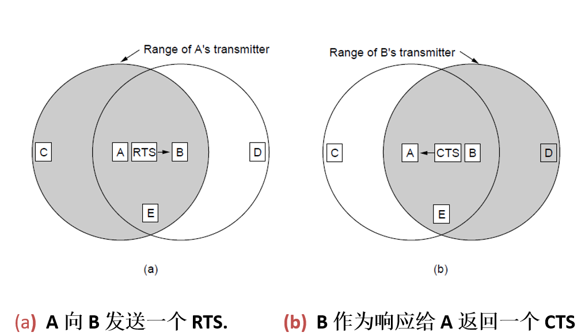

# **第三章 **无线传感器网络

## 3.2 **MAC协议**

**竞争型MAC协议---局部同步local synchronization**

- **IEEE 802.11 MAC层**
- **S-MAC协议**
- **T-MAC协议**

**竞争型MAC协议---异步no synchronization**

- **B-MAC协议**
- **RI-MAC协议**

**调度型（分配型）MAC协议---全局同步global synchronization**

- **TRAMA协议**
- **DMAC协议**

**混合型MAC协议**

- **Z-MAC**
- **Funneling-MAC**

## 3.2.1.1    **IEEE 802.11 MAC层**

### **ALOHA协议**

**Pure ALOHA协议**  

Ø**当站点有数据需要发送时，直接向信道发送数据帧。**

Ø**如果发生数据冲突，发送站点等待随机时间，再进行重发，直到发送成功，或最后放弃。**

**Slotted ALOHA协议**  

Ø**信道上的时间被划分成离散的时隙，其大小相当于帧的传输时间。所有站点的时钟保持同步。站点只有在时隙开始时才能传输数据。**

Ø**只有那些都在同一个时槽进行传输的帧才有可能冲突，冲突危险区比Pure ALOHA降低了一半 。**

### **CSMA（载波侦听多路访问协议）**

**Pure ALOHA和SlottedALOHA都没有利用到以太网和无线分组网的一个主要特性，那就是与帧的传输时间相比，传播时间是很短的：当一个站点发送帧后，具有载波侦听的其它站点很快就会知道。**

**CSMA**

Ø**非坚持CSMA协议（NonpersistentCSMA）**

Ø**1-坚持CSMA协议 （1-persistent CSMA）**

Ø**P-坚持CSMA协议（P-persistent CSMA）**

#### **几种CSMA 协议**

**与ALOHA的区别：提供载波侦听功能**

**节点在发送数据之前，对信道进行侦听，根据信道的忙闲程度再决定是否发送。（更“礼貌”，性能更好）**

- **非坚持CSMA协议**
  - **侦听信道，**
    - **1) 若信道空闲：发送数据帧。**
    - **2) 若信道忙：等待一段随机时间，重新再侦听。**

- **1-坚持CSMA**  **协议** 
  - **侦听信道，**
    - **1) 若信道空闲：发送数据帧。**
    - **2) 若信道忙：仍坚持侦听，一直侦听到信道空闲。**
- **p -坚持CSMA 协议** (**IEEE 802.11无线局域网使用p-坚持CSMA协议的改进版**)
  - **侦听信道，**
    - **1) 若信道空闲：以概率**  **p发送数据帧；以概率**  **1-p**  **延迟一段时间τ，重新侦听。**
    - **2) 若信道忙：仍坚持侦听，一直侦听到信道空闲。**

### **CSMA/CD 带冲突检测的载波侦听多路访问**

**虽然 CSMA 协议能够通过载波侦听减少数据冲突发生的机会，但由于传播时延的存在，仍然不可避免会发生数据冲突。**

**CSMA/CD：在 CSMA 的基础上，增加冲突检测的功能，即站点在传输时能够侦听到是否发生冲突。**

**CSMA/CD 协议思路**

- **当站点侦听到信道空闲时就发送数据，同时继续侦听下去。**
- **冲突检测：站点在传输的同时侦听信道，一旦检测到本站传输帧与别的站点传输帧发生冲突时，立即放弃当前帧的发送（而不是继续完成传输），这样可以使信道很快地空闲下来。**
- **是经典以太网的基础**

### **无线局域网协议**

**隐藏终端问题（hidden station problem）**

**暴露终端问题（exposedstation problem）**

**冲突避免多路访问（MACA, Multiple Access with CollisionAviodance）**

- **RTS（Request To Send）帧**
- **CTS（Clear To Send）帧**

#### **802.11 MAC子层协议**

- **操作模式：分布式协调功能DCF、点协调功能PCF（较少用到）**
- **使用CSMA/CA的虚拟信道侦听，借助于**
- **网络分配向量NAV：记录信道的忙碌时段**
- **图例：**
  - **A发送给B，C在A范围内，D在B范围内、但不在A范围内**

#### **CSMA/CA的基本过程**

- **CSMA/CA（带冲突避免的CSMA）协议**
  - **当一个节点要传输一个无线帧时，它首先侦听信道状态。**
  - **如果信道空闲，而且经过一个帧间间隔时间DIFS，信道仍为空闲，则站点立即开始发送信息。**
  - **如果信道忙，则站点一直侦听信道，直到信道的空闲时间超过DIFS。当信道空闲下来时，节点使用二进制退避算法来避免发生碰撞。**

**802.11提供了几种基本帧间间隔，对应于访问无线信道的优先级。**

#### **无线传感器网络MAC协议概述**

**在设计无线传感器网络的MAC协议时，需要着重考虑以下几个方面：**

**（1）节省能量**

•**满足应用要求下，尽量节省使用节点能量。**

**（2）可扩展性**

•**适应动态变化的网络拓扑。**

**（3）网络效率**

•**包括网络的公平性、实时性、网络吞吐容量以及带宽利用率。**

#### **WSN MAC技术需求**

What is a good MAC protocol for WSNs?

- energy efficiency
- scalability (to the change in network size,nide density and topology)
- fairness
- latency
- throughput
- bandwidth utilization

Major sources of energy waste

- **collision**: increasing latency as well
- **idle listening**: listening to receive possible traffic that is not sent
- **overhearing**: a node picks up packets that are destined to other nodes
- **overhead**：control packet overhead

#### **WSN MAC协议的研究关注点**

- **能量效率**
  - **冲突重传**  **collision and retransmission**
  - **空闲侦听**  **idle listening**
  - **串听**      **overhearing**
  - **控制开销**  **control overhead**
- **可扩展性** 
- **网络效率** 
  - **延迟、吞吐量、公平性…**
- **算法复杂度** 
- **与其它层协议的协同** 

**重要性依次递减！**

#### **WSN MAC协议概述**

**传感器节点无线通信模块的状态包括发送状态、接收状态、侦听状态、休眠状态等。**

- **无线通信模块在发送状态的消耗能量最多，**
- **在休眠状态的消耗能量最少，**
- **接收状态和侦听状态下的能量消耗略小于发送状态。**

**基于上述原因，传感器网络MAC协议为了减少能量的消耗，通常采用“侦听/休眠”交替的无线信道使用策略。**

**为使节点休眠时不错过发给它的数据，或减少节点的过度侦听，邻居节点间需要协调侦听和休眠的周期。**

## 3.2.1.2   **S-MAC协议**

**S-MAC协议：**

**在802.11 MAC协议基础上，针对传感器网络的节省能量需求而提出的传感器网络MAC协议。**

**S-MAC协议假设：通常情况下**

- **传感器网络的数据传输量少,速率较低，**
- **节点协作完成共同的任务，**
- **网络内部能够进行数据的处理和融合以减少数据通信量，**
- **数据传输经常具有方向性，**
- **网络能够容忍一定程度的通信延迟。**

**主要设计目标：提供良好的扩展性，减少节点能量的消耗。**

**针对碰撞重传、串音、空闲侦听和控制消息等可能造成传感器网络消耗更多能量的主要因素，S-MAC协议采用以下机制：**

​	–**周期性侦听/休眠的低占空比工作方式，控制节点尽可能处于睡眠状态来降低节点能量的消耗；**

​	–**邻居节点之间通过协商同步的一致性睡眠调度机制形成虚拟簇，减少节点的空闲侦听时间；**

​	–**通过流量自适应侦听机制，减少消息在网络中的传输延迟；**

​	–**通过“消息传递”（消息分割和突发传递）机制，减少节点的串听和控制消息的开销。**

​	–**尽管每一跳(per-hop)的公平性、延时性能有所降低，但全局(end-to-end)性能不受影响**

### **S-MAC协议──（1）周期性侦听/休眠**

#### **节点按照周期性的侦听/休眠时序工作**

- **节点独立调度（schedule）其工作状态，周期性转入休眠，醒来后侦听信道状态，判断是否需要发送或接收数据。**
- **调度周期：节点的“侦听-休眠”的时序。**
- **占空比：侦听时段/ (侦听+休眠)时段**
- **为了减少能量消耗，节点尽量处于低功耗的休眠状态-->低占空比**

#### **节点周期的同步**

- **调度周期的同步：在相同时间侦听，在相同时间休眠。**
- **希望在相邻节点之间建立同步，以保证可能的收发节点之间具有共同的调度周期。**
- **所以，节点间需要交换各自的调度信息（广播给邻居节点）。**
- **通常只能保持局部的同步，很难做到全网同步。**

#### **相邻节点之间的通信**

- **假设A、C的周期为schedule1，B、D的周期为schedule2**
- **周期相同：A、C按照schedule1交互，B、D按照schedule2交互**
- **周期不同：如果A要和B交互时，则A需要等候B的侦听时间**
- **如果多个A1... Ak要和B交互，则它们需要竞争信道（RTS/CTS）**
- **当节点开始传输数据时，就不用遵守休眠周期了，待传输结束再休眠**

#### **节点的调度信息的创建和维护**

**节点维护一张调度表，用以保存它所有邻居的调度信息**

​	1.**节点监听一段时间，如果没有收到其它节点的调度信息，则随机选择一个将来的休眠时间，并立即使用SYNC报文来广播此调度信息（t 秒后本人将休眠等）。称这类节点为synchronizer。**

​	2.**如果节点在监听时段内收到了其它节点的调度信息，则将自己的调度周期设为此调度信息，然后等待一个随机时间 td之后广播自己的调度信息。称这类节点为follower。**

​	3.**如果节点在已经选择并广播了自己的调度信息后，收到了其它节点的调度信息，则采用所有的调度信息（在所有侦听时间醒来）。**

**有可能两（多）个节点各自独立地创建了调度周期，则位于它们之间的边界节点将会同时采用这两（多）个调度周期**

#### **同步保持**

- **由于时钟漂移的存在，需要在节点之间周期性地重发调度信息，以达到精确同步。**
- **相邻节点之间通过SYNC消息保持同步**
- **SYNC 消息是一个很短的控制分组，它包含有发送节点的地址、及其下一次休眠时间（相对于开始发送SYNC消息的时间）等**
- **当节点接收到SYNC 消息后，将会更新它调度表内的相应条目。**
- **每个节点通过SYNC 消息来定期广播自己的调度信息，可以使新加入的节点与已有节点保持同步。**
- **侦听时间分成两部分，用于 SYNC 分组、DATA 分组的收发**

#### **虚拟簇**

​	–**在一个分布式多跳网络中，实现所有相邻节点休眠时间的同步通常是比较困难的。因此，S-MAC允许一个节点采用多个休眠调度，以使采用不同调度周期的节点可以通过这类节点进行数据转发。**

​	–**通过相邻节点之间的同步，使得周期具有相同调度周期的节点形成一个虚拟簇，簇内节点间可以正常通信。**

​	–**对于具有多个调度周期的节点，成为虚拟簇的边界节点，可以同时与多个虚拟簇的节点通信。**

​	–**S-MAC协议可以形成众多不同的虚拟簇，对大规模部署的传感器网络具有良好的扩展性。**

### **S-MAC协议──（2）消息冲突和串音避免**

**冲突避免**

- **采用 802.11 CSMA/CA，即 RTS/CTS/DATA/ACK 过程**
- **802.11MAC 层的 NAV 虚拟载波侦听 + 物理层的物理载波侦听**

**串音避免**

- **802.11 MAC 由于虚拟载波侦听的需要，要求长期保持对所有邻居流量的侦听，因此串听了大量并非发给它的消息，造成能量浪费，尤其在节点密度大、流量负载重的场合。**
- **S-MAC的串音避免： 当节点收到RTS/CTS ，如果目标不是自己，则进入休眠。**
- **节点的NAV数据可以作为它休眠时间长度的依据之一。**
- **例：A传输数据给B，哪些节点应该休眠以避免串听？**

### **S-MAC协议──（3）自适应侦听**

**流量自适应侦听** 

​	**–传感器网络采用多跳通信,节点的周期性休眠导致通信延迟增加，延迟会随着跳数的增多而累加。利用WSN数据传送的方向性特点，采用流量自适应侦听可以减少通信延迟的累加效应。**

​	**–基本原理： 在一次侦听周期中，当节点邻居节点传输结束后：**

**如果节点（例如C）在这段侦听时间内收到CTS分组，并发现自己正好是通信的下一跳，它就休眠一段时间（此时邻居在接收数据）、并及时醒来，在本调度周期内接收数据，而无需等到下一次调度周期，从而减少了数据的传输延迟。**

**如果节点在这段侦听时间内没有收到给自己的CTS分组，则按时返回休眠状态，直至下一次侦听周期。**

### **S-MAC协议──（4）消息传递**

**消息传递机制**

​	**802.11 MAC 支持将长消息分割成几个短消息进行传送，每次传送都使用 RTS/CTS 以预约一个短消息时间；**

​	**S-MAC 对于长消息采用了专门的消息传递机制：将长消息分割成几个短消息，让它们在预约时间内突发传送，只使用一次RTS/CTS 来预约整个长消息时间。**

​	**接收节点对每个短消息都要发一个 ACK 应答，未收到ACK的发送节点将会重传该短消息。这里的多次ACK具有防止隐藏终端的作用（例：节点醒来或新节点加入、并且它是接收节点的邻居而非发送节点的邻居）。**

**S-MAC 消息传递 vs. 802.11 MAC**

- **802.11 MAC协议的RTS/CTS只预约下一个短消息的时间（公平性），邻居节点必须多次侦听每个短消息的时间。**
- **S-MAC协议的RTS/CTS控制消息和数据消息携带的时间是整个长消息传输的剩余时间（全部预约、分段传输，达到传递长消息时的能量高效），邻居节点仅需一次侦听整个长消息的时间。**
- **因此，S-MAC通过消息传递机制，减少了邻居的串听。**

### **S-MAC协议──小结**

**优缺点**

- **S-MAC协议比IEEE 802.11协议具有更高的能量效率（节省超过90%）、更强的可扩展性，能够更好地适应网络拓扑结构的变化。**
- **但由于采用固定的休眠占空比，信道的带宽利用率受到一定影响；虚拟簇节点使用大量SYNC广播分组，当网络业务负载较大时，控制开销带来的能耗代价将成为负担。**
- **S-MAC协议最主要的缺点是较大的传输迟延，因为它是以牺牲迟延换取能量节省的。**

## 3.2.1.3  **T-MAC协议**

•**T-MAC协议：在S-MAC协议的基础上提出。**

•**传感器网络MAC协议最重要的设计目标是减少能量消耗，而空闲侦听的能量消耗占绝对大的比例，特别是在消息传输频率较低的情况下。**

•**S-MAC协议通过采用周期性侦听/睡眠工作方式来减少空闲侦听，周期长度固定不变，节点的侦听活动时间也是固定。**

•**T-MAC协议中，发送数据时仍为RTS/CTS/DATA/ACK的通信过程，节点周期性唤醒进行侦听，如果在一个给定时间TA(time active)内没有发生下面任何一个激活事件，则活动结束。**

​	-**周期时间定时器溢出**

​	-**在无线信道上收到数据**

​	-**通过接收信号强度指示RSSI感知存在无线通信**

​	-**节点数据包或确认消息发送完毕**

​	-**通过侦听RTS/CTS分组，确认邻居的数据交换已经结束。**

### **S-MAC与T-MAC协议的对比**

### **T-MAC协议的基本数据交换**

•**TA取值**

  **在每个活动期间开始，T-MAC协议按照突发方式发送所有数据。TA决定每个周期最小的空闲侦听时间，它的取值对于T-MAC协议性能至关重要,**

  																	 **TA> C+ R + T**

  **其中，C为竞争信道时间，R、T为发送RTS、CTS分组的时间。**

### **T-MAC协议：早睡问题**

**假设传输方向A→B →C →D。**

**如果节点A通过竞争首先获得发送，A向B发送RTS消息，B应答CTS。**

**C收到B发出的CTS消息而转入睡眠状态，当B接收完数据，节点C醒来以便接收节点B发送给它的数据。**

**D可能不知道A与B的通信存在，在A→B时的通信状态结束后就已经处于睡眠状态，这样，节点C只能等到下一个周期才能传输数据到D。**

**这种通信延迟称为早睡问题（加剧于T-MAC的提前结束活动）。**

#### **1）未来请求发送(future request-to-send, FRTS)**

**当节点C收到B发送给A的CTS分组后，立刻向下一跳D发出FRTS分组。**

**FRTS分组包含节点D接收数据前需要等待的时间长度，节点D要在休眠相应长度时间后醒来接收数据。**

**由于节点C发送的FRTS分组可能干扰节点A发送的数据，所以节点A需要推迟发送数据的时间。节点A通过在接收到CTS分组后发送一个与FRTS分组长度相同的DS (data-send)分组实现对信道的占用。DS分组不包含有用信息。**

**节点A在DS分组之后开始发送正常的数据信息。FRTS方法可以提高吞吐率，但DS分组和FRTS分组带来了额外的通信开销。**

#### **2）满缓冲区优先(full buffer priority)**

**当节点的缓冲区接近占满时，对收到的RTS不作应答，而是立即向目标接收者发送RTS消息，并传输数据给目标节点。**

​	–**节点B向节点C发送RTS分组，节点C因缓冲区快满不发送CTS，而是向节点D发送RTS，将它的（缓冲区内）数据发送给节点D。**

​	–**该方法的优点是减少了早睡问题发生的可能，并起到了一定的网络流量的控制作用，带来的问题是增加了冲突的可能性。**

#### **T-MAC协议：小结**

•**T-MAC协议根据当前的网络通信情况，通过提前结束活动周期来减少空闲侦听，但带来了早睡问题，需要FRTS等方案。**

•**性能对比**

​	–**在负载恒定不变的情况下，T-MAC协议与采用固定占空比的S-MAC协议相比，节能效率相仿；**

​	–**在负载恒定不变的情况下，T-MAC协议与未采用占空比模式的CSMA协议相比，能够节省多达98%的能量；**

​	–**在负载动态可变的情况下，T-MAC协议与S-MAC协议相比，更加节省能量。**

## 3.2.2 **竞争型MAC协议---异步no synchronization**

**上述基于竞争的MAC协议具有良好的扩展性，并且不要求严格的时钟同步，但它们往往只是从发送数据的节点考虑问题，对接收节点的考虑相对较少。**

**在基于竞争的MAC协议中，节点发送数据时竞争使用无线信道，并通知接收节点及时处于接收状态。节点处于休眠状态可能造成通信暂时中断，增大消息的传播延迟，所以在节省节点能量和增大消息延迟之间需要权衡。**

### **竞争型MAC协议：局部同步->异步**

**基于周期性侦听/休眠的方式：减少因空闲侦听造成的能量消耗**

**固定占空比方式（局部同步，S-MAC为例）的缺点**

- **需要依靠大量的控制开销来建立和维护节点间的周期性同步**
- **节点在没有数据收发时，仍然需要在整个侦听周期内保持侦听状态，对网络业务负载变化的适应性较差。**

**异步占空比方式**

- **基于异步周期性侦听/休眠调度机制的协议（B-MAC、RI-MAC 等）**
- **由各个节点独自决定自己的休眠和唤醒时间，不需要在所有节点之间建立和保持同步，只在发送者/接受者有数据需要传送时直接和目标节点建立同步**
- **分类：发送方发起（B-MAC）、接收方发起（RI-MAC）**

### **B-MAC协议**

**采用前导采样（preamble sampling）来实现收/发节点之间的同步，也称为低功耗侦听（LPL）**

**侦听周期Tp是一个重要参数，它直接影响节点的能耗**

- **如果Tp很小，接收节点会因频繁的唤醒侦听而浪费能量**
- **如果Tp很大，发送节点会因传输很长的前导分组而增加能量消耗**

**Preamble长度**

- **为避免分组空传，前导序列长度需要大于接收方的休眠时间**

#### **B-MAC：低功耗侦听LPL的工作原理**

**LPL机制的成功执行依赖于节点对信道状态的准确感知**

**采用空闲信道评估机制（clear channel assessment, CCA）**

**CCA主要考虑无线信道的两个特征：**

- **噪声信号易受环境影响而动态变化**
- **数据包在信道上传输时表现在相对稳定的信道能量**

**因此，不能仅仅依靠单独采样，而是需要一定时间内的多次采样。**

**CCA机制的工作流程**

- **噪声基准估计阶段：发送节点首先进行空闲信道采样，计算和更新噪声基准值。**
- **传输信号检测阶段：发送数据之前，节点需要再次对当前信道信息采样，检测多个连续采样值中是否存在孤立点（低值点）**
  - **如果存在，则认为信道空闲，节点开始发送数据；**
  - **如果不存在，则认为信道忙，节点退避一段时间后再重复上述。**

### **RI-MAC协议**

**任何数据帧的传输都由接收节点发起，即由接收节点发送一个信标分组（beacon）来主动通知发送节点开始数据分组传输。**

## 3.2.3  **调度型（分配型）MAC协议---全局同步global synchronization**

### **竞争型-> 分配型**

**随着网络流量的增大，竞争型的MAC协议中节点发生冲突的概率增大，这样不仅降低了网络带宽利用率，而且浪费大量能量。**

**分配型的MAC协议通常采用TDMA、CDMA、FDMA或者SDMA等技术，将一条物理信道划分为许多子信道，然后将这些子信道根据节点的需求动态或固定（静态）地分配给节点，避免不必要的冲突发生。**

**经常采用TDMA，具有较高的时间同步要求。**

**分配型MAC需要理想的介质和环境，不存在其他竞争网络或行为异常的节点。**

### **TRAMA协议**

**流量自适应介质访问(Traffic adaptive medium access, TRAMA)协议**

- **将信道按时间划分为连续的时隙**
- **每个节点掌握其两跳范围内的邻居节点信息**
- **采用分布式选举机制确定每个时隙的无冲突发送者：**
- **根据节点的ID号及当前时隙号，各节点利用哈希函数分布式地计算出所有节点在每个时隙上的优先级，并将当前时隙分配给优先级最高的节点。**
- **同时，通过避免将时隙分配给没有业务流量的节点，让没有通信任务的节点转入休眠状态。**

#### **TRAMA协议的三部分**

**（1）邻居协议NP（neighbor protocol)** 

**NP协议在随机访问周期内执行，节点间通过NP协议需要获得一致的两跳邻居拓扑结构及各节点的业务流量信息。**

**协议要求节点周期性通告自己的编号ID，是否有数据需要发送以及能够直接通信的邻居节点的相关信息，并实现节点间的时间同步。**

**（2）调度交换协议SEP（schedule exchange protocol)** 

**SEP协议用来建立和维护发送者和接收者的调度信息。在调度访问周期内，节点周期性地通过调度分组向邻居广播它的调度信息。**

**（3）自适应选举算法AEA（adaptive election algorithm)** 

**AEA用来通过计算两跳范围内所有节点的优先级，分布式地决定各个节点在当前时隙内的活动策略（发送、接收、休眠）。**

**节点s在时隙t的优先级通过伪随机的哈希函数计算：**

 **priority(s, t) = hash(s∙t)**

**各节点最终确定的在每个时隙上优先级最高的优胜节点是一致的。**

#### **TRAMA协议的时隙组织**

**连续时隙组成的信道被划分为周期性交替的随机访问阶段（包含通告时隙）、调度访问阶段（包含传输时隙）**

**随机访问阶段主要用于网络维护，如节点失效、新节点加入引起的网络拓扑结构变化**

**调度访问阶段用于确定每个时隙的发送者和接收者，实现无冲突的数据传输**

### **DMAC协议**

**DMAC协议的基本思想**

 	**传感器网络中一种重要的通信模式是多个传感器节点向一个汇聚节点发送数据。所有传感器节点转发收到的数据，形成一个以汇聚节点为根节点的树型网络结构，称为采集树(data gathering tree)。**

  	**在基于竞争方式的MAC协议中,节点采用周期性的活动/休眠策略来减少能量消耗，但会出现数据在转发过程中“走走–停停”的通信停顿问题。在数据采集树结构中，这种传输延迟会随着路径上的跳数比例增加。**

  	**DMAC协议就是针对这种数据采集树结构提出的，目标是减少数据的传输延迟和网络的能量消耗。**

#### **DMAC协议的工作原理**

**DMAC的核心思想是采用交错调度机制。**

**将节点划分为接收时间，发送时间和睡眠时间。其中接收时间和发送时间相等，均为发送一个数据的分组时间。**

**每个节点的调度具有不同的偏移，下层节点的发送时间对应上层节点的接收时间。这样，数据能够连续地从数据源节点传送到汇聚节点，减少在网络中的传输延迟。**

## 3.2.4  **混合型MAC协议**

**同时包含了竞争型协议和分配型协议设计要素**

- **通过周期性分配型的MAC协议的优点减少空闲侦听、碰撞重传；**
- **发挥竞争型协议的灵活性和低复杂性。**

**但是，设计难度大，实现困难。**

**典型的协议主要有 Z-MAC、Funneling-MAC，二者均为 CSMA 与 TDMA 的混合型 MAC 协议**

### **Z-MAC协议**

**协议运行包含两个阶段**

- **启动阶段：发现邻居，获得两跳网络拓扑，时隙分配**
- **运行阶段：对节点进行传输控制**

**在低流量条件下使用CSMA信道访问方式，可提高信道利用率并降低延时；**

**在高流量条件下使用TDMA信道方式，可减少冲突和串听。**

**特点：**

- **适合于中、高网络流量的传感器网络应用，具有比传统TDMA协议更好的可靠性和容错能力**
- **在最坏情况下，性能接近于CSMA。**
- **缺点：启动阶段的初始化操作复杂，局部范围通信量大，并且需要全局时间同步，节点有时存在隐藏终端问题。**

### **Funneling-MAC协议**

**传感器网络常见的单跳传输、多跳聚合的通信方式，造成sink附近的数据传输量大，容易发生冲突、拥塞和丢包，这种现象被称为漏斗效应（funneling effect）。**

#### **Funneling-MAC协议的工作原理**

**协议基本思想：全网采用CSMA，漏斗区域采用TDMA**

**工作过程**

- **节点默认采用CSMA，局部TDMA由sink节点发起。**
- **当网络中的流量达到一定程度时，sink广播信标分组（beacon）触发TDMA。**
- **收到信标分组的节点称为F-节点，采用CSMA和TDMA结合通信。**
- **F-节点所在的区域称为强度区域，其范围由sink节点根据网络的实时流量情况，通过控制信标分组的发送功率动态调节。**
- **为实现同步，所有的F-节点在收到信标分组时统一初始化时钟。**
- **Sink节点负责F-节点的时隙调度。**
- **协议采用超帧结构。**

#### **Funneling-MAC协议的超帧结构**

**一个超帧由一个CSMA帧和一个TDMA帧构成，两个信标分组之间包含多个超帧。**

**F-节点依靠sink节点广播的信标分组将自己的时钟与超帧同步，使用CSMA帧和TDMA帧交替访问信道。**

- **CSMA帧**
  - **通信过程中临时产生的新数据，还没有被分配通信时隙**
  - **网络中突发性的事件信息、实时性要求高的控制信息**
- **TDMA帧**
  - **各个F-节点在分配的时隙内转发数据**
- **Sink节点的时隙分配表紧随信标分组发送**

