# 第三章 无线传感器网络

## 3.3 路由技术

### **关于路由协议**

- **路由协议的任务**
  - **负责将数据分组从源节点通过网络转发到目的节点。**
- **路由协议的功能**
  -  **（1）寻找源节点和目的节点间的优化路径；**
  -  **（2）将数据分组沿着优化路径正确转发。**

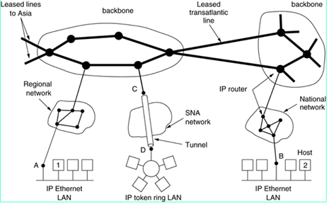

​	**路由协议的核心是路由选择算法。不同的路由选择算法通常会采用不同的评价因子及权重来进行最佳路径的计算，Internet路由协议常见的评价因子包括带宽、可靠性、延迟、负载、跳数和费用等。**

### **有线Internet网络中的路由**

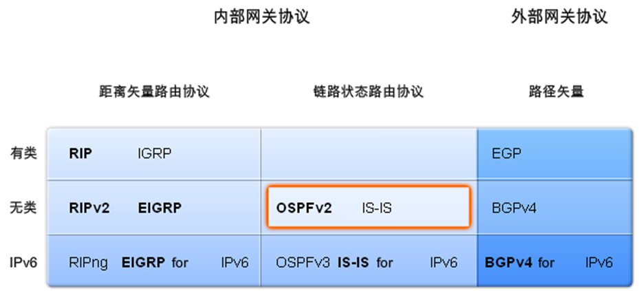

### **自组织网络（Ad Hoc Networks）**

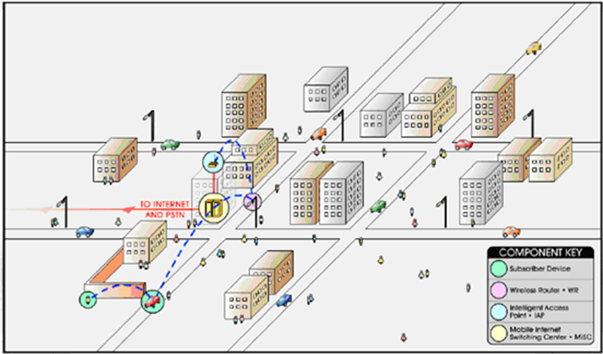

#### Ad Hoc 网络的特点 

•独立组网

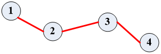

​	不需要任何预先网络基础设施

•动态拓扑

​	节点移动/开机/关机

​	节点无线发送功率变化、无线信道干扰或者地形等因素影响

•自组织

​	无控制中心

​	节点故障不会影响到整个网络

> 节点之间通过无线连接形成的网络拓扑结构随时可能发生变化，而且变化的方式和速度可能都是无法预测的

•多跳路由

​	接收端和发送端可使用比两者直接通信小得多的功率进行通信，因此节省了能量消耗

​	通过中间节点参与分组转发，能够有效降低对无线传输设备的设计难度和成本，同时扩大了自组织网络的覆盖范围

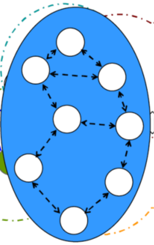

#### 传统的路由协议不适用于Ad Hoc 网络

- 动态变化的网络拓扑结构
  - 节点加入、离开、移动等
  - 路由算法还未收敛,网络拓扑结构就发生变化
- 有限的系统带宽、能量等资源
  - 周期性地公告路由信息严重降低系统的性能
- 间歇性的网络分割
  - 传统路由协议容易形成路由回路
- 单向的无线传输信道
  - 传统路由协议一般假设链路是对称的

> •适应网络动态变化
>
> •减少路由开销
>
> •引入按需路由
>
> •在路由时考虑能量等约束条件

#### Ad Hoc 路由协议分类

- **表驱动(先验式proactive)**
  - **Up-to-date routing information maintained**
  - **Routing overhead independent of route usage**
- **按需路由(反应式reactive)**
  - **Routes maintained only for routes in use**
  - **Explicit route discovery mechanism**
- **混合路由（Hybrid Protocols）**
  - **Combination of proactive and reactive**

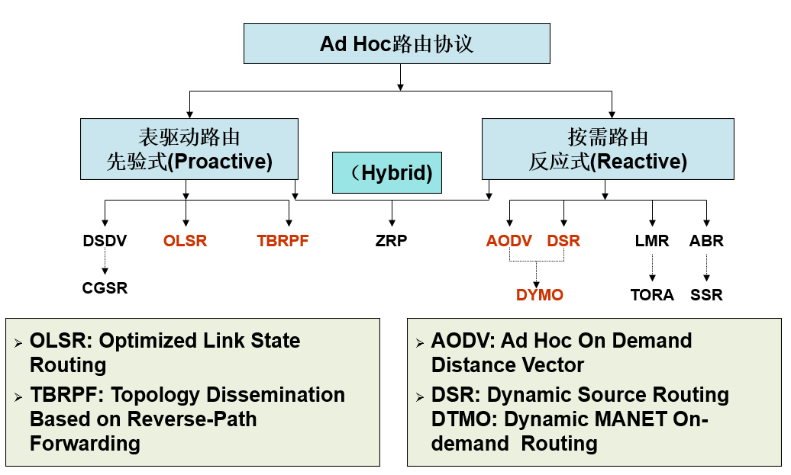

##### **表驱动（Table Driven）路由**

先验式(Proactive)路由

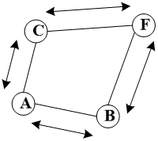

- 传统的分布式最短路径路由协议

  - 链路状态或者距离向量
  - 所有节点周期性更新“可达”信息

- 每个节点维护到网络中所有其它节点的路由

- 所有路由都已存在并且随时可用

- > 路由延时小，但是路由开销大

- DSDV、OLSR、TBRPF

##### **按需（On-demand）路由**

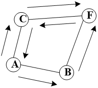

- 反应式(Reactive)路由

  - 源节点根据需要通过路由发现过程来确定路由

  - 控制消息采用泛洪（Flooding）方式

  - > 路由延时大，但是路由开销小

- 两种实现技术

  - 源路由（分组携带完整的路由信息）
  - 逐跳（Hop-by-Hop）路由

- DSR、AODV、DYMO

##### **混合路由**

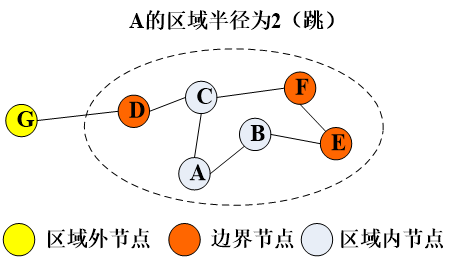

- Ad Hoc网络划分为区域
  - 每个节点在区域内部采用表驱动路由
  - 对于区域外节点采用按需路由
- 簇和区域的不同
  - 簇内所有节点都与簇首直接通信，簇内节点间的通信一般是两跳
  - 区域的大小没有限制，区域内的节点通信可以多跳
- ZRP：Zone Routing Protocol

> 减少了域内的路由延时
>
> 减少了域外的路由开销
>
> 区域半径的选择
>
> - 小: 节点移动快的密集网络
> - 大: 节点移动慢的稀疏网络

#### Example Ad Hoc Network

**AODV(Ad hoc On Demand Vector routing)按需距离矢量路由协议**

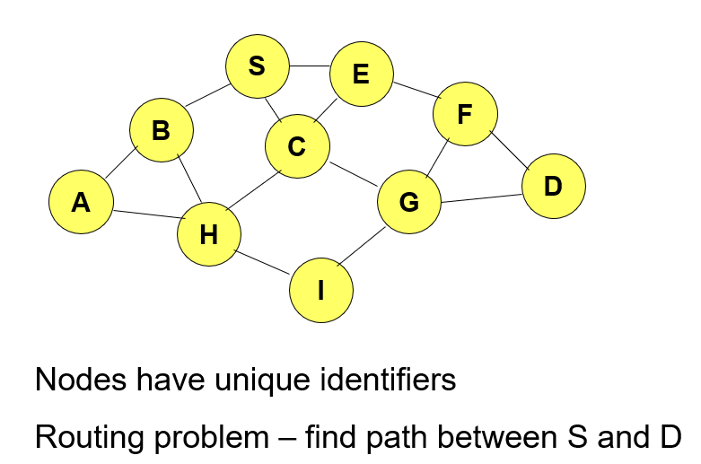

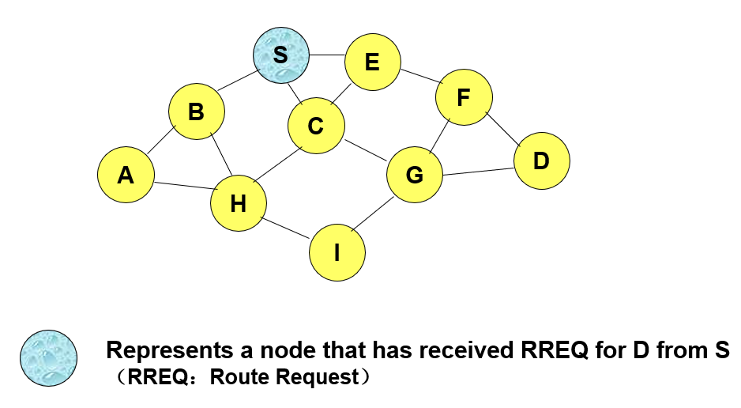

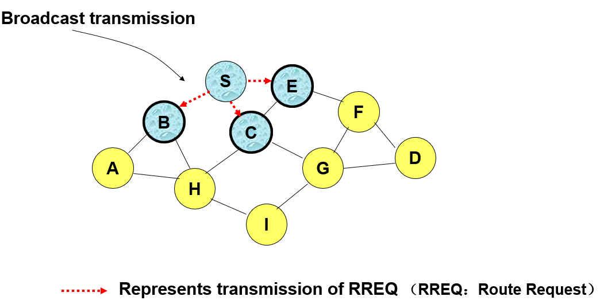

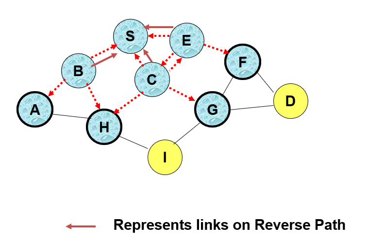

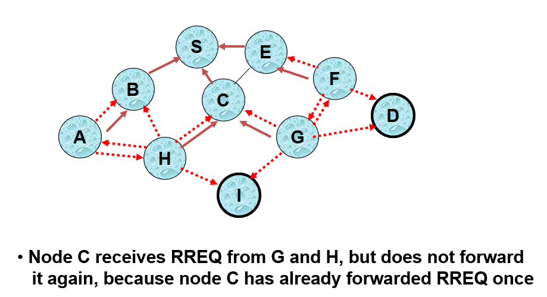

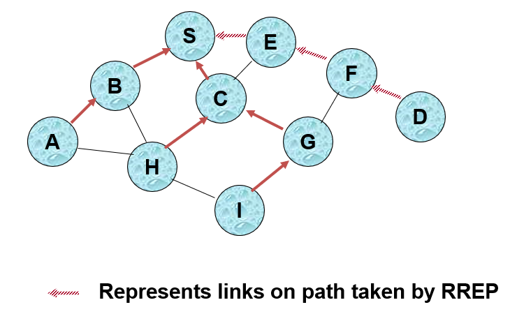

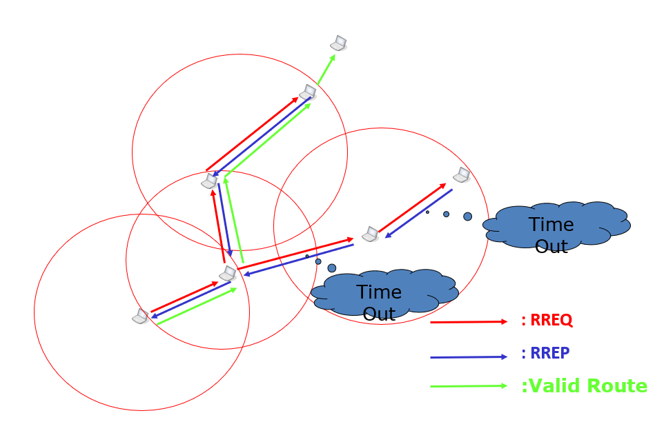

## **WSN特点对路由协议设计的影响**

无线传感器网络的路由协议

（1）能量优先：考虑节点能耗，高效利用能量；

（2）基于局部信息：在局部网络拓扑信息的基础上选择合适的路径；

（3）以数据为中心：路由机制与数据融合技术结合；

（4）应用相关：应用千差万别，无通用的路由协议。

### **能量感知路由**

#### **能量感知路由的考虑因素**

**根据节点的可用能量(power available, PA)或传输路径上的能量需求，选择数据的转发路径。**

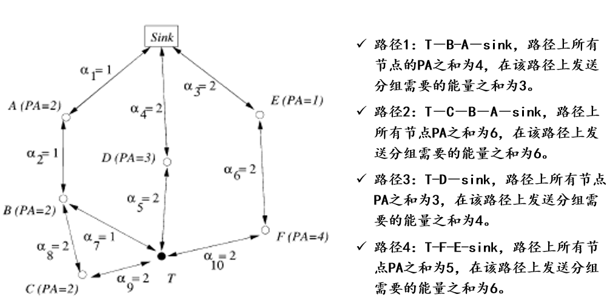

#### 能量路由策略

**最少跳数路由：选取从数据源到汇聚节点跳数最少的路径。选择路径3。**

**最小能量消耗路由：从数据源到汇聚节点的所有路径中选取节点耗能之和最少的路径。选择路径1。**

**最大PA路由：从数据源到汇聚节点的所有路径中选取节点PA之和最大的路径。路径2、路径4的PA之和最大，但路径2包含路径1，不是高效的从而被排除。选择路径4。**

**最大最小PA节点路由：选择路径可用能量最大的路径（每条路径中可用能量最小的节点来表示这条路径的可用能量）。最大最小PA节点路由策略就是，选择路径3。**

#### **最小功率路由**

 在连接两个节点的所有路径中，选择路径总功率值最小的一条路径。

 很多情况下，无线节点具备功率控制能力，即可以根据不同的通信相邻状况选择合适的发送功率。采用最小功率路由协议，能够使得发送单个数据所消耗的功率最小化。

链路(i,j)成功传送单位数据所消耗的功率：

>  P_Tx = E + K_ⅹd_ijα
>
>  P_Rx = E
>
>  P(i, j) = P_Tx + P_Rx = 2E + K_ⅹd_ijα
>
> 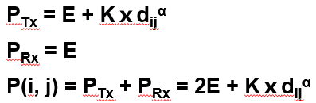

一条连接源节点i和目的节点j的路径上传送单位数据所消耗的总功率值等于组成该路径各条链路的功率值之和：

>  C(s, d) = Σ P(i, j),  all (i, j) ∈P, i ≠ j

 当节点具备全局网络信息时，最小功率路径可以通过最短路算法或距离向量路由算法求得。

##### **最小功率路由– PARO协议**

工作原理：

​	发送节点首先用最大功率直接与接收节点通信。

​	如果某个节点监听到收发节点之间的通信，并认为如果自己充当中间转发节点能够有效降低端到端功率损耗，则发送一个信令消息通知收发节点并加入到路径之中。

​	持续这一过程，直到不存在这样的节点，或者这样做的增益小于给定的一个门限值。

优点：局部性和简单性

缺点：

​	要求节点最大功率能够覆盖全网，并且其启发式路径计算过程并不保证能够找到全局最优路径。

​	倾向于选择短链路组成的路径，导致路径跳数较多，传输延迟较大。

​	如果不考虑节点移动、链路动态等因素，则连接两个节点的最小功率路径是固定的，导致流量集中，网络中某些节点率先耗尽能量而失效。

#### **最大剩余能量路由**

 在连接两个节点的所有路径中，选择瓶颈节点剩余能量最大的一条路径。

 路径 P 的剩余能量为：

  EP = min{ Ex | x ∈ V(P)}

- 在无线传感器网络的工作过程中，随着网络中节点的能量消耗，连接相同节点对的最大剩余能量路径也将随时间而变。
- 因此，最大剩余能量路由具有平衡网络中节点能量消耗的作用。
- 但是并没有考虑每分组端到端能耗的最小化。
- 最小功率路由的选择和最大剩余能量路由的选择是相互独立的。

#### **最小不情愿度路由**

一个节点x充当一条路径上中间转发节点的不情愿度的定义：

 *f* (*x*) = 1/*Ex*

 （ Ex ：节点x的剩余能量，且归一化，分布在(0, 1] 区间内。）

路径P的不情愿度定义为该路径上所有中间节点的不情愿度之和：

 *f* (P) =  Σ *f* (*x*),  all x ∈V(P)

连接一对源节点和目的节点的最小不情愿度路径是所有路径中不情愿度 *f* (P) 最小的那条。

Minimum Reluctance Routing 协议

- **采用方法与AODV协议的寻径过程类似；**
- **路径代价为节点剩余能量倒数之和；**
- **源节点向网络洪泛一条寻径信令，携带已走过路径的代价（初值为0）；**
- **中间节点如果收到多个信令，从中选择代价最小的一个；**
- **中间节点转发该信令时，将自己剩余能量的倒数加到路径代价之上。**

#### **基于组合能量代价的优化路由**

采用更为复杂的组合链路代价函数，使得路由选择过程能够同时考虑链路功率和节点能耗的优化，以延长网络寿命。

对于网络 G(V, E),每条链路的不情愿度定义为

 *f* (*x*) = *p*(i, j) / *Ej*2,  all (i, j) ∈E(G)

（ *p*(i, j) 为从 i 到 j 传送单位长度数据所需的最小功率。*E**j* 为剩余能量*。*）

 既考虑了如何降低端到端发送功率，又平衡了网络中节点的剩余能量。

结合链路分组传输成功率，进一步考虑链路的期望传输次数 T(i,j),进一步修正链路不情愿度为

 *f* (*x*) = *p*(i, j) · *T*(i, j) / *Ej*2,  all (i, j) ∈E(G)

 （ 其中 *T*(i, j) 为链路（i, j）传输成功率的倒数。）

  式中分子表示链路成功传输一个分组时发送方所消耗的期望能量。

**可以结合各个候选下一跳节点距离目的节点的欧氏距离对剩余前向路径的路径代价进行估算，从而估算出经过每个候选下一跳节点到目的节点的端到端路径代价，再从中选择最小的一个。**

### **以数据为中心的路由**

- **洪泛协议Flooding** 
  - **泛洪式路由协议。**
  - **缺点：内爆，数据重叠，资源浪费。**
- **闲聊协议Gossiping** 
  - **改进：非广播，随机选择一个或多个相邻节点进行数据转发，在节点密集的情况下减轻了内爆。**
  - **缺点：路径非最优，数据重叠，增加传输延迟。**
- **SPIN协议**
- **定向扩散路由Directed Diffusion**

#### **SPIN协议**

**工作原理**

- **协商：节点先发送元数据，协商确定其它节点是否需要该数据，再根据情况发送数据。**
- **门限：基于门限的能量自适应机制。先检测自身的剩余能量，看情况而启动协商过程。**
- **消息类型：广告（ADV），请求（REQ），数据（DATA）**
- **优点：实现简单（只需知道一跳内信息），解决内爆、数据重叠等问题。**
- **缺点：数据有时不能转发，较远节点无法得到；不保证传送可靠性**

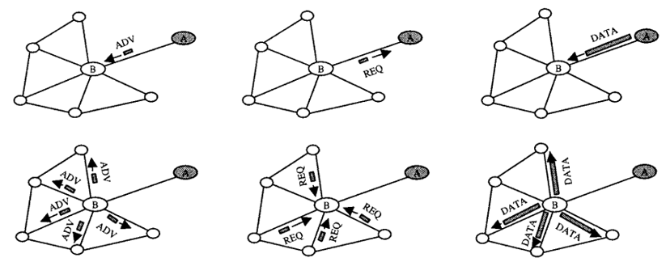

#### **DirectedDifussion(DD)定向扩散路由**

**工作原理：**

**汇聚节点通过兴趣消息发出查询任务，采用泛洪方式传播兴趣消息到整个区域或部分区域内的所有传感器节点。在兴趣消息的传播过程中，协议逐跳地在每个传感器节点上建立反向的从数据源点到汇聚节点的数据传输梯度，传感器节点将采集到的数据沿着梯度方向传送到汇聚节点。**

**周期性的三个阶段：兴趣扩散、梯度建立、路径加强。**

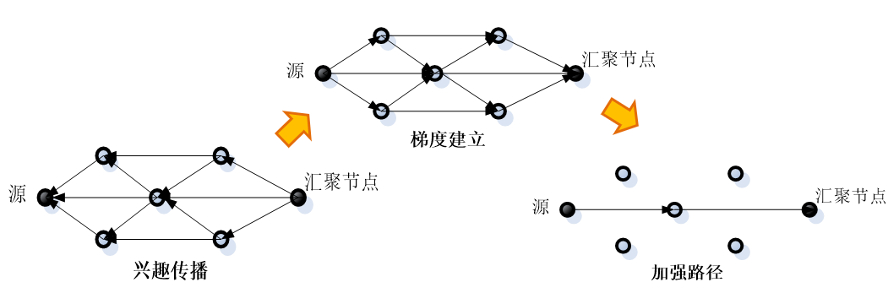

##### **定向扩散路由的要素**

**组成元素**

- **数据（data）:以属性数值对命名**
- **兴趣（interest）:对已命名数据的感知任务**
- **梯度（gradient）:节点到兴趣消息传播路径中上游邻居节点的链路的任务相关性数值或度量**
- **事件（event）:事件发生后，事件信息会沿着多条路径向兴趣的发出节点转发**
- **加强（reinforcement）:一种从多条向汇聚节点发送感知数据的传输路径中选择一条优化路径的机制**

##### **定向扩散路由的任务、兴趣**

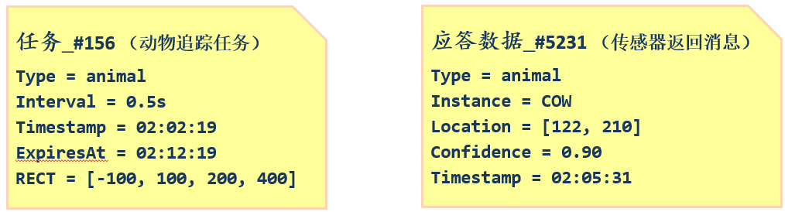

##### **节点维护的兴趣列表**

- **每个节点都在本地保存一个兴趣列表**
  - **兴趣表项：发来该兴趣消息的邻居节点、数据发送速率、时间戳等任务相关信息**
  - **每个兴趣可能对应多个邻居节点**
- **节点收到邻居节点的兴趣消息时，首先检查兴趣列表**
  - **如果有对应的表项： 更新表项的失效时间**
  - **如果只是参数类型相同，但不包含发送该兴趣消息的邻居节点： 在相应表项中添加这个邻居节点**
  - **其它情况：建立一个新表项来记录这个新的兴趣**
- **如果收到的兴趣消息和节点刚转发的兴趣一样，为避免消息循环则丢弃该信息；否则，转发收到的兴趣消息**

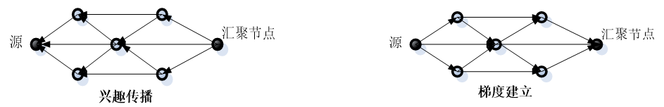

##### 定向扩散路由机制的三个阶段

**兴趣扩散阶段：汇聚节点周期性地向邻居节点广播兴趣消息。兴趣消息中含有任务类型，目标区域，数据发送速率，时间戳等参数。逐跳地在每个传感器节点上建立从数据源点到汇聚节点的数据传输梯度。**

**梯度建立（数据传播）阶段：当传感器节点采集到与兴趣匹配的数据时，把数据发送到梯度上的邻居节点，并按照梯度上的数据传输速率设定传感器模块采集数据的速率。**

**路径加强阶段：兴趣扩散阶段是为了建立源节点到汇聚节点的数据传输路径，数据源节点以较低的速率采集和发送数据，称这个阶段建立的梯度为探测梯度。汇聚节点在收到从源点发来的数据后，启动建立源节点的加强路径，后续数据将沿着加强路径以较高的数据速率进行传输。加强后的梯度称为数据梯度。**

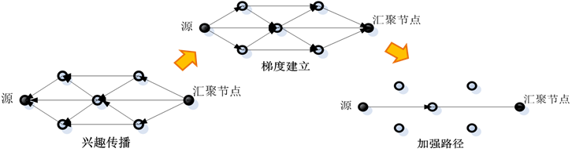

##### 定向扩散路由的路径加强机制

**假设以数据传输延迟作为路由加强的标准，汇聚节点选择首先发来消息的邻居节点作为加强路径的下一跳节点，向该邻居节点发送路径加强消息。路径加强消息包括新设定的较高发送数据速率值。邻居节点收到消息后，经过分析确定该消息描述的是一个已有的兴趣，只是增加了数据发送速率，则断定这是一条路径加强消息，从而更新相应兴趣表项到邻居节点的发送数据速率。同时，按照同样的规则选择加强路径的下一跳邻居节点。**

**路由加强的标准不是唯一的，可以选择在一定时间内发送数据最多的节点作为路径加强的下一跳节点，也可以选择数据传输最稳定的节点最为路径加强的下一跳节点。在加强路径上的节点如果发现下一跳节点的发送速率明显减小，或者收到来自其他节点的新位置估计，推断加强路径的下一跳节点失效，就需要使用上述的路径加强机制重新确定下一跳节点。**

##### 定向扩散路由的特点

**定向扩散路由是一种典型的以数据为中心的路由机制。汇聚节点根据不同应用需求定义不同的任务类型、目标区域等参数的兴趣消息，通过向网络中兴趣传播消息启动路由建立过程。中间传感器节点通过兴趣表建立从数据源到汇聚节点的数据传输梯度、自动形成数据传输的多条路径。按照路径优化的标准。定向扩散路由使用路由加强机制生成一条优化的数据传输路径**

**但是，定向扩散路由在路由建立时需要一个兴趣扩散的洪泛传播，能量和时间开销都比较大，尤其是当底层MAC协议采用休眠机制时可能造成兴趣建立的不一致。**

#### Rumor 谣传路由

有些传感器网络应用中，数据传输量较少，此时定向扩散路由并不是高效的路由机制。谣传路由适用于数据传输量较小的传感器网络。

基本思想是：事件区域中的传感器节点产生代理，代理消息沿随机路径向外扩散传播，同时汇聚节点发送的查询消息也沿随机路径在网络中传播。当代理消息和查询消息的传输路径交叉在一起时，就会形成一条汇聚节点到事件区域的完整路径。

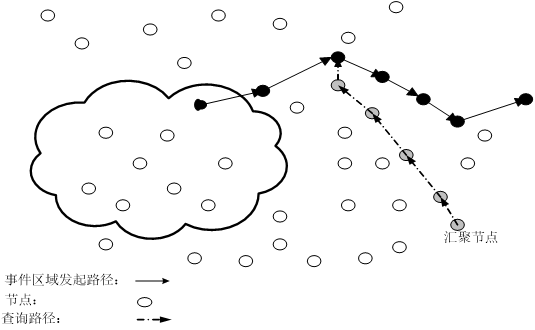

优点： 代理消息、查询消息的单播随机转发，克服了使用泛洪方式建立转发路径带来的开销过大问题。

缺点：传输路径一般不是最优路径，并可能存在路由环路问题。

### **地理位置信息路由**

   **地理位置信息路由假设节点知道自己的地理位置信息，以及目的节点或者目的区域的地理位置，利用这些地理位置信息作为路由选择的依据，节点按照一定策略转发数据到目的节点。地理位置信息的精确度和代价相关，在不同的应用中会选择不同精确度的位置信息来实现数据的路由转发。**

- **基于位置的分组转发机制**
-   **从所有比当前节点更靠近目的节点的邻居中，选择下一跳合适节点。**
  - **最近邻选择法（短程多跳、降低能量消耗）**
  - **最接近目的节点选择法（减少总跳数、降低延迟）**
- **最大剩余能量节点选择法（能耗均衡、延长网络寿命）**
- **空洞绕行技术**
  - **局部最小节点，空洞区域，**
  - **GPSR协议（贪婪+绕行）**
- **基于曲线的路由技术**
  - **TBR (Trajectiry-Based Routing)协议**
  - **采用不同曲线（最靠近曲线、沿曲线前进距离最大、随机），提供多样性路径，达到流量均衡；控制路径长度；不受节点移动影响。**

#### **GPSR路由（Greedy Perimeter Stateless Routing）**

**根据节点自身位置和数据包目标位置来确定转发策略。**

**包含两个工作模式**

​	–**贪婪转发（greedy forwarding）：当节点收到数据包时，贪婪（局部最优）地选择离目标节点位置最近的邻居节点作为下一跳**；

- **只需知道节点位置，不需要维护路由，节省了协议开销**
- **路由空洞：每个节点只根据自身的邻居信息来选择下一跳，可能会出现节点周围没有比距离目标节点比自己更近的邻居节点，导致数据包无法继续转发。**

​	–**空洞绕路（perimeter forwarding）：当节点没有离目标节点更近的邻居节点时（称为路由空洞），它使用右手法则绕过空洞区域。**

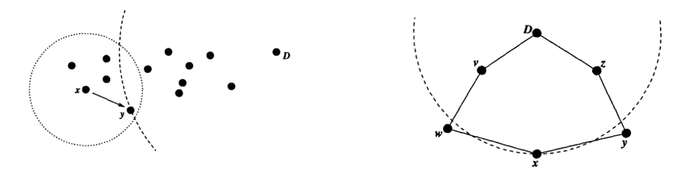

##### **GPRS中的空洞绕路**

**右手法则：分组总是沿着输入边逆时针方向的下一条边转发。**

–**在区域内部使用右手法则时，行进路线沿顺时针方向；**

–**在区域外部使用右手法则时，行进路线沿逆时针方向。**

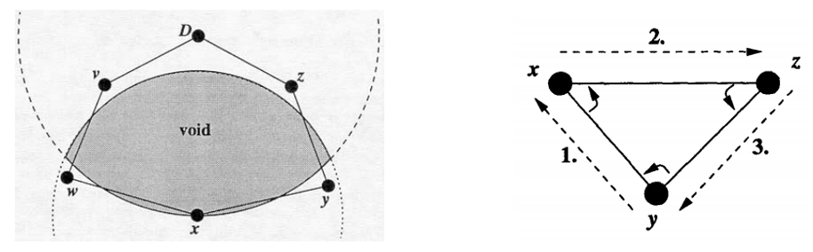

**两种工作模式的切换**

**贪婪转发->空洞绕路：当节点邻居中没有更靠近目标节点的节点时，按照空洞绕路策略转发分组。**

**空洞绕路->贪婪转发：当一个邻居节点到目标节点的距离比目标节点到开始进行空洞绕路时节点的距离更近，就切换回贪婪转发模式**

##### **工作原理**

**在数据查询类应用中，汇聚节点需要将查询命令发送到事件区域的所有节点。GEAR路由机制根据事件区域的地理位置信息，建立汇聚节点到事件区域的优化路径，避免了洪泛传播方式，从而减少路由开销。**

**GEAR路由假设已知事件区域的位置信息，每个节点知道自己的位置信息和剩余能量信息（及已消耗能量信息），并通过一个简单的HELLO消息交换机制将此信息发布给所有邻居节点。节点间的无线链路是对称的。**

**GEAR路由中查询消息传播包括两个阶段。**

**（1）sink发出查询命令，并根据事件区域的地理位置和节点能量消耗，将查询命令传送到区域内距汇聚节点最近的节点；**

**（2）获得查询命令的节点将查询命令传播到区域内的其他所有节点。**

**来自查询区域内的监测数据沿着查询消息的反向路径传送到sink。**

> GEAR 路由： 1）查询消息传送到事件区域 -- 路径选择
>
> **节点N维持自身到事件区域R的实际代价h(N, R)，并定时广播给邻居节点。**
>
> **每当节点T需要转发一个目的为R的分组时，T中选取到R的代价最小的一个邻居作为下一跳节点。**
>
> **即T根据所有邻居节点的h(Ni, R)值选取最小值Nmin**  **，并更新其自身的h(T, R)** 
>
> **h(T, R) =h(Nmin,R) + C(T,Nmin)**
>
> **但在网络初始阶段，还未建立从sink到R的路径，节点没有实际代价，此时T计算邻居节点的估计代价c(N, R)作为代替。**
>
> **节点N到事件区域R的估计代价c(N, R)，定义为节点到事件区域几何中心的距离d(N, R)（归一化）、节点已消耗能量e(N)（归一化）的加权平均：**
>
>  **c(N, R)**  **=α∙ d(N, R)+(1 -α) e(N)**      **0 <α< 1为 比例参数**
>
> **（归一化：d(N, R)、e (N)分别按照邻居节点中的最大d值、最大e值取1按比例换算。）**
>
> **c(N, R)的意义：考虑当邻居节点的（1）耗能值相同时；（2）距离值相同时**
>
> **每跳如此操作，形成一条到达事件区域的查询路径。**
>
> 
>
> GEAR 路由： 1）路径选择 -- 实际代价修正
>
> **查询信息到达事件区域后，节点沿查询路径反方向传输监测数据。在此过程中，中间节点需要修正它们的实际代价。**
>
> **为此，数据消息中捎带一个能耗字段（初始为0），数据消息传输每经过一个节点时，节点将自身传送消息到下一跳的能耗值累加在能耗字段上，然后转发到下一跳节点。能耗字段值实际上就是从节点发送分组到事件区域的总能耗。**
>
> **下一次转发查询消息时，用节点记录的实际能耗值代替上述公式中的d(N, R)，计算它到事件区域的实际代价h(T, R)。节点用调整后的实际代价h(T, R)选择到事件区域的优化路径。**
>
> 
>
> GEAR 路由： 1）查询消息传送到事件区域 -- 空洞绕行
>
> 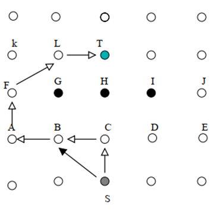
>
> **图例：从S开始的路径建立过程，采用上述的贪婪算法。**
>
> **局部最优，有可能陷入路由空洞（C是S的邻居节点中到目标T实际代价最小的节点，但G,H,I为失效节点，C的所有邻居到目标T的实际代价都比C大）。**
>
> **路径调整方法：**
>
> - **节点C选取邻居节点中实际代价最小的节点B作为下一跳节点，并将自己的实际代价值设为B的实际代价加上C到B一跳通信的代价，并将此通知S。**
> - **当节点S再转发查询命令到节点T时就会选择B而不是C作为下一跳节点。**
>
> **或者使用相邻两跳节点的地理位置信息。**
>
> 
>
> GEAR 路由： 2）查询消息在事件区域内传播
>
> - **当查询命令传送到事件区域后，如何传播到区域内所有节点**
> - **洪泛方式：适用于事件区域内节点少时，路由效率高。**
> - **迭代地理转发策略：适用于事件区域内节点多时，消息转发次数少。**
>   - **将本区域划分为若干子区域，并转发查询命令...以此迭代直至子区域仅一个节点。**
> - **当查询命令到达区域内第一个节点时，如果该节点的邻居数量大于一个预设的阈值，则使用迭代地理转发，否则使用洪泛方式。**
>
> 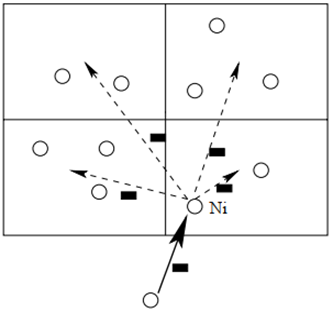
>
> **GEAR路由中假设节点的地理位置固定或变化不频繁，适用于节点移动性不强的应用环境。**

**例：在GEAR路由的区域外查询消息传播阶段，节点S有邻居节点A、B、C，它们到事件区域几何中心的距离分别为150、120、90，节点能耗值分别为3、5、10，加权系数设为0.7。试问节点S选取哪个节点作为下一跳？**

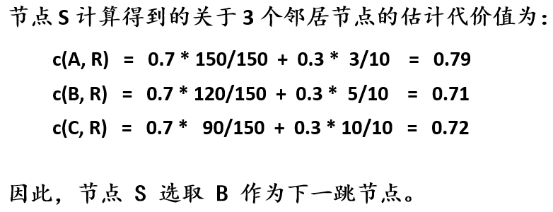

### **多径路由**

**在传感器网络中，引入多路径路由是为了（1）提高数据传输可靠性、和（2）实现网络负载平衡。当主路径失效时，退而使用次优路径转发。在多路径路由中，如何建立数据源节点到汇聚节点的多条路径是首要问题。**

**基本思想：首先建立从数据源节点到汇聚节点的主路径，然后再建立多条备用路径；数据通过主路径进行传播，同时利用备用路径低速传送数据来维护路径的有效性；当主路径失效时，从备用路径中选择次优路径作为新的主路径。**

**两种算法：不相交多路径（disjoint multipath）和缠绕多路径（braid multipath）**

#### **不相交多路径法**

**不相交路径是指从源节点到目的节点之间存在多条路径，但任意两条路径，除源节点和目标节点外都没有相交的节点。**

**采用定向发散DD路由，sink先洪泛兴趣消息形成传输梯度，然后建立源节点到sink的多条路径**

- **sink首先通过主路径增强消息建立主路径，然后发送次优路径增强消息给次优节点A，节点A再选择自己的最优节点B，把次优路径增强消息传递下去。**
- **如果B在主路径上，则B发回否定增强消息给A，A选择次优节点传递次优增强消息；如果B不在主路径上，则B继续传递次优路径增强消息，直到构造一条次优路径。**
- **同样方式，可继续构造下一跳次优路径。**

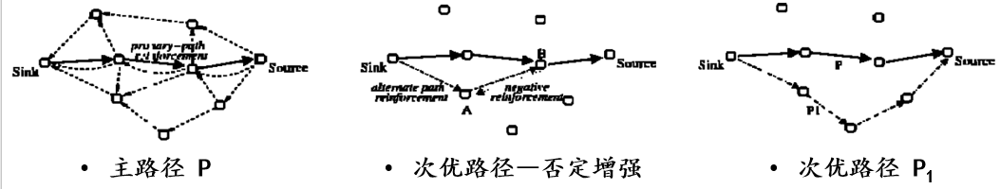

#### **缠绕多路径法（部分不相交）**

**理想缠绕多路径（一次建立、节点需要知道全局网络拓扑信息）**

**理想缠绕多路径由一组缠绕路径形成；一条缠绕路径对应于主路径上的一个节点，在网络不包含该节点时，形成从源节点到目的节点的优化备用路径。主路径上每个节点都有一条对应的缠绕路径。**

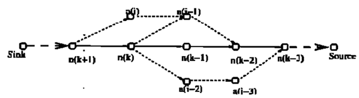

**局部缠绕多路径（逐步探索、节点仅需局部信息）**

**建立主路径后，主路径上的每一个节点（除了源端和靠近源端的节点）都要发送备用路径增强消息给自己的次优节点A，次优节点A再寻找其最优节点B传播该备用路径增强消息。如果节点B不在主路径上，将继续向自己的最优节点传播，直到与主路径相交形成一条新的备用路径。**

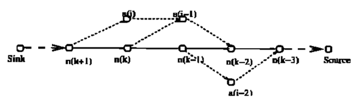

#### **多径路由：可靠路由**

**多径路由可以克服主路径上单个节点失效的问题。备用路径之间具有不同的优先级，当主路径失效时，次优路径将被激活成为新的主路径。因此，少量节点失效并不影响网络功能正常执行。**

**但是，网络内的部分节点需要保存多条路径信息，增加了存储开销和协议复杂度。**

**传感器节点由于有限能量供应和工作环境恶劣经常面临失效问题，而某些应用对于数据传输的可靠性提出了较高要求。可靠路由协议主要从两个方面考虑**

- **一是利用节点的冗余性提供多条路径以保证通信可靠性**
- **二是建立对传输可靠性的估计机制，从而保证每条传输的可靠性。**

### **QoS路由**

#### **MMSpeed(Multi-path Multi-SPEED)协议**

**MMSPEED是在SPEED基础上提出的一种同时考虑传输延迟和丢包率的QoS路由协议。**

- **SPEED仅能支持一种速率要求，而MMSPEED可以同时支持不同应用的多种速率；**
- **SPEED不考虑端到端传输的可靠，而MMSPEED在速率的基础上，还支持不同的端到端可靠性要求；**
- **SPEED没有考虑估计误差对端到端延迟的影响，MMSPEED在每一跳节点上都需要进行速率补偿和可靠性补偿，不断纠正由于估计误差造成的影响。**

**协议包括两个基本组件：时延控制、可靠性控制**

##### **MMSPEED的两个基本组件**

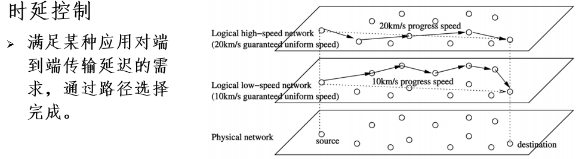

**速度层次：双层优先级保障**

- **多个转发队列的不同优先级：高优先级能够更快转发**
- **利用跨层设计（MAC层），高优先级节点的发包间隔更短、回退窗口更小，更容易抢占信道。**

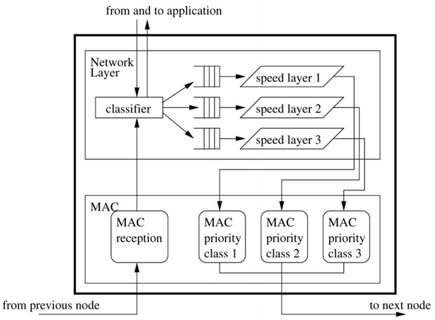

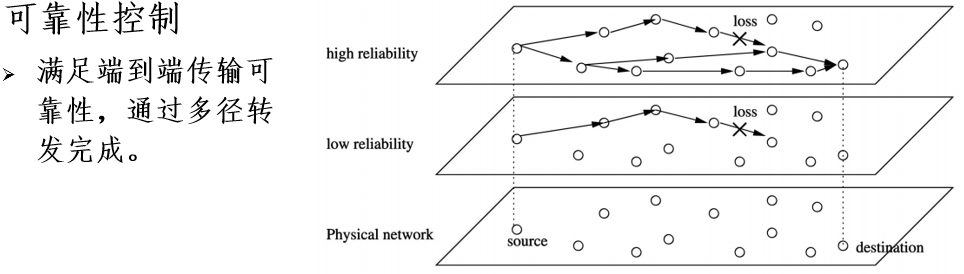

- **通过多径传输实现**
- **节点i估算它通过j到sink的端到端收包率RP = ( 1 –eij)n，n为估计跳数** 
- **每个节点都动态选择一到多条转发路径来满足数据流的可靠性要求**
- **由一路分为多路时，每条路径上要求满足的端到端收包率会降低**

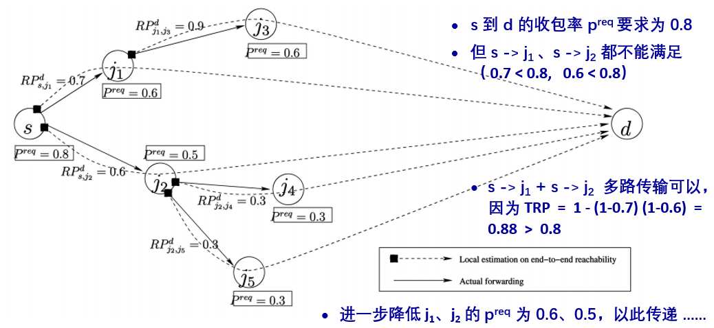

## **无线传感器网络路由协议特点**

**（1）能量优先。传统路由协议在选择最优路径时，很少考虑节点的能量消耗问题。而无线传感器网络中节点的能量有限，延长整个网络的生存期成为传感器网络路由协议设计的重要目标，因此需要考虑节点的能量消耗以及网络能量均衡使用的问题。**

**（2）基于局部拓扑信息。无线传感器网络为了节省通信能量，通常采用多跳的通信模式，而节点有限的存储资源和计算资源，使得节点不能存储大量的路由信息，不能进行太复杂的路由计算。在节点只能获取局部拓扑信息和资源有限的情况下，如何实现简单高效的路由机制时无线传感器网络的一个基本问题。**

**（3）以数据为中心。传统的路由协议通常以地址作为节点的标识和路由的依据，而无线传感器网络中大量节点随机部署，所关注的是监测区域的感知数据，而不是具体哪个节点获取的信息，不依赖于全网惟一的标识。传感器网络通常包含多个传感器节点到少数汇聚节点的数据流，按照对感知数据的需求、数据通信模式和流向等，以数据为中心形成消息的转发路径。**

**（4）应用相关。传感器网络的应用环境千差万别，数据通信模式不同，没有一个路由机制适合所有的应用，这是传感器网络应用相关性的一个体现。设计者需要针对每一个具体应用的需求，设计与之适应的特定路由机制。**

## **无线传感器网络路由机制的要求**

**（1）能量高效。传感器网络路由协议不仅要选择能量消耗小的消息传输路径，而且要从整个网络的角度考虑，选择使整个网络能量均衡消耗的路由。传感器节点的资源有限，传感器网络的路由机制要能够简单而且高效地实现信息传输。**

**（2）可扩展性。在无线传感器网络中，检测区域范围或节点密度不同，造成网络规模大小不同；节点失败、新节点加入以及节点移动等，都会使得网络拓扑结构动态发生变化，这就要求路由机制具有可扩展性，能够适应网络结构的变化。**

**（3）鲁棒性。能量用尽或环境因素造成传感器网络节点的失败，周围环境影响无线链路的通信质量以及无线链路本身的缺点等，这些无线传感器网络的不可靠性要求路由机制具有一定的容错能力。**

**（4）快速收敛性。传感器网络的拓扑结构动态变化，节点能量和通信带宽等资源有限，因此要求路由机制能够快速收敛，以适应网络拓扑的动态变化，减少通信协议开销，提高消息的传输效率。**