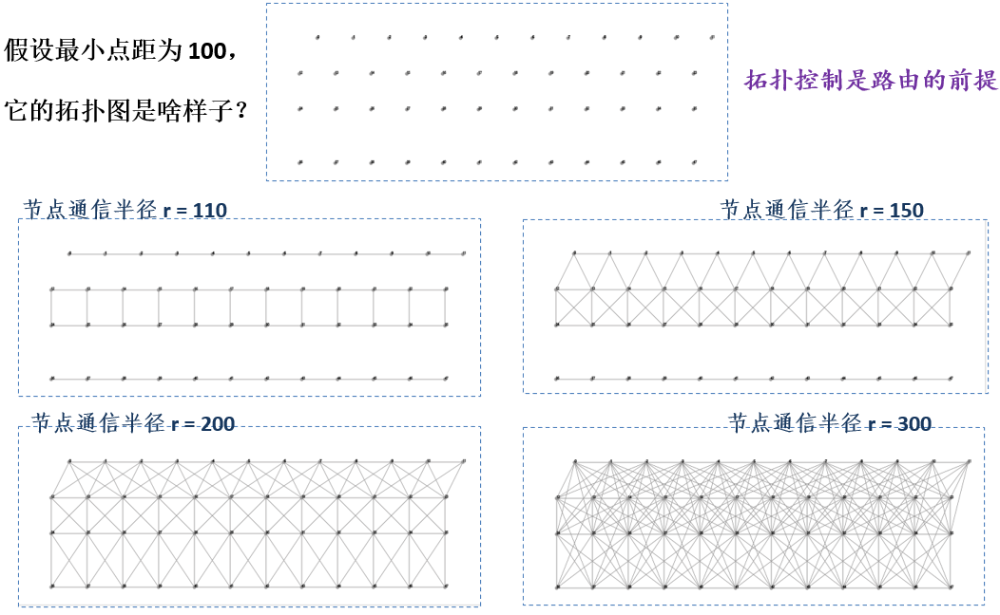
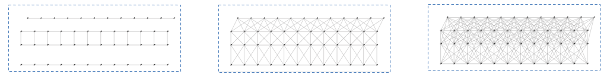
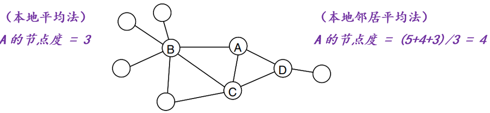
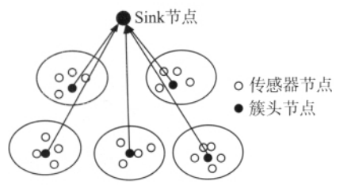
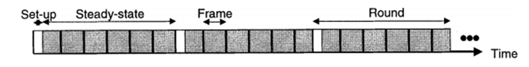
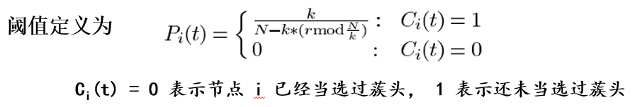
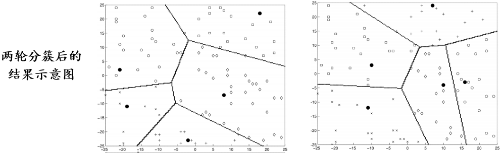
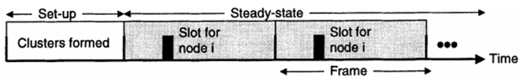

# 第三章 无线传感器网络

## 3.4 拓扑控制

### **为什么要做拓扑控制**

### **概述**

**传感器网络拓扑控制主要研究的问题是：在满足网络覆盖度和连通度的前提下，通过功率控制和骨干网节点的选择，剔除节点之间不必要的通信链路，形成一个数据转发的优化网络结构。**

**传感器网络中的拓扑控制技术主要有：节点功率控制、分簇（层次型拓扑结构）、睡眠控制等。**

- **功率控制机制调节网络中每个节点的发射功率，在满足网络连通度的前提下，均衡节点的单跳可达邻居数目。**
- **层次型拓扑控制利用分簇机制，让一些节点作为簇头节点，由簇头节点形成一个处理并转发数据的骨干网，其他非骨干网节点可以暂时关闭通信模块，进入休眠状态以节省能量。**

**拓扑控制在WSN/IoT中的主要作用：**

**（1）影响整个网络的生存时间。拓扑控制的一个重要目标就是在保证网络连通性和覆盖度的情况下，尽量合理高效地使用网络能量，延长整个网络的生存时间。**

**（2）减小节点间的通信干扰，提高网络通信效率。**

**（3）为路由协议提供基础。传感器网络中，只有活动的节点才能进行数据转发，而拓扑控制可以确定由哪些节点作转发节点，同时确定节点间的邻居关系。**

**（4）影响数据融合。传感器网络中的数据融合指传感器节点将采集的数据发送给骨干节点，骨干节点进行数据融合、并把融合结果发送给数据收集节点。而骨干节点的选择是拓扑控制的一项重要内容。**

**（5）弥补节点失效的影响。传感器节点可能部署在恶劣环境中，在军事应用中甚至部署在敌方区域中，所以很容易受到破坏而失效。这就要求网络拓扑结构具有鲁棒性以适应这种情况。**

### **功率控制**

**传感器网络中节点发射功率的控制也称为功率分配问题。节点通过设置或动态调整节点的发射功率，在保证网络拓扑结构连通、双向连通或者多连通的基础上，使得网络中节点的能量消耗最小，延长整个网络的生存时间。**

 **（1）基于节点度的功率控制：一个节点的度数是指所有距离该节点一跳的邻居节点的数目。基于节点度算法的核心思想是给定节点度的上限和下限需求，动态调整节点的发射功率，使得节点的度数落在上限和下限之间。基于节点度的算法利用局部信息来调整相邻节点间的连通性，从而保证整个网络的连通性，同时保证节点间的链路具有一定的冗余性和可扩展性。**

 **（2）基于邻近图的功率控制**

 **（3）基于方向的功率控制**

 **（4）基于干扰的功率控制**

#### **功率控制--基于节点度的算法**

**基于节点度的算法包括：本地平均法和本地邻居平均法**

##### **本地平均法**

 **(1)初始阶段，所有节点采用相同的发射功率Pt，每个节点周期性地广播一个包含自己ID的LifeMsg消息**

 **(2)当节点接收到LifeMsg消息后,回复一个包含LifeMsg中节点ID的应答消息LifeAckMsg**

 **(3)节点在下一次广播 LifeMsg 之前，检查已经收到的 LifeAckMsg 消息，计算出自己的节点度 n0**

  **(4)每个节点根据自己的节点度和设定的上限nmin、下限nmax调整发射功率。**

   **当nmin< n0<nmax:**  **节点保持发射功率不变**

  **当n0<nmin:**   **Ptnew= min (BmaxPt,Ainc(nmin– n0) Pt)**

  **当nmax< n0:**   **Ptnew= max(BminPt,Adec(1 / (n0–nmax)) Pt)**

##### **本地邻居平均法**

- **本地邻居平均法与本地平均法类似，唯一的区别是在邻居数NodeResp的计算方法上。**
- **本地邻居平均法中，节点发送LifeAckMsg消息时，将自己的邻居数放入消息中，发送LifeMsg的节点在收集完所有LifeAckMsg消息后，将所有邻居的邻居数求平均值作为自己的邻居数。**
- **上述两种算法对节点要求不高，不需要严格的时间同步，通过少量的局部信息交互达到一定的优化效果。但存在邻居节点判决条件等问题。**

### **分簇：层次型拓扑结构控制**

**层次型（分簇）vs.平面型路由**

**考虑依据一定机制选择某些节点作为骨干网节点，打开其通信模块，并关闭非骨干节点的通信模块，由骨干节点构建一个连通网络来负责数据的路由转发。这样既保证了原有覆盖范围内的数据通信，也在很大程度上节省了节点能量。**

**在这种拓扑管理机制下，网络中的节点可以划分为骨干网节点和普通节点两类。骨干网节点对周围的普通节点进行管辖。**

**这类算法将整个网络划分为相连的区域，一般称为分簇算法。骨干网络节点是簇头节点，普通节点是簇内节点。**

**由于簇头节点需要协调簇内节点的工作，负责数据的融合和转发，能量消耗相对较大，所以分簇算法通常采用周期性地选择簇头节点的做法以均衡网络中的节点能量消耗。**

#### **LEACH（lowenergyadaptiveclusteringhierarchy）低功耗低时延分簇层次路由协议**

**是第一个基于多簇结构的层次路由协议**

**LEACH分簇的执行过程是周期性的，每一轮对簇头节点进行轮换，达到分散各节点能量消耗、延长网络生命周期的目的。**

**每轮循环分为簇的建立阶段+数据传输阶段**

- **在簇的建立阶段：随机产生簇头，邻近节点动态地形成簇；**
- **在数据传输阶段：簇内节点把数据发送给簇头，簇头进行数据融合并把结果发送给汇聚节点。**

**LEACH算法能够保证各节点等概率地担任簇头，使得网络中的节点相对均衡地消耗能量。**

#### **LEACH算法：簇的建立阶段**

**假设网络中有 N 个节点，期望在每一轮中形成 k 个簇（重新选举 k 个蔟头）。**

**每个节点i产生一个 0-1 之间的随机数，如果这个数小于阈值Pi(t)，则该节点当选成为蔟头。（因此，Pi(t)相当于节点成为簇头的概率。）**

**新蔟头向邻居节点广播一个自己成为簇头的通告消息(CHA,cluster-head-advertisement) 。**

**非蔟头节点根据收到CHA消息信号的强弱来决定加入哪个簇，即选择接收信号强度 (RSSI) 最大的蔟头加入，并且发送一个 Join-Request 消息回复该蔟头。**

**蔟头收到 J-R 消息后，回复一个调度消息，告知分配给该节点的TDMA 时隙。**

**在所有的簇内节点都接收到 TDMA 调度消息后，簇的建立阶段结束。**

**如果某节点已经当选过簇头，则设置Pi(t)为 0，这样该节点不会再次当选。**

**对于未当选过簇头的节点，随着选举轮数 r 的增大，当选概率Pi(t)的值也会随之增大；**

**最后一轮时，所有未当选过蔟头的节点的Pi(t)值等于 1，一定当选。**

#### **LEACH算法：数据传输阶段**

**稳定阶段**

- **簇内节点在各自分配的时隙内向蔟头节点发送数据，其它时间睡眠，以减少能量消耗。**
- **蔟头节点需要一致保持活跃状态，接收所有簇内节点的发送数据，进行数据融合后，将处理结果发送给汇聚节点。**

**LEACH采用分布式的机制实现分簇，所有节点等概率地担任蔟头，并且结合了高效的MAC协议体系，在网络生存时间、吞吐量和延迟等性能上都有良好的表项。**

**但是，LEACH的蔟头选举机制没有考虑节点的具体地理位置，不能保证蔟头均匀分布在网络中，簇的大小也可能差异很大，从而造成节点的负载不均衡。**

## 总结

**LEACH协议是应用较广泛、较成熟的一种WSN分簇路由协议**

**TEEN、PEGASIS、Multihop-LEACH、ILEACH、LEACH-Mobile、CBR等协议都是在LEACH协议的基础上发展起来**