# **第五章5G简述**

## **5.1**  **5G体系结构**

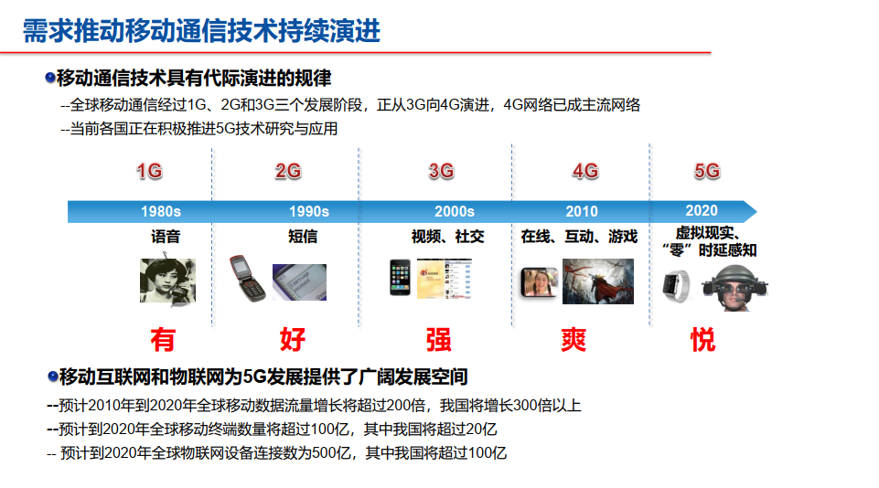

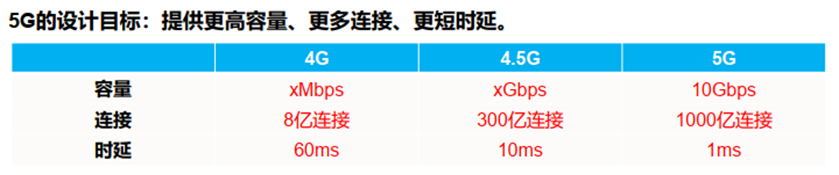

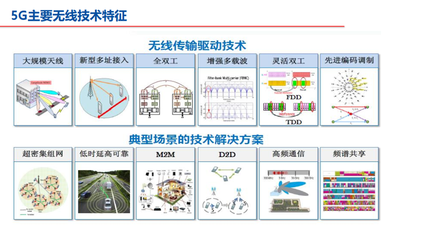

### 5G网络的三大场景及其QoS需求

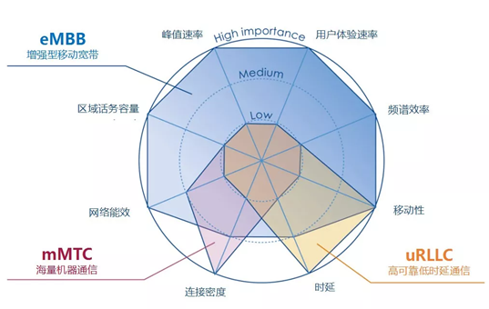

**增强型移动宽带（eMBB）:** 面向个人消费市场的核心应用场景。主要关注峰值速率、容量、频谱效率、移动性、网络能效等指标，和传统的3G和4G类似。

**海量机器通信（mMTC）**：数据速率较低且时延不敏感，连接覆盖生活的方方面面，快速促进各垂直行业（智慧城市、智能家居、环境监测等）的深度融合。主要关注连接数，对下载速率，移动性等指标不太关心。

**高可靠低时延通信（uRLLC）**：面向车联网、工业控制、远程医疗等高安全、高可靠应用场景。主要关注高可靠性、移动性和超低时延，对连接数，峰值速率，容量，频谱效率，网络能效等指标都没有太大需求。

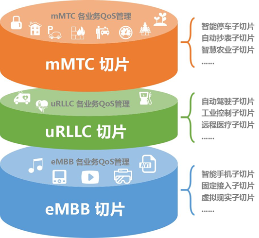

### 5G 全网架构

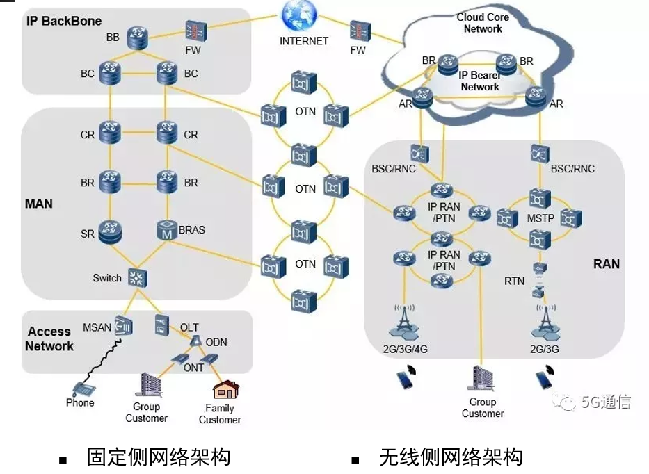

5G网络（接入网+承载网+核心网）

整个通信网的逻辑架构：

-  手机→接入网→承载网→核心网→承载网→接入网→手机

1G 到 5G 的逻辑架构基本不变，技术演变

n无线接入网 

##   5.2   无线接入网**RAN（Radio Access Network）**

**无线接入网（RAN）：把所有的手机终端，都接入到通信网络中的网络**

**一个基站，通常包括BBU（主要负责信号调制）、RRU（主要负责射频处理），馈线（连接RRU和天线），天线（主要负责线缆上导行波和空气中空间波之间的转换）**

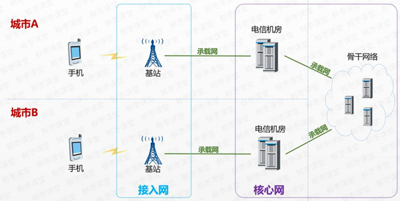

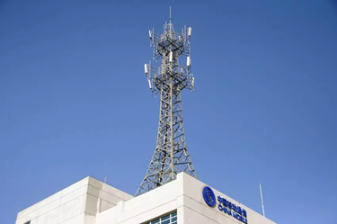

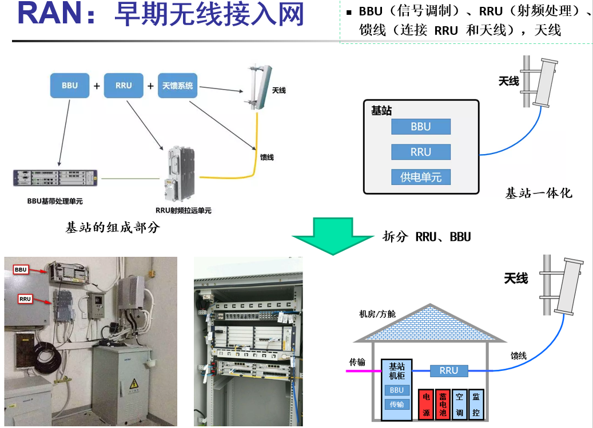

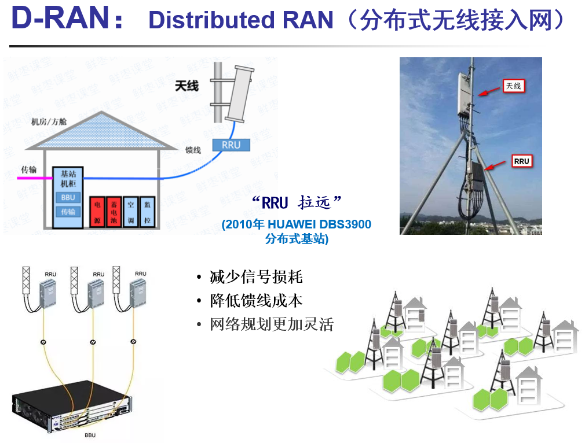

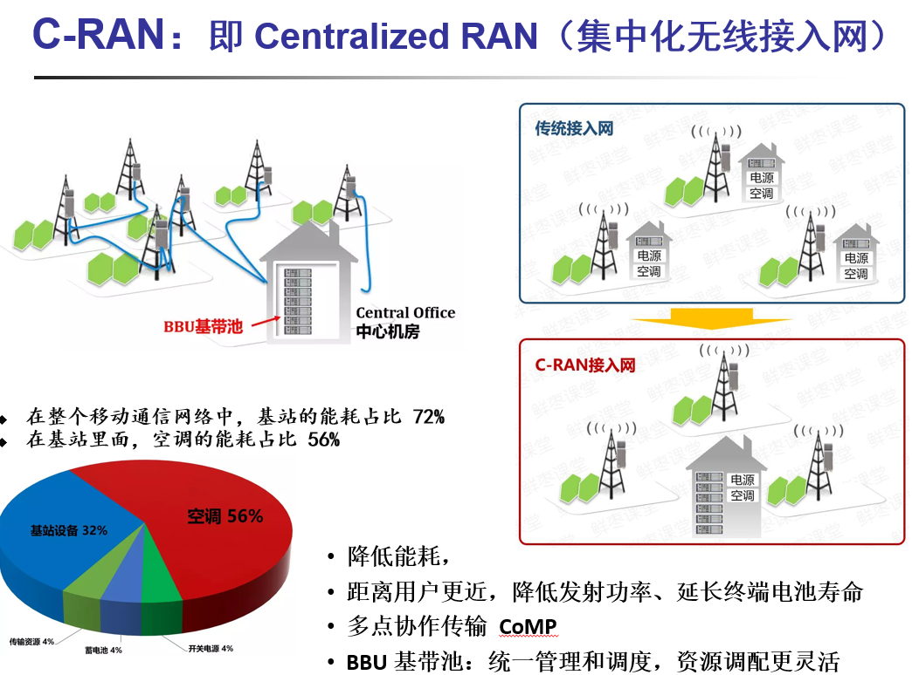

### **网元功能虚拟化（NFV）**

**位于CO（中心机房）的BBU基带池，可以进行虚拟化**

**BBU从专门、昂贵的硬件设备，到通用服务器（在虚拟机上运行具备BBU功能的软件）**

## 5.3  **5G组网模式**

- **非独立组网NSA**
- **独立组网SA**

### 3GPP 5G 架构标准中的组网模式

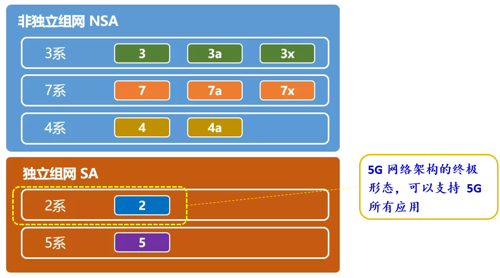

**5G组网模式**

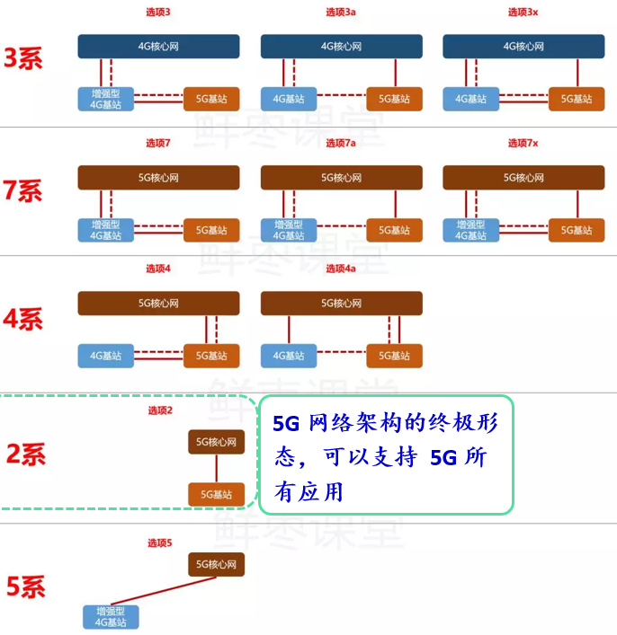

### **5G网络架构演进的两条路径**

**路径1：独立组网、一步到位**，直接上选项2终极形态。这是土豪的最爱，也是中国移动、联通和电信共同的选择。

**路径2：非独立组网、渐进投资**。选项1 → 选项3x → 选项7x → 选项4 → 选项2，中间的步骤都是可选的。

## 5.4  6G 愿景需求及技术

### **从5G到6G的典型场景演进**

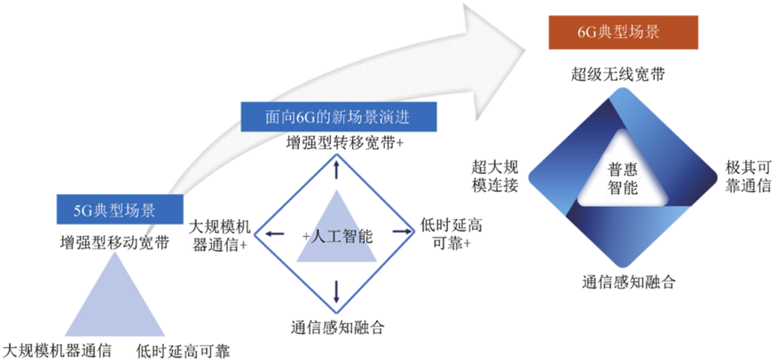

### **5G、6G的性能对比**

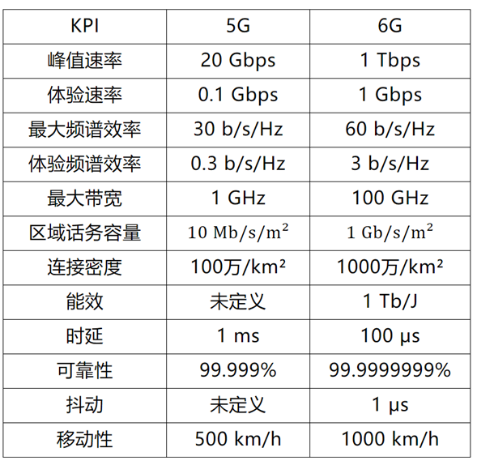

### **6G主要关键技术**

- 太赫兹通信技术
- 无线网络架构
- 人工智能与无线通信的融合
- 感知通信融合
- 智能超表面
- . . . . . .

### **6G使能的物联网**

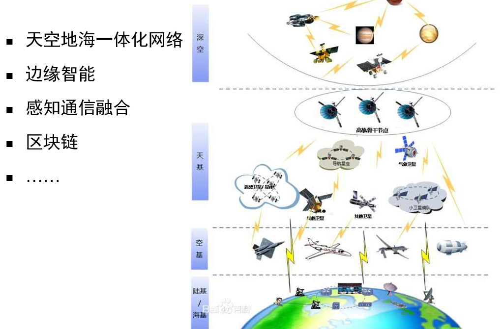