# 一.简介

在去年很长的一段时间里，我的主力机配置都是r5 5600+ Msi b450m mortar max+ Radeon RX 6700xt 12g组成的3A平台

因为一些原因到今年还是换成了比较普遍的I U+N卡，最近逛咸鱼时发现二手平台上的所谓Intel第一张显卡DG1~~实际上有更早的i740 GPU（Real3D i740 Starfighter），鱼上也有卖的，不过是AGP协议的（可见于上学期的嵌入式系统课）~~掉到了200元以内，看了下参数感觉还是比较符合亮机卡的水平的，于是买了一张来作为收藏......顺便搭建一下3I平台来增添一点信仰值。这和我不多添100r买带核显的12400而买12400F绝没有半毛钱的关系/(ㄒoㄒ)/。

头图和内容无关，不是Arc独显买不起，而是Xe亮机卡更有性价比。

报一报参数，DG1共有两个版本，一种是80eu的普通版，~~我的就是~~，另一种是96eu的max版本，在咸鱼价钱稍微贵一些，但其实性能相差也不大，这两样都和移动端非HX的Xe核显一样（12XXXHX 32eu;12450H 48eu；12500H/12600H 80eu;12700H/12900H 96eu），比桌面端的Xe强不少(UHD710,16EU,如G7400;UHD730,24EU如12100/12400/13100/13400;UHD750/UHD770,32EU，12500+/13500+/14600k+)

下面就看看实物图吧，看着薄薄一片，实则被动散热铁皮分量够，其实还挺重的

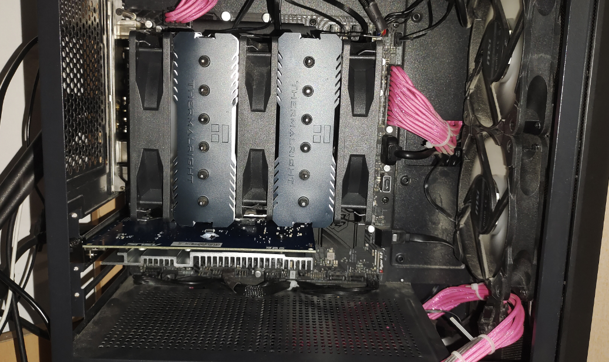

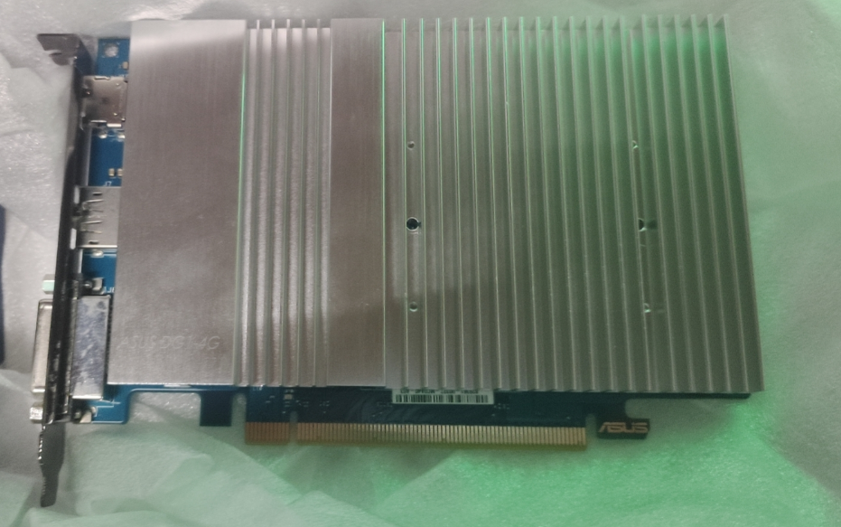

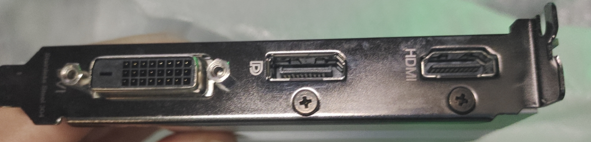

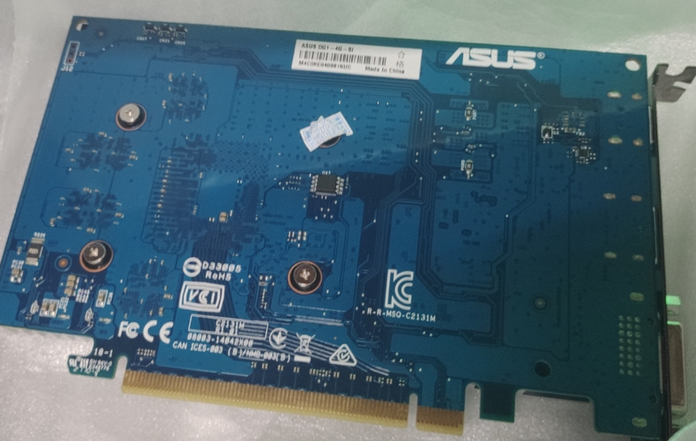

# 二.点亮

关于I卡，一般都得在10代以上平台使用，还要关csm，开above 4G和Resizable bar这三样设置才行。然而DG1根本不支持开rebar，可有可无。

好在我使用的12代平台直接插上就能亮机，无需过多设置。

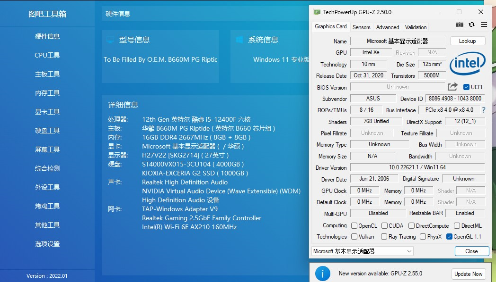

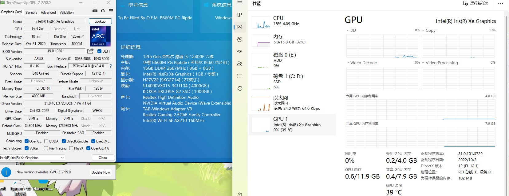

图吧工具箱识别显存大小不对，GPUZ的频率也不对。。。

然后手动去官网打驱动

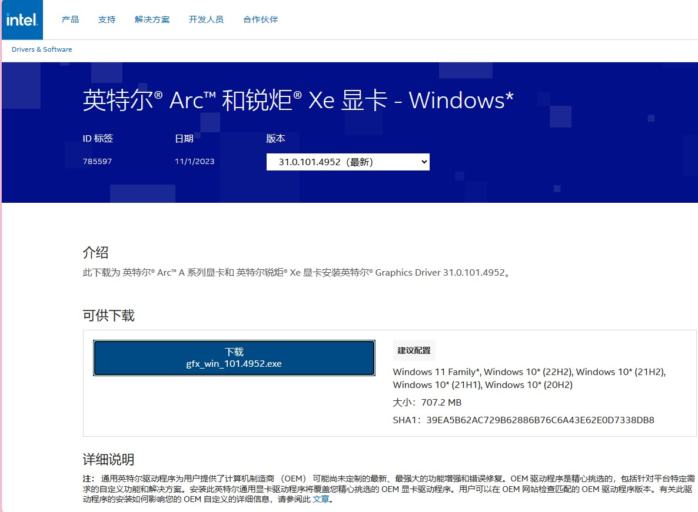

打上后还是有识别错误，感觉Intel全力发展Arc显卡完全不再管这款80eu的大号核显了

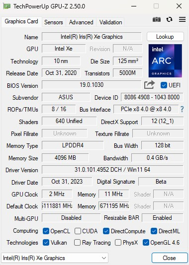

# 三.跑分

接着就是常规的跑分测试环节了，看看这张亮机卡/大号核显性能如何。--[链接](http://www.3dmark.com/spy/42945698)

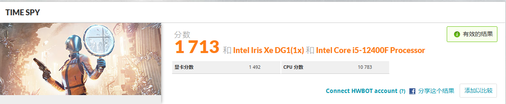

比我笔记本的Vega7核显1181分还是要强的--[链接](http://www.3dmark.com/spy/35558299)

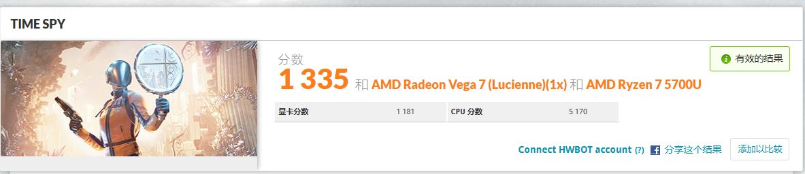

比比十年前的高端N卡是否有优势呢（忘了用12400F跑了，就拿之前5600的记录来看吧），还是差不不少呢--[链接](http://www.3dmark.com/spy/37450411)

最后是主力3070--[链接](http://www.3dmark.com/spy/42841778)

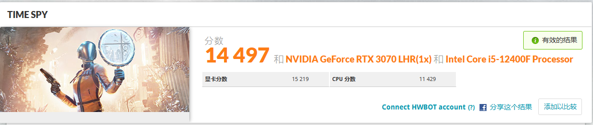

再用更大众的鲁大师跑分来看看对比吧

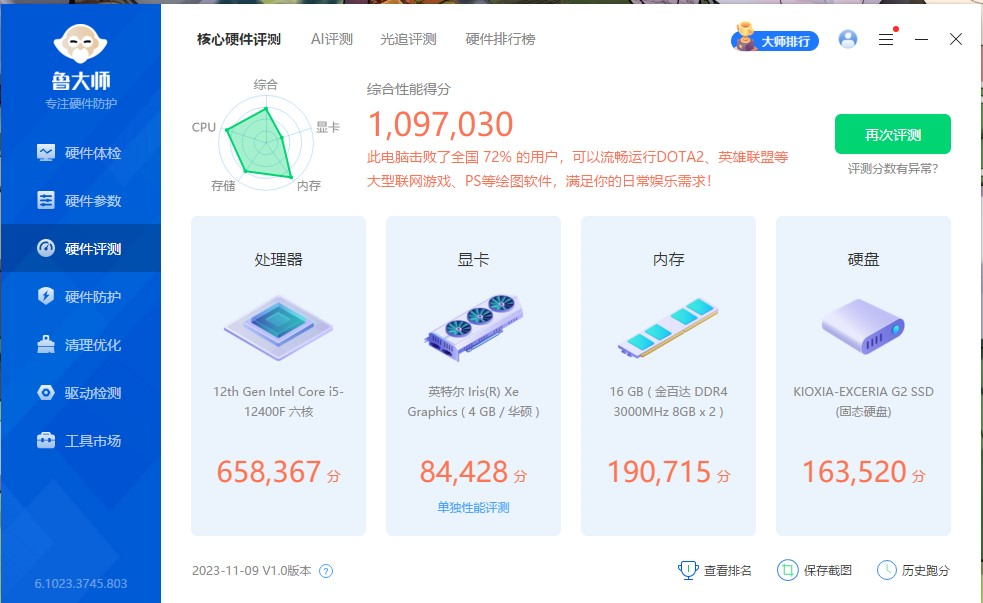

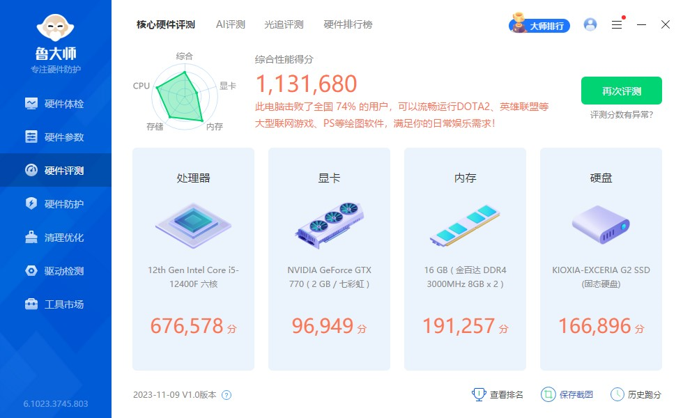

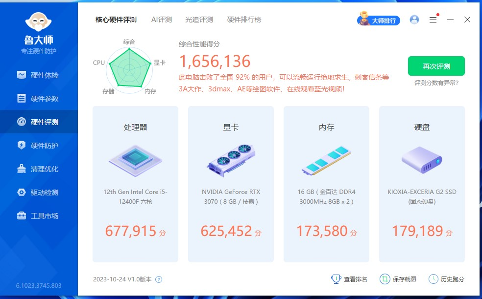

最后再对比一下游戏差距叭，就拿最近玩的MC为例了

不打光影能有150帧，还算不错

试试第一个光影，直接不能渲染

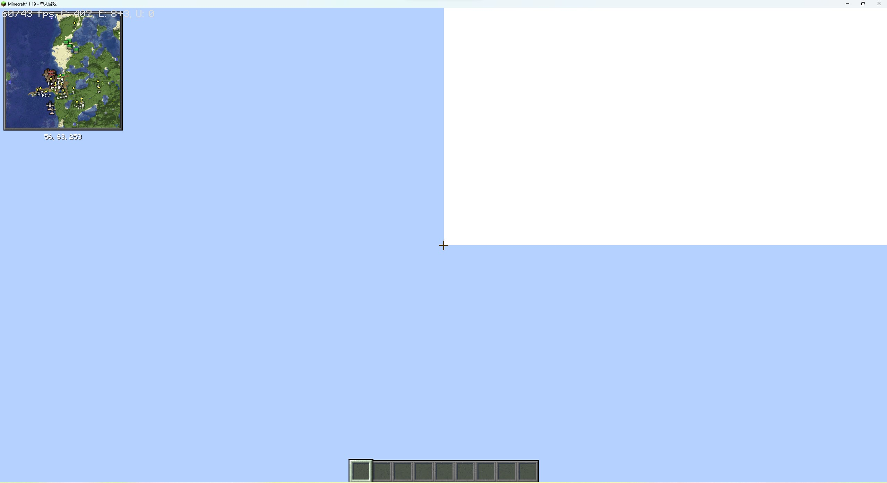

试试换一个光影，15帧电竞，和gtx770帧数差不多

我的3070开光影大概能有70-100帧左右吧，差距也挺大了。看来DG1还是作为亮机卡比较合适。。。。。。

# 四.整个花活

继续玩我在b450平台上玩过的多卡。。。不过华擎这张板子的pcie划分很难受，只有一根全长的pcie 4.0x16插槽和一根pcie3.0*1的插槽，而且距离过近，也不适合插多卡（完全不如之前坏掉的b450迫击炮max）。

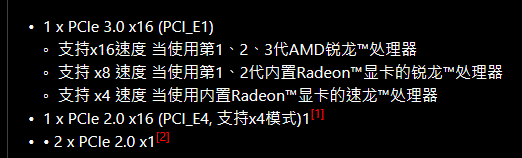

A/I亮机卡之战

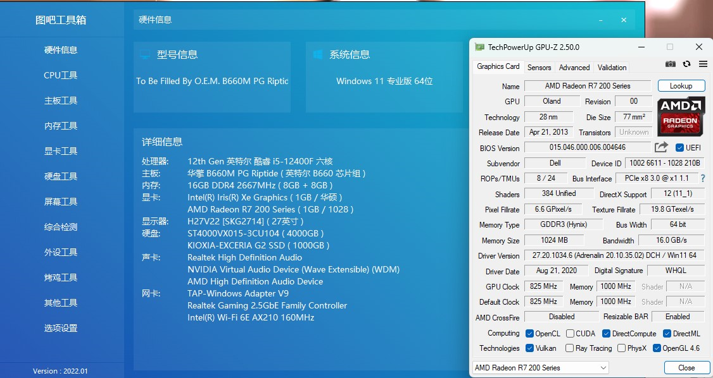

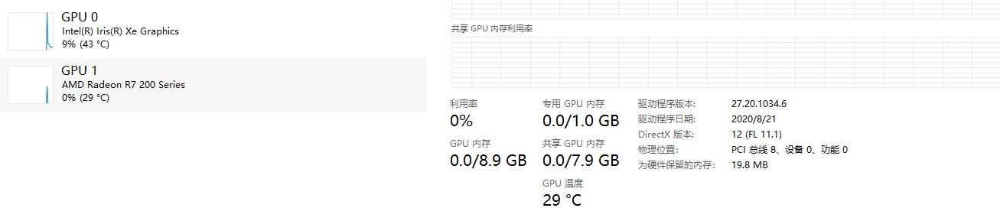

P106也行？我的评价是不如核显带P106的玩法

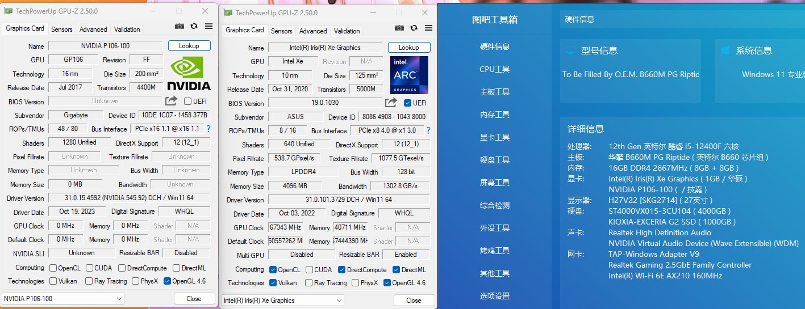

# 五.后事处理

本来这件事就属于冲动消费，也不打算自己长期使用，这张卡的归宿可能就是收藏起来长期吃灰（这张板子matx版型插不下更多卡了😡，不然我一定给插上），然后被我卖掉或者拿回老家当亮机卡发光发热（给父母办公看视频还不错嘛），不过DIY嘛，开心就行，以后我出去炫耀也可以说本人也是玩过Intel独显的男人，哈哈。折腾本身就是一种乐趣，拿到喜欢的电子产品高兴才是最重要的一件事......

下期预告：12代Non-K OC	看到华擎妖板懂得都懂	~~才不是本人太懒了，素材存了好久都懒得写博客。。。~~

