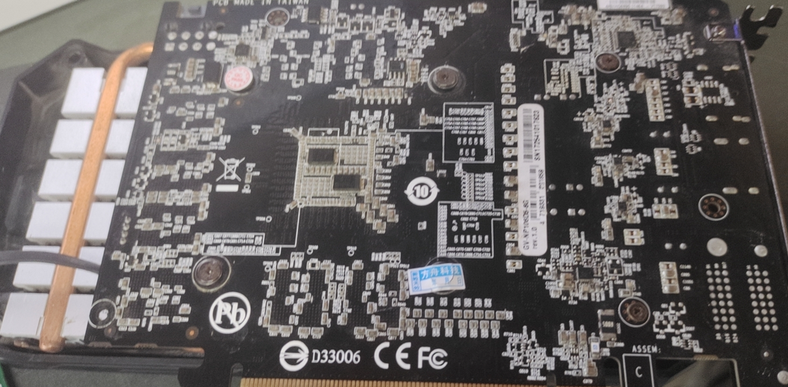
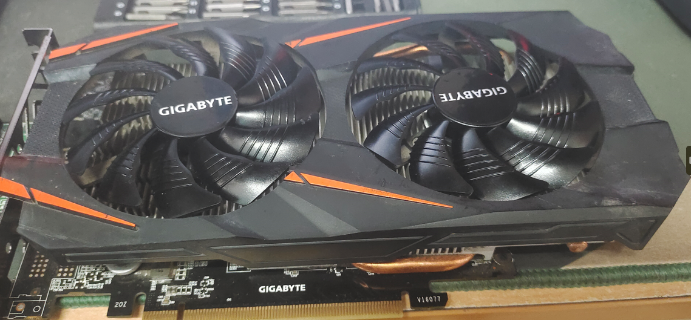
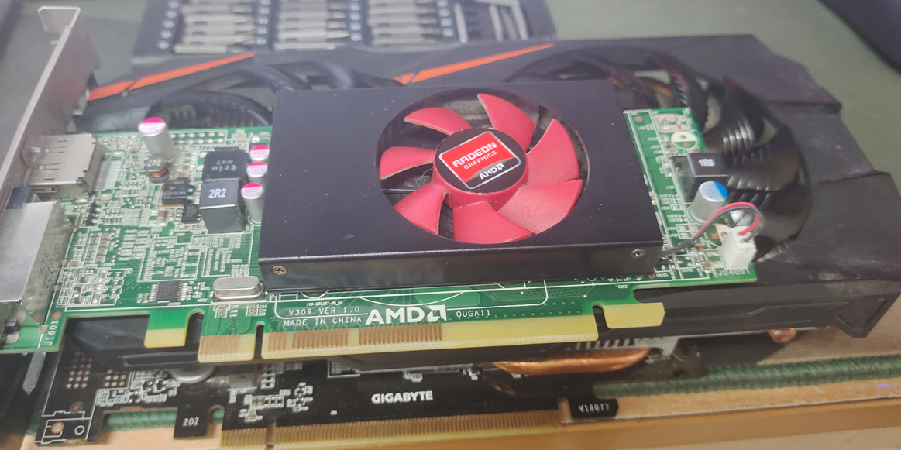
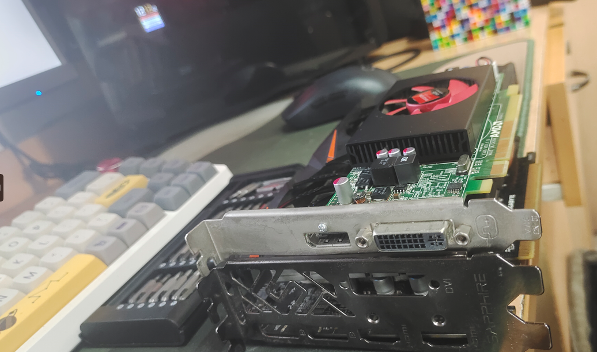
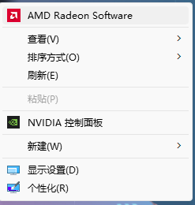
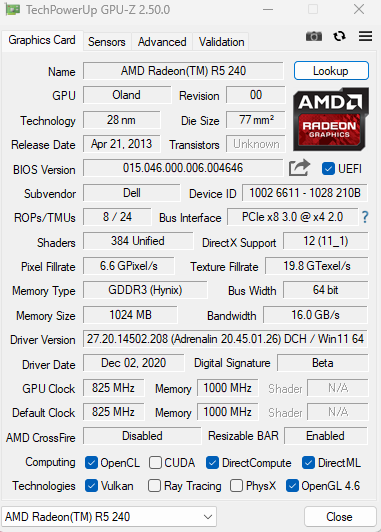
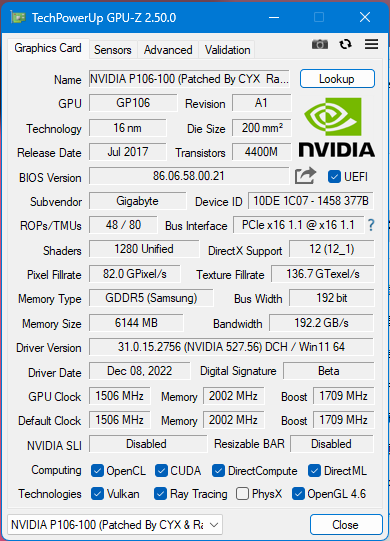
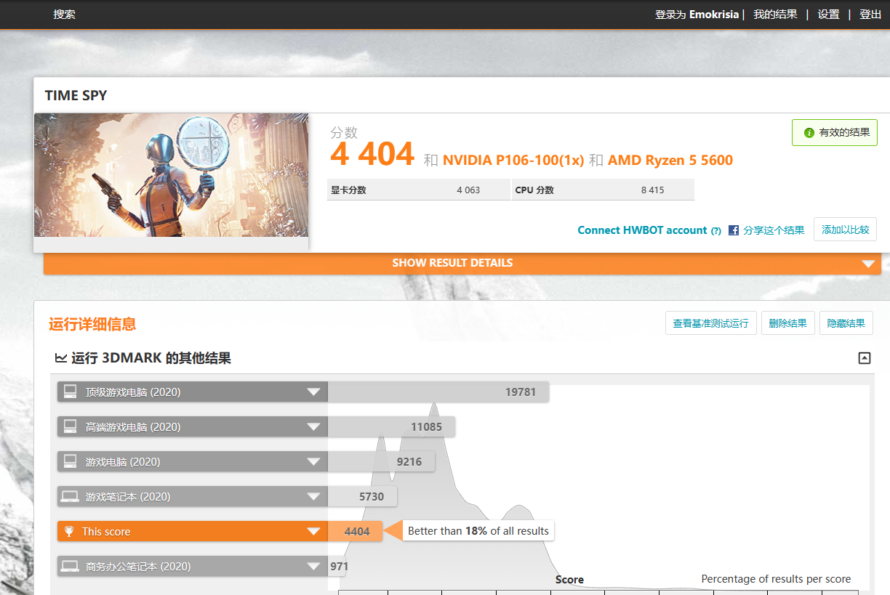
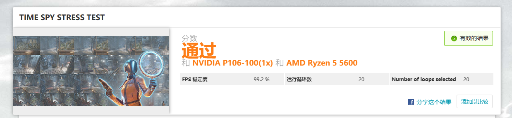
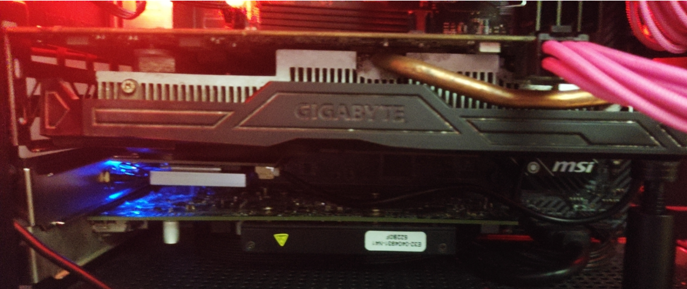

# 一.为什么玩这个矿渣

首先是价格便宜，这一套也就100多点，性能在1060 5g -1060 6g之间（其实纯论性价比还得矿王rx580）

其次是方案成熟，在百度贴吧p106吧里提供了各路大神制作的魔改驱动和教程，P106作为立吧之本，适合小白尝试。

最后是因为我打算把之前的6700xt换成3070，6700xt已经被我挂咸鱼打包了，暂时把前几天到的p106利用起来，换n卡胜在驱动稳定以及对ai，深度学习的支持好，游戏性能实际是差不了多少的。

> 碎碎谈：
>
> 最后这一波换卡浪费了我500元，虽然卖旧卡赚了200（过了年矿卡咋还涨价了），但是这多的300从丐版换了旗舰（最便宜的旗舰还是狗嘉的超级叼，火神/超龙还贵200，猛禽贵400），台独技嘉苟都不买，新卡不推荐入。
>
> 要是去年就直接买3070（当时贵个200左右）应该会亏得少一点，不过应该也只会买个丐版。。。
>
> ------
>
> 而且本人作为个A粉兼AMD精神股东，购入一张a卡也是不得不品鉴的过程，在长达4个月的时间里，我的所有电脑设备全是amd，台式机是5600+6700xt，笔记本是5700u核显，家里的老电脑是个老apu。。。Intel浓度几乎为零（虽然这学期我买了Intel AX210网卡，原因是之前买的蓝牙接受器不稳定，经常断，换pcie网卡蓝牙后就没问题了）。最后的最后，我还留了一张a卡（r5 240）来亮机。

# 二.看看配件

碍国嘉p106-100 6g（b站某矿up直播抽中购买资格78元包邮入手，海鲜价大概100左右，可以换itx散热），戴尔办公机拆机r5-240 OEM 1G（海鲜市场60元包邮，超级亮机卡dp接口支持2k 144，gcn架构，支持dx12，就纯亮机用途而言比n卡gt710之类的便宜好用）

逐一亮相：

# 三.装装驱动

先把显卡插上，需要核显+pcie x16槽一个或者无核显平台两pcie x16槽，我所用的b450迫击炮max主板恰好有两个X 16槽满足了需求。

插上亮机卡和p106，使用DDU卸载旧N卡驱动

驱动下载见p106吧置顶。。。

https://tieba.baidu.com/f?kw=p106&ie=utf-8&tp=0

简单步骤：断网，安全模式装p106驱动，再正常启动，联网，windows会自动安装a卡驱动，再选择gpu调度选项，把需要显卡的应用都选为p106运行。。。

------

> 我实际遇到的困难：首先是系统不认卡，就是设备管理器和gpuz都无法识别p106，然后也无法上驱动，解决方法是先看设备管理器有无异常设备，再看鲁大师认不认卡（鲁大师可以识别就行，然后就可以把鲁大师删了），随便打个正常的驱动，等到gpuz能识别了，就可以去安全模式重新打驱动了。。。

# 四.游戏测试

我先试了黑魂三，2k全高差不多60帧的样子，法环不敢尝试怕过不了小蓝熊，空洞骑士1080p，114帧，感觉调用不是很稳定啊

开个动态壁纸，r5 240（只输出图像）都会占用100%，p106占用却不多，实际体验肯定是不如1060的。

不过作为过渡套装还是比较好的玩具，等下一张卖国嘉的卡到了就换下来了。