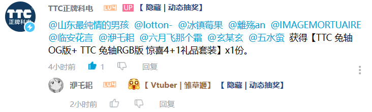
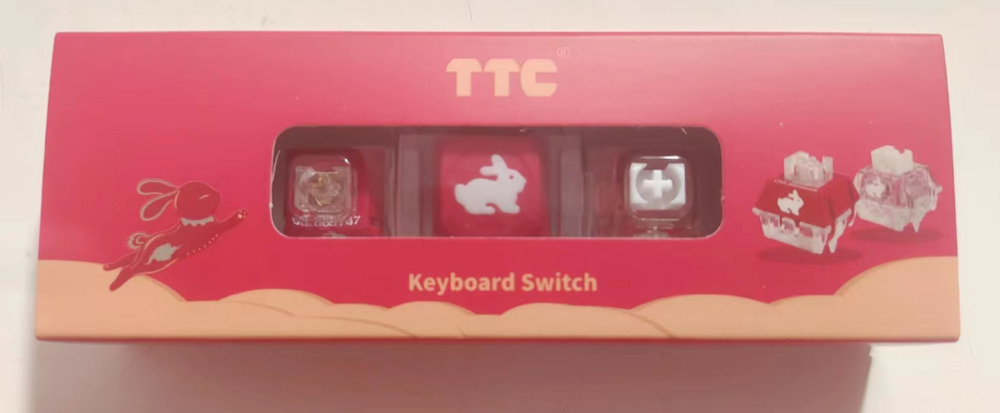
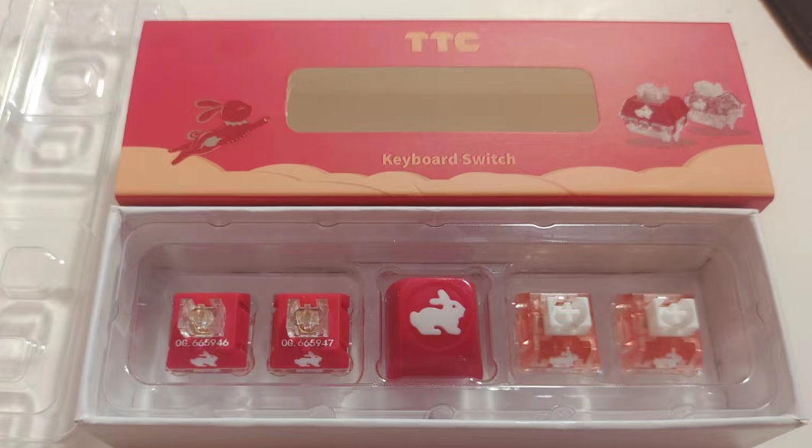
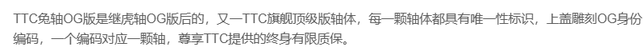
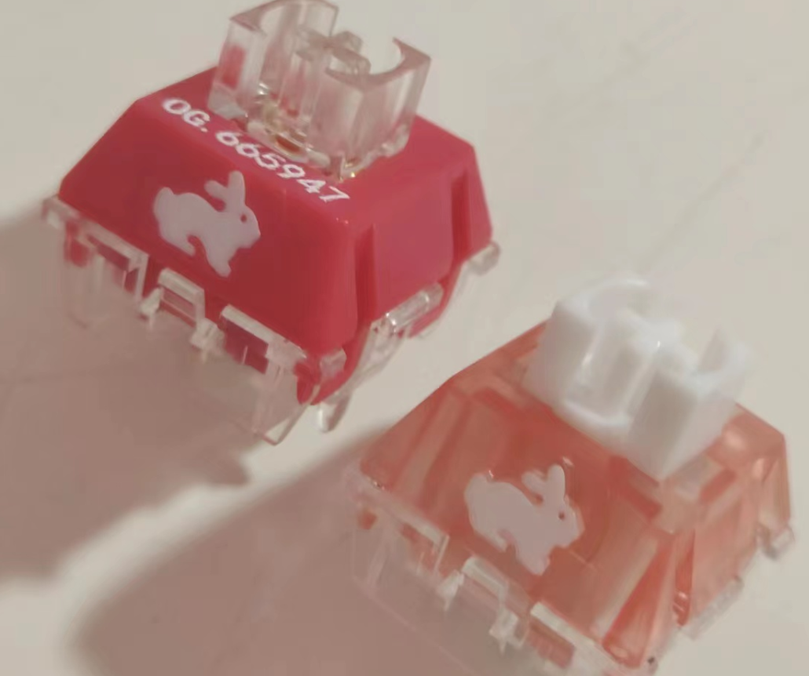
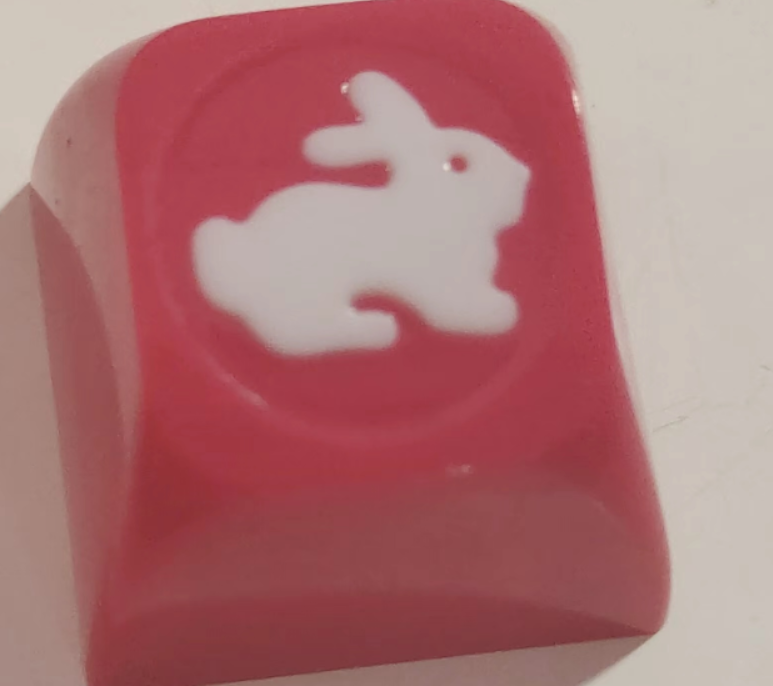
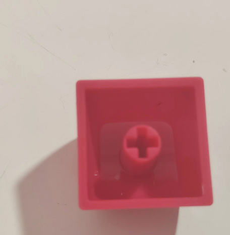
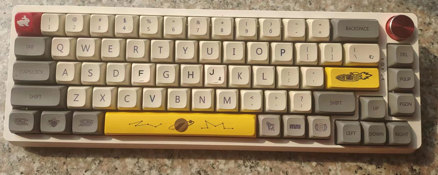
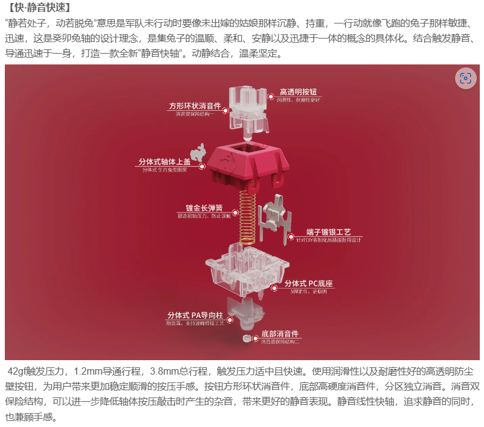

## 一.起因

打开b站看看消息突然发现中奖了...虽然不是什么大奖,大概有8颗轴的样子,到手体验一下再写(本文只是个人生活分享,无干货...)

## 二.后续

之前客服就说的30号后安排发货,今天2023/2/1 就收到了..

原来不是8颗😂,左右各两颗兔轴og和兔轴rgb

貌似og版还有编号?

拿两颗不同的出来看看,一个是乳壳一个是透壳

还送了个兔子键帽

感觉和我的键盘不是很搭😔,又换回去了

对于轴体评测我也没啥研究,不过这款是静音轴,我还没用过,更没发言权, 看看官方介绍吧

我个人感受声音确实比较小,手感顺滑度也不错,不过静音轴有一种肉肉的感觉,有点像薄膜😶...

总之,要我自掏腰包买这款轴体去组装键盘,我是不干的,其一是ttc本来就卖得贵(一颗兔轴og要19r,一颗兔轴rgb要13r),对于学生党来说花费太大了,以我这67键就得花800元了,另一方面,我也没有静音需求,也不太追求这种手感...

不过还是感谢ttc免费送我的这几个玩具😁