## 一.真之仲间事件的科普	

​	想必传说系列JRPG的fans肯定比我了解太多😂,但大多数人肯定也是不太清楚这个所谓的"真の仲间"是个什么东西.说来惭愧,我是最近在阅读某小说的时候了解到这个事件的😥,这本小说的作者简单概述成某游戏把原定宣传的女主角作废,并以能力值低下为由踢出队伍,而被玩家大规模炎上的事故.

​	虽然作者说的煞有其事,想来也很奇怪,游戏公司不赚钱的吗😓,这种事怎么可能发生,于是便搜索查找了一番,居然确有此事.这款游戏就是传说系列的第15作---Tales of Zestiria(译名:情热传说),简称TOZ,主题是让热情照耀世界的RPG.

> **传说系列**（英文：Tales of；日文：テイルズ オブ）是由万代南梦宫控股公司（原南梦宫发行的奇幻日式电子角色扮演游戏系列。游戏在2011年前由南梦宫传说工作室开发，之后由南梦宫万代开发。自超级任天堂平台首作《幻想传说》于1995年发行以来，系列已经有20部正篇游戏和诸多游戏续作，以及漫画、动画和广播剧等跨媒体作品。

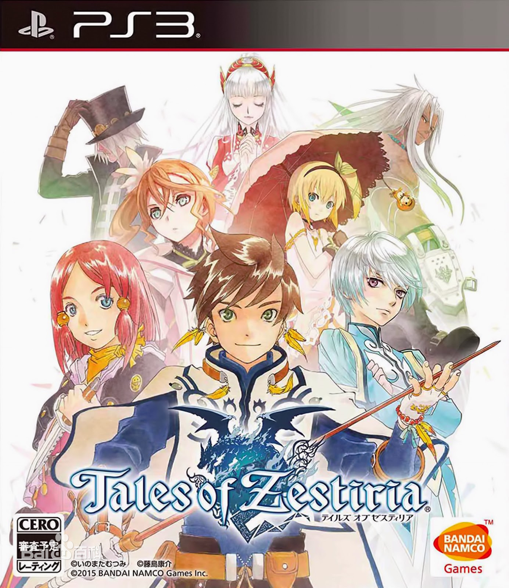

并且这件事甚至还引发了后续一系列"退队流"日轻的出现,可谓是影响深远了...

事件具体可以看这篇游侠网的[专栏](https://www.gamersky.com/zl/201703/881365.shtml),下面会在正文引用一些专栏内容和一些其他平台的评论来支援介绍...(此段并非我原创)

#### 临时更替的真之仲间

2015年1月22日，《情热传说》在PS3平台独占发售。数天后，随着越来越多玩家通关，他们发现原本认为是女主角的“艾莉夏”竟然会在游戏中途永久离队，后期故事基本和她完全没有关系。艾莉夏离队后，队伍女主角由一名叫做“罗洁”的角色代替，并且还可以使用艾莉夏的DLC服装。(为什么突然想到品如的衣服🙃)

《情热传说》作为传说系列的第十五作以及二十周年纪念作,在发售前自然饱受玩家期待,游戏制作人马场英雄在发布会上诱导宣传艾利夏是女主角（艾莉夏是第一个宣传登场的女性角色，而且站在女主角位，并且光速决定手办化），而真女主角罗洁非常晚才出现在宣传图片里。

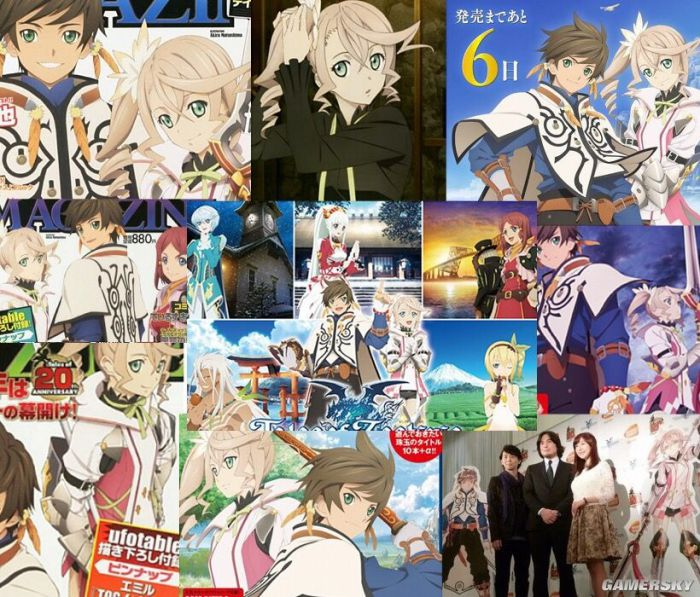

在JRPG中，随着某些剧情发展,游戏中途队员离队也算是比较常见的情况了,在《情热传说》的剧情里，艾莉夏因为自身能力不足拖累主角史雷,无法成为主角的力量,提出离队,但主角的台词强行拔高罗洁,就像是在讽刺艾利夏无能不配当"真正的伙伴，这和20年来传说系列的画风差距太大，导致玩家根本无法接受. 罗洁替换掉艾莉夏的过程中，许多剧情和对白都经不起推敲，甚至有明显的赶工痕迹。罗洁本身的人设并不如艾莉夏抢眼，个人还是觉得公主(艾莉夏)可爱些，下面奉上著名的踩一捧一台词(真之仲间的出处)：

> 莱拉：“那么要不要让罗洁小姐加入我们的旅途？”
>
> ライラ「ロゼさんを私たちの旅に诱いませんか？」
>
> 斯雷：“咦，什么？为什么突然提这个？”
>
> スレイ「え、なに？突然」
>
> 米克里欧：“我也赞同。对斯雷而言应该会是很棒的同伴。”
>
> ミクリオ「仆も同意だ。スレイにはいい仲间になると思う」
>
> 斯雷：“怎么连米克里欧你也……”
>
> スレイ「ミクリオまで…」
>
> 米克里欧：“老爷子有说啊，‘能够见闻到同样事物的才是真正的伙伴’。”
>
> ミクリオ「ジイジが言ってた『同じものを见て、闻くことのできる真の仲间』だよ」
>
> 斯雷：“真正的伙伴吗……”
>
> スレイ「真の仲间か…」
>
> 艾朵娜：“不是很棒吗？”
>
> エドナ「良いんじゃない？」
>
> 莱拉：“罗洁小姐的灵应力和斯雷先生是处于伯仲之间的程度”
>
> ライラ「ロゼさんの霊応力はスレイさんと比肩するほどのものです」
>
> 　　 “应该不会像艾莉夏小姐那时因为担当从士的代价让两人都过的很辛苦吧”
>
> 「アリーシャさんの时のように従士の代偿でお互い苦しむこともないと思いますわ」
>
> 艾朵娜：“大概有点理解如果只有斯雷一个人类的话有时会多麻烦呢”
>
> エドナ「それに人间がスレイだけだと时々面倒なのもわかったし」

#### 对不起，就算你掏了钱，也不能成为真正的伙伴呢

前期宣传艾利夏的时候就出了艾利夏的收费服装dlc，但是到最后艾利夏离队，这些艾利夏专用服装却是可以给给罗洁穿的，玩家不由得感觉官方是恶意营销欺骗。
愤怒的玩家对官方提出了抗议，然后官方表示有艾利夏的dlc，需要1300日元(含税1404)。

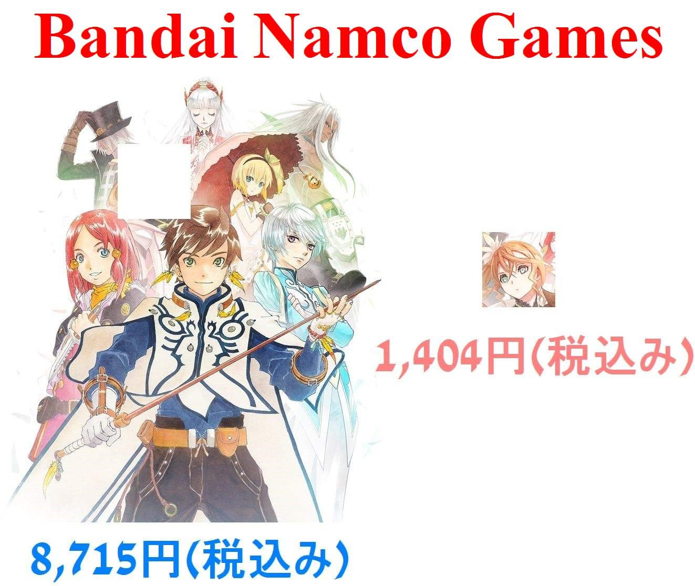

玩家又火了，然后诞生了`“原来艾莉夏的剧情被做成DLC了？想要成为真正的伙伴就掏钱吧！官方是这个意思？”`的梗。

游戏分拆主要角色的剧情单卖DLC本就不能让玩家接受. 面对玩家的再次愤怒，官方把原本需要支付1300日元的艾莉夏剧情DLC在一段日期内提供给玩家免费下载。然而这一举动又刺激了玩家，下载了dlc的玩家发现，这个dlc和主线根本没关系,完全是日后谈，艾利夏本身的故事也完全没补完，也改变不了艾莉夏在剧情中尴尬的定位和永久离队的现实,结果梗就变变成了`"对不起，就算你掏了钱，也不能成为真正的伙伴呢".`

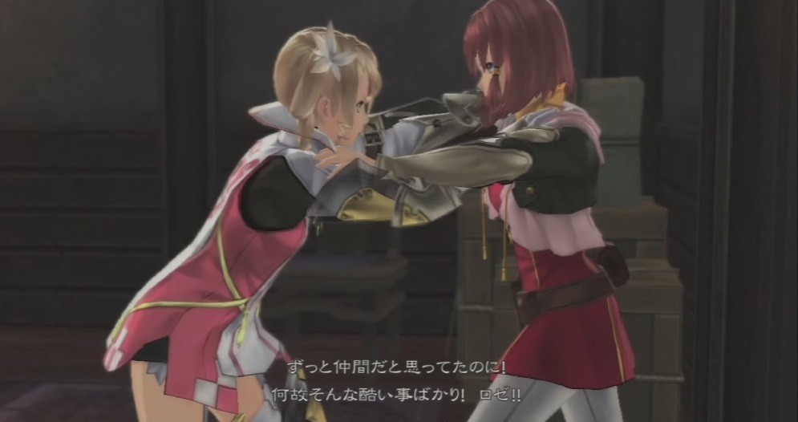

　感觉自己被官方欺骗的众多传说玩家引燃了互联网，甚至连官方与玩家互相交流的社群都被逼屏蔽了“诈骗”关键字。《情热传说》的口碑暴跌，游戏价格一度跌到连盒饭都买不到的水平，二手交易商直接放弃收购这款游戏。游戏发售一个月左右，原本计划在2月20日直播的《情热传说》节目被直接砍掉。在此期间游戏制作马场英雄被玩家多次要求澄清这件事情，而马场从没有正面回应玩家(被国内玩家戏称 "没马"的场英雄).直播的取消更是导致了玩家进一步愤怒。

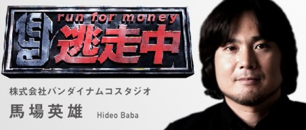

然后，点燃最后一根稻草的是传说的手游。当时传说的手游随着热情传说的发售，更新了热情传说的各位角色。

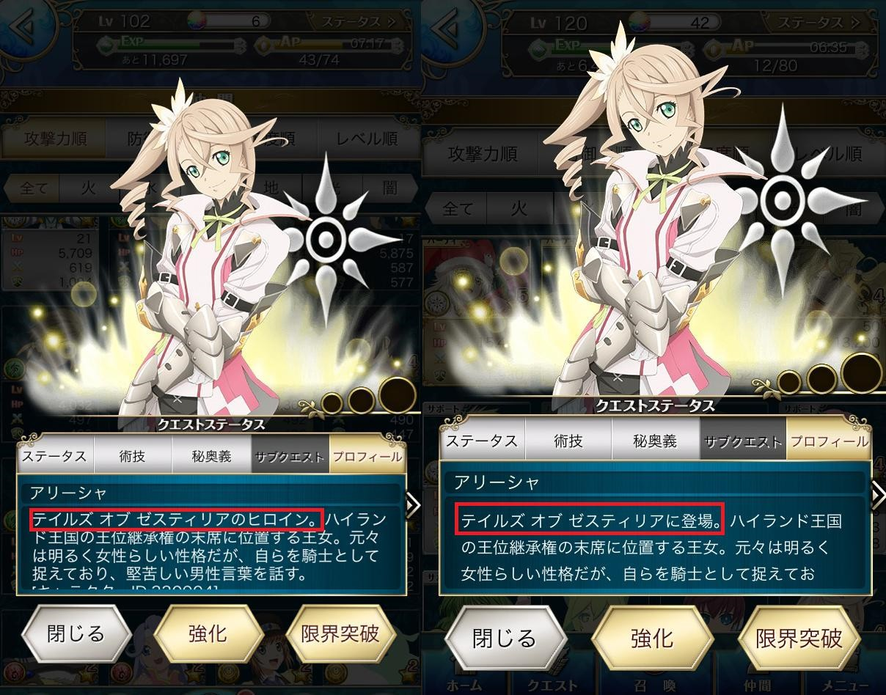

角色资料中，艾利夏的介绍里明确标记着“热情传说女主角”的字样。而官方在这件事情爆发后，对于这款手游出了一个更新包，而更新的内容仅仅是把艾利夏是“热情传说的女主角”几个字删掉。
这一系列不可意思神奇公关，最后导致这款游戏口碑调到谷底。

最后总结:

> 明明有预约特典DLC却会永久离队
> 明明包含在四种预约特典挂饰却会永久离队
> 明明有专用服装DLC却会永久离队
> 明明是第一次广告宣传被介绍的角色却会永久离队
> 明明是第二个被介绍的角色却会永久离队
> 明明在专用杂志上面上封面好几次却会永久离队
> 明明是故事开头引导的角色却会永久离队
> 明明是最快速确定figure化却会永久离队
> 明明在游戏发表会上请声优到场却会永久离队
> 明明主角梦想是异种共存的情况下，身为队伍中唯一的普通人类却会永久离队
> 明明在脱队之后还会贩卖专用装备(枪)却会永久离队
> 明明是前传的女主角却会永久离队
>
> ---取自[nga评论](https://ngabbs.com/read.php?&tid=26839471&pid=517651178&to=1)

## 二.退队流轻小说

不可否认,这一类型的轻小说的兴起与前面所提到的"真正的伙伴"有着紧密关系,由讽刺《情热传说》而引发的退队流轻小说已经有不少动画化了,成为全新的异世界动漫~~厕纸~~类型，令人感慨。

下面举几个栗子，当然国内的网文也肯定有相同类型的作品，这里就懒得找了。

**《因为不是真正的伙伴而被逐出勇者队伍，流落到边境展开慢活人生》（真の仲間じゃないと勇者のパーティーを追い出されたので、辺境でスローライフすることにしました**）

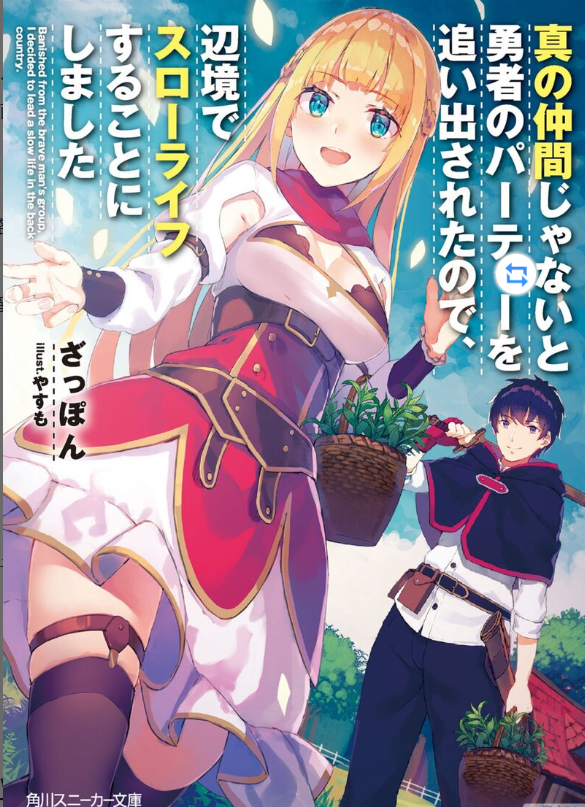

**《被勇者队伍开除的驯兽师，邂逅最强种猫耳少女 （勇者パーティーを追放されたビーストテイマー、最強種の猫耳少女と出会う）》**

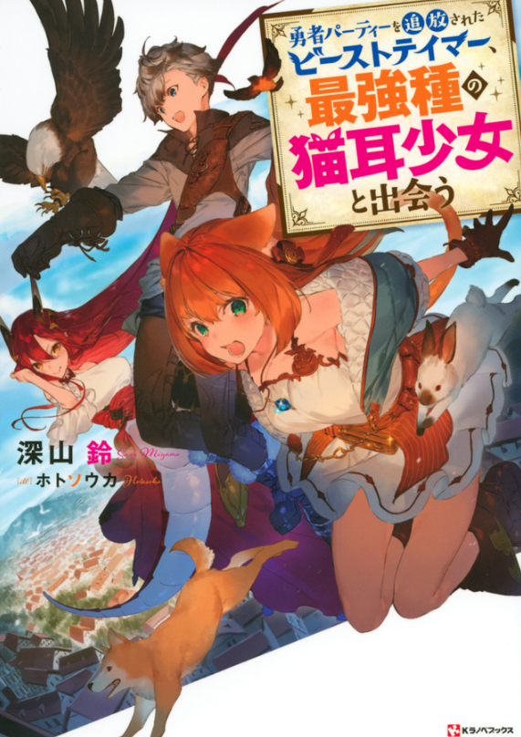

**《「你这种家伙别想打赢魔王」被踢出了勇者队伍，想在王都过上平静的生活》（「お前ごときが魔王に勝てると思うな」と勇者パーティを追放されたので、王都で気ままに暮らしたい**）

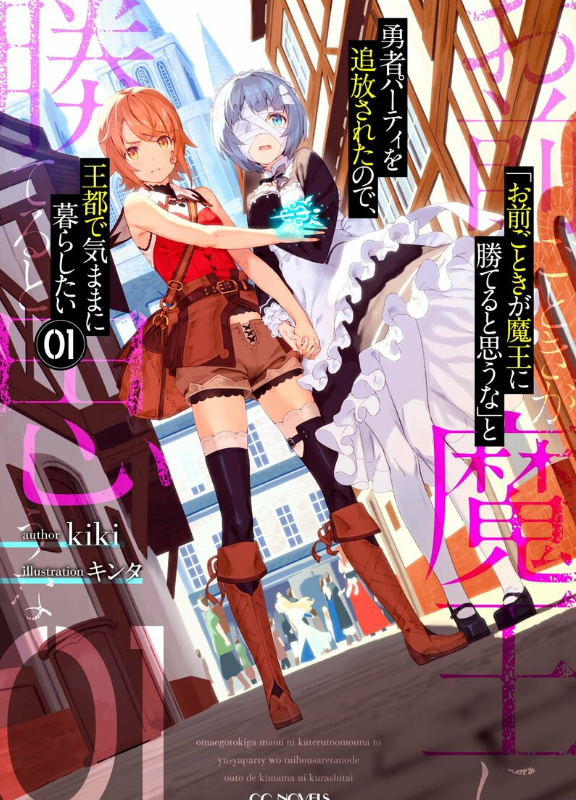

**《关于四个持有负面技能的人聚在一起，不知怎的发挥出相乘效果组成了最强队伍这档事》（マイナススキル持ち四人が集まったら、なんかシナジー発揮して最強パーティーができた件）**

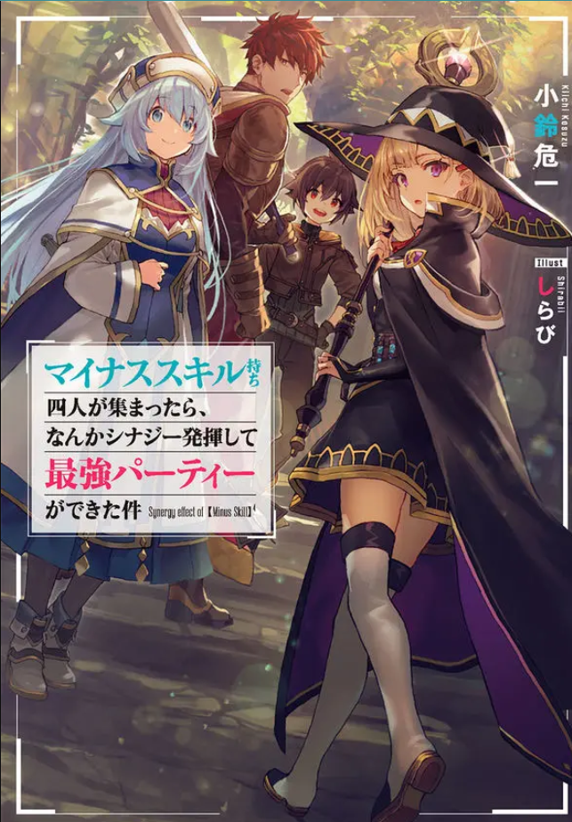

其实也不难发现，退队流轻小说的退队只是开篇第一卷吸引读者的噱头，后面该组队的还是重新组队了，形成小说的真正主角团，随着故事的发展，又会与之前退队的队伍进行对手戏，其中肯定也少不了装逼打脸的戏份，大致阅读体验肯定和“三十年河东，三十年河西”的爽感类似，一般也不会回归旧队伍而是在新团体里发挥主干作用，当然不同作家的安排和剧情构筑肯定也不同，也会注意规避一些压抑主角的毒点。（这里点名批评棍勇🤯，退队重来怎么还是被虐）

## 三.西游记-退队流是中华传统文学类型？

有一种脑干缺失的美，《西游记》也是退队流？

请看下文[日漫退队流越来越火，《西游记》流传下来的套路，为何经久不息](https://new.qq.com/rain/a/20220603A09EXT00)

此文作者提出：

> 退队流标准的流程就是：队内作用不可或缺的主角，因为队长的误解，以及猪队友的煽风点火被赶出了队伍，队伍缺少他立刻难以为继，而我们的主角找到了一片新天地逍遥自在。

其实当然时代不同，我们谈论到的日本轻小说退队流里的主角也并非完全是队内作用不可或缺的，也有许许多多的主角是原队伍的边缘人，队伍只是束缚了主角的才能，离开后反而得到发展，更类似现代人自负心态中的”今天你对我爱答不理，明天我让你高攀不起“，也又可能变成种田文学猴子经营花果山去了。而西游记里，悟空离队后取经寸步难行，最后又被唐僧请回去回归队伍，其实也是偏向于保守的做法，要换做轻小说来写，除非妖怪达到花果山下猴子才可能出山。

## 四.收尾乱弹

其实我想写这篇缝合文章的时候一开始也是因为TOZ "真正的伙伴"这个案例太过恶劣而引起的，原本就是想写一篇为美少女伸冤的短文，结果网上找找资料，变成这个样子，也算是基本把退队流讲了个大概，虽然最后牵扯到西游记，我也只能觉得是证明了其自古有之而非其是启蒙日本轻小说退队流的主要原型，毕竟对日本作者而言，有年代更近更贴近现实的案例发生。。。

就以公主的手办结尾吧

图片出自[hpoi手办维基](https://www.hpoi.net/album/177837),作者[Lolicon一official](https://www.hpoi.net/user/46162)

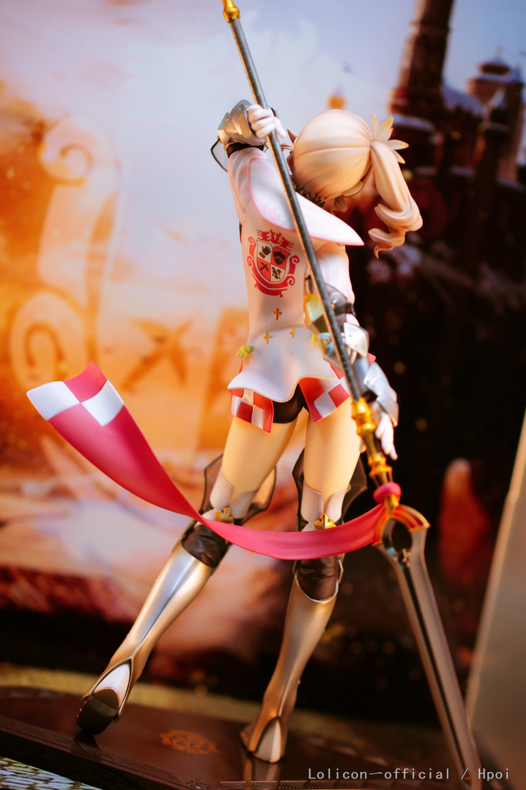

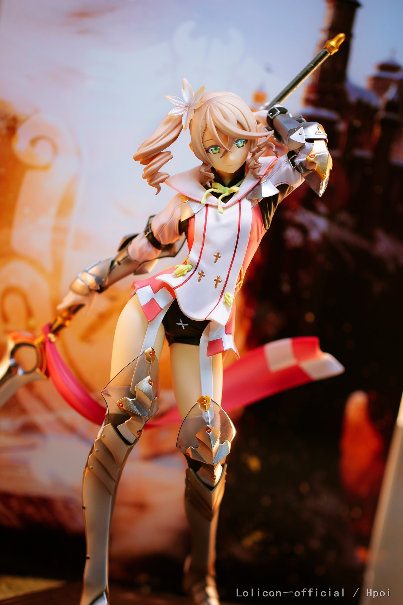

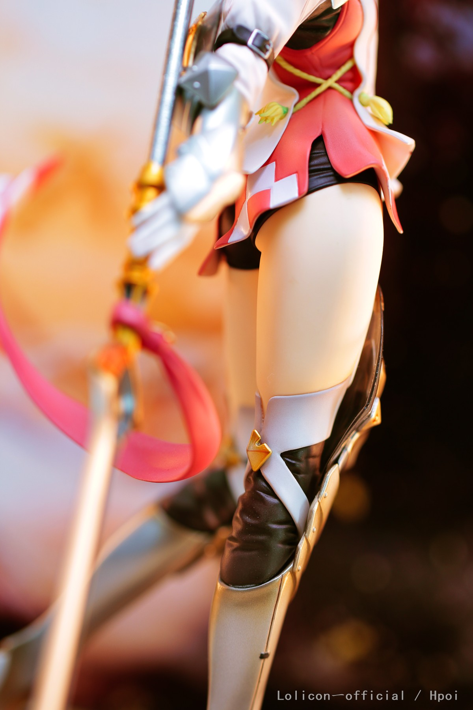

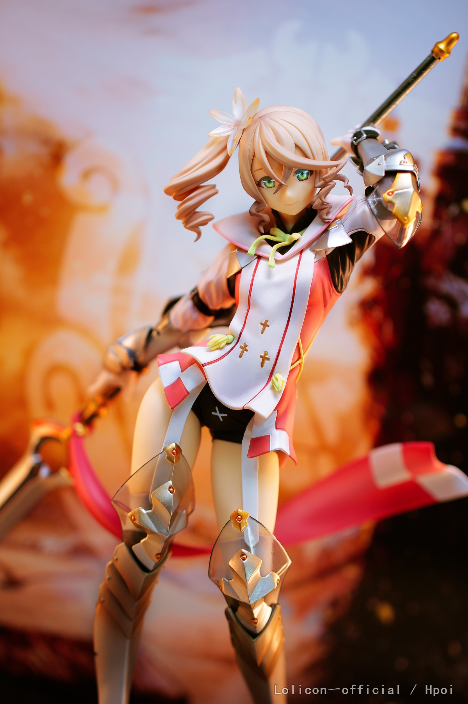