# 嵌入式系统设计

> 这个系列整理郭建老师的课件
>
> ## 前言
>
> ### 教材：
>
> • 嵌入式系统设计基础及应用——基于ARM Cortex-M4微处理器，北京：清华大学出版社，2022
>
> 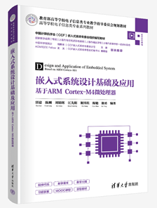
>
> •嵌入式系统设计实验教程，北京：清华大学出版社, 2022
>
> 参考教材：
>
> •Marilyn Wolf . 嵌入式计算系统设计原理.第四版. 北京: 机械工业出版社, 2018
>
> ### 主要内容
>
> •嵌入式系统的基础知识
>
> •硬件部分
>
> ​	–微处理器体系结构及指令系统
>
> ​	–总线技术 
>
> ​	–存储器系统
>
> ​	–I/O 接口
>
> ​	–32位RISC微处理器ARM cortex M4 
>
> ​	–ARM cortex M4的输入输出设备接口
>
> •软件部分
>
> ​	–程序设计与分析
>
> ​	–嵌入式实时操作系统
>
> ​	–嵌入式系统调试、测试与验证方法
>
> ​	–……
>
> •多核嵌入式微处理器
>
> ### 嵌入式系统概念
>
> •IEEE：
>
> ​	–Devices used to control, monitor, or assist the operation of equipment, machinery or plants.
>
> •Wolf:
>
> ​	–any device that includes a programmable computer but is not itself a general-purpose computer.
>
> •Microsoft 
>
> ​	–An embedded system is any computer system or computing device that performs a dedicated function or is designed for use with a specific embedded software application
>
> ### 民用嵌入式设备或产品
>
> 无人机，智能家居，机顶盒，数字示波器，智能机，可视电话，单反相机
>
> ### 嵌入式系统高端应用的产品
>
> 战斗机，无人驾驶，机器人，巡航导弹，坦克，玉兔月球车
>
> ### 学习方法
>
> •嵌入式的特点学习。
>
> ​	–动手，做一个简单的设备，如：电子时钟。
>
> ​	–具有自学能力。
>
> ​		•会看硬件的说明书
>
> ​		•C++或C编写过应用程序
>
> ​		•编写基于某种CPU（如ARM）的程序：代码裸奔
>
> ------
>
> 我们把类似51单片机或者DSP上面跑的没有操作系统的程序叫做“代码裸奔”。因为有的时候，比如我们编写一个简单的程序，就只需要点几个LED检测几个按钮的状态，那么“代码裸奔”弄一个while(1)的死循环就足够了，杀鸡何必用牛刀。 编写这种裸奔的代码，也是学习嵌入式的必由之路，因为，你将会用C语言去对寄存器写控制字，这就是以后写驱动程序的基础呀。 另外需要说明的是，从概念上说，“代码裸奔”也已经属于嵌入式开发的范畴。
>
> ------
>
> ​		•到了最后一个阶段，开始找一个方向（mcos、Linux、VxWorks、WindowsCE、Palm等		等），学习基于操作系统的嵌入式开发了。

## 第一章 嵌入式系统概论

### 一. 嵌入式系统概念

嵌入式实例：

##### 手机：

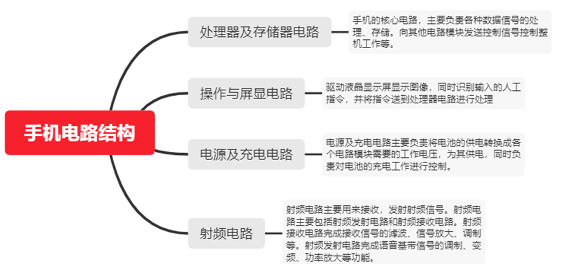

##### 汽车电子：

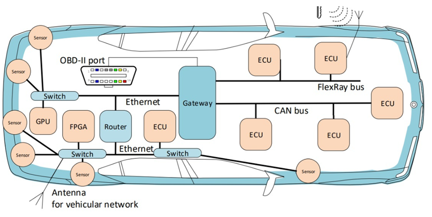

高端的汽车中包含100 多个微处理器, 低端的汽车也至少用20多个微处理器

​		4-bit 微处理器用于检查安全带是否系上

​		微控制器控制面板系统,

​		16/32-bit 微处理器控制引擎

**防抱死制动系统(ABS)**: 反复制动减少打滑

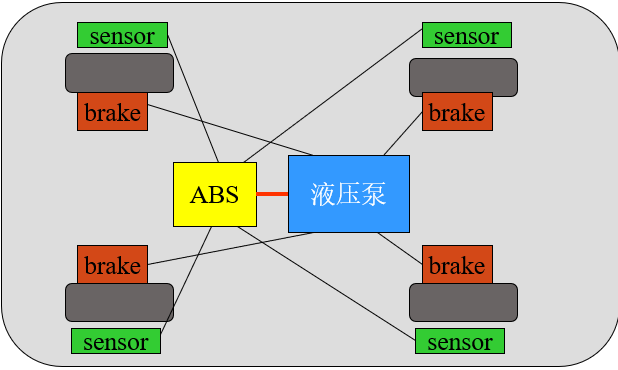

**自动稳定控制系统(ASC+T)**: 控制引擎以改善其稳定性

##### 航天航空:

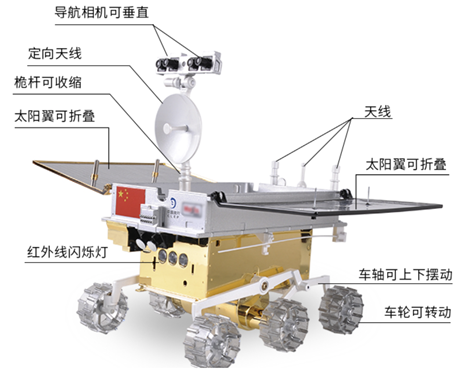

#### 上述示例特点：

   🔷专用目的

​	🔷软硬件为特定应用而设计

​	🔷实时

#### 嵌入式系统定义

​	 IEEE：用于控制、监视或者辅助操作机器或设备的装置

​	 通用的定义：在产品内部，具有**特定功能**的计算机系统。

​	 通用计算机不是嵌入式设备，但可用于嵌入式设备的开发

#### 嵌入式系统分类

​	实时（硬实时）：超过时限将产生不可接收的结果，如机毁人亡、系统崩溃

​	非实时（软实时）：超过时限，可能会影响性能，但不会带来灾难性后果

#### 嵌入式系统特点

​	🔷专用性强

​	🔷资源受限

许多嵌入式系统受市场约束需要低的制造成本.

低内存, 低端处理器等.

​	🔷知识集成度高

运行复杂的算法和多个算法.

​		移动设备, 激光打印机.

​		提供复杂的用户界面.

​	🔷高实时性

在规定的时限内数据没有准备好，将中断

在规定的时限内没有获得数据，将会不安全

多速率操作.（例如多媒体数据流包括视频和音频）

​		运行多个实时动作

​		以不同的速率执行

​	🔷高可靠性

许多嵌入式系统工作在遥远、无人值守及恶劣环境

### 二.嵌入式系统组成

#### **嵌入式系统：**

**硬件--包括核心处理器以及外围器件组成**

**软件--包括固件、操作系统、中间件和应用程序**

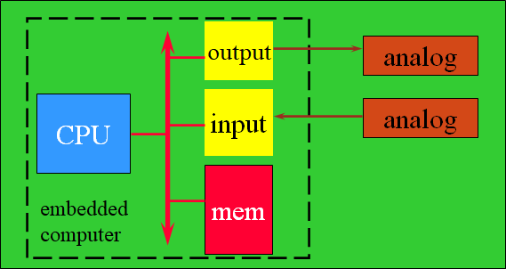

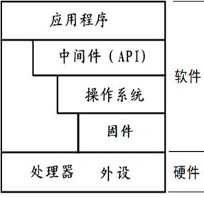

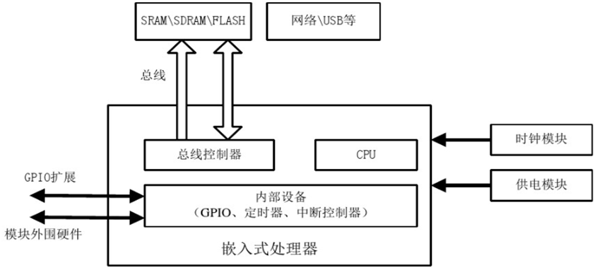

#### 嵌入式微处理器

**特点**

🔷处理速度快

🔷功耗低

​	不仅要求低功耗，还需具有管理外设功耗的能力

🔷接口丰富，I/O能力强

🔷可靠性高，经常工作在无人值守的环境

🔷生命周期长

​	应用需求比较稳定，长时间内不发生变化

🔷产品系列化

​	呈现出系列化、家族化的特征

**分类**

🔷**指令集特点：**

​	复杂指令集处理器（CISC）和精简指令集处理器（RISC）

🔷**处理器字长：**

​	4位、8位、16位、32位和64位处理器

🔷**内部总线结构和功能特点：**

​	冯.劳伊曼结构（Von Neumann ）

​	哈佛结构（Harvard）

**组成**

🔷内核：运算和控制单元、总线、存储管理单元及异常管理单元

🔷片内存储资源，集成高速RAM，有些MCU 和 SOC 内置 ROM 或 Flash ROM

🔷外设：外设控制器、通信、人机交互、信号I/O

🔷电源：正常电压、耐受电压范围、最大电流

🔷封装形式：尺寸、外形、引脚方式

### 三.嵌入式系统设计

#### 嵌入式操作系统分类

由**应用对系统响应时限的要求**划分

🔷**实时操作系统（RTOS**）

​	必须在限定的时间内完成任务调度和任务执行

​    任务调度时间和稳定性有非常严格的要求

​	分类

​	硬实时（Hard real time）: 错过deadline会造成失败，或造成重大损失俄 eg：汽车刹车控制

​	软实时（Soft real time）: 错过deadline会导致性能的降低.   eg：DVD播放画面延迟

示例：FreeRTOS，UCOS，RTX，RT-Thread，DJYOS等

🔷**非实时操作系统**

示例：Linux、Android、iOS、VxWorks、Free RTOS、LiteOS、uC/OS等。

#### 特点

🔷**内核小**

​	系统资源相对有限，内核通常小于传统操作系统的内核

🔷**可裁剪性**

​	有很强的个性化特征

🔷**操作系统与系统硬件结合非常紧密**

​	需要做有针对性的裁剪

🔷**实时多任务调度，多速率操作**

​	运行多个实时动作

​	以不同的速率执行

#### 嵌入式系统设计方法

**Top-down 设计**

开始于最抽象的描述，直到最细节

**Bottom-up 设计**

开始于小的组件，到大系统

**需求分析**

功能性需求：系统的基本功能

非功能性需求：性能：速度、计算时间，成本，物理尺寸、重量，功耗，可靠性

#### 传统开发过程

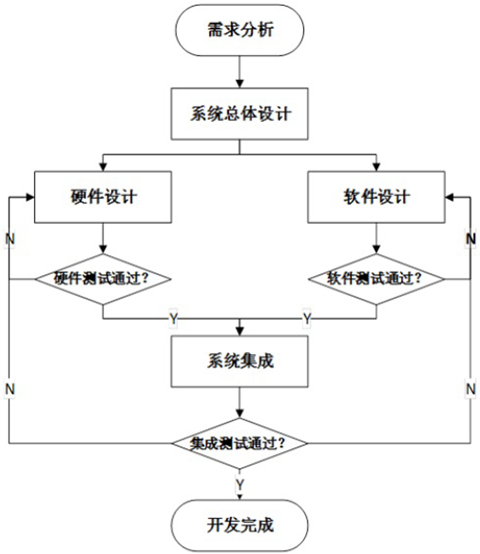

**评价**：直接简单，有缺陷，依赖于开发者的经验，硬软件设计过程独立，彼此缺少交互，性能对软硬件分别优化，难以整体提高系统性能

#### 软硬件协同设计

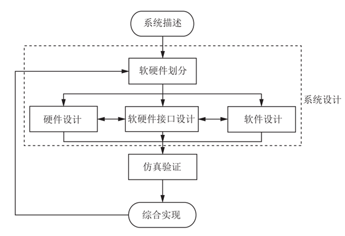

**评价**：软硬件设计作为一个整体考虑，从系统需求出发，综合分析系统软硬件功能及现有资源，软硬件功能划分，确定系统架构，实现软硬件协同验证，使得系统运行在最优工作状态。

**分析**：系统描述是设计者借助 EDA工具及一种或多种语言（systemVerilog），系统设计分为软硬件功能划分和系统映射两个阶段，综合实现是软件、硬件系统的具体实现过程，经过仿真验证后，按照系统设计的要求开发

#### 嵌入式系统软件调试环境

采用“宿主机/目标板”模式：

--宿主机（ PC）上良好的开发和调试程序

--交叉编译环境生成目标代码和执行文件

--程序下载固化到目标机上

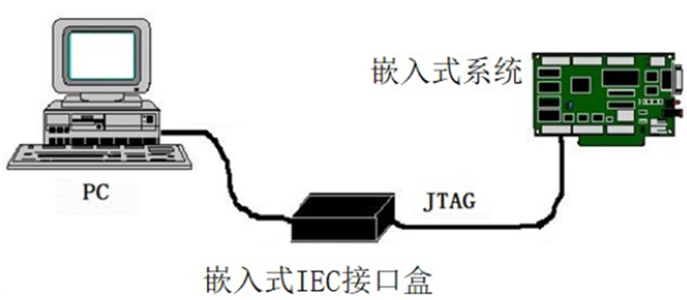

#### 开发实例分析（GPS 移动地图的设计）：

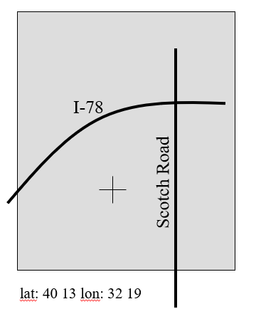

**需求**：

功能: 针对高速上的用户，显示道路和其它地标.

用户界面: 400 x 600 屏幕. 三个控制按钮.

性能: 地图平滑移动，显示在1秒中出现，核查位置在15秒内出现.

成本: 400元 零售价.

物理尺寸/重量: 适合手掌.

功耗: 四节AA电池供电8小时.

**列出需求表**

|                | GPS 移动地图需求表                                           |
| -------------- | :----------------------------------------------------------- |
| 名称           | GPS移动地图                                                  |
| 目标           | 驾驶使用的用户级地图                                         |
| 输入           | 一个电源按钮，2个控制按钮                                    |
| 输出           | 背光400*600像素的LCD（液晶）显示屏                           |
| 功能           | 使用5个接收器的GPS系统；三个用户可选的分辨率；总是显示当前的经纬度 |
| 性能           | 在位置变动后的0.25s内更新屏幕                                |
| 制造成本       | 200元                                                        |
| 功率           | 100mW                                                        |
| 物理尺寸和重量 | 不超过2英寸´ 6英寸，12盎司（1英寸=0.0254米；1盎司=28.3495克） |

> **系统描述**：
>
> 🔷对系统更精确的描述
>
> ​	-不应隐含具体的功能
>
> ​	-为结构设计过程提供输入
>
> 🔷包括功能和非功能元素
>
> 🔷可用执行或数学的形式来描述

**GPS 系统描述**

从GPS中接收到的数据; 地图数据; 用户界面; 满足用户需求的必须操作; 保持系统运行所需的后备动作

> **系统设计**：
>
> 🔷主要的组件满足规格说明
>
> 🔷软硬件划分
>
> ​	硬件组件
>
> ​	CPUs, 外设等
>
> 🔷软件组件
>
> ​	主要的程序和它们的操作
>
> 🔷必须考虑功能和非功能性的需求

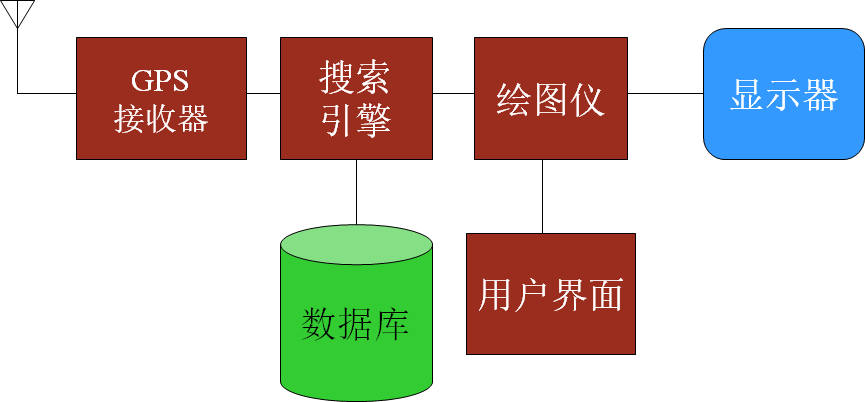

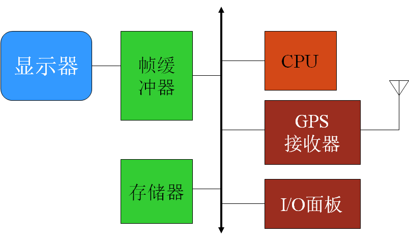

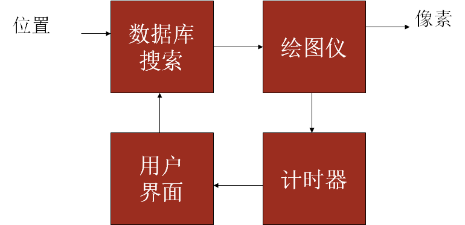

> **软硬件综合实现**
>
> 在开始写代码之前要构造系统
>
> ​	🔷有些组件是已经构造好的
>
> ​	🔷有些可以对已经存在的设计进行修改
>
> ​	🔷其它的需要从头设计
>
> **系统仿真验证**
>
> 🔷得到可运行的系统
>
> 🔷仿真验证
>
> ​	发现bugs——非常困难
>
> ​		调试工具少
>
> ​		有些不正确的工作很难修复

### 四.嵌入式系统发展

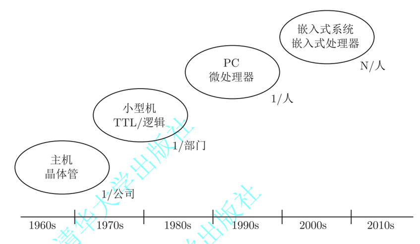

#### 早期历史

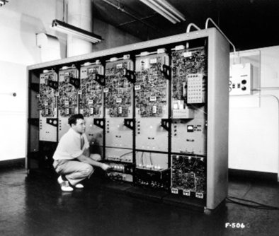

-	设想作为一种控制飞机模拟器的装置.
-	体积庞大
-	从构件到系统的完整设计上是适应实时嵌入式计算的需求

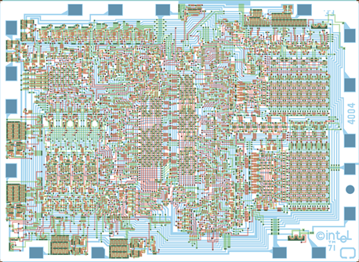

Intel4004 用于计算器中

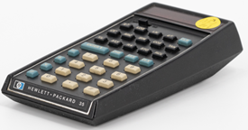

汽车基于微处理器的引擎控制系统的设计开始于70年代.

- 控制燃料/气体混合、活塞花点火时间等.
- 多模式操作：叫醒模式、导航模式、爬坡模式等.
- 提供低排放、高效燃油.

现代物联网和人工智能是是嵌入式系统应用的重要领域

#### 微处理器变化

- **微控制器**：包括 I/O设备, 板上存储.
- **微处理器**：由计算机的CPU发展而来
- **数字信号处理(DSP)**: 微处理器在数字信号处理能力上的优化.
- **典型的嵌入式字的大小**: 4-bit, 8-bit, 16-bit, 32-bit, 64-bit.
- **语言**：汇编语言到C语言等高级语言

### 五.小结

🔷嵌入式系统是具有特定（或专用）功能的计算机系统

🔷嵌入式系统是由软硬件组成，具有丰富的外设

🔷嵌入式系统开发采用软硬件协同设计方法

🔷今年来，嵌入式系统的复杂程度和性能呈爆炸式增长