# 嵌入式系统设计-微处理器体系架构

## 一.嵌入式微处理器体系架构

### 冯 · 诺依曼结构 vS 哈佛结构（每节课都在提）

🔷冯 · 诺依曼结构 

- 由中央处理器（CPU）和存储器组成
- 通过一组总线（包括地址总线和数据总线）连接 
- 指令和数据以同等地位存储在同一存储器中 
- 对指令和数据的访问都是通过这组总线来实现的
-  存储器访问通过分时复用的方式进行

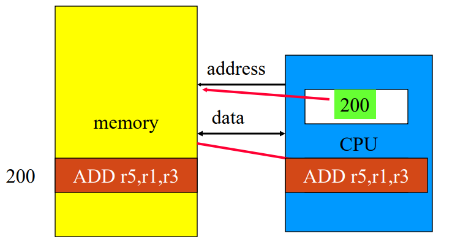

🔷哈佛结构

- 两个独立的存储模块，分别存储数据和指令 
- 两套独立的总线，分别作为CPU和两个存储器通信
- 指令和数据的访问可以同时进行，并且指令和数据可 以有不同的带宽
- Microchip 公司的 PIC16 芯片的指令是 14 位宽度， 而数据是 8 位宽度

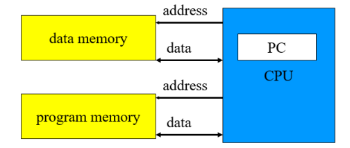

### CISC&RISC(又又又出现了)

**复杂指令集计算机（CISC）**

-  依靠增加指令的复杂度，来改善计算性能 
- 指令格式不固定，指令可长可短，操作数可多可少 
- CPU寻址方式复杂多样
-  采用微程序控制 
-  每条指令执行平均时钟周期数CPI超过5个时钟周期

CISC指令的使用频率不均衡，且相差悬殊，20%/80%定律 

CISC依靠增加指令数目，来改善其性能缺点

 **RISC** 

- RISC 统一了计算机的体系结构
- 指令非常少，通常只有几十条
- 每条指令长度统一，CPU寻址方式少 
- 便于应用流水线技术
- 大部分指令是单时钟周期完成

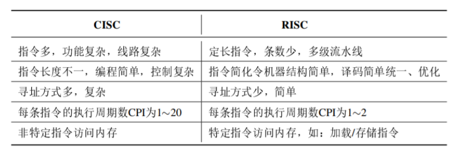

### 嵌入式微处理器特点

- 实时性：在处理器设计上要求有较短的响应时间
- 多任务：不相关的过程需要计算机同时处理，降低系统复杂性，保证实时性
- 存储保护：提高系统可靠性

### 嵌入式微处理器分类

**嵌入式微控制器**（MCU）

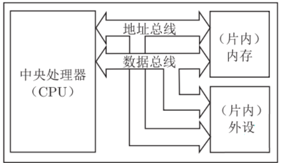

-  微控制器是将一个计算机集成到一个芯片，形成单片机
-  通过单片机控制嵌入式设备
- 片内可以集成 ROM/EPROM、RAM、总线、总线逻辑、定时/计数器、看门狗、I/O、串行口、脉宽调制输出、ADC、DAC、Flash RAM、EEPROM 等各种必要的功能部件和外设
- 芯片尺寸大大减小，系统总功耗和成本下降，可靠性提高

**嵌入式微处理器**(MPU)

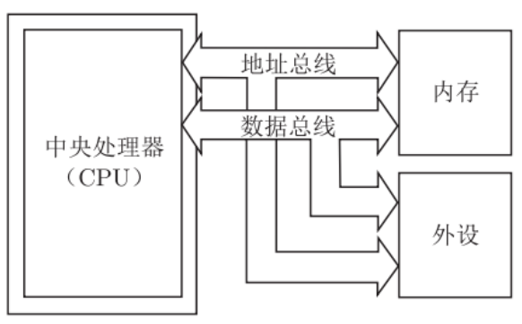

- 由通用计算机中的 CPU 发展而来，只保留和嵌入式应用紧密相关的的功能硬件
- 低功耗和低资源实现嵌入式应用的特殊要求
- 主要面向结构更复杂、功能更丰富、性能要求更高的嵌入式应用

### **嵌入式微处理器分类**

**数字信号处理器（DSP）** 

- 专门用于信号处理的处理器

- 具有很高的编译效率和指令执行速度

- 应用在数字滤波、快速傅里叶变换、谱分析、语音编码、视频编

- 码、数据编码和雷达目标提取类型

-  单片化设计

- 集成在微控制器、微处理器、片上系统中的 DSP 协处理器

**嵌入式片上系统（SOC）** 

- 实现一个完整的硬件和软件系统
- 具有集成度高、处理能力强、功能组件丰富、体积小、重量轻、低功耗等特性

**RISC-V架构**

- 基于RISC原理建立的免费开放指令集架构
- 指令集完全开源、设计简单、易于移植Linux系统、采用模块化设计、拥有完整工具链
- 基本指令集共47条，可分为：整数运算指令、分支转移指令、加载/存储指令、控制与状态寄存器访问指令、系统调用指令

**人工智能芯片**

- 人工智能时代的基础设施
- 在数据中心部署的云端和在消费者终端部署的终端
- 任务：训练和推理
  - 训练需要极高的计算性能、较高的精度以及处理海量数据的能力
  - 推理对性能的要求并不高，对精度要求也更低，在特定的场景下，对通用性要求也低，能完成特定任务即可

**多核处理器**

- 在一枚处理器中集成多个完整的计算内核，由总线控制器提供所有总线控制信号和命令信号
- 需解决的问题：器件资源分配策略、任务调度策略、节能策略、软硬件协同设计策略等

## 二.ARM微处理器体系架构

### ARM 的经营模式

- 出售其知识产权，将技术授权给世界上许多著名的半导体、软件和 OEM 厂商，并提供技术服务

ARM的版本：内核版本和处理器版本

- 内核版本：ARM架构
  -  ARMv1, ARMv2, ARMv3 …ARMv8

- 处理器版本：ARM处理器
  - ARM1, ARM9, Cortex A …

ARM 是从 ARM7TDMI 开始的，在嵌入式系统领域得到广泛应用

### ARM产品路线图

- 经典系列，包括 ARM7、ARM9、ARM11 系列
- Cortex-R 系列，提供非常高的性能和吞吐量
- Cortex-A 系列，面向尖端的基于虚拟内存的操作系统和用户应用
- Cortex-M 系列，用于注重成本节约的微处理器
- 本书将以ARM Cortex-M4为主，介绍嵌入式的开发设计

### ARM v7体系架构

- 支持Thumb-2技术：单指令多数据
- 在ARM的Thumb上发展的，保持了代码兼容性。
- 比纯32位代码少使用 31％的内存
- 比Thumb技术高出38％的性能
- ARMv7架构还采用了NEON技术
- 将DSP和媒体处理能力提高了近4倍 
- 支持改良的浮点运算，满足3D图形、游戏以及传统嵌入式控制应用的需求
- ARMv7支持JIT(Just In Time)技术
- DAC(DynamicAdaptive Compilation)技术的使用

### CORTEX-M4系统架构

- ARMv7ME哈佛架构，带分支预测的3级流水
- 低成本、小管脚数和低功耗，并具有极高的运算能力和极强的中断响应能力
- 采用纯Thumb-2指令，具有32位高性能，ARM内核达到16位代码存储密度
- 可配置1-240个中断源，中断延迟最大12个，最小6个时钟周期
- 1.25DMIPS/Mhz的性能和0.19mW/Mhz的功耗
- 可选配的调试和跟踪模块

### CORTEX-M4微处理器架构

两种处理器模式： 

- 线程(Thread)模式
- 处理(Handler)模式

软件的两种执行方式：

- 特权级
- 用户级（非特权级）

操作模式与执行特权方式的关系

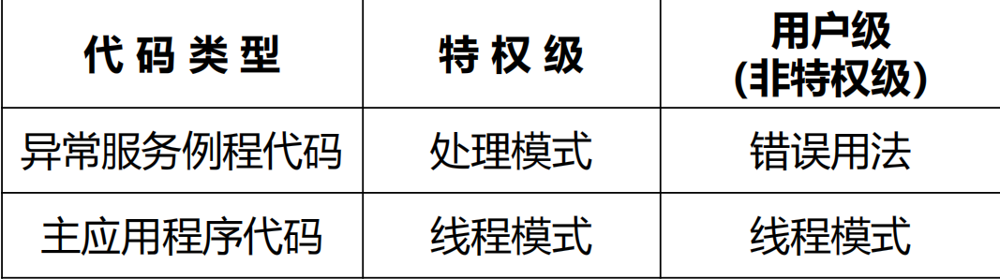

特权级可以访问处理器的所有资源，用户级是受限

对于用户级线程模式

- 有限制地使用 MSR 和 MRS 指令，不能使用CPS指令禁止或使能中断
- 不能访问系统时钟、NVIC 或者系统控制模块。
- 可以受限制地访问内存或外设。
- 使用 SVC 指令通过系统调用，将控制转换到特权级。

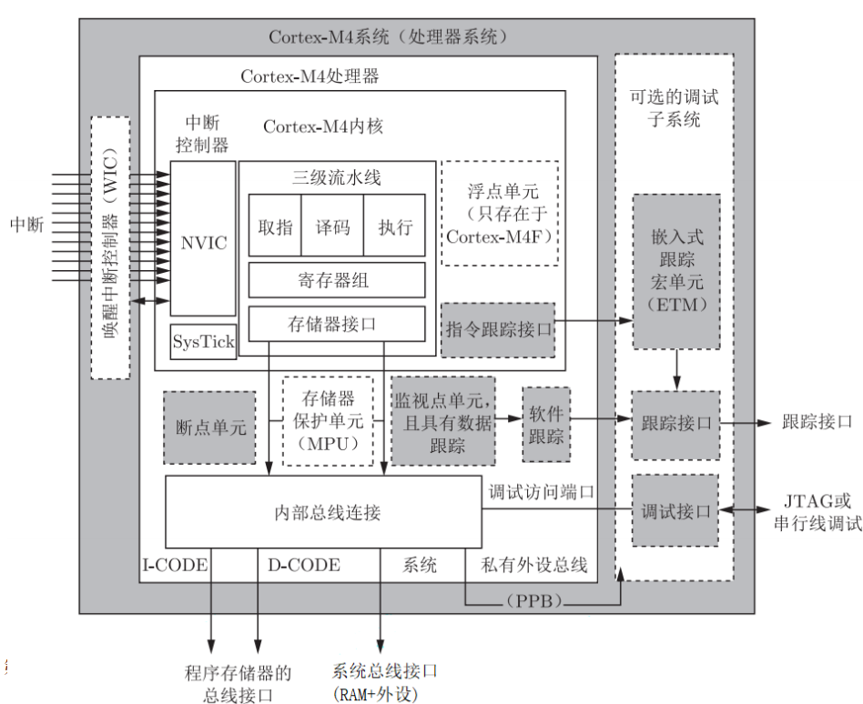

### CORTEX-M4内核流水线

- 三级流水：取指、译码、执行
- 32位系统，总线宽度32位，一次取一条32位的指令
- 若是16位的thumb指令，处理器每隔一个周期做一次取指
- 当执行调转指令，整个流水线会刷新，从目的地取指
- 分支预测，减少流水线气泡过大

### 可编程模式

- 处理器模式和软件执行的特权级别
- 核心寄存器
- 堆栈
- 异常中断所涉及到的寄存器
- 数据类型

### CORTEX-M4寄存器

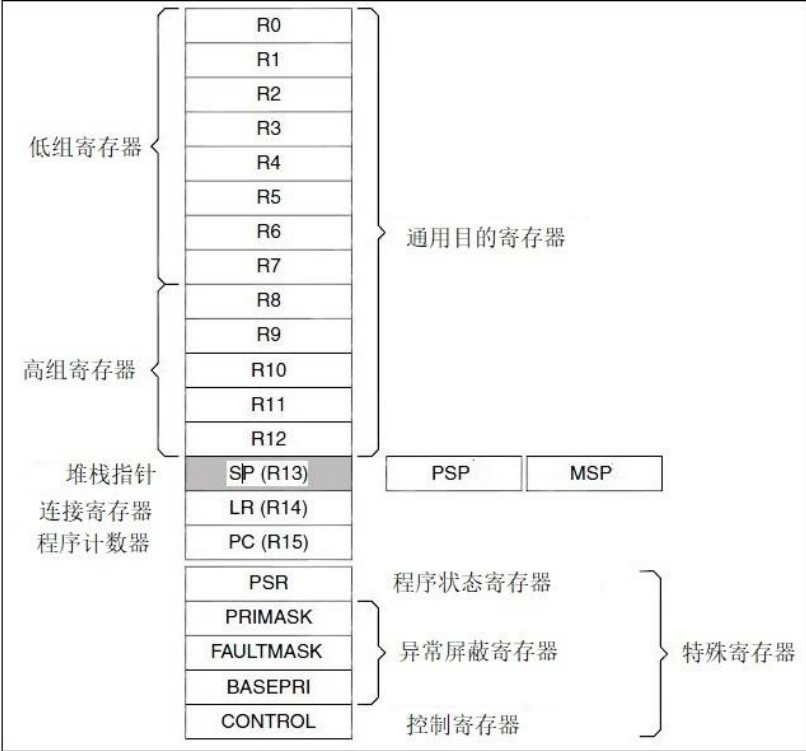

### 核心寄存器R0-R15

- 通用寄存器R0~R12：用于数据操作，thumb-2的32位指令可访问
- 低组寄存器R0~R7：thumb16位指令可访问
- 高组寄存器R8~R12
- 堆栈指针R13(SP)：指示系统的栈空间
- 主栈指针MSP
- 进程栈指针PSP
- 链接寄存器R14(LR)
- 程序计数器R15(PC)

### 特殊寄存器

程序状态寄存器PSR：只有在特权级下才可访问

-  应用状态寄存器APSR
- 中断状态寄存器IPSR
- 执行状态寄存器EPSR

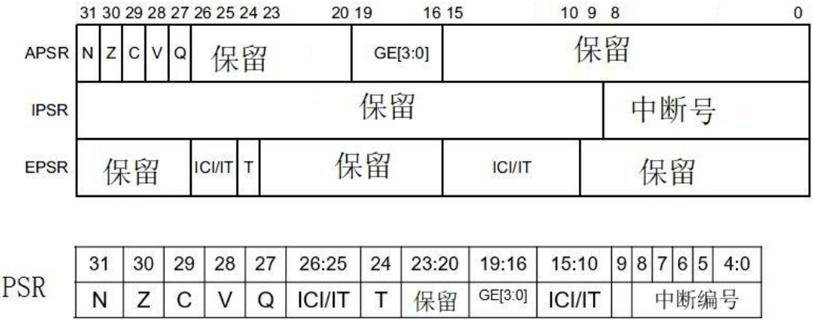


## 三.中断机制

🔷绝大部分的处理器都支持中断机制

🔷中断由硬件电路产生，并改变 CPU 执行顺序

🔷类型

- **外部中断/硬件中断**：外部硬件设备为获得CPU的执行而产生的异步事件
- **软件中断/陷阱**：程序中特殊指令产生的同步事件
- **内部中断/异常**：出现一些异常情况下，CPU自发生成的同步事件

### Cortex-M4处理器的异常来源

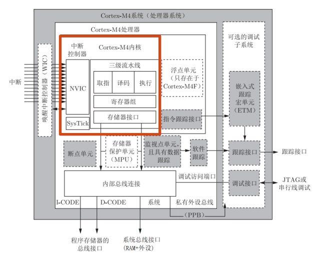

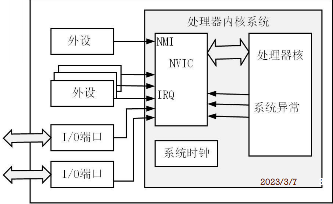


### CORETEX-M4处理器的系统异常方式

> - Reset复位：异常模式复位
> - NMI非屏蔽中断：除复位以外最高优先级的异常
> - 硬件故障：异常处理错误或一种异常不能被其他异常机制管理
> - 存储器管理故障：与内存保护相关的异常
> -  总线故障：指令和数据内存处理相关的故障
> - 用法故障：指令执行相关的故障
> - SVC：SVC指令触发的异常
> - PendSV：中断驱动的系统级服务请求
> - SysTick：系统定时器递减到0产生
> - Interrupt (ISQ)：外部中断,240个

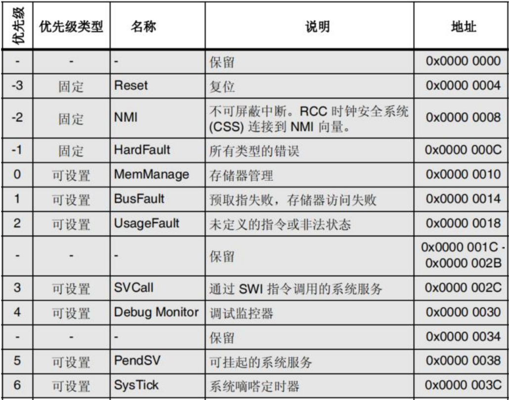

### 中断优先级

- 较小的值表示较高的优先级
- 除复位、硬错误和NMI以外所有的异常或中断都可配
- 置优先级
- NVIC支持优先级分组，可配置的优先级在0~15范围
  -  中断优先级寄存器项分为两个字段：上部字段和下部字段
    -   上部字段定义组优先级
    - 下部字段定义组中的子优先级
  -  组优先级确定中断异常的抢占

### 中断管理

中断前的准备工作：

​	▪ 设置所需的中断优先级（可选）

​	▪ 使能外设中可以触发中断产生

​	▪ 使能NVIC中的中断

### 异常/中断处理过程

满足以下各条件，处理器会接收异常/中断请求： 

- 处理器正在运行（未被暂停或复位状态）
- 异常/中断处理使能状态
- 异常/中断的优先级高于当前的等级
- 异常/中断未被屏蔽

**进入异常/中断服务前需完成以下工作：**

-  将多个寄存器和返回地址入栈
- 取出异常/中断向量（异常/中断对应的ISR入口地址）
- 取出将执行异常/中断处理的指令
- 更新多个NVIC寄存器和内核寄存器（包括PSP, LR, PC, SP, 内核状态信息）
- SP值自动调整，PC更新为异常/中断处理的入口地址，LR被特殊值EXC_RETURN更新

**执行异常/中断服务：** 

- 进入特权级处理模式
- 执行中断服务子例程

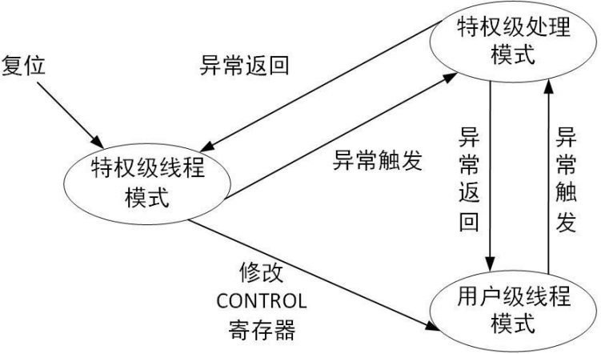

**异常/中断返回操作：**

- 由特殊地址EXC_RETURN触发
- EXC_RETURN在进入中断时被存入LR
- EXC_RETURN写入PC时，触发异常/中断返回操作

## 四.嵌入式汇编语言

| 使用汇编程序编写代码的优点：   |
| ------------------------------ |
| 针对性强                       |
| 程序执行效率高                 |
| 设备驱动程序精简               |
| 占用资源少                     |
| 汇编语言能够更好地理解高级语言 |

**ARM 微处理器**

- 传统 ARM 处理器支持 32 位和 16 位的 Thumb指令集
- Cortex-A 和 Cortex-R 系列处理器支持这两种运行状态
- ARM 的 Cortex-M 系列处理器采用了 Thumb-2 技术，且只支持 Thumb 运行状态，不支持 ARM 指令集

### 汇编程序的结构

- 由段组成，段是相对独立的指令或数据单位，具有特定的名称
- 每个段由AREA伪指令定义
- 段属性可定义为READONLY(只读)或READWRITE(读 写) 
- 段可分为：
  - 代码段：执行代码
  - 数据段：存放运行所需的数据

### CORTEX-M4汇编语言

与机器指令通常是一对一. 

基本特点: 

- 每行写一条指令. 
- 标签提供地址的内容(通常从一行的第一列开始).
- 指令开始于后续列. 
- 一条指令到一行的结束. 
- 注释以分号开始，到一行的结束

### 汇编程序的结构

```
AREA HELLO, CODE, READONLY
ENTRY ; 伪指令标识程序的入口点
Start ; Start函数的入口地址
LDR R0, =0x1
MOV R1, #1
...
END ; 伪指令表示代码段结束
```

### 指令格式

▪Cortex-M4指令的助记符格式如下：

> <opcode><cond>S<Rd>,<Rn>，<oprand2>


-  <>为必选项，{}为可选项
- opcode：操作码，即指令助记符，如：ADD, LDR, STR等 
-  cond：条件码，描述指令执行的条件，如：EQ, LE等 
-  S：指令后加S，指令执行完成后自动更新状态寄存器的条件标志位
- Rd：目标寄存器
- Rn：第一个操作数寄存器
- operand2：第二个操作数，可以是寄存器、立即数等 

> 例：LDR R0, [R1] ; 将存储器地址为R1的字数据加载到寄存器R0中

### 寻址方式

**立即寻址**

也叫做立即数寻址，立即数以#为前缀如：

```
 MOV R0, #4           ;R0 ← 4
 ADD R0, R0, #0x10    ;R0 ← R0+0x10
```

**寄存器寻址**

把寄存器中的数值作为操作数，也称为寄存器直接寻址如：

```
 ADD R0, R1, R2 ; R0 ← R1+R2
```

**寄存器偏移寻址**

将第二个操作数，进行移位操作后赋值给第一个操作数如：

```
MOV R0, R1, LSL #2 ;R0 ← R1 << 2
```

**寄存器间接寻址**

把寄存器中的值作为操作数的地址，通过该地址从存储器取出操作数如：

```
LDRB R0, [R1] ; read byte value from [R1]
; extending to 32bits on load R0 
STRB R0, [R1] ;[R1] ← R0
```

**基址变址寻址**

将寄存器的值与地址偏移量相加得到地址

- 感叹号表示前增量寻址模式
- [R1], #2 表示后增量寻址模式

如：

```
LDR R0, [R1, #2] ;R0 ← [R1+2]
LDR R0, [R1, #2]! ;R0 ← [R1+2], R1 ← R1+2
LDR R0, [R1], #2 ;R0 ← [R1],R1 ← R1+2
LDR R0, [R1, R2] ;R0 ← [R1+R2]
```

### **数据处理指令**

寄存器与寄存器之间，寄存器与特殊寄存器之间，把立即数加载到寄存器

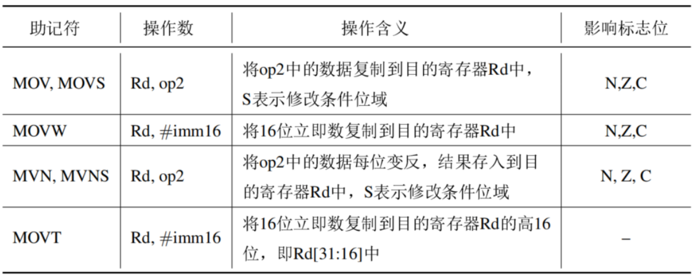

#### **算数运算指令**

基本的算数运算指令包括：加法、减法运算，反向减法指令，有符号无符号加减法指令

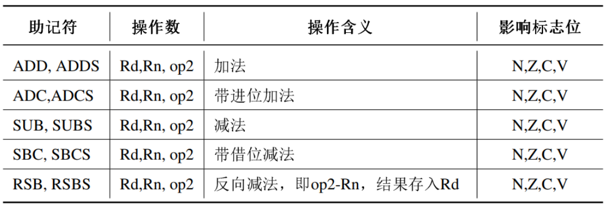

**乘法指令、乘加指令和除法指令**

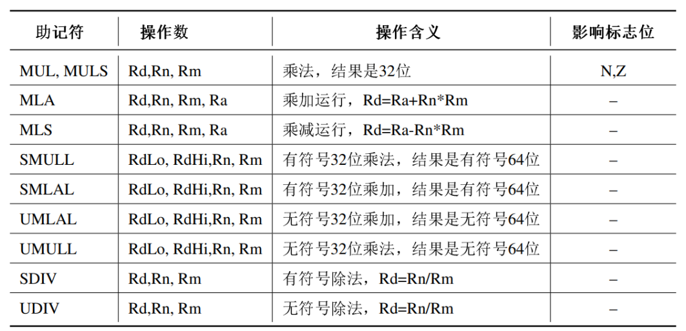

#### **逻辑运算指令**

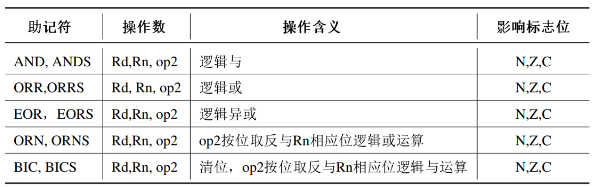

#### **移位指令**

**逻辑移位，算术移位，循环移位**

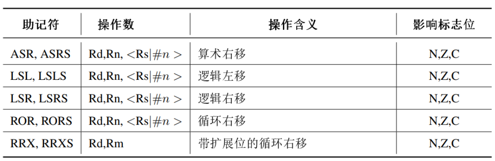

#### 比较与测试指令

**更改条件标志位**

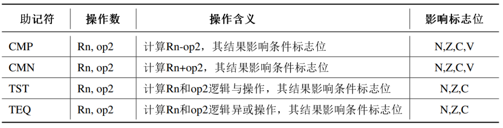

#### **位域操作指令**

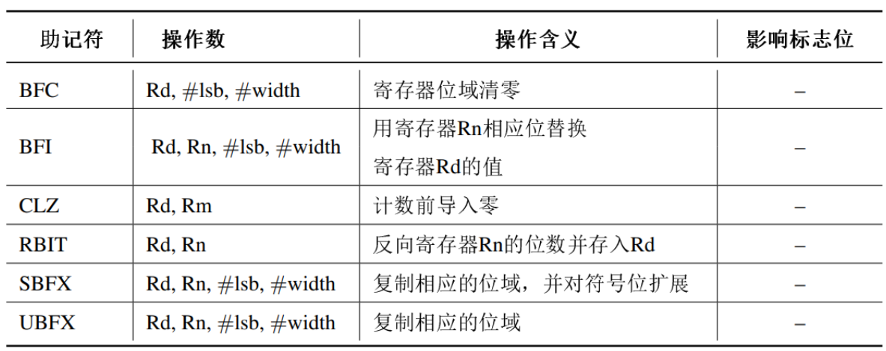

#### 跳转指令

无条件跳转，函数跳转，条件跳转，IT-THEN指令块，查表跳转等

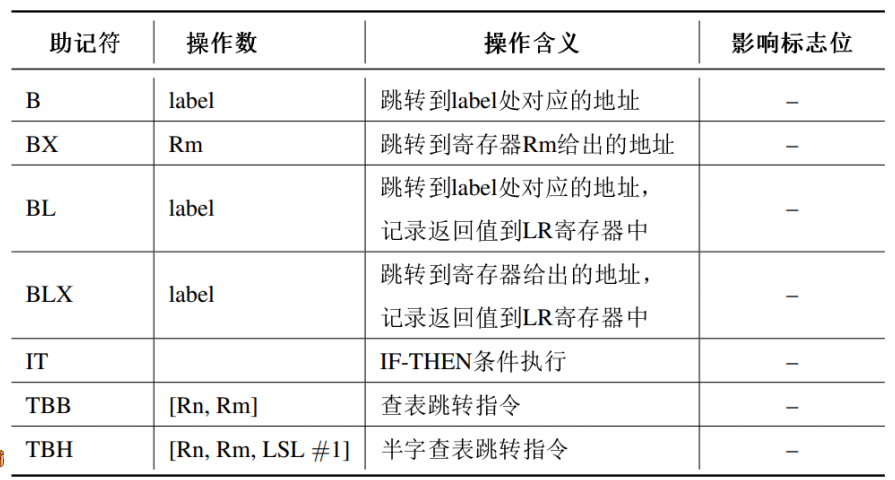

### 存储器访问指令

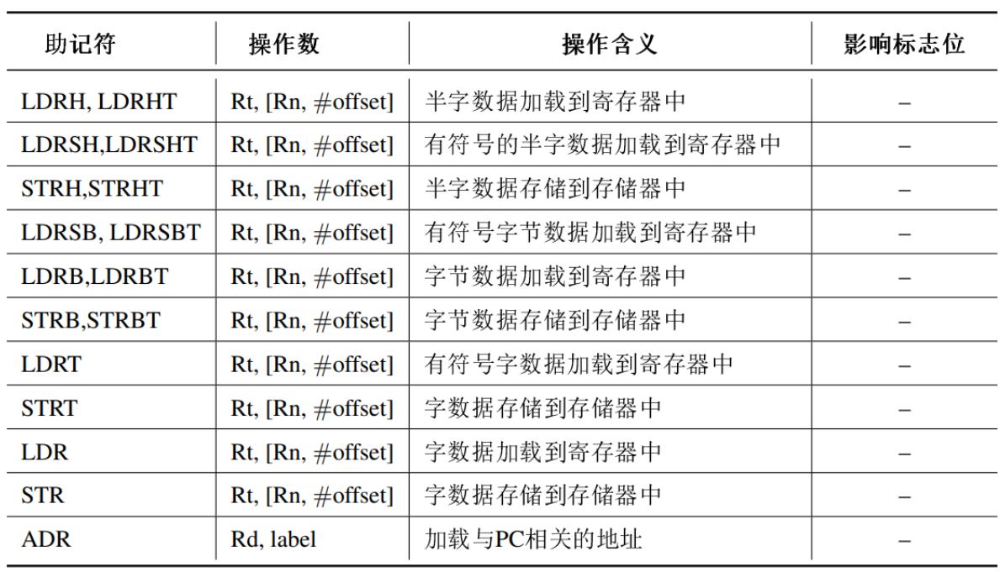

**批量加载/存储数据指令**

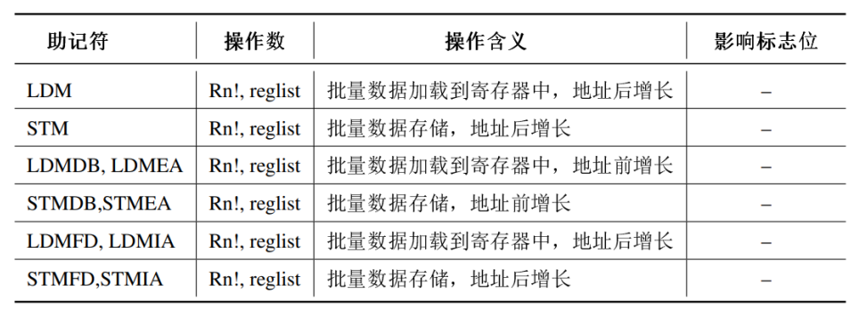

**进栈出栈指令**

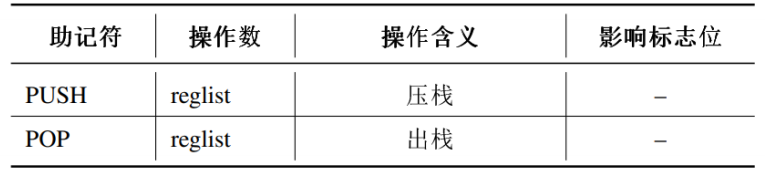

### 汇编程序设计

#### 例1：C语言赋值语句对应的汇编程序：x=a*b+c; 

 对应的汇编程序：

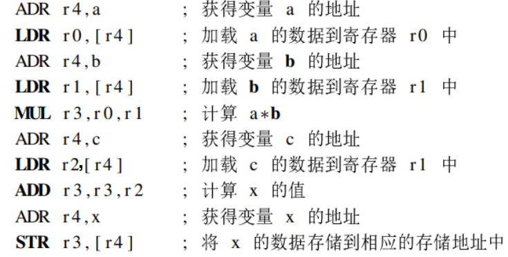

#### 例2：C语言逻辑表达式对应的汇编程序：

```
𝑧 = 𝑎 ⊕ 𝑐 ||(𝑏&𝑐); 
```

 对应的汇编程序：

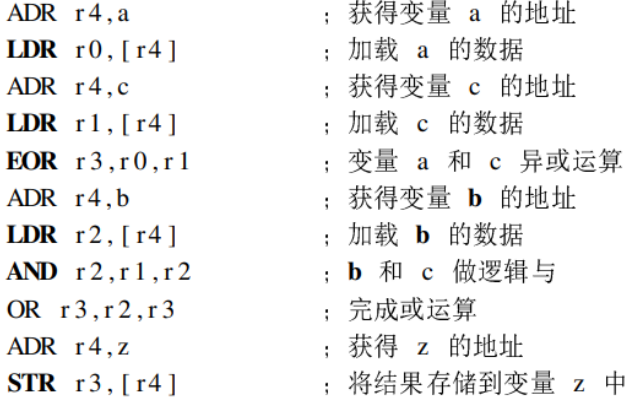

**ARM控制流**

▪所有操作可通过测试PSR，有条件执行: 

▪EQ, NE, CS, CC, MI, PL, VS, VC, HI, LS, GE, LT, GT, LE

▪分支操作:


> 条件码：
>
> 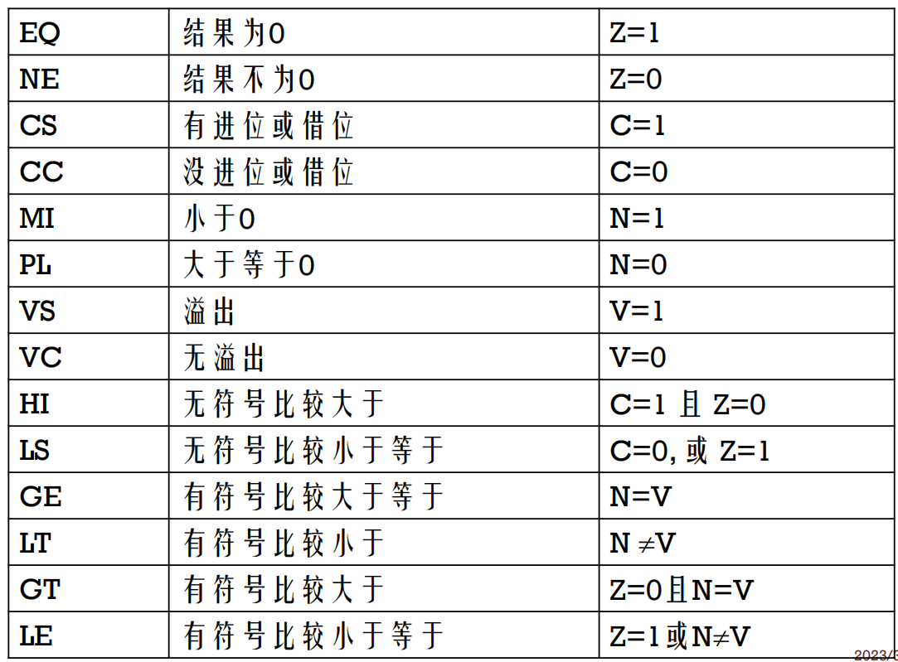

#### 例3：C语言条件语句对应的汇编程序：

```
if (a==1) b=2;
```

对应的汇编程序：

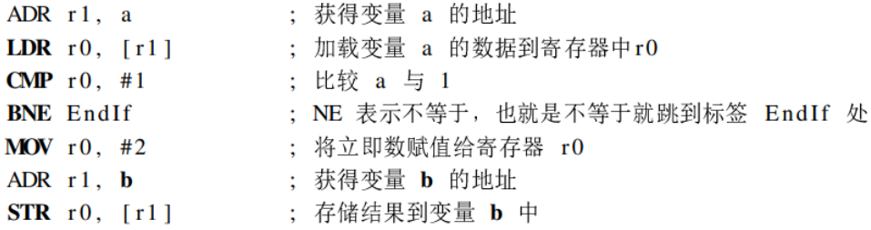

#### 例4：C语言经典条件语句对应的汇编程序

```
if (a>1) b=2; else b=b-a;
```

对应的汇编程序：

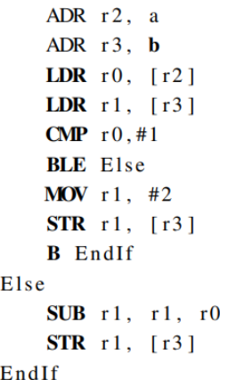


#### 例5：C语言循环语句对应的汇编程序：

```
while(a!=b){
	if(a>b)
		a=a-b;
	else 
		b=b-a;		
}
gcd=a;
```

对应汇编：
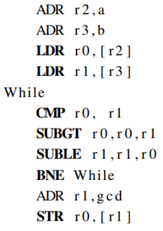

## 五.流水线技术

- 通过多个功能部件并行工作来缩短指令的运行时间，提高系统的效率和吞吐率
- 指令执行以分解为多个阶段，各阶段使用硬件部件不同，这样指令执行就可重叠，实现指令并行
- 延迟：指一条指令从进入流水线到流出流水线所花费的时间
- 吞吐量：是指单位时间内执行的指令数
- 流水线技术增加了 CPU 的吞吐量，但并没有减少每条指令的延迟

**三级流水线**：包括取指、译码、执行三个阶段

实现逻辑最简单

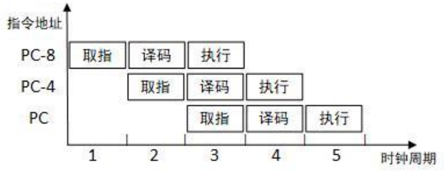

**五级流水线**：取指、译码、执行、缓冲/数据、回写五个阶段，实现逻辑最经典

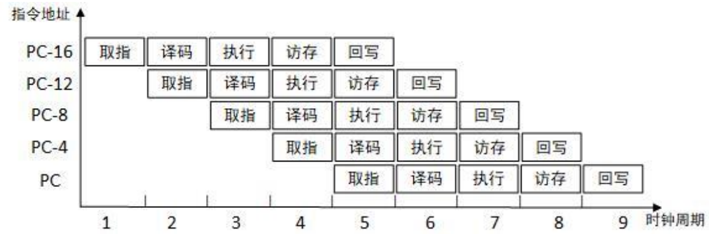

超流水线超过了通常的5到6级，实现逻辑最复杂.

### CORTEX-M4的三级流水

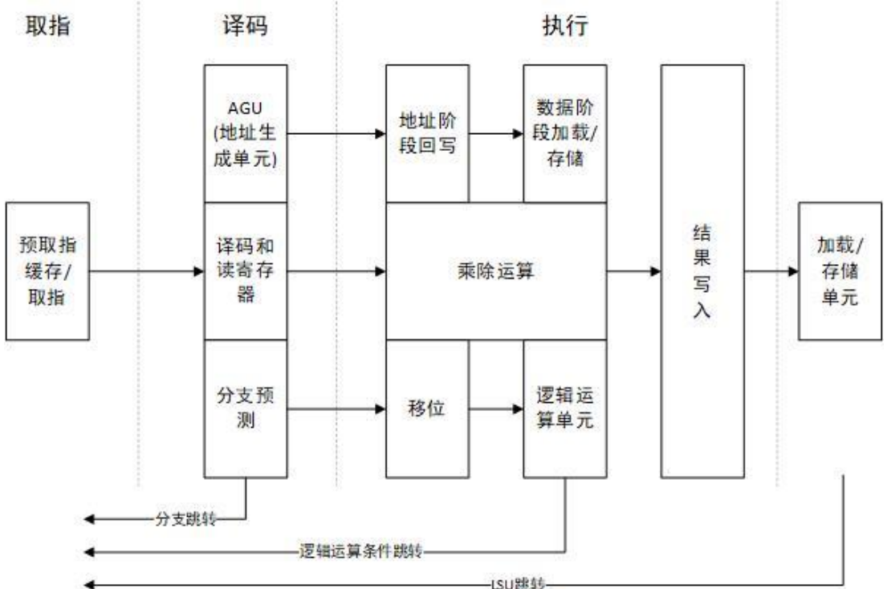

- 取指阶段：
  -  取指用来计算下一个预取指令的地址，从指令存储空间取出指令，或者自动加载中断向量
  -   包含一个预取指缓冲区，避免流水线“断流”
- 译码阶段：
  -  译码对之前取指阶段送入的指令进行解码操作，分解出指令中的操作数和执行码
  -  再由操作数相应的寻址方式生成操作数的地址，产生寄存器值
- 执行阶段：
  -  用于执行指令，产生LSU的回写执行结果

### 影响流水线性能的因素

- 数据冲突
- 跳转指令
- 流水线深度

# 本章小结

- [x] 冯·诺依曼结构和哈弗结构
- [x] 复杂指令集和简单指令集
- [x] Cortex-M4体系结构及汇编指令
- [x] 流水线技术