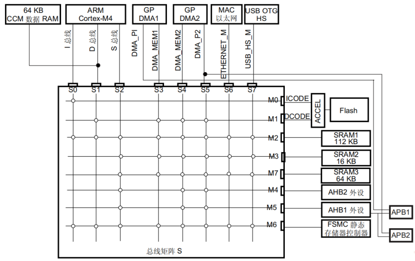
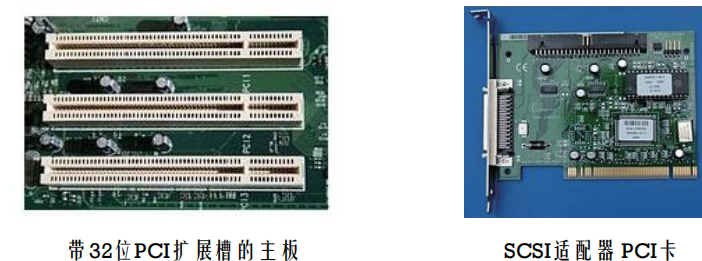
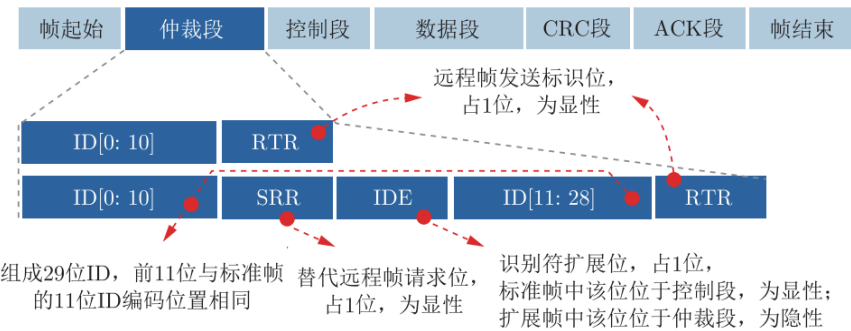
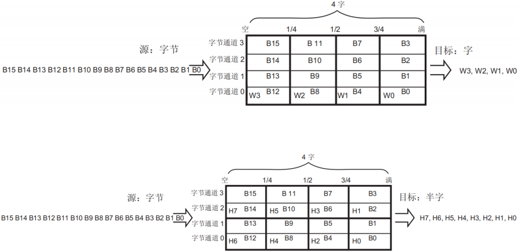
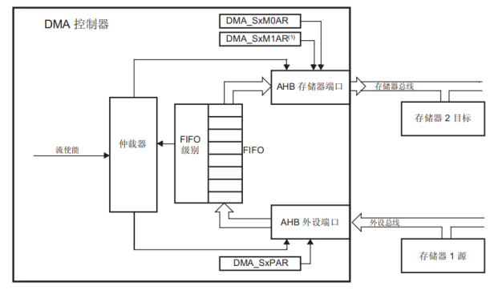

# 第三章   嵌入式总线技术

- 系统总线概述
- 总线结构与协议
- DMA
- ARM CPU总线结构
- 总线的性能分析

## 3.1 系统总线概述

总线的定义：一种描述电子信号传输线路的物理结构形式，是一组信号线（电线）的集合

- 一组信息传输的信号线
- 总线协议

#### 分类

按功能的分类

- 数据总线 - 传输数据
- 地址总线 –传输地址
- 控制总线 –传输控制指令/信号
- 扩展总线 – 不常使用的部件的扩展

按信息位置：内部总线和外部总线

按时空组织特性：串行总线和并行总线

## 3.2总线结构和协议

CPU总线的结构

- CPU通过总线和外设进行数据交换
- 通常CPU是总线的主控


### 四周期握手协议-最常见的总线协议


1. 设备1提出请求

2. 设备2响应该请求

3. 一旦数据传送完成，设备发出接收完数据的信号

4. 设备1结束请求

#### 典型的总线

- Clock：时钟，用于同步总线组件
- R/W：总线的读或写使能信号
- Address：地址总线，一束信号线
- Data：数据总线，一束信号线
- DataReady：数据就绪

#### 总线读

▪时钟信号上升沿，设置地址使能信号，地址线上设置所需地址值 

 表示读 

▪ 在第一个时钟周期后，外设将相应地址的数据传送至数据线，数据准备线使能 

▪ CPU读取数据，在第二个时钟周期末，撤去地址线上的地址，外设清除数据线上的数据值。


#### 总线写

时钟信号上升沿，设置地址使能信号，地址线上设置所需值 

表示写 

▪ 在第一个时钟周期后，CPU 将数据传送至数据线，数据准备线使能 

▪ 外设向相应地址的存储单元写数据，在第二个时钟周期末，撤去地址线上的地址，并清除数据线上的数据


#### 读操作的等待状态

总线上连接的是速度比它慢的设备

▪等待状态通常用于将慢速、廉价的存储器连到总线上

▪等待状态：数据可以被读取的最早时间与真正被读取的时间之间的周期


#### 突发状态（Brust Transfer）

▪收到一个地址，传输一组数据序列

▪增加一根线路：Burst，低电平有效


### 南北桥体系下的总线


- 处理器 CPU 和北桥之间的是速度最快的处理器总线
- 北桥通过DRAM控制器连接高速主存
- 北桥与南桥之间是 PCI 总线
- 南桥上连接 USB 等接口和相关设备
- 南桥之下是ISA、 EISA等传统的慢速 I/O 扩展总线

#### STM32F42系列芯片总线



#### 典型总线结构及协议

- ISA总线
- PCI总线
- APG总线
- PCI-express总线
- CAN总线
- 以太网总线

#### ISA总线

- 1981年在IBM PC/XT计算机中采用
- 有8位/16位ISA总线规范
  - 8位最大传输速率8MB/s


- 1988年扩展到32位，形成EISA总线
  - 工作频率仍为8MHz
  - 与 8 位/16 位的 ISA 总线完全兼容
  - 最大传输速率达到了 32MB/s 
- 在 20 世纪 90 年代初，逐步被 PCI 总线取代
- 在工业和军事领域，ISA 总线目前仍在使用

#### PCI总线

- 1992年Intel公司提出32位的PCI总线
  - 工作频率 33MHz，传输带宽为 133MB/ s
  - 基本上满足了当时处理器与显卡、声卡、网卡、硬盘控制器等高速外围设备的通信需要
  - Adaptec公司的 32 位SCSI适配器 



- PCI 1.0采用5V供电，PCI 2.0及以后3.3V供电
- PCI 2.1支持66MHz工作频率
- PCI 2.2引入Mini PCI，以支持笔记本

> 版本系列：
>
> PCI 1.0（1992年发布）、PCI 2.0（1993年发布）、
>
> PCI 2.1（1995年发布）、PCI 2.2（1998年发布）、
>
> PCI 2.3（2002年发布）、PCI 3.0（2004年发布）

为支持在服务器领域更高传输速率，1999年制定了PCI-X 

PCI-X 1.0是64位、133MHz版本的PCI，保持PCI总线的兼容

PCI-X 2.0、3.0频率经历过266MHz、533MHz、甚至1GHz

- 实际通信效率远远达不到理论值 
- 频率增高后通信信号串扰严重
- 共享式总线造成资源竞争

**PCI-X总线特点：**

- 寄存器到寄存器的信号传输方式
- 使用总线事务分割概念，请求和响应是分开的 
  -  第一个操作是请求传输
  - 然后总线可以做其它操作
  - 等数据准备好后，传输随后开始
- 引入消息触发中断机制

PCI和PCI-X总线统称并行PCI总线

#### AGP总线-Accelerated Graphics Port

Intel1997年8月推出AGP接口和总线

- 显卡专用的局部总线，基于PCI 2.1版总线规范扩充修改而成
- 工作频率为66MHz
- 1X模式下带宽为266MB/s，是当时PCI总线的带宽的两倍
- 后来又推出了AGP 2X、AGP 4X、AGP 8X，传输速度达到了2.1GB/s。 
- 专门针对显示器，后续也被淘汰，让位于PCIe


#### PCI-Express总线

▪PCI Express是Intel在2001年公布的旨在取代PCI总线的第三代总线

▪ 2002年7月23日，公布了PCIe 1.0规范

▪ 2007年正式推出PCIe 2.0

▪ 2018年公布PCIe 4.0


- 引入道的概念
  -  由两个分别用于发送和接收数据的差分信号对组成，同时双向传输字节包数据
- 全双工
-  设备之间通过双向的Link相连接，每个Link支持1到32个道


- 串行总线
  - 每道在每个方向上只有一对差分信号线，不需外部时钟信号可达到很高的速率


- 支持热插拔

##### 技术指标


8b/10b编码的特性之一是保证DC 平衡

-  采用8b/10b编码方式，使得发送的0、1数量保持基本一致，连续的1或0不超过5位，即每5个连续的1或0后必须插入一位0或1，从而保证信号DC平衡
- 128b/130b编码是在128 bit的Payload前面加上了2 bit的同步头


#### 补充概念：差分信号

差分方式传输：发送端在两条信号线上传输的幅值是相等的，相位是相反的电信号


- 接收端，将会对接收的两条信号做减法运算，这样就获得了幅值翻倍的信号
- 抗干扰原理是：假如两条信号都收到同样的干扰信号，接收端是两条线信号做减法，因此干扰信号基本抵消。 
- 两条信号线受到干扰信号相同的办法：将两根线扭在一起的“双绞线”
  -  电磁学定理：双绞线收到的干扰信号是同相、等幅度的 
  - 差分信号在信号传输中用的比较多，因为抗干扰性强

#### CAN总线-Controller Area Network

- 德国Bosch公司开发的，后来成为国际标准ISO11898和ISO11519，是应用最广泛的现场总线之一
- CAN总线协议是汽车计算机控制系统和嵌入式工业控制局域网的标准总线协议
- CAN 总线定义了物理层、数据链路层和应用层三层模型结构
- 基于消息的异步通信，利用一对差分信号线减少设备通信线束中连接线的数量
- 可以点对点、一点对多点、或全局广播等方式的传送接收数据

特点：

- 采用多主控器的串行总线标准
- CAN 信号由 CAN_H 和 CAN_L 双绞线构成
- 物理层可采用闭环或开环总线构成
  - 闭环结构
    - 遵循ISO11898标准，高速短距离网络，总线最大长度为40m，通信速度最高为1Mbps
    - 在 CAN_H 和 CAN_L 间连接值为 120Ω 的终端匹配电阻


- 
  - 开环结构
    - 遵循ISO11519-2标准，低速远距离网络，最大传输距离为1km，最高通信速率为125kb/s
    - 两根信号线是独立的、不形成闭环
- 系统要求每根总线上各串联有一个 2.2kΩ 的电阻


##### Can总线收发器

CAN 设备是通过 CAN 收发器来连接的 

▪负责TTL逻辑电平和差分信号电平之间的转换

▪CAN控制芯片输出TTL逻辑电平到CAN收发器

▪CAN收发器通过内部将TTL逻辑电平转换为差分信号输出到CAN总线上

▪TTL电平信号：+5V等价于逻辑“1”，0V等价于逻辑“0”，这样数据通信及电平规定方式，被称做TTL


##### 信号定义

信号有两种不同的信号状态

▪显性的（Dominant）：逻辑 0 

▪隐形的（Recessive）：逻辑 1 

ISO11898标准定义当CANH和CANL电平很接近甚至相等时，总线信号为隐性逻辑1，而两线电平差较大时则为显性逻辑0 

在每次传输完后不需要返回到显性逻辑0，应用不归零NRZ码位填充技术来确定信号值

##### 仲裁

信号采用“线与”规则进行总线仲裁和定义

- 总线上只要有一个节点将总线拉到低电平（逻辑 0）的显性状态，总线就为低电平（逻辑 0）的显性状态
- 只有所有节点都为高电平（逻辑1）的隐性状态，总线才为高电平（逻辑 1）的隐性状态

##### 通信速率与距离


##### CAN总线报文传输

帧格式

▪ 标准帧：11位标识符

▪ 扩展帧：29位标识符

帧类型

-  数据帧：数据从发送器传输到接收器
-  远程帧：总线节点发出远程帧，请求发送同一标识符数据帧
-  错误帧：虽然 CAN 可靠性很高，但还可能发生错误，节点单元检测到总线错误时就发出错误帧 
-  过载帧：在相邻数据帧或远程帧之间提供附加的延时

###### **数据帧：**

- 7个段：帧起始、仲裁段、控制段、数据段、CRC段、ACK段和帧结束
- 有标准格式（ID为11位）和扩展格式（ID为29位）



**帧起始和帧结束：界定一个数据帧**

- 帧起始为单个显性位
- 帧结束为 7 个连续的隐性位

**仲裁段**

- 标准帧：12位，其中ID为11位；扩展帧32为，ID为29位 
- 在总线上的所有节点都可监听总线上传输的数据
- 采用“线与”规则进行总线仲裁
- 若出现不匹配的位不在仲裁期间则，产生错误事件
- 报文的帧 ID 号码越小，优先级越高 
- 数据帧的远程传输请求位 RTR 为显性电平，远程帧为隐性电平，数据帧优先于远程帧
- 标准帧扩展标识符位 IDE 为显性电平，扩展帧的为隐性电平，则标准帧优先级比扩展帧高


使用ID逐位仲裁方法解决竞争问题


**控制段**

控制段：6位 

▪标准帧：标志位IDE、保留位r0、数据长度码DLC

▪扩展帧：2个保留位r1、r0、数据长度码DLC

▪ IDE：1位，扩展帧标志位 

▪DLC：4位：数据长度码，允许的字节数0-8


##### **数据段**

▪为0-8个字节，传输时最高有效位先传输。

**CRC（循环冗余码）校验段**：15+1位 

▪由帧起始段、仲裁段、控制段和数据段计算得到的15位CRC值和1位隐性电平定界符构成

▪RCR最适用于低于127位帧检查，多项式除法，其系数是模2计算

**ACK段**

- ACK槽：1位 
  - 发送节点发送隐性电平、接收正确的节点发送显性电平
  - 总线线与结果为显性电平，发送成功，否则失败
- ACK界定符：1位 
  -  一个隐性电平


###### 其他帧格式

远程帧：作为某数据接收器的节点，可以发送远程帧启动资源节点传输数据

​	无数据段，6个段：帧起始、仲裁段、控制段、CRC段、ACK段和帧结束


错误帧：由2个域组成

- 错误标记：不同节点提供的错误标志的叠加
- 错误界定符 ：连续6个连续的隐性位


过载域：2个域，接收节点用来向 CAN 总线发送节点告知自身接收能力的帧，接收节点来不及处理数据了

- 过载标志
- 过载界定符


#### 以太网络总线

- 1980年Xerox公司和英特尔、DEC公司一起开发了基带局域网规范，后续发展成为当今局域网采用的最通用的通信协议标准。
- 以太网总线协议由IEEE 802.3标准定义
  - 物理层的连线 
  - 电信号和媒体访问控制子层的实现方法
  - 十兆、百兆、千兆和万兆以太网
- IEEE 802.3af定义了将未使用的接口线用于直流供电，即有源以太网
- IEEE 802.3ah版本

##### 例子

-  10Base-5使用直径0.4英寸，阻抗为50欧姆的粗同轴线缆，最大网段长度500m，采用基带传输方法，拓扑结构为总线型，以太网卡为AUI接口。
-  10Base-2使用直径为0.2英寸，阻抗为50欧姆的细同轴线缆，最大网段长度185m，采用基带传输方法，拓扑结构为总线型，以太网卡为BNC接口。
-  10Base-T使用非屏蔽双绞线线缆，最大网段程度100m，拓扑结构为星型，接口为RJ-45。 
- 1Base-5使用双绞线线缆，最大网段长度500m，传输速度1Mbps。 
-  10Broad-36使用同轴线缆（RG-59/U CATV），网络跨度为3600m，网段最大长度为1800m，是一种宽带传输方式。
-  10Base-F使用光纤传输媒介，传输速率为10Mbps。

##### 工作原理

- 工作原理：一种广播型的总线标准，工作过程包含侦听、发送、检测、冲突处理四个处理阶段
-  侦听：在节点准备发送前先侦听总线上是否有数据正在传输。
  -  若“忙”则进入后述的“退避”处理程序，进而进一步反复进行侦听工作
  -  若“闲”，则采用一定算法原则（例如“X-坚持”算法）决定如何发送数据
-  发送：当确定要发送后，通过发送单元，向总线发送数据
-  检测：数据发送后，也可能发生数据冲突。因此，要对数据边发送，边检测，以判断是否冲突
-  冲突处理：当确认发生冲突后，进入冲突处理程序
  - 若侦听中发现线路忙，则等待一个延时后再次侦听
    - 冲突检测时间一般设定为 2*α*，其中 *α* 为网络中最远两个节点的传输线路延迟时间
  - 若发送过程中发现数据碰撞，则先发送阻塞信息连续几字节的全 1，一般为 32～48 位），强化冲突，再进行侦听工作，以待下次重新发送
  - 涉及的算法：退避算法-截断的二进制指数退避算法
    - 当一个节点发现线路忙时，要等待延时时间 M，再进行侦听工作
    -  M 取 0～（2^k − 1 ）一个随机数乘以 512 比特传输时间，其中 k 为冲突（碰撞）的次数
    -  当M 的最大值为1023，即当 k = 10 时获得。随后 M 始终是 0～1023 的一个随机值与 512 比特传输时间的乘积
    -  k 增加到 16 时，就发出错误信息

##### 总线实现

- 将以太网总线放到用应用层、传输层、网络层、数据链路层和物理层5层定义的以太网协议栈中
- 与数据链路层、物理层强相关，可以作为芯片接口，也可以依据需要完全封装到芯片内。
- 以太网帧格式多达5种 

>  Ethernet V1（1980年发布）
>
>  Ethernet V2（ARPA于1982年发布）
>
>  RAW 802.3（Novell公司于1983年发布）
>
>  IEEE 802.3/802.2 SNAP（1985年发布）
>
>  IEEE 802.3/802.2 LLC（1985年发布）

> **Ethernet V2：**
>
> 由RFC 894定义。
>
> ▪ 前导码（7字节0x55，一串1、0间隔，用于信号同步）
>
> ▪ 帧起始定界符SFD（1字节0xD5） 
>
> ▪ 目的MAC地址（6字节）
>
> ▪ 源MAC地址（6字节）
>
> ▪ 类型/长度（2字节，其中 0～1500保留为长度域值，1536～65535保留为类型域值0x0600～0xFFFF） 
>
> ▪ 数据（46～1500字节）
>
> ▪ CRC帧校验序列（4字节，使用CRC计算从目的MAC地址到数据域这部分内容而得到的校验和）

## 3.3DMA

### I/O传输


- 直接存储器存取：Direct Memory Access，DMA
- DMA的主要作用
  - 将数据从一个地址空间复制到另外一个地址空间
  - CPU初始化DMA后，传输由DMA控制器来执行和完成
- CPU在执行DMA初始化后就可以执行其他进程

### DMA和cpu分时使用内存

- **停止CPU访问内存**：当外设要求传送一批数据时，由DMA控制器发一个信号给CPU。DMA控制器获得总线控制权后，开始进行数据传送。一批数据传送完毕后，DMA控制器通知CPU可以使用内存，并把总线控制权交还给CPU。 
- **周期挪用**：当I/O设备没有 DMA请求时，CPU按程序要求访问内存；一旦 I/O设备有DMA请求，则I/O设备挪用一个或几个周期。数据输入或输出过程中实际占用了CPU时间
- **DMA与CPU交替访问内存**：一个CPU周期可分为2个周期，一个专供DMA控制器访内，另一个专供CPU访内。不需要总线使用权的申请、建立和归还过程

### DMA访问过程

一个完整的DMA传输过程经过**DMA请求、DMA响应、DMA传输和DMA结束**四个步骤。

分时控制

- CPU和DMA控制器各自有自己的访问内存地址寄存器、数据寄存器和读/写控制寄存器。
- 在DMA分时控制周期中，如果DMA控制器有访问内存请求，可将地址、数据等信号送到总线上。
- 在CPU分时控制周期中，如CPU有访问内存请求，同样传输地址、数据等信号到总线上。
- 分时控制采用多路控制器实现高效切换。

### 直接存储器访存（DMA）

- DMA无需CPU的加入来完成数据的传输
  - CPU 设置传输
  - DMA 直接完成设备与内存的读写操作
- 需要一个DMA控制单元


### 总线主控器（BUS MASTERSHIP）

- 总线主控器是能够启动总线传输的设备
- 缺省时，CPU是总线主控器，并初始化传输
- DMA可以成为总线主控器来完成传输
  -  DMA 成为总线主控器时，CPU不能使用总线
- 通过四周期握手协议获得总线主控器
  -  总线请求（Bus request） 
  -  总线授权（Bus grant）

### DMA控制器

CPU通过DMA控制器的寄存器来控制DMA

▪ 起始地址寄存器：指明传输从何处开始

▪ 长度寄存器：指明将要传输的字的数目

▪ 状态寄存器：用于CPU操作DMA控制器


### DMA操作

-  CPU 设置 DMA寄存器，如开始地址，要读写的长度
-  DMA 状态寄存器允许CPU操作DMA控制器
-  一旦DMA成为总线主控制器，它就自动传输
  -  可以连续传输直到传输完成
  -  也可以使用几个总线周期


### STM32F4系列DMA控制器结构和DMA特点

DMA是一个AMBA AHB模块，有三个AHB端口，

-  一个从设备接口用于DMA编程
-  两个主设备端口用于外设和存储器访问


- 两个通用的8个数据流双端口DMA控制器，支持16个数据流，每个数据流有多达8个可选通道（即硬件请求）
- 通道选择由软件通过寄存器DMA_SxCR[29:27]即CHSEL[2:0]设置，并允许多个外设初始化DMA请求，数
- 据流之间传输的数据大小是独立的
- 对于APB或者AHB外设，采用专用FIFO，支持最大外设访问带宽，支持猝发传输。
- 两个DMA控制器支持的典型外设包括SPI和I2S、I2C、USART、通用的或高级控制定时器TIMx、DAC、SDIO、
- 摄像头接口（DCMI）和ADC


- DMA数据流/通道：一个数据流任一时间仅有一个通道（请求）被激 活
- 数据流的优先级：优先级可软件配置；若相同，使用硬件优先级
- 源和目的地址：在 AHB 或 APB 存储器范围内并与传输尺寸对齐
- 传输模式：外设到存储器、存储器到外设、存储器到存储器
- 传输尺寸：在流控控制器时被定义；地址增加或者非增加 
- 源、目数据宽度：字节、半字或字；
- FIFO 模式：每个数据流有独立四字 FIFO
- 源或者目的猝发尺寸： 单次传输、4X、8X、16X 数据单位
- 双缓冲器模式、流控

#### FIFO的结构




#### FIFO的阈值配置


### 节拍与数据传输

- 节拍：DMA请求产生一次就是一个节拍
- 数据的大小：1个字节、半字、字
- 传输的数据量，即DMA数据缓冲区大小，最大值为65535
- 例：单次传输，传输大小为半字，DMA请求产生一次（一个节拍）数据传输，总共传输数据 16 / 8* 65535 =131070Byte， 大概传输了128KByte
- 例：单次传输，传输大小为半字，突发4个节拍，4*126kb
- 例：单次传输，传输大小为半字，突发8个节拍，8*126kb
- 例：单次传输，传输大小为半字，突发16个节拍，8*126kb

### DMA设置


### DMA传输：外设到存储器传输模式


- 使能这种模式时，每次产生外设请求，数据流都会启动数据源到FIFO 的传输。
- 达到 FIFO 的阈值级别时，FIFO 的内容移出并存储到存储器中

### DMA传输：存储器到外设传输模式


- 使能这种模式时，数据流会立即启动传输，从存储器填充 FIFO
- 发生外设请求时，FIFO 的内容移出并存储到外设

### DMA传输：存储器到存储器传输模式



- DMA 通道在没有外设请求触发的情况下实现存储器到存储器模式。 
- 通过将使能位 (EN) 置 1 来使能数据流，数据流填充FIFO，达到阈值后，FIFO 的内容会移出，并存储到目标中

### DMA请求的仲裁

DMA控制器嵌入一个仲裁器，基于两个AHB主设备接口上的优先级来管理8个DMA数据流请求发起外设/存储器访问序列。

- 优先级管理分为两个阶段：
  - 软件：每个数据流优先级在 DMA_SxCR 中配置。分为四个级别
    - 非常高优先级
    - 高优先级
    - 中优先级
    - 低优先级
  - 硬件：如果两个请求具有相同的软件优先级，则编号低的数据流优先于编号高的数据流。例如，数据流 2 的优先级高于数据流 4


例：DMA数据流请求1和请求2同时触发的两个循环DMA请求的服务


### DMA延迟性能

DMA 数据流的总体传输时间

```
TS = TSP + TSM
```

其中： 

- TSP是DMA 外设端口访问和传输的总时间
- TSM是 DMA 存储器端口访问和传输的总时间

## 3.4 ARM CPU的总线结构

### 3.4.1

ARM CPU的总线发展历史

▪ ARM公司于1996年提出**AMBA**总线，包括ASB和APB 

▪ 1999年提出AMBA 2，增加了AHB，相关协议是单时钟边沿协议

▪ 2003年提出AMBA 3，增加了AXI以获得更高性能互联，增加了ATB作为Coresight片上调试和跟踪解决方案

▪ 2010年的AMBA 4 AXI 4

▪ 2011年用AMBA 4 ACE扩展了系统一致性

▪ 2013年提出了AMBA 5 CHI ，高速传输层协议得到了重新设计，总线的拥塞控制也有改善

#### AMBA2架构

AMBA 2协议规范包括四个部分：AHB、ASB、APB和Test Methodology

-  AHB相连采用了带有主从设备的共享总线结构形式
-  主设备是向从设备发出读写操作的模块
-  从设备是接收命令并做出反应的模块


### 3.4.2 ARM总线结构

#### AHB总线（soc的片上系统总线）：

a) 最多可以支持16个主设备和任意多个从设备，如果主设备数目大于16，则需再加一层结构，通过桥接器形成多层AHB来扩展。

b) AHB主要用于重要和速度要求较高的模块（如CPU、DMA和DSP等）之间的连接。

c) 作为SoC的片上系统总线，它包括以下特性：

- 单个时钟边沿操作；
- 支持多个主控制器；
- 非三态的实现方式；
- 可配置成32位-128位总线宽度；
- 支持猝发传输；
- 支持流水线操作；
- 支持分段传输；
- 支持字节、半字节和字的传输。

d) AHB总线连接构成的系统由主设备、从设备和基础结构3部分组成


#### APB总线：

APB桥既是APB总线上唯一的主设备，也是AHB系统总线上的从设备。从而实现AHB协议到APB协议的转换。

- 锁存来自AHB系统总线的地址、数据和控制信号
- 提供二级译码以产生APB外围设备的选择信号

APB主要用于低带宽的周边外设之间的连接，例如UART、IEEE 1284并口等。

- APB特性包括：
  - 两个时钟周期传输；
  - 无需等待周期和回应信号；
  - 控制逻辑简单；
  - 只有四个控制信号

##### 状态转换如图


- 系统初始化为 IDLE（空闲）状态，此时没有传输操作，也没有选中任何从设备。
- 当有传输要进行时，PSELx ＝ 1，PENABLE ＝ 0 
- 系统进入 ENABLE 状态时，维持之前在 SETUP 状态的PADDR、PSEL、PWRITE不变，并将 PENABLE 置为 1

#### AXI总线：

具有单向通道体系结构，使得片上的信息流只以单方向传输，减少了延时和降低了复杂性。AXI总线目前有三个版本：

- AXI4：主要面向高性能地址映射通信的需求。

- AXI4-Lite：是一个简单的吞吐量地址映射性通信总线。（例，状态寄存器的通信）

- AXI4-Stream：面向高速流数据传输。


特点为：

- 单方向传输：信号流只以单方向传输，从而简化时钟域间的桥接，减少逻辑门数量，还能减少通信延迟。

- 支持猝发操作：通过并行执行猝发操作，极大地提高了数据吞吐能力，在满足高性能要求的同时，又减少了功耗。

- 地址和数据路径是独立的：地址和数据路径分开，能对单一路径进行独立优化，可以根据需要控制路径时序，将时钟频率提高，以降低通信延迟。

- 增强的灵活性：AXI技术拥有对称的主从接口，无论在点对点或在多层系统中，都能十分方便地使用AXI技术


##### 读操作采用两个通道来实现：

读地址通道从主设备发送到从设备，以便设置地址和部分控制信号

此地址的数据通过读数据通道，由从设备发送到主设备


##### **写操作采用3个独立的通道实现：**

写地址通道从主设备发送到从设备，以便设置地址和部分控制信号

数据通过写数据通道从主设备发射到从设备，以写入此地址

写反馈通过写反馈响应通道由从设备发送到主设备，返回传输是否成功


##### AXI握手机制

使用双向握手机制，传输在 VALID、READY同时有效时，分 3 种情况


▪ VALID 在 READY 之前有效握手

▪ READY 在 VALID 之前有效握手

▪ VALID 和READY 同时有效握手

### 3.4.3多层总结矩阵结构

> 就STM32F4系列芯片来说，嵌入了多个主设备和从设备
>
> 主设备包括Cortex Mx芯核AHB总线，DMA1存储器总线，DMA2存储器总线，DMA2外设总线，以太网DMA总线，USB高速DMA总线，Chrom-ART加速器总线，LCD-TFT总线等。
>
> 从设备包括内部Flash接口，内部SRAM1和辅助内部SRAM（当可以访问SRAM2，SRAM3时的情况），AHB1外设（包括AHB-APB桥和APB外设），AHB2外设，AHB3外设（例如FMC，Quad-SPI外设）等。
>
> 采用多层总线矩阵结构来支持，保证并发访问和有效操作。

多层总结矩阵结构

主设备：八条主控总线

从设备：七条被控总线

借助总线矩阵，实现主控总线到被控总线的访问

总线矩阵用于主控总线之间的访问仲裁管理。仲裁采用循环调度算法

借助两个 AHB/APB 总线桥 APB1 和 APB2，可在 AHB 总线与两个 APB 总线之间实现完全同步的连接在多个高速外设同时运行期间，系统也可以实现并发访问和高效运行


### 3.4.4 矩阵总线访问优先权

在矩阵总线结构中，采用了轮询调度的优先权体系来保证主设备使用极低

延迟来访问从设备，这是因为：

① 轮询调度允许总线带宽的公平分配；

② 最大延迟有上限；

③ 轮询调度粒度是1X传输

## 3.5总线的性能分析

- 影响总线性能的因素
  - 传输带宽、数据位宽和工作频率
- 总线的带宽
  - 单位时间内总线上传输的数据量
  - 影响带宽的因素：总线位宽和工作频率
    -  总线的带宽＝总线的工作频率 × 总线的位宽
    -  实际有效数据传输：传输数据的总线
    -  有效带宽要比理论带宽窄
  - 总线能同时传输的二进制数据的位数
  - 总线的位宽越宽，每个时钟数据传输率越大，总线的带宽也就越宽
-  总线的工作频率
  - 总线的工作时钟频率以兆赫兹为单位
  - 工作频率越高，总线工作速度越快，则总线带宽越宽

### 带宽与性能

- 带宽应用到下面的部件：
  - 内存
  - 总线
  - CPU
- 系统的不同部件具有不同的时钟频率
- 不同的部件有不同的带宽

### 带宽与数据的传输

- 视频一帧：1920 x 1080 x 3 = 6 220 800bytes. 
  -  在 1/30 秒=0.033 秒通过一帧
- 若总线传输速度 1 byte/10ns, 则0.062 秒每帧. 
  -  太慢
- 增加总线带宽
  -  增加总线的位宽
    -  每次传输 4 bytes/10ns, 则需要0.0155 s/帧，达到要求
  -  增加总线时钟的频率
    -  总线时钟200MHz, 1byte/5ns，则需要0.031s/帧，达到要求

### 总线的带宽

- T: 总线的周期数
- P: 总线时钟周期
  - time/bus_cycle
- 总的传输时间: 
  -  t = TP
- W:基本总线位宽，字节单位. 
- N：传送的字节数
- D: 传输W字节宽的数据消耗D个时钟周期. 
- 额外消耗：O=O1 + O2 


**B: 一次突发传送连续执行了B次传输**


### 基于总线的性能瓶颈

每秒传输30帧：

- 每帧 1920 x 1080 像素
- 30帧传输的字节：
  -  1920* 1080* 3* 30.

那么瓶颈是总线还是内存?

每个视频帧1920*1080，30帧/秒 

总线: 频率：100 MHz bus, D=1, O=3,w=2字节, 

-  Tbasic = (1+3)1920 *1080 * 3/2 = 12.4*106 时钟周期 = 0.124秒. 
-  0.124*30=3.72秒 

内存: 突发模式，B=4, w=2,D=1,O=4 ,存储器的访问时间5ns, 

-  Tmem = (4* 1+4) 1920 * 1080* 3/(4* 2) = 6.2*106 时钟周期= 0.031 秒. 
-  0.062*30=0.93秒

瓶颈：总线


> 
>
> 算一下我电脑每秒170帧，每帧2560*1440像素,其他参数就按题目算了
>
> Tbasic = (1+3)2560 *1440 * 3/2 = 22118400 时钟周期 =0.221184秒
>
> 0.221184*170=37.60128s（这个周期过于离谱了吧。。。实际参数肯定不一样）

## 总结

- 总线的概念
- 典型总线
- DMA
- ARM总线结构
- 总线的性能分析