# 嵌入式程序设计ch4-存储器系统

- 存储器系统概述
- 嵌入式系统存储器的分类和性能分析
- ARM存储器管理
- 新型存储器
- 存储保护与校验技术

# 4.1 存储器系统概述

- 存储器系统嵌入式系统中不可或缺的组成部分，主要是用来存放指令和数据
- 嵌入式系统的主存储器由于计算机体系结构的限制，存在若干不足之处
  - 不能同时满足存取速度快、存储容量大和成本低的要求。
  - 在数据访问需求和成本性能之间平衡
- 嵌入式系统内部或者芯片内部
  - 从块到慢、容量由小到大的多级层次存储器
  - 采用优化的控制调度算法、合理的成本、性能构成经济可用的存储器系统

# 4.2 嵌入式系统存储器的分类和性能分析

- 嵌入式系统的存储器分为片内和片外存储器
- 采用分层结构
  - 上一层存储器当作下一层存储器的高速缓存

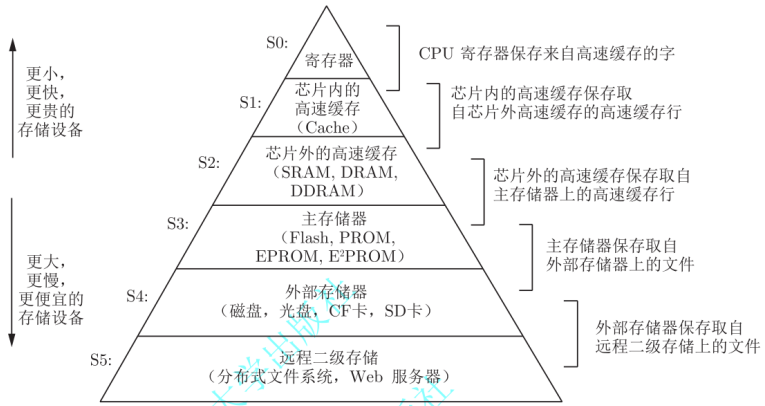

## 按照用途分类

- 主存储器（简称内存）
- 辅助存储器（简称外存）
- CPU高速缓存
- 片内寄存器

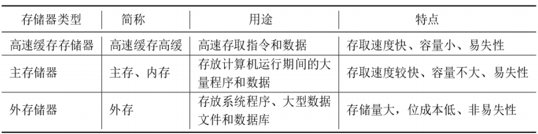

- 基本结构简单. 
- 二维阵列，行地址和列地址

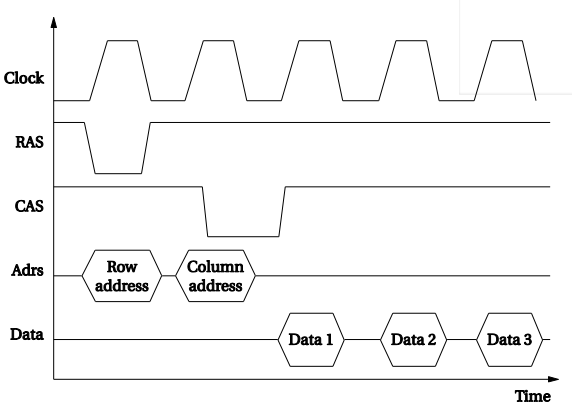

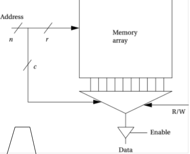

## 存储器和存储器控制器

- 存储器芯片复杂的结构
- 存储器控制器连接CPU和存储器
- 存储器控制器屏蔽了CPU
- CPU无需知道不同存储器的详细时序

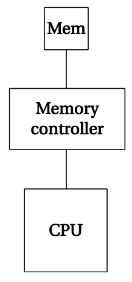

### 存储器的组织--通道与块

- 整个存储器系统可以划分为多个不同组件，每个组都有自己的存储器阵列和逻辑地址
- 通道：连接到一组存储器组件
- 控制器管理这些组件
- 调度问题
- 提供存储器并行性
  - 支持多通道
  - 组(Bank)是独立的存储阵列

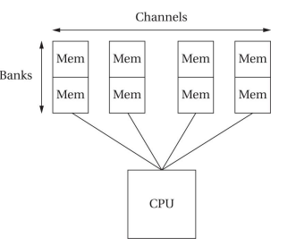

### 分类：按照信息存取方式

- 按照信息存取方式：RAM和ROM
- RAM
  - SRAM：静态随机存储
  - DRAM：动态随机存储器
  - DDR SDRAM：双倍速率随机存储器
  - SRAM 比 DRAM 运行速度要快，功耗要低，DRAM 还需要进行周期性刷新，功耗高，但DRAM存集成度更高、体积更小

- ROM：烧写入数据后，就不可对数据修改，无外加电源，断电后数据不会丢失
  - MROM，掩膜 ROM，Mask ROM
  - PROM，可编程 ROM，Programmable ROM
  - EPROM，可擦可编程 ROM，Erasable Programmable ROM
  - EEPROM，电擦除可编程 ROM
  - Flash Memory，快闪存储器

### 随机存储器RAM:

**SRAM**:

- 要始终保持上电状态，SRAM 存储的数据就可保持
- 较高的性能，功耗相对较低
- 集成度较低，体积较大，制作成本高
- 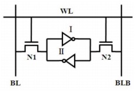
- 电路结构
  - 通过两个首尾相接的反相器来锁存数据的
  - 反相器Ⅰ和Ⅱ形成正反馈，使电路总能恢复到稳定状态
  - N1 和 N2 叫做存取管，用来读取或者写入数据
  - 字线（ WL）控制存取管的开启
  - 将存储的数据从位线（ BL 和 BLB）传送至外围电路
  - 反相器Ⅰ、Ⅱ和存取电路组成了一个 SRAM 单元（SRAM Cell）（由于该单元只能存储**一位**的数

 **DRAM:**

-  电容存储数据，周期性刷新，功耗较高，

- 集成度较高，体积更小

-  保存信息的原理是依靠电容中存储电荷的状态，电容有电荷时，为逻辑 1；没有电荷时，为逻辑 0 

- 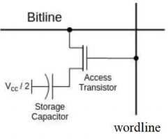

- 基本原理

  - Storage Capacitor，即存储电容，通过存储在其中电荷多和少，表示逻辑上的 1 和 0 
  - Access Transistor，即访问晶体管，它的导通和截止，决定了允许或禁止对Storage Capacitor 所存储的信息的读取和改写
  -  Wordline，即字线，它决定了 Access 
  - Transistor 的导通或者截止。
  -  Bitline，即位线，它是外界访问 Storage Capacitor 的唯一通道
    -  当 Access Transistor 导通，外界可通过Bitline 对 Storage Capacitor 进行读写操作

  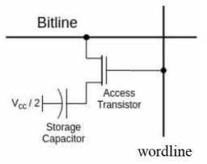

  -  Storage Capacitor 的 Common 端接 Vcc/2
    -  当 Storage Capacitor 存储信息为 1 ，另一端电压为 Vcc，其存储电荷 Q = +Vcc/2 / C
    -  当 Storage Capacitor 存储为 0 时，另一端电压为 0，其存储电荷 Q = -Vcc/2 / C

**DDR SDRAM**

-  在 SDRAM（Synchronous Dynamic RAM，同步动态随机存取存储器）的基础上进行了优化
- 内部具备 2 位预取机制，可交叉编址，当一个存储体输出时，另一个存储体准备数据
- 时钟上、下沿分别传输数据，传输带宽比单沿传输数据增加一倍

### 只读存储器ROM:

- 掩膜式 ROM，MROM
  - 熔丝断为“0”，熔丝未断为“1”
  - 生产厂家采用掩膜技术将程序写入存储器
  - 依照制造工艺，分为 MOS 型和 TTL 型两类
    -  MOS 型 MROM 具有功耗低、速度慢
    -  TTL 型 MROM 则具有速度快、功耗大
- 可编程 ROM，PROM 
  - 可由用户写入操作，且只有一次写入机会
  - PROM 在出厂设置时，数据全设为 1，用户根据需要将某些单元写入数据 0

- 可擦可编程 ROM，EPROM

  - 非易失性的存储芯片

  - 用户可对 EPROM 芯片重复擦除和写入

  - 用户利用紫外线透过设置的一个玻璃窗口照射内部芯片时，就可以擦除其内部存储的数据，芯片擦除的操作需要配套的 EPROM 擦除器

  - 擦除机制特殊，窗口制作成本较高，导致 EPROM 逐渐退出市场

    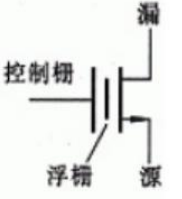

  - 工作原理

    - 若在漏源之间感应出正电荷，表示存入0 
    - 若在漏源之间无正电荷，表示存入1 
    -  当紫外线照射，电荷被泄放，恢复写入前状态

- 电擦除可编程 ROM，EEPROM
  - 非易失性的存储芯片
  - 通过电信号将保存的数据全部或部分擦除，并完成在线编程
  - 读写的速度与 RAM 相比要慢很多。与 EPROM 相比，使用更加方便
- 原理
  - 与EPROM类似
  - 擦除：用加电方法，进行在线擦写。擦除是固定写1

- 快闪存储器，Flash，分为 NOR 和 NAND 闪存
  - 写操作只能将数据位从 1 写成 0，而不能将 0 改写为 1 
  
  - 写入之前须先预操作，将预写入的数据位初始化为 1 
  
    
  
  -  NOR
    
    -  擦除操作以区块位单位，区块大小为 64～128KB
    -  执行一个写入/擦除操作的周期为 5s
    -  可以直接运行应用程序
    
  - NAND
    -  擦除操作也是以块为单位，块大小为 8～32KB 
    -  执行相同的操作最多只需 4ms
    
    
    
  - 在读写时偶尔产生位反转，且无法完全避免，事后弥补
  
  -  还可能出现坏块，初始化扫描并对坏块进行标记

### FLASH NOR&NAND比较

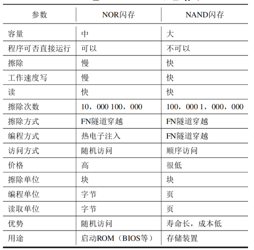

- 容量：NOR型更像内存，比较贵，容量比较小；而NAND型更像硬盘，成本要低一些，容量大得多。

-  应用：NOR型比较适合频繁随机读写的场合，存储程序代码可直接在闪存内运行，例手机使用NOR型闪存；NAND型存储资料，如闪存盘、数码存储卡等

-  速度：NOR型速度很有限，频率比内存低得多，NAND型闪存类似硬盘的操作，效率也比内存慢得多，比硬盘快得多。

-  存储单元：NOR型闪存的基本存储单元是字节；NAND型闪存的基本存储单元是页，类似硬盘的扇区。

-  擦除操作：以块为单位擦除。闪存的写入操作必须在空白区域进行，如果目标区域已经有数据，必须先擦除后写入，因此擦除操作是闪存的基本操作。

-  寻址：NOR型有独立的地址线和数据线；NAND型闪存通过8条I/O接口数据线传输地址信息包

### 存储器的主要技术指标

- 存储容量
  -  B，KB，MB，GB，TB
- 存取时间
  -  CPU 对内存进行读或写操作时所需要花费的时间
  - 存取时间的倒数来表示速度
    - 例：存取时间 1ns 内存，访问频率为 1/10−9Hz = 1000MHz
- 存储周期
  -  两次独立的读写操作之间所需的时间，一般为6～10ns

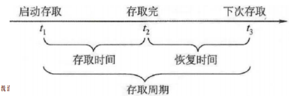

- 访问带宽
  - 内存总线所能提供的数据传输能力
    -  访问带宽=存储器位数/8 × 读取速度峰值
    -  表示每秒从主存进出信息的最大数量
    -  例：存取周期500ns，存储器位数16位，则带宽32MB/S
    -  访问带宽决定信息传输速度，是系统瓶颈的关键因素
    -  为提高存储器带宽，可采取措施为
      -  缩短存取周期
      -  增加存储字长

# 4.3 ARM存储器管理

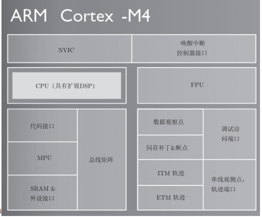

### 存储器的挂载

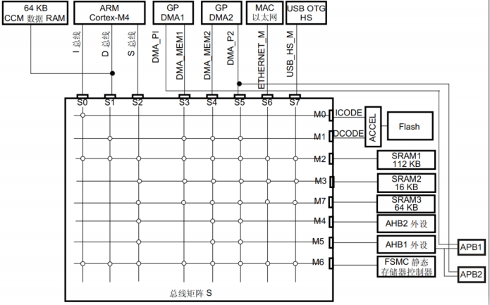

### 存储映射

- 地址总线是 32 位，可访问4GB的地址空间
- 小端格式存储，可寻址空间分为 8 个主要块，
- 每个块为 512 MB，即0.5GB
  - 程序代码访问区域（0.5GB）
  - 数据交互区域（SRAM，0.5GB）
  - 片内外围设备（0.5GB）
  - 外部存储空间或片外外设（2GB）
  - 处理器内部控制（NVIC）和调试区域（0.5GB）

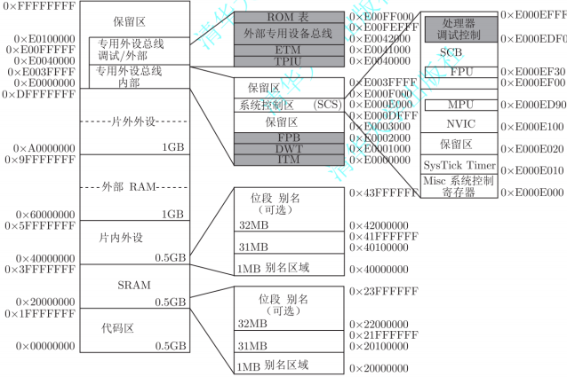

### 地址分配

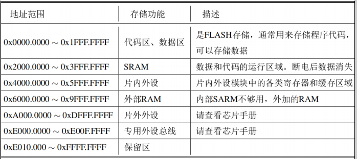

内存映射-块0和块1

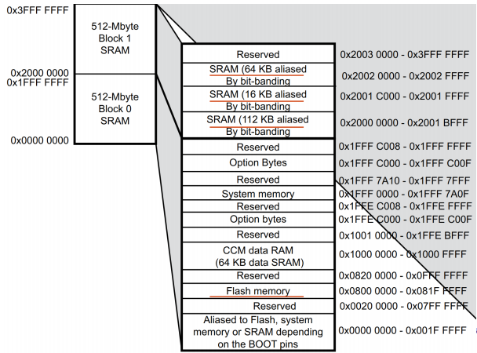

### FLASH

- CPU 通过 AHB I-BUS 和 D-BUS 对 Flash 进行的访问
- Flash 接口通过指令预取和缓存机制加速代码执行
- 闪存组织如下：
  - 主存储块被分成扇区
  - 系统存储器，器件在系统存储器自举模式下从该存储器启动
  - 512 OTP（一次性可编程）字节，用于存储用户数据
  - 读写保护、BOR 层，看门狗、复位等配置的可选字节

### 启动配置

- 代码区从地址0x00000000开始（I总线/D总线访问）
- 数据区从地址0x20000000开始（通过系统总线访问）
- 带FPU的Cortex M4 CPU在I代码总线上取复位扇区，意味着只有在代码区有启动空间
- 支持三种启动模式：
  -  主闪存启动模式
  -  系统存储器启动模式
  -  嵌入 SRAM 启动模式

# 4.4 新型存储器

- 存储器可分为易失性和非易失性
-  易失性存储器主要SRAM 和 DRAM
-  非易失性存储器
  -  闪存（Flash）
  -  SONOS（Silicon Oxide Nitride Oxide Semiconductor，基于氮化硅存储介质）
  -  铁电存储器（Ferroelectric Random Access Memory，FRAM）
  -  相变存储器（Phase Change Memory，PRAM）
  -  磁存储器（Magnetic Random Access Memory，MRAM）
  -  阻变存储器（Resistance，RRAM）
-  SRAM、DRAM、FLASH、SONOS 和 FRAM 存储器是基于电荷的存储器
-  PRAM、MRAM 和 RRAM 是基于电阻的转变来实现对数据的存储

### MRAM

MRAM的基本结构是磁性隧道结

-  底下一层薄膜是铁磁材料（钉扎层），磁自旋方向固定
-  中间一层是隧穿层
-  上面一层是自由层，其自旋方向可在外力下改变
-  当自由层的自旋方向和钉扎层的自旋方向一致，则隧道层处于低电阻的状态，为“0”；反之则处于高阻状态，为“1”
-  利用磁性隧道结的电阻变化来实现数据存储。

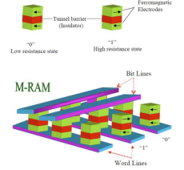

MRAM分为传统的MRAM和STT-MRAM，是驱动自由层翻转的方式不同

传统的MRAM

- 采用磁场驱动
- 结构中增加旁路引入较大的电流来产生磁场
- 功耗较大，集成度低

STT-MRAM

- 采用自旋极化电流驱动
- 不需增加旁路，功耗降低，集成度高。

### PRAM

三层结构

-  上电极（Top Electrode）
-  具有相变特性材料的中间层
-  下电极（BottomElectrode）

 中间是相变层，在晶化（低阻态）和非晶化（高阻态）之间转变，利用高低阻态的变化来实现存储

 PRAM 器件具有 M-I-M 或 M-I-S 结构，在器件两端施加不同的电脉冲，可在晶态与非晶态之间发生转变，呈现出不同的电阻态，进行数据存储

 英特尔和美光2015年联合推出了3D Xpoint技术

-  3D Xpoint技术的存储单元是采用的1R1D结构的PRAM，这和三星采用的1R1T结构的方向完全不同

 3D Xpoint技术在非易失存储器领域实现了革命性突破。虽然其速度略微比DRAM慢，但其容量却比DRAM高，比闪存快1000倍

### RRAM

RRAM与PRAM类似，中间转变层使用不同原理

-  用电阻丝理论（Filament theory），通过在绝缘体外部偏置影响，电子在阴极生成，并通过绝缘层到达阳极
- 当电阻丝经过 Forming process 形成后，再控制外加的电压与电流，可以使RRAM 组件在高阻态与低阻态来回切换，利用电阻值的高低储存 0 与 1 的信号

# 4.5存储保护和校验技术

存储保护：存储区保护和访问方式的保护

主存系统采用界限寄存器的方式进行保护：

- 适合于单个用户占用一个或者几个连续的主存区域的场合

虚拟存储系统：页表保护、段表保护和键时保护等方法实现存储保护

### ARM嵌入式芯片内存储保护

- 闪存的用户区域**读保护**有三个层次：
  - 层次0：无读保护
  - 层次1：读保护使能
  - 层次2：调试/芯片保护被关闭
    -  所有层次1下的保护被激活
    -  从RAM或者系统存储器bootloader启动被禁止
    -  JTAG，SWV（single-wire viewer），ETM或者边界扫描被禁止使
    -  用户可选字节不能被改变
    - 当从闪存启动时，从用户代码访问闪存或者备份SRAM被允许

#### ARM的闪存写保护

Flash 中有多达 24 个用户扇区具备写保护功能，可防止因程序指针错乱而发生意外的写操作

#### 存储保护-看门狗

实现独立的看门狗（IWDG）对Prescaler寄存器IWDG_PR，Reload寄存器IWDG_RLR的访问被写保护的

#### 存储保护-CAN寄存器保护

- 错误的配置寄存器访问会暂时干扰整个CAN网络
- CAN_BTR寄存器只能在CAN硬件在初始化模式时被软件修改。
- 传输邮箱只能在空的时候被软件修改。
- 通过设置FINIT位或者关闭过滤器Bank可以修改过滤器值。 CAN_FMxR，CAN_FSxR，CAN_FFAR寄存器中的过滤器配置（尺度，模式和FIFO安排）的修改只能在CAN_FMR寄存器中的初始化模式被设置（FINIT=1）时执行

#### 存储保护-SDIO卡保护

在SDIO卡的主访问中，硬件实现了三种写保护方法：

-  内部卡写保护（存储卡来负责）
-  通过机械写保护开关（SDIO卡主访问块负责）
-  密码保护

#### 校验保护

- 奇偶校验
- ECC校验：错误检查和纠正，Error Checking and Correcting
- 在ARM嵌入式芯片设计时，在FSMC/FMC PC卡控制器中，就集成了**两个ECC计算硬件块**，每个块负责一个存储Bank（Bank 2 和Bank 3）
- 硬件计算可以用于降低CPU的工作负载，对于256，512，1024，2048，4096或者8192字节的NAND闪存读或写可以纠正1位错误和检测2位错误

# 总结

- 存储器系统的分类
- ARM存储映射
- 新型存储器
- 存储保护及校验

