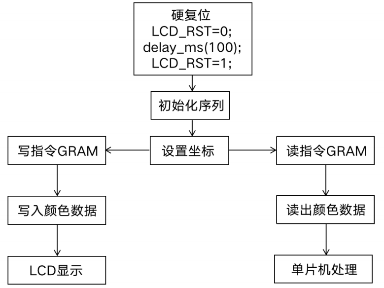

# 嵌入式系统设计-嵌入式输入/输出设备接口

## 一.I/O接口

### 硬件结构

接口结构：连接外设与CPU的中间接口电路

- 满足外设具备多样性、复杂性、异构性的要求

- 中间接口电路即输入/输出接口电路，简称I/O接口
- I/O接口在嵌入式系统中具有重要的位置


###  I/O接口组成

I/O接口组成

- 数据缓存

- 信号电平转换
- 数据格式转换
- 外设选择
- 中断管理
- CPU命令接收和执行


I/0接口的三个基本功能模块：数据缓存、逻辑控制和外设连接

### 寄存器

数据缓存功能模块：负责I/O交互过程的控制、记录和数据的存储

- 数据寄存器：存放交互过程中需传输的数据
- 控制寄存器：存放外设、I/O接口的控制命令
- 状态寄存器：记录外设、I/O接口的状态信息


### 控制与外设

逻辑控制功能模块

- 接收CPU传输过来的地址，根据地址进行外设选择

外设连接功能模块

- I/O接口与外设的交互接口

### I/O设备的分类

计算机所管理的I/O设备按输入输出对象的不同可以分为以下3类：

- **用户可读写**设备，用于用户与计算机通信。如：显示器、键盘、鼠标、打印机等
- **机器可读写**设备，用于电子装置与计算机通信。如：硬盘、U盘、控制器
- **通信**设备，用于与远程设备通信。如：Modem、ISDN终端

## 二.数据传输

###  I/O接口的数据传输

🔷程序查询方式，也称忙等I/O

CPU负责查询外设的状态寄存器，判断外设的数据是否就绪。若就绪，直接传输数据；否则，CPU等待数据就绪或继续查询其他外设

🔷中断方式

当外设数据就绪时，外设向CPU发出中断服务请求信号，CPU响应外设的中断服务请求，并处理中断请求

🔷直接访存方式，DMA

数据传输无需CPU的参与，在外设与内存之间建立直接的数据传输通道

### I/O编程

两种方法支持I/O编程

特殊的I/O指令

-  Intel x86 提供 in, out 指令

内存映射I/O

- 大多数CPUs 应用内存映射I/O
- 支持I/O 指令的CPU并不排除内存映射I/O

#### 内存映射IO

为每一个I/O设备的寄存器提供地址

程序使用普通的CPU读写指令来与设备通信

为设备定义地址:

​	DEV1 EQU 0x1000

```
Read/write 编码:

LDR r1,=#DEV1 

LDR r0,[r1] ；read

LDR r0,=#8 

STR r0,[r1] ；write
```

##### 内存映射IO-高级语言（PEEK和POKE函数）

- 读操作

int peek(char *location) {

return *location; }

- 写操作

void poke (char *location, char newval) {

(*location) = newval; }

#### 程序查询方式，忙等I/O方式

轮询（polling）:通过CPU反复读I/O设备状态寄存器来询问设备是否空闲

- 设备比CPU慢，需要多个周期完成一项工作
- 必须等待前一个操作完成后再进行下一个操作
- 比如CPU向设备写数据，即输出
  - 通过读设备状态寄存器来询问设备是否空闲
  - 若空闲，则写数据到数据寄存器
  - 若忙，则等待。

##### 忙等IO方式-输出设备编程

将一个字符串写到输出设备

```
#define OUT_CHAR 0x1000 /* data register*/

#define OUT_STATUS 0x1001 /* status register*/

Char *mystring=“Hello,world.”;

Char *current_char;

current_char = mystring;

while (*current_char != ‘\0’) {

	poke(OUT_CHAR,*current_char);

	poke(OUT_STATUS,1);

while (peek(OUT_STATUS) != 0);

	current_char++;

}
```

##### 忙等IO方式-输入/输出同步方式编程


```
#define in_CHAR 0x1000 
/* input data register */
#define in_STATUS 0x1001 
/* input status register */
#define OUT_CHAR 0x1100
/* output data register */
#define OUT_STATUS 0x1101
/* output status register 
*/
```

**输入设备**：

- 当有新字符能够被CPU读取， in_STATUS=1
- 当字符被CPU读取或无字符可读，in_STATUS==0

**输出设备**：

- 当CPU写入字符，有新字符能够被写入到输出设备

  ​	out_STATUS=1

- 当字符被输出设备读取或设备无字符可读

  ​	in_STATUS==0

```
while (TRUE) {
/* read */
while (peek(IN_STATUS) == 0);
achar = (char)peek(IN_DATA);
poke(IN_STATUS,0);
/* write */
poke(OUT_DATA,achar);
poke(OUT_STATUS,1);
while (peek(OUT_STATUS) != 0);
}
```

#### I/O中断

▪忙等I/O效率非常低

-  I/O设备的速度远远小于CPU的速度
-  除了测试，CPU不能做其它任何事情

▪CPU的很多操作是可以与I/O并行执行

- 计算操作
- 控制其它I/O设备

▪中断机制：

- 可以改变CPU的控制流顺序
- 强制CPU执行一段特定代码——中断处理子例程（设备驱动程序）

> ▪ 由I/O设备逻辑决定什么时候中断，发中断请求
>
> ▪ CPU响应中断——可能无法立即响应
>
> ​	一旦响应，将程序计数器（PC）指向中断处理子例程
>
> ▪ 前台程序：无中断情况下CPU运行的程序
>
> ▪ 后台程序：中断处理子程序

#### 中断机制


◼ CPU 和设备通过CPU总线连接

◼ CPU 和设备通过握手协议进行通信

- 设备发出中断请求
- CPU准备处理I/O设备请求时，CPU发出中断响应

#### 中断行为

基于调用中断服务子例程的形式

- (保护现场)中断强制下一条指令调用中断服务子例程
- 执行中断子例程
- （恢复现场）返回前台程序


```
//中断子例程（输入/输出都会引发中断）

void input_handler() /*输入中断子例程*/

{achar = peek(IN_DATA);

gotchar = TRUE;

poke(IN_STATUS,0);}

/*当字符输出完成时会发出中断信号*/

void output_handler() /*输出中断子例程*/

{ }
main() {
while (TRUE) {
if (gotchar) 	{
	poke(OUT_DATA,achar);
	poke(OUT_STATUS,1);
	gotchar = FALSE;
		} 
	}
}
//特点：读一个字符，然后写一个字符；
```

##### 例：具有缓冲区的中断IO

为了使读和写完全独立，使用缓冲区机制

- 允许输入输出设备以不同的速率运行
- 前台的工作完全独立于输入输出设备
- 通过输入中断、输出中断完成与I/O的通信

```
//缓冲区的设计
#define BUF_SIZE 8
char io_buf[BUF_SIZE];
int buf_head=0,buf_tail=0;
int error=0;
void empty_buffer();
void full_buffer();
int nchars();
void add_char(char achar);
char remove_char();
```

```
//基于缓冲区的输入的中断子例程
void input_handler() {
char achar;
if (full_buffer()) error = 1;
else { achar = peek(IN_DATA); 
add_char(achar); }
poke(IN_STATUS,0);
if (nchars() == 1) 
{ poke(OUT_DATA,remove_char()); 
poke(OUT_STATUS,1); }
}
```

```
//基于缓冲区的输出的中断子例程
void output_handler() {
if (!empty_buffer()){
poke(OUT_DATA, remove_char());
poke(OUT_STATUS,1);
	} 
}
/*若io_buf有字符，则输出可以自行引发一个输出中断；
▪ 若无，需要外部在新字符到达时启动输出处理子程序。
	▪ 输入处理子程序启动此种情况
*/
```

##### 调试中断代码

若忘记改变(或恢复)寄存器的内容

▪前台程序会展示一些非常奇怪的错误

▪错误很难重现---它依赖与中断

例：（handler（）中一个错误应发j的改变）

```
for(i=0;i<M;i++){
	y[i]=b[i];
	for(j=0;j<N;j++)
		y[i]=y[i]+A[i,j]*x[j];
}
```

#### 如何发现中断

- 在开始执行每条指令之前检查中断请求信号是否有中断请求
- 一旦出现中断，PC将指向中断服务子例程
- 注意：要保护和恢复现场

#### 中断优先级和中断向量

- 两种机制允许中断处理更多的设备
  - **优先级（Priorities）**：确定哪种中断首先获得CPU
  - **向量（Vectors）**： 允许中断设备灵活定义其中断服务子例程
- 大多数CPU这两种方式都支持

#### 具有优先级的中断


使用轮询让几个设备共享一个中断


例： 优先级 I/O（A的优先级最高，C的优先级最低）


> 优先级排序：
>
> - Masking(屏蔽): 发生中断的优先级比正在中断的优先级低，CPU将不响应该优先级低的中断。
>
> -  Nonmaskable interrupt (NMI,不可屏蔽中断): 最高优先级，永不屏蔽
>
> - 电源故障
>
>   

#### 中断向量

▪不同的设备有不同的中断服务子例程

▪中断向量表

​	-设备存贮其向量号


#### 一般的中断机制


#### 中断开销

- 中断服务子例程执行的时间
- 中断机制的开销
- 寄存器存储/恢复
- 流水相关补偿
- Cache相关补偿

#### IO接口传输对比


## 三.通信接口

用于实现外设与处理器之间的交互

- UART、SPI和I2C等 
- 与 GPIO 的区别主要体现在通信时序、速度等方面

### 通信接口的分类

##### 并行/串行通信

-  并行通信：外设和微处理器之间存在多根数据传输线，数据的多个比特位可同时传输，例IEEE1284，主要用于点阵式打印机和绘图仪
- 串行通信：外设和微处理器之间仅存在一根数据传输线，数据必须按照顺序一位一位传输，例如USB

##### 同步/异步通信

-  同步通信：外设和微处理器之间有同步时钟，两者之间的数据传输受同步时钟的控制
  -  采用阻塞模式，发送方发出数据后需接收到接收方响应后才发送下一个数据
  - 例如IEEE1588标准，SPI，I2C 
- 异步通信：外设和微处理之间没有同步时钟，借助缓存进行数据传输
  - 异步通信过程中，通信双方必须约定通信协议和传输速率
  - 采用非阻塞模式，即发送方发出数据后，无需等待接收方相应便可直接发送下一个数据
  - 例如UART

##### 单工/半双工/全双工通信（按照传输方向）

- 单工制式：数据只能从发送方往接收方传输
- 半双工制式：数据能在发送接收方之间双向传输，但在任何时刻数据只能一个方向传输，例如I2C 
- 全双工制式：接收和发送数据占用不同的线路，因此数据可同时在两个方向上传输，例如UART


### 串行通信

▪ 使用方便、成本低廉、编程简单

▪ 各微处理器提供的常见串行通信接口：通用异步收发器（UART） 

▪ STM32系列微处理器提供：通用UART和USART（同步/异步收发器接口）


#### USART优点

◼支持全双工、异步通信

◼采用分数波特率发生器，可配置，最高可支持10.5Mb/s波特

率

◼可编程配置的数据字长度（8 位或 9 位）

◼可配置的停止位（1 位或 2 位）

◼USART 实现同步数据通信时，发送端提供时钟

◼支持奇偶校验

◼发送奇偶校验位，接收数据奇偶校验

◼支持 4 种错误检测：溢出错误、噪声错误、帧错误和校验错误

◼……

> USART通信接口通过3个引脚与外设之间进行通信
>
> - RX：接收数据输入
> - TX：发送数据输出
>
> ▪ SW_RX：在单线和智能卡模式下，接收数据
>
> ▪USART与外设通信至少需要RX和TX两个引脚
>
> ▪USART的部分引脚仅用于同步模式，如SCLK、IrDA模式、硬件流量控制模式

#### USART结构


##### 分数波特率计算

波特率寄存器(USART_BRR)A


▪位 31:16 保留

▪位 15:4 DIV_Mantissa[11:0]：USARTDIV 的整数部分

▪位 3:0 DIV_Fraction[3:0]：USARTDIV 的小数部分


> ▪ fck是给外设的时钟
>
> ▪设置波特率位115200，fck = 36MHz，则USARTDIV = 19.5
>
> ▪整数部分为19 << 4 = 304
>
> ▪小数部分为0.5*16 = 8
>
> ▪ USART_BRR寄存器的值位304+8=312=0x138

#### USART的数据发送过程

（1）写USART_CR1寄存器的UE位为1来使能USART

（2）写USART_CR1寄存器的M位来定义数据帧长度为8位或9位 

（3）写USART_CR2寄存器的STOP来配置停止位

（4）如果采用多缓冲区通信的话，写USART_CR3寄存器的DMAT位来使能DMA传输，此时需按多缓冲区通信中的描述配置DMA寄存器

（5）写USART_BRR寄存器来配置波特率

（6）初次传输时需设置USART_CR1寄存器中的TE位来发送一个空闲帧

（7）把需传输的数据写到USART_DR寄存器，帧已发送（停止位后）且TXE 位置 1，可在单缓冲区通信时将重复进行此动作来进行数据传输

（8）在写入最后一个数据到USART_DR寄存器后，等待USART_SR寄存器的**TC**信号变为1，此时表明最后一个数据帧传输结束


#### USART的数据接收过程

（1）写USART_CR1寄存器的UE位为1来使能USART

（2）写USART_CR1寄存器的M位来定义数据帧长度为8位或9位 

（3）写USART_CR2寄存器来的STOP配置停止位

（4）如果采用多缓冲区通信的话，写USART_CR3寄存器的DMAT位来使能DMA传输，此时需按多缓冲区通信中的描述配置DMA寄存器

（5）写USART_BRR寄存器来配置波特率

（6）写USART_CR1寄存器中的RE位使能数据接收。当接收到一个数据帧时，USART_SR寄存器中的RXNE位被设置，此时表明移位寄存器中的数据传输到了RDR，数据帧可以被录取

### SPI

串行外设接口（Serial Peripheral Interface，SPI） 

▪ 同步串行通信接口，主要用于微处理器与外设之间的串行通信

▪ 高速、全双工、同步，占用4个引脚 -> 节约芯片引脚

（1）MISO引脚：主设备数据输入，从设备数据输出

（2）MOSI引脚：主设备数据输出，从设备数据输入

（3）SCLK引脚：时钟信号，由主设备产生

（4）CS引脚：从设备片选信号，由主设备控制

▪ SPI是一种不对等的通信接口，通信的发起、结束均由主机控制，SPI通信双方时钟产生和片选控制的一方即为主机

#### spi的硬件连线图

一个SPI总线可连接多个主机和多个从机，但是在同一个时刻只允许由一个主机来操作总线

在每次传输的过程中，主机总是向从机发送一个字节的数据，从机也是向主机发送一个字节的数据


#### spi工作方式

SPI接口可根据外设通信的需求，对串行同步时钟的极性（CPOL）和相位（CPHA）进行配置

- CPOL对SPI接口的通信影响不大，CPOL=0，串行同步时钟的空闲状态为低电平；CPOL=1，串行同步时钟的空闲状态为高电平
- CPHA决定了SPI接口上数据的采样位置，CPHA=0，在串行同步时钟的第一个跳变沿数据将被采样；CPHA=1，在串行同步时钟的第二个跳变沿数据才被采样；

SPI接口可根据外设通信的需求，对串行同步时钟的极性（CPOL）和相位（CPHA）进行配置


#### SPI内部结构


#### SPI寄存器

SPI寄存器：通过SPI_CR1寄存器的配置来设置SPI的


#### **工作模式**-主机模式和从机模式


> 在主机模式下
>
> - 主机使用一个IO引脚选择从机
> - 传输的起始由主机发送数据来启动
> - 时钟（SCK）信号由主机产生
> - 通过MOSI引脚发送数据
> - 通过MISO引脚接收数据

>  在从机模式下
>
> - 数据传输在SSEL被主机拉低后开始
> - 接收主机输出的时钟信号
> - 通过MOSI引脚接收数据
> - 通过MOSI引脚发送数据

##### SPI的从模式配置

**配置SPI为从模式的过程（SCK引脚用于接收主机的串行时钟）**

（1）设置DEF位来定义数据帧格式（8位或16位）

（2）设置CPOL位和CPHA位来定义数据传输和串行时钟之间的相位关系，保持主机和从机CPOL位和CPHA位的一致

（3）保持主机和从机帧格式的一致

（4）在通信的过程中，必须保证CS片选信号处于低电平

（5）清除MSTR位，设置SPE位使相应引脚处于SPI工作模式

**从模式下的数据传输**

- 数据发送过程：在写操作过程中，数据字被并行写入发送缓冲器；当从设备收到时钟信号并且在MOSI引脚上出现第一个数据位时，发送过程开始，剩下的数据位被写入移位寄存器；当发送缓冲器中的数据字写入移位寄存器时，SPI_SP寄存器的TXE位被置位，如果设置了SPI_CR2寄存器中的TXEIE位，将触发中断
- 数据接收过程：当数据接收完成时，移位寄存器中的数据传输到接收缓冲器中，SPI_SR寄存器中的RXNE标志位被置位，如果设置了SPI_CR2寄存器中的RXNEIE位，将触发中断
- 在最后一个采样时钟边沿后，RXNE位被置位，移位寄存器中的数据字被写入接收缓冲器。当读SPI_DR寄存器时，SPI设备返回接收缓冲器接收到的数据字

##### SPI的主模式配置

**配置SPI为主模式的过程（SCK引脚用于产生时钟信号）**

（1）通过SPI_CR1寄存器的BR[2:0]位定义串行时钟波特率

（2）设置CPOL位和CPHA位来定义数据传输和串行时钟之间的相位关系

（3）设置DEF位来定义数据帧格式（8位或16位）

（4）设置SPI_CR1寄存器的LSBFIRST位来定义帧格式

（5）在通信的过程中，必须保证CS片选信号处于高电平

**主模式下的数据传输**

- 数据发送过程：当写入数据到发送缓冲器时，发送过程开始；当发送第一个数据位时，数据被并行写入移位寄存器，然后串行地移出到MOSI引脚；数据字的高位在前还是低位在前传输，取决于SPI_SP寄存器的LSBFIRST位的配置；当数据字从发送缓冲器写入移位寄存器时，SPI_SP寄存器的TXE位被置位，如果设置了SPI_CR2寄存器中的TXEIE位，将触发中断
- 数据接收过程：当数据传输完成时，移位寄存器中的数据字被写入接收缓冲器，并且SRXNE标志位被置位，如果设置了SPI_CR2寄存器中的RXNEIE位，将触发中断；在最后采样时钟边沿，RXNE位被置位，移位寄存器接收到的数据字被写入缓冲器。读SPI_DR寄存器时，SPI设备返回接收缓冲器接收到的数据字，RXNE位被清除
- 一旦数据传输开始，如果下一个将要发送的数据字被写入了发送缓冲器，就可以维持持续的数据字传输。在写发送缓冲器之前，需确认TXE标志位是否被置位

### I2C

- 串行通信总线（Inter-Integrated Circuit，I2C）概述

- 双向数据传输，传输速度0～100Kbps，高速模式达0～400Kbps

- 简单灵活可扩展，总线中的所有设备仅有唯一地址，通过软件寻址

  

> ➢ 总线上可同时连接多个能控制总线的设备
>
> ➢ 只能有一个控制设备获得总线控制权而成为主机
>
> ➢ 总线系统能同步所有控制设备所产生的时钟信号

####  I2C数据传输

- I2C总线上每传输一个数据位必须产生一个时钟脉冲，通信双方之间每次发送一个字节的数据
- SDA线上的数据必须在时钟线SCL的高电平期间保持稳定，SDA线的电平状态只有在SCL线的时钟信号为低电平时才能发送改变
- I2C总线上的4种信号
  - 起始信号：SCL为高电平，SDA由高跳变低，开始数据传输
  - 停止信号：SCL为高电平，SDA由低跳变高，终止数据传输
  - 应答信号：接收器向发送器发出特定的低电平脉冲信号，表示已经接收到数据
  - 非应答信号：主机向从机发送一个高电平有效脉冲信号，表示接收完最后一个数据字节，使从机释放数据线


## 四.人机交互-LCD

**液晶显示器**（Liquid Crystal Display，LCD）是一种被动的显示器材，本身不能发光，需借助于周围环境的光


#### LCD的基本原理

- LCD将液晶置于两个导电玻璃之间，通过两个电极间电场的驱动引起液晶分子有规则地旋转形成扭曲角，发生扭曲向列效应，从而控制投射光的强度
- 完全投射即白色，完全阻挡即黑色，不同投射程度呈现不同的灰阶
- LCD分类：根据工作原理，将LCD划分为扭曲向列型液晶TN-LCD、超扭曲向列型液晶STN-LCD和薄膜晶体管液晶TFT-LCD

#### LCD显示的控制方法

#####  LCD的两种驱动方式

- 扫描驱动的LCD驱动器：将显示缓存中的图像数据通过动态扫描的方式传输到LCD显示屏
- 总线驱动的液晶模块（LCD Module，LCM）：将液晶显示屏、连接件、驱动和控制集成电路、PCB线路板、背光源等装配在一起的显示控制器

TFT-LCD的LCM内置有与液晶像素点对应的显示数据RAM区，若要改变一个像素点的颜色，只需对该点所对应的16位显存进行操作即可

##### TFT-LCD模块的两种操作：对控制寄存器的读/写操作、对显存的读/写操

两种操作均通过对ILI9341的寄存器的操作来完成


 TFT-LCD的使用：当对TFT-LCD显示面板上的某一点（X，Y）

进行操作时，需要先通过地址定位到该点所对应的RAM显存地址，然后通过光标的上下左右移动的控制来连续写入或读取显存数据



## 六.ADC/DAC

- 模数转换器（Analog-to-Digital Converter，ADC）负责将物理环境中的模拟信号（连续物理量）转换为计算机可处理的数字信号（离散数字量）
- 数模转换器（Digital-to-Analog Converter，DAC）负责将数字信号还原为模拟信号


#### ADC接口的内部结构

- ADC一般经过取样、保持、量化和编码4个过程，并且4个往往同时实现
- ADC转换分为两个通道组：规则通道组和注入通道组
- 规则通道组相当于正常运行的程序，而注入通道组相当于中断。在正常执行程序的时候，中断可以打断其执行

#### Cortex-M4处理器的ADC结构

-  12位逐次逼近模数转换器，支持19路信号输入，分别是16路外部信号（ADCx_IN0~ADCx_IN15）、2路内部信号（温度传感器和VREFINT）和VBAT电源信号
-  Cortex-M4处理器中一个规则通道组最多支持16路转换输入，一个注入通道组最多支持4路转换输入


#### CORTEX-M4处理器的ADC特点

- 多种分辨率
- 中断的产生
- 单转换模式/连续转换模式
- 扫描模式的自动切换
- 间隔采样模式

#### ADC的引脚描述


### ADC功能

- 启动与时钟
- 时序
- 单次转换模式
- 连续转换模式
- 扫描模式
- 注入通道管理
- 间断模式
- 快速转换模式
- 校准
- 数据对齐

#### 启动与时钟

ADC_CR2寄存器中的ADON位决定ADC接口的供电与掉电；SWSTART或JSWSTART位置1可启动ADC转 换

ADC的两种时钟方案

- ADCCLK时钟用于模拟电路，可供所有ADC连接公用。RCC控制器位ADC时钟提供一个专用的可编程预分频器，ADCCLK时钟可通过APB2分频来得到
- 用于数字接口的时钟，等同于APB2时钟。可通过RCC APB2外设时钟使能寄存器分别为每个ADC使能/禁止数字接口时钟

#### 时序

ADC在开始精确转换之前需要一段稳定时间tSTAB。ADC开始转换并经过15个时钟周期后，EOC标志置1，转换结果将存放在16位ADC数据寄存器中


#### 单次转换模式

ADC仅执行一次转换，完成后ADC停止

##### 单次转换模式的启动方式

（1）将ADC_CR2寄存器中的SWSTART位置1（适用于规则通道）

（2）将JSWSTART位置1（适用于注入通道）

（3）外部触发（同时适用于规则/注入通道）

完成所选通道的信号转换之后

- 如果规则通道完成转换：转换数据存储在16位ADC_DR寄存器中；EOC转换结束标志位置1；EOCIE位置1时产生中断
- 如果注入通道完成转换：转换数据存储在16位ADC_JDR1寄存器中；JEOC转换结束标志位置1；JEOCIE位置1时产生中断

#### 连续转换模式

ADC一次转换结束后立即启动下一次的转换

- 该模式通过外部触发或ADC_CR2寄存器中的ADON位启动
- 每次规则通道完成转换：转换数据存储在16位ADC_DR寄存器中；EOC转换结束标志位置1；EOCIE位置1时产生中断

注：注入通道一般不能采用连续转换模式，唯一的例外情况是注入通道配置为在规则通道之后自动转换时

#### 扫描模式/注入通道管理/间断模式

**扫描模式**：用来扫描一组模拟通道，通过设置ADC_CR1寄存器的SCAN位来选择

**注入通道管理**

- 触发注入：清除ADC_CR1寄存器中的JAUTO位，并设置SCAN 位 
- 自动注入：如果设置了JAUTO位，在规则组通道转换完成之后，注入组通道将自动启动转换

**间断模式**

- 规则组：间断模式通过设置ADC_CR1寄存器的DISCEN位激活
- 注入组：间断模式通过设置ADC_CR1寄存器的JDISCEN位激活

#### 快速转换模式

▪降低ADC分辨率（转换精确度）可以提高转换速度

▪RES位用于选择数据寄存器中可用的位数

▪各种分辨率对应的最小转换时间计算方法

- 12位：3+12=15 ADCCLK周期
- 10位：3+10=13 ADCCLK周期
- 8 位：3+8=11 ADCCLK周期
- 6 位：3+6=9 ADCCLK周期

▪总转换时间的计算公式

​	Tconv=采样时间+12个时钟周期

#### 校准

- 由于ADC接口中会因内部电容器组的变化而造成转换精确度误差，ADC内置自动校准模式
- 通过设置ADC_CR2寄存器中的CAL位启动校准，校准结束CAL位将被硬件复位，随后ADC可开始正常转换
- 校准结束后，校准码存储在ADC_DR**寄存器中**

#### 数据对齐

ADC_CR2寄存器中的ALIGN位用于选择转换得到数据的存储对齐方式，数据可以左对齐或右对齐


### DAC转换-DAC接口的内部结构

DAC模块是12位离散数字输入、连续电压输出的数模转换器

▪ DAC可以按8位或12位模式进行配置，并且可与DMA控制器配合使用

​	 在12位模式下，数据可以采用左对齐或右对齐方式进行存储

▪ DAC有两个输出通道，每个通道各有一个转换器

​	在DAC双通道模式下，每个通道可以单独进行转换

​	 当两个通道组合在一起同步执行更新操作时，也可同时进行转换

▪ DAC可通过一个输入参考电压引脚VREF+（与ADC共享）来提高分辨率


#### CORTEX-M4处理器的DAC特点

- 包含2个DAC转换器，每个转换器对应一个输出通道
- 支持8位或12位的单调输出
- 12位模式下支持数据的左对齐或者右对齐存储
- 具备同步更新功能
- 可生成噪声波形
- 可生成三角波形

#### DAC的引脚描述


#### DAC功能

- DAC通道使能
- DAC输出缓存使能
- DAC输出电压
- DAC数据格式
- DAC转换

#### DAC通道使能

- 将DAC_CR寄存器的ENx位置1即可打开DAC通道x的供电，经过一段启动时间tWAKEUP之后，DAC通道x即被使能

- ENx位置位只使能DAC通道x的模拟部分，即便该位被置0，DAC通道x的数字部分仍然继续工作

- DAC输出缓存使能

  ​	DAC接口中集成了2个输出缓存，可以用来减少输出阻抗，无需外部运放即可直接驱动外部负载。每个DAC通道输出缓存可以通过设置DAC_CR寄存器中的BOFFx位来使能或者关闭

#### DAC输出电压

▪ 数字输入经过DAC被线性转换为模拟电压输出，其范围0到VREF+

▪ 任一DAC通道引脚上的输出电压均满足关系式

​	DAC输出=VREF×（DOR/4095） 

▪ DAC数据格式

- 根据不同的配置模式，数据以不同的方式写入指定的寄存器
- 对于DAC单通道x，存在三种可能的写入方式


对于DAC双通道，存在三种可能的写入方式


#### DAC转换

- DAC_DORx寄存器无法直接写入数据，任何输出到DAC通道x的数据都必须先写入DAC_DHRx寄存器才能传到通道x 
  -  如果未选中硬件触发，存入寄存器DAC_DHRx中的数据会在一个APB1时钟周期后自动传输至寄存器DAC_DORx
  - 如果选中硬件触发，数据传输在触发发生之后3个APB1时钟周期后完成


当数据从DAC_DHRx寄存器写入DAC_DORx寄存器，在经过时延tSETTLING之后，DAC的输出即有效，该时延的长短依赖于电源电压和模拟输出负载的大小

# 总结

- I/O接口的结构、编程方法
- 通信接口
- 人机交互
- ADC/DAC转换

