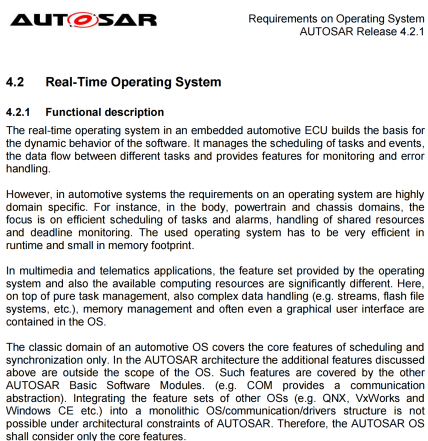
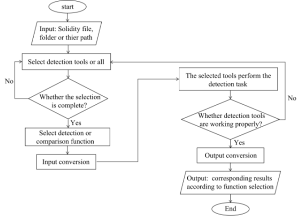

# 嵌入式系统设计-程序设计与分析

## 一.嵌入式程序设计

### 自然语言描述

- 直接使用语言文字描述设计过程
- 一般会结合其他方法使用



### 形式化描述

通过严谨的数学语言、逻辑和公式描述

对开发工程师的知识背景要求严格


### 伪代码

- 伪代码是一种常用的描述程序设计方法
- 能够较为清晰地描述思路
- 通常使用伪代码设计核心部分


### 结构图

- 结构图
  -  结构图( structure chart)是一种自顶向下的模块化设计工具
  - 系统由不同模块和线组成，用小方块表示模块，线表示模块之间的关系。
  -  结构图用于高层设计或体系结构设计
  -  帮助程序员划分大型软件，递归地将问题分解成可以理解的小问题


结构图

-  树状结构图
-  非树状结构图


### 流程图

流程图( flow chart)

- 流程图是描述一个程序的工作流程或过程
- 使用方框表示步骤、菱形表示判断、带箭头的线表示执行流程
- 流程图表示对给定问题的解决方案
- 常用于分析、设计、记录或者管理的流程中

例：

```
for( A ; B ; C)

	D
```



### 状态图( States diagram)

- 状态图关注系统某一对象在生命周期内的特性和特性的变化，以及引起特性变化的时间和动作等
- 状态（state）是指在生命周期中某个特性，具有一定的时间稳定性，即会在一段时间内保持相对稳定。
- 转移( transition) 两个状态之间的变迁，表示在指定事件发生后，在特定的条件下，对象执行特定的动作从源状态转移到目标状态
- 转移由源状态、目标状态、触发事件、警戒条件和转移动作组成


例：给定一个电话座机，打电话包含哪几种状态？并画出状态图


#### 控制/数据流图（CDFG）

数据流图（Data flow graph, DFG）

无条件程序模型，不能表示控制

基本语句块：

- 无条件代码段
- 只有一个入口和出口
- 可操作的最大顺序语句序列

单赋值形式：一个变量只能在赋值运算符左边出现一次

```
x = a + b;
y = c - d;
z = x * y;
y = b + d;

```

两类结点

◼圆形结点：表示操作

◼方形结点：表示值


部分序：

▪**a+b, c-d; b+d, x\*y**

▪操作**a+b**和 **c-d**可以用任何顺序执行

▪操作**b+d**和**x\*y**可以用任何顺序执行

#### CDFG

CDFG: 表示控制与数据的图

用数据流图表示组件，添加控制部分

CDFG有两种类型的节点

判断节点：描述的全部控制类型

数据流节点：一个完整的表示基本语句块的数据流图

**数据流节点**

- 封装一个数据流图
- 在节点中完成写操作


**判断节点**

◼ 描述控制类型


EX:

```
if (cond1) bb1();
else bb2();
bb3();
switch (test1) {
case c1: bb4(); break;
case c2: bb5(); break;
case c3: bb6(); break;
}
```


```
for (i=0; i<N; i++)
loop_body();
等价=>
i=0;
while (i<N) {
loop_body(); 
i++; 
}
```


### 嵌入式程序模型

有限状态机：响应系统

循环缓冲区：数字信号处理

队列：数字信号处理

#### 有限状态机（FSM）

状态机具有离散动态的系统模型

- 一种常用的状态机叫做有限状态机，表示状态数目是有限的
- 状态机建模适用于对时间驱动的系统，给定不同输入信号，系统根据这些输入信号做出不同响应
- 状态来表示系统的内部特性，状态的变化是基于输入的变化

状态图是对状态机的一种图形表示

MOORE机、MEALY机 ???

应用:

-  面向控制的代码
-  响应式系统
-  非周期性采样作为输入

##### EX:座位安全带控制器

> 需求：
>
> 有人坐到座椅上，在规定时间内若没有系好安全带，就启动蜂鸣器
>
> 输入：
>
> ◼ seat: 是否有人坐；
>
> ◼ belt: 是否系安全带；
>
> ◼ timer: 定长计时器；
>
> 输出：
>
> ◼ 蜂鸣器
>
> ◼ 定时器
>
> 状态：
>
> ◼ state: 机器当前状态 


```
#define IDLE 0
#define SEATED 1
#define BELTED 2
#define BUZZER 3
switch (state) {
	case IDLE: 
		if (seat) { state = SEATED; 
	timer_on = TRUE; }
	break;
	case SEATED: 
		if (belt) state = BELTED;
	else if (timer) state = BUZZER;
	break;
…
}
```

#### 循环缓冲区

面向流的程序设计

数据流：按规律到达并需要在限定时间内处理

- FIR滤波器：面向流处理
- 有限脉冲响应（FIR）滤波器
- 乘积求和


循环缓冲区

- 固定数目
- 处理流数据的一种数据结构


▪pos:当前采样的位置；


```
#define CMAX 6 /* filter order */ 
int circ[CMAX]; /* circular buffer */ 
int pos; /* position of current sample */ 

void circ_init() { 
	int i; 
	for (i=0; i<CMAX; i++) /* set values to 0 */ 
	circ[i] = 0; 
	pos=CMAX-1; /* start at tail so first element at 0 */ 
}
void circ_update(int xnew) { 
/* compute the new head value with wrap around; the pos 
pointer moves from 0 to CMAX-1 */ 
pos = ((pos == CMAX-1) ? 0 : (pos+1)); 
/* insert the new value at the new head */ 
circ[pos] = xnew; 
}
int circ_get(int i) { 
int ii; 
/* compute the buffer position */ 
ii = ((pos+1)% CMAX + (i-1)) % CMAX; 
return circ[ii]; /* return the value */ 
}
```

#### 队列

- 生产者/消费者
- 弹性缓冲区
  - 数据无法预料到达或离开的时间
  - 构建队列的方法：
    - 链表
    - 数组

**生产者-消费者系统**


p1,p2是两个算法处理块

数据从单行缓存区的队列中发送到处理块中

数据q12是p1产生的数据，p2消费的数据

## 二.嵌入式C语言编程

C语言开发的嵌入式程序，其有如下优点：

◼表现能力和处理能力极强。它具有丰富的运算符和数据类型，便于实现各类复杂的数据结构

◼可读性强，易于调试和维护。采用自顶向下的设计方法，层次清晰，便于按模块方式组织程序

◼可移植性强。具有非处理器特定代码的特点

◼运算速度快，编译效率高。具有功能丰富的库函数，而且可以直接实现对系统硬件的控制

### 嵌入式C语言编程方法

嵌入式程序开发是硬件实现与软件编程相结合的开发过程。其开发的过程包括

◼了解开发板上的硬件属性

◼考察I/O等外设的连线

◼采用模块化编程的思想。将整个系统分解成许多小模块，针对每个小模块进行编程

◼设计程序流程框架，根据流程框架整合各个模块形成完整系统

◼整合模块进行编译，若无问题，编译后生成的hex文件，下载到开发板中调试，排查其软硬件的问题

### 嵌入式C语言元素

嵌入式C语言编程通常具有三个方面的结构化元素

-  预处理声明、定义和 include语句
-  主函数

**While(TURE)**

**{**

**……**

**}**

- 函数、异常和中断服务函数
  -  外设的访问通常基于忙等、中断、DMA的访问

#### 预处理声明、定义和 include语句

1. 用于包含文件的 include语句：include是一个用于包含某个文件内容的预处理语句，将给定文件的代码导

入（粘贴）到当前文件中

- 系统定义：#include *<*filename*>*
- 用户定义：#include “filename”
- 以头文件(.h文件)的形式
- 可为后期的调试带来便利

2. 预处理语句

◼给编译器传达指示，提高程序的可读性

◼预处理语句 #define

​	◼ 预处理全局变量

**#define GPLOH-MODER \*(unsigned int\*(GPIOH_BASE+0x00)**

​	◼ 预处理常量

**#define TRUE**

3. 条件编译语句：

◼#ifdef 说明当满足某条件时对一组语句编译，条件不满足时编译另一组语句的功能

◼采用条件编译指令，可以减少被编译的语句，从而减少目标代码的长度

◼在一个文件中，给出芯片不同系列的代码，使用不同编译器，…

**#ifdef** **标识符**

​	**程序段1** 

**#else** 

​	**程序段2** 

**#endif**

◼ 它的作用是当“标识符”已经被定义(一般是用#define定义)，则对#ifdef 下的程序段进行编译，否则编译#else下的程序段


4. import, extern, export声明

◼C语言混合编程中

◼ extern，import表明变量或者函数是定义在其他文件中

◼ 表示本程序用到变量提供给其他模块调用

◼常用在多个源文件编译的程序中

◼在一个文件中定义全局变量，而在另一文件中用 extern对全局变量引用。编译器知道是在别处定义的外部变量

◼通过extern定义外部函数，其中extern可以省略，若函数不能被其他文件引用，在函数定义前加static

◼在程序连接时从其他文件中找此外部变量

**extern int value1;**

**extern int p(void);** 

5. typedef 类型别名

◼ 定义一种类型的别名，用 typedef 来定义与平台无关的类型

◼ 提高可移植性。当跨平台时，只要改 typedef 本身就行，不用对其他源码做任何修改

◼例，定义一个叫REAL 的浮点类型，表示最高精度的类型

◼在支持双精度的目标平台一上

**typedef long double REAL;**

◼在不支持 long double 的目标平台二上，改为：

**typedef double REAL;**

◼在连 double 都不支持的目标平台三上，改为：

**typedef float REAL;**

◼typedef 定义一种类型的新别名，在结构体、枚举类型中非常常见


6. 结构体：

◼结构体是由具有相同或不同类型的数据项构成的数据集合

◼结构体可以被声明为变量、指针或数组等，以实现较复杂的数据结构

◼结构体指针作为函数的参数，可提高程序的可扩展性。

​	◼例，串口，它的初始化由几个属性決定，若不使用结构体，一般的方法如下：

**void USART_Init(u16 usart, u32 Baudrate, u16 wordlengh,** 

**u16 stopbites, u16 parity, u8 mode)**

​	◼将串口有关的参数组合到一个结构体里面

**void USART_Init(u16 usart,USART_InitTypeDef uart_initdef)**


7. 位运算操作

◼在嵌入式系统编程中，位运算比其他运算更常用

◼嵌入式系统涉及到很多有关硬件寄存器的操作

◼硬件寄存器由若干位组成，对配置、读写等属性控制

◼C语言没有专门对指定位操作的语法，在进行位操作的时候，需要对指令进行简单的组合来完成此功能

◼C语言位运算操作符有6个：&, |, ~, ^, <<, >>

◼例：

​	◼判断 x 第 n 位是否为1；

**if x & (1 << n)**

​	◼对于单个或多个位置 0 或置 1 的操作

**GPIOH_MODER& =~(0x03 << (2\*10));** 

**GPIOH_MODER |= (01 << 2\*10);**

​	◼获取寄存器 x 的第 3∼7 位的值

**x = (x & (0x1f << 3)) >> 3;**

​	◼给寄存器 a 的 bit3∼bit7 赋值 0xc

**a = (a & (~(0x1f << 3)))| (0xc << 3);**

​	◼给寄存器 a 的 bit3 ∼ bit7 加上 0xd

**tmp = (a & (0x1f << 3)) >> 3;**

**tmp += 0xd;**

**a = a & (~(0x1f << 3));**

**a |= tmp << 3;**

◼给寄存器 a 的 bit3 ∼ bit7 赋值 4 和 bit8 ∼ bit12 赋值 7

**a = (a & (~0x1f << 3)) | (4 << 3);**

**a = (a & (~0x1f << 8)) | (7 << 8)；**

## 三.编译及优化技术

- 编译是将一种语言转换成另一种语言的过程
- 翻译和优化两个阶段
  - 翻译即将高级语言解释为机器识别的语言
  - 优化是指将机器识别的语言进行修改以提升其执行性能的过程


### 代码翻译：

-  词法分析：将字符流分组为一个词（token）
-  语法分析：根据语法规则形成语法树
-  语义分析：确保组成部分有意义
-  中间代码：显式中间抽象表示
-  符号表的生成：记录使用的标识符及其各种属性信息的一个数据结构
-  代码生成：生成目标代码


#### 代码优化

- 代码优化过程改进中间代码，产生执行速度更快的机器代码
- 优化阶段包括机器无关的优化和与具体机器特征相关的指令集优化
  - 机器无关的优化涉及程序的逻辑结构、数据表示以及变量计算等方面
  - 指令集优化是和CPU的流水线以及高速缓存相关的优化

代码翻译

- 源程序翻译过程包括词法分析、语法分析和语义分析。
- 在典型应用中，大量代码都是由算术表达式和逻辑表达式构成。
- 在词法分析中，表达式扫描后的空格被删除。经过词法分析，几组分类的记号被生成，这些分组的字符将被存储到一个字符表中。
- 语法分析也叫层次分析，各个记号被进一步分组，根据语法规则产生记号之间的依赖，形成语法树，相当于代码生成的层次结构。
- 表达式x=4 *a+5 *(b-c)的语法树如图所示。

> 例：表达式x=4 *a+5 *(b-c)经过词法分析，得到的单词和记号有：
>
> ◼ 标识符：x 
>
> ◼ 赋值符号：= 
>
> ◼ 数字：4 
>
> ◼ 乘号操作符：* 
>
> ◼ 标识符：a 
>
> ◼ 加法操作符：+ 
>
> ◼ 数字：5 
>
> ◼ 乘法操作符：* 
>
> ◼ 标识符：（
>
> ◼ 标识符：b 
>
> ◼ 减法操作符：− 
>
> ◼ 标识符：c 
>
> ◼ 标识符：）


▪表达式x=4* a+5*(b-c)代码生成，采用的数据流模型

若是ARM

- 寄存器选择
- 变量放入寄存器
- 存放中间结果的寄存器


#### 控制结构的翻译

- 控制语句除了有表达式，还存在大量的控制流程
  - 如if语句中包含布尔表达式。
- 控制流本身翻译成中间代码也是必不可缺的。
- 通过CDFG图表示控制结构并进行翻译
  - 遍历条件表达式。根据数据流图方式生成该表达式中变量加载等信息的代码
  - 测试判定表达式。编译器会为判定表达式创建能够在分支中测试的条件代码和标记
  - 在各个分支指令中运用表达式翻译方法生成相应代码
  - 通过遍历，得到汇编代码

```
if (a > b)
	x = a;
else
	x = b;
```


#### 过程的翻译

- 每次过程调用，将建立过程参数并执行调用，之后还要返回到原来代码位置。
- 过程调用包括保存现场、运行过程及恢复现场，使用过程栈
  - 过程栈从高位地址到低位地址建立。
  - 栈指针(sp)定义了当前栈帧在内存中的结束地址，
  - 帧指针(fp)定义了当前栈帧在内存中的起始地址。
  - 过程通过栈指针将相关数据保存在栈中，运行过程结束后，从栈中取出数据恢复原代码的环境


- 需要代码做
  - 调用和返回
  - 传递参数和返回结果
- 参数和结果被返回到堆栈中
- 对ARM
  -  R0-R3用来传递程序的前4个参数
  -  R0 用来保存返回值

> APCS（ARM过程调用标准）
>
> ▪ r0-r3传递参数给过程，额外的参数放到栈中；
>
> ▪ r0 保持返回的值
>
> ▪ r4-r7保留寄存器的值
>
> ▪ r11是帧指针fp，指向栈底；r13是栈指针sp
>
> ▪ r10是指示栈界限的寄存器，以判断栈是否溢出

```
int fun (int i) 
{ int a = 2; 
return a * i;}
int main (void) 
{int i = 25; 
fun(i); 
return 0;}
```

```
; fun function < fun > 
PUSH { fp } 
ADD FP, SP, # 0 
STR R0, [ FP, #− 16 ] 
MOV R3, # 2 
STR R3, [ FP, #−8 ] 
LDR R3, [ FP, #−8 ] 
LDR R2, [ FP, #− 16 ] 
MUL R 3,R 2, R3 
MOV R0, R3 
SUB SP, FP, # 0 
POP {FP} 
BX LR 
; main function <main > 
PUSH { FP, LR} 
ADD FP, SP, #4 
SUB SP, SP, #8 
MOV R3, # 25 
STR R3, [ FP, #−8 ]
LDR R0, [ FP, #−8 ]
BL 822c < fun >
MOV R3, # 0
MOV R0, R3
SUB SP, FP, #4
POP {FP, PC}
```

#### 编译过程的代码优化

机器无关的优化，主要是软件方面的优化，修改源程序从而提高代码的性能

机器相关的优化，如指令集的选择，寄存器的分配，高速缓存优化，流水线的优化等

##### 指令选择与调度

- 对语法树生成的指令代码进行优化
  - 效率更高的指令替换中间代码生成指令
  - 指令重排来改变流水线的性能。
- 指令集的丰富程度决定了可选指令的范围，要求指令集的一
- 致性和完整性
- 指令调度就是选择指令的过程
  - 本地调度是不能跨基本块边界移动
  - 全局调度则可跨越基本块的指令调度
  - 模调度对内循环不同迭代次数来消除流水线气泡的一种技术
  - 跟踪调度跟踪最常执行的控制流路径实现优化
    - 超级块调度则是跟踪调度的一种简化版本。

##### 寄存器分配

- CPU的寄存器是有限的
  - 若无可用寄存器，续借助内存完成计算
- 最优的寄存器分配方案是一个NP完全问题
  - 某些寄存器有特殊用途或者其使用必须遵循一定约束
  - 寄存器数目是有限的，这又增加了问题的复杂度

##### 计算次序的选择

计算执行的次序也会影响目标代码的效率

- 计算次序的选择所影响的是寄存器分配问题
- 计算次序是更上层的改进

**a=b+c ;** 

**y=d + 2;** 

**z=c + 3;** 

**x=a+b ;**

◼ **需要5个寄存器**

**a=b+c ;** 

**x=a+b ;** 

**y=d + 2;** 

**z=c + 3;**

◼ **需要4个寄存器**

##### 窥孔优化

- 窥孔优化是一种局部优化方法，通过检査目标指令的短序列（称为窥孔），用更小更短的指令序列代替这些指令以提高目标程序的性能
- 窥孔优化的特征是每次改进可能又为进一步的改进带来机会，且由于占用内存较小而执行速度很快
- 窥孔优化常用方法包括冗余加载和保存、删除死代码、控制流优化、强度削弱以及机器语言的使用

冗余加载和保存

```
ADR r4 , a 
LDR r0 , [r4] 
STR r0 , [r4]
```

▪删除死代码

删除死代码

```
# define DEBUG 0

if (DEBUG)

dbg(p1) ;
```


控制流优化


强度削弱：目标机器上用时间开销小的等价操作代替时间开销大的操作


机器语言的使用

- 内嵌的汇编代码，是很典型机器语言的使用
  - 有些场合纯 C 语言无法实现
    - 例如，协处理器指令、软中断指令、特殊定制指令
  - 提高效率

## 四.程序性能分析与优化

- 程序执行时间
  - 程序的执行时间是最重要的嵌入式系统性能评价指标，尤其是对时间关键的实时嵌入式系统。
- 软件分析方法
  - 软件分析的方法通常采用插桩技术，在程序关键代码处插入一段能采集当前程序执行性能的代码。
  - 当程序执行时，可实际测量出程序的性能信息
  - 问题：在源程序中插入一段代码尽管不影响源程序的执行结果，但这使得测试环境不够真实，同时在数据导入和导出时会产生额外的开销
- 硬件分析方式
- 在总线上的计时器监控程序运行时的总线信息，采样或者实时检测的方式，测量程序的真实执行时间采用硬件测量的方式在速度上是有优势的
- 问题：
  - 通用性差，程序在不同的硬件环境中执行可能得到差别较大的执行时间
  - 数据完备性和准确性无法得到保证
  - 会造成系统长时间的负载，导致资源的浪费

### 程序执行时间--静态动态分析

- 静态分析方法指在不通过程序执行的情况下，静态分析程序的结构和语句，获得程序执行时间的方法
- 平均执行时间( Average Case Execution Time,ACET)
  -  典型数据期望的典型执行时间
- 最坏执行时间( Best Case Execution Time,BCET)
  -  程序花费在任何输入序列中的最长运行时间
  - 对有时限要求的系统是非常重要的
- 最好执行时间( Worst Case Execution Time,WCET)
  - 程序花费在任何输入序列中的最短运行时间
  - 测量多速率实时系统时非常重要

- 动态分析方法是收集程序运行时的性能信息，以找到具有性能优化潜力的热点代码
- 动态分析需要大量运行时的信息以确保数据的准确性
- 在一定的阈值内，同时需要额外的测量开销，最常用的动态分析方法是软件测试

#### 代码级分析方法

- 代码级分析方法就是针对源程序结构本身的性能分析方法，是编译器最常用的优化技术
- 通过对程序本身的控制结构、数据流等关系进行分析，分析程序本身的执行路径，通过程序路径的指令周期来共同计算程序的执行时间
- 程序路径分析使用整数线性规划(ILP)的方法来隐式的解决路径问题，使用一个约束条件集合描述程序的结构及其行为的某些方面

枚举法用于简单具有有限确定执行路径的方法


控制/数据流图(CDFG)：

循环结构程序路径的确定

- 循环初始模块执行一次
- 判断执行了N+1次
- 循环体和循环变量各执行了N次

```
for (i=0; i<N; i++) 
{a[i]= b[i]*c[i]; }
```


### 程序执行时间

- 指令的执行时间
  - CPU厂商通常提供了某些操作指令的CPU周期数表
- 高速缓存的影响
- 流水线技术对执行时间的影响
- 执行时间的分析有很多方法，关键是分析程序的哪个部分比较耗时，优化就从这里开始

### 性能优化--与机器无关的性能优化

#### 循环优化

代码移出


归纳变量共享和强度削减


循环展开


循环合并


#### 算法与数据结构的优化


#### 过程调用的优化


### 性能优化--与机器相关的性能优化

#### 寄存器调度

```
w=a*b; /*阶 段1*/ 
x=c+d; /*阶 段2*/ 
y=w+e ; /*阶 段3*/ 
z=a/b ; /* 阶 段4*/
```


生命周期图↑

每个变量的生命周期为

a 持续第 1*∼*4 阶段； d 持续第 2 阶段； x 持续第 2 阶段；

b 持续第 1*∼*4 阶段； e 持续第 3 阶段； y 持续第 3 阶段；

c 持续第 2 阶段； w 持续第 1*∼*3 阶段； z 持续第 4 阶段。

 需要6个寄存器

优化后： 

```
w=a*b; /*阶 段1*/ 
x=a/b; /*阶 段2*/ 
y=w+e; /*阶 段3*/ 
z=c+d; /*阶 段4*/
```


需要4个寄存器

#### 高速缓存优化


### 程序功耗分析与优化

- 功耗是嵌入式系统性能的另一个重要指标，是基于电池供电的最重要性能指标之一。
- 功耗的优化
  -  时钟控制、使用功耗敏感的处理器、低电压以及无用电路子部件的关闭
- 软件控制功耗
  -  对系统设置不同的模式，如空闲时的休眠状态、运行时的运行状态等。
  -  改变处理器的时钟频率（降频）
  -  采用动态功耗管理的策略降低非关键任务的功耗

#### 功耗的测量评估

通过循环体测量


从指令级的角度对程序的功耗进行评估


#### 程序功耗分析与优化

- 硬件相关的功耗优化
  - 有效使用寄存器
  - 分析高速缓存的行为来避免或减少缓存冲突
  - 存储模式中采用页模式访问
- 轮询机制优化
  - 程序在等待访问外设时可能会采用轮询的方法，轮询会让处理器重复地执行几条指令，会带来大量的能量浪费。通常的做法是使用一些替代的方法，如对外设的访问使用中断的方式替代
  - 客户服务器协作模型中，将客户端不停地査询服务，改为服务器主动推服务给客户端，这是一种很有用的机制，能大大降低功耗

#### 程序尺寸分析与优化

- 程序尺寸是指编译后生成的二进制代码的大小
- 优化程序尺寸通常从两方面来考虑：指令和数据
  - 指令正确高效的调度，是缩小代码尺寸的基本措施。
- 方法--模板匹配
  - 模板匹配是指令集映射的核心
  - 对于一个给定的指令序列，通过模板匹配将该序列进行最优的覆盖


## 小结

- 嵌入式程序的设计方法
- 程序模型
- 汇编语言和C语言编程技术
- 编译及优化技术
- 嵌入式软件的性能分析

