# 一.起因

前不久发现便携屏挺火的，有点动心，价格在大多百元以上，如果我自己是ITX装机或者又别的便携需求买一个倒是无所谓，可是宿舍已经又有一个2k高刷大屏幕了，但是仔细想想自己也没那啥需求，买一个也就纯纯玩具（浪费钱），所以话都说到这份上了还不如直接捡一个便宜的玩具来玩呢。我的需求也不是拿廉价的副屏幕来看文档，只是纯粹当个性能桌面摆件。恰巧搜到了一个三星数码相册改造成监控副屏的方案[这边是张大妈的文章](https://post.smzdm.com/p/and2q780/)（可支持大多数三星的数码相册型号），而且是垃圾佬常用的[AIDA64软件官方支持方案](https://forums.aida64.com/topic/2424-new-lcd-device-support-samsung-spf-digital-photo-frames/)，这下也不太需要自己去弄，买来装好驱动，即插即用就即可😊。

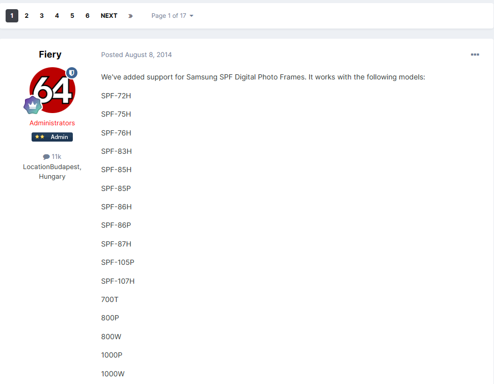

# 二.简评

电子相册现在肯定很多人是没有听说过了，毕竟这玩意儿十几年前就得卖几百上千（三星），现在基本也是销声匿迹，当时买得起的肯定也是副歌们了，就拿我买的SPF-87H为例

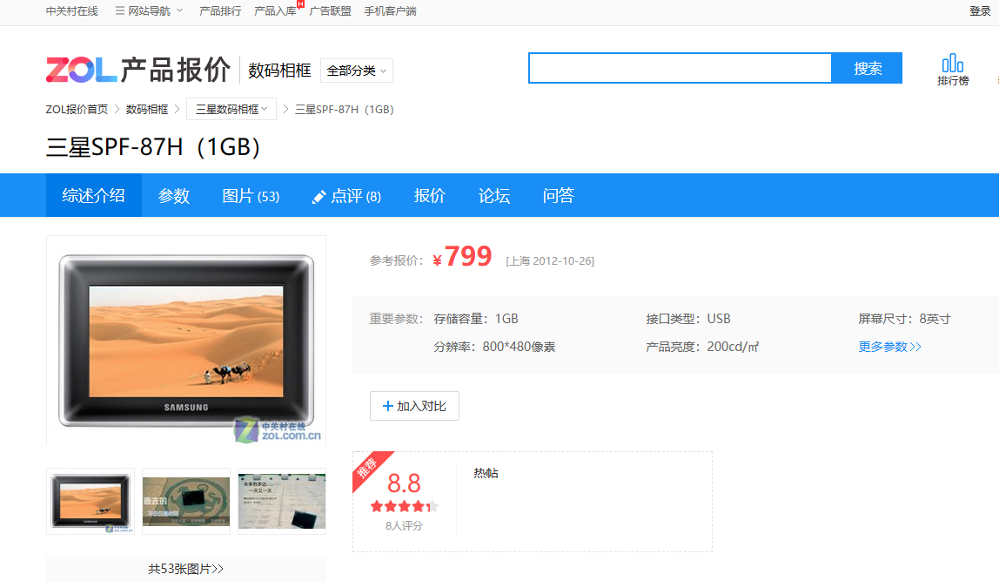

这是2009年的评测文章https://lcd.zol.com.cn/134/1345497.html

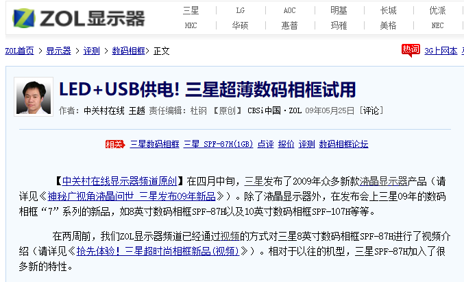

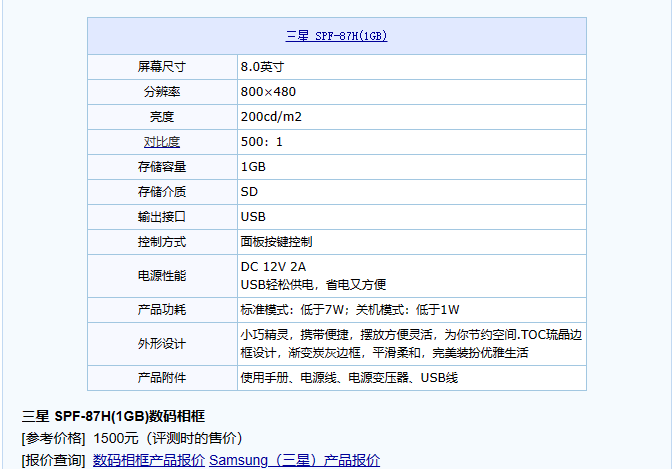

>  在三星SPF-87H的外包装上我们就能清晰的看到这款产品的部分卖点，8英寸的屏幕尺寸，内置1GB的内存容量，迷你显示器功能和超薄机身设计。

当然现在这款电子相册在海鲜市场只需要几十块就能入手了，成色好的可能要60多，像我淘的这个成色略差（两角漏光），且缺少数据线，只花了35大洋就包邮到学校了。

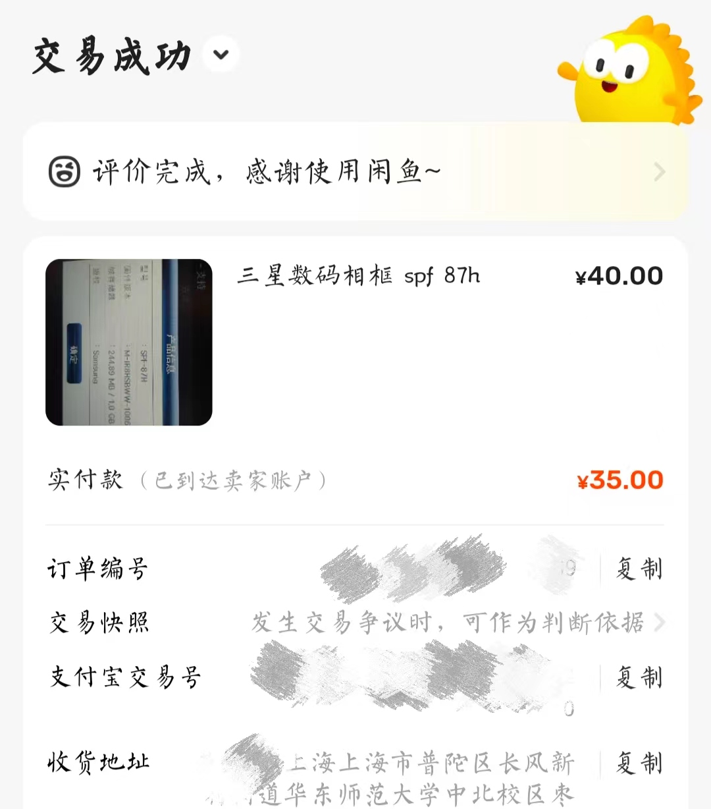

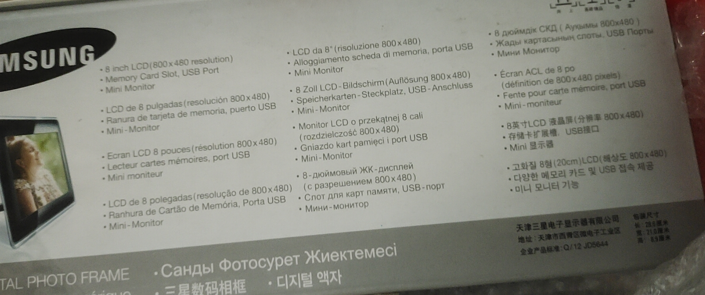

到手第一件事就是检查有无问题，还好并无大碍，插上数据线后的第一个难题就是电脑无反应，设备管理器里也没有任何新东西，驱动装上后也没反应。。。。。。折腾半天发现是我买的mini B线材问题，检查后发现里面只有两根供电线，没有数据线。无奈只好重新下单购买，这次我选择了一个这样带辅助供电的线材，这样子可以不用外接12V小砖块电源了，全靠主板供电就行。

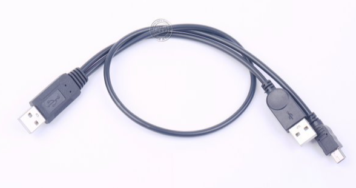

# 三.操作流程

1.打开DIY爱好者和垃圾佬必备的图吧工具箱([没有的自己下一个](https://www.tbtool.cn/?gozelm=a3oj1))，找到AIDA64，并打开AIDA64

2.主界面点击 文件->设置->LCD，选择Samsung，点击启用SPF LCD支持的选项，如果出现和我一样的绿色SPF Init OK字样，并且屏幕上显示AIDA64字样，则表示接管成功

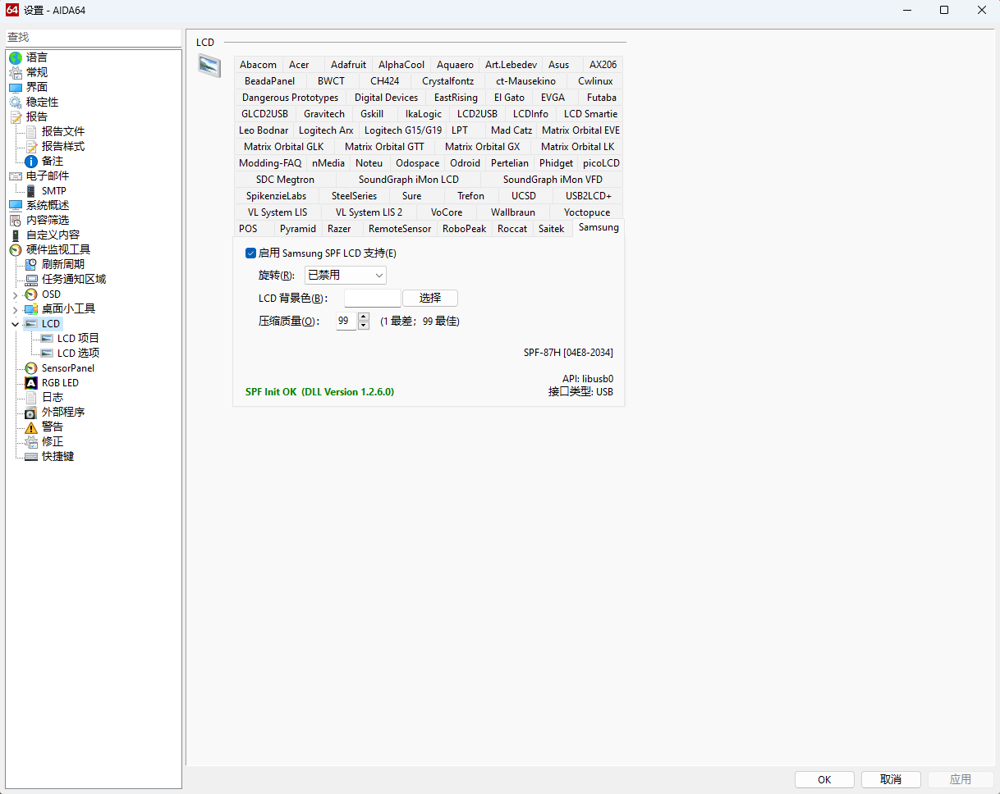

接下来就只需要在LCD项目里导入模板修改就行了

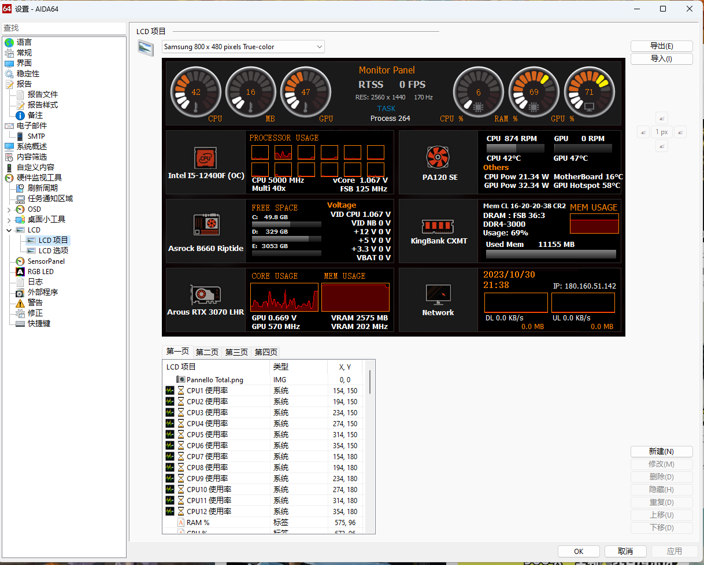

如果绿字处显示错误，那么就点击出现的网址下载驱动安装，安装结束再进行尝试。

注意我这个东西，需要在USB插入后的5s内点击“启用SPF LCD支持”内才能顺利接管，具体就听USB设备音效判断即可（5s真男人）。

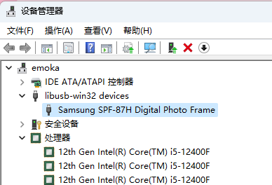

想要开机自启也很简单，设置开机自启即可

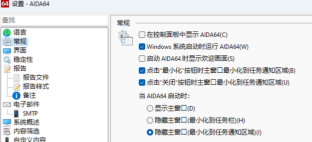

发现我现在用的ASRock主板关机后USB是可以设置供电的，这样也不需要再对相册进行设定了，不需要关闭相册，正常开关机相册会自动被AIDA64接管

# 四.具体效果展示

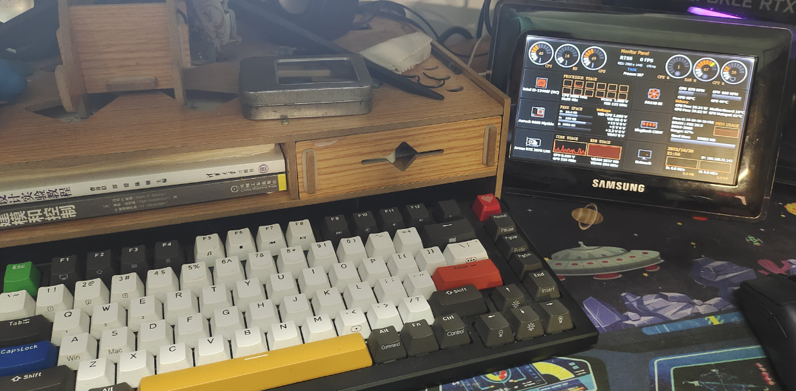

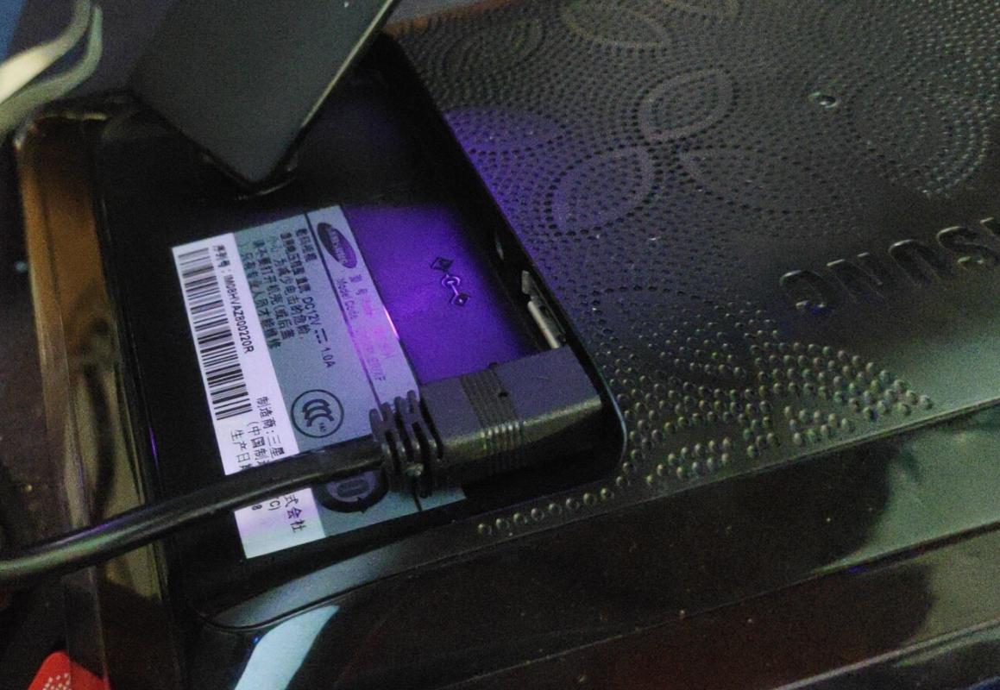

居然不是萌萌二次元，果然数据展示还是要有点战斗感啊:)

