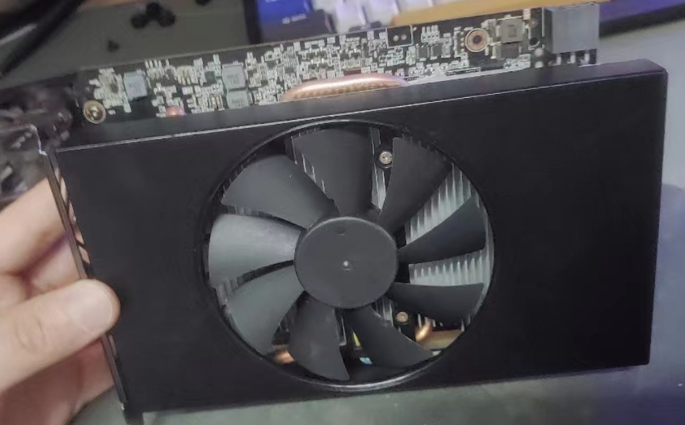
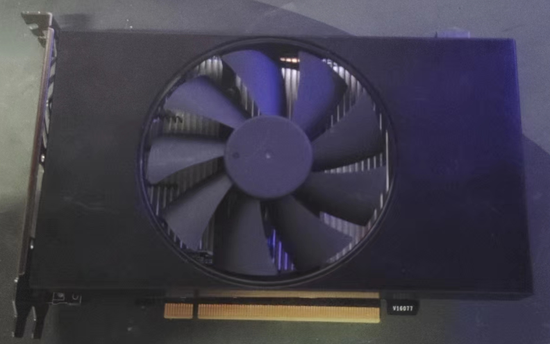
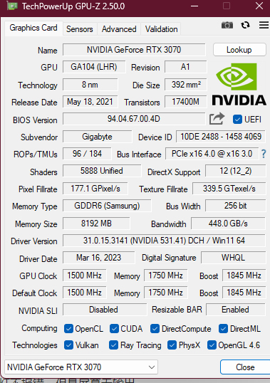
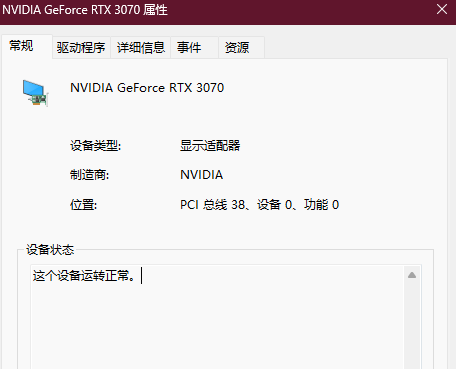

## 一.前情提要

今天我把之前买的p106-100又改了一下，用手锯锯掉原有的铝块部分，并且配上pdd 9.9包邮的太阳花580散热风扇，热管敲进去，凑出一张itx短卡来。（不过温控还有问题）

然后，下午另一张p106-90索泰短卡也到了，于是我搭上亮机卡r5 240分别上电脑装驱动测试了一遍。

本来我测好了就结束了，但是当我把3070插回电脑时意外就发生了。

## 二.错误捏

因为当时太急，忘了截图喵。简单描述一下：

dp线插显卡上开机，主板debug灯不报错，但是屏幕无输出。

在第二pcie*16插槽插上亮机卡，这下正常进系统了，点开gpuz一看，妈呀，显存信息什么的都没有了，大概就是这张图里bios信息无，uefi没打勾，显存类型无，显存大小0Mb,带宽什么的通通没有

下面两排打勾的也没有。

我打了下驱动，发现是可以打上的，安装驱动没有报错，但是当我按照提示重新开机时发现情况还是这样（不过驱动版本是正常的）。

我的第一反应是这卡是不是炸了，但一想，我啥也没做啊，只是取下来放一边再安装回去罢了。

又猜测是不是bios无了，这卡是双bios，换到silent bios结果还是一样。。。用nvflash工具也提示找不到显卡。。。

最后看设备管理器的错误提示，显示内容为--显卡：该设备找不到足够资源可以使用（代码12）

一般维修视频的报错都是代码43，可能是显存或者核心坏了，本来我都有点想托人去送保了，但看到这代码12或许有点搞头，便接着折腾了。

网上基本没什么资料，通通试了一遍，最后选择了一个看起来不知道原理的方法，在主板bios内，更改csm为uefi，就直接点亮了，驱动也不用再装，就是上次显卡读不出来时打上的（伏笔是吧），不用再把卡送去保修浪费时间了。。。

## 三.结论

1.家中常备亮机卡（新的亮机卡---一张Nv公版泰坦皮770正在路上）

2.老老实实开uefi，csm不知道为何出现这种兼容性问题

3.我换显卡的过程中，这套平台内存兼容性太差了（微星老主板+国产长鑫颗粒，经常卡cpu灯，而且我还是四条内存槽插满的，想要四条插上同时点亮还挺麻烦），解决方案，等14代或者8000系锐龙出了换一套全新板U上双条16g d5。