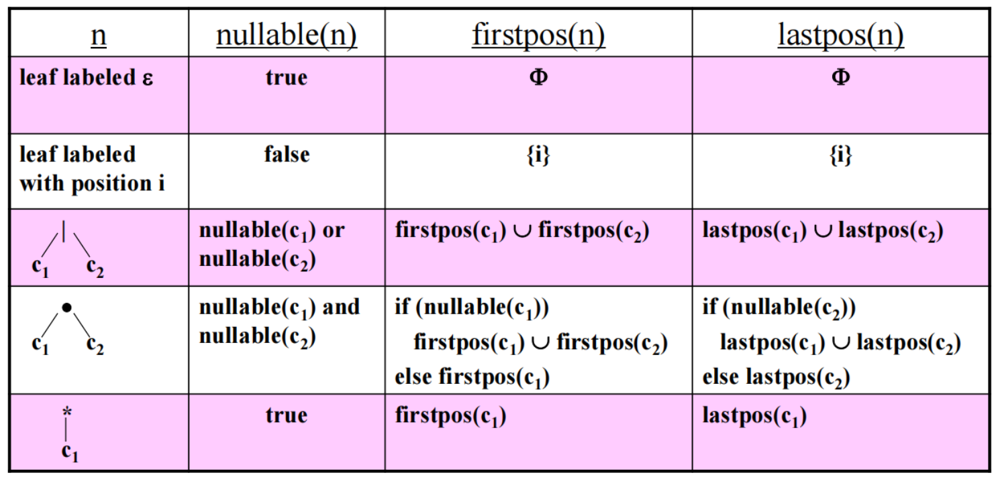

关于正则化直接构造法DFA的记录：

①构造firstpos，lastpos，nullable，followpos

②节点类型：|（或），*（闭包），·（连接）

③语法树：添加’#‘号作为接收状态标志

④最小化DFA

最简单的nullable，如果空字符串是由以n为根的子表达式生成的字符串的成员，则为true。看节点是否可能为空：比如ɛ，*节点以及对应的组合

firstpos，定义了以结点n为根的子树中的位置集合。这些位置对应于以结点n为根推导出的某个句子的第一个符号：大多数情况都i是叶子前结点的并。在连接的情况下，如果前结点不为空就只有前结点，否则也是并

lastpos，和firstpos的前后节点情况对调

followpos：

- 当n是一个连接结点，且其左右子树分别为c1、c2，那么对于lastpos(c1)中的所有位置i，firstpos(c2)中的所有位置都在followpos(i)中。  

  ​	followpos（lastpos（c1））=firstpos（c2）

- 当n是一个星结点，且i是lastpos(n)中的一个位置，那么firstpos(n)中的所有位置都在followpos(i)中。

- followpos(lastpos（i）)=firstpos（i）

盯准两种结点，从下往上扫一遍并记录

最小化DFA：

第一步，写出firstpos(root)={1,2,3}=A意思就是根节点的firstpos用来构建第一个状态（怎么找？别被迷惑，就是语法树顶的左边的几个数字）

第二步，A闭包，接a，b等东西(例如接a，那么就并上A中为a标号的followpos)。。。。和

具体可看：https://blog.nowcoder.net/n/a9bd25e694e547189bc691824ebc0d50