# **计算机组成与实践** 

> 这个系列用来整理老师（谷守珍）上课的ppt

## 一.课程信息

### 课程教材

🔷《Computer Organization and Design, The Hardware/Software Interface》(Fifth Edition)，作者：David A. Patterson和John. Hennessy

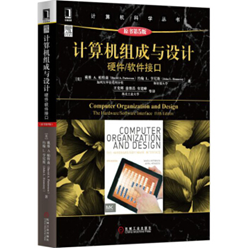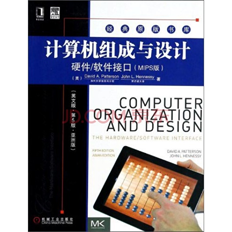

🔷电子版，amazon.com

软件：Logisim

### **课程教学内容及目标**

🔷高级语言的程序如何翻译成硬件可执行的语言

​	•硬件如何执行程序

🔷什么是软硬件之间的接口

​	•软件如何指导硬件完成功能

🔷哪些因素决定了程序的性能

​	•程序员如何改进程序性能

🔷哪些技术可以改进计算机性能

🔷串行处理为什么发展为并行处理

### **如何学习这门课**

**基础知识**

​	♦基础的逻辑设计与电路知识

​	♦FSMs，与或非逻辑

​	♦处理器，存储器，I/O基本知识

​	♦编写、编译、运行程序

**推荐学习方式**

​	♦关注并学习具体实例的运行

​	♦以例子为基础，学习基本原理

## 二.背景

### 计算机的发展

**电子计算机时代**（1947贝尔实验室第一个晶体管/1951第一台商业计算机UNIVAC-1）--**集成电路计算机时代**(1958德州仪器发明集成电路/代表IBM360)--**微处理器（CPU）的诞生**（1971，intel4004）

### **电子技术的发展**

🔷容量增大，性能提升

🔷制造成本降低

### **半导体（Semiconductor）技术**

🔷**硅：**导电能力不强，称为半导体

🔷**加入其他材料，将硅转变成包含三种属性的区域**

•良好的导电体

•良好的绝缘体

•可控的导电体或绝缘体

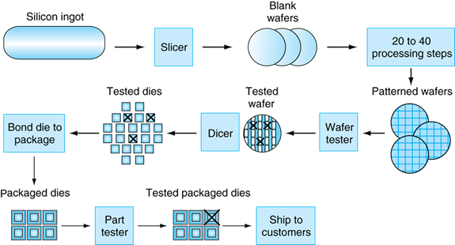

成品率：合格芯片数占总芯片数的百分比（想到显卡cpu都是按最高标准生产晶圆，合格的做成i9-13900，ad102（rtx6000Ada），不合格的就屏蔽部分做出i7-13700，ad102-300-A1（rtx4090）以及之后的各档次）

### **集成电路成本**

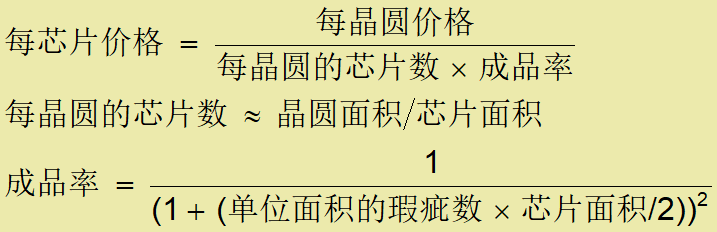

🔷每个晶圆的价格和面积是固定的

🔷制造工艺决定瑕疵率

🔷体系结构和电路设计决定芯片面积

🔷芯片的成本取决于成品率以及芯片和晶圆的面积

### 摩尔定律

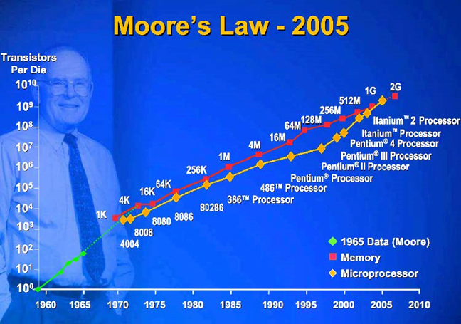

### **各厂商制程线路图**

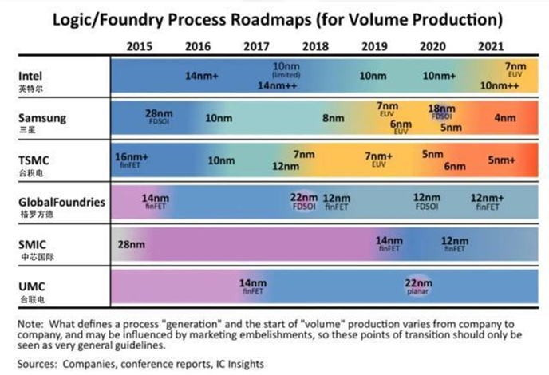

### **芯片制程**

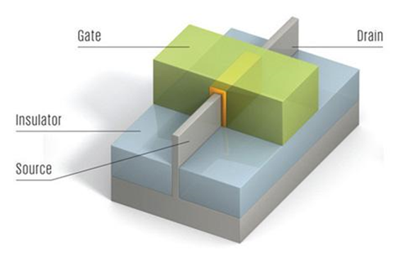

| **栅极（Gate）**                                             |
| ------------------------------------------------------------ |
| 电流从源极（Source）流入漏极（Drain），栅极（Gate）相当于闸门，负责控制电流的通和断。 |

| **芯片“nm”的制程数值**                                       |
| ------------------------------------------------------------ |
| 指的是芯片中最小的栅极宽度。而栅极宽度决定了电流通过时的损耗，栅极越窄、功耗越低，性能越高。 |

功耗计算：

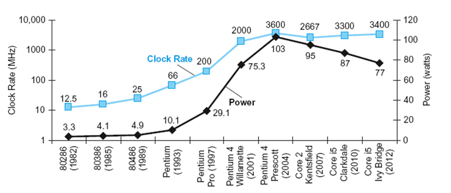

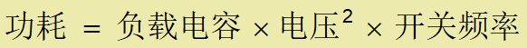

我现在的r5 5600电压是1.26，主频4.7GHz

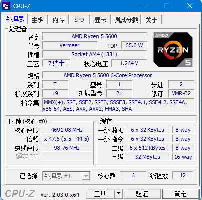

🔷例子：设计新处理器

​	•负载电容是旧处理器的85%

​	•电压和开关频率减少15%

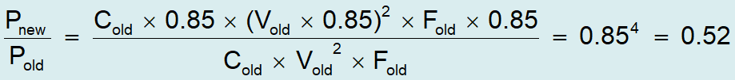

🔷功耗墙(TDP,上面那颗就是65w)

​	•不能再减少电压

​	•不能解决散热问题

🔷怎样提升性能？

### **单核处理器转向多核处理器**

原因：功耗, 指令级并行, 存储访问延迟影响

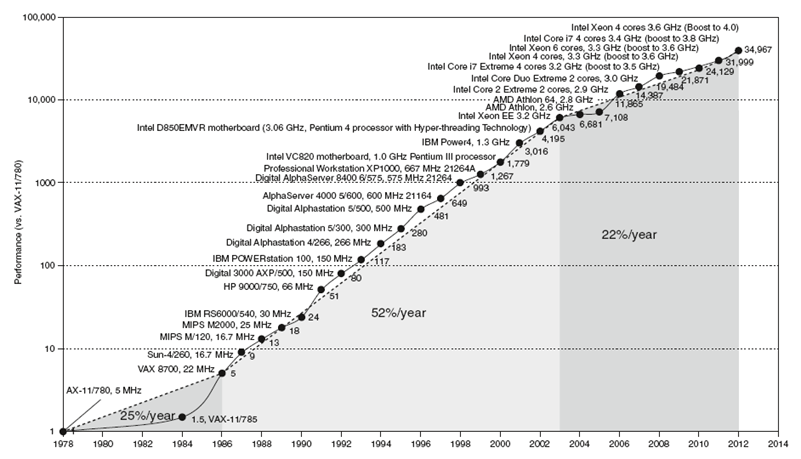

🔷多核微处理器

​	•单芯片集成更多处理器（processor）

🔷需要显性并行编程

​	•与指令级并行相比

​	•硬件可以同时执行多条指令

​	•程序员不可见硬件并行

•难点

​	•如何提升性能

​	•负载均衡问题

​	•通信与同步技术

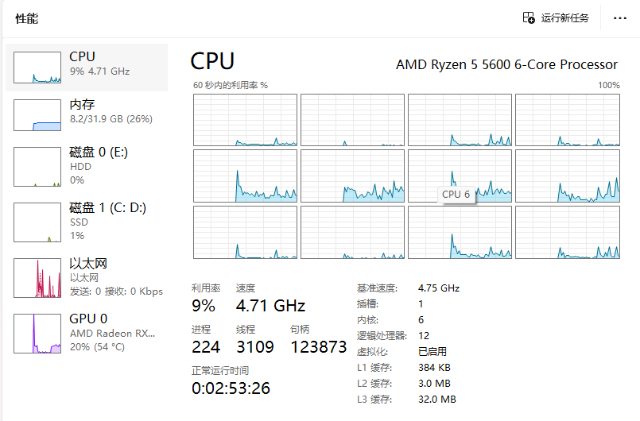

### **个人计算机（Personal Computers）**

| **个人计算机**                                |
| --------------------------------------------- |
| 通用型计算机  运行第三方软件  性价比高  (DIY) |

### **服务器（ Server Computers）**

| **服务器**                                                   |
| ------------------------------------------------------------ |
| 通过网络访问  执行大负载任务、高性能、高可靠性  高能耗、高成本  分为通用服务器和专用服务器，例如超级计算机（Supercomputers）是用于计算的专用服务器 |

### **嵌入式计算机（Embedded Computers）**

| **嵌入式计算机**                       |
| -------------------------------------- |
| 面向单一任务  严格限制成本、性能、能耗 |

### **仓储规模计算机（WSC）**

| **仓储规模计算机（WSC）**                                    |
| ------------------------------------------------------------ |
| WSC是云计算的核心  软件即服务（  Software as a Service ）  部分软件运行在移动端设备，部分软件运行在云端  重视互动应用程序、大规模存储、可靠性和很高的因特网带宽 |

### **个人移动终端（Personal Mobile Device，PMD）**

| 个人移动终端                                                 |
| ------------------------------------------------------------ |
| 电池供电  无线方式连接网络  个人移动终端销售量远大于桌面终端 |

## 三.课程内容简介

### 计算机构成

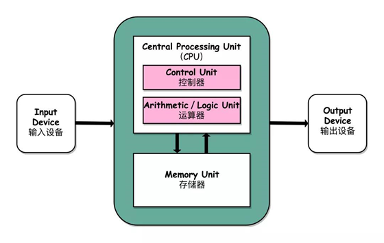

| **主要组成部件**                                             |
| ------------------------------------------------------------ |
| 数据通路（运算）单元  控制单元  存储器（缓存、内存和硬盘等）  输入设备（鼠标、键盘等）  输出设备（显示器和打印机等） |

**学习处理器（数据通路和控制单元）与存储器的基本设计方法、相互间的协调合作**

​	🔷处理器与存储器由几百至几千万晶体管实现

​	🔷深入到学习每个晶体管的功能不现实

​	🔷需要采用抽象的方式来学习

### **程序概念入门**

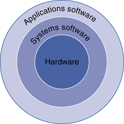

🔷**应用软件**

​	🔷高级编程语言，例如C、Java、Python等

🔷**系统软件**

​	🔷编译程序：将高级语言程序翻译成

  	硬件可执行的指令

​	🔷操作系统：为应用软件与硬件交互

​	  提供服务的软件

​	🔷处理基本输入输出

​	🔷分配内外存

​	🔷对任务进行调度，提供共享计算机资源的服务

🔷**硬件**

🔷处理器，存储设备，I/O控制器等

### **高级程序语言**

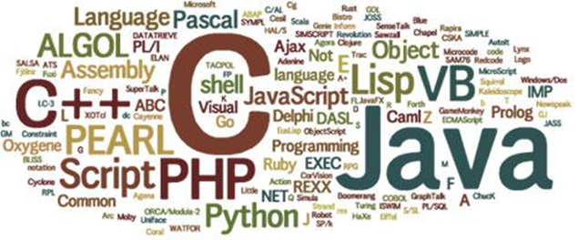

​	🔷程序员可以根据需要选择高级编程语言，以类似自然语言的方式编写程序代码

​	🔷可读性高，容易纠错，提升了程序员的代码生产力

​	🔷程序维护性高

​	🔷不依赖于硬件平台，可移植性好

​	🔷优化编译器可以基于机器平台进行高效的汇编代码优化

### **高级程序语言的运行**

高级程序语言程序（C语言）--编译--汇编语言程序（MIPS）--汇编-- 机器代码（MIPS）

运行流程：

​	①代码通过输入设备加载到计算机

​	②代码输入到计算机后，保存在存储器中

​	③处理器从存储器提取指令

​	④控制器对指令进行译码，获得指令的执行信息

​	⑤数据通路根据控制信号执行指令

​	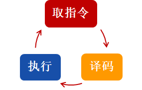

### **指令集体系结构（ISA）**

硬件和底层软件之间的接口，被命名为计算机的**指令集体系结构（instruction set architecture，ISA）或简称体系结构（architecture）**

​	🔷**体系结构**有指令、寄存器、存储器访问、I/O等编写机器语言程序所需的所有信息。

​	🔷隐藏底层细节，使程序员只需要考虑功能

​	🔷基本指令集和操作系统接口被称为**应用二进制接口（Application binary interface，ABI）**

​	🔷体系结构的实现：遵循体系结构抽象的硬件

## 四.小结

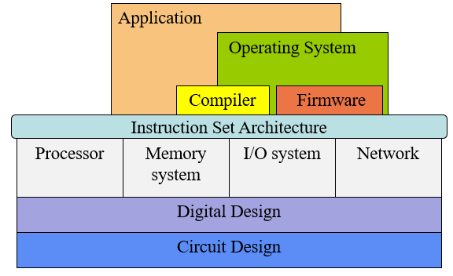

### 软硬件协同工作：	

​	🔷多个层次间通过**抽象**相互合作

​	🔷各项技术都在快速的发展

​	🔷设计、测试与评估方法复杂