# **计算机组成与实践** -**缓存（Cache）**

## 一.**简介**


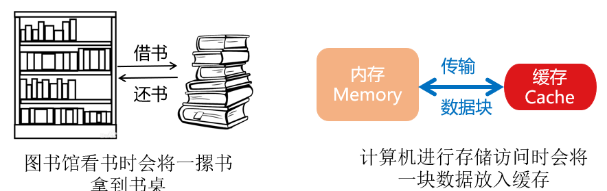

缓存是基于局部性原理设计的存储器体系层次，能够有效的提升数据访问速度

#### 麒麟990 5G芯片

8核：2个Cortex-A76（2.86GHz），2个Cortex-A76（2.36GHz），4个Cortex-A55（1.95GHz）


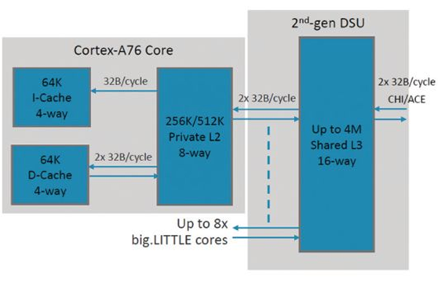

### 缓存-内存映射


- 内存单元到缓存行间的对于关系
- 缓存行（Cache line）=缓存块（Cache block）
- 设计点：
  - 可以快速判断缓存命中或缺失
  - 充分利用容量有限的缓存，提高命中率

| **硬件设计需要解决的问题**      |
| :------------------------------ |
| 1、如何判断数据是否在缓存中     |
| 2、如果在缓存中，如何找到该数据 |

### **缓存行**

缓存容量远小于内存容量

多对一映射

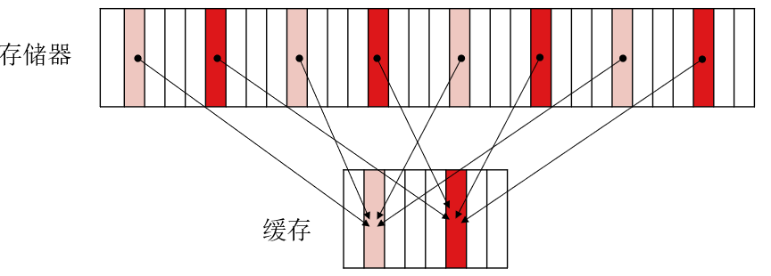

## 二.**直接映射（Direct Mapping）**


- 每个缓存块中有2^4=16 bytes
- 2^7=128个缓存块
- 2^(7+5）=4096个内存块

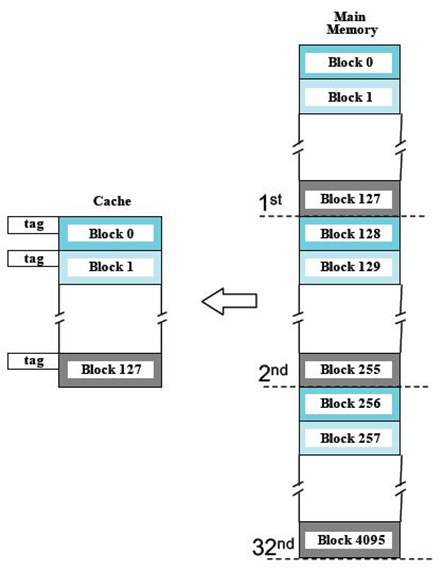

- 缓存块号=（内存块地址）mod（缓存中块总数）
  - 内存块j映射到 （j mod 128）缓存块
- 如果标签相同，则缓存命中

| **地址分为3个字段**                                          |
| ------------------------------------------------------------ |
| 块号字段决定存储在内存的哪个块                               |
| 标签字段用于区分不同的内存块（内存块到缓存块是多对一的关系） |
| 字节偏移字段用于选择需要访问的数据（字或字节等）             |

**例如：给出地址（t,b,w）(16-bit)**

1、用t与缓存块b中的tag作比较，确定该数据是否在缓存中

2、如果不相同，缓存缺失（Cache miss），用内存块（t,b）(12-bit)替换缓存块b

**CPU需要访问数据，其地址为[A7B4]=1010011110110100**

1、检索缓存块1111011，查看其tag是否为10100

2、如果是，命中

3、如果不是，从内存读取该块到缓存块1111011中，并更新tag为10100

#### 练习

假设缓存有4个块，每个缓存块大小为1 word，初始时为空，给出以下内存块地址：0,1,2,3,4,3,4,15，计算缓存命中率

| INDEX | TAG  | DATA |
| ----- | ---- | ---- |
| 00    |      |      |
| 01    |      |      |
| 10    |      |      |
| 11    |      |      |

块地址有16个，需要4bit，index占2bit，那么tag位也占4-2=2bit，index=n%4, tag=n/4

0-index00-tag00      4-index00-tag01	4hit

1-index01-tag00	

2-index10-tag00

3-index11-tag00  	3hit	15-index11-tag11   总共hit 2次命中率25%

### **MIP中的直接映射缓存**

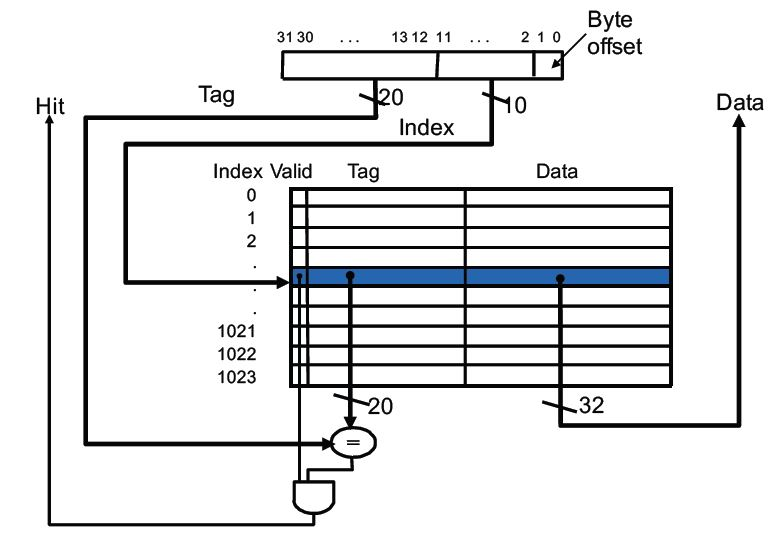

缓存块大小为1 word（4 bytes）

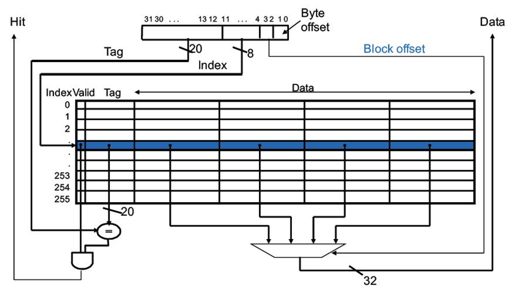

缓存块大小为4 word（16 bytes）

#### **例子**

假设缓存有2个块，每个缓存块大小为2-word，初始时为空，给出以下内存块地址：0,1,2,3,4,3,4,15，计算缓存命中率

| INDEX | TAG  | DATA(1) | DATA(2) |
| ----- | ---- | ------- | ------- |
| 00    |      |         |         |
| 01    |      |         |         |


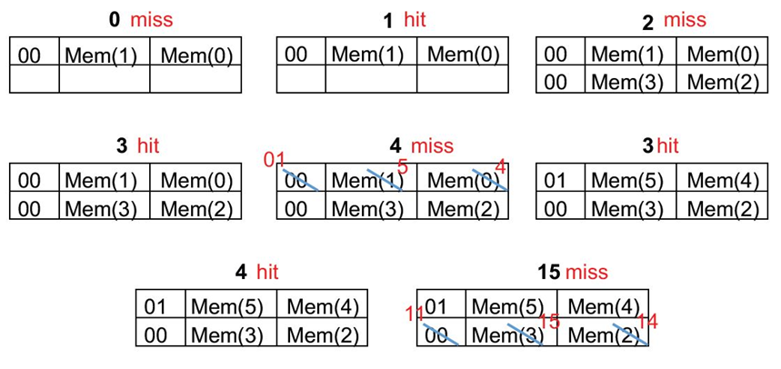

16=2^4,index占了2bit，tag也是2bit，不过是一次取2word比如0-1，2-3，4-5,index就是（n/2）%2，tag就是(n/2)/2

 8次访问，4次命中，命中率为50%

### **MIPS缓存设计**

缓存需要存储数据以及与其对应的标签

- 2^n个块的直接映射缓存，n个bit用于索引
- 大小为2^m个字（ 2^(m+2) 个字节）的缓存块，m个bit用于寻址块中的字
- 2 bit用于寻址一个字中的字节

| **标签字段的大小**  |
| ------------------- |
| 32  -（n  + m + 2） |

| **直接映射缓存中存储的总的bit**             |
| ------------------------------------------- |
| 2^n ×（块大小 + 标签字段大小 + 有效位大小） |

#### 练习

> 假设一个直接映射的cache，有16 KB的数据，块大小为4 words，地址为32 bits，那么该cache总共需要多少位？
>
> 4word=16Bytes ，字节寻址块偏移位4bits，块数目16KB/16Bytes=1024=2^10 ,直接用10bit来索引,tag=32-10-4=18bits
>
> CacheSize=Number*(1 valid bit +tag + Blocksize)=2^10 *（1bits+18bits +32bits * 4）= 147Kb
>
> 思考了一下：这里的16KB都是缓存块存的数据部分大小，因此求出的块数目2^10，就是index=10，通过32bits地址和2bits块内偏移可以直接得出tag=18，那么顺势也能得到总共有2^(18+10)个内存块，对这2^28个内存块求tag和index也是÷和%得到（这样就和前面的串起来了）

老师的版本：16KB=4096words，根据块大小有4096/4=1024个块

每个块存有是4*32=128bits数据

标签字大小：32-（10+2+2）=18bits

每个块有1bit有效位，总cache大小2^10(128+18+1)=147Kb

## 三.**组相联映射（Associative Mappin）**

### **全相联映射**


- 每个缓存块中有2^4=16 bytes
- 128个缓存块
- 2^12=4096个内存块

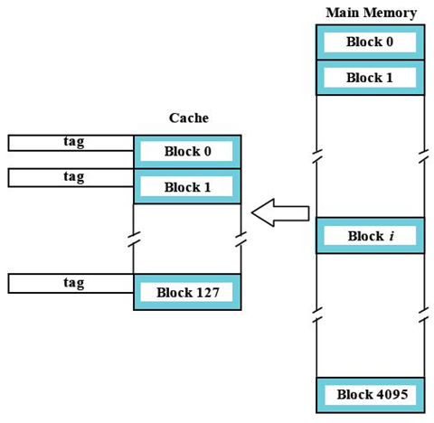

**内存块可以映射到任意的缓存块**（没有对应吧关系）

128个缓存块的标签需要与地址的标签位进行并行的比较（硬件实现）

**CPU需要访问数据，其地址为[A7B4]=1010011110110100**

1、查看其tag是否为101001111011

2、如果是，命中

3、如果不是，从内存读取该块到任意空闲缓存块（如果没有空闲缓存块，就采用缓存替换策略进行替换），并更新tag为101001111011

### **组相联映射**


每个缓存块中有2^4=16 bytes

128个缓存块分为2^6=64个组

2^12=4096个内存块

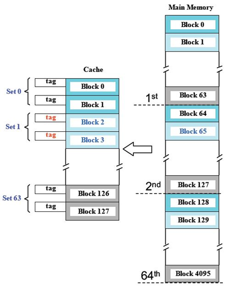

结合了直接映射与全相联映射的特点

缓存组号=（内存块地址）mod（缓存中组总数）；内存块j映射到 （j mod 64）缓存组

每组有K个块称为**K路组相联缓存**

#### **2路相联映射**（每组两个块-是两个块而不是每组两个数据，数据是和字节偏移对应的）


2路组相联（2-way set associative）：

CPU需要访问数据，其地址为[A7B4]=1010011110110100

1、检测缓存组111011

- 缓存块1110110
- 缓存块1110111

2、检测缓存组中是否其中一个缓存块的标签为101001

3、如果是，命中

4、如果不是，从内存读取该块到缓存组111011中空闲的缓存块（如果没有空闲缓存块，就采用缓存替换策略进行替换），并更新tag为101001

#### **MIPS中的组相联映射缓存**

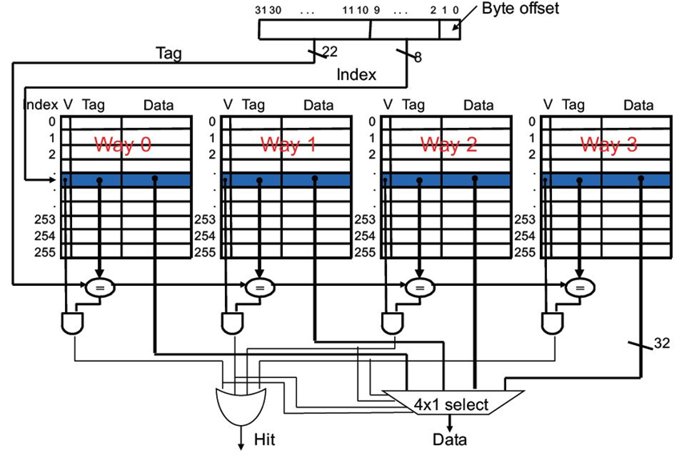

## 四.**替换策略**

### **处理缓存的读请求**

- 适用于I cache和D cache
- 命中
  - 顺利读取数据
- 缺失
  - 阻塞流水线
  - 从下层存储层级获取请求的数据
  - 数据保存至缓存，读取请求的字
  - 恢复流水线运行

### **处理缓存写命中**

D cache

| **策略1：写直达（Write-Through）**                          |
| ----------------------------------------------------------- |
| 保持缓存和内存数据的一致性                                  |
| 将数据同时写回到缓存和下层存储层级                          |
| 加入写缓缓冲（write  buffer），只有写缓冲满时才停止写回缓存 |

| **策略2：写回(Write-Back）**                            |
| ------------------------------------------------------- |
| 只将数据写回到缓存                                      |
| 只有需要将缓存块驱逐（evicted）时，才写回到下层存储层级 |
| 每个缓存块需要1  bit 脏块（dirty）标记                  |

### **处理缓存写缺失**

| **策略1：带写缓冲的写直达缓存**                              |
| ------------------------------------------------------------ |
| 没有写分配（No-write  allocate）：内存块更新后，不重新载入缓存 |
| 跳过缓存更新，但是需要将该缓存块置位无效                     |
| 将写回数据写入写缓冲                                         |

| **策略2：写回缓存**              |
| -------------------------------- |
| 写分配                           |
| 更新缓存中的数据，包括标签和数据 |
| 不需要写命中检测                 |

### **没有写分配的写直达缓存**

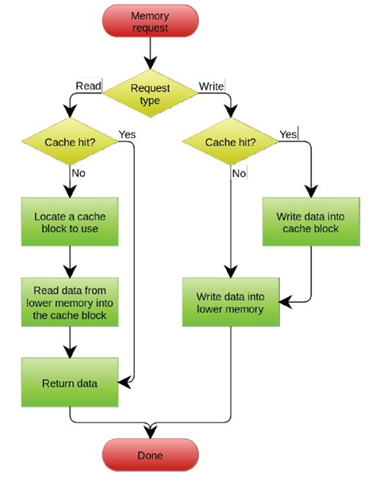

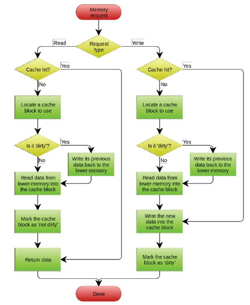

### **替换算法**

- 直接映射：不需要选择替换的块
- 组相联映射：
  - 首先映射到有效位为0的项
  - 如果没有，在该组的项中挑选一个项替换
- 最近最少使用（Least-recently used，LRU）
  - 替换很长时间没有使用的块
  - 不适用于超过4路的组相联映射
- 随机替换
  - 当相联度较高时，与LRU性能类似

**缓存例子**

```
short A[10][4];
int   sum=0;
int   j,i;
double mean;

//forward loop
for (j=0;j<=9;j++)
     sum +=A[j][0];
//backward loop
for (i=9;i>=0;i--)
     A[i][0]=A[i][0]/mean;
```

数据缓存大小为8 块

A [ 10 ] [4]存储地址空间为7A00-7A27

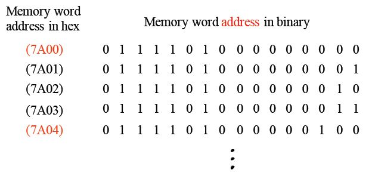

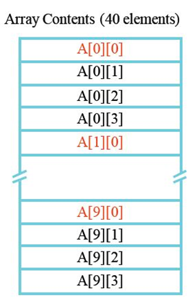

假设采用16 bit地址，并且1 字大小为1 byte（也就是说没有字节偏移位）

- 直接映射：13 bits 标签，3 bits 块号
- 全相联：16 bits标签
- 2路组相联：15 bits 标签，1 bit组号

### **直接映射**

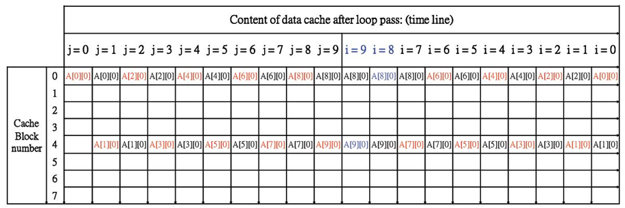

- 只有两个缓存块被使用（注意看，都是A[X] [0],只看上面标红的地址7A00&7A04）,读图以列为状态单位，从左往右读，比如j=0时，cache里块0装A00;j=1时，块0还是A00，块4新写入A10
- 缓存利用率低

### **全相联映射**

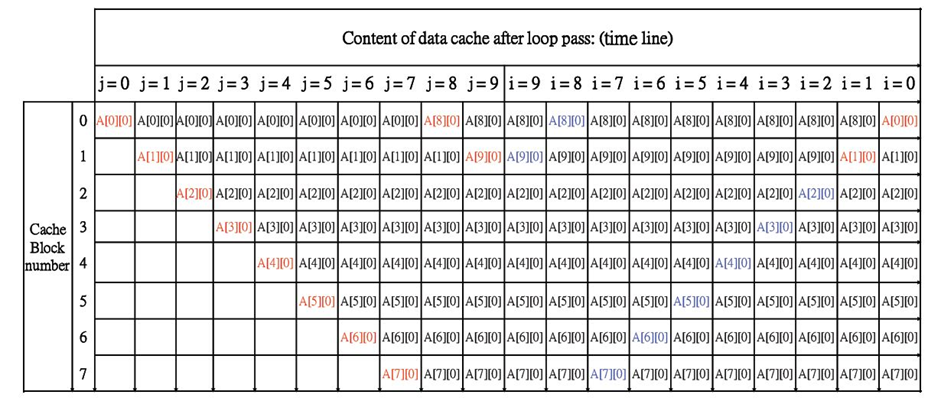

使用LRU替换策略

### **2路组相联**

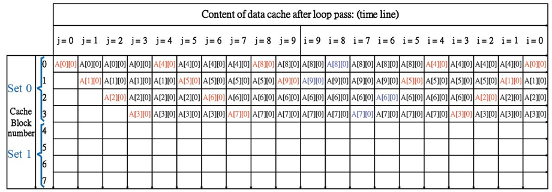

只有一半的缓存块被使用

### **分析**

- 全相联映射缓存最好，组相联缓存次之，直接映射缓存最差
- 通常情况使用组相联映射，并采用LRU替换策略
- 较大的cache 块能更好地利用空间局部性以降低缺失率
- 在固定块大小的cache中
  - 较大块->块的数量减少
  - 地址映射的竞争增大->增加缺失率(用直接映射来思考，块数量少了，一个缓存块需要对应的内存块就更多了，竞争大)
  - 较大块->空间局部性降低

## **五.小结**

- 缓存结构
  - 直接映射、全相联映射、组相联映射
- 替换策略
  - 随机替换、LRU
- 缓存命中与缺失代价