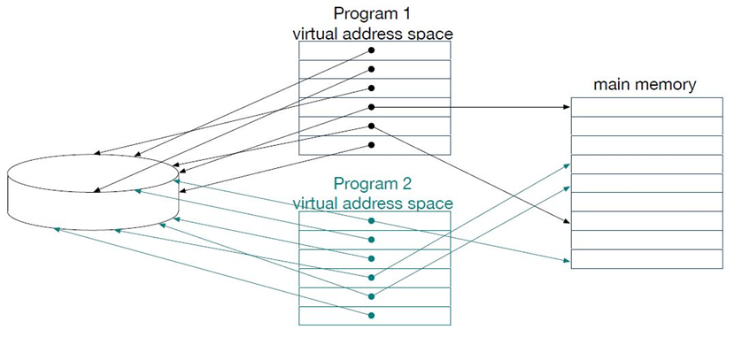
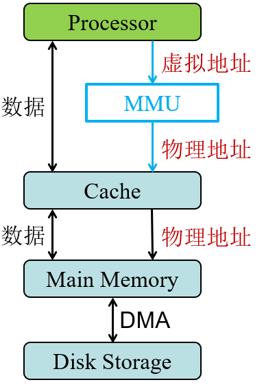
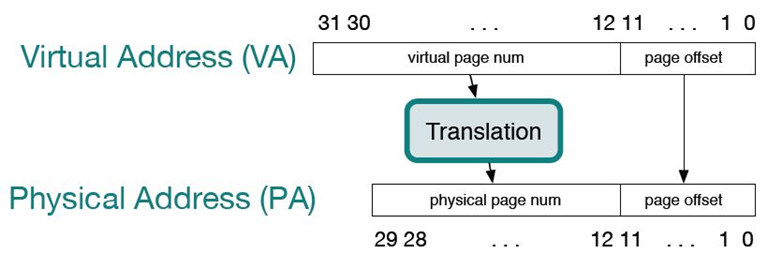
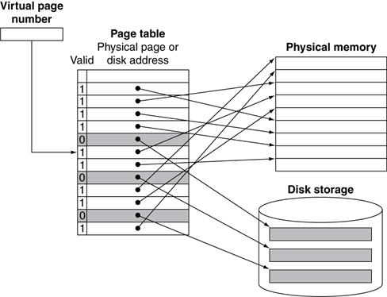
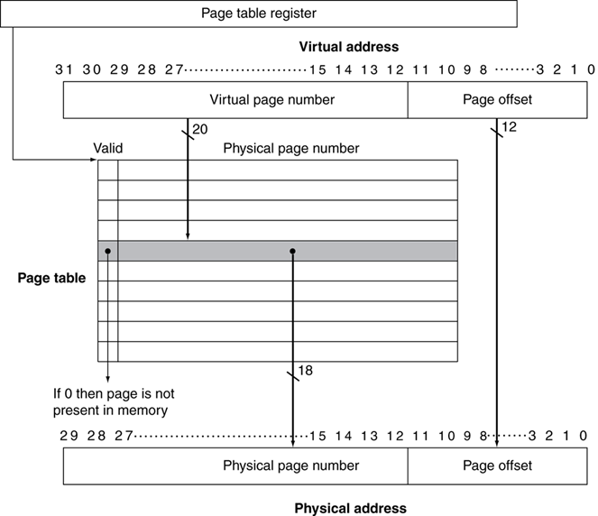
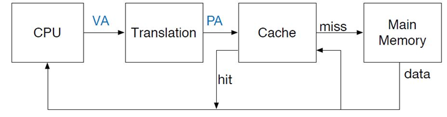
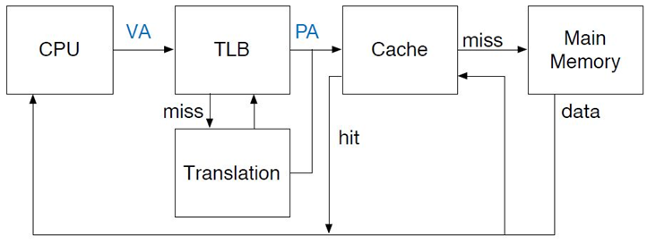
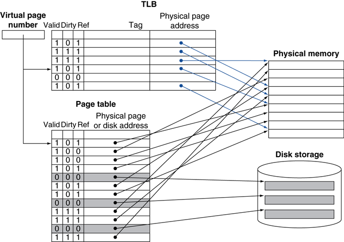
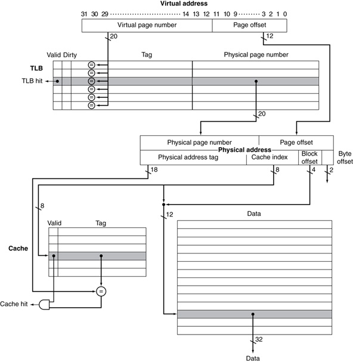
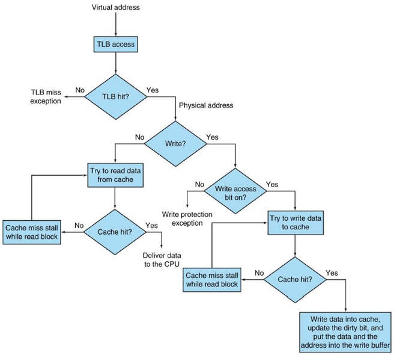

# **计算机组成与实践** -**虚拟存储器（Virtual Memory）**

## 一.简介

存储器的存储容量可能小于可寻址空间

- 32-bit地址可以寻址4GB空间
- 内存地址可能只有1GB

> 系统可以同时运行多个程序，如果这些程序运行所需的存储空间大于实际内存容量，系统该如何运行？

术语：

- 运行的程序称为一个进程（process）或线程（thread）
- 操作系统控制进程

### **虚拟存储器（Virtual Memory）**

- 将主存用作辅助存储器的高速缓存的技术
- 程序拥有自己的虚拟地址空间，存储频繁访问的代码与数据
- 根据局部性原理而设计

> 虚拟存储器优势：
>
> ​	运行时，CPU和OS将虚拟地址（Virtual Address）转换成物理地址（Physical Address）
>
> ​	实现多个程序共享存储器
>
> ​	允许运行超过主存容量的程序
>
> ​	代码重定位（Code Relocation）：代码可以加载进内存的任何地方

### **例子：从存储层次结构来看**

- 假设内存容量为1GB，此时已经使用了1GB容量，在程序运行时需要额外的存储空间
- 把内存中的一块数据（100MB）移出到硬盘
- 此时，内存有100MB的空闲（free）存储空间
- 如果稍后，需要使用被替换出去那块数据
- 需要把内存中其他的数据块移出到硬盘，以获得100MB的空闲存储空间将原来的数据载入

### **两个程序共享物理存储**

程序的地址空间被划分成页（pages）或片段（segments）

### **虚拟存储器架构**

部分进程临时存放在硬盘，一旦需要运行就载入内存

载入由操作系统执行，应用程序不需要知道虚拟存储器的存在

存储管理单元（MMU）将虚拟地址转换成物理地址

# 二.**虚拟存储器**

### **地址转换**

存储器的数据传输单元为页（page）

- 页大小：4KB ~ 16 KB
- 与缓存块大小设计类似
- 页太小：花费较长时间在磁盘寻址页
- 页太大：页中部分存储空间空闲

在磁盘中寻址数据需要花费较长时间，一旦找到数据，能以每秒几MB的速度进行数据传输

如果页太大，页中部分存储空间空闲，造成内存中很大一部分存储空间的浪费

- 虚拟地址到物理地址的转换由软硬件协同完成
- 存储访问请求首先需要进行地址转换
- 处理器请求的虚拟地址：
  - 高位字段代表虚拟页号（virtual page number）
  - 低位字段代表页偏移（page offset）

### **页表映射**

| **页表（Page Table）**                                       |
| ------------------------------------------------------------ |
| 保存着虚拟地址和物理地址之间转换关系的表  Ø以虚拟页号为索引  Ø指向页表首地址的寄存器：页表寄存器（  page table register ）  页在内存中：页表中的对应项将包含虚页对应的物理页号及状态信息  页不在内存中：页表可以指向磁盘的交换区（swap space）中的地址 |

#### **缺页（page fault）代价**

- 缺页时需要从磁盘提取页到内存
  - 一次缺页处理将花费数百万个时钟周期
  - 由OS代码处理
- 缺页处理
  - 用发生缺页的虚拟地址找到PTE
  - 在磁盘中定位该页的位置
  - 在页表中选择一页进行替换
    - 如果选择的页为脏页，则先写回磁盘
  - 将该页读入内存，并更新页表
  - 恢复程序运行
- 最小化缺页率
  - 采用全相联映射
  - 优化的替换算法

#### **页替换与写**

- 降低缺页率，可以采用LRU替换策略
  - 采用引用位（Reference bit）或者使用位（use bit）表示对某一页的访问
  - 引用位由OS周期性的置0
  - 引用位为0表示该页最近没有使用
- 写磁盘需要百万个时钟周期
  - 采用写回机制
  - 页被写后脏页位置1

### **虚拟存储下的数据访问**

程序每次访存至少需要两次

- 获得物理地址
- 获得数据

#### **加快地址转换：TLB**

- CPU中特殊的地址转换Cache：快表（Translation Look-aside Buffer，TLB）
- 减少页表访问

### **TLB**

- 与cache设计类似，可以是全相联、组相联、直接映射
- 容量比cache小，因此访问速度比cache 块
- 一般不超过512表项
- TLB缺失
  - 如果页在内存中，缺失可以处理
    - 从内存中提取PTE到TLB
    - 可以由硬件处理
      - 更复杂的页表结构
    - 或者由软件处理
      - 采用特殊的异常处理程序
  - 如果页不在内存中，发生缺页（page fault）

#### **TLB与Cache**

#### **结合TLB的事件组合**

TLB/Cache缺失：页/块不在“缓存”中

缺页：页不在内存中

| **TLB** | **Page  Table** | **Cache**  | **是否可能发生？何种情况下发生？**                           |
| ------- | --------------- | ---------- | ------------------------------------------------------------ |
| Hit     | Hit             | Hit        | 是，全部命中是最好的情况                                     |
| Hit     | Hit             | Miss       | 是，查找TLB找到物理地址后，缓存缺失                          |
| Miss    | Hit             | Hit        | 是，TLB缺失但能从页表找到物理地址                            |
| Miss    | Hit             | Miss       | 是，TLB缺失但能从页表找到物理地址，缓存缺失                  |
| Miss    | Miss            | Miss       | 是，缺页                                                     |
| Hit     | Miss            | Miss/  Hit | 否，TLB保存了页表的部分表项，不存在表项在TLB而不在页表的情况 |
| Miss    | Miss            | Hit        | 否，如果缺页，数据不在内存，因此不可能在缓存                 |

# 四.小结

#### **存储器层次结构**

- 存储器层次结构共用许多原理
- 每个存储层次需要解决以下问题：
  - 数据放置问题
  - 如何查找数据
  - 发生缺失时的替换策略
  - 写操作机制

#### **虚拟地址保护**

- 程序可以共享部分虚拟地址空间
  - 需要防止非法修改和访问
  - 需要OS支撑
- 需要硬件支撑
  - 支撑两种模式：用户态和内核态
  - 内核态指令
  - 页表和其他状态信息只能在内核态访问
  - 系统调用提供两种模式间的切换

#### **小结**

虚拟存储器是管理主存和磁盘之间数据缓存的一级存储器层次

允许单个程序在主存有限的容量内扩展地址空间

支持多个活跃的进程共享主存

需要将虚拟地址转换成物理地址