# **计算机组成与实践** -**多核处理器**

# 一.简介

### **指令级并行的局限**

将每个时钟周期处理3~6条指令的处理器提升一倍的性能，即每个时钟周期处理6~12条指令，需要该处理器每个时钟周期完成：

- 处理3~4个存储访问
- 决策2~3个分支指令
- 重命名并访问20多个寄存器
- 提取12~24条指令

> 实现上述性能的复杂度可能意味着牺牲最高时钟频率

# 二.Amdahl定律

| Amdahl定律                   |
| ---------------------------- |
| 加速比 S  = 1/(1 –  a + a/n) |

a：可并行计算部分的占比

n：并行处理节点个数

加速之前的执行时间 To

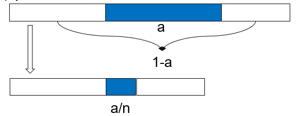

加速之后的执行时间 Tp = To  * （1 – a + a/n）

**例子1**

如果希望在100个处理器上获得90的加速比，请问在原始计算负载中顺序执行部分最多占多少？

> 答：假设可并行执行部分占比为a，根据加速比公式
>
> ​    s = 1 / (1 – a + a/n)
>
> ​    90 = 1 / (1 – a + a/100)
>
> ​    a = 0.999
>
> ​    因此，顺序执行部分最多占0.1%

### **标量v.s 向量**

- 标量处理器一次只能处理一个数据
- 向量处理器能够处理向量型并行计算
  - 如果希望在100个处理器上获得90的加速比，标量在原始程序中的占比要少于0.1%
  - 由Amdahl定律可知，要在100个处理器上获得线性加速比，原始计算不能包含标量

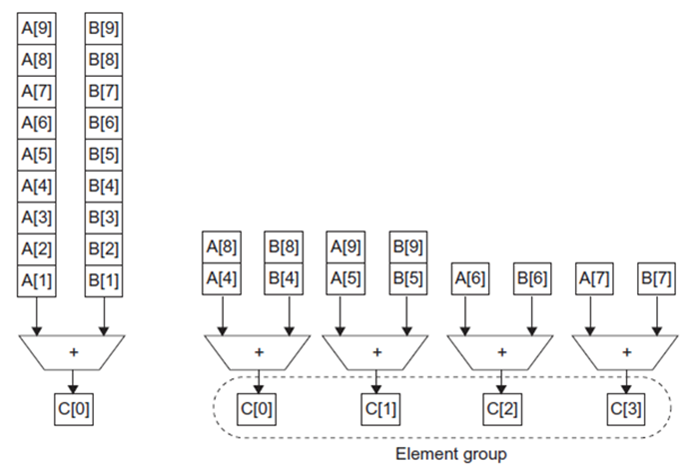

**例子2**

执行两个加法：一个加法是10个标量的求和，另一个加法是一对10×10二维矩阵的求和。假设目前只有矩阵求和可以并行，使用10个和40个处理器达到的加速比分别是多少？

答：

​	10个处理器加速比是110t/20t=5.5

​    40个处理器加速比是110t/12.5t=8.8

> 这里的t是周期的意思，加速比是没加速花费的总时间和加速后的时间之比

# **三.线程级并行**

### **多线程**

继续进行指令级并行（ILP）变得越来越复杂和困难

探索线程级并行（Thread-level parallelism，TLP）

> 多道程序间的TLP（独立运行的串行程序）
>
> 多线程应用的TLP（程序运行采用多线程）

多线程利用线程级并行提高单个处理器的效率

#### **线程例子**

- 浏览器软件
  - 一个线程显示图片
  - 一个线程从网络中检索数据
- 文字处理软件
  - 一个线程显示图形
  - 一个线程读取键盘输入
  - 一个线程进行拼写检查
- web服务器
  - 一个线程接收访问请求
  - 接收到请求后，创建一个线程提供服务
  - 多个线程处理成千上万的用户请求

#### **硬件多线程**

| **硬件多线程**                               |
| -------------------------------------------- |
| 在线程阻塞时处理器可以切换到另一个线程的实现 |

- 通过执行与造成阻塞的指令不相关的指令来隐藏阻塞开销的方法
- 处理器必须为每个线程复制独立的状态
  - 寄存器文件、PC、指令缓存等
- 缓存、TLBs、BHT、BTB等可以共享
- 存储器自身可以通过虚拟存储器机制实现共享
- 硬件必须支持高效的线程切换

| 细粒度多线程（fine-grained multithreading) |
| ------------------------------------------ |
| 每条指令之后都进行线程切换                 |

- 多线程直接交叉执行，交叉以循环方式进行
- 处理器能够在每个时钟周期进行切换
- ☺可同时隐藏由短阻塞和长阻塞引起的吞吐量损失
- ☹降低了单个线程的执行速度

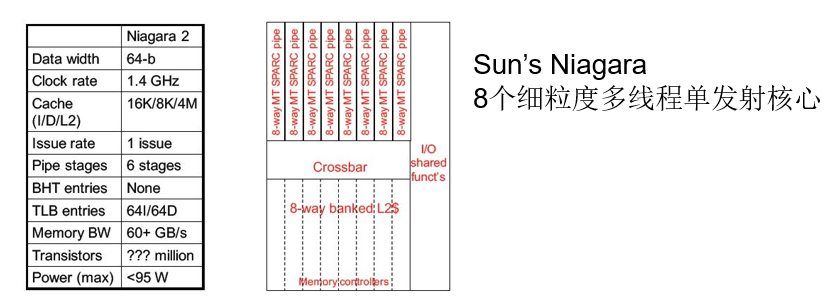

##### Niagara整数流水线

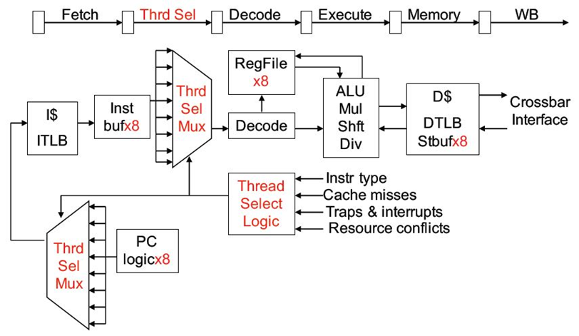

| **粗粒度多线程（coarse-grained **multithreading  |
| ------------------------------------------------ |
| 仅在高开销阻塞时进行线程切换，如最后一级缓存缺失 |

- ☺几乎不会降低单个线程的执行速度
- ☹隐藏吞吐量损失能力受限，特别是短阻塞
- ☹线程切换时，必须清空流水线，并填充流水线
- 适合用来降低高开销阻塞带来的性能损失

#### **同时多线程（SMT）**

| **同时多线程（simultaneous  multithreading，SMT）**          |
| ------------------------------------------------------------ |
| 硬件多线程的变种，使用多发射动态调度流水线处理器的资源来挖掘线程级并行，并同时保持指令级并行 |

- 多发射处理器中通常有单线程难以充分利用的多个并行功能单元
- 借助于寄存器重命名和动态调度，不需要考虑相关性，即可以发射来自不同线程的多条指令
- 每个线程需要单独的重命名表（RUUs），或者需要指明一个表项属于哪个线程
- Intel Pentium 4的SMT称为超线程（hyperthreading）：支持两个线程

#### **4个线程运行在超标量处理器（4路）**

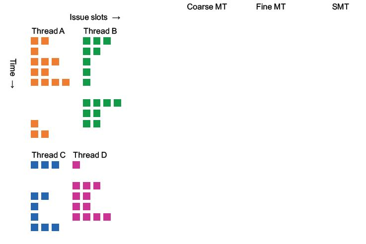

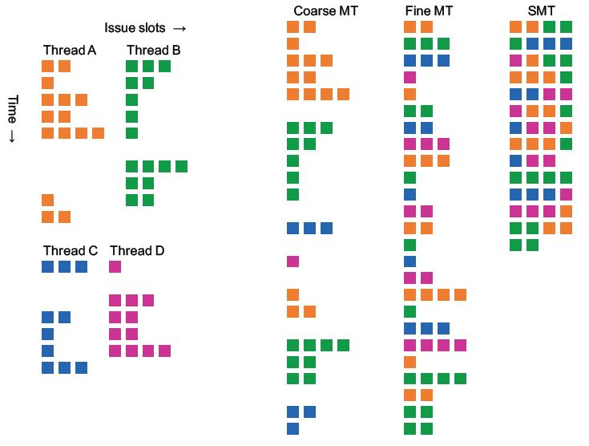

> 粗的就是到高阻塞才调度，细是每条指令，smt是不需要开销的每条指令轮换

# **四.多核**

| **多处理器**               |
| -------------------------- |
| 至少两个处理器的计算机系统 |

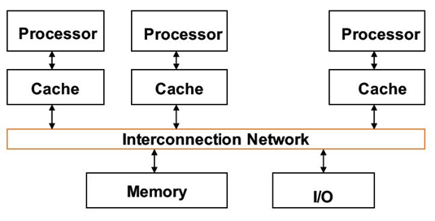

通过任务级并行（task-level parallelism）或进程级并行实现高吞吐量（process-level parallelism）

将单个程序运行在多个处理器上实现性能的提升，并行处理程序（parallel processing program）

### **多核处理器**

- 很多科学问题需要更快速的计算机，可以通过集群（cluster）完成
- 集群：通过局域网连接的一组计算机，其作用等同于一个大型的多处理器
- 例如搜索引擎、web服务器、电子邮件服务器和数据库

| **主要挑战**                                 |
| -------------------------------------------- |
| 如何构建易于正确编写并行处理程序的软硬件系统 |

#### **需要解决的关键问题**

| 1、如何共享数据？            |
| ---------------------------- |
| 多处理器共享一个物理地址空间 |

| 2、如何合作处理任务？                               |
| --------------------------------------------------- |
| 处理器通过存储器中的共享变量进行通信（load、store） |

通过同步机制访问共享数据，最多一个处理器进行访问

| **两种类型**                                      |
| ------------------------------------------------- |
| 统一存储访问（Uniform Memory  Access, UMA）       |
| 非统一存储访问（Non-uniform Memory Access, NUMA） |

#### **简单并行处理程序**

10个处理器求和

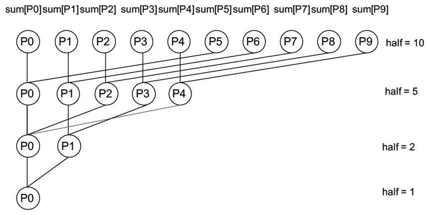

#### **进程同步**

- 通过多进程合作完成一项任务
- 使用锁变量（信号量）实现进程合作与同步，需要架构提供仲裁机制
- 仲裁机制决定哪个处理器获得锁变量的访问权
- 单总线提供仲裁机制，只能通过单总线访问存储器
- 处理器获得总线，共享数据需要加锁，可以通过原子交换实现

#### **自旋锁同步**

一个处理器成功获得锁变量表示成功将1写入锁变量，其他处理器获得返回值0

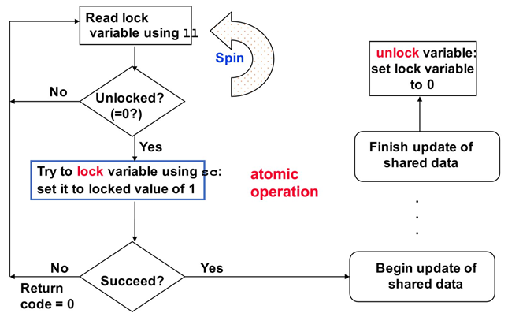

**例子**

假设对100000个数字进行求和，运行在100个处理器上

```
sum[Pn] = 0;
for (i = 1000*Pn; i<1000*(Pn+1); i = i + 1)
	sum[Pn] = sum[Pn] + A[i];
Repeat
   synch(); //synchronize first 
   if (half%2 != 0 && Pn == 0) { 
        sum[0] = sum[0] + sum[half-1]; 
   } 
   half = half/2 
   if (Pn<half) { 
        sum[Pn] = sum[Pn] + sum[Pn+half] 
   } 
until (half == 1); //final sum in sum[0]

```

#### **Synch()例子**

Synch()：生产者-消费者模型下，消费者处理器在提取数据之前必须先同步

路障同步（Barrier）：处理器需要在路障处等待，直到满足条件

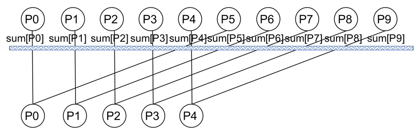

#### **自旋锁实现路障**

arrive、depart是自旋锁，arrive初始化未锁定，depart初始化锁定

```
procedure synch() { 
    lock(arrive); 
    count = count + 1; // count the processors as
    if (count < n) { // they arrive at barrier 
           unlock(arrive) 
    } else {
           unlock(depart);
    } 
    lock(depart); 
    count = count - 1; // count the processors as 
    if (count > 0) { // they leave barrier 
          unlock(depart) 
    } else { 
          unlock(arrive); 
    }
}
```

### **消息传递多核处理器（MPP）**

| 1、如何共享数据？                    |
| ------------------------------------ |
| 多处理器通过相互传递消息实现数据共享 |

| 2、如何合作处理任务？                         |
| --------------------------------------------- |
| 通过消息传递（send和receive）实现处理器间合作 |

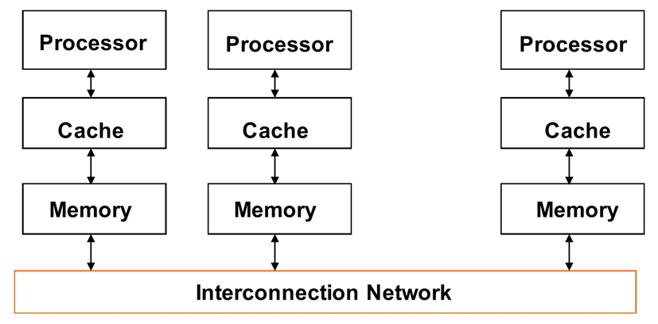

**例子**

给每个处理器分配1000个数据进行求和

```
Sum = 0;
for (i = 0; i<1000; i = i + 1)
	sum = sum + A[i];
//将所有处理器计算结果相加 ，send(x,y)将数据y发送给处理器x

half = 100; l
imit = 100; 
repeat { 
    half = (half+1)/2; //dividing line 
    if (Pn>= half && Pn<limit) send(Pn-half,sum);
    if (Pn<(limit/2)) sum = sum + receive(); 
    limit = half; 
} until (half == 1); //final sum in P0’s sum

```

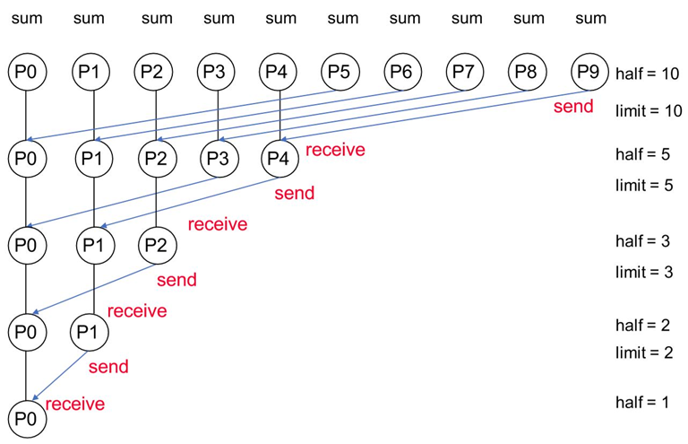

# **五.小结**

多核处理器基础

1. 如何共享数据？
2. 如何合作处理任务？
3. 架构的可扩展性如何？

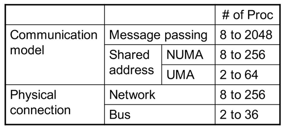