# **计算机组成与实践** -指令集体系结构（ISA）

## ֍**ISA**简介

### 什么是指令集体系结构（ISA）？

| **指令（Instruction）**          |
| -------------------------------- |
| 计算机语言中的基本单词称为指令。 |

| **指令集（Instruction Set）**              |
| ------------------------------------------ |
| 一台计算机的全部指令称为该计算机的指令集。 |

| **指令集体系结构（Instruction Set Architecture）**           |
| ------------------------------------------------------------ |
| 硬件和底层软件之间的接口，被命名为计算机的**指令集体系结构（ISA）**或简称**体系结构** |

### **CISC vs. RISC**(貌似在各个课程里出现频率很高)

**CISC**

🔷复杂指令集计算机(Complex Instruction Set Computers)

🔷指令数量多，使用频率差别大，可变长格式，支持多种寻址方式

🔷例如：Intel x86

**RISC**

🔷精简指令集计算机(Reduced Instruction Set Computers)

🔷指令数量少，使用频率接近，定长格式，大部分为单周期指令，寻址方式支持较少，通用寄存器，Load/Store体系结构

🔷例如：MIPS、ARM、RISC-V

### **汇编语言指令**

| **机器语言（machine language）**                             |
| ------------------------------------------------------------ |
| 计算机直接识别的二进制代码，或指不经翻译即可为机器直接理解和接受的程序语言或指令代码。 |

**机器语言：**

🔷设计能够方便简单搭建硬件的ISA

🔷编译器能够最优化性能和开销

MIPS：

🔷采取精简指令集（RISC）的处理器架构

🔷与其他ISA类似，最早由斯坦福大学开发

🔷MIPS32、MIPS64、microMIPS、nanoMIPS架构

### **计算机设计原则**

两个设计原则：

1、**指令**用**数**的形式表示

🔷00000000 10000010 00010000 00100000

🔷指令：**add** $2, $4, $2

🔷数字：00 82 10 2016

2、**程序**和**数据**都存入存储器中，并可以读写

🔷程序在计算机中以二进制文件的形式存储——二进制兼容性。

🔷计算机可以运行各种程序，二进制兼容使编译好的程序可以在不同计算机上运行。

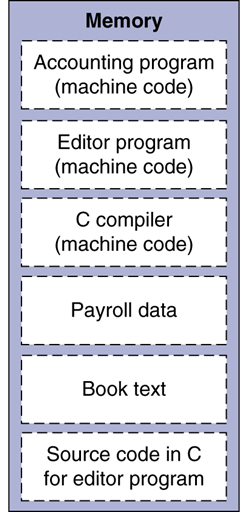

| **存储程序概念（Stored-Program Concept）**                   |
| ------------------------------------------------------------ |
| 多种类型的指令和数据均以数字形式存储于存储器中的概念，存储程序型计算机即源于此。 |

### **MIPS指令集**

**指令类别：**

- 算术指令
- 逻辑运算指令
- 数据传送指令
- 跳转和分支指令
- 特殊指令

**寄存器：**

- R0-R31
- PC
- HI
- LO

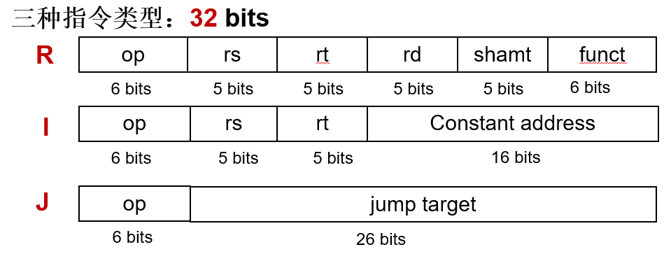

MIPS各种指令类型在SPEC2006中使用的频率

| **指令类型** | **频率**   |      |
| ------------ | ---------- | ---- |
| **整数型**   | **浮点型** |      |
| 算术         | 16%        | 48%  |
| 数据传送     | 35%        | 36%  |
| 逻辑         | 12%        | 4%   |
| 分支         | 34%        | 8%   |
| 跳转         | 2%         | 0%   |

### **MIPS寄存器组**

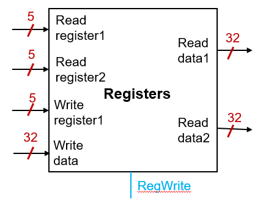

- 32个32 bits的寄存器
- 5个输入端口：
- 3个寄存器选择
- 1个数据输入
- 1个控制
- 2个输出端口

> | **编号** | **名称** | **用途**                  |
> | -------- | -------- | ------------------------- |
> | $0       | $zero    | 常量0                     |
> | $1       | $at      | 保留给汇编器              |
> | $2-$3    | $v0-$v1  | 函数调用返回值            |
> | $4-$7    | $a0-$a3  | 函数调用参数              |
> | $8-$15   | $t0-$t7  | 暂时的                    |
> | $16-$23  | $s0-$s7  | 保存的                    |
> | $24-$25  | $t8-$t9  | 暂时的                    |
> | $26-$27  | $k0-$k1  | 为操作系统／异常处理保留  |
> | $28      | $gp      | 全局指针(Global  Pointer) |
> | $29      | $sp      | 堆栈指针(Stack  Pointer)  |
> | $30      | $fp      | 帧指针(Frame  Pointer)    |
> | $31      | $ra      | 返回地址(return  address) |

访问速度比内存快：

- 存储频繁访问的数据
- 存储空间小，内存有百万个字
- 64个寄存器比32个寄存器慢一倍

方便编译程序访问：

- 相较于栈，寄存器组支持随机访问
- 有效利用寄存器对于提高程序性能极为重要

### **MIPS指令字段**

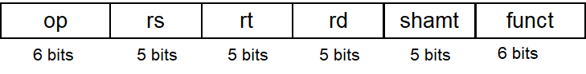

- op ：指令的基本操作， 通常称为操作码（ opcode ） 
- rs ：第一个源操作数寄存器
- rt ：第二个源操作数寄存器
- rd ：用于存放操作结果的目的寄存器
- shamt ：位移量
- funct：功能码，用于指明op字段中操作的特定变式

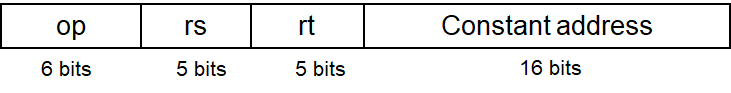

- op ：指令的基本操作， 通常称为操作码（ opcode ） 
- rs ：源操作数寄存器
- rt ：目的操作数寄存器
- Constant address：常数或地址

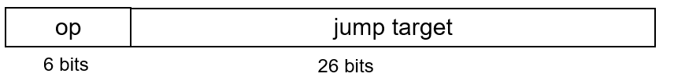

- op ：指令的基本操作， 通常称为操作码（ opcode ） 
- jump target：跳转的目的地址

### **MIPS的设计原则**

| **设计目标**                               |
| ------------------------------------------ |
| 最优性能、最小开销、减少设计时间、最小能耗 |

**设计原则1：简单源于规整**

- 规整的指令格式可以简化硬件设计，使计算高性能低功耗
- 指令格式少
- 前6位为操作码

**设计原则2：越小越快**

- 指令数量少
- 寄存器数量较少

**设计原则3：加速大概率事件**

- 操作数来自寄存器
- 允许立即数作为操作数

**设计原则4：优秀的设计需要适宜的折中方案**

- 三种指令格式

## **֍算术与逻辑运算指令**

### **MIPS算术指令**

```
add $t0, $s1, $s2

sub $t0, $s1, $s2
```

- 每条MIPS指令仅执行**1**个操作（加、减等）
- 每条算术指令有**3**个操作数（$t0, $s1, $s2） ，2个源操作数（ $s1, $s2）和1个目的操作数（$t0）
- 3个操作数来自**寄存器组**
- 采用**R型**指令格式，shamt字段没使用

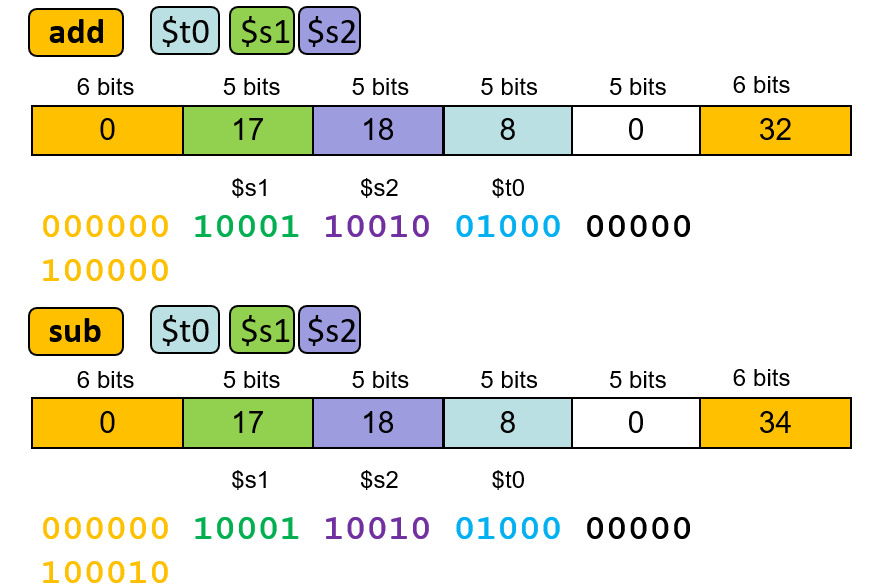

### **常数或立即数操作数**

超过一半MIPS 算术运算指令用常数作为操作数

- 提供其中一个操作数是常数的算术指令

  ```
  addi $s3, $s3, 4
  ```

- 采用**I型**指令格式

  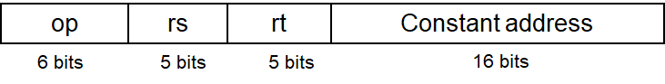

- **常数存在指令中**

- 指令格式限制数值范围：-2^15到2^15-1

### **I型指令格式**

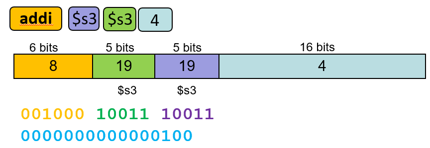

### **MIPS的逻辑运算**

其他按位操作的逻辑运算指令

| **R型指令格式**                                     |
| --------------------------------------------------- |
| **and**  $t0, $t1, $t2       #$t0=$t1 & $t2         |
| **or** $t0, $t1, $t2            #$t0=$t1  \|$2      |
| **nor**  $t0, $t1, $t2         #$t0=not($t1  \|$t2) |

| **I型指令格式**                                  |
| :----------------------------------------------- |
| **andi** $t0,  $t1, 0xFF00     #$t0=$t1 & ff00   |
| **ori**   $t0, $t1, 0xFF00       #$t0=$t1 \|ff00 |

### **与（AND）操作**

将源操作数中的某些位置0，称为**掩码**（mask）

选取某些位，将其他位置0

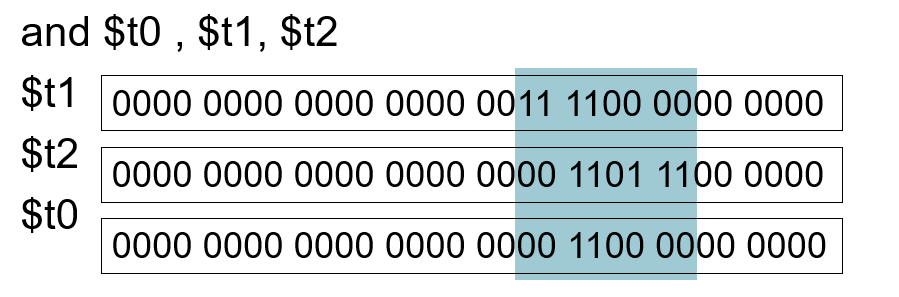

### **或（OR）操作**

两个操作位中任意一位为1 时结果就为1

将一些位置为1，其他位不变

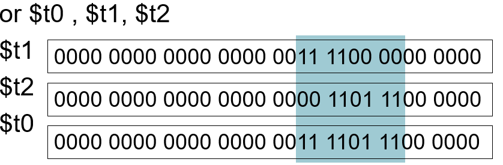

### **或非（NOR）操作**

按位先或操作后非操作

将一些位置为1

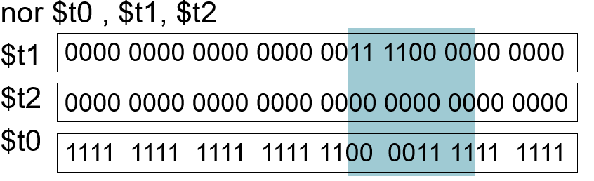

MIPS引入或非指令（nor）取代按位取反（not）

> **设计原则1：简单源于规整**

### **如何使用大常数？**


常数数值范围：-2^31~2^31-1

- 将32 bits常量取入寄存器
- 使用两条指令：lui和ori

1、取立即数到寄存器高16位指令

```
    lui  $t0, 1010101010101010
```

2、与立即数进行逻辑“或”运算

```
    ori  $t0, $t0, 1010101010101010
```

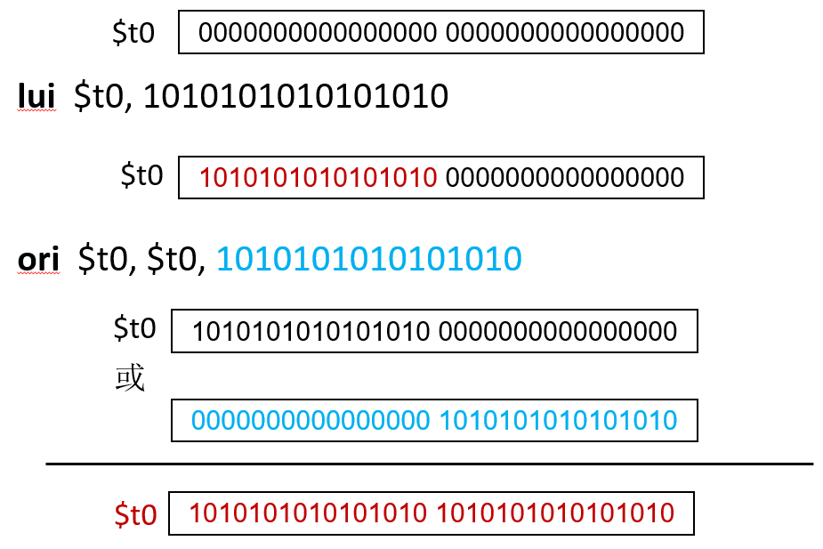

### **无符号二进制数**

基本二进制表示方式

- n  bits数的表示

  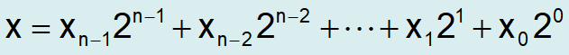

- 取值范围：0到2^n – 1

- 例子：

  0000 0000 0000 0000 0000 0000 0000 10112
   = 0 + … + 1×2^3 + 0×2^2 +1×2^1 +1×2^0
   = 0 + … + 8 + 0 + 2 + 1 = 11(下标10)

- 32 bits无符号数的数值范围是0 to 2^32-1

### **有符号二进制数：二进制补码**

最高有效位为0表示正数，为1表示负数

n bits数的表示

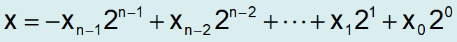

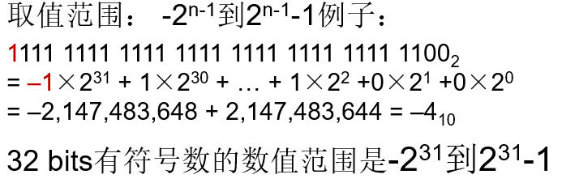

### **有符号数取反**

🔷按位取反，再加1

🔷按位取反：1->0, 0->1

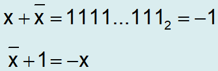

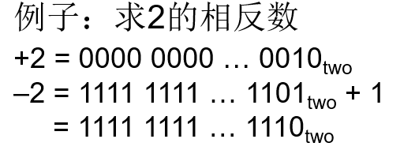

### **符号扩展**

🔷将一个用n 位表示的二进制数转化成一个用多于n 位表示的数

- 保持数值不变

🔷复制最高有效位（符号位）

- 无符号数：用0填充左边的数位
- 有符号数：用1填充左边的数位

🔷例子：8 bits数扩展为16 bits数

- +2: 0000 0010 => 0000 0000 0000 0010
- –2: 1111 1110 => 1111 1111 1111 1110

### **逻辑操作**

按位操作的指令

| 逻辑操作 | C    | Java | MIPS      |
| -------- | ---- | ---- | --------- |
| 左移     | <<   | <<   | sll       |
| 右移     | >>   | >>>  | srl       |
| 按位与   | &    | &    | and, andi |
| 按位或   | \|   | \|   | or，ori   |
| 按位取反 | ~    | ~    | nor       |

用于简化对字中若干位进行打包或者拆分操作，称为逻辑操作（logical operations）

### **MIPS移位操作**

🔷按位操作的指令

🔷将所有位向左或者向右移位

```
    sll $t2, $s0, 4
    srl $t2, $s0, 4
```

- 逻辑左移sll：所有位所有位向左移动，空位用0填充
- 逻辑右移srl：所有位向右移动，空位用0填充
- 采用**R**型指令格式, rs字段没使用

### **R型指令格式**

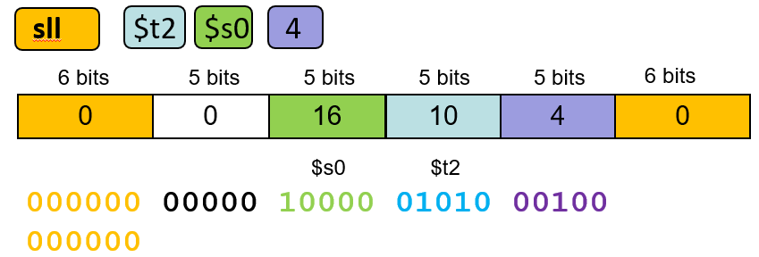

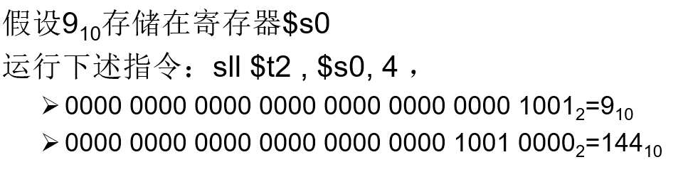


### **算术与逻辑运算指令总结**

| **指令** | **格式** | **op** | **rs** | **rt** | **rd** | **shamt** | **funct** | **addr** |
| -------- | -------- | ------ | ------ | ------ | ------ | --------- | --------- | -------- |
| add      | R        | 0      | reg    | reg    | reg    | 0         | 32        | n.a.     |
| sub      | R        | 0      | reg    | reg    | reg    | 0         | 34        | n.a.     |
| addi     | I        | 8      | reg    | reg    | n.a.   | n.a.      | n.a.      | 常数     |
| and      | R        | 0      | reg    | reg    | reg    | 0         | 36        | n.a.     |
| or       | R        | 0      | reg    | reg    | reg    | 0         | 37        | n.a.     |
| xor      | R        | 0      | reg    | reg    | reg    | 0         | 38        | n.a.     |
| nor      | R        | 0      | reg    | reg    | reg    | 0         | 39        | n.a.     |
| sll      | R        | 0      | 0      | reg    | reg    | 常数      | 0         | n.a.     |
| srl      | R        | 0      | 0      | reg    | reg    | 常数      | 2         | n.a.     |
| andi     | I        | 12     | reg    | reg    | n.a.   | n.a.      | n.a.      | 常数     |
| ori      | I        | 13     | reg    | reg    | n.a.   | n.a.      | n.a.      | 常数     |

## ֍**数据传输指令**

### **MIPS的数据传输指令**

为了进行算术运算

- 将数据从存储器读入寄存器
- 将计算结果从寄存器写回存储器
- 数据传送指令（ data transfer instruction ） ：访问存储器的指令
- 存储器地址是32 bits，值为基址寄存器$s3的内容加上偏移量4

### **存储器地址**

数据传送指令中的常量称为偏移量（ offset ）

存放基址的寄存器称为基址寄存器（ base register ）

MIPS 是按字节编址的，字的起始地址必须是4 的倍数（32-bit）或者8的倍数（64-bit）

(四位或者八位对齐)

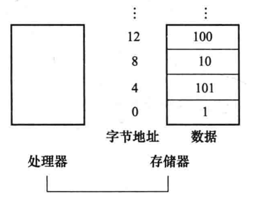

### **取字指令**

取字和存字指令都采用**I**型指令格式


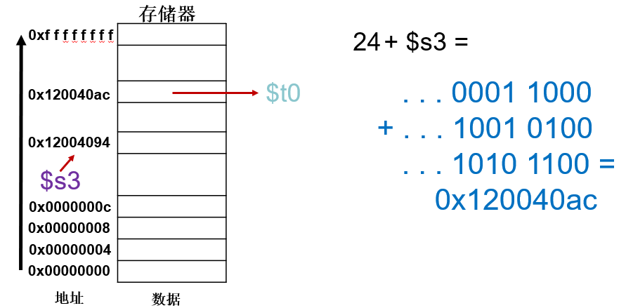

### **字节寻址**

- 存储器中可以访问的最小单元是字节(8 bits)

- 一个字中的每个字节都应有自己的地址

- 字节地址与字地址的对应关系

- 大端编址(big-endian)：最**左**边的字节为字地址
  - IBM 360/370, MIPS, Sparc, HP PA
- 小端编址(little-endian)：最**右**边的字节为字地址
  - Intel 80x86, DEC Vax, DEC Alpha

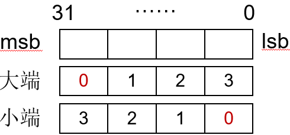

**访问字节**

| MIPS提供访问单个字节的指令                          |
| --------------------------------------------------- |
| **lb**   $t0, 1($s3) #将存储器中的字节取入寄存器$t0 |
| **sb**   $t0, 6($s3) #将寄存器$t0存入存器中的字节   |

lb：将字节存入寄存器的最低8 bits   (load byte)

sb：将寄存器最低8 bits存入存储器的字节中 (store byte)

> 测试：
>
> 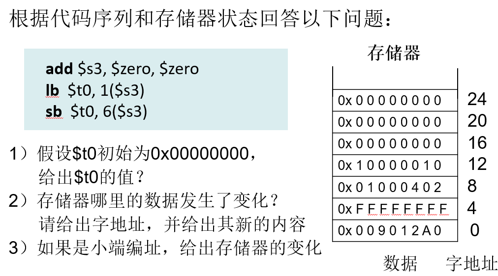
>
> 第一步，add指令使得s3中存放0，第二步s3+1的位置就是  90 （大端法以最左侧作为起始地址），t0被赋值0x00000090.
>
> 第三步，存出to到s3+6位置，即标号4块变为0xFFFF90FF.
>
> 如果是小端就改为0xFF12FFFF


## ֍**决策指令**

### **MIPS决策指令**

| **MIPS条件分支指令**                                         |
| ------------------------------------------------------------ |
| **bne**   $s0,  $s1, L1          #如果$s0!=$s1,跳转到L1所指的指令      （n=negative)(e=equal) |
| **beq**   $s0,  $s1, L1          #如果$s0=$s1,跳转到L1所指的指令 |

> ​       **if** (i==j) h = i + j;
>
> ​    **bne** $s0, $s1, L1 
>
> ​    **add** $s3, $s0, $s1 
>
>    	**L1**：…

- 条件分支语句：如果条件为真，则跳转到标签所指的语句执行；否则，顺序执行
- 采用I型指令格式

**分支目的地址**

使用程序计数器（PC）和指令中的16 bits偏移量计算

提取一条指令后，PC自动加4，保存下一条指令的地址

限制了分支目的地址：分支指令地址-2^15到+2^15-1

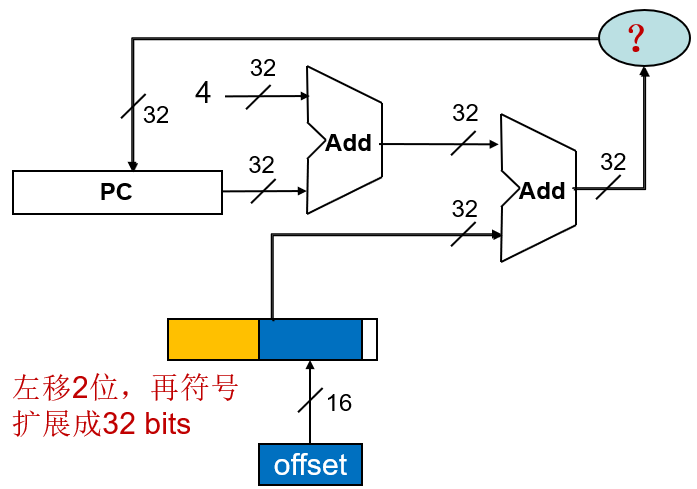

if (i<j) h = i + j

**小于则置位（set on less than）**：slt

>   **slt** $t0, $s0, $s1 #如果$s0<$s1,则$t0=1；
>
> ​           \#否则$t0=0

🔷采用R型指令格式

| **slt的其他形式**                              |
| ---------------------------------------------- |
| **slti**   $t0,  $s0, 25 #如果$s0<25,则$t0=1   |
| **sltu**   $t0,  $s0, $s1 #如果$s0<$s1,则$t0=1 |
| **sltiu** $t0,  $s0, 25 #如果$s0<25,则$t0=1    |

通过slt，beq，bne和寄存器$zero组合来创建其他决策指令

- 小于则分支：blt $s1, $s2, L1

  > **slt** $at, $s1, $s2         #如果$s1<$s2,则$at=1
  >
  >  **bne** $at, $zero, L1   #如果$at!=0,则跳转到L1

- 小于或等于则分支：ble $s1, $s2, L1

- 大于则分支：bgt $s1, $s2, L1

- 大于或等于则分支：bge $s1, $s2, L1

这些指令以伪指令的形式包含在指令集中——编译器可以识别

### **边界检查的简单方法**

- 检查数组下标越界的简单方法: 0≤i<n

  > $s0 = 1111 1111 1111 1111 1111 1111 1111 1111
  >
  > $s1 = 0000 0000 0000 0000 0000 0000 0000 0001

- 作为有符号比较

  > **slt** $t0, $s0, $s1 

  -  $t0=1

- 作为无符号比较

  > **sltu** $t0, $s0, $s1 

  -  $t1=0

- 无符号比较x<y，同时可以检测x是否为负数

  > **sltu** $t0, $s0, $s1
  >
  >  **beq** $t0, $zero,IndexOutOfBounds

### **无条件分支指令**

MIPS还提供无条件分支指令或无条件跳转指令

> **j** L1  #跳到标签L1所指的指令

采用J型指令形式（理所当然的jump）

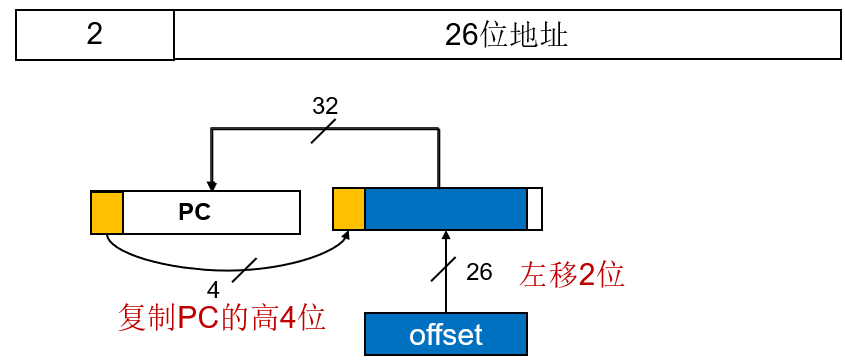

> 测试：重新改写下面的指令，以支持更远距离的分支转移
>
> **beq** $s0, $s1, L1
>
> 更改为J型指令
>
> bne $s0, $s1, L2
>
> J					 L1
>
> L2:
>
> .....


## ֍**过程指令**

### **过程（或程序）调用**

过程运行中，程序必须遵从以下6个步骤：

1. 将参数放在过程可以访问的位置（$a0~$a3）
2. 将控制转交给过程
3. 获得过程所需的存储资源
4. 执行需要的任务
5. 将结果的值放在调用程序可以访问的位置（$v0-$v1）
6. 将控制返回初始点（$ra）

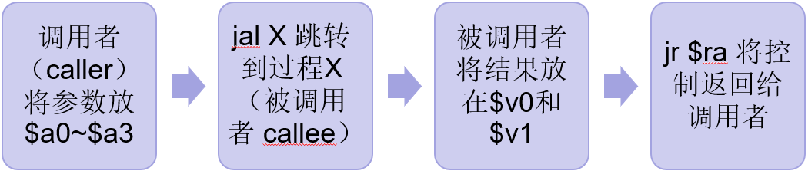

跳转和链接指令（jump-and-link instruction）

> **jal** address      # $ra=pc+4, 跳转到address

- 将PC+4存入寄存器$ra，链接函数返回后执行的指令地址
- 采用J型指令格式

寄存器跳转指令（jump register）

> **jr** $ra     # #跳转到寄存器$ra所指的地址

采用R型指令格式

| **程序调用例子** |
| ---------------- |
| jal  gcd         |
| gcd：…           |
| jr    $ra        |

### **使用更多寄存器**

被调用者（callee）运行可能使用更多寄存器

调用者（ caller）所使用的寄存器必须恢复，需要将寄存器换出到存储器

使用栈（stack）：一种后进先出的数据结构

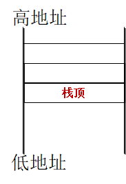

$sp($29)：保存栈顶的地址

压栈(push)：向栈增加数据

```
$sp = $sp - 4
```

出栈(pop)：从栈中移除数据

```
$sp= $sp+ 4
```


### **在栈中为新数据分配空间**

🔷栈中包含过程所保存的寄存器和局部变量的片段称为过程帧（ procedure frame ）或活动记录（ activation record ）

🔷$fp是帧指针，指向一个过程帧的第一个字——$fp通常作为过程中数据的基址寄存器

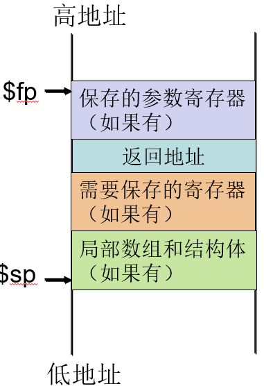

### **在堆中为数据分配空间**

- 用户代码段
- 静态数据：全局变量
  -  例如C语言中的静态变量，常数数组与字符串等
- 动态数据：堆
  -  例如，C中malloc命令分配，Java中new命令来分配
- 栈：
  -  例如局部的数组或结构体

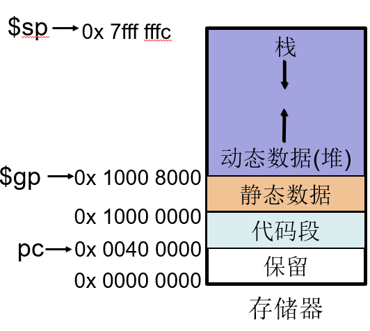

### **编译C语言：leaf过程**

C语言代码：

```
int leaf_example (int g, int h, int i, int j)

{   int f;

   f = (g + h) – (i + j);

   return f;

}
```

| 假设g, h, i, j 放在寄存器$a0,  $a1, $a2, $a3              |
| --------------------------------------------------------- |
| leaf_example： **addi**    $sp,  $sp,  -8 #在栈中分配空间 |
| **sw**   $t1, 4($sp)   #保存寄存器                        |
| **sw**   $t0, 0($sp)                                      |
| **add**    $t0, $a0, $a1                                  |
| add  $t1, $a2, $a3                                        |
| **sub**   $v0, $t0, $t1                                   |
| **lw**   $t0, 0($sp)   #恢复寄存器                        |
| **lw**   $t1, 4($sp)                                      |
| **addi**  $sp, $sp, 8                                     |
| **jr**   $ra   #跳转到caller                              |

### **嵌套过程**

- 嵌套过程：执行中调用其他过程的过程
- 递归过程：是调用自身的嵌套过程

```
int fact( int n)
       
{   if (n<1)  return  (1);
    else  return (n * fact(n-1));
}
```

> fact (0) = 1
>
> fact (1) = 1 * 1= 1
>
> fact (2) = 2 * 1 * 1 = 2
>
> fact (3) = 3 * 2 * 1 * 1 = 6
>
> .  .  .
>
> ------
>
> 假设参数n保存在$a0，返回值保存在$v0
>
> fact：
>
> ​		**addi**  $sp, $sp, -8   #在栈中保存$ra和$a0
>
> ​		**sw**   $ra, 4($sp)
>
> ​		**sw**   $a0, 0($sp)
>
> ​		**slti**  $t0, $a0, 1   #测试n<1?
>
> ​		**beq**   $t0, $zero, L1
>
> ​		**addi**  $v0, $zero, 1  #将1置入$v0
>
> ​		**addi**   $sp, $sp, 8
>
> ​		**jr**    $ra       #返回到caller
>
> L1:  
>
> ​		**addi**  $a0, $a0, -1   #如果n>=1，参数n-1
>
> ​		**jal**   fact       #调用fact并link
>
> 
>
> bk_f: 
>
> ​		**lw**   $a0, 0($sp)   #在栈中弹出$ra和$a0，恢复旧值
>
> ​		**lw**    $ra, 4($sp)
>
> ​		**addi**   $sp, $sp, 8
>
> ​		**mul**   $v0, $a0, $v0
>
> ​		**jr**    $ra       #返回到caller
>
> ------
>
> 当fact返回之后执行bk_f代码段

## ֍**其他**

### **并行与指令：同步**

- 需要硬件支持多任务并行时的同步（synchronize），否则会产生数据竞争（data race）

- 数据竞争：假如来自不同线程的两个连续的访存请求访问同一个地址，并且至少其中一个是写操作，那么这两个存储访问形成数据竞争

  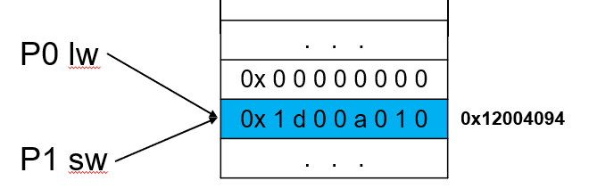

- 采用加锁和解锁创立一个仅允许单个处理器操作的区域，称为互斥（mutual exclusion）区

### **原子交换（atomic exchange）**

类似操作系统互斥的原子操作

- 原子交换：对一个寄存器中的值和一个存储器中的值进行原子的交换，交换操作当成一条指令执行
- 实现原子交换需要一次存储器读和一次存储器写，并且是不可分割的
- 一种可行的方法是采用指对，第二条指令返回一个表明这对指令是否原子执行的标志值MIPS处理器采用ll指令和sc指令

```
ll  $t1, 0($s1)  #链接取数(load linked)
sc  $t0, 0($s1)  #条件存数(store conditional)
```

### **ll指令和sc指令**

```
again：addi  $t0, $zero, $s4   #$t0=$s4(交换的值)
    ll    $t1, 0($s1)       #将存储器的值取入$t1
    sc    $t0, 0($s1)       #尝试将值保存到存储器
                            #如果失败，$t0=0
    beq   $t0, $zero, again #如果失败继续尝试交换
    add   $s4, $zero, $t1   #将值存入$s4,完成交换
```

- ll指令：取数并保存ll指令的执行与读取的地址0($s1)
- sc指令：检查是否有其他指令在ll指令之后对地址0($s1)进行操作，如果没有，$t0的值存入存储器，并将$t0置为1；如果有， $t0的值不存入，并将$t0置为0，表示操作失败

### **C程序翻译并执行程序**

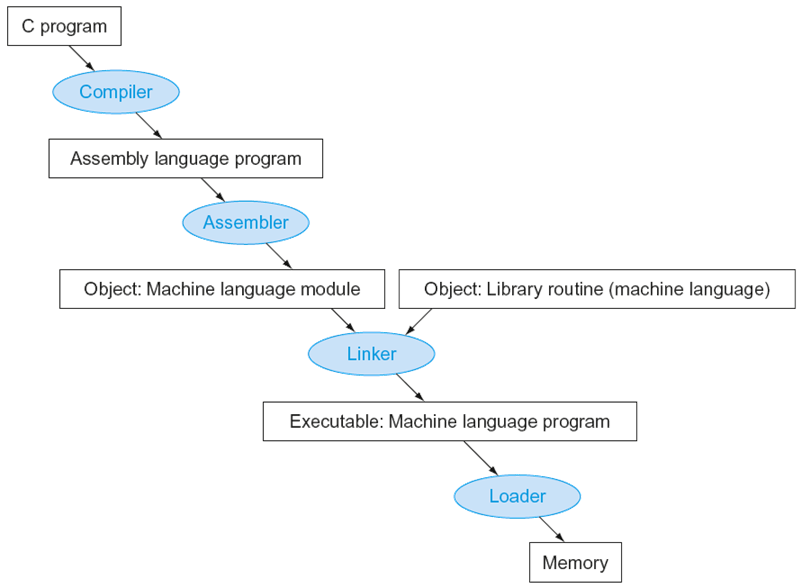


## ֍**小结**

### **MIPS寻址模式总结**

**1.立即数寻址**

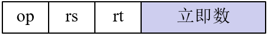

**2.寄存器寻址**

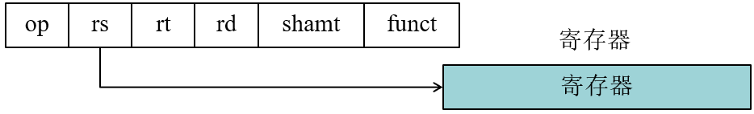

**3.基址寻址**

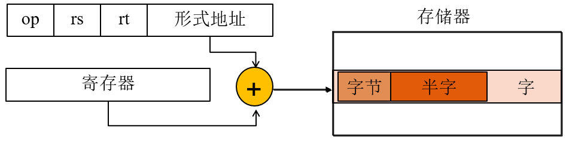

**4.PC相对寻址**

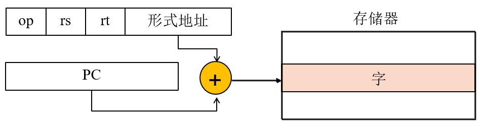

**5.伪直接寻址**

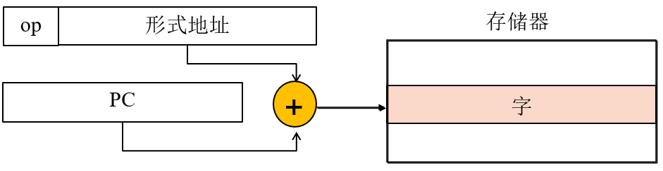

### **小结**

- **设计原则**
  -  简单源于规整
  -  越小越快
  -  加速大概率事件
  -  优秀的设计需要适宜的折中方案
- **软/硬件层**
  -  汇编器、编译器、硬件
- **MIPS指令体系结构核心指令及指令格式**
  -  R型、I型、J型