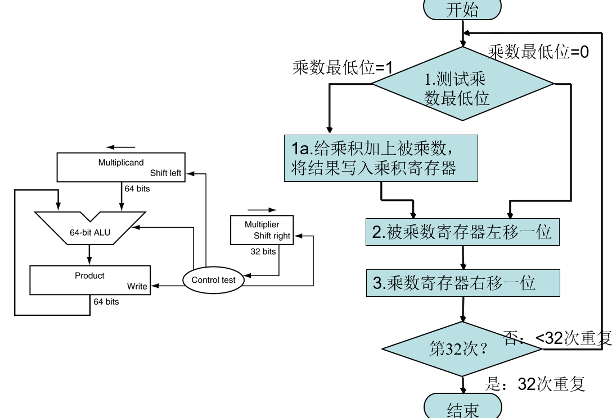

# **计算机组成与实践** -算术和逻辑单元（ALU）

## 一.概述

MIPS指令集：add、sub、and、or……

ALU的实现


#### **设计MIPS的ALU**

必须支持MIPS指令集中的算术与逻辑操作

- 加减指令：add、addi、addiu、sub、subu等
- 乘除指令：mult、multu、div、divu、sqrt
- 逻辑运算指令：and、andi、nor、or、ori、xor
- 分支指令：beq、bne、slt、slti、sltiu、sltu

以及一些指令所需的特殊处理：

- 符号扩展：addi、addiu、slti、sltiu
- 零扩展：andi、ori、xori
- 溢出检测：add、addi、sub

#### **MIPS算术与逻辑指令**


## 二.加法

#### 加法

7+6


Ø如果结果超过32位将产生溢出

- 正数和负数相加->不产生溢出
- 两个正数相加
  - 如果结果的符号位为1，则产生了溢出

- 两个负数相加
  - 如果结果的符号位为0，则产生了溢出

#### **1位全加器**

Ø输入端：两个加数、进位输入

Ø输出端：和、进位输出


> S = A xor B xor Cin
>
> Cout = (A and B) or (A and Cin) or (B andCin)

**如何用1位全加器构建32-bit全加器？**

：串联32个1位全加器

#### **32-bit全加器**


- 将低位的Cout连接到相邻高位的Cin就可以构建32-bit全加器
- 串行加法器或行波进位加法器（Ripple Carry Adder, RCA）
  - ​	🙂:逻辑简单，低开销
  - ​	☹：速度慢
- n-bit串行加法器的性能
  - ​     *n* × *CP*

#### **快速加法：超前进位**

关键是提高高阶进位的速度

Cout = (A and B) or (A and Cin) or (B andCin)

Cout = AB+ACin+BCin= AB+(A+B)Cin


- 进位生成因子（gi）： aibi
- 进位传递因子（ pi ）： (ai+bi) 

ci+1 = aibi+ (ai+bi) ci=gi+ pi ci

##### **超前进位**

**超前进位加法器（carry-lookahead adder）**


如果之前的加法器生成了一个进位，并且所有的中间传递因子传输了这个进位，那么ci+1 =1


##### 4位并行加法器

根据超前进位设计并行加法器


#### **多位并行进位加法器**


**Quiz1-进位传输函数和进位产生函数**

- 确定两个16 位数的gi、pi、Pi以及Gi值：

​	a: 0001 1010 0011 0011--2

​	b: 1110 0101 1110 1011--2

- CarryOut15(C4)的值是多少

> 第一题gi，和pi可以直接对应下来计算得出
>
> a: 0001 1010 0011 0011
>
> b: 1110 0101 1110 1011
>
> ------
>
> g: 0000 0000 0010 0011
>
> p:1111 1111 1111 1011
>
> |      | 3    | 2    | 1    | 0    |
> | ---- | ---- | ---- | ---- | ---- |
> | Pi   | 1    | 1    | 1    | 0    |
> | Gi   | 0    | 0    | 1    | 0    |
>
> 第二题，带入
>
> C4=0+0+1+0=1

**Quiz2-加法器的性能比较**

行波进位加法器和超前进位加法器速度的比较.

假设通过每个与门/或门需要的时间是相同的。比较16 位加法器路径上门延迟的数量，一个用行波进位，另一个用的是两级的超前进位。（1位全加器的每个进位输出信号需要2个门延迟）

> 行波进位加法器指的将16个1位加法器串联，每个全加器，执行加法的同时执行
>
> S = A xor B xor Cin
>
> Cout = (A and B) or (A and Cin) or (B andCin) 对于这个进位信号，有两种不同的门运算（与和或），门延迟为2，由于串行每一位加法器都需要等待后一个的进位信号，因此从最低进位道最高进位，总门延迟为16*2=32个门延迟
>
> 超前进位加法器最高位输出是上一题的C4,由于两级超前进位，每一级内的操作都是并行的，第一步计算小p,小g，都只有一个与或门运算，因此门延迟为1.第二级计算大P,门延迟1，计算大G门延迟2，因此第二级总的门延迟为2(P/G的运算也是并行的).最后计算C4时的门延迟为2。整体最坏的门延迟是5（假设每个逻辑运算都是一个门延迟）.

### **减法**

看作加法的第二个操作数为负数


#### **减法器设计**

设计思想：X – Y = X + (-Y)

- ​	每个bit位取反


- ​	最低位加1


> 感觉是取模得到最高位（符号位）然后再按不同的方法处理

#### **溢出检测**

如果结果超过32位将产生溢出

- 两个正数或两个负数相减，不产生溢出
- 当正数加正数：结果符号位为1则溢出
- 当负数加负数：结果符号位为0则溢出


- 最高有效位的进位输入与进位输出异或 

> V=Cin ⊕ Cout 


- 无符号整数的溢出可以忽略
- 溢出时产生异常
  - 加法add、立即数加法addi 和减法sub
- 溢出时不产生异常
  - 无符号加法addu、立即数无符号加法addiu 和无符号减法subu
- C语言忽略溢出，C编译器采用无符号算术指令

### **ALU需要支持的其他操作**

- 逻辑操作（and, or, xor, nor）
  - 按位操作，不涉及进位
  - 每个功能需要一个逻辑门，多选器选择输出结果
- 小于则置位指令（slt）
  - 使用减法判断a-b是否小于0
- 条件分支指令的相等测试（bne，beq）
  - 使用减法判断a-b是否等于0
- 立即数指令
  - ALU外设置符号扩展

#### **支持逻辑操作的ALU单元设计**


#### **实现slt**

- 首先进行减法
  - 如果减法结果为负数（最高有效位结果为1），将result置为1
  - 如果减法结果为正数（最高有效位结果为0），将result置为0
- 将最高有效位（set）连接到最低位的less输入


#### **一个简单完整的ALU**


## 三.乘法和除法

### **乘法**

通过移位与加法实现


积的位数是被乘数与乘数的位数之和

#### **乘法的硬件实现(第一版)**


硬件：



#### **改进后的乘法器**

同时进行加法和移位


每一步只需要一个时钟周期

​	乘法运算频率较低时

##### 例子-1


##### **更快速的乘法**


##### **更快速的乘法器设计**


##### **n×n乘法阵列**


#### **MIPS中的乘法指令**

乘法mult和无符号乘法multu

```
    mult $s0, $s1    # hi||lo = $s0 * $s1
```


一对容纳64位乘积的寄存器：$hi和$lo

- 高32-bit放入寄存器hi，低32-bit放入寄存器lo
- 用于存储乘法与除法的结果
- 不可直接寻址访问
- 通过mflo（move from lo）和mfhi（move from hi）两个指令将积送入指定的寄存器

编译器会用移位指令替代乘数为2的幂次的乘法操作

### **除法**

- 除数不能为0
- 长除法
- 如果除数<=被除数
  - 该位商为1，被除数减去除数
- 其他
  - 该位商为0，取被除数下一位
- 可恢复的除法
  - 被除数减去除数，直到余数小于0，再将被除数加回来
- 有符号除法
  - 采用绝对值进行除法
  - 源操作数的符号相反时商为负，同时使非零余数的符号和被除数的相同


#### **除法的硬件**


#### **改进后的除法器**


​	将加法器和寄存器的位长减半

​	将加法器和寄存器的位长减半

​	有些部件可以共用