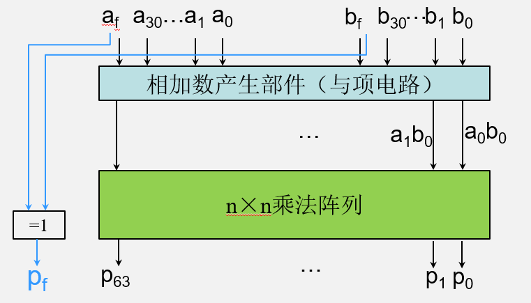

# **计算机组成与实践** -算术和逻辑单元（ALU）

## 一.概述

MIPS指令集：add、sub、and、or……

ALU的实现


#### **设计MIPS的ALU**

必须支持MIPS指令集中的算术与逻辑操作

- 加减指令：add、addi、addiu、sub、subu等
- 乘除指令：mult、multu、div、divu、sqrt
- 逻辑运算指令：and、andi、nor、or、ori、xor
- 分支指令：beq、bne、slt、slti、sltiu、sltu

以及一些指令所需的特殊处理：

- 符号扩展：addi、addiu、slti、sltiu
- 零扩展：andi、ori、xori
- 溢出检测：add、addi、sub

#### **MIPS算术与逻辑指令**


## 二.加法

#### 加法

7+6


Ø如果结果超过32位将产生溢出

- 正数和负数相加->不产生溢出
- 两个正数相加
  - 如果结果的符号位为1，则产生了溢出

- 两个负数相加
  - 如果结果的符号位为0，则产生了溢出

#### **1位全加器**

Ø输入端：两个加数、进位输入

Ø输出端：和、进位输出


> S = A xor B xor Cin
>
> Cout = (A and B) or (A and Cin) or (B andCin)

**如何用1位全加器构建32-bit全加器？**

：串联32个1位全加器

#### **32-bit全加器**


- 将低位的Cout连接到相邻高位的Cin就可以构建32-bit全加器
- 串行加法器或行波进位加法器（Ripple Carry Adder, RCA）
  - ​	🙂:逻辑简单，低开销
  - ​	☹：速度慢
- n-bit串行加法器的性能
  - ​     *n* × *CP*

#### **快速加法：超前进位**

关键是提高高阶进位的速度

Cout = (A and B) or (A and Cin) or (B andCin)

Cout = AB+ACin+BCin= AB+(A+B)Cin


- 进位生成因子（gi）： aibi
- 进位传递因子（ pi ）： (ai+bi) 

ci+1 = aibi+ (ai+bi) ci=gi+ pi ci

##### **超前进位**

**超前进位加法器（carry-lookahead adder）**


如果之前的加法器生成了一个进位，并且所有的中间传递因子传输了这个进位，那么ci+1 =1


##### 4位并行加法器

根据超前进位设计并行加法器


#### **多位并行进位加法器**


**Quiz1-进位传输函数和进位产生函数**

- 确定两个16 位数的gi、pi、Pi以及Gi值：

​	a: 0001 1010 0011 0011--2

​	b: 1110 0101 1110 1011--2

- CarryOut15(C4)的值是多少

> 第一题gi，和pi可以直接对应下来计算得出
>
> a: 0001 1010 0011 0011
>
> b: 1110 0101 1110 1011
>
> ------
>
> g: 0000 0000 0010 0011
>
> p:1111 1111 1111 1011
>
> |      | 3    | 2    | 1    | 0    |
> | ---- | ---- | ---- | ---- | ---- |
> | Pi   | 1    | 1    | 1    | 0    |
> | Gi   | 0    | 0    | 1    | 0    |
>
> 第二题，带入
>
> C4=0+0+1+0=1

**Quiz2-加法器的性能比较**

行波进位加法器和超前进位加法器速度的比较.

假设通过每个与门/或门需要的时间是相同的。比较16 位加法器路径上门延迟的数量，一个用行波进位，另一个用的是两级的超前进位。（1位全加器的每个进位输出信号需要2个门延迟）

> 行波进位加法器指的将16个1位加法器串联，每个全加器，执行加法的同时执行
>
> S = A xor B xor Cin
>
> Cout = (A and B) or (A and Cin) or (B andCin) 对于这个进位信号，有两种不同的门运算（与和或），门延迟为2，由于串行每一位加法器都需要等待后一个的进位信号，因此从最低进位道最高进位，总门延迟为16*2=32个门延迟
>
> 超前进位加法器最高位输出是上一题的C4,由于两级超前进位，每一级内的操作都是并行的，第一步计算小p,小g，都只有一个与或门运算，因此门延迟为1.第二级计算大P,门延迟1，计算大G门延迟2，因此第二级总的门延迟为2(P/G的运算也是并行的).最后计算C4时的门延迟为2。整体最坏的门延迟是5（假设每个逻辑运算都是一个门延迟）.

### **减法**

看作加法的第二个操作数为负数


#### **减法器设计**

设计思想：X – Y = X + (-Y)

- ​	每个bit位取反


- ​	最低位加1


> 感觉是取模得到最高位（符号位）然后再按不同的方法处理

#### **溢出检测**

如果结果超过32位将产生溢出

- 两个正数或两个负数相减，不产生溢出
- 当正数加正数：结果符号位为1则溢出
- 当负数加负数：结果符号位为0则溢出


- 最高有效位的进位输入与进位输出异或 

> V=Cin ⊕ Cout 


- 无符号整数的溢出可以忽略
- 溢出时产生异常
  - 加法add、立即数加法addi 和减法sub
- 溢出时不产生异常
  - 无符号加法addu、立即数无符号加法addiu 和无符号减法subu
- C语言忽略溢出，C编译器采用无符号算术指令

### **ALU需要支持的其他操作**

- 逻辑操作（and, or, xor, nor）
  - 按位操作，不涉及进位
  - 每个功能需要一个逻辑门，多选器选择输出结果
- 小于则置位指令（slt）
  - 使用减法判断a-b是否小于0
- 条件分支指令的相等测试（bne，beq）
  - 使用减法判断a-b是否等于0
- 立即数指令
  - ALU外设置符号扩展

#### **支持逻辑操作的ALU单元设计**


#### **实现slt**

- 首先进行减法
  - 如果减法结果为负数（最高有效位结果为1），将result置为1
  - 如果减法结果为正数（最高有效位结果为0），将result置为0
- 将最高有效位（set）连接到最低位的less输入


#### **一个简单完整的ALU**


## 三.乘法和除法

### **乘法**

通过移位与加法实现


积的位数是被乘数与乘数的位数之和

#### **乘法的硬件实现(第一版)**


硬件：


#### **改进后的乘法器**

同时进行加法和移位


每一步只需要一个时钟周期

​	乘法运算频率较低时

##### 例子-1


##### **更快速的乘法**


##### **更快速的乘法器设计**



##### **n×n乘法阵列**


#### **MIPS中的乘法指令**

乘法mult和无符号乘法multu

```
    mult $s0, $s1    # hi||lo = $s0 * $s1
```


一对容纳64位乘积的寄存器：$hi和$lo

- 高32-bit放入寄存器hi，低32-bit放入寄存器lo
- 用于存储乘法与除法的结果
- 不可直接寻址访问
- 通过mflo（move from lo）和mfhi（move from hi）两个指令将积送入指定的寄存器

编译器会用移位指令替代乘数为2的幂次的乘法操作

### **除法**

- 除数不能为0
- 长除法
- 如果除数<=被除数
  - 该位商为1，被除数减去除数
- 其他
  - 该位商为0，取被除数下一位
- 可恢复的除法
  - 被除数减去除数，直到余数小于0，再将被除数加回来
- 有符号除法
  - 采用绝对值进行除法
  - 源操作数的符号相反时商为负，同时使非零余数的符号和被除数的相同


#### **除法的硬件**


#### **改进后的除法器**


​	将加法器和寄存器的位长减半

​	将加法器和寄存器的位长减半

​	有些部件可以共用

#### **MIPS中的除法**

除法div和无符号除divu

```
div $s0, $s1    # $lo = $s0/$s1
                # $hi = $s0 mod $s1

```

- R型指令格式
- 乘法和除法共用硬件
- 商存放在$lo，余数存放在$hi
- 采用mflo和mfhi指令将运算结果放入其他寄存器

## 四.移位

#### **移位操作**

将所有位向左或者向右移动

```
    sll $t2, $s0, 8  # $t2=$s0 << 8 bits
    srl $t2, $s0, 8  # $t2=$s0 >> 8 bits
    sra $t2, $s0, 8  # $t2=$s0 >> 8 bits
```


- 5bit移位域足够表示移动31位
- 逻辑移位以0填充，算术移位以符号位填充
- 移位与ALU分开实现
- 空指令（nop）当作特殊的左移指令

#### **移位单元**

控制：

- 移动距离（Sh4Sh3Sh2Sh1Sh0）
- 移动方向（left，right）
- 移动类型（逻辑logical，算术arithmetic）


#### 移位实现

| Sh0  | !Sh0 | **r** | **l** | Doi       |
| ---- | ---- | ----- | ----- | --------- |
| 1    | 0    | 1     | 0     | Dii+1     |
| 1    | 0    | 0     | 1     | **Dii-1** |
| 0    | 1    | 0     | 0     | Dii       |


## 五.浮点数

计算机中以浮点数表示实数

### **科学计数法**

–2.34 × 10^56

+0.002× 10^–4

+987.0210 × 10^9

| **规格化(Normalized)数**                                     |
| ------------------------------------------------------------ |
| 一个采用科学记数法表示的数，若没有前导零且小数点左边只有一位整数 |

### 浮点数


| 浮点数(floating point)             |
| ---------------------------------- |
| 二进制小数点不固定的表达数的计数法 |

- 简化了浮点数的数据交换
- 简化了浮点数的算术算法
- 提高了用一个字存储的数的精度

#### **IEEE754浮点数格式**


- **S**：符号位（0 Þ非负，1 Þ负）
- 规格化计数：1.0<=|有效位|<=2.0
  - 二进制数的前导位为1，不需要表示
  - 有效位由1.与后面的**尾数**部分构成
- **指数**：实际的指数+偏阶
  - 指数为无符号数，为了表示2^-126到2^-127采用了偏阶
  - 单精度偏阶为127，双精度偏阶为1023
- 指数代表数值范围，尾数代表数的精度，指数域和尾数域大小需要折中

#### **单精度浮点数的取值范围**


- 指数00000000和11111111是保留值(1~254)
- 最小的值
  - 指数为00000001 -> 实际指数= 1 – 127 = –126
  - 尾数：000…0 -> 有效位 = 1.0
  - ±1.0 × 2^–126 ≈ ±1.2 × 10^–38
- 最大的值
  - 指数：11111110 ->实际指数= 254 – 127 = +127
  - 尾数：111…1->有效位 ≈ 2.0
  - ±2.0 × 2^+127 ≈ ±3.4 × 10^+38

#### **双精度浮点数的取值范围**


- 指数000…0到111…1是保留值(1~2046)
- 最小的值
  - 指数为00000000001 -> 实际指数= 1 – 1023 = –1022
  - 尾数：000…0 -> 有效位 = 1.0
  - ±1.0 × 2^–1022 ≈ ±2.2 × 10^–308
- 最大的值
  - 指数：11111111110 -> 实际指数= 2046-1023= +1023
  - 尾数：111…1-> 有效位 ≈ 2.0
  - ±2.0 × 2+1023 ≈ ±1.8 × 10^+308

#### **溢出**

浮点数表示法可以表示很大的数值范围，但与无穷还是不同

溢出（上溢）：正的指数太大而超过指数域的表示范围

下溢：负的指数太小而超过指数域的表示范围

浮点数=>异常

#### **浮点数的精确度**

- 相对精确度
- 所有尾数位是有效位
- 单精度：约2–23
  - 23 × log102 ≈ 23 × 0.3 ≈ 6 位十进制的精度
- 双精度：约2–52
  - 52 × log102 ≈ 52 × 0.3 ≈ 16 位十进制的精度

##### **浮点数例子1**


##### 浮点数例子2


#### **特殊数**

| **单精度** |        | 双精度 |        | 表示对象    |
| ---------- | ------ | ------ | ------ | ----------- |
| 指数       | 尾数   | 指数   | 尾数   |             |
| 0          | 0      | 0      | 0      | 0           |
| 0          | 非0    | 0      | 非0    | ±非规格化数 |
| 1~254      | 任何值 | 1~2046 | 任何值 | ±浮点数     |
| 255        | 0      | 2047   | 0      | ±无穷       |
| 255        | 非0    | 255    | 非0    | NaN（非数） |

- ±无穷
  - 避免溢出检测的需要
- 非数（Not-a-Number，NaN）
  - 表示非法数或者无效操作结果
  - e.g., 0.0 / 0.0

#### **浮点数加法**


#### **FP加法器**

- 比整数加法器复杂
- 如果采用单周期时间完成，时钟周期很长
  - 比整数操作时间长很多
  - 较慢的时钟周期将会影响所有指令
- FP加法器花费几个时钟周期
  - 可以并行执行

#### **浮点加的基本结构**


#### **浮点数乘法**


#### FP运算的硬件

- FP乘法器与FP加法器相似
  - 对有效数采用乘法，而不是加法
- FP运算硬件通常可以实现
  - 加法，减法，乘法，除法，倒数，平方根
- FP操作花费几个时钟周期
  - 并行执行

#### **MIPS中的浮点指令**

- 浮点寄存器
  - MIPS 设计增加了单独的浮点寄存器——称为$f0，$f1，$f2 ，…，$f31
  - 双精度寄存器是一组单精度寄存器的偶数－奇数对，并使用偶数寄存器编号作为其名称
- 针对浮点寄存器的存和取指令： lwcl 和swcl
- 单精度指令
  - add.s, sub.s, mul.s, div.s, c.x.s(例如c.eq.s)
- 双精度指令
  - add.d, sub.d, mul.d, div.d, c.x.d(例如c.eq.d)
- 浮点比较为真跳转bclt 和浮点比较为假跳转bclf 

#### 浮点数例子:°F转°C

C 代码:

```
	float f2c (float fahr) {
    return ((5.0/9.0)*(fahr - 32.0));
    }
   //fahr存放在$f12, 结果存放在$f0
```

MIPS汇编代码：

```
f2c:
	      lwcl    $f16, const5($gp)    # $f16=5.0 (5.0在存储器中)
	      lwcl    $f18, const9($gp)    # $f18=9.0 (9.0在存储器中) 
	      div.s   $16, $16, $18          # $f16=5.0 / 9.0
	      lwcl    $f18, const32($gp)  # $f18=32.0 (32.0在存储器中) 
	      sub.s  $f18, $f12, $f18      # $f18=fahr-32.0 
	      mul.s  $f0, $f16, $f18        # $f0=(5.0/9.0)*(fahr-32.0)
	      jr  $ra                                 #return
```

#### **浮点数例子：矩阵乘法**

C = C + A × B

都是32 × 32 的二维矩阵, 每个元素都是双精度

C 代码:

```
 void mm (double c[][],
     double a[][], double b[][]) {
  int i, j, k;
  for (i = 0; i! = 32; i = i + 1)
   for (j = 0; j! = 32; j = j + 1)
    for (k = 0; k! = 32; k = k + 1)
     c[i][j] = c[i][j]
          \+ a[i][k] * b[k][j];
 }
```

a,b,c的基地址是参数，存在$a0,$a1,$a2中，i, j, k 分别存在$s0,$s1,$s2中。

```
mm：
	      li	$t1, 32
	      li	$s0, 0
   L1:    li    $s1, 0
   L2:    li    $s2, 0
	     sll   $t2, $s0, 5
	     addu    $t2, $t2, $s1
	     sll    $t2, $t2, 3
	     addu    $t2, $a0, $t2
	     l.d    $f4, 0($t2)
  L3:    sll    $t0, $s2, 5
	    addu    $t0, $t0, $s1
	    sll    $t0, $t0, 3
	    addu    $t0, $a2, $t0
	    l.d    $f16, 0($t0)
	    sll    $t0, $s0, 5
		addu    $t0, $t0, $s2
		sll    $t0, $t0, 3
		addu    $t0, $a1, $t0
		l.d    $f18, 0($t0)
		mul.d    $f16, $f18, $f16
		add.d    $f4, $f4, $f16
		addiu    $s2, $s2, 1
		bne    $s2, $t1, L3
		s.d    $f4, 0($t2)
		addiu    $s1, $s1, 1
		bne    $s1, $t1, L2
		addiu    $s0, $s0, 1
		bne    $s0, $t1, L1


```

#### **算术精确性**

- IEEE 756提供几种舍入模式
  - 中间结果总是多保留两位，称为保护位（guard）和舍入位（round）
  - 四种舍入模式： 总是向上舍入（向＋∞ ），总是向下舍入（向－ ∞ ） ， 截断舍入，向最靠近的偶数舍入。
- 例子：2.56 × 10^0 与 2.34 × 10^2相加
  - 首先右移较小的数以对齐指数，有了保护位和舍入位，可以表示两个最低位:0.0256+2.3400=2.3656 (×10^2)，
  - 舍入后变为2.37 ×10^2
  - 如果没有保护位和舍入位：0.02+2.34=2.36 (×10^2)

## 六.小结

- 位模式没有内在的含义
  - 对位模式的操作决定其含义
- 计算机中的数字
  - 有限的数值范围与精度
  - 程序设计中需要考虑到
- 体系结构支持的算术运算
  - 有符号与无符号整数运算
  - 以浮点数近似表示的实数的运算
- 有限的取值范围与精度
  - 运算可能出现上溢或者下溢