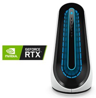
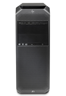
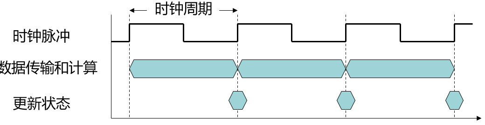
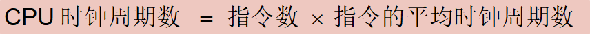
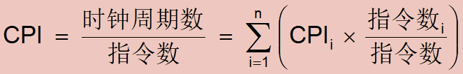
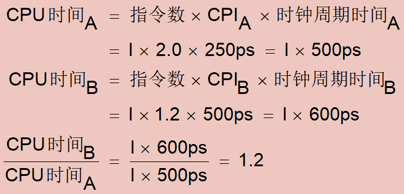
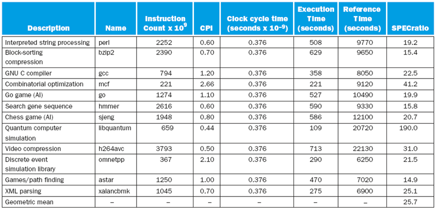
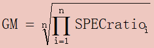
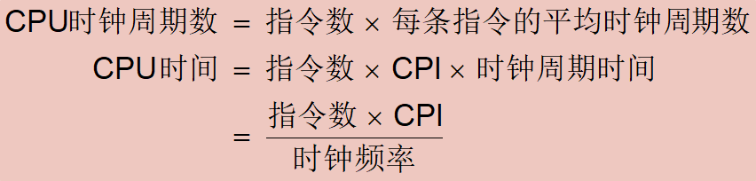

# **计算机组成与实践** -**计算机的性能（Performance）**

## 一.**性能的定义**

### **性能**

- 购买计算机
  - 最好的性能？
  - 最小开销？
- 设计计算机
  - 最大程度提升性能？
  - 降低计算机开销？
  - 均衡性能与开销？

### **计算机性能对比**

> 处理器：第10代 i7-10700K，  (8-核,16MB 缓存, 基本频率3.80 GHz，最高睿频 5.1GHz）
>
> 存储器：256GB 固态硬盘 + 1TB 
>
> 内存： 16GB，可扩展到64GB 
>
> 显卡： NVIDIA® GeForce® GTX 6GB
>
> 价格：15999

> 处理器：支持双Xeon处理器，Xeon 3204，  (6核, 8.25MB 缓存, 1.9GHz）
>
> 存储器：256GB 固态硬盘 + 1TB 
>
> 内存： 16GB，可支持高达768GB 
>
> 显卡： NVIDIA® Quadro® P1000 4G
>
> 价格：15999

> 处理器：5000系锐龙，Ryzen 5 5600，  (6核,32MB 缓存, 基础频率3.5GHz，最大加速时钟4.4GHz）
>
> 存储器：1T 固态硬盘 + 4TB 
>
> 内存： 32GB，可支持高达128GB 
>
> 显卡： NVIDIA®  GeForce® RTX 3070 8GB
>
> 价格：<6000

### **响应时间和吞吐率**

| 响应时间（Response Time）                                    |
| :----------------------------------------------------------- |
| 完成一项任务所需要花费的时间，也称为**执行时间**，包括硬盘访问、内存访问、I/O活动、操作系统开销和CPU执行时间等 |
| 对用户重要                                                   |

| 吞吐率（Throughput）                        |
| ------------------------------------------- |
| 在一定的时间内完成任务的总量                |
| 带宽(Bandwidth)，在单位时间内完成任务的总量 |
| 对云服务提供商重要                          |

针对不同的用户和应用，性能的度量也不同

### **性能的定义**

- 性能=1/执行时间
- “X性能是Y性能的n倍”

> 例1：计算机A运行一个程序需要10秒，计算机B运行同样的程序需要15秒，那么A的性能是B的多少倍？
>
> Ans:执行时间B/执行时间A=15s/10s=1.5
>
> ​       A的性能是B的1.5倍

**降低执行时间通常会提升吞吐量**

## 二.CPU性能及其因素

### **性能的度量**

CPU时间(CPU Execution Time)

- 在CPU上花费的时间，不包括等待I/O或运行其他程序的时间
- 可分为用户CPU时间(User CPU Time)和系统CPU时间(System CPU Time)

响应时间→系统性能(System Performance)

用户CPU时间→CPU性能(CPU Performance)

| **计算机设计者**                         |
| ---------------------------------------- |
| 考虑如何度量计算机硬件完成基本功能的速度 |
| 时钟                                     |

### **时钟**

计算机中以时钟来触发硬件执行各种事件

- 时钟周期（Clock Cycle）：时钟间隔的时间
  - 例如，250ps=0.25ns=250×10^–12s
- 时钟频率（Clock Rate）：时钟周期的倒数
  - 例如，4.0GHz = 4000MHz = 4.0×10^9Hz

#### **CPU时间**

> CPU时间=CPU时钟周期数×时钟周期时间=CPU时钟周期数/时钟频率

| **提高性能的方式**                     |
| -------------------------------------- |
| 减少一个程序的CPU时钟周期数            |
| 提高时钟频率                           |
| 硬件设计者需要权衡时钟周期数和时钟频率 |

> **例2**
>
> 计算机A的时钟频率为2GHz，某程序在A上运行的CPU时间是10s，如果目标时钟在计算机B上运行的CPU时间为6s，那么B的时钟频率应该为多少才能使该程序在B上运行的时钟周期数是A上的1.2倍？
>
> 时钟周期数A=CPU时间A×时钟频率A
>
> ​          =10s×2 GHz=20×10^9
>
> 时钟频率B=时钟周期数B/CPU时间B
>
> ​        =（1.2×时钟周期数A）/ 6s
>
> ​        =（1.2×20×10^9）/ 6s=4 GHz

#### **指令的性能**

通过程序的指令数和指令的平均时钟周期数获得

- 程序的指令数量
- 指令的平均时钟周期数（Clock cycles per instruction, CPI）：
  - 如果不同指令有不同的CPI，采用加权平均CPI
  - 比较相同ISA下的，不同实现方式的性能

#### **CPI的计算**

如果执行不同类型的指令需要不同的时钟周期数

加权平均CPI

#### **经典的CPU性能公式**

| **影响性能的三个关键因素**                                   |
| ------------------------------------------------------------ |
| 减少时钟周期时间或增加时钟频率（Intel Core i7的Turbo  mode睿频，暂时将时钟频率提高10%） |
| 减少指令数                                                   |
| 减少CPI                                                      |

> 例3
>
> 计算机A：时钟周期时间=250ps，CPI=2.0
>
> 计算机B：时钟周期时间=500ps，CPI=1.2
>
> 相同ISA，相同程序，哪台计算机执行的速度快？快多少？
>
> 

#### **理解程序性能**

| **硬件或软件指标** | **指令数** | **CPI** | **时钟周期时间** |
| ------------------ | ---------- | ------- | ---------------- |
| 算法               | **√**      | **√**   |                  |
| 编程语言           | **√**      | **√**   |                  |
| 编译程序           | **√**      | **√**   |                  |
| ISA                | **√**      | **√**   | **√**            |

#### **基准测试程序**

| 基准测试程序(benchmark)                          |
| ------------------------------------------------ |
| 一组专门用于测量性能的程序                       |
| 这些测试程序形成负载，用户期望预测实际负载的性能 |

SPEC (system performance evaluation cooperative)是为现代计算机系统建立的基准测试程序集

目前最新的是SPEC CPU2006 ，包括12 个整数基准程序集(ClNT 2006)和17 个浮点基准程序集(CFP 2006)

[www.spec.org](http://www.spec.org/)

> 个人超频跑分可以试试cpu-z，3dmark

**CINT2006 for Intel Core i7 920**

将被测计算机的执行时间标准化，即将被测计算机的执行时间除以一个参考处理器的执行时间，结果称为SPEC ratio

几何平均数（GM）

# 三.小结

- **执行时间**是唯一有效且不可推翻的性能度量方法
- 可靠的测量性能的方法

