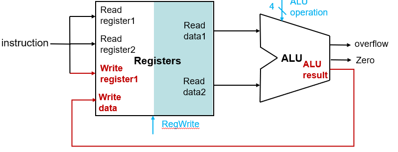
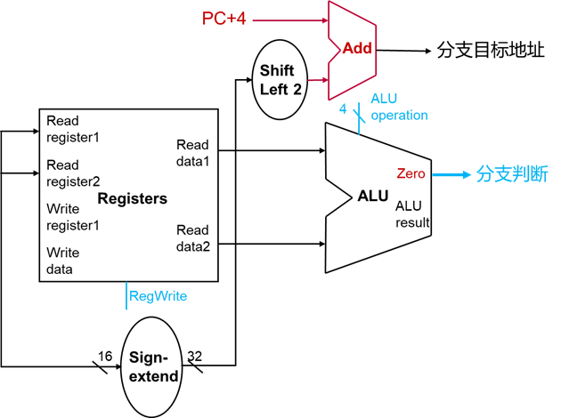

# **计算机组成与实践** -**数据通路（Datapath）**

## 一.**指令执行概述**

### **处理器：指令执行**

MIPS的核心指令：

- 数据传输指令：lw、sw
- 算术与逻辑运算指令： add、addu、addi、addiu、sub、subu、and、andi、or、ori、xor、xori、nor、slt、slti、sltu、sltiu
- 决策指令：beq、j

指令执行：

- PC ->取指令（更新PC）
- 指令译码，读取寄存器
- 执行指令

### **指令实现的抽象图**

核心指令子集实现的抽象视图，描述了主要功能单元及其连接

- 单时钟周期实现
- 哈佛模型：指令存储和数据存储分开

### **逻辑设计的一般方法**

- 二进制表示信息
  - 低电压=0；高电压=1
  - 1bit一条线路
  - 多个bit的数据编码为多条线路
- 组合单元（Combinational Element）
  - 处理数据值的单元
  - 输出只与输入相关，输入相同则输出也相同
- 状态单元（State Element 或者 Sequential Element）
  - 存储信息
  - 时钟信号

### **组合单元**

AND-gate

Y = A & B

Adder

Y = A + B

Multiplexer

Y = S ? I1 : I0

Arithmetic/Logic Unit

Y = F(A, B)

### **时序单元（** **Sequential Element** **）**

- 寄存器：能够存储数据的电路
  - 时钟信号决定何时更新存储的值
  - 边缘触发：只允许在时钟跳变的边沿时改变存储的值

- 带写信号的寄存器
  - 当写信号有效时，才会在时钟边沿时更新存储的值
  - 当存储的值稍后使用时

### **时钟方法（Clocking Methodology）**

组合单元在时钟周期内对数据进行处理

- 时钟边沿之间进行
- 输入来自状态单元，输出给状态单元
- 最长的延迟决定时钟周期时间

## 二.**取指令实现**

### 建立取指令数据通路

数据通路（Datapath）

- 处理或保存处理器中数据的单元
  - 数据通路部件：寄存器、ALU、多选器、存储器等
- 取指令的数据通路:PC寄存器、指令存储器（instruction memory）、加法器

> 读PC值，获得指令的地址
>
> 
>
> 读指令存储器，获得指令
>
> 
>
> 更新PC=PC+4，与读指令同时完成
>
> 
>
> 

## 三.**R型指令实现**

R型指令：add、sub、slt、and、or

- 对寄存器rs和rt中的值进行运算（op和funct）
- 将结果写回到寄存器rd
- 使用写控制信号RegWrite

#### **R型指令：读寄存器**

根据rs和rt指令域获得寄存器地址（编号）

对所有类型的指令，寄存器的读端口处于激活状态

#### **R型指令：ALU运算**

ALU根据控制信号（ALU operation）进行运算

#### **R型指令：写回**

将ALU result写回寄存器

rd是目标寄存器地址（编号）

写控制信号RegWrite有效

> **思考slt指令**
>
> 要把0（或1）写回到$t0，0（或1）从哪里获得？
>
>   **slt** $t0, $s0, $s1 #如果$s0<$s1,则$t0=1；           \#否则$t0=0
>
> 

## **四.数据传输指令实现**

数据传输指令：lw和sw

- 通过基址寄存器（rs）的值加指令中16 bits的常数，计算存储器地址
  - 基址寄存器的值通过读寄存器获得
  - 16 bits的常数经符号扩展单元，有符号扩展成32 bits的常数
- **lw**指令：获得存储器地址后访问数据存储器，将值写回到目标寄存器（rt）
- **sw**指令：读取寄存器rt中的值，根据获得的存储器地址将该值存入数据存储器

使用写控制信号MemWrite和读控制信号MemRead控制数据存储器的写入和读出

#### **读寄存器和符号扩展**

根据rs和rt指令域获得寄存器地址（编号），读寄存器rs和rt

16 bits符号扩展成32 bits

#### **ALU计算地址**

ALU计算存储器地址：基地址（rs的值）加32 bits立即数

寄存器rt中的值传输到数据存储器

#### **sw:访问数据存储器**

根据获得的存储器地址，将数据（rt）写入存储器

写控制信号MemWrite有效

#### **lw：访问数据存储器**

根据获得的存储器地址，从数据存储器读出数据

读控制信号MemRead有效

#### **lw:写回**

rt是目标寄存器地址（编号）

写控制信号RegWrite有效

## 五.**分支指令实现**

### **条件分支指令实现**

条件分支指令：beq

- ****
- 根据rs和rt指令域获得寄存器地址（编号），读寄存器
- ALU对两个值进行减法，结果为0则zero信号有效
- 16 bits的常数经符号扩展单元，有符号扩展成32 bits，然后左移2位转化成字地址（32 bits常数）
- 计算分支的目标地址：PC的值32 bits常数

#### **读寄存器和符号扩展**

根据rs和rt指令域获得寄存器地址（编号），读寄存器rs和rt

16 bits符号扩展成32 bits

#### **逻辑左移&**

符号扩展后的32 bits常数左移2位转化成字地址

ALU执行减法：寄存器rs的值减寄存器rt的值

#### **分支判断&目标地址计算**

ALU减法结果为0，则**Zero**信号有效，传输给分支控制单元（控制是否更新PC为分支目标地址）

加法器：PC+4加32 bits常数

#### **无条件分支实现**

无条件分支指令：j

26 bits常数符号扩展成28 bits

用28 bits将PC+4的低28位替换

## 六.**完整数据通路实现**

#### **创建完整的数据通路**

- 一个时钟周期执行一条指令
  - 时钟周期由最长执行线路决定
- 将R型指令（算术逻辑指令）、存取指令和分支指令的数据通路中相同的部件重合
- 使用多选器实现多个数据源的选择
- 加入取指令的数据通路

#### **加入多选器**

ALU第二个操作数：寄存器或立即数

写回到寄存器的数据：ALU计算结果或数据存储器

#### **完整的数据通路实现**

## **七.小结**

按照指令执行建立数据通路

独立的指令存储器和数据存储器

采用**多选器**实现多个数据源的选择