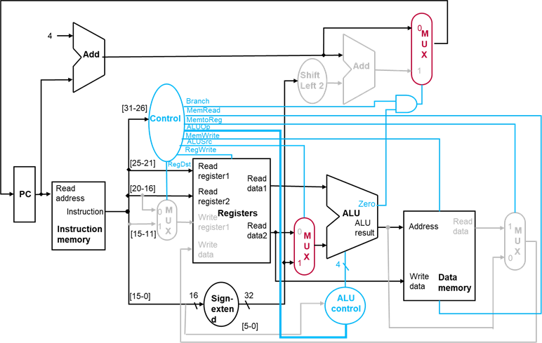

# **计算机组成与实践** -**控制单元（**Control Unit）

## 一.控制概述

#### **数据通路中的控制**

ALU需要实现正确的运算

多个单元的信号来源有多种选择（寄存器、ALU、加法器、多选器、符号扩展、存储器等）

状态单元的写入需要写控制信号与时钟共同决定（寄存器、数据存储器）

#### **ALU控制单元**

让各个单元实现正确的功能（运算、读、写）

控制数据流的来源（多选器）

上述控制信息来自于**指令**

总结：

- **op**字段在31~ 26位
- 源操作数寄存器**rs**和**rt**字段分别在25~21位和20~16位
- lw和sw指令中的基址寄存器是**rs**（25~21位）
- 保存写回数据的寄存器有两个：
  - lw指令：rt（20~16位）
  - R型指令：rd（15~11位）
- 立即数字段（15~0位）

#### **加入ALU控制单元**

主控制器产生ALUOp信号（2 bits）

ALU控制单元产生ALUcontrol信号（4 bits）

## 二.**ALU控制设计**

#### **ALU控制信号**

由ALU控制单元生成的4位控制信号及其定义的操作

| ALU  control输入 | **操作**   |
| :--------------: | :--------- |
|       0000       | 与         |
|       0001       | 或         |
|       0010       | 加         |
|       0110       | 减         |
|       0111       | 小于则置位 |
|       1100       | 或非       |

#### **生成ALU控制信号**

- 由2 bits ALUOp和6 bits funct功能字段生成ALU控制信号
- 采用多级译码的方法
  - 主控制单元生成ALUOp信号（不使用11）
  - ALU控制单元生成ALUcontrol信号

| **指令操作码** | **ALUOp** | **指令操作** | funct字段 | ALU操作  | **ALUcontrol** |
| -------------- | --------- | ------------ | --------- | -------- | -------------- |
| lw             | 00        | lw           | XXXXXX    | add      | 0010           |
| sw             | 00        | sw           | XXXXXX    | add      | 0010           |
| beq            | 01        | beq          | XXXXXX    | subtract | 0110           |
| R类型          | 10        | add          | 100000    | add      | 0010           |
| R类型          | 10        | sub          | 100010    | subtract | 0110           |
| R类型          | 10        | and          | 100100    | and      | 0000           |
| R类型          | 10        | or           | 100101    | or       | 0001           |
| R类型          | 10        | slt          | 101010    | slt      | 0111           |

#### **ALU控制单元真值表**

| **ALUOp** |        | **Funt字段** |      |      |      |      |      | **操作** |
| --------- | ------ | ------------ | ---- | ---- | ---- | ---- | ---- | -------- |
| ALUOp1    | ALUOp0 | F5           | F4   | F3   | F2   | F1   | F0   |          |
| 0         | 0      | X            | X    | X    | X    | X    | X    | 0010     |
| X         | 1      | X            | X    | X    | X    | X    | X    | 0110     |
| 1         | X      | X            | X    | 0    | 0    | 0    | 0    | 0010     |
| 1         | X      | X            | X    | 0    | 0    | 1    | 0    | 0110     |
| 1         | X      | X            | X    | 0    | 1    | 0    | 0    | 0000     |
| 1         | X      | X            | X    | 0    | 1    | 0    | 1    | 0001     |
| 1         | X      | X            | X    | 1    | 0    | 1    | 0    | 0111     |

X:表示与结果无关

#### **ALU控制逻辑实现**

根据真值表实现的ALU控制单元逻辑

## 三.**主控制单元的设计**

**主控制信号**

控制信号源于指令

9位控制信号：7个1位控制信号和2位ALUOp信号

#### **带主控制单元的数据通路**

#### **控制信号：执行R型指令**

#### **控制信号：执行lw指令**

#### **控制信号：执行sw指令**

#### **控制信号：执行beq指令**

#### **主控制单元真值表**

| **输入或输出** | **信号名** | **R型** | **lw** | **sw** | **beq** |
| -------------- | ---------- | ------- | ------ | ------ | ------- |
| **输入**       | Op5        | 0       | 1      | 1      | 0       |
|                | Op4        | 0       | 0      | 0      | 0       |
|                | Op3        | 0       | 0      | 1      | 0       |
|                | Op2        | 0       | 0      | 0      | 1       |
|                | Op1        | 0       | 1      | 1      | 0       |
|                | Op0        | 0       | 1      | 1      | 0       |
| **输出**       | RegDst     | 1       | 0      | X      | X       |
|                | ALUSrc     | 0       | 1      | 1      | 0       |
|                | MemtoReg   | 0       | 1      | X      | X       |
|                | RegWrite   | 1       | 1      | 0      | 0       |
|                | MemRead    | 0       | 1      | 0      | 0       |
|                | MemWrite   | 0       | 0      | 1      | 0       |
|                | Branch     | 0       | 0      | 0      | 1       |
|                | ALUOp1     | 1       | 0      | 0      | 0       |
|                | ALUOp0     | 0       | 0      | 0      | 1       |

#### **主控制单元逻辑实现**

## 四.**跳转的实现**

> **回顾：跳转实现**
>
> 
>
> 26 bits常数符号扩展成28 bits
>
> 用28 bits将PC+4的低28位替换
>
> 

#### **课堂练习：带跳转的实现**

## 五.**单时钟周期实现**

- 单时钟周期实现简单，适合小指令集
- 对于不同指令，不能使用不同时钟周期
- 最长延迟决定时钟周期
- 那种类型的指令执行最慢？

#### **最慢的指令决定时钟周期**

假设我们只关注指令运行中的：取指令、读寄存器、ALU运算、访问数据存储器、写回寄存器：

访问指令和数据存储器：4ns

ALU和加法器：2ns

访问寄存器：1ns

| 指令类型 | 取指令 | 读寄存器 | ALU运算 | 访问数据存储器 | 写回寄存器 | 时间   |
| -------- | ------ | -------- | ------- | -------------- | ---------- | ------ |
| R型      | 4      | 1        | 2       | 0              | 1          | 8      |
| lw       | 4      | 1        | 2       | 4              | 1          | **12** |
| sw       | 4      | 1        | 2       | 4              | 0          | 11     |
| beq      | 4      | 1        | 2       | 0              | 0          | 7      |
| j        | 4      | 0        | 0       | 0              | 0          | 4      |

## 六.**小结**

1. 状态单元的写入需要写控制信号与时钟共同决定
2. ALU控制器采用多级译码的方法
3. 主控制单元与数据通路共同实现指令的正确执行
4. 单时钟周期实现效率低