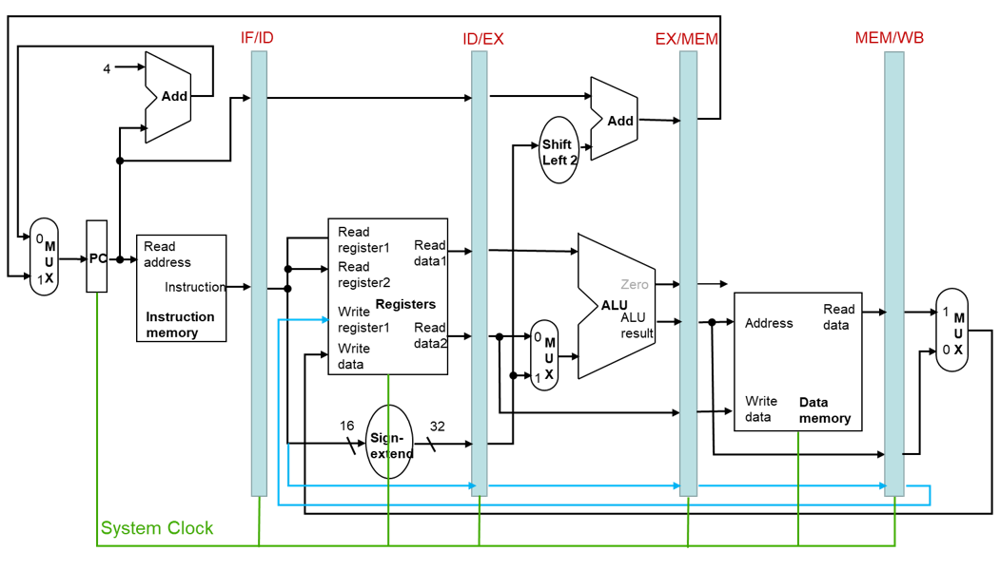
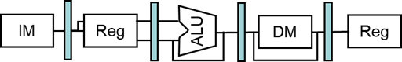

# **计算机组成与实践** -**流水线（pipeline）**

## 一.**流水线概述**

#### **回顾：单时钟周期实现**

假设我们只关注指令运行中的：取指令、读寄存器、ALU运算、访问数据存储器、写回寄存器：

- 访问指令和数据存储器：4ns
- ALU和加法器：2ns
- 访问寄存器：1ns

| **指令类型** | **取指令** | **读寄存器** | ALU运算 | **访问数据存储器** | **写回寄存器** | **时间** |
| ------------ | ---------- | ------------ | ------- | ------------------ | -------------- | -------- |
| R型          | 4          | 1            | 2       | 0                  | 1              | 8        |
| lw           | 4          | 1            | 2       | 4                  | 1              | **12**   |
| sw           | 4          | 1            | 2       | 4                  | 0              | 11       |
| beq          | 4          | 1            | 2       | 0                  | 0              | 7        |
| j            | 4          | 0            | 0       | 0                  | 0              | 4        |

#### **单时钟周期设计的优缺点**

☺：实现简单，易于理解

😞：

- 最长延迟决定时钟周期
  - 关键路径：取数指令
  - 指令存储器->寄存器堆->ALU->数据存储器->寄存器堆
- 违背设计原则：加速大概率事件

| **解决方法：流水线**                                         |
| ------------------------------------------------------------ |
| 现代处理器几乎都采用流水线实现性能的提升                     |
| 理想情况下，流水线的加速比是流水线的级数，例如5级流水线加速比接近于5 |
| 加速比得益于吞吐量                                           |

#### **流水线概述**

洗衣房问题（采用流水线技术）：重叠进行

- 并行性提升性能
- 4个任务
  - 加速比=8/3.5=2.3
- 任务足够多
  - 加速比=2n/0.5n=4
  - =stage的数量


#### **MIPS流水线**

五个阶段，每个阶段一个步骤

- 1. **取指(IF)**：从指令存储器取指令
- 2. **译码(ID)**：译码并读寄存器堆
- 3. **执行(EX)**：执行运算或计算地址
- 4. **访存(MEM)**：访问（读取/写数据）存储器
- 5. **写回(WB)**：将结果写回寄存器堆


> **最长的执行阶段决定时钟周期时间**

#### **流水线性能**

- 假设每个阶段的执行时间
  - 读写寄存器堆：100ps
  - 其他阶段：200ps
- 比较流水线指令执行与单周期指令执行


#### **面向流水线的指令集设计**

- MIPS指令集
- 所有指令长度相同，都是32bit
  - 单时钟周期内可以取得指令
- 指令格式少，格式类似
  - 可以一步完成译码和读寄存器
- 只有存/取指令涉及到存储器访问
  - 可以利用ALU计算地址，并在第4级访问存储器
- 所有操作数在存储器中对齐
  - 数据访问只需要一个时钟周期

## 二.**流水线数据通路及其控制**


```
lw  $10,20($1)
sub $11,$2,$3
add $12,$3,$4
lw  $13,24($1)
add $14,$5,$6
```

**上升沿触发**


**在流水线各级间加入状态单元——流水线寄存器**


**流水线中的指令执行（0 CC）**


**流水线中的指令执行（1 CC）**


**流水线中的指令执行（2 CC）**


**流水线中的指令执行（3 CC）**


**流水线中的指令执行（4 CC）**


**流水线中的指令执行（5 CC）**


**正确的流水线数据通路**

指令的信息随着指令执行在流水线寄存器中保存



#### **流水线控制**

- 所有控制信号可以在译码阶段（ID）生成
  - 将控制信号沿着流水线状态寄存器传递


|      | **EX**   |          |          |          | **MEM** |           |            | **WB**     |            |
| ---- | -------- | -------- | -------- | -------- | ------- | --------- | ---------- | ---------- | ---------- |
|      | Reg  Dst | ALU  Op1 | ALU  Op0 | ALU  Src | Brch    | Mem  Read | Mem  Write | Reg  Write | Mem  toReg |
| R    | 1        | 1        | 0        | 0        | 0       | 0         | 0          | 1          | 0          |
| lw   | 0        | 0        | 0        | 1        | 0       | 1         | 0          | 1          | 1          |
| sw   | X        | 0        | 0        | 1        | 0       | 0         | 1          | 0          | X          |
| beq  | X        | 0        | 1        | 0        | 1       | 0         | 0          | 0          | X          |

#### **流水线操作**

每个时钟周期，所有指令都会沿着流水线的数据通路从一个流水线寄存器传递到下一个流水线寄存器

- 单时钟周期（Single-clock-cycle）流水线图
  - 显示单个时钟周期的流水线使用情况
  - 着重显示使用的部件
- 多时钟周期（multi-clock-cycle）流水线图
  - 随着时间的变化，展示执行的操作的图

#### **单时钟周期流水线图**


#### **多时钟周期流水线图**

展示流水线中部件的使用情况


## 三.**流水线冒险**

**流水线冒险**

**流水线每个时钟周期都可以执行一条指令吗？**

| **流水线冒险（Pipeline Hazards）**               |
| ------------------------------------------------ |
| 现流水线在下一个时钟周期不能执行下一条指令的情况 |

- 结构冒险（Structural Hazard ）
- 数据冒险（Data Hazard）
- 控制冒险（Control Hazard）

**检测出冒险，解决冒险带来的问题**

### ☆**结构冒险**

缺乏硬件导致的冒险

1.MIPS流水线中的存储器使用冲突

- 取指令需要访问存储器
- 数据传输指令lw和sw需要访问存储器

2.寄存器的访问冲突

- 同一个时钟周期内，需要读和写寄存器

对指令与数据，采用分开的L1缓存

- Icache和Dcache


时钟的前半部分进行写，时钟的后半部分进行读


### ☆**数据冒险**

无法提供指令执行所需要的数据，即需要等待前面某些指令执行完数据的读写

1.寄存器导致的数据冒险

- 一条指令的操作数来源于前面的某条指令

```
add	$s0, $t0, $t1
sub	$t2, $s0, $t3
```

2.取数-使用型数据冒险

- 在数据需要使用时，数据还没有从存储器读出

```
lw	$s0, 20($t1)
sub	$t2, $s0, $t3
```


#### ☆**旁路**

**解决数据冒险1：旁路**

| **前推（Forwarding）**                 |
| -------------------------------------- |
| 在EX级产生结果之后马上发送给下一条指令 |

- 旁路（bypassing）：建立额外的数据通路连接ALU的输出到输入
- 不需要等到结果写回到寄存器


##### **数据依赖**

```
sub  $2, $1, $3
and  $12, $2, $5
or   $13, $6, $2
add  $14, $2, $2
sw   $15, 100($2)
```

**是否都会出现数据冒险？如何检测出这类数据冒险？**

**数据依赖与旁路**

##### 

##### **检测数据冒险**

- 使用流水线寄存器字段
  - ID/EX.RegisterRs：表示一个需要流水线寄存器ID/ EX 获得的源寄存器号
- 在EX级的ALU操作的两个寄存器号为：
  - ID/EX.RegisterRs, ID/EX.RegisterRt
- 当满足下列条件时会出现数据冒险：

```
1a. EX/MEM.RegisterRd = ID/EX.RegisterRs

1b. EX/MEM.RegisterRd = ID/EX.RegisterRt

2a. MEM/WB.RegisterRd = ID/EX.RegisterRs

2b. MEM/WB.RegisterRd = ID/EX.RegisterRt
```

- 只有需要写回寄存器的指令才需要旁路
  - EX/MEM.RegWrite, MEM/WB.RegWrite
- 目的寄存器不能是$0

```
EX/MEM.RegisterRd ≠ 0,
MEM/WB.RegisterRd ≠ 0
```

##### **旁路的数据通路**


##### **旁路多选器的控制信号**

| Mux  control   | Source | Explanation                                                  |
| -------------- | ------ | ------------------------------------------------------------ |
| ForwardA = 00  | ID/EX  | 第一个ALU操作数来自寄存器堆                                  |
| ForwardA  = 10 | EX/MEM | 第一个ALU操作数由上一个ALU运算结果旁路获得                   |
| ForwardA  = 01 | MEM/WB | 第一个ALU 操作数从数据存储器或者往前数第二条指令的ALU 结果中旁路获得 |
| ForwardB  = 00 | ID/EX  | 第二个ALU 操作数来自寄存器堆                                 |
| ForwardB  = 10 | EX/MEM | 第二个ALU 拱作做由上一个ALU 运算结果旁路获得                 |
| ForwardB  = 01 | MEM/WB | 第二个ALU 操作般由数据存储器或者往前数第二条指令的ALU 结果旁路获得 |

##### **旁路条件**

**EX** **冒险**

```
if (EX/MEM.RegWrite and (EX/MEM.RegisterRd ≠ 0)

 and (EX/MEM.RegisterRd = ID/EX.RegisterRs)) ForwardA = 10

if (EX/MEM.RegWrite and (EX/MEM.RegisterRd ≠ 0)

 and (EX/MEM.RegisterRd = ID/EX.RegisterRt)) ForwardB = 10
```

**MEM** **冒险**

```
if (MEM/WB.RegWrite and (MEM/WB.RegisterRd ≠ 0)

 and (MEM/WB.RegisterRd = ID/EX.RegisterRs)) ForwardA = 01

if (MEM/WB.RegWrite and (MEM/WB.RegisterRd ≠ 0)

 and (MEM/WB.RegisterRd = ID/EX.RegisterRt)) ForwardB= 01
```

##### **两种冒险**


##### **潜在数据冒险**

```
add $1, $1, $2
add $1, $1, $3
add $1, $1, $4
```


- 两类数据冒险都会发生：
  - MEM级的数据是最新结果，使用MEM级数据进行旁路
- 更改MEM冒险的条件
  - EX冒险的条件不成立时

##### **更改后的旁路条件**

**MEM冒险**

```
if (MEM/WB.RegWrite
	and (MEM/WB.RegisterRd ≠ 0)
	and not(EX/MEM.RegWrite and (EX/MEM.RegisterRd ≠ 0)
		and (EX/MEM.RegisterRd ≠ ID/EX.RegisterRs))
	and (MEM/WB.RegisterRd = ID/EX.RegisterRs)) ForwardA = 01
if (MEM/WB.RegWrite
	and (MEM/WB.RegisterRd ≠ 0)
	and not(EX/MEM.RegWrite and (EX/MEM.RegisterRd ≠ 0)
		and (EX/MEM.RegisterRd ≠ ID/EX.RegisterRt))
	and (MEM/WB.RegisterRd = ID/EX.RegisterRt)) ForwardB = 01
```

#### ☆**阻塞**

##### **解决数据冒险2：阻塞**


- 即使使用旁路也不能消除冒险
- 必须让流水线阻塞一个时钟周期

**怎样阻塞流水线？**

##### **空指令**

| **空指令（nop）**                        |
| ---------------------------------------- |
| 一种不进行任何操作或不改变任何状态的指令 |


**需要在译码（ID）阶段检测出！**

##### **取数使用型数据冒险检测**

- ALU操作数寄存器号可以在ID级获得：

  - IF/ID.RegisterRs, IF/ID.RegisterRt

- 取数使用型冒险发生条件：

  - ID/EX.MemRead 

   and ((ID/EX.RegisterRd = IF/ID.RegisterRs) 
   or (ID/EX.RegisterRd = IF/ID.RegisterRt))

- 如果检测到冒险发生，阻塞流水线一个时钟周期

##### **如何阻塞流水线**

- 将ID/EX寄存器中的控制信号置为0（nop指令）
  - EX，MEM，WB级不进行操作
- 阻止PC和IF/ID寄存器更新
  - 正在运行的指令重复译码
  - 重复提取下一条指令
  - 阻塞一个时钟周期可以让取数操作取得数据，接下来可以旁路到EX级

##### **冒险检测的数据通路**


##### **阻塞与性能**

- 阻塞降低性能
  - 为了获得正确的结果，需要阻塞
- 编译器可以通过调整指令执行顺序减少冒险和阻塞
  - 需要了解流水线结构

##### **编译器优化：指令调度避免阻塞**

改变指令顺序，避免产生取数-使用型数据冒险

C代码：A=B+E；

​        C=B+F；


### ☆**控制冒险**

分支冒险（branch hazard），指令执行不是顺序执行，即下一条指令的地址不是PC+4，而是依赖于正在执行的指令

- 无条件分支（j、jal、jr）
- 条件分支（beq、bne）
- 异常

解决方案：

- 阻塞：影响性能
- 提前产生分支结果：需要额外的硬件
- 延迟分支决策：需要编译器的支持
- 分支预测（ Branch Prediction ）

#### **控制冒险1：跳转**

- 假定分支不发生
- 跳转指令在译码阶段（ID）才能得到跳转地址，需要清除流水线

| **清除（FLUSH）**                |
| -------------------------------- |
| 因发生了意外而丢弃流水线中的指令 |

用IF.Flush将IF/ID流水线寄存器中的指令置为空指令

#### **支持ID级跳转的数据通路**


#### **控制冒险2：条件分支**

分支结果在MEM级获得


#### **解决控制冒险2：等待分支结果**

分支结果在MEM级获得


#### **解决控制冒险2：提前计算分支结果**

将生成分支结果的硬件放在ID级

- 目的地址加法器
- 寄存器比较器


#### **ID级生成分支结果**

计算分支目标地址

- 将分支地址计算电路从EX级移到ID级

判断分支条件

- 决定是否将数据旁路到相等检测单元进行检测（beq、bnq）
- 可能发生数据冒险，需要阻塞流水线
  - 分支指令前是R型指令，计算的结果是分支指令的源操作数，发生一个阻塞
  - 分支指令前是lw指令，载入的数据是分支指令的源操作数，发生两个阻塞

#### **ID级分支旁路问题**

分支指令beq的操作数是需要写回的数据

 需要将MEM/WB寄存器的数据旁路到ID级的比较硬件


需要将EX/MEM寄存器的数据旁路到ID级的比较硬件


#### **旁路条件**

```
EX 冒险
if (IDcontrol.Branch  and (EX/MEM.RegisterRd != 0)
    and (EX/MEM.RegisterRd == IF/ID.RegisterRs)   ForwardC = 10
if (IDcontrol.Branch and (EX/MEM.RegisterRd != 0)
    and (EX/MEM.RegisterRd == IF/ID.RegisterRt)    ForwardD = 10
MEM 冒险
if (IDcontrol.Branch  and (EX/MEM.RegisterRd != 0)
    and (EX/MEM.RegisterRd == IF/ID.RegisterRs)   ForwardC = 01
if (IDcontrol.Branch and (EX/MEM.RegisterRd != 0)
    and (EX/MEM.RegisterRd == IF/ID.RegisterRt)    ForwardD = 01
```

#### **支持ID级分支的数据通路**


#### **编译器优化：延迟分支**

| **延迟分支**                                                 |
| ------------------------------------------------------------ |
| MIPS编译器将一条指令I移到分支指令之后，可以延迟分支目的指令的执行，从而隐藏分支延迟 |


方案A最佳，分支发生概率大时选择方案B（循环），分支不发生概率大时选择C 

#### **动态分支预测**

- 流水线级数的增加，预测错误的代价增加
- 静态分支预测是粗略的预测方法
- 动态分支预测
  - 分支预测缓存（Branch prediction buffer ）或分支历史记录表（branch history table）
  - 分支指令的地址低位索引
  - 存储分支结果（taken/not taken）
- 执行分支
  - 查表，预测的结果与上次分支结果一样
  - 按照预测结果取指令
  - 如果出错，清洗流水线并重新提取正确的指令
  - 将表中预测结果取反

#### **1位预测器**


内层循环至少两次预测错误

- 最后一次预测会出错：前面分支都是发生的，最后一次不发生
- 第一次预测会出错：上一次的预测不发生，跳出内层循环之后，再次进入内层循环也会预测不发生

**2位预测器**

只有连续两次预测错误时才会改变预测结果


#### **计算分支目标地址**

- 结合分支预测器，需要计算分支目标地址
  - 分支发生会产生1个时钟周期的开销
- 延迟分支
- 分支目标缓存（Branch target buffer）
  - 缓存分支目标地址
  - 取指令时，由PC中的地址索引
    - 如果预测正确，并且分支指令发生，可以直接提取到分支目标地址

## 四.**异常**

| **异常**                                         |
| ------------------------------------------------ |
| 指打断程序正常执行的突发事件，会改变指令执行顺序 |

- 异常（exceptions）
  - 产生原因可能来自处理器内部或者外部
  - 例如，使用未定义的指令，算术溢出，系统调用
  - 与程序执行同步，必须停止随后的指令在流水线中运行
- 中断（Interrupt）
  - 由处理器外部引起的事件
  - 例如I/O设备请求
  - 与程序执行不同步，可以等流水线中指令执行结束再处理
- 处理异常和中断会牺牲系统性能

#### **流水线中的异常**



|              | **发生的流水级** | **是否同步** |
| ------------ | ---------------- | ------------ |
| 算术溢出     | EX               | 是           |
| 未定义的指令 | ID               | 是           |
| TLB或页缺失  | IF，MEM          | 是           |
| I/O设备请求  | 全部             | 否           |
| 硬件故障     | 全部             | 否           |

**多种异常可能同时发生**

#### **异常处理**

- 保存出错指令的地址
  - 异常程序计数器(Exception Program Counter，EPC)
- 保存引起异常的原因
  - 状态寄存器（Cause寄存器）
  - MIPS体系结构中是32 bits
  - 一个字段用于记录异常产生的原因，例如未定义指令=10，算术溢出=12
- 向量中断（vectored interrupt）
  - 未定义指令->8000 0000（16进制），算术溢出->8000 0180（16）

| **向量中断**                         |
| ------------------------------------ |
| 由异常原因决定中断控制转移地址的中断 |

#### **异常处理操作**

- 读取异常或中断原因，找到相应的处理程序
- 决定需要的处理操作
- 如果可以处理，最后要重新启动程序
  - 执行相应处理操作
  - 使用EPC返回程序继续执行
- 如果不能处理
  - 结束程序
  - 用EPC和cause寄存器报告错误

#### **流水线实现中的异常**

- 另一种形式的控制冒险
- 在EX级加法出现算术溢出
  - add $1, $2, $1
  - 停止运行add指令
  - add之前的指令可以正常运行
  - 清空add及其之后的指令
  - 设置EPC和cause的值
  - 将控制权交给处理程序
- 与处理分支预测错误相似

#### 处理异常的数据通路与控制


> **例子**
>
> 异常发生在add
>
> ```
> 40 sub $11, $2, $4
>  44 and $12, $2, $5
>  48 or  $13, $2, $6
>  4C add $1, $2, $1
>  50 slt $15, $6, $7
>  54 lw  $16, 50($7)
> ```
>
>
>  …
>
> 异常处理程序:
>
> ```
> 80000180 sw $26, 1000($0)
>  80000184  sw $27, 1004($0)
> ```
>
>
>  …
>
> 给出add 指令发生溢出异常时流水线的情况

#### **算术溢出异常例子**


#### **多个异常**

- 流水线各级都可能发生异常
  - 5级流水线可能同时发生异常
- 处理最早最先发生异常的指令
  - 清洗掉接下来的所有指令
  - 精确（precise）异常
- 在更复杂的流水线中
  - 每个时钟周期处理多条指令
  - 指令乱序执行
  - 保持精确异常非常困难

#### **非精确异常**

- 停止流水线并保存状态
  - 包括异常发生的原因
- 让处理程序去完成
  - 确定是哪条指令发生了异常
  - 哪条指令可以完成，哪条需要清洗
- 简化硬件设计，但是处理程序将变得更加复杂
- 对于复杂多发射乱序执行流水线不适用

## 五.**小结**


- 所有现代处理器都采用流水线设计
- 流水线时钟频率由最慢的流水线阶段决定——流水线各阶段的划分很重要
- 流水线正确运行必须能够检测并解决各类冒险
  - 结构冒险：流水线设计阶段
  - 数据冒险：旁路和阻塞
  - 控制冒险：阻塞、延迟分支决策、静态分支预测和动态分支预测
- 流水线复杂的异常处理


