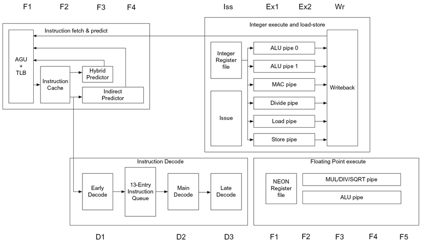
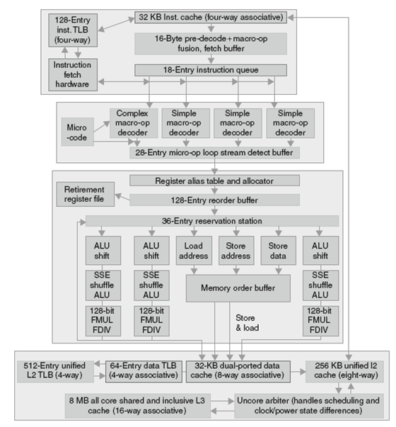

# **计算机组成与实践** -**流水线实例**

- **流水线实例简介**
- **ARM Cortex A53**
- **Intel Core i7 920**

## 一.**流水线实例简介**

| **Processor**   | **ARM  A53**                        | **Intel  Core i7 920**        |
| --------------- | ----------------------------------- | ----------------------------- |
| 市场            | 个人移动设备                        | 服务器、云计算                |
| 设计功耗        | 100mW（单核频率1GHz）               | 130W                          |
| 时钟频率        | 1.5  GHz                            | 2.66  GHz                     |
| 单芯片核数      | 4 (可配置)                          | 4                             |
| 是否支持浮点    | 是                                  | 是                            |
| 是否多发射      | 动态                                | 动态                          |
| 峰值IPC         | 2                                   | 4                             |
| 流水线级数      | 8                                   | 14                            |
| 流水线调度      | 静态按序                            | 动态乱序+推测式执行           |
| 分支预测        | 混合                                | 2级                           |
| 单核内L1  Cache | ICache：16~64KB     DCache：16~64KB | ICache：32KB     DCache：32KB |
| 单核内L2  Cache | 共享，128~2048KB                    | 每个核256KB                   |
| 共享L3  Cache   | 由平台决定                          | 2~8MB                         |

## 二.**ARM Cortex A53**

- ARM Cortex-A53是一款基于ARMv8指令系统的八级流水线结构处理器。
  - 28nm HPM制造工艺
  - 推出市场之初，是世界上能耗比最高、面积最小的64位应用处理器。
- 流水线分为三个部分：**取指、译码和执行**
- 采用动态多发射技术，每周期发射2条指令
- 采用静态按序流水线，指令按序发射、按序执行、按序提交

流水线的前三级每周期取两条指令，将指令取到表项数为13的指令队列中，地址产生单元（AGU）使用混合预测器、间接转移预测器和返回栈对各类分支转移指令进行预测，尽可能保持指令队列中有足够多的指令。

- 采用6kb大小的混合条件分支预测器
- 256表项的间接转移预测器，间接转移预测需要占用额外的一个流水级
- 一个用来预测函数返回地址的8表项返回地址栈

流水线的译码阶段用来判断“指令对”内部是否存在依赖关系，并决定指令将被发送到哪类功能部件上。

指令执行阶段占用了三个流水级。

- Cortex-A53为load和store指令分别提供单独的执行流水线
- 为定点算术指令提供两条执行流水线
- 为定点乘法和除法操作分别提供单独的执行流水线
- “指令对”中的任意一条指令都可以发射到load或者store流水线中
- 执行阶段的不同流水线之间具有全旁路机制。

为实现浮点和SIMD指令，在指令的执行阶段增加两个流水级。使用其中一级实现浮点的乘法/除法/开方操作，另一流水级实现浮点的其他算术操作。

ARM Cortex-A53使用静态调度的流水线结构，依靠编译器避免结构冒险和数据依赖

## 三.**Intel Core i7 920**

x86 采用了复杂的流水线技术，在其14 级流水线中综合使用了动态多发射、乱序执行和推测执行的动态流水线调度技术。

| **微操作**                                                |
| --------------------------------------------------------- |
| 取入x86 指令，将其翻译为类MIPS 指令，Intel 称之为“微操作” |

微操作由复杂的基于推测执行的动态调度流水线执行，该流水线每个时钟周期最多可执行6 个微操作

| **微体系结构**                                               |
| ------------------------------------------------------------ |
| 处理器的组织，包括主要的功能单元及它们的互连关系与流水线控制。 |

使用重排序缓冲区和寄存器重命名技术来解决反相关和推测错误

寄存器重命名技术：显式地将处理器中的体系结构寄存器（architectural register）重命名为一组更大的物理寄存器集合

| **体系结构寄存器**                                           |
| ------------------------------------------------------------ |
| 处理器中的可见寄存器。  如在MIPS 中有32 个整数寄存器和16 个浮点寄存器是可见的，64 位版本的x86体系结构中是16 个。 |

- 需要维护体系结构寄存器和物理寄存器之间的映射关系
- 能指出哪个物理寄存器才是某个体系结构寄存器的最新备份

寄存器重命名提供了另一种推测错误时的恢复方法： 简单地撤销所有第一条推测错误指令后建立的所有映射。

### **一条x86指令的执行**

1.取指令：处理器使用一个多级分支目标缓冲器在速度和预测准确性方面做平衡。另外还有一个返回地址栈用于加速函数返回。误预测将导致15个周期的开销。取指部件使用预测地址从指令cache中取入16字节

2.这16字节放入预译码指令缓冲器：预译码阶段将这16字节转换为独立的x86指令。因为x86指令长度可以是1 ～ 15字节不等，预译码操作必须扫描多个字节以确定指令长度，所以预译码操作非常复杂。每条x86指令放入一个18入口的指令队列。

3.微操作译码：每条x86指令被翻译为微操作。有三个译码器将x86指令直接翻译为一个微操作。而对于具有复杂语法功能的x86指令，则使用一个微代码引擎产生一个微操作序列；它可以在每个周期生成4个微操作直到必需的微操作序列生成为止。这些微操作按照x86指令顺序放入28入口的微操作缓冲器。

4.微操作缓冲器执行循环流检测：如果有一个小的指令序列（少于28条指令或长度小于256 字节）包含一个循环，循环流检测器将识别该循环，并直接从缓冲器中发射微操作，从而减少了指令预取和指令译码。

5.执行基本指令发射：在将微操作发射到保留站之前，在寄存器表中查找寄存器位置、对寄存器进行重命名、分配重排序缓冲器入口、从寄存器或重排序缓冲中取结果。

6.i7使用一个被6个功能单元共享的36入口的集中式保留站。在每个周期内最多可以向功能单元分派6个微操作。

7.各个功能单元执行微操作，执行结果不但送往寄存器提交部件，在己知指令将不再预测的情况下更新寄存器状态，还可送往任何一个等待的保留站。重排序缓冲中与指令对应的入口标记为完成。

8.当前面的一条或多条指令已经被标记为完成，则执行寄存器提交部件中未决的写操作，指令从重排序缓冲器中移走。