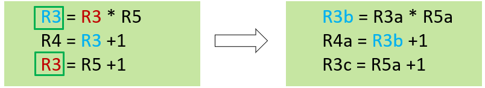

# **计算机组成与实践** -**指令级并行（ILP）**

- **ILP简介**
- **依赖**
- **静态多发射**
- **动态多发射**
- **小结**

## 一.**ILP简介**

### **指令级并行（Instruction Level Parallel）**

- 流水线：并行执行多条指令
- 提高指令级并行
  - 超级流水线（Super pipelining）：增加流水级
    - 每级任务变少Þ 时钟周期缩短
- 多发射（multiple issue）
  - 复制流水线的各级Þ 多条流水线
  - 每个时钟周期提取多条指令
  - CPI<1，采用IPC
  - 例如，4GHz 4路多发射：160 BIPS，峰值CPI=0.25，峰值IPC=4
  - 实际上，依赖关系减少了IPC

### **多发射（Multiple Issue）**

- 静态多发射（VLIW）
  - 编译器阶段选择哪些指令为一组进行多发射
  - 将这组指令放入发射槽（issue slots）
  - 编译器检测并避免冒险
- 动态多发射（Superscalar）
  - CPU执行指令并选择哪些指令可以进行多发射
  - 编译器可以帮助调整指令执行顺序
  - CPU在运行时解决冒险

## **二.依赖**

| **结构冒险——资源冲突**                             |
| -------------------------------------------------- |
| 多发射处理器会出现很多资源冲突                     |
| 资源冲突可以通过加入更多硬件资源或流水线执行来消除 |

| **数据冒险——数据（存储）依赖**           |
| ---------------------------------------- |
| 在多发射处理器中极大的限制了其指令级并行 |

| **控制冒险——过程依赖**   |
| ------------------------ |
| 在多发射处理器中更严峻   |
| 采用动态分支预测可以缓解 |

通过软硬件结合的方式来缓解依赖带来的影响

### **数据冒险**


| **RAW（真相关）**                                            |
| ------------------------------------------------------------ |
| 当前指令使用的数据是前面指令更新的数据，必须保持指令执行的顺序 |

| **WAR（反相关）**                                            |
| ------------------------------------------------------------ |
| 当前指令需要更新数据，而前面的指令使用的是原来的数据，必须保持指令执行的顺序 |

| **WAW（输出相关）**                            |
| ---------------------------------------------- |
| 两条指令会相继更新数据，必须保持指令执行的顺序 |

### **课堂练习：**

找到下面指令的所有数据依赖，并给出其属于哪种依赖

```
I1：ADD R1, R2, R1
I2:  LW  R2, 0(R1)
I3:  LW  R1, 4(R1)
I4:  OR  R3, R1, R2

```

- RAW表示程序中数据流，即数据处理的顺序
- WAR和WAW两种依赖因为寄存器数量有限（存储冲突）而产生的，即不得不重复使用同一个寄存器
- 存储冲突可以减少：
  - 增加存储资源
  - 提供额外的寄存器，重新建立寄存器与数值之间的对应关系
  - 超标量处理器使用硬件动态分配寄存器

#### **解决存储冲突**

| **寄存器重命名（Register Renaming）** |
| ------------------------------------- |
| 处理器重新命名指令中的寄存器标识符    |



硬件通过从空闲寄存器池中分配一个寄存器进行重命名

数据使用之后将寄存器释放回空闲寄存器池

#### **解决过程依赖**

| **推测（Speculation）**                                    |
| ---------------------------------------------------------- |
| 为了使依赖于该指令的其他指令尽快运行，推测一条指令的结果： |
| 推测分支结果：如果错误则返回去执行正确指令                 |
| 推测load指令不依赖与store指令：如果错误，返回重新load数据  |

- 必须有以下机制支持推测技术：
  - 检测推测是否正确
    - 如果正确，完成操作
    - 如果错误，返回到该指令并执行正确的结果
  - 如果推测错误，必须能够恢复
- 推测可以由编译器或硬件来完成
- 通常在静态和动态多发射中使用

#### **编译器推测和硬件推测**

- 编译器推测可以调整指令执行顺序
  - 例如，将load放到分支之前执行
  - 插入额外指令检测正确性，并为推测错误提供修复程序
- 硬件推测可以提前执行指令
  - 缓存推测的结果直至推测的结果得到确认
  - 如果推测正确，将缓存的结果写回到寄存器和存储器
  - 如果推测错误，硬件清除缓存并重新执行正确指令

## **三.静态多发射**

- 编译器封装多条指令并处理冒险
  - 将可以在同一时钟周期执行的指令封装成发射包（issue packet）
  - 由流水线的资源数量所决定
- 一条执行多个操作的长指令
  - 指定多个并发操作
  - 超长指令字（ very long instruction word，VLIW）

#### **调度静态多发射**

编译器处理数据冒险和控制冒险

- 调度代码，封装发射包
- 发射包内指令间不能存在依赖
- 发射包间可以存在指令间依赖
- 如果需要可以封装nop操作

#### **静态双发射例子**

双发射包

- 一条ALU 指令或分支指令
- 一条load或store指令
- 两条指令成对存放在64位对齐的存储区域

| Address | Instruction  type | Pipeline  Stages |      |      |      |      |      |      |
| ------- | ----------------- | ---------------- | ---- | ---- | ---- | ---- | ---- | ---- |
| n       | ALU/branch        | IF               | ID   | EX   | MEM  | WB   |      |      |
| n +  4  | Load/store        | IF               | ID   | EX   | MEM  | WB   |      |      |
| n +  8  | ALU/branch        |                  | IF   | ID   | EX   | MEM  | WB   |      |
| n +  12 | Load/store        |                  | IF   | ID   | EX   | MEM  | WB   |      |
| n +  16 | ALU/branch        |                  |      | IF   | ID   | EX   | MEM  | WB   |
| n +  20 | Load/store        |                  |      | IF   | ID   | EX   | MEM  | WB   |

#### **静态双发射数据通路**


#### **双发射中的冒险**

- EX级发射数据冒险
  - 单个发射通路中出现数据冒险，采用旁路
  - 发射包中指令间存在的数据冒险
    - add $0,$0,$1
    - lw   $2,0($0)
    - 将这两条指令封装进不同的发射包中
- 取数使用型数据冒险
  - 阻塞一个时钟周期
- 需要编译器技术
  - 指令调度（instruction Scheduling）
  - 循环展开（Loop Unrolling）

#### **指令调度示例**

面向双发射调度下列代码

```
Loop: lw    $t0, 0($s1)     // $t0=array element
addu  $t0, $t0,$s2 		   // add scalar in $s2
sw    $t0, 0($s1)    	  // store result
addi  $s1, $s1, -4    	 // decrement pointer
bne   $s1, $zero, Loop  // branch $s1!=0

```

|       | ALU/branch             | Load/store        | cycle |
| ----- | ---------------------- | ----------------- | ----- |
| Loop: | nop                    | lw   $t0, 0($s1)  | 1     |
|       | addi   $s1, $s1, -4    | nop               | 2     |
|       | addu   $t0, $t0,$s2    | nop               | 3     |
|       | bne   $s1, $zero, Loop | sw    $t0, 0($s1) | 4     |

IPC = 7/6 = 1.17 (c.f. peak IPC = 2)

#### **循环展开**

- 复制多个循环体获得更高的并行度
  - 减少循环控制开销
- 在多个循环中使用不同寄存器
  - 也称为寄存器重命名（register renaming）
  - 保持循环间的依赖关系

#### **循环展开示例**

|       | ALU/branch             | Load/store         | cycle |
| ----- | ---------------------- | ------------------ | ----- |
| Loop: | addi   $s1, $s1, -16   | lw   $t0, 0($s1)   | 1     |
|       | nop                    | lw   $t1, 12($s1)  | 2     |
|       | addu   $t0, $t0,$s2    | lw   $t2, 8($s1)   | 3     |
|       | addu   $t1, $t1,$s2    | lw   $t3, 4($s1)   | 4     |
|       | addu   $t2, $t2,$s2    | sw    $t0, 16($s1) | 5     |
|       | addu   $t3, $t3,$s2    | sw    $t1, 12($s1) | 6     |
|       | nop                    | sw    $t2, 8($s1)  | 7     |
|       | bne   $s1, $zero, Loop | sw    $t3,  4($s1) | 8     |

IPC = 15/8 = 1.875

## 四.**动态多发射**

| **超标量（Superscalar）**                  |
| ------------------------------------------ |
| 硬件在运行时动态决定哪些指令同时发射和执行 |

- 超标量处理器运行机制
  - 取指令与发射：取指令、译码并发射到功能单元，等待执行（顺序取指令）
  - 指令执行：一旦所需的功能单元、源操作数准备就绪，就可以执行指令
  - 提交：当可以写回数据时，就将结果写回到寄存器或存储器
- 每个周期CPU决定是发射0 条、1 条，还是多条指令
- 硬件保证执行的正确性

#### **按序（In-Order）**

| **指令提取与译码单元**                       |
| -------------------------------------------- |
| 需要按指令顺序取指令并译码，如此才能保持依赖 |

| **提交单元**                                                 |
| ------------------------------------------------------------ |
| 需要按照取指令的顺序进行指令结果的写回（写回寄存器或存储器） |

一旦发生异常，只有引发异常的指令之前的指令可以更新寄存器

如果分支预测错误，分支指令之后的指令不会改变存器状态，

使用认证单元实现错误推测的恢复

#### **乱序（Out-of-Order）**

- 流水线的前端（取指令、译码、发射）和后端（认证）按序运行
- 在指令执行时，一旦某条指令所需的源数据和功能单元准备就绪，就可以执行该指令——指令执行时乱序的
- 乱序执行的机制增加了指令级并行

#### **按序v.s. 乱序**


#### **动态流水线调度**

- 允许CPU乱序执行指令来避免阻塞
  - 但是按照指令顺序写回寄存器

```
例:
lw   $t0,20($s2)
addu $t1, $t0, $t2
sub  $s4, $s4, $t3
slti $t5, $s4, 20

```

在addu等待lw的时候，可以开始执行sub

## 五.**小结**

- 采用机器并行和指令级并行提高处理器性能
- 超流水线
- 静态多发射
- 动态多发射